테마별 |3

세무

©

9

정가

|

ISBN 979-11-5520-185-5

93320

oo} Oz We

10Z r=onMere

te >. Hr ©)

테마

별

3

@

b=

12

=

님께

fea

편 원

의가

서 시리즈 | 위

므 회

원

원

]

2

|

yA 9

고 자

드 두.

ay

202414 112) 외

]

=

도

"도 지나치지 않습니다.

히

도서

한 한

들이 오

ㅇ

원

원

테마별 앞으로

나

리 강조

|

og FH, 예 니다.

회

호

[때 oy A

q

아무 때

+ OF. low

무

힘

될

세무

T

alg

도 x

와

어 의심치

=

T ]

가가

연 i=]

a

+

나

TB TTS 니다. 전

위 ㅣ 스

na

2 = AB

이 었 되리라

ALO

호 yw

aes)

나 므

ㅣ 친

힌

전

이

ㅅ 데

되 게 내게 테마별

ㅁ

님 어려운 남다른 테마별 Eb

최고의 존

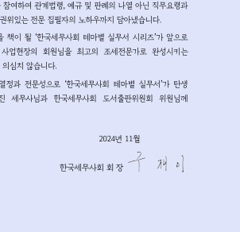

마 국 이 주 마 =e 90 360 xO 6 of Fa *K Me Re Ey =z Xx 3a Op _ RA 300 =, old 기 a xo a - ace no 퍼 러 ot 20 wx KK OF 323 5 Oo ny of + = 도 8 ㅡ KI ° 고 ae Tl 구 4s <2 ok Of ro — +. 0 Ho 폭 Fo Ald jo ns a fe}

나

호

로 =) ~ Lu

는 전 으

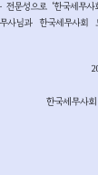

이 하고 원

즈 기념비

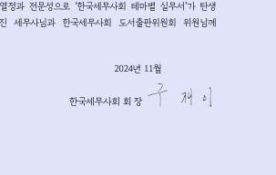

시 회 가 히 Th:

세무

> 관련 ………………………… 9 01. 비과세 한도 상향 eects 9 02. 비과세 대상 추가 9 03. 및 근로자 비과세 확대 …10 04. 비과세 한도 상향 ……………… 10 05. 가액 현실화 …………………… 10 06. 비용 요건 완화 ……………………… 10 07. 차입금 확대 ……… 11 08. 확대 11 09. ASKS 비용 의료비 12 10. 의료비 확대 11. 대한 한시 상향 [ ] saingsansnnaanonaSsAnsnnannsansnnonncoSsANSsonsonsANsAnonAnnASANSsonsAnAsNSANNSA 13 01. 한도 13 02. 및 한도 13 03. 등에 대한 의료비 등

04. 05.

완화 및 이아 13 등 대한 14 등 조정 …………… 14

01. 02. 03. 04. 05. 06. 07. 08. 09. 10. 11. 12. 13. 14. 15. 16. 17. 18. 19. 20. 21.

뜨

뜨

뜨

뜨

72 72 DY by

De

\ 7, 4 oe

oH

oN pm 4N 4N 4N be Gf 포 ao WN NWN

be SN

x mre Ss

-

19h fru HI = | i i

€ 10 이 주

15 = 성터 90000 15 - 0009990000000000000000000000000000000000000000000000000 16 - 생산직 수당

학자금 sasseasseaccasscsccnasscnscassccssscasscesccesscsssnassoaseans 20 - 그 밖의 비과세 소득 ………

근시 그

공제 공제 - = a 아이

공제 SISA] SEER, SB) 00000000000000000000000000000000000000000000000000 - 고

22. 23. 24. 25. 26. 27.

보험료 AS GOSS] 25S 009009000000000000000000000000000000000000000000000000000000000 교육비 SSE 세이 RB) 090000000000000000000000000000000000000000000000000000000000000

월세 41

>» saaseeeenessnsnsccesesneneesnenscoenses 43

01. 02. 03. 04. 05. 06. 07. 08. 09. 10. 11. 12.

ra 을 rR eB cB

ru ce Oe AS 4 of A ol

(N, of ye uc, 패 wh SN

09

8

N 4

제출 59 제출 62 FYE} AYE] AEDS 000009000000000000000000000000 68 eesseseeeseccssssessecsesssnescceesseecsssssnseessens 68

73 01. 73 02. 81 03. 비과세 ERAS 84 04. 특례

05. 06. 07. 08. 09.

………'………… 113 세율

>> (실전편) 125 125

>»»>

01. 02. 03. 04. 그 밖의

05.

한도 감면 181 01. ene 181 02. 182 03. eS 182 191 01. …………………………… 191 02. … ~195 03. 의외 207 04. 및 ……………………………… 212

>

…………… 정산 후 215

느 _

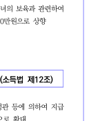

202444 관련

SA SAG 비과세 한도 상향 는 출산, 이하

상향

본인 9 비과세 :

법

느 cor

( 자 TY) sossies 비과세 추가 위하여 정관 등에 의하여 비과세 확대

He 또한 월 한도 : 2024.1.1.0/S

:

402

및 근로자 비과세 확대

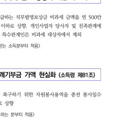

선원 선원 및 위하여 및 비과세 월 월 확대

: 속하는

2 비과세 한도 상향

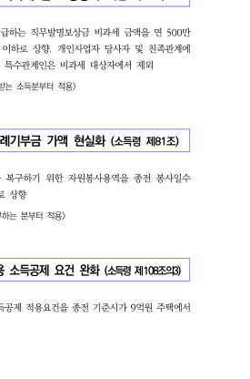

원 종업원, 교직원 및 비과세 FAS 연 SHOWA] 연 상향. 당사자 및 및 그 비과세 제외

:

개 가액

중 위한

상향

12 flo 아

py okt x ue +>

: 2024.4.1. 이후 BEE AZ)

TED) 요건 완화 ase

종전

확대

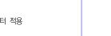

: 2024.1.1. 이후

산

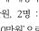

07

(AS! 522)

차입금 확대

금액 a 종전 30081,

ei 종전 이하 이하 또한 at 차입 gos 즉시 기존 되도록 확대. : 2024.1.1. 이후 EVE 적용 2024.1.1. 이후 SHE 적용 (차입금 연장) 2024.1.1. 이후 적용 (차입금 이전) 2024.1.1. 이후

확대

자녀 및 : : (종전 + 확대

: (공제액 상향) 속하는

자녀 전 :

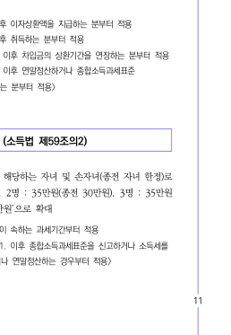

< 터 적용

을

2024.1.1. 추가) 이후

rt ri 4

0 = of

402

비용 의료비 강화

ts 대한 의료비 SA

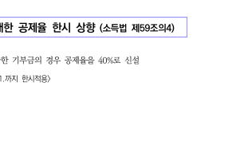

만원 mabe 대한 Al 대한 연간 동일)

12, 4 eo

: 2024.1.1. 이후 AS)

ie 모

비용 의료비 대상 (ASS

비용 중 실제 경우 의료비 ASA 확대

: 2024.1.1. 이후 AS)

ㅣ 대한 한시 상향

개

이 bur

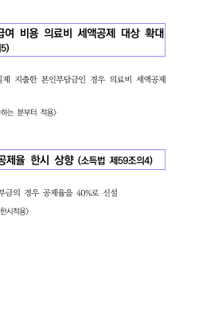

지 3

: 2024. 12.

경우 신설

tH °

[ ]

4 JZ ox 19 Om 때 ai) AM b> ‘ pol

[도 상향 (ASH

종전 A A

: 2024.1.1. 이후

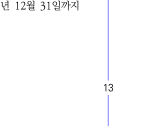

한도 AMO 및 상향 cee

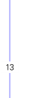

에서 종전 종전 상향

: 2024.1.1. 이후

등에 대한 의료비 등 MUSA 완화 및

월 금액 연장 등에 대한 종전 세액 확대 및 로

2 fe

rt ri 4 ;

402

등 대한 추가

등 등 대한 등 GAS 말함). 또한, 등 하도록 규정

: 2025.12.31.

등 조정

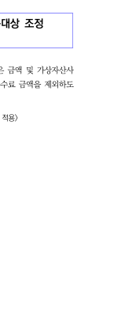

금액 등 중, 받은 및 등에 따른 수수료

록 조정

: 속하는 AS)

HUSA Q&A

rt ri 4

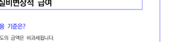

TO 비과세 -

1. 장애인 공동 명의인 ASS 이용할 경우 비과세 되는지?

안됩니다. 배우자 등 대하여는 8 과세 ASS 수 있으나, 부모, 자녀 배우자 외의 공동 명의인 대하여는 비과세 ASS 수 2006.9.20.)

2. 다른 따로 하는지?

아닙니다. 의하여 는 SAS 말하는 것으로 없어도

46013-2726, 1996.9.25.)

비과세 - 급여

1. 비과세 적용

이때, 사규 등에 의하여 그 있고 사회 범위 보는 것이며, 월 모아서 지급

한다 (법인 46013-3228, 1996.11.19.)

2. 초등학교 받는 비과세 되는지?

초등학교 것이며, 그 중 매월 이내

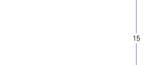

의 SHS 2015.7.7.)

one

At

r

4o=

16

3. 방과 후 하는 경우 비과세 되는지?

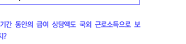

안됩니다. SISSHe} 받은 빙과 후 교육 2 ~

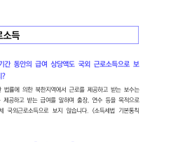

수 또는 SYS 위하여 = 는 것으로 볼 없으므로 비과세 않는 2007.8.31.)

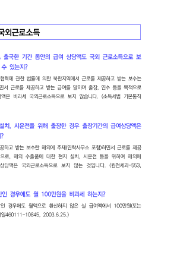

을 4. 따른 위원회 비과세 되는지? 2021.1.1. 이후 GE 위원회 HSS 받지 않는 및 회원 포함) 없이 따라 비과세 되는 해당)

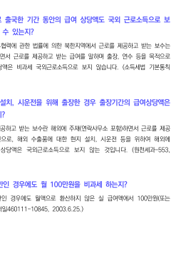

TE) uy

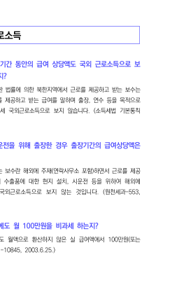

받는 받는 안됩니다. 국외 또는 관한 의한 해외 또는 말하며 출장, 연수 SB 기간 비과세 보지 않습니다. 12-16…1)

2. 대한 현지 설치, 위해 경우 비과세

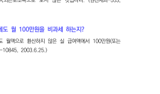

위 받는 아닙니다. 제공 으

고 받는 말하는 것으로, 해외 대한 현지 설치, ALA SB 위하여 경우 보지 않는 2011.9.5.)

하는지? 3. 국외 월 미만인 비과세

미만인 않은 실 2003.6.25.)

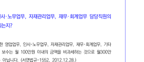

. 비과세 수 있는지? 국외 등에서 HBT 받는 보수 중 월 선박, 국외 선 박 또는 MBSE 받는 경우 월

2007.9.27.)

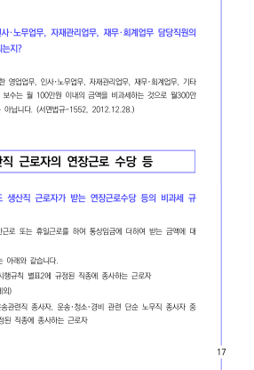

할 등 수 . 해당 국외 이하인 경우 비과세 다음 달로 비과세 수 있는지? 안됩니다. 해당 비과세 선박, 국외 등 국외 BRASS 이하인 경우 그 다음 달로

12-16…4)

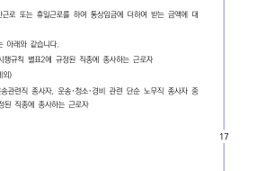

월 . 국외 대해 비과세 되는지? 비과세 됩니다. 다만, 국외 SS 위한 기타 공통 등에 받는 SHS 것으로

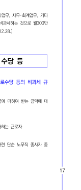

원 SHS 것은 아닙니다. 2012.12.28.)

EN) 비과세 생산직 수당

oln

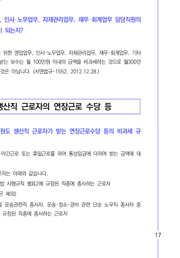

규 1. 아파트 생산직 받는 비과세

적용 받는지?

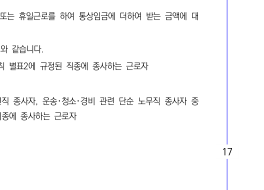

한 하여 아파트 또는 더하여 받는 대 비과세 비과세 생산직 아래와 같습니다.

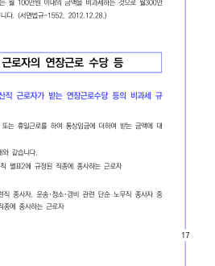

근로자 © 중 ASME x

(9) 종사자, 운전 및 종사자, 관련 단순 노무직 종사자 중

근로자 ASAE

rit + fo

FO

one

At

r

4o=

18

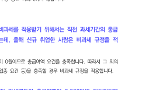

@ 관련 서비스 종사자, 서비스 종사자, 조리 및 음식 서비스직 종사자, 매장 판매 S 사자, 종사자, 통신 관련 판매직 종사자, 및 기타 서비스 단순 노무직 종사자 중 종 시행령

. 수당 등에 대해 비과세

되는지?

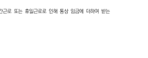

않습니다. CES 않으므로 13 않습니다.

12-17…1)

m

님

r

수당 등 . 생산직 근로자 위해서는 직전 Sa 00

one 하는데, 올해 신규 비과세 A

2 을 따라서 그 외의

경우 비과세

. 생산직 직전

하는지? 아닙니다. 생산직 월정액 급여, 직전 비과세 PIS 2015.9.7.)

. 경우 월정액

아닙니다. 미만인 월정액 않고 실

제로 2009.8.28.)

수당 . 생산직 경우, 비과세 Bet

아닙니다. 생산직 근로자 또는 인해 통상 더하여 받는

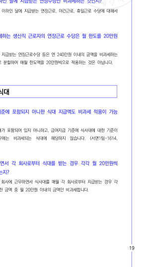

연 관련 —— 급여 중 연 만 중도 SS 월 또는 일할 않습니다. 7. 월정액 급여 이하인 연 하는 것인지? 월정액 이하인 대해서 비과세 8. A 생산직 으로 것인지? 아닙니다. 생산직 근로자 SO] SS SAS 것이며, 것은 아닙니다.

말게 비과세 - 식대

1. 급여 아니한 식대 비과세 가능 한지? 안됩니다. 있지 아니하고, 대한 있지 아니한 APOE 않습니다. 2006.11.30.)

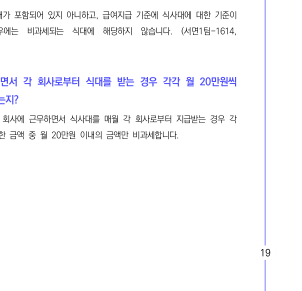

받는 수 받는 월 2. 두 다니면서 각 경우 각각 월 있는지? 안됩니다. 2 이상의 매월 각 경우 각 합한 금액 중

2005.11.3.)

one

At

r

4o=

20

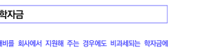

ED) 비과세 -

1. 동일 이하 각각 받는 경우

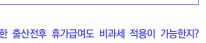

아내 두 사람 모두

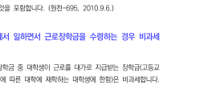

비과세 교육비 같이 별도로 있 는 것이 월

비과세 - 학자금

1. 지원해 주는

아닙니다. 입학금, 수업료, 그 밖의 비과세 것이며, 대학교 원하는 경우 비과세 되지 2007.12.6.)

din

말기: 비과세 - 그 밖의 비과세 소

1. 우선 대위 비과세 가능한지?

따라 ALE 비과세 AWA 미리 대위 ASS AS 2010.9.6.)

2. 대학 재학 중인 해당 일하면서 경우 비과세 되는지?

받는 따라 장학금 중 따른

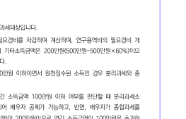

있는 경우 배우자 가능한지? 되며, 연간 계산할 때 비과세, 니다.

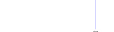

원천 수 경우 받 있습니다. 그러나 경우 전액

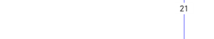

: 경우 않아 됩니다.

re =

주택 있는 경우 받

mio

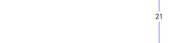

수 A 느 있는지?

수 Of, 있는 경우 받을 있습니다.

과세 연간 HBS 계산할 때 비과세, 분리

. 받은 경우 가능한지?

따라 받은 개

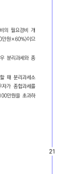

소 은 따라서

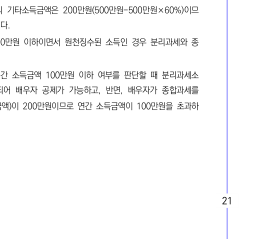

기 fh > 000

in) b

din ou JZ fo}

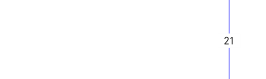

종 수 그러나, 경우 선택할 있습니다

선택한 연간 이하 때 SS 되어 배우자 반면, 선택한 연간

수 Of 배우자 받을 없습니다.

one

At

r

4o=

22

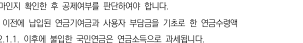

4, ONL 7} A 다른 없는 경우

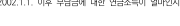

받을 수 있는지?

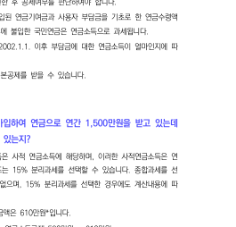

기 때 됩니다. 따라서 A 경우 연간

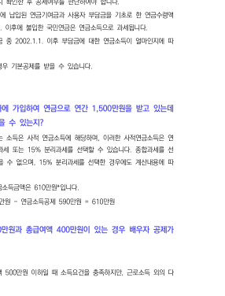

연 . 다른 없는 경우

수 받을 스 있는지?

연금 확인한 여야 합니다.

후 2001.12.31. 사용자 한 2 과세 반면. 2002.1.1. BOR

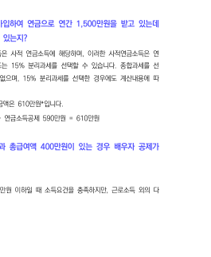

수 따라서 받으시는 중 2002.1.1. 이후 대한 따 라 이하인 경우 받을 있습니다.

w 콜센터: @ 1355

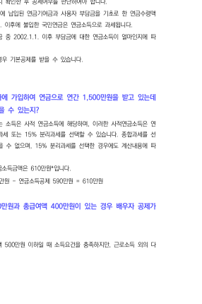

받고 . 연간 있는데

수 대해 받을 있는지?

수 수 ASE 사적 이러한 A 경우 또는 15% 선택할 있습니다. 선 한 없으며, 15% 선택한 따 합니다.

: SASH - =

전

Tu 42

Om

a a

. 있는 경우 배우자

가능한지?

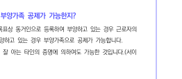

른 있는 타 경우 연간 않습니다.

러나 경우 부동산 소득 Stato} 연간

합니다. 총

WD)

1. 호적상 않는 대한 가능한지? 호적상 않는 있는 경우 실질적인 실제 있는 경우

0 }

잘 아는 가능

니

iit

‘Ol

이 때 대한 그러한 관 46013-12301, 2002.12.23.)

[

수 2. 있는 경우 수 있는지? 안됩니다. 있는 따라 있다고 볼 수 없으므로 없습니다. 2007.10.5.)

4

받을 수 3. 외국인 대한 수 있는지? 외국인 또는 외국인 있는 실제 있습니다.

2010.2.10.)

one

At

r

4o=

24

WD -

1. 대해 받을 수 있는지?

an 주소 또는 AAS 것으로 보는 것이니 있으므로 받을 수 없습니다 2. 대한 누가 것인지?

AGS 실제 있는 또는 받습니다. 50-106-2)

(A -

1. 같이 살다가 다른 있는 위해 경우 대해 받을 수 있는지? 대해 받기 위해서는 주소 또는 7 현실적으로 같이 하여야 하나, 취학, 요양, DHA 또는 주소 또는 일시 도 경우 수

만 7 * : 이하, : 이하

공제 - 부녀자

공제 1. 계신 있 경우 가능한지? 이하인 HSA! 있는 |] 있지 않더라도) 부녀자 적용

rir

. 부녀자 가능한지?

수 부녀자 있습니다. A 2016.12.20. 삭제)

. SUS 것인지?

금 기 받고,

받아야 합니다.

므

@ ABE D

수 으로 있어 실제 차 있을 있습니다.

이가 있는 정확한 합니다.

납부 실제 있는 경우 다. 52-0…1)

수

한 . 전에 가능 한지? 따라 입사 전에 GBS MS (소득, 2004.3.26.)

>

이 수 . 공제 가능한지? 안됩니다. 근로자 공제 배우자, 근로자 본인 없습니다.

또 rit + fo

FO

one

At

r

4o=

26

을. | see 공제 -

1. SHUM 것인지?

수 속하는 습니다.

수 원천 SAS SMS 받는데, TAS 되므로 실제 공제 대 있을 있습니다.

따라서 원천 SYS 정확히

법 52-0…1)

2. 것인지?

있 wm

At

상

득세

아닙니다. 경우 속하는

납 간소화 해당 됩니다. 52-0…1)

3. 입사 전 안됩니다. 근로 제공 기간 중에 빼 한하여 입사 전에 아닙니다. 2006.4.12.)

4. 추가

uy

지

사업

외 산입 : * DEAS 이후 이상) 소득

인 경우 직장

WS) ses 공제 - 원리금

1. 다른 별도 있는 경우 입금 원리금 받을 수 있는지?

안됩니다. 원리금 위해서는 현재 무주택 합니다.

이 때, 동일한 보기 때문에 있는 경우 무주택 원리금 공제

아닙니다.

BHI 가능한지?

임대차 공제

자 합니다. 다만, | 임대차 계약 또는 전후 않는 이내에

경우 오피스텔 위해

공제 - 이자 1. 오피스 부터 저당 대해 공제

시 nul ol 뜨 10

하지 안됩니다. 공제 대상 해당 않습니다. 2004.4.19.)

지 경 2. 공제 해당 실제로 않는 가능한지? 해당 않아도 받을 수 있으나, 아닌 해당 실제 받을 수 있습니다. MEZA MOS HIBS)

one

At

r

4o=

28

~

으로 보는지?

0 34 모 AL 0° [고 lo mn din ‘on [ral] 0 및 모 my lo

또

lo

=

뀌

에

4

ro

hi [고 rok [이 > milo by m la 1 ol ra ox 0 N 39 m 건 on

택

무주택 이하인 또는 당해 주택 장기

것을 등 또는 따른 부터 경우 그 새로 WAS 그 그 소유

그 보는

만, 둘 이상 된 그 속하는 이를 적용

지 않습니다. MO

3 은 0

ri

Fa

st

것인지?

니다. 주택

7 것이 아니라 당해 하여 이하 goles 2006.6.13.)

ti

차입 을 의 이 사람 수 주택 따른 아래와 같습니다 He 본인 본인 ㅇ 본인 배우지 × 본인 본인 + 배우자 본인 * 본인 + 배우자 본인 ㅇ 본인 + 본인 + 본인 배우자 본인 × 경우 Solo] 별 없는 BSS 것으로 봄

주택 SAVE 가능한지?

내에 해당 이상인 경우 해당 범위 이자 2011.8.30.)

oH

공제

아닙니다. 또는 의한 것에 공무원 연금 받을 수 없습니다.

‘zac 1. 이후 4 HSE 적용)

. 경과 전에 조기 경우 금액 을 것인지

받은 아닙니다. 이전 추가 않습니다.

차입금 액 . 타 이상 최초 차입금 의 ZOHO] 각각 있는 경우 대해서도 가능한지? 안됩니다. 여러 차례 최초 있는 경우 초초 (원천

2012.4.10.)

만. |

축 판매용 있는 경우 가능한지? 안됩니다, 판매용 SHS AGS

무주택자 못한 |

. 아파트 이후 가능한지?

가 한 2009.12.31. 이전 이하인

관련 ZOU

one

At

r

4o=

30

WP) 등

. 연간 소득 sail 해 74.

. 맞벌이 합산

이후

이 때, 연도 중에 사실 또는 보 유한 없어야 합니다.

ol

카드 이 당하지 않음. 때 경우 배우자 a Hol! 사용한 BROS YEO ASEM 받을수 있는지?

I>

카드 안됩니다. 대금 아닌 등

= us A 받을 수 있습니다.

on

수 있는지?

rr >

을 이 있는

각자 수 있습니다.

. 올해 결혼 전 친정 수 있는지?

드 종료일 현재 않는 경우 해당 아닙니다. (A10|46013-10376, 2003.2.24.)

. 없는 초과 부모님

Of, 않더라도 연간 있는 경우 이해인 경우, 자녀 또는 등 ASUS 등

수 있습니다.

관련

ml

. SO] 사용한 ASHES

사용한 등 7 않습니다.

iit

하더라도 대상 사용

. 근로자 회사 경우 등

에 대한 적용 받을 수 있는지?

안됩니다. 않습니다.

※ 신청서 등 차

않도록 하여야 합니다.

. 회원권

Je

i re! a Ty rh o2 = a 요 mM jo 290 [고 ain 2 S oO &

입장권 적용

등 입장료 외 식음료, 문회 ae = 기타 MSS 따라 으

주택 대해 받으려면 어떻게 해야 하는지?

) ATS 국세청 홈택스 〉 제보 > 발급

부 2 편 또는 sme ae 힙

수 못한 경우 어떻게 받을 있는지?

제 ) 보 수 못한 경우 사업장 관련 SAY BOAWE- Mens. OSE > ADS 통해 ATE 있습니다

수 신고 접수 후, 관할 SS 통하여 AS 해당 che 여 받을 있습니다.

요

Oo

one

At

r

4o=

32

10. BUS 사면서 가능한지?

경우 즉 것으로 대 경우

한 따라서 무기명 경우 실제 최초로 전에 해당 무기명 발행 및 주민등록번호, 무기명 번호 등 사용자 받아야 합니다.

소 해당 하며 사용자 받기 전에 사용한

ra

중소기업 대한 소득세 감

을 1. 정규직 경우 중소기업 대한 소득세 감면 수 있는지?

가 등에 관한 따라 하다 후 해당 정규직 aigaic 경우, 그 해당 중소기업 대한 소득세 수

2013.1.16.) 2. 청년 종

는?

30 ok

>t

체결일 현재 이상 이하인 AAS 만, 아래 어느 그

현재 빼고 이하인

on

Fa

=

법 - YY, 또는 따른 따 라 및 NPBA PAYS 포함)

Yee) 따른

따른 장교, 및 부사관

그 이직 QO} ASME OME 최초 하 3°

는 발생한

기업 취업자 소득세 다른 분 fe}

시 대하여 WHS + 있는 (이직 불필요)

2016.12.20.)

. 실질적인 독립성 해당

하지 않게 되는 경우 중소기업 대한 소득세 AIS 계속 가능한지?

oh 중소기업 취업자 소득세

없이 | 속하는 으나 실질적 독립성 기준 그 sarin 아니 하게 된 된 수 없습니다. 2013.9.6.)

. 생애 최초로 중소기업 취업자 소득세 수 있는지?

이 중 하지 아닙니다. 2012.1.1. 이후 현재 ALCOA 이상인 사람 또 는 2014.1.1. 감면 경우 것으로 생애 최초 필요 아닙니다 입사 후 이직, > 또는 가능 . 취업자 소득세 않은 채 이미 지금 경우 주소지 . 취업 당시 중소기업 취업자 소득세 기한 내에 못한 경우, 가능한지?

후 아니하고 경과 제출

이 중소기업 대한 소득세 수 있으며,

터 김면 가능) 2012.8.17.)

reoxmere

4o=

34

8. “AMOR 중소기업 취업자 소득세 후에 다시 여성" 으로서 동일한 수 있는지? (다른 도두 가정)

상 “청년” 및 모두

[에 대해서는 여성" 으로서

감 을 나 간 수 있는 '19.05.10)

1. 현재 있고 자녀 자녀 경우 = (17+(2) © 대상) : 자녀 중 이상 수가 (2) :

SAIS Amel 경우 : 연 SAS 경우 : 연 셋째 이상인 경우 : 연

자녀 2. 맞벌이 때

자녀 [남편] OH] © : 중 이상 @ (출산, :

자녀 수가 [부인] OH] ® : 자녀 중 이상 (2) (출산, :

받은 3. 신청할 수 있는지?

자녀 받은 신청할 수 있습니다. 다만, 중복 않습니다. 따라서 장려금 됩니다.

적용

1. 대해 받을 수 있는지? 안됩니다. DCH 않 습니다. DCH 추가 SAS MBAS 수 있습니다.

단 2. 하는 경우 대해서는 가능 한지? 안됩니다. HES] 않으며, 세액 Bag US 수 없습니다. 7LASATY AEST) 않기 위해 MOBS ABU BS

a

않습니다.

3. 중도 경우 받은 대하여 포함) 합니다. rata 대상 아님) 중도 사망, 질병, 파산, 보며, 4%, 따라 니다.

받을 수 1. 맞벌이 경우 는 누가 받게 되는지? 본인 및 배우자 모두 없습니다. 해당

공제

경우 보험료

하는 보장성

40

36

수 2. 대해 받고 있는데, 하는 경우 보험료 가능한지? 장남, 차남 모두 받을 없습니다. 1) 장남 : 직접 않아 못함. 2) 차남 : 하는 않아 못함. 2006.11.17.)

보 3. 맞벌이 경우 ALES

보험료 누가 브

|

수 부부 모두 받을 없습니다. 1) 남편 : 직접 않아 못함.

2) 배우자 : 하는 않아 못함.

차 수 4. 동 자동차 있는 경우 자동 대해 받을 있는지? 안됩니다. 따라 먼저 함께 받는 보험료 적용 아닙니다. 2002.5.1.)

의료비

하여 1. 단 의료비 가능한지? 안됩니다. 않는 2004.4.19.)

2. 의한

안됩니다. 대상 의료 2002.3.11.)

. 출산 전 진료비 경우 의료

비 받을 수 있는지?

안됩니다. AOL 따라 AA} 따른 “출산 전 진료비” 경우, 당해 당해 wear 대상 -471, 2009.2.12.)

해 . 연도 중에 경우 치료 및 대 의료비 받을 수 있는지? 종료일 전에 경우, 사망일 의하여 BAe 것이므로 전일 현재 TRBACINGE 및 ASSO 제한 VEE 위하여 지출

f 대하여는 의료비 MBAS 받을 수 있습니다.

의료비 아닙니다.

때

의료비 진찰, 치료, 위해 이에

. 각막 절제술) 의료비 위한 근시 의료비 2000.12.28.)

. 소속 구급차 의료비

아닌 사설 구급차 이용 BS

주 관련

one

At

r

4o=

38

교육비

의료비

의료비 아닙니다.

. 수 있는지?

경우 않습니다.

10. 자폐증 위해 의료비

해 자격증 소지자 의한 당하지 않으므로 의료비 아닙니다.

받을 수 다만, ms 위한 따라 지정한 교육비 적용 있 습니다.

. 취학 전인 백화점 이상 받은 경우 교육비

안됩니다. 의한 및 관한 따른 학원

대상 수 받을 않아 교육비 없습니다.

원, 보 따른

공제 는 등 일정한

후 과 교육비 세액

따른 2013.8.29.)

. 교육비

제 입학금 등도 교육비

. 국가 않은 및 세액

안됩니다. 따른 초등학교 있는 비인가 입 경우 동 위하여 않습니다. -291, 2013.3.15.)

. 국외 소재 재학 중인 국내 계절 위해 교육비

수 수 학점 경우 있습니다 HE 자학 중인 국내 계 취득한 해당 경우 해당 강하기 위한 2010.1.26.)

등 으로부터 . 학자금 WSS 받은 후 때에 2017.1.1. 받은 전액 받습니다. 다만 상환 CHIE 인하여 금액, 면제 받은 금액, 또는 아닙니다. ※ 2016.12.31. 학자금 받았고, 둔 배우자 SO] 교육비 BAS 있는 이미 금액

받을 수 은 교육비 없습니다.

a [때

i

수 수 공제 받을 . 학자금 WSS 받아 SS 있는지? 안됩니다. 때 있습니다.

후 받을 St, ALU} UE 학자금 SEs 대신 종제

대상 . 대학생 = 자녀 학자금 받아 대학 였는데 간소화 교육비

대학생 학자금 경우 때가 아닌 때 교육비 때문에 학자금 니다.

one

At

r

4o=

40

다만, 학자금 대학생 이 ALO

대하여 교육비 받을 수 있습니다.

9. 근로자 중에 경우 교육비 는지?

‘Olt

공제 교육비 근로 한하여 공제 가능한 것이며, 해당 DAVIS 2002.1.17.)

기부금

1. 해외

r

NI

이 합니다. 보급, 그 밖에 MHS 민법 따라 BYE EE 받아 Mele vise AACS Behm ese 로, 할 것이 SeMne AASANEE 총회 중앙회 SO] A9VSO| Use SAIS AAA 7

rE

Bo

i

2. 기부금

아닙니다. “BRA 참여 및 관한 법률, 따라 기부금

2009.4.9.)

한 등 3. 가능한지? 모두 갖춘 지출 © AEX, 문화, 예술, 교육, 종교, 자선, 학술 SIS 위한 것

(2) 것

관련 ——

적 4. 같은 기부금 중 있는 경우

시

기부금 중 OBA 분과 동시에 있는 경우 © OBE 우선 공제

연도 으 하고 (2) 당해 연도 기부금 한도 경우 당해 기부금

대해서는 빠른 공제

5. 각종 MASH] 못한 기부금, SHS 수 있는지? 안됩니다. 따른 제가 않습니다.

ED a4 nee

월 1. DABS 때에도 가능한지? 2017.1.1. 이후 시 다른 도두 경우 받을 수 있습니다. 홈택스 BAO MBH 입력 하지 않아도 입 2. 학교 내는 수 있는지? 안됩니다. 이하 주택 또는 준 이하인 FAAS 오 IAG, 고시원 Bape ae 경우 BACON 이때, FHS FHS 말하는 것이며, FHS 며 이에 아니하고 주택 하지 않습니다 3. 못한 수 있는지? 안됩니다. 않은 Bal 임차 대하여는 다른 경우 라도 QA MBAS 수 없습니다.

one

At

r

4o=

42

※ 시행령 895 (2) 3 : 따른 약

특 FAAS SEL 같을 것

. SACHA FHS AME SMS 있으나

의 아닌 경우 가능한지? , 경우, 그 별개 보는 것이므로 실제 BS 경우 받을 수 있

습니다.

※ 유사 참조

에 상 상 정하는 관계 있지 않은 경우, 그 상의 보는 것임

('21.06.14)

. BAY 받기 위해서는 있는 경우 받아야 SAE

것인지?

아닙니다. 귀속 받지 않더라도 수 있습

받을 . SHS 수 있는지?

Ol, SHO] 이하인 경우 2019.1.1.

받을 이후 수 있습니다.

Al fo)

세

여

fe)

세

여

매월 발생한 대한 매년 발생한 대한 정확한 AAT 후 매월 추가 징수 또는 환급

을 해 주는 한다. 계속 경우 해당 다음 연도 때에, 중도 경우

=o = 때에 1374 19). 중 있다는 다른 ASO] 있는 경우 다음 도 중 해야 한다.

[참고]

정 종 소득세 1. 경우 대해 후 이에 반해 대해 최 직접

제

(rari S)reo%Nee Int HUTL 어그

Nat

(ceirxim=)roMers JInb-HUrL 0%

Prat rrowuerg or! cod

OAT oh reoxMere 1o>IINk> HUT o> 2H

Leal)

one

At

r

4o=

44

2. BEAST 있는 의해 대한 경우 하지 않아도 된다.

3. 대한 인하여 지 대하여는 해당 해당 한다.

loll ol

(1) 10.31 맞춰 조정) 국세청 편리한 각 개인별 연말:

각

수 ox 시 비니

(2) 12.31 맞춰 조정) 공지

(3) 1.10 맞춰 조정) 일정 및

소득 (4) 및 수취 맞춰 조정) /15 국세청 간소화 서비스 오픈, 간소화 않 9 간소화 서비스 오류 방지

(5) 1.31 맞춰 조정)

bl

급 작성, 이는

a HOR 초기 연간 소득자

© 2.10 맞춰 조정)

소득 및 제출

(7) 2.28 맞춰 조정)

관련 검토 후

(8) 3.5 맞춰 조정) 교부, 내용 확인

및 수정 요청

(9) 3.10

| fol

제출, 제출

[고

는 rie re ox + Oo og 03 아이 a = a 때 ye = J2 10 a it fe S C ㅁ rir ~ 18 =

중 신고

지급, 직접 지급

ANS ——

로 제 말 금 이 il a 솔 : 5

(reirxin=)reoMOr2 JIN- HUT 여고

rrorMOre or! coz

주

Fr0% OHS 101 10> 1Inb> HUT om 22

one

At

r

4o=

46

WE

해당 지급

하 =

는 근 때에 해야 18. 경우 자가 해야 한다. 이 경우 관련 증 YS 시 않을 그대로 APPS 한다. (1) 이 받는 경우 1) 근로자 받는 ALS 주된 근무지 를 정하고 경우 경우 FESPA] 한다. QA eT

© 복수 근로자

근 1. 모는

ala

않는

추후

별도로

하지 한다. 만일 않는 경우 적

의

받지 아니

수 각각 과다한 발생할 있으므로

받을 경우

ce 16

만일, 발생할

(2) 대한

on

당 새로운 종전

ol

at

당 속하는 받은 BRASS 현 2

BAS 경우 그 종전 근무

Pal

o7 만일, 종전

+p Ei ol 유 [에

[참고 복수 신고

가 수 한다. 신 통해 각 파악할 있다. 본 만일, 원천 않거나 늦게 않는다. 존재할 경우 홈택스 합산

(3) 등 함께 있는 경우

연 에서 받은 새로운 받은 더한

종전 근무 못하 였다면 현 현 대해서만 추후 근로 자가 합산 Ich 만일

락

(4 경우

중 대한 해당 CEASA

만을

고 TH ro 오 rat A

ac)

한다. AM 만일 경우

ANS ——

로 1 제 신 장 = x a ㅣ 0 i

25 ot

(rin )reoxwere JIN-> HUT o:

rrorMOre or! coz

뚜

Fr0% OHS 101 10> 1Inb> HUT om 22

한다는

흐

하여야

즉시 연말 a

한다.

학 할

i

획 왁

OT 즈

이

원천 터 징수

는 워 느 Cc OH

2009.11.26.)

|

전 건

브 『

있는 과세

한 자로 bd. 워

924) Ha 근로자

의

히

|

징수

(5) 하지 않은

, 의

FAI 아니

이 °

t

uw

oO 2 글

정시

그 [때

}:

해

Cc oS

하고 그 소득세

으

을 137-0…2,

t

정산 관할

f

100 IH Old ‘Kf

! 제

| 충당 퇴직

으

|

2014.

tH

so 으

속고

득의 =

t

인 ㅎ

F.

되기 전에 현

t

인

S|

Sh

re 는 경우 경우

에 대 Ay

4

coum

이

우 추인 =I

ZO = =

그

지 HE 것이며,

느 [때

히

did

버

ㄴㄴ

[는 때에

HHO 번도 히

4 Al

=

서제 KEE 전

신설 8.19.) 회

137-0…3). 또한, Ap

스 Des fe}

계

3) 2

80800

벽 2

A

co 근무 ASE 근무

인 근로

번 Leeu oF

=

전 경우

이 다.

로

중

46013-3808. 1990.10.25.)

——

개 시기

(1) 경우

해당 2 급한

경우 하여

(2) 경우

지 =e | 없는

2 지

Te

중도 자의

ra Koya

로 제 1 장 = x a ㅣ 신 0 i

25 ot

(rin )reoxwere JIN-> HUT o:

이 한다. 경우 SE 경우 받기 전어

한다. 만일 않는다

해 면 다음

있다.

필수]

1.

수

경우 그 처음

or! coz

Pe

때 4]

음 속하는 다음달 137-0…4)

2. 중도 취직 또는 경우 특별 있다.

연 3. 납부 받은

수 받을 한하여

4. '0'

하지 않아도 된다.

에는 없으므로

Fr0% OHS 101 10> 1Inb> HUT om 22

(3) AWE 경우

1) 대한 한 후 당해 2 |

근 로 때에는 때에 다시

2) 의해 경우 당초 ASAI!

이고, 다음달 VARA] MS 경우

글 ato

그 다음달 20-38…3).

소 하는 3) 그 지난 후 판결, 화해 등에 의해 따라 SMS 판결 등에 속하는 다음 다음달 것으로 48)

시 [필수] 가산세 추가 기한 내 경우 아니한다.

(4) 경우

다 이 받은 신고 CRS SOC. 따라서 속하는 과세 법인세 및 ABATE 또는 법인세 결정 또는 및 경우 반 기별 신고일 다음달

one

At

r

402

50

fr

ilo

uo rok

ANS ——

1. : 크게 법인세 등 경정 Usd}. 법인세 통해 동해

2. 정상적으로 당초 것이 아니라 정상적인 파라 것 이다.

3. X4d 법인세 경우 (1) 작성 (2) 동시에 선택 (3) : SY : 구속

라면 서로 각각 제출)

4. xo 대상자 동일)

5. 대상자 동일)

6. 없음

[필수 발생시 작성 및

로 신 제 1 장 = x a ㅣ 0 i

Hn at

(rin )reoxwere JIN-> HUT o:

(5) 놓친 경우

1) 근로자 본인

하는 (7) 주소지

or! coz

rm

(2) 주소지

MAS 기한 내 한하여 내)

제 t = 기한 내

한하여 내)

Fr0% OHS 101 10> 1Inb> HUT om 22

징

0)

과

흐

T

천 전

천

5

징수

전상

Site 원

하고 12 A.

느

ㄴㄴ

ㄴㄴ

때 귀속 대

}

é 할

그 =

oro

을 초 추 때에

APA

= i

t

20254 BAS 자

4.

[때

자의 경우

~

=|

Lhe

별 징

가 르르

원 추 추 NHS 그 다음

원

2)

이 10 2 10 기 자 가 이 개 4 KY ld S ee zo Qh RO iol af xe 94 관 o Fe % = to x x ny 도 은 i i Fi oF 그 iu a x au a x 5 o 4 wo & Q a“ KY = x 므 ge LS #0 iol Ba FS KO KIO = oly 22 000 ot m 뽀 es © 27 Fo He F 가 eh | x oz RF 고 퍼 5 = 40 atl ㅎ ial a EY (DN 중 djs an a ofl" 뽀 voll mo x 몰 줍 q a S HS ur go Ey 기 roll 20 때 my 때 Rd 중 = i ob 「 Ful] ! io 맑 16 요 nm oe ee 04 0 My 6 고 은 아이비 백개 < ia an gi a ou RY x 4 z i a 된 과 x0 63 = oS om FP ly = ul ea me x 는 on ur 4 oF Ok +o OF io 매 이 흐 of 마 n 가오 +k + = 버 : KO 마 KO ial KO 
A Da RO ar 효 때 our "더 즈데 MS aw gr 가 Sh 버커 그 기 x AU 아 유 비티 브 oy ot on a @ = tp aes 8 10 = 훼 에 무형 9 01 & 0 al ah 1S 가 od NT 5) 0 RO ow AY DF I an 때 패 m Oo <| oun 윈 녀 ol 84 gil JD io poled 40 = 00 RO 은 oS Joa” 존더 = ih & aT K 에 가 OW =z x za 고 뽀 0 =] Hou ob Xe suk 0 Pm eX 후 도 De a Ml ert ar ur — ar or SD ok 파 ind i 운 Le So a] 기 마 끄 0 <Ee # S790 | 일 & FE 인 ㅎㅎ id Ty oi . WY OS 돋 가 Bl An wx? =r Ik gl of 5 UP yy 0 zo 10 내 TH mz 6 30 N 더 헌 a oH ral 삐 그 20 매 주 oy + So a Si mv aH oad 쇼 - 푸 tem 2 Dw pore = - 5 뽀 op K 존 jo + mo po UM oe yg HO ay RO 40 ob | it cr eo DR RK HO Hf RO nO p= KI Hr 차 »p ay oko WHEE pots 2 nS Fue di N RO op nee oneg se tao he 후 i 고 호 긍 ae hs 214 [3 of JW Jl 16 nO < BD

oa X iol wumtsSs 동 JR 2 Wo \ OM 족

wm Hae ke FO iS) © ©

Bos a

a

은

53

one

At

r

4o=

54

(ASH 411432)

= Bae Shite 해당 그

그

oF ㄴ

발급

2) 해당 중도 경 속하는 탈의 다음 탈 발급

속하는

3) 일용직 경우

득의 속하는 다음달

4) BAS

경우 이를 지체 없이

ASSN] 경우

ㅠ OUCUT

한다.

iS 2a nu ya

WO)

및

(1) 개요

이 납부 후 한다. 경우

할 없는 한다.

(2)

는 귀속 후

한다.

(3)

1) 의의 직전

속하는

가 jn <u 1 60641 eNOS (STH 2) NO MU ㅣ 84600 FRO-<I( QU. 062) 00010 848 60604 Fao x <1 sH0 11 FOr BiewROe 0 ok Kt ROZI

연말

득 —

160 HF io o! Tk x J 20 39 = nd 200 = 매 a nm 에 TH 10 Fa a 2 a & ot ok gi at = x0 “oS S28 lo tS. Ju 핀 = oll 2 tox K oft K oo 버 Sl m Bl 00 oS ak 노로 후 is 에 꼬 rr a i gy 7s an 7 s 벅 는 Bis Ss 2h ay 18 gl i x 8 & cue ez 에 Me Bd OF 2 o cw 더 AR oom RE au iz ao —— x= x o 은 age hes T= ze oa ^ iol 0 os meee 4 mu = 웅봉 pall ‘0 RO 09 x ur 유포 귀천 야음 ‘ol oe 2 £ 8 = 중 2 Tr KO on & <r z 8 거들 ju UO or 39 x 20S 20 KO =a g§ wa 기하 io 피 & 40 mu OF =! Kf ok gS x alu 그이 효 x ol 돌 De S No KO 20 은 폼 전 을 ap WH KO BI oy) Bu 때 기우 se 우 떻 Bi 몰 xo i 애매 ol ate 위 을 등 oF 60 i Eze So 2a Ke = 2 mS 개 2 Yo pl i 52% oes ma gas 0” 조 cs pe 고 igh 100 10 He 빅 원 © i! ow St = a ur R 호 Hb 보구 Bes KO Bs 30 2 an th ES gee 중 모 삐 0 호호 a K Rela ees as K & ip 10 Xx aos uj ya om =» 0 By = = 을 ap = 40 dl ww 더 기 od 기 MM © uM ay ol IS 와 Qu 띠 gy RO 중 더 고 Kee eo 22 aK OK Nz mg FS az 일 므 아 ae So 회 ry ※ S82 eek < gare 40 was ox zm 전 ES Fo 5 ee i 과 at iu ae 4 기 하 os wz Xx Ol nM UT 미 ‘tol +n ol afl 나 삐 ty ot iF 뉴 ol oF 더 배 au Ko <| OF 내 au 0 mat = 문호 유 2 과 은 과 꼬맹 > 4 80 Kl wo Ue on 피 이 두 주 에마 너 An a 20 3 o 마 OH = — 3 ga ot * al 붉 mB 1 moo 9° <x 0 io 뿌르 와 € 은 월수 gl ot | mS at we 2 jo <Hou ee 호 주 숭 cat ge 53 3 ree zl Feo 2k x 군하 oe 고 © 16 a +N on m 의 =z = ob + KO ol 에 SL 5 a @ 0 tol we ao a = @ KI Ki zo 에 © = - 30 16 U 해 고 a ml OF 억 <1 N Bg eee es qg eg & Dmx zt Sa a 시 을 A 기 주 트 od ze J al oy an 이 버 후 중 res 해 슨 rm eu 는 An ae 5 버 Sy Mo aw au 원 ow qd 주 은 레마 a = fe: © 9 그어 fo 4 a Ae m2 ㅣ

55

40

따른 가산세

소득 달리 BAS 받은 과소 더하여 된다. (1) 등 1)

USI 아니한 또는 SAS 다음 합한

@ 아니한 세액 또는 닌

AL

금액

AL

© 아니한 세액 또는

조합

할 2) 국가 가산세 다만, 공무원 받아 국가 하여야 MHS 그 기간 내에 일반

같이 YF 하여야

등 [필수] 적용

© 또는

사 다만, 국가 자가

등 실과 다르게 받은 경우 국가 SAS 해당 납부

® 미군

도 5) 것이고 50% 것임. 6) : 다음 SHE 기간

7) 2019.2.12. 3/10,000, 2022.2.15. 적용

——

기한 내에 않거나 경우 않은 5O%(D+O2 YS 10%)S SHES | 경우 SASS Says

다 @ x 수 (01 아니 Od

제 il

로 말 이 금 a 솔 :

한 세액 또는 아니한 세액 또는

따른 지난 지날 4

+

x22/100/000 .

글

REY a

연 3) é

할 자가 경우 결정 등에 따라 a 더

편

(2) 및

한 한 거나 경우 SUS

[의

or! coz

Lat

등 8) 가산세 없고 받는 것을 미리 알고 경우

Fr0% OHS 101 10> 1Inb> HUT om 22

one

At

r

4o=

58

구분 지난 후 이내 경우 90% 지난 후 초과 이내 경우 75% 지난 후 초과 이내 경우 50% 지난 후 초과 이내 경우 30% 지난 후 초과 이내 경우 208 지난 후 초과 이내 경우 10%

+ 발생한 couse « 인한 BPRS 6090

3) 않거나

경우

01 xX X 22/100,000 (3) X X 22/100,000

이

하거나 현저히 Leto] 하는 위계 SS 통해 포 환급, 것으로, 들어 거짓 증빙, 거짓 작성 및 말함

ANS ——

게

[참고] 가산세 om

AAS MAILS OL VATE IIE WALD 수 등 것임 원 여

18 0

oe

근 한 후 및 잘못 직접 가산세 및 3. 부당한 경우 자가 경우 세가 2009.6.9.).

로 제 신 1 장 = x a ㅣ 0 i

MINE

를 수 및 brie) dial eel aol 경우 Caves 근로자 Bel 오류 아닌 파악 후 자가 직접 대한 줄일 있을 것으로

peEe

(rin )reoxwere JIN-> HUT o:

rrorMOre or! coz

vasa 제출

를 한 는 후 ane WY 또는 ee 휴업일, 또 속하는 달 관할

Pe

이

소득 및 10) 중 부과 ' 받는 흔하다. 11) 1. 3.10 : 소득 봉사료 2. 말일 : 그 외

무 rok

Fr0% OHS 101 10> 1Inb> HUT om 22

one

At

r

4o=

60

(1)

(2)

자는 반드시 그 ASO 대한 한다. 따른다.

제출

제출

하는 ASE

는 것으

히 로써 원활한 위해 연간 최

종 완료

흐 Ta

가산세

할 자가 기한 내에

가 기재된 다른 경우 또는

‘Olt

가산 1) ABO] 아니한 경우

CHAS

r

(1) 미제출

므

경우 내에 5%15))

(2) 지급

= = 그 Mu AL ok ol

다른 경

12) 13) 14) 15) 16)

관련 법인세 또는 소득세 것임. 적용됨.

불분명 사유

일 내에 경우 0.6%14)).

의 30 on ou 18 190 x 또

확 © 또는 주소, 성명, 호, 종류, ASAE 또는 적지

or

등 수 없는 경우

등 수 없는 경우

개띠

@ 또는 주소, 성명, 주민

oln

ANS ——

경우 AMI 다른 경우 해당 0.25%) 2) 가산세 한도

따른 아닌 veya 한다. 다만, 경우 해당

로 제 1 장 = x a ㅣ 신 0 a

3)

2 PINs

lo}

TT:

적 © 당초 HSS 이를 nao 경우 대해서

(2) 또는

2 호, 종류, 또는 적지 잘못 적어 지급

oTT

수 AMS 확인할 없는 ARE 그 T

(rin )reoxwere JIN-> HUT o:

wa OTM miro

@ HOB Z a 3 a 2012.5.11.) 점 @ 소득자 잘못 신고, a 경우 ; 2011.11.2.) a

경 우는 휴업 또는 경우 휴업일 또는 속하는 다음 다음달 한다.

번호, 종류, 또는 적지 oe

Fr0% OHS 101 reoMSre 10> 1Inb> HUT om 22

one

At

r

402

62

(4)

(5)

정이 없으므로 반드시

수 자 정 따른 의하여 디스켓 등 전자적 로 야 한다. 이 경우 통해 제출할 수도 또한, 직전 수 미만인 또는 따른 이하인 자는 문서 할 다만, 또는 법인, 제출할

ED) zomg

제출

(1) 의의

소득세 있는 대리, 위임, 납

원 사업자 그 속하는 마지막 달 다음 폐업 또는 경우 휴업일 속하는 다음달 관할 3).

(2) 가산세

1) 미제출 7

산세

하는 자가 그 아니한 경우

에는 아니한

|

17) 2026.1.1. 이후 지급일

이 달 속하는 다음 변경

2) 불분명 등 가산세

——

하거나 다른 경우

하는 자가 불분명 해당

3) 가산세 하는 자가 지난 후 이내에 해당

제 1 장 로 = x a ㅣ 신 0 a

이 연 정 산 이 한다. (3) 4 xt 수 자 2 188 2 의하여 디스켓 등 전자적 여야 경우 통해 제출할 + 1645 i 38). 또한, 직전 MBS! 미만인 또는 상시 i 따른 이하인 자는 j 할 481). 다만, 국가 = 또는 법인, EME 제출할 + 3 xt 4). 청 관련 및 가산세

지 이 출 의 0.25% 제출 기 보 리 2 구분 | ESM 종류 | | 원칙 | 가산세 50% 경감 x 4 속하는 경과 후 . TEAS 글 다음 달 개월 이내 지연 2 | | 71 이내 중 말일 2 미 후 rel 미제출 | | WE | 속하는 | ‘ae ane i wal 달 다음 말일 as is 후 4 매월 | 속하는 경과 후 a it

reoxmere

4o=

64

__ TRIAS 구분 ㅣ 종류 | 원칙 | 가산세 50% 경감 월 이내 지연 달 다음 달 말일 제출 근로, 퇴직, 사업 다음 연도 ~ 경과 후 1% | 이내 지연 이자, 배당, 기타 으 제출 다음 연도 말 | | 르이 속하는 | 다음 달 말일 aug} ASS 매월 0.25% 또는 속하는 ne 다음 말일 가산세 경감 없음 른 i 경우 퇴직, 사업 다음 연도 1% 이자, 배당, 다음 연도 말 rs ※ 되는 용역 중 등 AEE 매월 제출) 아래 하고 말한다. - 없이 SAS 하고 WE 받는 용역 - 라디오, WHS SB 통하여 또는 심사 SB 보수 S| 받는

변호사, 세무사, 건축사, 변리사 그 지식

용역 받고 용역 - 그 외 없이 수당 받고

중 대한

으 oe

못했지만

Olt

202514 22

r

※ 모두 않은 경 가산세 모두 않은

——

한하여

둘 중 높은

(=) 만 다만, 사오 ASE

서 제출 모두

※ 제출

AHS] 경우 WS 위해 경우 지급 한다

ons

적용). (2023.2.28, 이후

필수] 비과세 포함 여부 wae 비과세 항목 더 부 ASW 12 가목 Yo] 받는 급여 × 12 나목 따라 받는 급여 × 따라 받는 등 × 등에 따라 받는 등 × 따라 받는 등 × 등에 따라 받는 등 × ase 2x30 yy TUS oe 받는 한함) 및 사목 등에 따라 등 × 12% 아목 6 등) × ×

제 1 장 로 = x a ㅣ 신 0 i

Hn at

(rin )reoxwere JIN-> HUT o:

rrorMOre or! coz

rm

Fr0% OHS 101 reoMSre 10> 1Inb> HUT om 22

402

법 조 문 비과세 항목 fe i ASB 12 의해 제복 등) x 12 9 S449 등) 이 12 12 중 등 | ㅇ 12 12 - ㅇㅇ 12 12 따른 | ㅇ 12 12 등) 이 12 12 등) 0 12 13 6 12 13 인건) ㅣ ㅇ 12 이 12 6 12 받는 급여) 6 12 이 종사자 ° 12 소속 규약 또 는 소속 의결 결정된 지급 따라 종교 BSS 위하여 How 사용할 금액 및 물품) 또는 대한 ㅇ 및 x 2% BA 따라 받는 연금 x 2K 위해 군인 Bo] 받는 ㅇ 하목 군인 경우 해당 급여 |x 거목 16 O 근로 보수) (0

ANS ——

법조 문 비과세 항목 he 4259 16 © 149] 근로 보수) (0 16 © ©

로 말 이 제 il a 금 솔 : 5

12K 3S 등에 따라 사용자 x

등 생산직 등에 ㅇ 비과세 이하) ㅇ

7 현물 급식 × 2

be 40 때 N by we

fol

| 목 출산, 보육 관련 O

> 40 N EN loli 또 Ja

Ww

등 보수 ×

Nv i ve

수 40

fol

받는 28 따라 장학금

Nv i ve

오 i

fol

O};O

453 1793 비과세

JInb-HUrL 0%

산 이 이 12 3 의 3 | 등 0 0 금 등 × 13 0 비과세 비과세 75%, 100%) 외국인 기술자 소득세 70%) ㅇ 시 대한 ㅣ ㅇ said seg 및 대한 소득세 감면 50%, 90%) 내국인 대한 소득세 감면

청년 등에 대한 소득세 70%, 90%)

소득세 교수) ㅇ

Fr0% OHS 101 10> 1Inb> HUT om 22

402

WD ete) 세무서

(1) 의료비

시 되는 가 있는 대해서는 제출할 때에 해당 테이프 또는 관할

(2)

또는 할 때 기부금 대해서는 제출할 때에 해당 기부

테이프 또는

00

=

(1) ARAM 구분

매우 중요 하다. 구분 대해 (1)

SAS 두거나 이상 AAS = 하고, 아닌

= ASA 2%),

[필수

1. BA 같이 하는 가족 및 유무 등 객관적 따라

2. 주소지 외의 장소 증 걸쳐 BABA 같이 밀접한 일반 적 BAS 말한다.

하는 (2) 판정 1) FAS 가진 것으로 보는 © 이상 것을 SA Bow 가진 때

(2) 있고, 그 직업 및 비추어 이상 것으로 때

me

2) 거주 EL 자가 없는 것으로 보는 외국 얻은 없 고 그 직업 및 비추어 다시 주로

3)

는 선박 또는 WAS 장소 또는 기간 외의

는 느 있는 때에는 해당 있는 것

에 이 Om Pal = ol Tir ow ft i S

의 (3) 42) © ALS = (2) 두고 있던 출국 후 다시 가족 등에 비추어 그 관광, 치료 명 일시적인 것으로 때에는 둔 본다.

N

inte)

다음

ANS ——

로 제 1 장 = x a ㅣ 신 0 a

Hn at

(rin )reoxwere JIN-> HUT o:

rrorMOre or! coz

rm

Fr0% OHS 101 reoMSre 10> 1Inb> HUT om 22

reoxmere

4o=

70

(9) ALS E 이 동안 이상인 183Y 상 둔 것으로 본다.

이 ® 경우 SB ; 명백하게 일시적인 것으로 때에는 해당 둔

으로 보지 아니한다.

되는 (4) 거주자 또는 되는 1) 시기 0) = 날 (@ FAS AUO 있는 것으로 보는 BAYEE

령 38} 및 한함)

2) 되는 날 (@ ALS = 되는 날 시기 © 주소 또는 국외 OMS 위하여 다음 없거나 있는 것으로 보는 ARIE 다 음 및 한량)

(5) 거주자 판정 공무원, 또는 해외 등에

직 또는 10008

ote

접 또는 간접 한정).

1. 외교관 등 의한 1-0…3) 자는 있는지 여부 및 국내 그 따라 본다. © 그 속하는 가족. 한다.

ANS ——

의한 및 그들의 가족. 다만, 합중국 있다고 한다.

@ to oh

2. 등에 임원 또는 1-3…1)

거주자 © 거주자 또는 또는 임원 또는 AAS 보아 종료 후 것으로 되는 때에는 국적 또는 본다. © 준하여 있는 자가 또는 인의 것으로 본다.

로 제 1 신 장 = x a ㅣ 0 a

PINs 2

거주자 © 따른 및

(rin )reoxwere JIN-> HUT 0

소득 주 거 자 구분 비거주자 모든 (해당 종료일 전부터 ALS

자 과세 fe 보르 조디 가이저 이라기 법위 EZRISL 이하인 외국인 aac

중 소득 발생한 경우 대해서만 과세)

or! coz

rm

(7)

1) ® 받는 급여

거주자 또는 및 승무

받는 급여 (9) 임원 받는 급여

@ 따라 금액

Fr0% OHS 101 10> 1Inb> HUT om 22

산

r

4o=

72

eS ic

2) 122%) 로

0 ru

있는 BAAS] 대한

관한 WIS

다만, 중

를 하지

faa]

[예규 : 1997.02.06]

다. 비거주자 본인 외에 대한 버러 및 아니

없는 대한 소득세 및 비거주자

근

산 계산할 때 ASH ASIA

것임.

3) 대한

© 종료일 현재 대한민국 BAO] 없는 거주자 중 비거주자 중

「 수 있다.

는 외국인 외국인 ISA USS A 후 선택할 수

소 이 로 한 제 ® 외국인 임원 또는 서 최초로 경우 SUI 수 적용 받는 최초로 제공 이내에 BUS TAVITA] 받는 다한 ASME 득세 해당 곱한 SAS 할 있다 경우 ASA 및 따른 공제, 감면 및 관한 아니하며 해당 아니한다.

© 대한

18) 대한민국 가진 아님.

연말

하는 때에

무자, 관

(4

ABO

SOLS

[여야 한다.

매월

때

구하고 해당

근로자 [참고] 외국인

1. 외국인 4 능하다.

수 할 2. 외국인 경우 있다.

수 | 있다.

년근 2 Ww

가 국인

가 매월 비과세 포함한 총

3. 하지 & AS 후 단일 경우 다른 않는다.

수 았을 경우 있다.

는 이와 유사한 계

의하여

의 HU uu of 리

간에 받

는

(2) 주주

는 이와 유사

금 총회 또는 이에 준 @ 따라 @

받는

소 하는 따라 받는

소득 속하지

——

제 1 장 로 신 = x a ㅣ 0 i

Hn at

(rin )reoxwere JIN-> HUT o:

rrorMOre or! coz

rm

Fr0% OHS 101 reoMSre 10> 1Inb> HUT om 22

one

At

r

4o=

74

© EE 재직 중에 해 다

[참고] 12-0...3) ® BW] 특별히 있는 경우 외에는 것으로 한다.

따른 AWS 말한다

20-0...5)

va

특별한 능력 또는 우수한 있는

법 따른 한다. © 의한 내

© rr

I

는 조건) 당해 따른 여 각 한다.

이

브 도래

(2)

0)

@

여 것이 아니한 급여

받는

a ㅎㅎ T

기 가 받는 그 ㅁㅁ 포함)

19) 시행령

1.

aRwWN

니 oY 30 때 ox

등 인의 회장, 사장, 부사장, 이사장, 및 구성원

수 내 ro

이사 및 또는

ro [: jor

고

>= a

자 HO] 준하는

위 받는 포함) 기타 이와 유사한 것으로서

wie

ANS ——

로 vido] WE 위해 ale AOL 등록금 등 매월 Vase] sans cr 졸업 후 당초 따라 당해 거나 조건부 의해 당해 금액 SES 자의 보아 하는

로 장 제 1 = x a ㅣ 신 0 i

[참교] 학자금, 장학금 등

1. 해당 받는

2. 의해 퇴직 후 동안 당해 경우 그

3. 위해 대학원 등록금 등 매월 장학금 졸업 후 당초 따라 당해 반환 받거나 Wee Wai 조건부 dose Astadel 당해 근로

를 한다. 금액 ATT 자의 보아

25 고

(rin )reoxwere JIN-> HUT 0

기타 이와 유사한 성

인

or! coz

Pe

가 받는 eeinel 관한 aol GE exon ES eae 모집, 권유

받는 또는 대가, 그 밖에 이와 유사한 급여

이 기타 이와 유사한 급여, 총

액 . 월 한도 내의 기타 음식물 한함)

. 의해 할 자가 제복, 제모, 제화

수작업 또는 그 직장 시험실, 등)

분 © FHS 얻는 ASO 중 보지 제외)

Fr0% OHS 101 10> 1Inb> HUT om 22

산

r

4o=

76

D

HBO] 구입 ㆍ

a TAT

저리 또는

대여 얻는 중소기업 제외)

및 그 밖에 이와 유사한 성

©

10 a 얻는 구입

질의 급여

또는 급여

00

기타 이와 종업원 또는 그 배우지

ont 고

또는 SAS 사용시

oH

ra!

비과세

유사한 급여

. 다만,

기타 이와 유사한

om

않는 tre 나

보지

연

it

및 그 밖의 하는 그 ao

보험료

[원

09 퇴 휴가

© 만료 전 또는

성 기타 이와 유사한

SE

중 아니하고

급여

보험료

aor

ral

환급금

a!

임원 또는 해당 법인 또는 해당 있는 부터 HOWE 해당 법인 등에서 기간 중 행사 실제 말하며,

국가 또는

수당 등에 관한

관련 공무

공 등에 따라

직

——

제 il

로 말 정 a 금 as a

이 론 5

[참고] 퇴직금 중 보는 22% 3a)

1. 경우 본다.

제

2

장 년

.

we ag 늘

소

1 부터 é

일 (2020 a

정 부터 1 (20124 18

산

부터 일 rs)

제 부터 20194 12 근무

의 월 1 1 기간 ~ a7) “1 * 12 *3+ amo a “I 12 xe

년 미만인 2 '

근 3 간이 미만 해당

민 해 더

말 으로 당 한다) 동

산 으로 한다) 동 안 총

세 안 총

의

4

2. 임원 않으므로 반드시 임원 한다.

소득 (4 1) 위한 사용자 적립액

수 지급 선택할 없는 것

Fr0% OHS 101 10> 1Inb> HUT om 22

402

rat on

로서 정하는 따라

필수] 정하는 목적 요건

SS 선택할 수 없는 것으로서 정하는 다음

각 호의 도두 적립 말한다.

되는 1. 따른 가입

이 US 이하 같다) AY 것. 다만, 각 다음 각

어느 HE 아니할 것을 선택할 수 있는 한다.

가. AS 따른 적립 최초로 최초로 게 된 적립 이미 있는 보장

되는 a, AMA 따라 최초로 가입 말한다)

날 호의 적립

것 할 때 적립 임의로 변경할 수 없는 적립 그에 따리

도 0 by

시

는 것 적립 따른 같은 따른 또는 따른 위하여 A [에 있을 것 DCY Aa 및 따른 위해 설정

2 1 시 pe 고 고

의 ba >

한 로 하고 2) 보험료 따른 위해 및 수익자 당해 Melo] 보지 Of

20-38…1)

장학금 등 의한 사내 동 인해 HFSS 당해

보지 2010.04.29.) 따라서 노동부

Xt

ANS ——

근 받은 장학금

on 아니한다.

4) 경조금 그 AS 경조금 중

의 이를 보지

로 장 제 1 = x a ㅣ 신 0 i

(5) WASH 32)

소득 내 과 세 소득자 ㅣ | 과세 여부 비 교 국 | 모든

과 세 | 과 세 a 외 | 외국인 과세 ay 대해서만 과세

국 | 외 경우

PINs 2

(rin )reoxwere JIN-> HUT o:

(6) 따른 구분

저

3

연 장 1) 과세 : 매월 또는 해야 한다.

가 해 세 점 2) 아닌 과세 : 근로자 직접 다음 소득세 해야 한다.

의

rm

20) 외국인 해당 동안 AB 둔 이하인 국외 경우, 대해 서만

21) BRAS 중 아닌

© 또는 받는

의 소득 ® 있는 비거주자 또는 또는 받는 DEAS 및 다만, 계산할 때 또는 및 있는 또는 받는 중 따라

Fr0% OHS 101 10> 1Inb> HUT om 22

402

ㆍ 경우 급

ㆍ 당해 대한 전적으로 경우

하는 ㆍ 등에 경우 당해 직원 급여

ㆍ 외국인 경우

2 ay 그 oft ol

아닌 경우 ㆍ 통해 각 직접 경우

ㆍ 근무한 이를 이익

지 ㆍ JAY] 직접 경우 의해 경우 당해 급여

가능 ㅣ | | | = ㅣ ㅣ 근로 소득 | = | |

ㅣ 불가능 ㅣ | Beat

[참고] 보는

ㆍ

ㆍ LEA] 아닌 의해

받는 ㆍ 자가 의해

ANS ——

+ 기간제 공무원 의해 보수

+ 동안 동안 않는 경우 해당 따라 Bonus)

어린이집, 급여

지 ㆍ 따라 직접 파견 별도로

dda A BOS TT

로 제 장 1 = x a ㅣ 신 0 i

Hn at

(1)

(rin )reoxwere JIN-> HUT 0

받는 날 또는 시 따라 날 또는 간의 따라 SOS ALI AOR 말한 ASA 1) 제외한 사람

자 © 동일한 이상

자 ® 위하여 통상 같은

하고 - AVES ABS 직접 지휘 업무

ol

rrorMOre or! coz

rm

필요한 업무, 업무

2) OS MS 제외한 사람 그

받는 자 받지 아니하고

일 22) '37 및 따라 일정한 OX] 이상 있지 아니하고 통하여 여러

Fr0% OHS 101 10> 1Inb> HUT om 22

one

At

r

4o=

82

@ 위하여 통상 같은 자

mPa)

2

하고 ASS 직접 업무

주된 운전 또는

3) 위 '1) 또는 '2) 외의 자 따라 같은 3 이상 있지 아니한

기 필수] 이상 계속 보는 시기 및 20-20…1) 자가 이상 동일한 경우 또 같다.

뜨

되는 2. 속하는 본다.

이

|!

(2) 비교

구 분

din din

급 eq 특정 특정 | 기시 기이 아니 오는 시나이 BO 어 ~

ㄷㄷ 20

는 근 대한 시간 또 | 따라 그 의하지 아니하고 |

를 날 특 4 7% 의해 경우 | 또는 따라 급여 ㅣ | CESS 세액 제외) - 세액 계산 비율 선택 가능) ×6%×[1 -

무 업무 23) 근 대 ‘Bh 따라 의하여 들어 12H 24) 판단) 내지

수 있는지, 시간적

rol

거부

때 Tu

——

구 분

아니함 종료)

| 대상

해 | og a 그이 속하는 = 다음 34 지급일 속하는 달 다음 말일

제 il

로 말 이 a 금 솔 :

(3)

Nat

472%

까지 [참고] 1. 동일한 월 이상 경우 월 되는 속하는 보아 해당 대해 599, 2011.9.30.) 하고 종료 후 경우 해당 금 따라 동 포함한 서를 2007.4.16.) 3. 국외 등에서 받는 보수 중 SS 비과세 1324, 2007.9.27.).

JInb-HUrL 0%

i

rrorMOre or! coz

Lat

받는지, 있어서 구체적인 AAS 받는지, SS 여야 한다.

날 25) 당일 오전 오후 47-104…1). 들어 당일 오 후 그 다음 경우

Fr0% OHS 101 10> 1Inb> HUT om 22

402

(4) 세액 계산 a 액 일당 제외) 1a) 그는 (-) 150,000% 경우 (=) (x) (=) (-) 55%) (=) :

징 미만인 경우 ASME

oT 고

>

우

ㅁ

Val

>

ju

건 dp

로 과세

아니하며 기준

Sl 대한 1,000H 이상인

WE) say

(1)

실제

여 경우

정 것으로

ol

ANS ——

1) 의한 식료 따라 승선 중인 BASE 대해서는 것이나, 휴가 기간 동안에 지급 받는 a Vike 이에 BBE] 아니하며, 승선 Sel tbo

현금 지급 받는 해당

2)

로 제 1 장 = x a ㅣ 신 0 a

직접 SO

로 실제 받는 그 정해진 따라 받는 금액 제 은 월 이상의 각 이를 7 롯 월 2006.9.14.). ° 다만 위해 히 4 당하지 않으며 함께 q 는 597. 2012.11.7.).

TT OO x oe 9 부부 각자 SIE SO 또라 각자 WE SSI AN) AAI 다른 0 Bein we SYS 각각 월 한도 비과세 적용

or! coz

rm

보조금 필수]

© SAAT] 임차 포함) BWA 것 사본) 위 $e] 직접 자기 VASO} OAS] AHHH 이용할

것 © 등에 실제 않을

것 ® AAS] 규칙 등에 의하여 따라 받을

26) 반드시 종업원

의 임차 BSH] 가능)

Fr0% OHS 101 10> 1Inb> HUT om 22

402

1

fs] fe 트

보조금 관련

유 유

인과 배우자 대하여는 수 브

의

Pa

수 2011.12.23., 011.9.30.).

보진

스

in Oo 써

글

에 등에 받지 당해

오 a lo

에 46013-12204. 2002.12.9.).

있으

등 2011.10.28.) 부모, 자녀 배우자 외의 대하여는

503.

있고, 당해 업 의하여 있는 당해 자기 직접

규정

한

월 비과세 SAA

Xe 46013-1123. 1996.4.12.).

의하여 월 46013-2 996.9.25.).

종업원 비과세

위해 012.11.07.).

등 받는 동시에 경우

=o 프

SN

Rw

My >

아닌 SS 2006.01.16.).

건 건

따른 관

726.

도록

597,

변상

2006.5.1.).

경우

——

장 al] 관련 . SYM] 위한 인하여 실제 항공료, 선 해당 그 해당 때에는 해당 SAAS 아니함. Ht 등에 있고 금액 범위 때 월 모아서 경우 그 SS 46013 - 3228, 1996.11.19.). 3. 또는 따라 그 감안해 정도 이에 비과세 46073 -146, 1999.7.19.).

1

HO >

제 소 금 ij a 더 a ㅣ 신 0 i

MINE

[참고] 따른 12-12...3)

또는 따른 범위 본다.

1.

(rin )reoxwere JIN-> HUT 0

것 근무 © 사규 또는 등에 본국 이상 이상 ARE 경우 되어 있을 E

하는 © 따라 직무 휴가 i

x

2. ;

라고 부득이한 경우 그 BEA 가장 합리적 또는 범위 내의 한하며 제외

Pe

받는 하는 받는 4) 법령 의하여 자가 제복 - MID 및 제화 5) 병원 사람 SO] 그

받는 6)

27) 없고

Fr0% OHS 101 10> 1Inb> HUT om 22

으

ry

흐 o

|

느 [때 받는 ce 및 wz 우

학교:

하 이

Alo oT 원 이니

원 520 3 월 는

경호 ㅎ

받는 의

즈 (~

이

AK = =

1

득

르

co BOLCTTS’ SOoTS A

획 x 직접 BA

A TT O 때

al

힌

럼 승 oO 및 「 및

수당 an Bre

경 또는

ACTS

패 BSercTeo

=

i

의 비과세 자를 제외

후

등 . 해 연연

츠

}

ㅎ

1H

=

흐

지 AK I Al

으 TT

ROoTe Ch

세 ict

=

는 함 는 HOTS 함 Es 치

드

경

수당 ㅇ 및

[는 자가 At

종사

받는 및

받는

비과세

느 cooTOoO 된

1

으

이

에 금액. 으 TT 설립

ㅁㄴ

으 a

| 가. 「

받는 나. 따라

의

ST o

0 대

받는 선장 및 받는

참고] 2005.7.12.) 적인 보아 ter 9) 또는 연구

8)

[

J 10 oF

To

20600! Or

88

ANS ——

자의 ~! x

로 AL 특 QA, AGS 받는 또는 따 4 라 자 설립 및 관한 따라 자 종사자 중 다음 각 호의 자를 제외한 자를 말한다. 1. 직접 준하는 AAS 가진 한한다) a 2. 방호 등 일상적 3. 및 를 다. 중소기업 또는 직 2

자 접

[참고] 비과세 . 직접 자라 구성원 중 외의 다른 병 행하지 않고 자를 207, 2005.2.15.).

지 위 . 매월 또는 매월 따라 후 곱한 SAS 경우 곱한 또는 2020-527, 2020.12.14.)

3. 따라 따라

8 것이며, 매월 대해

하는 세 2015.07.07.).

4. 의해

월 이내 46011- 10060, 2003.1.17.).

5.

보지 산업체 되는

46013 2122, 1996.7.26.).

받은 6. 따른

간당 비과세

2007.08.31.)

연 말 정 산 편 소 로 전 실 장 = oF 점 a

N

rrorMOre or! coz

LN

뚜

Fr0% OHS 101 10> 1Inb> HUT om 22

one

At

r

4o=

90

10) 금액

® 시행령, 따른 비용 중

위하여

@

30 2

11) 월 202 이내

교육법 ABA) 따른

조 (9) 수급 PSS 위하여

받는 신문 등에 및 만화가 XA

받는 3. 이 경우 월 eo}

본다.

받는 12) 벽지 인해 월 이내

© 의료 받은 의사,

받는 ANAL,

® 등

7 [필수] a

1. =

지역 말한다) 2. 지역 3. 의하여 4. AIDA] 의한

28) 다만, 대신

별 표 등 지역 및 그 등급별 관한 및 그 등급별 관한 규칙, 중 경우

금 [는

지

지역 및

ANS ——

13

천재 기타 재 급 근로자 또는 소속 기타

해로 =

14

받는 한도) 수도권 외의 소 0

Jb oH

I=)

로 제 1 장 = x a ㅣ 신 0 a

15)

OM 버 fl Wy pa x 16 aw ql it of =

MINE

ro él 불 we x a) > Jb ob EJ

ㆍ 규약 또는 소속 의결 통하여 결정된 따라 위하여 사용할

도 금액 및

ji oly ob

Jz 0 1

건 또

10

(2) 4)

(rin )reoxwere JIN-> HUT 0

의 위해 은 아니 한다 , 1) 종업원 이익 3 AHS 얻는 주주 EL STAY! 아닌 i 아닌 종업원 SO] 정하는 얻는 i 4 보지 않는다 O ARSED 있는 AHS 종업원 및 무상 또는 신 나, 직접 말한다 (2 AGA! AMOS HBSS 경우 중에 종업원 전근 : 퇴직 또는 CHE 종업원 해당 경우 한하여 이를 AOR 본다. 다만, 그러하지

등 후 가. 종업원 또는 해당 종업원 중

에서 없는 경우

나. 해당 이하인

을 경우

가 2 18 = ms) oy ea

Fr0% OHS 101 reoMSre 10> 1Inb> HUT om 22

402

[필수] 임원 및 범위 1. 주주 또는 아닌 임원

2.

3. 아닌 또는 포함) 4. 국가 또는 사람

[참고

1, 과세 범위

(1) 있는 무상 또는 경우

이 (2) 직접 경우. 경우 중에 종업원 등

이 전근 또는 때에는 다른 종업원 해당 Feo] 경우

에

한함 2.

(1) 않고 종업원 부

ol,

(2) 레지던스 경우 보지 299, 2011.5.24,).

하는 (3) Yoo] 것이지만,

위

2014.09.23.) (4)

rr So 건

상

인하여 않고 근무지 경우 2005.01.14.)

내의

는 보지 46011-21446, 2000.12.22.).

7

에서 ㅎ

없이 ahi

(5) 떠

clr 00 cfr

aN

하는 또

님

뽀

월 것으로

지

이며

은

©)

of $0,

종업원 얻은 이때 본점 또는 직접 종업원

20

12.03.16.

히

각각 구분

느

=

)

당하지 ©

니

로 (7) 직접 종업원

——

2004.11.26.).

이나 주

을 아니하고 SAA Go] 2000.12.22.)

것

제 1 장 로 = x a ㅣ 신 0 a

2) 중소기업

하는 하는 연 2 하는 는 등 원 구입 중 MSY ASS 저리 또 대여 얻는 다만 해당 중 따른 있는 경우 그 글 얻는 솔 @ 경우 : 따른 관계 할 @ 법 경우 : Wl MAGA 따른 5 EI 3) CHE 얻는 이익 i 법 따라 설치 같은 및 같은 시행령 따라 그 | 써 해당 얻는 이익 나 4) ASAE @ satel 또는 하고 피보험자 " 와 않는 4 않는 AM 보험료 연 Z 금액 Hi @ UNA 외의 업무상 sole 인한 할 하고 보험료 a 5) 국가 또는 공무 받는 부상 q 금액 a it

one

r

4o=

[참고] 받는 장학금 2003.12.13.)

법 및 같은 시행령 조의 의하여 뜨는 출연 아니한다

6)

내 의 그 경조금 중 범위 이를 자의 보지 아니한다

(3)

정책적 의해 비과세

받는 하는 1) 중인 Ho] 급여 위하여 복무 병장 아니하고 포함), 그 밖에 이에 준 말한다

받는 2) BBO 따라 그 동원 급여 "WSL, 및 관한 법률, SS 말함

3) HE 급여

법 받는 © 따라 유 도는 ZR 인한

oe Ft

받는 PEALE 그 또는 있

= ule 806 ) FENKO MINH <4ulr SiowRO (AURAL) ORO Slo Slo w= SO MINH <4ulre<or SIGMO lok PINTO OX. r<i(S Me) 서비 FOI Of FENKO MINH <ul < 806010<0(0 nH <4 a (<u) 0 84600 허이 jn <ul ㅣ 806 0 10060 1" THD RO. 이

= —

연 이 S 00 101 더 | T 2 gf 2 i o 2g hz we & to < & ove Gagnee? eo © BARRE we i! a 2 td Hog gage gS * OF Siw Xa en as Ss OF K _ nll mee < PERE eee a = 모 a ak = a o K DB o RE L 4 고 ~™ 0 무포 글 OF ay 려 오르기 도 = pom || By S 또 = 모 =z 연 호 - KT a) 4 수 0 TH = S22 we so 20 10 00 7 mm <u 을 x0 il = 고 30 아흐 = 그 eh a eevee wir oF od = =u (Nt 롭 비비 or . 삐 _ s @ [F Ao 00 of 더 MO Rr 20 ~ 6 그 aU r suds tt wi oe a fb ke oF PY 인 으 4 비 Dn 호 그 ul 30 = ol SI 20 Kr oF 0 tok 마 oe 30 마 더 er oe fo . Mr ar Rl ㆍ Ki ih 더 to 100 버 _ 140 오나 고 ay KO OF xr 0 버 TH ik ig 많 Sug w 일 Oo Ck 들 oS - 2 Ae ㅁ a 중 99 BD 수 il a sy an 그 w 0 몰 did no oon 60 _ 우후 mee o Je Qhmees 버 Ay TH go 기 Fa - oy 느 2, Ur x eM oo _ = in Bilal gk Hg od tak ag 2 2 uw — 2 할 주 60 브 r Ba SgGe oF i = M fo mo 3 BD qq ool rca °} 중 jo a Se axe: L Ok 고 a Ll oOo. 그 Ggsgh* 2 7heetBas aug y ay ae bi > ee) ee So ㆍ 2 고 BERT SES Eee a. BRS ls wd g 부 fb a tS 시 흐르 들때 다 세 개조 00 sk 2™ 버퍼 뿌 많 ETERS PEtTT Se Ep 볼기 05 88 호 맨 41110 고 =x | ms 2k op i K =m 에 poeta Wo Kr Mo x Pg 운 BS 퍼 과 내 > Eo go Bg iio fp fp = 아 퍼 먼 우족 we 드 ar aD idk oF Ar OF am 2 0 84 2 09 ie o ㆍ 가 Sy 호 nH OOF ao > a oe he ag @ go ee De CHEB RS — 80 ok HH 111411001111111 ne ee a 2 oe BP oD ad Peale ge io 브 70 세 기이 빨개 40 ‘eu 5 PEeUUEUGEER pan Go BE a eb: 호 ㅁ 몰 맥 고이 적도 8 야 @ © 00 00 64 6 JU ry 볶 aw OF i 전투 oy Oo eu 며 개 KA ee oe m= Zz © doom IS on ot ‘KH © @ @ me MW er fo © © Kk Nl 10 11

4)

95

one

At

r

4o=

96

있는 AS! 따른 직업

입학금 그 밖의 SYS 중 아래 Ae

HLS ye

© 당해 관련 있는 교육 위하여 받는 것일 것

(당해 BEA} 규칙 등에 의하여 따라 받는 것일 것

근 © 교육 경우 교육 후 당해 하여 때에는 SAS 것을 받는 것 Ql 74 ea

[사례] 12-11-1)

비과세 학자금 비과세 되지 않는 학자금

: 때 학자금 일 "가버 및 교재비

해외 ee ep

ㅣ

학자금 [참고] 관련

1. 소득

>

보는 YO 의한 학교 및 근로

수 의한 기타 중 갖춘 말하는 것이며, 사설

보는 것임.

제 SS 통상 의하여 것이나,

할 당해 것이므로, 이에 지는 따라

2004.11.08.).

ANS ——

2. 및 의하여 또는 출연 2003.12.13.)

소득 법 받는 3. SAA] 정한 비과세 것이나, 당해 교육비 1999.06.24.).

4. 있지 괴

NW

세

4

로 제 1 장 = x a i 0 a

2012.02.28.) 3

i

Z

5) 및 급여 °

또는 및 그 4

받는 아닌 비과세 다만 그 러

는 그 우리나라 대하여 £ 12% 3S

은 0= mm J oln

or! coz

받는 생산 및 그 직전 이하인 A A

rm

자 는 © 공장 또는 SES ASA 의한 생산 및

자 (2) SRS ASM AAS 제외한

© HE 운전 및 운송 종사자, 돌봄 및 및

관 및 관광 및 매장 판매 종사자, 상품 대여 종사자, 통신 관련 판매직 종사자, BS Sr

Fr0% OHS 101 10> 1Inb> HUT om 22

30) 직전 없는 SP ASA 됨

=

뜨 고

및 기타 서 비스 관련 단순 노무직 종사자 중 자

고] 공장 또는 자의 12-17-1)

직 및 그 갖추고 의한 경영 하기 위한 말하는 것으로 해당 동 자는 이에 것이나, 그 외 신설 및 또는 자는 의한 않는다.

하는 동 당 않으므로 않는다.

제 는 또는 있는 다른 함께 직접 그 그 PS 함께 수행 보는 것이며, 않고 및 않는다.

[마브 Hn (위

수 보이

x! om

ns ee

애 Ol of

MA] 및 관련, ASA)

분 브 oz = ss 므 un 변

reoxmere

4o=

98

음식 직 관련 직종 대분류 중, Crete 서비스직 4211 관련 서비스직 422 ㅣ 여가 및 관광 서비스직 4321 서비스직 4322 조리 및 44 매장 및 매장 a a ae * 통신 판매직 531 및 ㅣ 기능직 71

제 장 근 연 산 이 —— 직종 4 x 연번 대분류 중, 세분류 분류 F = 섬유, 의복 및 가죽 관련 기능직 72 솔 모재, 가구, 악기 및 관련 기능직 73 금속 성형 관련 기능직 74 | Xx 운송 및 기계 관련 기능직 ar 기능 종사자 운송 및 기계 관련 기능 75 이 전기 및 전자 관련 기능직 76 5 및 관련 기능직 77 건설 및 관련 기능직 78 기타 79 a 님 관련 81 2 섬유 및 관련 82 5 화학 관련 기계 83 할 wa 극소 및 금수 LZ] ro 장치, | ES 및 비금속 관련 기계 84 g 4 | yaaa | 77S 기계 85 g & EUS 전기 및 기계 86 = 운전 및 87 저 상하수도 및 재활용 88 3 목재, 인쇄 및 89 a a 및 단순 노무직 91 잘 운송 단순 노무직 92 세 제조 단순 노무직 의 5 | dame 종사자 | 고 93 청소 및 단순 노무직 94 A 가사, 음식 및 노무직 95 농림, 및 99 4 xt 롯 나. = 지 급여 이하 + 총금액 이하 의 © | 산 매월 받는 그 밖에 후 와 유사한 성 중에 받는 상여 등 qi 따른 따른 a 99

one

At

r

4o=

100

‘lo qu 2 Fir 고 fo rai ££ [더 0 2 c=} a ru 1 N aM 뜨 2 ri bal TU Hu (~ 0 TU Hu

o= HA mz

re fir +5

받

= a 2

[참고] 계산

+ 매월

상여 등 급여 급여 급여

를

또는

따라 받는

포함 여부 검토

c=)

급 |

급여 않은

수당 급여 기타 이와 유사한

받는

매 급여 상여금 지급

월 상여금

31) 매월 기타 이와

받는 지급 매월 는 때에는 포함)

실적 선정, 의해 상여금

법 등에 의한 사용자 부담금

급여 - 종업원 또는 - 중소기업 포함)

의 이익 저리 또 는 얻는 - 종업원 BAEC

원 급여 유사한

ANS ——

연 월 급여 않은 급여 제 ij 의 또는 중 제외) 『 - 롯 금 부상 5 급여 i - 또는 i 금액 를 - _ on

제 2 Xt

월 원 중 - 또는 금액

액 금 - 기타 받는 - 기타 금액

(rin )reoxwere JIN-> HUT 0

비과세 대상

수당 등 = 총액 -

등 1. 매월 기타 이와 유사한 상여 Bole 제외 월정액 않도록

등 시 한다. 월정액 겨 매월 의해 2 한번씩 해당) 매월 매월 포함 = 함에 따라 이미 경우

or! coz

rm

~ ©

ges 거울 IP

Oo

YA °

2 nD 12 12

Fr0% OHS 101 reoMSre 10> 1Inb> HUT om 22

다. 비과세 소득 및

© MACH 경우 의하여 받는 GOR 받는 경우 월 중 연 금액 [참고]

AAAS 이하인 제조업 생산직 월정액 비과세

0 기본급 (2) (9) 없음) ® © © ©

ㅠ 월정액 급여 다해 비과세 적용

= 합계) - 상여) -

※ 계산 시 포함

월 7) 이와 유사한 받는 식사 기타 음식물 또는 근로 자가 식대

급 등 @ BAA

사 아니하고 음식물 두지 아니하며

SASS

받는 32) 062 24 33) 생산직 의한 인해 관계 없이 46011-2615, 1997.10.10.)

받는 34) 연장, 야간 또는 모두 과세

402

z

102

ANS ——

@ 식사, 기타 는 받는 월 이하 비과세

(CrH.S)r=o%Mor2 JInk> Hurl 브

[참고] 비과세 L 있고, 회 사규 뜨는 등에 정해져 있을 것 2. 2 이상의 월 각 경우 각 받은 합한 금액 중 이내 비과세 3. ㆍ 기타 있는 별도로 식사 2 한하여 본다. 4, 아니하고 매월 경우

(rin )reoxwere JIN-> HUT 0

그 8) 근로자 또는 판단)

받는 월 경우 급여 로서 금액

비 월 필수] 수당 비과세 1. 자녀 둔 2006.05.01.)

는 에 그 수 월 AGH 월 경우 월 2007.2.23.) 3. 맞벌이 자녀 대하여 각 MSGS 경우 각각 금액 2006.09.12.) 4. 있고 사규 또는 등에 의하여 대한 있는 그 2018.06.28.). 5. 이하 금액 중 같은 중 받을 있는 -451, 2010.06.01.) 근로자 또는 이하 지급

or! coz

> 빈

Pe

te

an

Fr0% OHS 101 reoMSre 10> 1Inb> HUT om 22

one

At

r

4o=

받는 월 FHS 것이나 매월 지 금액 중 월 BAS 2005.09.06.)

비 세 받는 7. 않는 6 자녀 월 과세 2010.06.01.)

의 대해

받는 가. 보상금. 다만 있는

나. 교직원 또는 있는 설치된 산학

더 건의

받는 협력 보상금 @ 연간 및 포함) [참고] 1. 대한 특허 SS 있는 대한 보상 2. 대한 특허권 SS 사용자 대한 보상 3. SUMS] SHUTS AHS 대한 보상

비과세 관련

경 1. 종업원 그 관하여 것이 특허권, 업무 그 종업원 현재 EL 속하는 경우 그 대해 그 특허 So] 연 2020.08.05.)

2. 대학교 아닌 LEAKS 아니한 i 세 2017.06.29.) 4

3. 설치된 하는 원천 롯 2017.04.27.) = 4. a = 2016-703, 2016.11.21.) 호

ANS ——

받는 받는 10) 대한 비과세 4 국외 또는 따른 “국외 제 될 경우 및 일용직 포함) 중

지 에 소 로 2 07 월 한도 점 aD 가. 또는 국외 SS DES HBSS 점

연 서 산 의 로 자 받는 받는 나. 국외 ESO DES MBs 및 수행자 포함) 저 (2) 따른 이와 유사한 SPS 더 정하여 5 A 따른 따른 따른 액 따른 및 따른 A 수당 중 해당 ㆍ 근무할 금액 중 i 금액 a (9) 월 한도 솔 가. 따른 36) 나. 기타 SS 근로자 점 35) 국외 국외 그 위하여 필요한 장비 및 4 구마, 통관, 운반, 보관, 이루어지는 BAB if 대한 x 의하여 i

105

[참고]

1. 국외 또는 관한 의한 받는 해외 또는 받는 말하며 출장, 연수 보지 칙 12-16…1).

2. © 따라 ARO 대해서는 것이나, 휴가 기간 동안에 이에 아니한다.

외 보 받는 © 동안에 받는 보수 서 않는다.

ku

수 중 월 이내 FAS 비과세

는 기능직, 건설 단순 종사원, 감리,

외 각종 월 이내 BAS 비과세

국외 SS 위한 GAAS,

받는 , FABIA, 기타 공통 등에 보수 중 월 2012.12.28.)

받는 4. 해당 보수 중 당해

대하여 한하여 2007.04.16.)

3. ©

에 Hy

at

©

48 2h

받는 따라 장학금 중 CHE 한한다.

12)

위하여

근 액 하는 수 으로서 위해 선택할 없는 것 모두 것을 말한다.

되는 © 가입

각 다음 어느 향후 아니할 것을 선택

one

At

r

4o=

106

기간 수 수 급여 할 있는 한다. 가. 때 적립 임의로 변경할 없는 37) 보지 아니한다.

적립 YANO! 최초로 사업

최초로 된 Sol

제

이미 있는 최초로 가입 대상 4

되는 이 말함) 를

소

나. 때 적립 임의로 변경할 수 없는 적립 방식) 5

날 이

시

= =| =

@ 때 적립 임의로 변경할 수 없는 적립 F

그에 따라 것 a (3) SAY, MEA 따른 같은

보장 법 따른 따른 위하여 자가 있을

@ ASAPH site

것

제 또는 사용

2 가목 및

——

제 2 Xt

(rin )reoxwere JIN-> HUT o:

OD 특례

(1) 비과세

기 30% OS

He) 므

얻는 중 연간

하지 아니한다. 다만,

업 관한 SHAE, 및 Mane, 또는 따라

소득,

1)

® : 연간 비과세

이

38) 실제 포함)

or! coz

rm

주식 를 과세

Fr0% OHS 101 10> 1Inb> HUT om 22

107

(2) 2022.12.31. 이전 : 연간 비과세 @ 2023.01.01. 이후 : 연간 비과세

(2)

기업 30% ZENO] SANS 행사 비과세 SHS 대한 ASME 않는

수

기업 30% OS 포 에게 eae 대한 ASS 경 를 를

오 rok 점

TOA

WE 경우 제오).

2) 경우, 임원 SS YO] 속하는 과세 때 ATSIC

2 에 iS) = Jo 뜨 N

10 10 1

2 0 34 ns 무 들 또 rH Olt @ & ne 으 al on Tir 본 = NX N Jo a a BS]

할 임원 se 이전 a 연도) 때 [

기업 (3) MAIS 과세 선택 30% 시 또는 아니하고 양도 금융 과세 MEO] ASH

이 (2) : 관한 따른

39) 퇴사 전에 얻는 퇴사 후에 얻는 대해 서는

ANS ——

전 속하는 포함 누적

가. 관한 SSAA AEA CES 다

로 제 1 장 = x a ㅣ 신 0 i

주 매 기간 3 @ 전에 수량, 대상자 및 등에 관하여 거쳐 4 것 © GO 따른 + 없을 것 & © 사망, 정년 등 정하는 불가피한 있는 제 : 관한 CE a 있는 이상 해당 재임 또는 4 후에 행사할 것

당 터 o = “TO TT T4 al So eT ㄱ 괴

전처

or! coz

rm

저

Fr0% OHS 101 10> 1Inb> HUT om 22

109

402

mt 리 33 = 트 + [ead ‘i rH 의 z 는 =z

IN 조스

경우 귀

봉보

lo} 2 = ㅣ Nn 3 23 2 oO v 62

5.17.)

주 om & ce 빨 ri oot 으

어

SAE Yo] 속하는

수 아닌 발생한 대해서는 따른 없는 2021.03.08.).

행사할 때 그 하

요 도 초 뜨 ry 2 fo}

이

i fe Py |

we 호 (에

0, 2021.08.31.) 20] 따른 비과세 AAS BAS 공제 2021.10.27.)

Ea by

(5) 외국인 대한 GSH 2)

를 관한 따른 +

당하지 않게

수 었다 하더라도 있는

2021-1341,

임원 또는 31

일 받는

으로 최초로 제공

한 있거나,

적용) 이내에 끝나는 받는 대한 해당

1

수 Get 할

40) 따라 근무할 경우

에는

ANS ——

(1) BAS 경우 SS 해당 되며 근로 따라 같이

로 제 1 장 = x a ㅣ 신 0 i

구 분 적용 환율 기준일 ： 전에 경우 날 의한 a 경우 ㅣ 정기 =| 또는

(2) 금전 외의 것으로 경우

것을 때에는 그 그 거래 의하여 그 ASIA

(rin )reoxwere JIN-> HUT 0

(2 또는 그 제조, 생산 또는 SES 인도 받은 그 또는 a

@ 또는 아닌 SES 때에는 시가 3

받은 © 그

산 받은 @ 신 받은 경우 의하여 SO] 당해

(3) 경우

급 1) : 삭감 후의

요

후 금액 2) 따른 삭감 0) 삭감 인건비 처리 : 후의 46073-13, 1998.4.1.) fe)

인 @ 총액

전 후 삭감 계상 처리 :

41) 중 SHOA(www.smbs.biz)2| 메뉴 확인 42) 그 날 다음 이후 하락한 때에는 그

Fr0% OHS 101 10> 1Inb> HUT om 22

(1) 의의

도는

속하는 말하며

of

날 한

날 2 따라 대상 되는 MIAO), (2) 구분 연도 a 여 속한 연도 의한 상여 | 해당 | 속한 인의 결산

제 해당 중 WS Sede ㆍ

이 * 경우 걸친 때

는 각각 해당

보는 We 금액

Ps)

한 날

연 한

일 여 판결 등에 의하

연도 연도 연도 날 급여 | Aol 받는 해고 | 속하는 지급 것으로 봄 급인 급여 Tee aa, ot | aes 속하는 『 우수한 Z ease 인본 따른 | STI 안 속하는 세 무

——

구분

따른 연차 받는 따라 퇴직 후 동안 | 한 날

연 도의

속 연도 하는

제 il

로 말 이 a 금 솔 : 분

를 날 해당 확 개시일 전에 해당 근로 도급 기타 이와 유사한 oan

받는 확 의해 | MS 해당 Yo]

Nat

연도 속하는

JInb-HUrL 0%

연도 고 날 경우 개시일 전에 하당 | 그 BOVE 않는 경우 SS ag a wel aa 그 날 다만, 그 전에 실제 = TSA OLS 오제 aye doje ake 나 | 는 Bl 속하는

or! coz

(1) 의의

Lat

0 때에 한다. 다만, 따라 정한 SO] 것으로 보아

는

43

법 을 있어서 발생한 그 대한 상여

ro jo Fr0% OHS 101 reoMSre 10> 1Inb> HUT om 22

해당 임원, 주주, 사원, 기타

yy 4S

one

At

r

4o=

(2) 구체적 내용

©

때 따라 @ 해당

까지

0 24S 크크

경우

없는 말일),

© 해당 alas 경우 : 근로 것으로 본다.

© FAC 아니한 경우 : 것으로 본다.

로 할 © 이익 또는 잉여금 HHO 따라 AHS 그 AS 결정한 날로 부터 되는 아니한 경우 : 되는 것으 본다. 해당 결정된 도 그 아니한 것으로 본다.

를 © 등에 의하여 따라 경우 : 것으로 본디

iS)

ANS ——

WES) 세율

득 대한 ASS 있어서는 한다. 다만, 따른 80% 또는 또는 소득, 이후 비율 을 매월 후 AAA 한다.

로 말 이 제 il a 금 솔 : 5

(reirxin=)reoMOr2 JIN- HUT 여고

WE) Bess

(1) 개요

이 하는 한 자는 그 대 하며 경우 SHS 해야 자를

한다. 구체적 ABE 같다.

1) 일반적인 경우

or! coz

주

자

경 2) 특수한 © 같은 나누어 경우:

근 그 변경된 변경 전후 대하여

4o

(2) 의하여 SS 경우 :

Fr0% OHS 101 10> 1Inb> HUT om 22

국가, 법인 및 포함

산

r

4o=

116

게 SS 기업 또는 각각 ASME 원 다만, 관한 있으면 그에 따라 46013-1062, 1999.3.23.; 법인 46013-1305, 1999.4.9.)

(2)

1) 시기 때. 다만, 대해서는

2) © 해당 아니

한 경우 : 것으로 의제

@ 다음 연도 아니한 경우 연도

3) WHS 따른 01 MEO] 결정된 결정

한 : SHE 되는 날 아니한 경우 되는

: © HHO] 결정된 다음 연도 아니한 경우 다음 연도 말일

하는 의 의 세액 경 한 일반적인 해당 ASHE 다만, 120% 또는 Heo 그에 따른

로 (2) 소득세 경우

ANS ——

© 소득세 중소기업 경우

세 70%)S i

SHS + Z

소

대상 특 @ 경우

지 @ ‘ASHI, NOAM] HE 4

x

및 경우 : q

수 상의 NoHo} 이미 OO Bae! 없다 5

제 공제 © TASHA) 경우 : 관한 규정

이 할 수 없어 없는 것으로 보인다. 창

한 © 적용 경우 :

이 전의 해당 +

점

자

2) 점 0

대상 비과세 제외한 제외 3

가능 5

공제 4 대상 ® +

x

공제 대상 © 가족 49] 적용 : 본인, 배우자 및 총 a

인원.

rm

중 이상 204] 이하 있는 금액

에서 해당

4

2 + 이하 1 + 이하

명 명 + 이하 경우 : + 초과 자녀

로 다음 각 다만,

인경

인 인경

: 12,5008 : 29,1608

겨우

경우 으

우

Fr0% OHS 101 10> 1Inb> HUT om 22

one

At

r

4o=

© SA 대상 가족 확인 할 때 터 적용. 다만, 해 당 중에 공제 대상 있는 때에는

소득 새로이 이를 적용 가능

x 해당 때 소득

ㆍ 세액 이에 의하여 해야 Sf

(9) 공제 대상 수가 MH: A-B

NI

세액 A: 공제 대상 수가 1182!

수 : 이 6 (공제 대상 수가 인 - 대상 수가 세액) x 공제 대상 ® 이 적용 만원 7 초과 초과 | 70008 초과 구분 ae c=" | 이하 이히 이하 이하 만원 만원 + 연간 만원 공제 + + 연간 + + 연간 wae | 이시이 이산 | ig | Sao] ㅣ - 연간 중 ㅣ 058% ° 4% FH] 5% 1.5% a 만원 만원 + 연간 공제 + ㅣ + 연간 + . gyre | | 46 cay | + 연간 ag | SHIM | - 연간 중 3.000% | 5 , pq, | SHIM 1% ° 4% 5% | ^ 만원 만원 + 연간 + ㅣ + 연간 + . 공제 연간 7% + 연간 | ㅣ 연간 중 | 。 sy, | SHO 3% 7% AUS FHS] 5% + 연간 중 4%

ANS ——

© 기타

@ 공제 : 할 때

추 가 공제 © : 이미 있으므로 불가

공제 © : 일부 있으므로 추가 불가

로 제 1 장 = x a ㅣ 신 0 a

공제 © 따른 : 할 때

고 25

[참고]

생산직 아닌 자가 받는 같은 경우 따 라 할 경우)?

Oe

(rin )reoxwere JIN-> HUT o:

정 의 1. ons : : : 1032) oA : 별도로 아니한다) 더 oF : 5 it 서 OH 2.

없다)

녀 이상 없다)

: 모 없다)

대한 교육비 지급액

(풀이)

월 : 중 비과세 제외

계 자 수 녀 대상 배우자, 나이 제외), 이상

Pe

Ps}

Ps}

Fr0% OHS 101 reoMSre 10> 1Inb> HUT om 22

Asya 이상 미만, 공제 대상 수

중

이하 있는 경우 공제

3) 대한 방법

© 지급 대상

따라 ㆍ 대상 지급 대상

기 지급 대상

기 a 대상

대하여 0

상

기간

대상

경우 :

의제

개월 있는 경우

간 대한 6 7

금 대상 지급 대상

간 미 총 대한 대상 7 i 대하여

: 의제

근 한 지급 대상 마지막 아닌 : AOS 아래 『3) 지급 대상 없는 대한 원천 따라 ® 할 지급 대상 있는 대한 WIA 38) 다음 SUS 의한 가능

대상 기간) 적용 월급:

액

ANS ——

© 지급 대상 없는 18}

를 지금 OY 72102 하여 위 『) 지금 A 72H) 있는 상여 29.0

의 는 경우 다음 그 후에 속하는 지급 대상 기간

으로 하여 위 『1) 지급 대상 있는 따라

상 상 상 있는 서로 다른 SHS 같은 AOE 28) 따라 위 『1) 지급 대상 있

는 따라

ㆍ : 달 부터 JOB 두 번째 OS SS JOB 속하는

로 말 이 제 : il a 금 솔 5

급 같은 지급 대상 기간 합계 AEE 기산 = 개수

JIN- HUT 여고

: 지급 대상 없는 지급 대상 기간 =

© MEM 따라 다음 따라

or! coz

따른 × 대하여 할 할

주

© 법인세 때 Oe 경우

: (3 전년도 전년도 수정

: © 지급 대상 없는 보아

Fr0% OHS 101 10> 1Inb> HUT om 22

121

one

At

r

4o=

4) 대한 89%

(1) 경

이

AL

©

mt AL

징수 A

(@ 경우

원 대상 이하인 SS: OA SUS

대상 경우 『(3) 대한

할 일 『1) 지급 대상

있는 BPO 따라

위 『(3) SOO] 대한

따라

5) 둘 이상인

@ 주된

으

방 : 위 경우 대하여

co ct

『(1) 대한

따라

하여 : 경우 공제 대상 가족 수가 것으로

ㆍ 전산 디스크 항시

2(ASA| 별지 서식) 비치

에 | = 때에는 것으로

@ 대한

ㆍ 따라 때에 7%

46)

1 ㆍ

: 주된 둘 이상의 근무지

지 근무지 주된 정하여 주된

로 근

별 부터 받는 해당

To ot

Al

ANS ——

(4) 제출 및 세금 남부

ASHE 그 속하는 다음달 국세 의한 GEMS 함께 또는 OF 하며 별제 MADE 관할

한다.

로 신 장 제 1 = x a ㅣ 0 a

산 이 수 수 의 수 수 전 신 직전 DWI72UAPARIAHE 속하는 203 이하인 원천 대상 대한 4 Of 있도록 SS 받거나 정하는 비어 a S 따라 지 받은 ASHE 그 속하는 2 마지막 다음달 있다. 딩 [al] = 1. SUAS, 여러 번 경우 최종 점 기한 후 - i 2. a 여야 a 3. 통해 있음. i 4. 귀속, 정확하게 한다. 잘못 작성한 4 수정할 없으며 후 정확한 구속, 다시

Fr0% OHS 101 10> 1Inb> HUT om 22

123

고

JIN HUT

고

2

창 근 로 소 = a a 정 산 a 실 전 편

Prat rromere or! colt

경우 여러 해야 하기 때문에 간소화

받아 업로드 함으로써

ra! oH oh 2

비 q mle} b> Jin = is e rm = un

(2) 안내 - 소득 간소화 서비스 소화 통해 않는 영수증, 기타 정해 A

무가 한다.

Fr0% OH ol LO >Ink> Hur 은교

QBS 통한 수 있다. © - 간소화 서비스 있으니 조

있는 경우 미리 동의 ABS 하고

t Loe 게 함으로써 수 있다.

간소화 않는 미리 안내문 으로 도울 수 있다.

자료 20254 제출 안내문 샘플

:

QAR: 2025.1.1.

수 신 : 고객사

참조 :

ㅣ 목 : 귀속 안내

무궁한 새해 복 많이 받으시기 바랍니다.

서 안내문 귀속 있는 소중한 각종 따라 달라 집니다. 잘 빠지는 없는지 꼼꼼히 체크 꼭 함께 보내 주시기 바랍니다.

리

대

oo

1. 간소화 서비스 조회

자료 산 re - 19] 조회 가능 Z (홈택스 지연 및 19 218 이후

Al

2.

(1) : 맞춰 수정

(2) AeA O 및 등] (3) 1) 직접 (우편 또는 파일 취합 a’) © (근로자) 홈택스 접속 또는 세무서 간소화 후 있으니 가급적 후 AS 바람) © (회사) PDE ABE 이메일 전달 © 진행 회사 전달 © (회사) 확인 및 근로자 전달 및 2) SAA 편리한 AB)

O 삭제 + 확인)

결과 확인 i) O 신청 -- ~ 0" … 1 O @ 22n9 ne gaan A

O 간소화 진행

제출 © WAS 이용 근로자

후 등록 © (회사) 근로자 수임 동의,

정보 확인 후 @ (근로자 접속 후 포함 동의, 민감 사전 삭제

© (국세청) BASIE 에서 수 있도록 구축

© 진행

© 최종 회사 전달,

JIN HUT

제 2

정 연 말 소 로 근 장 금 =

실 실 전 편

£

Fest 04

> 101 Lo >UIn-> HUT om 22

인

정 산

402

3. 1) 간소화 서비스 이용 (2025. 1. 15. 이후 - www.hometax.go.kr - - 의료비, 기부금 요건 경우 이용해 출력

구불 소득 건 나이 요건 ABE 공제 0 x 의료비 공제 x x 기부금 공제 0 x 교육비 공제 0 x 보험료 공제 ㅇ 0

2) 있는 동의 확인)

: 3) 제출 : 간소화 않는, 있는 경우 반드 시 별도로 주시기 바랍니다. (이하 예시)

A 보청기, 등 장애인 보장구 영수증 A 취학 전 학원 또는 증명서, 국외 교육비 남부

수 스 A 받기 위한 명세 기부금 영수증 A 특례 있는 장애인

증명서 A 장애인 난치성 질환, 중풍, 치매 해 당 확인서 불필요)

기타 궁금한 AYO] 있으시면 업무 연락 주시면 안내해 히 겠습니다.

——

1)

소득 (1)

(2) 의료비 SMS 받고자 하는 경우 ‘MSHA SAAT

(rer S)r=oxMer2 JInt HUFL 0

(9) 기부금 SAS 받고자 하는 경우 '7/FSSAlAy

제 _ =

@ SAS 받고자 하는 경우 A

5

연 2) 위한

인한 큰 만큼 판 |

한다. a

전

신고서 샘플 양식

제 om

인

를 대한

산

세 소득자 | 성명 (서명)

OH

의

( as 7 O, xX) 5

산 | 근무처 명칭 취업 여부 또는 때

기 본 공 제 4

| 분 | 관계 | 성명 주민등록번호 주소 .

인 | | ya 본인 :

2 배우자 배우자

적 = 의

연 ES

말 자녀

정 공

산 부양 자녀

가족 자녀 후

id =r i

제 대

자미 보

험

정 귀속 경우 2004.1.1.

it

129

reoxmere

4o=

※

1. 배우자 및 경우 연간 및 양도, ㅇ

경우 이하 가능) 이하일

합니다. 2. 경우 모두 이전

3. 경우 다를 실질적인 다른 받지 않을

자녀 중 높은 자가 것이

니다

4, 중 이전 경우 인당 됩니다.

5, 정우

6, Boles} RBIS aaa] 없습니다.

7. PAHS] 경우 SU 출생자 또는 이전

대상자 8. 꼭 근로자 주시기 바랍니다. CHARA 및 OF

소득 3)

영수증 그대로 보여주는 것이므로 아닌

자료

=

포 경 따라서, 근로자 요건 아닌

우 않도록 한다.

O

제 시 함께

BolOfof 한다.

표시된 SHS 국세청 홈택스

제 2 GRAS 정 산 —— 비고 1 등 증명서 a 재학, 요양, 재직 조 5 확인서 또는 a 장애인 증명서, 장애인 등록증 ape 국세청 a 이 자 국세청 5 대 사본 원리금 성환 ' - - a 저 국세청 를 소 확인서 5 of | Xx — | 국세청 잘 a 소기업, 소 | 국세청 = ㅣ 국세청 x 사용액 | 국세청 A | 점 보험료 국세청 a 보험료 보험료 또는 국세청 4 계산서, 영수증, 국세청 진료비 확인한 영수증 국세청 5 보청기, 장애인 보장구 영수증 의료비 기재된 의료비 a 국세청 후 4 영수증 국세청 a 131

one

At

r

4o=

비고 수령액 자료 국세청 교육비 증명서 국세청 전형료 납입 국세청 학원비

교육비 국세청 학자금 위한 국세청 기부금 영수증 국세청

기부금 기부금 영수증 국세청

차입금 및 간 원리금 국세청 명세서

사본 지급 국세청

수 ※ 따라 필요한 제출할 있음

※ 동일한 없는 경우

등 등본 수 않을 있음 ※ 이용한 발급 주민등록 : (www.gov.kr) : 대한민국 법원 (www.iros.go.kr) 확인 : (www.realtyprice.kr:447/) : 대한민국 법원 AAV SeVISSAIA (efamily.scourt.go.kr)

rl fu rat ne oz =

an

SP 편리한 르 eS

이 (retrt_S)r=ox More JINk> HUTLL

수 제출 서 소득 간편하게 할 있다

택스 접근 경로

홈 =

(1) : 국세청 홈택스 인증서 로그인 — 장려 - 편리한 — 작성 관리

' 근로자 : 국세청 홈택스 인증서 로그인 — 편리한 ㅡ

요 a ㅁ a val 주 로네

제 2

근 로 장 i= as = 5

연 말 정

a 대 실 a =

2) 입력

저

연 장 - 편리한 받기 위해

말 서는 먼저 한다.

동

Fi

성명, 주민등록번호, 보험료, 비과세 항목, 및 r 액

소득세 한다 일

계

신

홈택스 접근 경로 : 국세청 홈택스 인증서 로그인 - 장려금 — 편리한 - 근로자 등록

Fr0% OHS 101 10> 1Inb> HUT om 22

133

40

|

SH VAM B(On-iine) 근로자 AES 삽니다.

(성명, 주민등록번호 수 모두 소속 MEMS 정확히 계산할 있습니다)

수 수 잇고, 근로자 오류 검증 후 SRY 있습니다. 0] 때 US TUS 작성 Bh) 가급적 aM 주시기 바랍니다.

“@ 18112 상호 uae @ 0)

MS 받고자 하는 선택

© 저장

© 근로자 0 (9) EC] © aa) | | 1018 보기 (>)

관리 Bsus aes peter) 성형 주민등록번호 | [ego = ame neue «=A a7 (3)

위 자료 r 42,000,000 1,900,000 1,000,000 0 0 2.000000 ¥ 1 - DEMO] 할 간소화 간소

등록 수 받고자 두 가지 모두 제출 할 선택 합니다. - 근로자 있다. 있는 경우 NBS 먼저 후 NES 한다. © - 비과세 및 감면 한다.

상세 입력

ㆍ 수 급여 등 하는 - 등 있습니다, 비과세 모든 ㆍ 성명, 반드시 있는 별도로 소속 +

정보 근로자

성명 주민등록번호

선택 근무처 -

HUT 크

추가해

| 구분

산 전 = 말 정 a 편

자 의 연 수 서 하는 은 24 ) 한 액 경우 2 = = 산 = - A 이 르 경우 ㅎ 검증 후 없으면 이 있을 2 않으니 오류 수정 후 다시 산 등록 근로자 근로자 오류 BS 후 때 US 이 주시기 근로자 정 (3) (4) 있습니다. || © 다소 받고자 © 등록 | | >

cl

세

엑셀

실제 DATA THE 합니다, 최대 UO 다른 추가 임의로 경우 MVS 제대로 읽지 못하는 BHI 있으므로. 주어진 반드시 하시기 바랍니다. HEUER SH AAS 반드시 바랍니다.

SES 바랍니다.

등록 @ 근로자 - 근로자 직접

| 0489 211 | |

선택

(OS 7182 없

고 ㆍ ROM 화면 입니다.

ARIE RES aon (2xiy] yy

e130) Saves

선택 saga

자 2018-12-21 " eS

3) 관리

수 자료 한 통해 또는 제출 USS 받을 있다.

HOS ——

| |

ㆍ 등에 SF 그 ARS 수 있으며 수 다시 수 있습니다. 번 수정 MEWS 수 수록) 수정 없습니다.

받은 개별 받은 다음날 일괄 OLS PoPYS 다음날 없 =)

수 다운로드 받은 회사 자체 BA 작성할 USO 위해 aPBASsD 있습니다.

ㆍ 됩니다,

,@ 상호 『

고 Ink HUT

신청

의 국세청 We - IEMA OC SS 주민등록번호 Sao oe som oe 사유 . .

Oo. ea ss Gols |= oo oO,

고

= a

NF KUL o2!N,

말 산 편 전 a A a 실

일괄 및 간소화 PDF 파일 신청 tx]

FQ 02 C028

수 수 신청 시 있습니다. 근로자 수가 408 SS Has 있습니다,

근로자 수가 OY ADB! 신청 다음날

후 OVS 보간

최대 있습니다,

받을 수 Hes 있습니다.

받을 수 SBS 있습니다.

omni

Prt

BEN oy @ 전체 © 712 01

2018-11-26 = ge ~ 2018-12-03

' 2018.12.02 17.4814

번호 1 일시 oO meu 파일명 도 1/11 = 20 2018.10.29 14:03:11 | |

4 saan

Fr0% OH ol reoMOre LO >Ink> Hur 은교

산

r

4o=

4) 이용할 수

©

있는 서비스

근로자 선택한 후 편리한

통해 작성할 수 있다.

: BEN 세대주 여부 SS 미리 등록한 경우 DSH 등

대상 한다. - : 및 선택 한다.

한다. - : 선택한 그 위에 AE 직접 입력 해야

신고서 수 - : 작성한 소득 확인 후 회 이용하는 온 전송할 있다.

©

：

공제 - : ASAPH 및 기타 항목 자동

수 - : 최근 SAIS 확인할 있다

한다. 해야

말 하기 : 소득 위해서는 먼저 편리한 등록

선 :

간소화 ㆍ 신고서 또는

WD) 간소화 서비스

1)

간소화 대해 근로자

런 i JH 2 40

ㅣ re

맞벌이 근로자 절세 안내 1

소 르 더불어 추가 된다.

w

HL: 소득 또는 간소화 택한 후

기

단계 ：: 모두 이용한 근로자 절세 안냐" 서비스

한다. 단계 : SACHS 받을 SAS 받아야

T ㅋ

=) | 확인할 수 있으며,

Lo

이 2 SEAL: 받을 + 있는 BE 대해 합계

한다. 받은 경우 과소

화 않은 영수증 직접 증명서

한다. = oO 아동 학원비, 기부금 등,

의견 ToS

간소화 서비스 개요

수 은행, 학교, 병원 등 영수증 AS 증 전산 통해 보여주는 서비스 맞는 영수증 제출 없이 있다.

139

어그 견

0 JIN-> HUTL

고

연 로 2 장 금 솔 밀

a PI a a

rrorMOre or! coz

rm

Fr0% OHS 101 reoMSre 10> 1Inb> HUT om 22

40= reoxnore

(2) 소득 신청

가. 미성년자 경우

동의 - 있는 없더라도 미만인 미성 소득 공제 수 있다.

나. 경우

경우 해당 사전 있어야 자료

동의 할 - 통해 온라인, 팩스, 세무서 방문 신 수 있다.

ol 12 무 2 은 ag

홈택스 접근 경로 : 국세청 홈택스 인증서 로그인 - 장려 A

동의 } 간소화 ㅡ 신청

방 동의 PLS PYAAR TRE 위해서는 신정 방법 SB) =) 해당 Hep] ae] (Pc) 럭스 > BAS > > VOIR NEMS 신청 (Ste) > > Aware > MBSA

Oowae 06:00~24:00

Es

Mawel 회사 근로자 BEES)

~ 121

=

62)

AB

확인 2h

근로자 RSMAS 자료 NEMS IE

SEN Mz 22] 연정 oad

ECE SEES]

조회 - AO MIE

.- 자료 삭제 신정 |

및 신청 - 나의 있습니다 S43 Han THEME 승인 소득 26 e + HS) AS MOSM

| 경우 않으므로 반드시 | guage gems 220 SRS THAD (2a) %

18) Gas

소득 신청 간소화

자료 그 x 만 19M 경우 부모 ISAS

가 - 마래 중 클릭 - 신정] 클릭

2 만 인 : 신청 온라인 신청 신청 후 부모 없거나 al

경우 위임장 첨부)

Ink HUT 고

산 조회 자료 : 홈택스 접근 경로 국세청 홈택스 인증서 로그인 장려금 — 간소화 ㅡ 근로자

제 2

장 근 로 연 말 정 금 소 =

신

전 = Al 편

: ※ 인증서 인증서, 통신사 인증서, Mos, 네이버, 등)

전체 SHO] 나타나며 각 해당 대한

Fest 04

조회 - 월별 필요한 해당 BS 해야 한다.

소득 자료 조회

PE) zsevens | 계산:

이 에 Dae = Oi we we ww wR . a | 20 Se er ee en 118 13 | 54

ㆍ 1 ㆍ 등 소득 보험료 의료비 교육비 (ustonelieain | GiatonalFension) | 00900) |, 40079 | Eaucatonspenses) | (Get Car) (10090 | a a a | a | a | a | Qa | a | BWWENSUNG/ 소기업 소상공인 =I = fae! tS 74 기부금 identi) | carte | 도네 GAMER i SNE, | Srmird —_(catbapcffaennt onan oaths) ‘Sevias) Vee fresno 노새 ically) a ㅣ | a | a | a | a | a - 주는 것이므로 BEA} 힌

OHS Jon reoxnOre 1o>JInb> MUL om 22

Leal)

141

one

At

r

4o=

ey 서비스 이용 방법 )

4 제출 . ¥ v

2 & - races ~ ee v SHRI ah | NS 3 48 at ~ ANDES 확인 : 다운로드 하기 조회 후

된다.

수 LAS 할

있다.

간소화 자료 3) 조회 시 대표적인

© BHO] 실제 HSE 적게 조회

제출 - 별도 영수증 없이 실제 속하는

(2) 대학교 등록금 다른 A fo}

& KO Ml nH <dulr iy)

FENKO #0 MMH <4ulr SyeMRO- (Ni 0062)

Fook Bla 0 BIsUROL 1

IK

0 Hany <ul

ITF<OT SUeWRO sop

바 SPER

ROX

"기

160 기 pal al al 고 0 때 Ww 20 원 | . 84 i 전 00 nu . 호 - iol 20 x 4 원 폴 내 RK # A 00 pe S 건 oll oll . 01 i 84 에 호 아바 은 Ko = a i” 9 0) a 00 KM 고 J 내 Qu No i iq 00 g ‘m= = 00 al or lid 10 x Sf io} =z Ea 홈 =n * S| 뿐 zt 00 @ 내 x + = KI 마 ol 배 ri re oe 븐 아 B RT 에 세 24 SR a ee 2 더 내 구구 sz 오구 KR = Of 00 aig x A te 호로 o ws 20 Flo 100 o> i RK 중 은 7 과 a 100 = 에 1 al 5S 7 tod S klo 0 Oo ur x; Iu dU 0 = z 오 im) Ik a ol io! 더 < Owl al i 2a % 30 = oa 6 il 9: = lO: 고 al un & K za + ah 2 중 지 10 00 5 Ea 0! xs < 마 더 Be Fo 에 끄 ok OF 메 <0 Th 0 moe nu io 이 이 때 xs of ay Of ry 더 100 00 00 oe . ano il K{ 40 mH 줄 ra in 종 roy A 2 = K a as @ =k = 4G OF igo = fr a ow M@ Ss = = x i om oe OS 7B 호 80 oe re 이 도 해 들 음 at KP OF to oY T 바 더 Ro ot dH = Fo pu OK ie KE 」 Ho 헌 mg ‘i 기 때 랭보 nu - ㅁ nH 이 FO. 00 」 1 on ar (Olu a S nH 코 호 60 no 쁘 벤 더 J Wik KE 떡 ri aw x og au 40 o mo fe) 1 20 머 a ing 에 Oo 므 KE a of 즈 아 °* to ab 10 oT ot or x 200 op KA IK fez Tm Ro = ail 20 KO OF 0 fo ㅁㅁ 중 16 Kos ou ge oko did ow re 점 in Bo KO nes & 기 = ㅜ = 피 => ou 벽 no 0 wt ar Ol oo K oO K > 중 xz Ss KE = zl] 0 ior ni Pal aig KI 40 10. ㅡ WW 101 디 101 꽂 OH = <i = zx 여 버 기 < SS He ui ok 100 J 16 ㅎ =" <| 포 Ox ar 00 = xX x < au K 내 Bo 비 HS 원 어트 a = g = 꼬미 0 혹 Se Sl iat 기 후 900 ㅎ 호 < 고 전 다 aXe ™ Sz at 1) 핸 el Hila at fo 28 Bs UR - ity ST a 중 at 4a 40 ol K MX xo Xx uo =m & x a Hel Tht By ㅣ ou Qt iol bos mz iN wo or JU ol x dW © 고 린 <M Ar ue 윈 x a x 배 K or 40 래 uy o8 @ 주 램 Ro 은하 io x MOA) ㅣ =. 오독 ed Bl Ulr of OOF 웨 그 on i 5S a © | = moe 40 기 kK = K ol 00 © aw 뜨 a 그 ©

산

r

402

의가 되어 있는데도

않는 Z

않는 경우

동의 먼저

수 받을 있다.

서비스

소

ut

의료비 것을 원하지 않는 경우

의료비 제출 제외 경우 의료비 않는다

수 © 나의 HBA 간소화 확인할 있는

BMA 홈택스 — 장려금 ㅡ 간소화 -

SB 하였는데 이혼 할 없는 경우

한 - SIS 취소 AVS 하여야 하며, 홈택스 wy A, 세무서 통해 된다

하는 @ 하긴 했는데 나의 간소화 의료비, WISE 경우

[ 의 수 - 홈택스 로그인 — 장려금 — 간소화 - 소득 HABA 삭제 신정 ] 신청할 있다.

수 - 한번 다시 없으며, 이미 필요한 영수증 AS AMAA 직접 한다.

4) 간소화 서비스 (1 UB MuLA 개

QHZ 서비스 UES 다해 성

높이기 위해

소속 근로자

아닌 SBS

ROS BAS

직접 것을 희망

국세

한 되어 자료

따른 SHES

서

있다.

oN

비스 진행 방법

: 근로자 명단 등록 - 대상 근로자 중 24.10.31.~ 11. 30. 하며 신규 등록, 홈택스 접근 경로 : 국세청 홈택스 로그인 ㅡ 장려금 — 간소화

— - 대상 근로자

하는 - 전년도 명단 통해 수정 업로드

수 1 등록 @ 전년도 명단 BAS 경우 © 신청 근로자 명단 제출 선택 @ flaws [20a . sanu[s aus eee a02 a] + 근로자 82 DI BBs S¥sIO Wee 있습니다,

oy oy 뜨 =

® 직접 경우

145

고

an

(PETHS)reox Mee JINt> HUTLL o

연 말 정 제 근 로 장 2 i= as = 5 i a = a =

Fest 04

HIS Jon reoxmere 1O>4IINb> Hur om 2A

때

Ye

ro:

40= reoxnore

| 20234 ＊

1 신청 근로자 파일 등록

로 그대로

번호 성명 주민등록번호

회사 수 대상

한

UPS 경우 ae

로드 받아 ASS 수

화

홈택스 접근 경로 : 국세청 홈택스 로그인 -* 장려금 산 2 + 대상 근로자 확인 및 관리

고

© 신정 근로자 명단 관리 근로자 명단

an

20230 0 주민등록번호 BH © WBA IBAA BELA: 근로자 확인 [ay 7

(PETHS)reox Mee JINt> HUTLL o

회사

제 소 Qu Jee 1HO20E-sssssae 2023-10-28 20302 me3-01-16 2 장 6 2 가여 2003-10-28 2003-01-27 2008-01-14 을 근 5 Qa 2023-10-28 me3-01-16 로 Qa 2023-10-28 me3-01-16 = 5 Qos Jee 110Tge-sssssae 2023-10-28 me3-01-16 연 말 123466 7 6 3 10 37 (>) 정 신 = 실 전 a

: - 는 MBSE WIZE! 한다.

최초

가 - 자료 경우 절차 없이 간소화 간편하게 UES 되나 않는 경우 자료 않는다.

저

청 3 x a a of 말 a 산 서

의 계 액 산

OHS Jon reoxnOre 1o>JInb> MUL om 22

rox

147

reoxmore

At

4o=

취소 및 조회

보유 수

O an

회사

자료 : - 이를 내려 받아 업로드 하면 된다.

외에 기부금 영수증

있는 경우 된다.

@ Ashita a (22471 할일) “woe '24,10.31,~11.30, =, ! ! 니시 24.12.1.~'25.1.19, 25.1.20.~ 3.11.

정산 계산

= rs o

(raruS)r=o%Mer2 JInk> HUT 고

고

2 장 금 로 ES 대 i a 전

FEO" OMT 101 reoxMere LO >In’ HUTL 여느,

one

At

r

40=

®

의

흐름

한 에

세 © 과 표

세 산 2 | | 이기 본 을 으으 를 @ 로

(+

)

공 공 | | @ 총 # 4 로 Sy 으 공 본 인 / 기 A 0-® (+) Et : —— 가 (-) 추 8 A 를 = 0 ches) ® < 연금 real 고두 토노 나 = 는 (Ge Se 2)"; — [2 aaa (-) 므

납 자 @ | 본 @ ) 및 <— (=) ㄴㄴ (0) |@, 2544444] (@-@) 노들 0) eee aA a ze 2 0 ~ a Ey ya 2 A AeA AS) ® a . eases 자이언 al eee =

전

밴 Bole. Eat 같이 Fo} 따라 BRS 차등 AS. 다만

계산

구간 이하 70%

초과 이하 + x 40%

초과 이하 + x 15%

초과 이하 | + x 5%

초과 + x 2%

의 ㆍ 중 미만인 있는 거주자 47-0…1) 받는 AAS} 대하여는 그 합계 하여

ㆍ 적용

(crH.S)reo%Ner2 JINk> HUT 22

Nat

(ceirxim=)roMers JInb-HUrL 0%

미요

세 산 oH | i

고

Prom OH 101 Lo > IInk> HUT 여느,

reoxmere

402

(1)

있는 본인, 배우자 및 연 만 SHS 그 해당 502) 구분 대상 공제액 본인 배우자 인당 연 만 우 인당 연 만 ： 인당 연 연 인당 연 대상자 요건 요건 7 구 분 경우 | 소득 요건 생계 일시 나이 제한 없음 에 근로자 본인 - 후 인정) 부양 | 가족) | | 이상 | Gage | _ | 있는 ㅁ 서 3] 으 _ sani | 이하 | 경우

요건 1S 72 (oigie] 경우 | 소득 요건 생계 al 나이 제한 없음) 퇴거 만 이하 만 이상 | 2a ㅣ - | 인정 | 제한 없음 만 함 이하 ' a) -

해당 종료일 의하며, 종료일 전에 At 망 o

= 또는 장애가 사망일 전날 또는 따른다.

배우자 및 제외한 해당 주소 또는 현실적으로 다만, 근로자 및 따라 있는 경우 것으로 본다.

외국인 SHO] 있는 경우 HAAS 공제 정부 2010.02.10.)

1) 있어서 양가 또는 경우 혼인 중에 출 사람 포함 2) 조부모, 아니라 MES 경우 그 배우

경우, 사 제외) 경우 해당

이 자 자 자 - 중에 3) 포함 - 경우 해당 혼인 - 민법 또는 따라 양자 및 사실상 있는 - 혼인 외의 자로 포함 또는 그 모두 그 배우자 4) 제외 5) 직접 경우

하 포함

계산

153

=

an

(retriu_S)rro%W8r2 JIN-> HUTL o:

Hn at

(rin )reoxwere JIN-> HUT o:

제 장 연 3 Ei

OI Fe [주

주드

pt

Prox oUHEL2 101 reowMOre Lo > IInk> HUT oO

reoxmere

4o=

연간 연간 로 있는 경우 이하인 경 우 비과세 AS, ASS 한 합산 배당) | 이하인 - 결손 0 0 - 인당 선택 - 순수 이하 이, - 소득 ' . - 및 등 비과세 종합 때 - : 연간 이하 또는 이전 경우 - : 연간 선택한 및 연간 15% 선택 경우 - 이이 - 선택 - 이하 - 이하

3) 적용

tH =!

221 이상의 경우 그 중 선택한

로 한다.

해당 위하여

계산

대 상속인 등 다른

해서는 또는 한다.

어그 견

하거나 또는 정확히 알 수 없는

JIN HULL 0:

순서 내용 배우자

경우 거주자 , 많은 거주자

하는 추가 거주자

4)

대상자 적은 후

장 말 2 전 소 장 = 로 Fal of 정 산 a 실 편

제

3

= a

ASS 위한 ASME a

부 르며 산

세 구분

액

의 또는

계

수급자

4 그 밖의 또는

Prom OH 101 Lo > IInk> HUT 여느,

155

one

r

4o=

(2) A512)

경우 해당

구 분 비 고 으 시 으 경 이상) 18S 연 | vol 1a 장애인 A 미만인 wu 있는 연 않고 공제 없는 ㅣ 연 공제 " 있는 세대주 이하) ㅣ ※ au 없는 oe i 2A 또는 oe 고기 ne ° 있는 경우 이이 ㆍ 사망일 전일) 현재 이상인 인당

포 ㆍ 중 있는 경우 A

제 출 ㅣ 제출

해당 이상 지속될 것으로 경우 그 기재된 한번만 제출

| 된 경우 사용자 변경 이미 종전 동 SUAS 새로운 근무

지의 제출 가능

[의

few)

의 6) 따른 장애인, 따른 등 예우 및 관한 의한 = 등. 유사한 등 예우 및 관한 법률 같은 정도 있는 자를 말함) S 항시 ASS > 장애인

연금 따른 근로자

있는 공무원 부담 또는 경우 공제 구분 거주자 부담 배우자 또는 또는 회사 명의 부담

연금 직 S| 후 경우 해당

2013.4.22.)

료 해당 또는 AES

공제 한다.

(4) 4)

있는 정하는 BOIS 받은 그 받은 대해서 해당 발생한 0

연 BUS

= 400, 9, 88 © ABLE Aso 대하여 발생한 이자 상당액 ®

'@

7)

8) 따른 받아 따른 것

9) 가입 당시 되는 Y 있는 배우자 이하일 것

계산

157

=

an

(reiriuS)r=o%M2r2 JIN HULL o:

25 ot

(rin )reoxwere JIN-> HUT o:

제 연 3 장 Ei

OI Fe [주

주드

(대 ot

Prox oUHEL2 101 reowMOre Lo > IInk> HUT oO

one

At

r

4o=

| 03 | (ASH

공제 (1) 보험료

있는 해당

또는 따라 alas

경우 그 해당

iz 따라 보험료 따라 보험료 전역 따라 보험료 해당 한하여 한도

로

공제 ㆍ 아닌 취업 전 또는 퇴직 후에

아니다.

ㆍ 따라

공제

은

소득 7

ㅋㅋ Ct

ro

(2)

근로

있는 대한 공제, 원리금

임 = Ql

위해

계산

또는 거주자 ASS , 경우 1 © : - 128 아니한 수 있는 권리, 주거용 오피스텔 SS 않음) AICHE 또는 세대 :

받지 않는 SHS 이 외국인 i

오피스텔 1

원리금

연 말 상 소 = = of x 섬 산 a a 전 편

제 더

연 10) 85072 이하 제외한 아닌 100m? 이하 주택), 해당 nee 가구당 판단 2

세 11) 건물 정착 WSS 곱하여 산 AP 해당 제외

의 틸 배율

계획 및 관한 토지 Al

그 밖의 투지 TOU 1

한 제 12) 따라 등록한 법적 관한 따라 By 13) 가. 은행 및 따른 a 나. 따른 그 중앙회 롯

5 다. 따른 그 중앙회

3 따른 그 중앙회

연 따른 그 중앙회

따른 그 연합회 더

산 따른

관한 SO] 따른 후

내 자. 따른

EA

험

정

산

.

.

따른

. 그 소속

기관 ' 따른 따른 및

159

one

At

r

4o=

중 전후 이내

에 것

WHA 직접 것

받아 입금 후 다시 경우 불가능)

(9) 경우

모두 한다. 요건

표 중 빠른 전후 이내에

주민등록 것

천만원 이하인 것

OPO] ASAP OID 보다 낮을 아닐 것 2)

주 을 301 TARA 이하인 BRANES HONE 하당 13 만 중 주택 소유지 BIO AHO) ANI 중 e

한다.

ㅣ i

4) © 연장, 경우 APA 또는 전후 0

경 내 자금 포함 (2) 원리금 대한 받고 있던 다른

전 에 중 빠른 전후 이나 자금 포함

5) 귀속 2013. | 204. | 205. | 206. | 207. | 208. | 209. | 200. | 2001. | 2028. | 204. ase | 71 2011 2014 222 | ats~ | a13~ | 316~ | aio~ | 326 | 320~ | 318 | 316- | 3200 | 322~ ops | 43%] 3.7% 4%] 3.4% | 29% | 25% | 18% | 16% | 186 | 21% | 1.8% | 1.2% | 29% | 35%

공 6) 동 가장 큰 AGS 것으로 판단. 아파트 분양권 동

공제 FHS SSS ARTE 경우 모두 불가.

=. Ts ㄷㄷ OT

7) 종료일 현재 판단

단 중에 주택 당첨 및 것 외의 ARS 해당 아니한다.

© 따른 이하)

원 - 따른 주택 수 한다 주택 수 요건 2005.12.31. 이전 무주택자 또는 1 소유 무주택자 또는 원 2006.1.1.~2007.12.31. t le 이원 소유 무주택자 또는 ㅇ 2008.1.1.~2009.12.31. 또는 소유

2010.1.1. 이후 무주택자 - 해당 연도 중에 되며, 연도 중에

보유한 있는 경우 수 없다

(2 따른 이하)

주 저축 소 - 따른 2009.5.6. 이후 아니한 GSAS 해당

연도 중에 중도 경우 해지 전

가 주 않는다.

다

1 만, eis Sol 주택 및 ROBIE 가입자

ARS 당

을 수 수 있다.

저축 18) 19) 가입 후

의 40

경우

취득

B2uq 느 는

하

원 % + 차입금 원리금

취 rT

15 당시

계산

161

=

an

(reiriuS)r=o%M2r2 JIN HULL o:

25 ot

(rin )reoxwere JIN-> HUT o:

제 연 3 장 Ei

LOIS FE 두

re.

Fr0% OHS 101 reoMSre 10> 1Inb> HUT om 22

one

At

r

4o=

@ 관한 법

따른

Ol

20104 이후 조문 종전

Ch(S 월 이하)

주 3) 공저 - 있는 취득

a 7

or

(ASH

보

원 이하인 SHS | 위하여 그 ㅜㅜ

따른

sae 때에는 해당

간에 이자 그

(1)

보유한 세대주 또는 것

있는 AYA 세대주

받지 않은 경우 구성원 중 근로

ASO] 있는 아닌 실제 거주 필요)

ㆍ 세대주 종료일 AMS] 의함

된 경우

는 경우

종료일 현재 이상 않은 경우

20) 다음 각 호의 도두 갖춘 말한다 1. 다음 각 SO] 어느 것 가. 따라 등록한 외국인

한 나. 법적 관한 법률, 따라 2. 다음 각 어느 공제, 소득

공제, 받지 않았을 것

0

가. 배우자 때 나. 같은 주소 또는

포 사람 1) 배 2)

wet

a.

으 T

) 및 자를 포함) 및

하는 같이 어느

계산 ——

제 3 연 닌 2005.12.31. | 2006.01.01. | 2014.01.01. | 2019.01.01. | 2024.01.01. = 차입 | 이후 차입 ㅣ 이후 차입 | 이후 차입 | 이후 4 요건 | 없음 억원 이하 | 이하 | 5 이하 | CAR 이하 2 요건 이하 없음 a 산 _ _ _ 하 전에 이후 최초로 공시 | 편 된 해당 본다 ~ 수 52-112-1)20 2 자 공제 52-112- 2 2)22) 2 (3) 더 wa 사 도두 갖춘 말한다

세 의 3 산 저 _ ~ _ - 또는 3 이내에 것 - 당해 설정된 것 a OH

21) 08 세대 FASO]

제 등 로 @ 여러 있는 경우 해당 가장 큰 AGS 것으로 보아 OS 0 g 경우 가장 큰 이상인 때에는 해당 에 자, 순서 a 따라 해당 그 것으로 보아

장 세 © 후 다른 취득한 것으로 보아 =

(4) FAS 경우 해당 FHS 어

말 산 © 보아 다만, 구분 경우 는 보고 가구당

수 © 주거용 오피스텔, 있는 주택 않는다. 후

4 22) 받고 주택 및

동 경우, a

포 산 a i a

에 대

Cf.

O

163

® = MinlA, 6]

A= Bele + × 40%, + B= 따른

reoxmere

4o=

따른 ㆍ 2003.12.31. 이전 이상 - 이상 미만 - 2004.1.1. 이후 이상 - 이상 미만 - 2012.1.1. 이후 70% VHS 분할 것 -

차입금 23)

이상인 대하여 적용

계산

ㆍ 2015.1.1. 이후

제

1

Z 로

쓰

할 산

하

론

제 이상 미만 - a

Z

a 5

솔

할 또는 wa

이외 =

미만 또는 a 4

3 2024.1.1. 이후

i x

또는 4 이외 4

4

장 미만 또는 si

5

4a

상 OAS 경우 실제 Hi

에 환한 수 있으며 공제

받을 수 있다. 점

주택 ACT} 본인 또는 YO 해

q

당하는 ex) SHS 또는 볶 경우 본인 채무 대한 전액 공제 가능 4

reoxmere

4o=

4) 관련 차입금 58} 48) - 인해 FAS 위해 것 을 경우 그 본다. 구분 내용 | 세대주

의한 얻어

등 주택 FOES S| 수 있는 권리 |

| 평가액 + ㅣ 주권 | ARF 평가액 -

그의 |

해당 FAS AS] 위해 동 완 | 공시 것을 또 는 차입

[참고] 구분 sae FRE | ㅣ 자임 공제 거주자 차입 | 내역

등 | 또는 이용 자료

또는 간소

공제 화 ae 입금 서비스), PER 경우

따른

버 때 inc} 2 aH in ol fr 4

택 24) "Se Of THE 및 및 또는 그

(1) 삭제, 2013.1.1.)

연 - CSO] 대하여 TH 내용 전 가입 만 이상 이상 | 연간 40% 기준 만료 만료 후 A

금 외의 보아 소득세 부과

해 ㆍ 전에 중도 그 또는 해당 중 적은 금액

추징

lo

(2) BARS 3)

납 - 중 운영 해당 St 적은 사업소

25) 대해서는 불가

26)

계산

167

어그 견

0 JIN-> HUTL

건 at

0 (rin )reoxwere JIN-> HUT

ox cozt

액 세 의 산 a

> > ot

Prox oUHEL2 101 reowMOre Lo > IInk> HUT oO

reoxmere

4o=

1)

따른 개인사

업자 또는 대표자

구분

내용

기준)

따른 기업

제조업, 건설업, 운수

미만

도소매, 서비스, 기타

미만

1 이후 io 사는

해당

원 이하인 경우

2) 및 한도

공제 가능

경우

소기업 분

중 과 금액 을 적은 해당 사

도의

당

ㆍ 2018.12.31. 이전 가입자

구분 납부 한도액 해당 이하 해당 초과 이하 해당 초과

계산

ㆍ 2019.1.1. 이후 제외)

구분 납부 한도액 해당 이하 해당 초과 이하 해당 초과 Mink, × - /

3) 따른 과세

경우 이자, 퇴직,

사유 종류 2015.12.31. 등 2016.1.1. 이후

동 중 마지막 속하는 전에 그 기간 안의 분기 하당 할 먼저 해당

을 것으로 본다.

28) 폐업 사유 1.

aRWN

29) ASS 적용 함

등 . 공제 때 . 그 상실한 때 . ovate . 재난, 질병,

하여 한 소기업 자가 위해 자가 그 배우자 또는 또는 한한다) 때

제 AS 때

인 ALS

oF

어느 경우

169

어그 견

0 JIN-> HUTL

건 at

0 (rin )reoxwere JIN-> HUT

3 장 연 제 Ei

주드

> > ot

Prox oUHEL2 101 reowMOre Lo > IInk> HUT oO

(3) 조합 출자 등에 대한 - 등에 출자 또는 경우 소득 경우 Bays 한 구분 내용 9 | 는 경우 ® | 경우 9 개 BS 또는 이에 준하는 창업 gay | 후 이의 Ba itlewal 등 경우 aa ㅇ | 0: 관한 따라 경우 ® | 창업 경우 관한 법률, 따라 온 중 후 중소 © | 정하는 경우 일반적인 | 또는 속하는 연 출자 또는 투자 우 | 되는 Yo] 속한 | 투자 GIGS] 되는 경우 ㅣ Yo] 속하는 된 경우 @® 출자 x 10% 883) ZS] seal 이하 100% 0_ BOO | 초과 이하 70% |" 초과 30% a 점 30) SAO] 관한 따른 SAS SUS 해당 속하는 다음 AAAS 다음 각 호의 어느 같 Al 따라 AS 말한다.

.

N > flo

. BAS

괴

특 한

계산 ——

SAAS 또는

제

경우 배제 1

하는 받고자 해당 다음 연도 받 é

2

는 출자 또는 제출 5.

출자 또는 지나기 전에 - OE :

2 경우 이미 i ie 대한 MOMS 및 q

APE 제외) 코

하는 받고자 출자 등 출자 또는 :

2 = = = _

장 를 별지 MANS 급여 신청

(rin )reoxwere JIN-> HUT 0

ox cozt

따라 혁 후 내의 개인

법 따른 연구 이상 기업. 다만, 직

REY TE 연구

우수한 것으로 기업 SWS 속하는 Bisel 직전

세 액 의 산 4

백만원 이상 한다.

연 말 수 제 하는 전 하는 5 다 만원 4. 창업 후 이용 및 관한 HS, 다 따른 상위 기업 & 31) 1. AUS 7A 관한 따라 우수한 것으로 기업 a 2. 창업 후 속하는 직전 솔 따른 이상 기업. 다만, Al | ASH 따른 이상 한다. 3. 창업 후 이용 및 관한 HS, 점 =O] 따른 상위 후 기업 4 32) ©, ©, 회사 i 33) 경우 있는 거주자 험 점

171

4o=

구분 내용 ㆍ

BAR 통하여 중 |

ㅣ AMA 또는 |

직접 출자 또는 경우

ㆍ 일괄 발급 신청 이용

(https://www.kban.or.kr/)

ㆍ ㆍ ㆍ 납입 영수증

및

경우

등 (6)

및 발급 신청

있는

액

또는

Bo

연

one

간 사용액

4H 제외) 중 일정

ㆍ 구분 내용 비고 따른 그 지급

하는

he 금액

범위

ㆍ 기재된 금액

ㆍ 또는 또는

7

그 금액

ㆍ ㆍ 배우자

카드 ㆍ |

의 사용자 범위

ㆍ

ㆍ

ㆍ

있는 경우

대상 다른

이 아닐 것

계산

액 구분 내용 비고 금액 = D1O+Dt+O+9-O 01 사 x 40% 2) x 40% (8 이하인 도서 x 30% © SAB - O- ©- 6) x 30% ® 등 - 0) - @) - @- 4) x 15% © 어느 1. 25%) < @ 인 경우 x 15% 2. > © 이하) 인 경우 인 경우 인 경우 @®-@) x 40% 3. > © 초과) 인 경우 OAAABFASOHD 인 경우 경우 1) 구분 | Min[Azt 20%] | Min[AzZt 20%] 이은 Min@+@+®, Min(®+®,

173

JInb- HUT 고

고

JINb> HUT

ox cozt

세 의 액 산 4

고

Prox OHI 101 Lo >Ink> HUT o>.

reoxmere

4o=

때 A

202414

20234 2 경우

0

! BS) [위

이 구분 내용 한시적 a JAS] 10% 2) ABIES 금액 중 구분 내용

관련된 비용 또는 YI] 경우

판매 또는 Qo) ALS 비정상적 사용

| 등 포함 보험료 등 | BIE 및 각종 등) 및 등 또는 의한 교육비 및 의한 수업료 ona 정부 또는 국세

및

등 상품권 구입비

동차

포함한

취득세 또는

국가 등에 지급

등 등에

관련

등 차입금 금융 관련된 지급 수수료, SR 및 이와 유사한 대가

34) 다만, 등에 공제 가능

1. 의료기관, 보건소

중 용역 2. 관한 의한 용역 소포 방문 및

3. 고속철도 | Anke, 골프장 및 스키장

계산

의 3) 등 중복 적용 구분 의료비 의료비 가능 가능 보험료 가능 불가 아동 ㅣ 교육비 가능 학원비 가능 이외 교육비 교육비 기부금 기부금 [참고] 구분 등 등 확인서, | (7) 출연금 4) - 에 따른 위하여 해당 연도 중 적은 SUS 해당 연도 - 때 Ol

종료일

다음

서 등

ont .

업 후

후

가능 대부분 조회

따라 소득,

SAB

2 ocr

175

어그 견

JIN HULL 0:

25 고

0 (rin )reoxwere JIN-> HUT

제 3 장 연 Ei

OI Fe [주

ree

(대 ot

Prox oUHEL2 101 reowMOre Lo > IInk> HUT oO

reoxmere

4o=

구분 이상 미만 보유 50% 상당액 ; | 본 이상 OM 미만 보유 759 상당액 이상 보유 중소기업 외 이상 미만 보유 50% 상당액 이상 보유 75% 상당액 ㆍ 경우 해당 법 및 해당 다음 연도

68)

관할 제출

중소기업 근로자

공제 대하여 속하는 해당

기 업 근 로 자 구 분

고 fo

의 시간당 임금 | 중에 제외) | 시간당 대비 아니한 경우 -

| 해당 대비 아니한 경우

상

시

중에 제외) | 연간 직전 비하여 경우

지 37) 적용

근로자 t . 미만인 제외) . 시행령 각 호의 어느 임원 . 해당 주주 또는 그 배우자 최대 또는 및 그 그 배우자 의하여 아니하고 등 납 않는 사람 6. 미만인

이 은 00 50

계산

제 구 분 기 업 근 로 자

1

인원 | 직전 또는 해당 AES] 매월 말일 상시 근로자 합하여 직전 6,

| 또는 해당 로 나누어 인원수

나눈 금액 a

| : 등 급여 더

로 근 근 | 시간당 |@ 근 합계 : 직전 또는 해당 자 a ㅣ 임금 실제 5 BARDS] 합계 - rag | 수로 나눈 금액 2

말 의 수 수 an | O : 등 급여 님 gage [2 수 : 직전 또는 해당 매월 현재 롯 we’ ㅣ 또는 해당 개월 5

연 - 5

속하는 러

편

(9) 16) 있는 모두 갖춘 경우 동안 각 SHS 해당 Peas

ox cozt

ㅣ ru

OW

=

세 액 의 산 a

일 요건 가입 당시 직전 이하인 있는 거주자

하는 40 두자 @) | ASA, 따른

at

Prox oUHEL2 101 reowMOre Lo > IInk> HUT oO

기 것 위한 ASL 9 |

간 것 내에 또는 없을

것 ® | 적립식 A

one

At

r

4o=

178

1) 배제

소 (1) 없는 경우 해당 2)

해당 있거나, +

한 않는 SUASO| 있는 SAMO] SARE ANIL 경우 하당 교세 © 해당 MR] 기간 내에 인출 경우 해당

아니한다.

© 경우 재산세

따라 경우 해당 그 각각 BS

© OBA 변경 적용 여부

이 한 추가 이유로 재산세 될 수 없고, 지방세 정한 바에 따라 통해 타당성

fe,

+-907(2022.04.01)

한 적용 © 없는 또는 최초로 Avs 현재 해당 공시 없는 경우 MO 단서 및 같은 조 따른 것임.

26),

38) 직전 BRASS! 있거나 BRAS 및 않는 있는 39) 해당 SE

계산

=

대한 받으려는 자는 시 AS. Wows 함께 WISH MOS 제출 하여야 한다.

can

(10) 대한 20)

정하는 는

장 말 점 기 소 로 a 할 정 i 이 2 a

제 3 연 장 제 말 근 로 점 = i 2 20244 128 경우 동안 각 = = =| 간에 ste 에서 더 1) 배제 ® 해당 있거나 Of § 있는 초 경우 ~ 3 (2) 해당 = " = &

세 의 산 산 경우 (9) 해당 및 없는

40) 서비스 이용 가능

연 장 저축 의 41) 가 말 43) 40 종 로 점 총 연 는 산 가입일 현재 이상 SES 하여 k 현재 빼고 이하인 사람) 이하인 말한다 oh ~ 42) 다음 중 어느 SHS 것 a 1. 직전 이하일 것 있거나 있는 있는 경우 = a 2. 직전 SHAS BHO] 이하일 것 있는 경우 및 있는 APE “mein 다음 모두 갖춘 1. 관한 따 후 른 위한 것 4 2. 이상 SLA 이하일 보 3. 적립식 모든 a 말한다)

179

one

At

r

4o=

180

경우 에 제 @ 정하는 갖추어 다른 경우. 이 경우 그 다른 금액 중 따라 한다. © 비과세 등 또는 아니한다. 2) - 기간 내에 경우 해당 SHO] 곱한 SO] 속하는 다음달 관할 | 06 |

과도한 ASS 위해 2013.1.1. 이후 대해서는 그 BAS 없는 것으로 본다.

44) 모두 말한다

1. 기존 속하는 다음 동일한

것 2. 기존 금액

45)

기

액 7

다른

을 다

비

as

ol

계산

등 항목 출자 등 등에 출자 또는 제외) 출연금, 대한

등 대한

어그 견

JIN HULL 0:

Nat

감면

JInb-HUrL 0%

TO saan

연 4 = 빼 = _ = _ at - Ei

세 산 oH | i

x 6%

_ 때

이하 x 6%

+ x 15%)

x 15% -

+ x 24%)

x 24% -

+ x 35%)

× 35% -

고

미어

_ 때

초과 ~ 이하

의 뚜 2 Ww 때 ro 9 N i foe} fel Cc (이 Of oh

py

초과 ~ 이히 + x 38%)

Prom OH 101 Lo > IInk> HUT 여느,

reoxmere

4o=

나

te 주

표준 × 38% -

+ BAA x 40%) 초과 ~ 이하

x 40% -

+ x 42%) 초과 ~ 이하

te 주

표준 × 42% -

Ww 고

+ x 45%)

te 주

표준 × 45% -

소득

세법

SH

따라 AS

가 경우 그 에는 그 해당

이 SAE!

에서

차지하는

2 46) . 해당 2. 아니

소 서는 같다. 대한

감면 하는

인 3.

이 경우

Est 특별한

있는 경우 외

또는

고

금액 곱하여 AAR

해당 중에 발생한 이전

있을 때에는 먼저

(1) 중소기업 대한 소득세

ㅣ | 이하인 청년, 이상인 사람, 장애 인 및 일정한 그

경 받는

터 되는 속하는 발생한 대해서는 70%

(BAY 경우 90%)O MKS 1) @

@@ 이상의 사람 : 체결일 현재 COM! 이상인 사람 @ @

2) 감면 제외 대상자 (2 회장, 사장, 이사장, 전무

이사, 이사회 구성원 등 임원

(2) 해당 또는 그 배우자

(9) 해당 또는 및 그 배우자 포함) 및 그 친족

제 47) 후 이내에 병역 이행 전에 에는 되는 말하며, 그 최초 최초 되는 SS 말한다)

이상 48) 체결일 현재 이하인 HH 이하인 포함

49) ASS 받는 장애인, 유공자 등 예우 및 관한 따른 『5 및 관한 따른 등 및 관한 따른

취 경우

지나지 아니한

이상 받은 사람 50) 모두 2017.1.1. 이후 동일 적용 1. 해당 이상 것 2. 및 해당 것 3. 해당 지났을 것 4. 해당 등과 아닐 것

183

=

an

(retriu_S)rro%W8r2 JIN-> HUTL o:

Hn at

(rin )reoxwere JIN-> HUT o:

ox cozt

세 액 의 산 a

pt

Prox oUHEL2 101 reowMOre Lo > IInk> HUT oO

@ 따른 © 및 At

농업, 임업 및 어업, 광업, 제조업, 및 건설업, 도매 및 소매업, 운수업 및 창고업, 숙박 및 및

제외), 감상실 제외), 광고업,

및 및 기타 기타 및 및 임대 서비스업, 기술 및 학원, 서비스업, 개인 및 수리업, 창작 및 련 서비스업, 도서관, 사적지 및 유사 여가 서비스업, 스포츠 서비스업

re

전 구분 개정 개정 후 70% 90% 274 대상 연령

되지 51) 따라 가입

되지 따라 자는

계산

(2) 중소기업 취업자 소득세 감면 개정 연혁

제 3 1 일 대상자 일몰 로 2011.12.31. 신설 | 100% | 2013.12.31. 솔 ㆍ 할 2014.1.1. 50% 감면 | ㆍ 이상자 2015.12.31. a ㆍ 장애인 편 ㆍ - 년간 70% 감면 2015.12.15. neat 하되 ㆍ 이상자 2018.12.31. 기 노르 흐 ㆍ 장애인, i ㆍ 롯 70% 감면 소 2016.12.20. eae ey ㆍ 이상자 2018.12.31 5 한도) : 장애인, i 70% 감면 os = ee) | | 2018.12.31. 4 2018.5.29. | ais. sare ogy | | 이상자 청년 : £ eae ° ㆍ

연 세 의 한도 감면 장애인, | 23021.12.31. 4 a 2018.12.24. 70% 감면 2021.12.28. 한도) [ 청년 : 10 산 2021.12.28 aM on 90% 한도) 감면 | . 70% 감면 | 이상자 4

의 한도) ㆍ 장애인, 2023.12.31. 2022.12.28. 청년 : 90% a 한도) 감면 들 ‘ 5) NAS 받은 알아야 할 사항 없 0: 제출 i 받은 속하는 달 다음 한 : 중소기업 취업자 소득세 감면 대상 별지 a 험 관할 한다. 점

one

At

r

4o=

© 매월 다음 Ss 터 신고서 상

을 (9) 때

소 (2)

득세

ABS 받는 최초로 SHE 동안 Bakst 다해

1

Ow

엔 여

기술자 외국인

이상인

자 을

자 @ 정하는 등에서 자로 모두 갖춘 가. 자연계. 이공계. 의학계 학사 학위 것

나. 정하는 대학 및 등에서 취득 전 GAS 이상 연구 개발 및 있을 것 52) 1. 및 관한 법률, 따라

받은

as

또는

과 부설 2. Sol 및 관한 법률, AZZ Me 및 분야 설립 및 관한 YB, 따른 괴 areca 그 부설 육성법 따른 및 그 부설 ME 대학, eee, See 또는 lade 및 그

086 니은 인승

에 설 따라

국 따라

유서 육성

설 40] 따라

또는

또는

rani

eee 따른

Bo 산업

계산

다. 해당 종료일 현재 또는 있지 않을 것

=

an

를 하는 득세 받고자 경우 근로 이 속하는 달 다음 까지 ZOHAN 거쳐 관할

한다.

Fr

Bet

인

=

0 JIN-> HUTL

감 소득세 (3) 중소기업 및 대한

인 eins at

보 0%

근로자 (aks Cc 128 소 이상 그 경우 해당 대해서는 보아 MS 정하는 경우

중소기업 특별법 HE 중소기업 및 |

rely

rr jin ou Ha (rin )reoxwere JIN-> HUT o:

외 50%), 청년 경우 SAE

제 3 장 연 Ei

1) © 중소기업 : 따른

두

® : 다음 각 호의 도두 갖춘

re.

© AGL 실질적인 등에 않을 것 © 미만인 것 2) 범위 - 중소기업 SO]

하는 핵 53) 하는 중소기업 또는 후에 해당

Fr0% OHS 101 10> 1Inb> HUT om 22

187

reoxmere

4o=

OSS

@ 해당 또는 그 배우자

© 위에 자의 포함) 또는 있는 사람

(4) 대한 소득세

해당 을 경우 그 대한 세액

1) 요건 - 중소기업 특별법 중소기업

2) 요건 - 중소기업 특별법 시행령 것

중 - 근로자 ASS 제외한 근로자

해당 사람

미만인 근로자

해당 ae

0 @ (9) 미만인 근로자 ® ®

해당 또는 그 배우자

© ©2| 포함) 및 있는 사람

54) 경우 법인세 또는 다만, 수가 감소한 않는

을 56) 목표 설정 및 그 성과급 관한 AIS 서면 으로 이에 따라 통하여 운영

버 후 i 때

계산

@ 않고 않은 자

=

an

3 4) 2 @ 일반적인 경우 rs a g 432A 04 터 오이 이이 점 ^. 총금액 * 50% a 론 편 ® 대한 SHOR 받는 경우 4 더 Xx ㅣ _ 중소기업 |. ., 50% 이) ^ - ㅣ 다한 소득세 "

5) 신청

07 근로자

(rin )reoxwere JIN-> HUT 0

받으려는 자는 속하는 달 다음 다.

느

받은 달 (@ - 속하는 다음

수 관할

미요

rol

세 액 의 산 a

(대 ot

Prox oUHEL2 101 reowMOre Lo > IInk> HUT oO

(5) 내국인 대한 소득세

이 - 학위 취득 후 이상 및 SBS 가진 At 으로서 내국인 등에 1 후 받는

사 이 터 되는 속하는 발생한 대해서는 500] 경우 소득세 ASME 다른 등에 SPO] ASHE 최초

189

one

At

r

4o=

1) 감면 대상 내국인 요건 도두 충족) © 자연계 ARISE 것 © 또는 SO] 기관 또는 날 또는 ASME 최초로 YO] 속하는 직전 DAVE

i of nt 2 A

이 외에서 것. 경우 이상 체

우 해당 것으로 본다. (9) 등에서 이상 및 있을 것

Olt

® Ol

해당 종료일 현재

조 따른 또는 같은 따른 있지

2 않을 것. 다만, 때

않는다.

해당 종료일 현재 BAS 가진 것

@ © 또는 등에서 것

SUAS x GEASS / × / × 50%

속하는 달 다음 거쳐 원천 징수 관할 함께

1 고

부서 (9) 등에서 근무한 기간, 및 해당

다

이

WO) Bess

(1)

St 계산

대한 종

이하

55%

초과

+ x 50%

한도

- x 0.008] — (최저

x 1/2]

— (최저

- x 1/2] — (최저

(2) 2)

있는

히

금액 이상의 대해

on

을 당하는

어그 견

JIN HULL 0:

25 고

0 (rin )reoxwere JIN-> HUT

미요

세 산 oH | i

(대 ot

Prox oUHEL2 101 reowMOre Lo > IInk> HUT oO

402

1)

공제 공제 비고 연 + 2) Te 비고 출산 출산 - 해당 출산, 입양 - 상 있는 경우 적용 출산 | - 셋째 이상인 경우 연 출산 (3)

—_ 있는 거주지 「 “=

공제 공제 연 | 구분 비고 출산 출산 - 해당 출산, 입양 : 상 있는 경우 적용 출산 TOE - 셋째 이상인 경우 출산

계산

2) 범위

제외한

어그 견

rah i

© 아니한 등 - 현재 있거나 경우 - 이내에 경우 © 다른 AK 금액

0 JIN-> HUTL

고

의 으 12 ilo aL mo 인 » ob +o on

으 =! = N mw ra to

(ceirxin=)r-o%MOr2 JINb> HUT

0: 연간 © 만료일 기준 © 이를 다른 않은 모두 중 금액 (총 한다)

ox cozt

세 액 의 산 a

4) 한도액 전환 특례

액 - 이전 중

고

장 4

2

3 기 56) 직전 해당 걸쳐 만료일 롯 준 직전 = SUS 말한다.

연 57) 1. 현재 거주자 또는 그 이상일 것 2. 현재 거주자 및 그 때 터

만 취 산 AGS 있을 것. 다만, 전에 취득한

득한 SHE] 이내에 현재 후 있는 것으로 본다. 4

보 3. 현재 이하일 것

4. 미만일 취득한 경우) 험

것 5. 이내에 점

193

reoxmere

4o=

받지 아니한 있는 경우, 그 전부 또는 해당 과세 | 나

이 줄 것을 A 그 신 가장 먼저 그 NS 다시 해당 본다. 경우 A 그 보아 한다 5)

초과 | @ + | 12%

| 이하 ㅣ 15%

6) 따른

MinlD 10%, @

참고]

© UUM 중 일부 인출 시 공제 2013.11.5.

금액 - 시 따라 해당 불 중 일부 인출 해당 대하여 따 른 가능한 것임.

© 적용 2016.02.19.)

를 보험료 시 - 따라 Yas 것으로 AS 수 없는 것이며, 향후 연금 지급 아니한 대하여는 "ASA, ADL THEE 해 당하지 않는 것임.

계산

=

an

보험료 (ASH! - 근로

공제 있는 해당 세액 대상 ㅅ 이를 해당

nh 때

(1) 보험료

0 JIN-> HUTL

이 - 있는 이하 해당 간에 따 라 다음 각 호의 경우 그

건 at

연 의 한다. BSS 중 해당 다만, 다음 각 호의 그 각 각 경우 그 SUS 각각 없는 것으로

장 말 소 연 산 로 = oF 정 점 a 실 전 편

하는 1) 보험료 -

제 3 세 의 4 58) 장 하는 연 연 요건 한도 소득, 연령 12% 점 oH 2) 보험료 a - 중 피보험자 또는 ' 중 또는 자의 경우 동안 한하여

받는 것임

59)

a

1.

ㆍ 공제 4 2. 화재 그 밖의 관한 3. west, 또는 따른

0 J He 띠 OF a

을 하는 하는 60) 공제 : 따른 5. 주택 HSS AS SACS 초과 경우 제외) 1. 2. 그 밖의 관한 SRS!

공제 t2| 3. 따른

Prox oUHEL2 101 reowMOre Lo > IInk> HUT oO

195

one

At

r

4o=

계약 또는 장애 표시된 말한다.

요건 한도 득 중 장애인 | 연 15% : Re NG BP 동 Olt MEME 그 2 한다.

연도 중 하당 연도 중에 SAS

당해 실

제로

eel

(2) 의료비

있는 및 ASO] 받지 EVE 위해 해당 HOS Alas 경우 해당 TZ]

1)

공제 의 한 의 의 구분 특례 미적용 @ - ©, ©, © 3% 미 하는 경우 그 x 30% 미숙아 및 (미숙아 및 의료비 -@, 2) Ho] 경우 그 x 의료비 20% @ 본인, | (본인, 장애인 장애인, SS | 의료비 - © sto 4. 따른 5. 주택 것을 보험

하는 초과 경우 제외)

계산

구분 특례 미적용 7 1 위한 의료비 달하는 경우 그 x 15% A.

액 내 | 「 fe) Oley _ 종 %, 만원

® | @, ® @ 외의 의료비 ann ㅣ - x 3%, TOOL

2) 대상 의료비

동안 직접 의료비

JINk> HUTLL o:

Nat

위하여 따른

> 련

으 = TIRE

구

비용 제외

ㆍ 위하여 따른 비용

위한 의약품 제외)

+ 및 따라 직접 구입 또는 임

위하여 비용

금액) “AREAS 안경 또는 위하여 A

+ 보청기 위하여 비용

ㆍ 따라 실제

+ 관한 BS, 및 같은 A 따른

대한 실제

ㆍ 금액) 따른 및

INE HUT 0%!

미요

세 의 액 산 a

고

3) 의료비

ㆍ ㆍ 아닌 비용 등에 의하여

ㆍ ㆍ 실제로 하지 않는 같이 의료비 제대혈

ㆍ 의료비

Prox OHI 101 Lo >Ink> HUT o>.

402

ㆍ 의료비 Bush} Gove) he 4 + 외국 소재

비용 등 Oo ㅇ

4) 지출 항목

의료비 지출 항목

별 의료비 공제

ical

비

의료기관 및 의료비

의료기관 및 요양 관한 규칙 따른 계산서 ㆍ 영수증,

따라 실제

비 기재) 장이 기재)

안경 또는

확인한 성명 및 시

력 기재)

간소화 제공

보청기 또는 보장구

BBS 확인한 영수증

구입 및

비용 임차

명 처방전 및 판매자 또는 기재)

간소화 자료 제공

계산

oa 에 관한 의한 2007.01.07.) - 관한 의하여 이송 후 관련법 의하여 수 경우 동 대한 받을 없음.

때

수 있는 경우 위해 2006.12.20.)

(crH.S)reo%Ner2 JINk> HUT 22

에 공제 받을 수 의료비 2013.03.21.) - 있는 대상 위해 보청기 대하여는 없는 것임.

25 고

Ae 익년 2019.02.15.)

의 - 경우 하당 귀속 대한 것임.

(rin )reoxwere JIN-> HUT 0

제 3 장 연 Ei

(3) 교육비

서 그 - 본인 및 받지 위해 교육비 경우

대상 1) 교육비

두

를 지 2 직접

re.

교유 _ 대상자 교육비 한도 비고 | 등

육 유 dae) 따른 교육비" 및 AAS Be, 한도 * 것

등에 관한 법률 교육 : 과정 중 위해

Fr0% OHS 101 10> 1Inb> HUT om 22

교육

one

r

4o=

a 교육비 대상 한도 비고 내용

교육비

교 한: 5 +39] 소재 우리나라 유 TE oioyg] SS 고등 유치원 오가 000 = 300 | 5 | BY 해당 aa | - . | 위하여 [seep

에 따른 학원, 300 이내)

에 이상 고

의 반고 스 만원

| 의 DSS 받고 수강료 그 그 outs] 이내)

교육비

교육비 제외)

수강료"

| | 인 MATS 및 근로자 포함) 또는 Ol] og 조에 따른 근로자 지원 본 HP 받은 경우 교육비

법 비 따른 교육 공제 차감 및

원리금 A

로 인한 제외)

위해 ^

설 등에 비용

이 | 따른 Jaga Ul 따라 포함 ~ 100 oy she 인정한 범인 00

61) 도 62) 시설 학원 시설 “| : 또는 유사한 것으 공제 가능 로 있는 또는 법인 지정한 비스 미만) 경우 유학 갖추어야 함 학원 설립 및 관한 따른

2) 국외 교육비 - 더 ae 의한 유치원, 교육법 또는 의한 교육비

의 경우 함께 범위

계산

국외 교육비 중 공제 범위

국외

any | 본인 및 함께 교육비

다음 중 어느 것 ang | - 관한 규정 따른 있

ㆍ 미취학 때

ay 는 유학생

하는 근무자 | ee | - 관한 규정 따라 RA 그 이상인 유학

| a 없음

3) 교육비 배제 - 하당 받은 장학금 또는 소득세 또는 비과세 되는 다 SAS

© 따른 받는 장학금

등 (4 자녀 등에 대한 장학금

등 (9) 그 밖에 각종 받는 장학금

: 또는

63) 로 이상 국외 이주한 2011-537, 2011.12.29.)

운영 관한 따른 자가 ate 또는 국가, 른

201

=

an

(retriu_S)rro%W8r2 JIN-> HUTL o:

Hn at

(rin )reoxwere JIN-> HUT o:

제 3 장 연 Ei

OI Fe [주

주드

pt

Prox oUHEL2 101 reowMOre Lo > IInk> HUT oO

402

202

교육비 제

o

대표적인

cso

SSS 아래와 같다.

대상 항목

중 재료비

유치원

방과 후 과정 중 재료비

| 초등학교

재료비

| | 재료비 대학교 ㅣ 기숙사비, 등 대학원 대학원 관련 모든 비용

비 | 가 구 분 고 학생 | 원리금 근무 지출 = 서류 지조 지출 직접 지출 영수증 경우) 발급 이용하는 영유아 취학 전 아동) 의한 등에 ㅣ 및 이에 준하는 의한 학교 외의 ves 경우) 의한 의한

계산

구분 비 고 과정 | ge

또는 one | LTS

" 발급 임을 서류

장애인

검

브

© 된 2004.03.02.)

하는 중 당해 된 경우 교육비 중 당해 WILE 하되 대학생 중 한도 많은 것이며, 이때 각 학생 따라야 것으로 (1) 금액 중 (3) 금액 중 후 금액 전체 교육비

는 것임.

@

공제 » 진학한 위해 세액 2016.11.04.)

지 자가 해당 위해

대해서는 해당

을 수가 없는 것임.

에

대 @ 국내 휴학 중인 대학생 2010.01.26.)

중 있는 위하여 A WMHS 타

에 FUE

것임.

|

it

203

(crH.S)reo%Ner2 JINk> HUT 22

고

JINb> HUT

ox cozt

세 액 의 산 a

고

Prom OH 101 Lo > IInk> HUT 여느,

(4) 기부금

1) 기부자 - 기본

2) 종류

을 초 aie 2 경우 그 aha cH 20m 8

받지 않음

©

(3)

@

(4)

©

산 3) 주요 유형 7# 해당 기부금 | 따라 따른 후원회 및 기부금 | |. ： 기부금 . VBA 관한 따라 금액 TH ㆍ 국가 또는 특례 | + 『 기부금 + 생긴 위한 말 ㆍ 복구 점 Al |" 64) aa 자는 65) 거주자 공제

204

세

제 3 장 해당 기부금 제 1 + 학교 등에 시설비 ㆍ 교육비 ㆍ 또는 로 금액 + BS 시설비 ㆍ 금액 * 법정 갖춘 5 나눔) 할 WH PSA] 기부금 r * 유치원, 대학, i 정부 인가 정부 인가 문화 보급 SS 민법 조에 따라 또는 를 받아 설 단체 포함), 지정한 솔 일발 | 제외) 및 있는 법정 ; jag | 888 갖춘 범인 기부금 점 + 다 위하여 비용 등 본

|

임의 조합 희비

등 4

+ 따라 노 a

회 a

ㆍ 사망 등에 신탁 금액 산

+ 기부금

4

4) 대상 한도 ： 4

장 구분 기부금 대상 한도

=

3 | 전액 rs | - × 100% | - x 100% 할

ㆍ 기부금 | - x 30% 틱 ㅣ 있는 경우 th A

산

one

At

r

4o=

206

7 = 기부금 대상 한도 - ㆍ FR PB 10% + inl ARS - BAPE DA 외

금액 에 + 없는 경우

ㆍ

BAIS 때 BOZWUWIWE 제외한 경우 그 대해서는 SHS

세 한다. 전액

인

기부금 - 5)

공제 기부금 6) 적용 순서

> - 외 ~

한다. 66) 않는다. 67) 2013.1.1. 이후 HOS 먼저 이후 TMS HE} 해당 먼저

계산

=

검

리

]

위한 따른

2023.02.28.)

TANS 및 따른 위하여 하는 경 외의 따라 유류 따른 것임. 위하여 2008.01.31.)

지 - 및 의한 따른 중에 따라 are 위하여 경우 당해 않음.

an

(retriu_S)rro%W8r2 JIN-> HUTL o:

2 PINs

(rin )reoxwere JIN-> HUT o:

TE 이의

(1)

ox cozt

일 현재 SHS 해당 빼 또는 이하 위해

| 15%

를 않는 경우 17%)

세 액 의 산 a

pt

Prox oUHEL2 101 reowMOre Lo > IInk> HUT oO

1) 요건 - 주택 또는 오피스텔, 고시원 위해 BAHASA BEYOR FUSE 같아야 한다.

oa

68) 주택 관련 SAS 받지 않은 SP 일정 외국인

한 ra uo ㅎ

공제 69) 가능

00 HH pul rat a

207

402

208

2) 및 한도

있는 대하여 또는

본, 사본,

경우 VAY 19.)

경우 따 른 판단. 종료일 현재 소유 시 대한 2018.10.29.)

된 - 상속 이후 다른 상속인 종료일 현재 대한 MASA 않는 것이며, 대한 세액

기간 동안 한하여 수 있는 것임

(2)

있는 그

대하여 것이 있는 때에는

HS 해당 SAAS 수 있다.

2)

SHS

을 말한다. 다만, 해당 따른 관한 따라 그

인

계산

있는 그 대하여

대 | 세액 그 정하는

어그 견

에 3) 적용 - 의한 또는

0 JIN-> HUTL

4) 한도

건 at

| x /

기타

EH. [=] 에는

득 의하여 면제 또는 경우 드

0 (rin )reoxwere JIN-> HUT

면제 또는 대상 ×

제 3 장 연 Ei

5)

은 때 금액 - 해당 경우 그 해당 과세 다음 이내에 끝나는 로 그 수

OID

주드

> > ot

gol Prox oUHEL2 101 reowMOre Lo > IInk> HUT oO

6)

소 받은 을 제 한다. 때 하는 - 받고자 자는 대한 지의 지연, 상이 ABMS 그 이내에 제출

(HASS

Nl

에 o# fl al

이 gt ug! 2= 30 +> 4> my go rr

zo

70) Ah

rok

금액

209

402

관련 대하여 납부 것으로 57-2).

국 공제 의해 수 2005.09.06.). 으로 인해 얻은 대하여 있는 경우 수 2007.4.30.). 되나, 국외 과세 안 5. 수 57-4). 6. 다른 7 7. 대한 못한 이월 없어 계산할 수 없는

1

iy ob fo El

나 i=]

Ad

ee 님

요 님 때 rH

6

AN

rir off

매

된 받은 8. 따라 주택, 등에 대해 과세 당해 경우 of

안 9. 중에 2004.8.25.).

10.

지 안 않아 1998.08.13.).

(3)

이 조 1) 의의 20244 때에는 대한 징수 경우 Stee A 또는

미만인 경우

o

한 징

에

r

irre

계산

2)

어그 견

매월 5%71)

MSL!)

가능

JINk> HUTLL o:

(01) Geet

고

(@ 합산 나

oh

요

무

ot

0 (수 Sh

a

Ir

on

ㅁ +o

g by 19! OH a 00 고 00 cell x 52 Ar 모

=) 대해 ALY

JINb> HUT

SHS 한다.

+

금액 ×

제 3 장 연 Ei

점

세 액 의 산

보 요 뜨 ob au 2 Ig 1 터 ' 띠 | = rs din 때보

= +

Jin =

[참고]

× x 5%

71) 20184 SAS.

Prox OHI 101 Lo >Ink> HUT o>.

one

At

r

4o=

212

EY 및 한도 612)

0)

(2)

3)

[참고] 관련

1. Mazel 아난 소득 또는 가입 전에 발생한 SASS as}

유

2. 17%, 15%) AAAS 과

수 은 경우 없음

3. 있는 자가 해당 통하여 간이

수 의해 당해 Bo] 없는 또는 At 해당 PAZ] 대해 있음

보험료 등 한도

보험료, 의료비, 교육비, 월세 대한

는 경우 그 없는 . 128).

차지하는 SUS 한다.

및 한도

금 의료비, 교육비, 특례, 그 해당

TNE It ou =

경우 그 SHS 없는 것으로 한다. 그

기부금 기부금 있는 경우 해당 못한 해 다음 이내에 끝나는 각 여 적용한 그

당

리

계산

(3) AWA, 한도 ~" 및 경우 그 2 은 없는 것으로 보고, 그 SUS 받지 아니한 5 것으로 본다. 다만, 따른 다른 세액 및 AHH 및 tH 후 더한 경우 그 금액 a 없는 것으로 38) LI

(reirxin=)reoMOr2 JIN- HUT 여고

미요

세 액 의 산 a

(대 ot

Prox OUHEL Joh reoAMOre Lo>ink> HUT oz.

72

대 및 그

고

정산

JIN HUT

고

이후 통해 정 Aso] 또는 METS

JINb> HUT

(1) 신고

하게 되면 자격 취득 하게 된다. 이후

차 때문에 실제 받은 이가 된다.

fez!

전 때문에 이후 실제 정확한 된다.

1)

위하여 전년도 및 0)

Fr0% OH 101 1O>UIN->HUTL 은근

유형 유 사용자 자 및 소득 대비 대비 기한 하여야 한다. 중 신고 한다. (@) 연 말 일정 따라 조정될 수 있으니 공단 확인 해야 한다) 7 ne . | S589 신고 | ego | ㅣ 국세청 세 "을 입수 | 안내 및 신고서 | ㅣ 따른 | 대비 발송, 접수 발송 보험료 고지 ㅣ 여부 재확인 실시 [oy @ 의 범위 받은 봉급, 급료, 보수, 세비, 임금, 그밖에 이와 SHO] 따른 비과세 자보, § 국외 SS DRS 받는 국외 점 근로 및 비과세,

0 MINH <AuIr Soro, 180, FENKO 20 BISMO- SSI = er, 때 62) <1 = 0 9 MINH <: Ir 806 (<u) 00210 8: S120 자: KO 8464 비이 SIMRO so Sor K 이 64600 Hot 160 RO i

PLA 산

2

므

연

00 떠 저 때 < 의 퍼 100 KO 떠 x 오 , i ie 백 IH ： a i 퍼 이 ol my) 펴 펀 30 = 핀 중 al KO ix 가 히 K + ey 0 a oF ok by 헤 내 a Ha sy ao > 퍼 at x eS wen 중 F aS 퍼 =) = Ss 2 PS ay q o * oe Fa 5 을 BBS 5 tt au [기 움 _ =z 2 aS mn of ㅎ 100 이 mw oh +3 a 머 K ar > > = ail 등 00 Ey 6 te ALS Rou Po gr ar x Fal Fo =| 2% an Xe 더 KO a 머 a 때 Eel ao RO 그 6) Pe 패 op tH & yes Ey = x i 3 [Rex ee | OE 몸 퍼 ey 랜 내 °° 이제 에제 2 i 00 yy = 고 : x a eo ‘ 5 ¢@ “ols a 내 호 오 nN ut a) 2 a = i <i It Kx 12 이 아 KO 05 wo 펴 ne ; a aK oy oF 개 Ro 버 Bg Bee oo =<) 90 + 으 at ol yy 옆 >. 8 ㅎ x eae oo <r $e 뿔 의 보로: 인 Ro a 묶 = ‘ia 법정 벼 ye OR © 2m |5 eye moe 꽤 ol 이 x KON Koll 꼬 ~~ 000 yyy a . 들 모 iK 50 대 00 aes KR < B = 2 ia) 1H 해 은 때 Tol of KO a ize ou 주 ; mo 어 MO a 전 주 ba 운동 g ~ wy H BAS N ' ! 5 S WH 그 디르 a} 웰 Ro Sy Ql ul vu St e pe 2B ee ig we a som) fy fee wo ease 퍼 wm =, 복 ae We Mo 0100 N Fy oul a to 퍼 “| oO TH Ey al] ie o 40 iz a 은 더링 5G gee HHS eww ¢ B N - wo fet zi ofl + fo = a *※ 0 wes it or zo 64 = re fo eo a e ® =) #e co om Sy if or a PS} ne oF Bl oF 가 nH gl 서인 월 더 HH 01 30 io 에 He? @ © Ki 띠 터

one

At

r

4o=

218

ABS AS - OS - AS

소 차. 이하 같다) 또는 정하는 정하는 받 는 급여. 다만, 그 그 우리나라 대하여

급 . 위하여 주둔 중인 받는

. 국외 또는 관한 WE] 따른 받는 대통령 정하는 급여

고 분

(3) 사용자 건강,

0) 사용자 및

사용자 : SY 경우

사용자) : 경우

수 있으니 공단 WIS 확인해

보험료 신고 르 = 야 한다.) 통보서 발송 | ㅣ 신청 | 부과 일반 4 25.5.31. | 25.6.18.~25.7.10., 20251 24.5.8. 성실 25.6.30. | 25.7.16.~25.8.12.| 202441

나! 브

부 AIS AIO]

PAA 이상 발생한

어그 견

eo - : 경우 OB

경우

: 경우 기준) 이전 까지 변경

© 범위 해당 LIS ASS 한다. 30 ASS 한다.)

0 JIN-> HUTL

2 PINs

경우 반드시 한다.

수 로 st 발급 있다.

0 (rin )reoxwere JIN-> HUT

(4) 고용,

실제 하는

[인

fi

E tH nigh

© 신고 대상 모든 포함). 따라 신고 니 한다.

or! coz

rm

신고 대상 ㅣ 신고 여부 비고 q a

2 | ㆍ, 2 배우자) 경우

지

연 후 전 전근 전근 BS a

후 | © 전근 각각 신고 i 휴업 및 또는 유산 중의 른

0 4 DENY 포함, 제외 3

산 x

로얄 a RO nt Sy qo x 버 ㅁ OH set -=8 re i ur ar 10 ofl S io ae 원 그 - mW IH 떠 주 ㅎ '“ oD aso 쁘 ulo 00 oT — = K4 100 a 포 NF 퍼 sa = Be nu ae = Kr iol aq 으 부케 Ut 더 비 = x Fy oh 을 이 해 호 . 4a OF 으 기 KO Fp. 4s 20 ni 원 + & Jo © 미가 =x a ni 더 + we 불온 esc > mez H Ih 주 ma f° 00 2 i a a wu = fo 00 il Mi wz Sl eee es 7 Bal = & kb my ee 머 코 고 <r go x 3 z xm 5 mw 뭐 ze FF suas K a ml bl x 3 qu tel ar = oo K 고 & al im Sy wl + 을 RE oF Oy oll TH th 더 ml sy nH Lol do 2 ny 메 Zao ' Ifir 오호 ie! od mt & 일 ao 때 원 건원 off Hy 고 io 'Ki0 N' 16 변 = XW = 더 유 ° ny 점 치 = mo Deo au zyués F aU es 그 BE 더 po 고 OK iol in” 이후 gu St Ot S ak HW … 중 흐 wee io) Ul = zo Kp KF 2 0 xl ar io 0 00 a Ol ul ~ 4 5 떼 <b 중 xo poeS 20% wi = 2 ar gy 그 떨 ee =. md = wie aU a 0 SAD io Mt oy EF < We Bue as a Sa fae = 때 KO mH RO 2 és m 2 100 퍼 fT 더 K mo ※ of Ml a je 들 Ff 더 * gy 기 UE Ro 것 하 00 gir zk gl 뽀 HO 너 IF 퇴 Homa 펀 5 애즈 우저 보이 ow es 과 내 30 ory ro) x 수 a pill @ 더 of Xo feed ae Pees 랙 iol 수 묶 에 긴 Rs) o io il O ©

SlauROm Soh

220

정산 후

제

1

종류 E

5

4 연 근로자, 사용자 5.31.

근로자 : 3.10. 근로자 : E

' 사용자 : 5.31. ㅣ 사용자 : a

근로자, 사용자 사용자 : ㅣ : 2 6.30. 별

제

| 3.15.

기준)

INE HUT 0%!

구분 |

1.8% 저

말 사용자 099 . % Y 종별 A 7.09% 0.9182% 9% (업종별 상이) 업종별 상이 3 a | 3.545% 0.4591% 4.5% 0.9% wes i au 0.9% + a Wart x . 9 . 9 59 100% 이 } | 3.545% 0.4591% 4.5% a A x

FEO" OOH oh romMee LO >INt>HUTL

발행일 : ane 저 자 : OAS (e-mail: Isjctal@hanmail.net) Zt A: 재 이 김하나 발행인 : 구

발행처 :

주 소 : 서울시 서초구 BSE

등 록 : 1991.11.20.

TEL. 02-597-2941 FAX. 0508-118-1857

ISBN 979-11-5520-185-5 93320

USS 것을 BAe 항상 그 것은 아니기 때문에 실제

Sr 저자 또는 바랍니다.

정가
