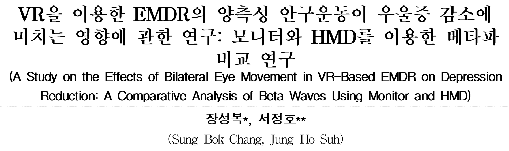

elementId: 0
102 2025년 02월 스마트미디어저널
<<BLOCKEND>>
elementId: 1
Smart Media Journal / Vol.14, No.2 / ISSN:2287-1322
https://ck.dolorg/1030693/SMU2025.142.102
<<BLOCKEND>>
elementId: 2
| VR을 이용한 EMDR의 양측성 미치는 영향에 관한 연구: 비교 연구 | 안구운동이 우울증 감소에 모니터와 HMD를 이용한 베타파 |
| --- | --- |
| (A Study on the Effects of Bilateral Eye Movement in Depression Reduction: A Comparative Analysis of Beta | VR-Based EMDR on Waves Using Monitor and HMD) |
| 장성복*, 서정호** (Sung-Bok Chang, Jung-Ho Suh) |  |


```
| VR을 이용한 EMDR의 양측성 안구운동이 우울증 감소에 미치는 영향에 관한 연구: 모니터와 HMD를 이용한 베타파 비교 연구 |
| --- |
| (A Study on the Effects of Bilateral Eye Movement in VR-Based EMDR on Depression Reduction: A Comparative Analysis of Beta Waves Using Monitor and HMD) |
| 장성복*, 서정호** (Sung-Bok Chang, Jung-Ho Suh) |
```

<<BLOCKEND>>
elementId: 3
요 약
<<BLOCKEND>>
elementId: 4
본 연구는 주로 모니터를 통해 시행되는 EMDR(안구운동 민감소실 및 재처리 요법) 치료 방식에서, 가상
현실(VR)을 이용한 새로운 접근법의 잠재력을 탐구하기 위해 수행되었다. 이를 검정하기 위해, 경기도에 위치
한 G대학교 학생들을 대상으로 우울 척도(CES-D)를 사용하여 우울증 수준을 측정했다. CES-D 점수가 25
점 이상으로 심각한 우울 상태를 나타낸 16명이 실험에 포함되었으며(내적 일관성 = .71), 이들은 모니터와
VR을 사용한 EMDR 치료 실험에 참여했다. 실험 중에는 EEG 장비를 사용해 오른쪽 반구의 베타파 변화를
관찰했다. 데이터는 SPSS 27을 사용해 짝지어진 표본 T-검정으로 분석되었다. 검증 결과, VR HMD를 이용
한 EMDR 치료(M=4.67)가 전통적인 모니터 기반 EMDR 치료(M=5.60)보다 베타파 점수가 낮게 나타나,
VR을 활용한 EMDR 치료의 새로운 가능성을 확인하였다.
<<BLOCKEND>>
elementId: 5
■ 중심어 : VR ; EMDR ; EEG ; 우울증 ; 베타파
<<BLOCKEND>>
elementId: 6
Abstract
<<BLOCKEND>>
elementId: 7
This study was conducted to explore the potential of a novel approach to EMDR (Eye
Movement Desensitization and Reprocessing) therapy using virtual reality (VR), which is
traditionally administered via monitors. To test this, the depression level of students at G
University, located in Gyeonggi Province, was measured using the Center for Epidemiologic
Studies Depression Scale (CES-D). Sixteen participants with CES-D scores of 25 or higher,
indicating severe depression (internal consistency = .71), were included in the experiment.
They participated in EMDR therapy sessions conducted using both monitors and VR. During
the experiment, EEG equipment was used to observe beta wave changes in the right
hemisphere. The data were analyzed using paired sample t-tests with SPSS 27. The results
showed that EMDR therapy using a VR HMD (M=4.67) had lower beta wave scores compared
to traditional monitor-based EMDR therapy (M=5.60), confirming the new potential of
VR-based EMDR therapy.
<<BLOCKEND>>
elementId: 8
keywords : VR ; EMDR ; EEG ; Depression ; Beta waves
<<BLOCKEND>>
elementId: 9
I. 서 론
<<BLOCKEND>>
elementId: 10
우울증은 현재 전 세계적으로 가장 널리 퍼져
있는 정신 건강 문제 중 하나로, 수많은 사람들
에게 심각한 영향을 미치고 있다. 우울증은 일상
생활의 기능을 저하시킬 뿐만 아니라 삶의 질을
<<BLOCKEND>>
elementId: 11
크게 떨어뜨리며, 만성화될 경우 사회적, 경제적
비용을 유발할 수 있다[1]. 이러한 이유로 우울
증 치료에서 약물치료와 심리치료 외에 다미술
치료, 음악치료, 원예치료, 인지행동치료 등과
같은 다양한 치료 방법이 우울증과 스트레스 감
소에 효과적임이 보고되고 있다[2].
<<BLOCKEND>>
elementId: 12
*정회원, 청주대학교 디지털미디어디자인학과
** 정회원, 가천대학교 미디어커뮤니케이션학과 kc
접수일자 : 2024년 11월 17일 게재확정일 : 2025년 01월 27일
수정일자 : 2024년 01월 05일 교신저자 : 서정호 e-mail : hoseo@gachon.ac.kr
<<BLOCKEND>>
elementId: 13
Smart Media Journal / Vol.14, No.2 / ISSN:2287-1322
<<BLOCKEND>>
elementId: 14
2025년 02월 스마트미디어저널 103
<<BLOCKEND>>
elementId: 15
이러한 치료법 중 하나는 EMDR(Eye
Movement Desensitization and
Reprocessing)이다. EMDR은 원래 외상 후 스
트레스 장애(PTSD) 치료에 효과적이라고 알려
져 있으나, 최근 연구들은 우울증 환자에게도 긍
정적인 효과를 보일 수 있음을 시사하고 있다
[3,4]. 일반적으로 EMDR 치료는 모니터 화면을
통해 환자의 눈동자 움직임을 유도하여 기억을
재처리하는 방식으로 이루어졌다.
<<BLOCKEND>>
elementId: 16
최근 연구에서 VR 기술을 이용하여 만성 뇌 질
환 재활치료의 가능성을 제기[5]하고 있다. 옥
스퍼드 대학의 연구에서는 VR이 불안 장애 등
정신 질환 치료에 효과적으로 활용될 수 있음을
확인하였다[6]. VR(가상현실) 기술을 활용함으
로써 보다 몰입감 있는 치료 환경을 제공할 수
있어, VR이 기존의 모니터 기반 EMDR보다 더
높은 치료 효과를 낼 수 있다는 가능성이 제기되
고 있다[7]. 특히, 뇌파 분석을 통해 우울증 환
자의 뇌 상태를 더욱 깊이 이해할 수 있으며, 베
타파는 우울증과 관련된 주요 뇌파로 연구되고
있다[8,9]. 베타파는 높은 각성과 불안과 밀접하
게 연관된 것으로 알려져 있으며, 우울증 환자들
에게서 이러한 높은 베타파가 관찰된다는 연구
가 있다[10]. 이는 우울증 환자들이 과도한 불안
과 스트레스를 경험하고 있다는 점은, 이러한 신
경학적 각성 상태가 우울증 증상을 악화시키는
주요 요인 중 하나로 작용할 수 있음을 시사한
다. 이러한 맥락에서, 우울증 치료에 있어 베타파
변화를 관찰하는 것은 중요한 접근법으로 주목
받고 있다.
<<BLOCKEND>>
elementId: 17
본 연구는 그동안 베타파가와 우울증과의 관계
를 증명하는 연구가 제한적으로 진행되고 있는
상황에서 베타파 감소가 우울증 증상 개선에 직
간접적인 관계를 확인하는 것이며 VR을 활용한
EMDR 치료가 기존의 모니터 기반 EMDR 치료
에 비해 우울증 환자의 베타파에 미치는 영향을
검증하는 데 목적을 둔다. 특히, 기존 EMDR 치
료에 VR 기술을 도입함으로써 우울증 치료 효과
<<BLOCKEND>>
elementId: 18
www.kci.go.kr
<<BLOCKEND>>
elementId: 19
를 강화할 가능성을 탐구하며, 이를 통해 실증적
데이터를 확보하는 것을 주요 연구 과제로 삼았
다. VR 기반 EMDR 치료가 우울증 환자의 뇌파,
특히 베타파에 미치는 영향을 측정함으로써, 가
상현실의 활용 가능성과 치료적 유용성을 평가
하는 데 연구의 의의를 두고 있다.
<<BLOCKEND>>
elementId: 20
따라서 본 연구는 모니터 기반 치료와 VR 기반
치료 간의 유의미한 차이를 규명하고, 우울증 치
료 방법으로서 VR의 잠재력을 탐색하고자 한다.
이는 우울증 치료에 대한 보다 다양한 접근법을
제시함과 동시에, 새로운 디지털 기술을 활용한
정신 건강 치료의 가능성을 확장하는 데 중요한
의미를 갖는다.
<<BLOCKEND>>
elementId: 21
II. 본 론
<<BLOCKEND>>
elementId: 22
1. EMDR과 우울증
<<BLOCKEND>>
elementId: 23
EMDR(Eye Movement Desensitization and
Reprocessing, 이하 EMDR)은 안구운동 민감소
실 재처리 기법을 이용한 치료로써 1987년
Francine Shapiro 박사에 의해 개발된 심리 치
료 기법으로, 양측성 안구운동이 외상 기억과 연
관된 부정적인 감정의 강도를 감소시키는데 도
움이 된다고 주장하였고 주로 외상 후 스트레스
장애(PTSD) 치료에서 효과가 검증된 방법으로
알려져 있다[11].
<<BLOCKEND>>
elementId: 24
EMDR의 기본 원리는 외상 기억이 부적절하게
처리되어 부정적인 감정과 신념을 유발하며, 치
료 과정을 통해 이러한 기억을 재처리하여 적응
적인 방식으로 통합하도록 돕는다.
<<BLOCKEND>>
elementId: 25
치료는 8단계로 구성되어 있다[3]. 1단계는
'병력 조사 및 치료 계획 수립단계'로써 환자의
과거 역사와 현재 상태를 평가하여 맞춤형 치료
계획을 수립한다. 2단계는 '준비 단계'로써 환자
에게 EMDR의 개념과 절차를 설명하고, 안정화
기법을 소개하여 치료 과정에서 안정감을 느끼
도록 한다. 3단계는 '평가 단계' 단계로써 해결해
야 할 특정 기억을 선택하고, 그와 관련된 감정
<<BLOCKEND>>