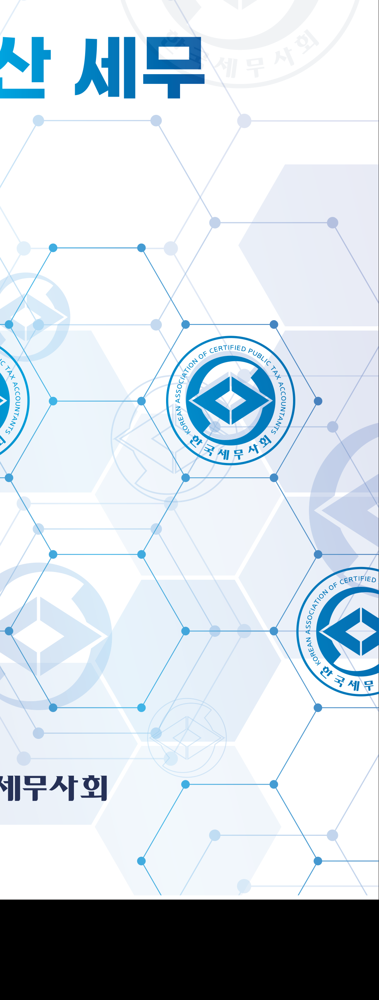
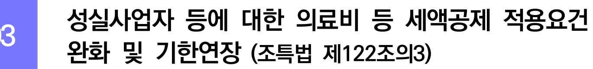
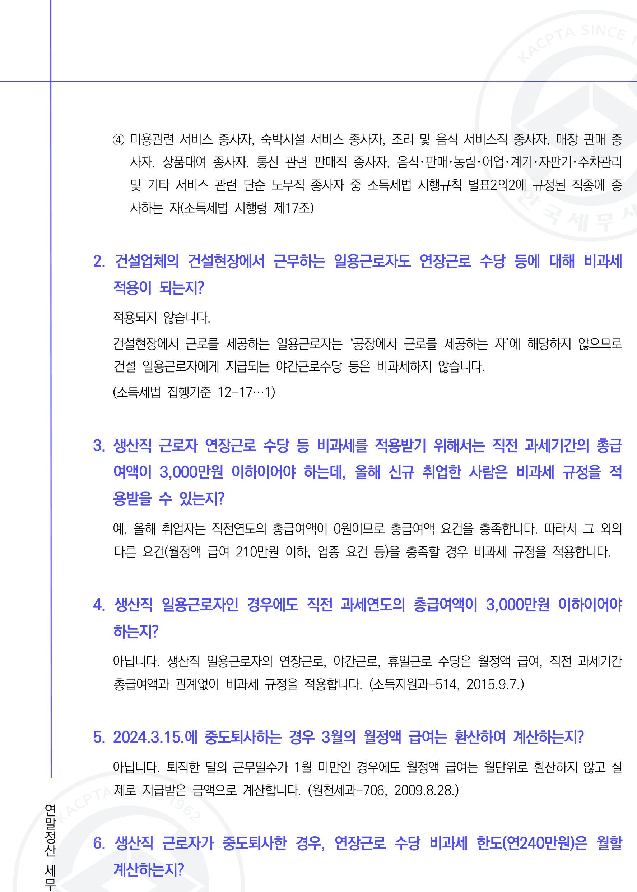
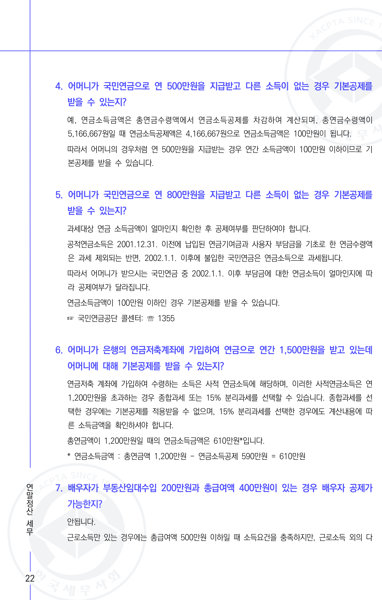
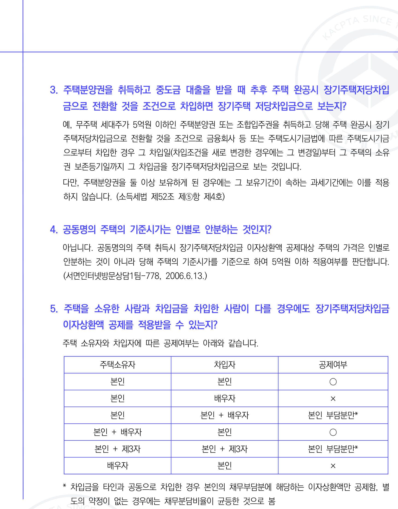
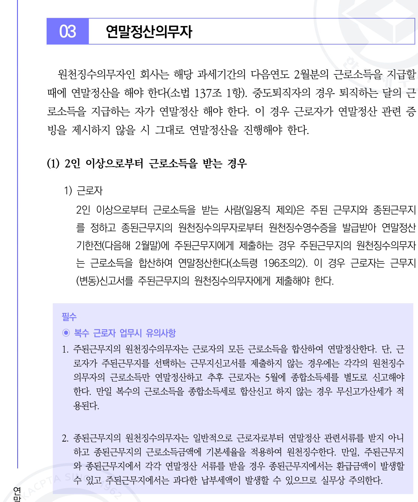
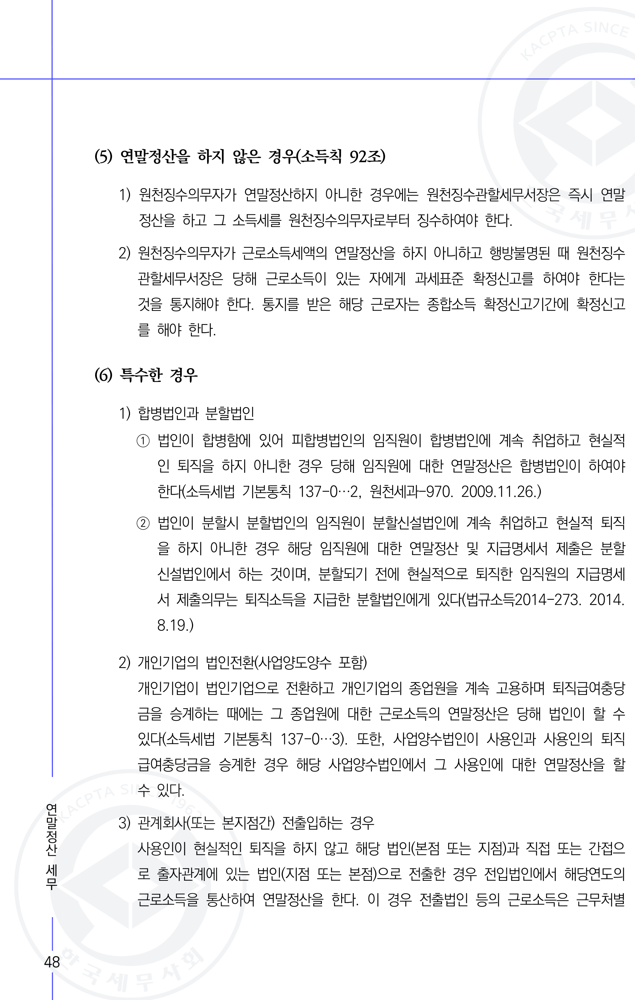
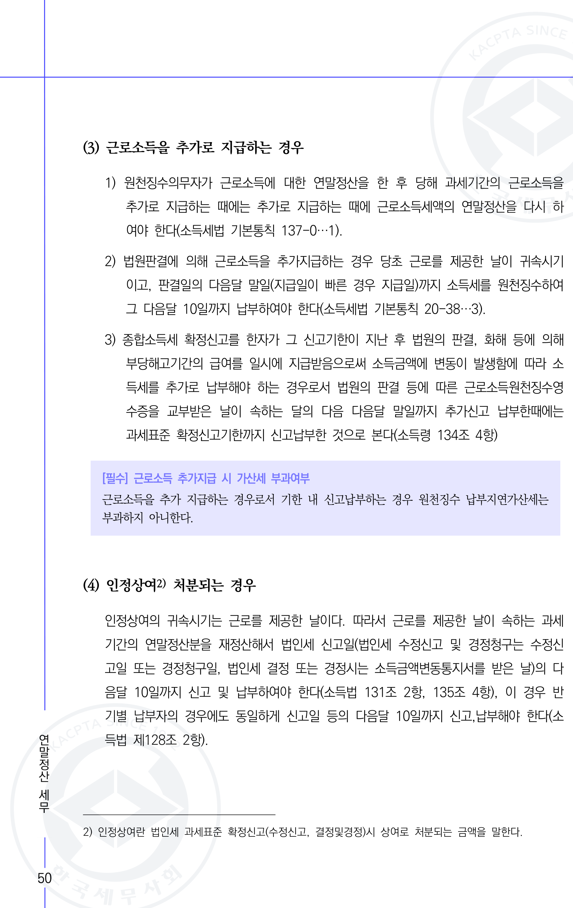

elementId: 0
KACPTA SINCE
<<SPLIT>>
elementId: 2
KACPTA SINCE
테마별 실무서 3
<<SPLIT>>
elementId: 3
KACPTA SINCE
테마별 실무서 3

*회
연말정산 세무 무 사
ASSOCIATION OF CERTIFIED PUBLIC TAX
ASSOCIATION OF CERTIFIED PUBLIC TAX
ACCOUNTANTS
ACCOUNTANTS
KOREAN 한국세무 사회
KOREAN 한 국 세무사회
OF CERTIFIED PUBLIC TAX
ASSOCIATION
ASSOCIATION OF CERTIFIED
ACCOUNTANTS
KOREAN 한 국 세무 사회 한 국세무
KOREAN
한국세무사회
한
국세무사회*
#### 1962
<<SPLIT>>
elementId: 4
CIATION
ASSOCIATION OF CERTIFIED
ACCOUNTANTS
KOREAN 한 국 세무 사회 한 국세무
KOREAN
한국세무사회
한
국세무사회*
#### 1962
KACPTA SINCE 1962
<<SPLIT>>
elementId: 5
N OF CERTIFIED
ACCOUNTANTS
KOREAN 한 국 세무 사회 한 국세무
KOREAN
한국세무사회
한
국세무사회*
#### 1962
KACPTA SINCE 1962
한국세무사회
<<SPLIT>>
elementId: 6
RTIFIED
ACCOUNTANTS
KOREAN 한 국 세무 사회 한 국세무
KOREAN
한국세무사회
한
국세무사회*
#### 1962
KACPTA SINCE 1962
한국세무사회
KACPTA SINCE 1962
<<SPLIT>>
elementId: 7
S
KOREAN 한 국 세무 사회 한 국세무
KOREAN
한국세무사회
한
국세무사회*
#### 1962
KACPTA SINCE 1962
한국세무사회
KACPTA SINCE 1962
한
<<SPLIT>>
elementId: 8
KOREAN 한 국 세무 사회 한 국세무
KOREAN
한국세무사회
한
국세무사회*
#### 1962
KACPTA SINCE 1962
한국세무사회
KACPTA SINCE 1962
한
국세무사회
<<SPLIT>>
elementId: 9
 한 국 세무 사회 한 국세무
KOREAN
한국세무사회
한
국세무사회*
#### 1962
KACPTA SINCE 1962
한국세무사회
KACPTA SINCE 1962
한
국세무사회
1962
<<SPLIT>>
elementId: 10
세무 사회 한 국세무
KOREAN
한국세무사회
한
국세무사회*
#### 1962
KACPTA SINCE 1962
한국세무사회
KACPTA SINCE 1962
한
국세무사회
1962
발간사
<<SPLIT>>
elementId: 11
회 한 국세무
KOREAN
한국세무사회
한
국세무사회*
#### 1962
KACPTA SINCE 1962
한국세무사회
KACPTA SINCE 1962
한
국세무사회
1962
발간사
사 회
<<SPLIT>>
elementId: 12
국세무
KOREAN
한국세무사회
한
국세무사회*
#### 1962
KACPTA SINCE 1962
한국세무사회
KACPTA SINCE 1962
한
국세무사회
1962
발간사
사 회
세무사는 공공성있는 세무전문가로 납세자권익 보호와 성실한 납세의무 이행에
이바지하는 사명이 있습니다. 이 때문에 세무사는 모름지기 높은 전문성과 책임성을
갖춰야 하고 이를 위한 연구와 교육은 아무리 강조해도 지나치지 않습니다.
<<SPLIT>>
elementId: 13
와 성실한 납세의무 이행에
이바지하는 사명이 있습니다. 이 때문에 세무사는 모름지기 높은 전문성과 책임성을
갖춰야 하고 이를 위한 연구와 교육은 아무리 강조해도 지나치지 않습니다.
한국세무사회는 그동안 많은 세법책과 실무서를 발간하면서 회원의 전문성과 책임성을
함양하기 위해 노 력해왔습니다. 하지만 회원보다는 관성적인 출판에 그치고 저자 편의가
앞서 사업현장의 회원님을 만족시키는데 부족함이 참 많았습니다.
<<SPLIT>>
elementId: 14
하면서 회원의 전문성과 책임성을
함양하기 위해 노 력해왔습니다. 하지만 회원보다는 관성적인 출판에 그치고 저자 편의가
앞서 사업현장의 회원님을 만족시키는데 부족함이 참 많았습니다.
제33대 한국세무사회는 도서출판까지 혁신하여 사업현장의 회원들의 직무 요령,
리스크 관리 및 컨설팅기법 등을 망라해 회원들이 책상머리에 두고 무시로 회원을 돕는
'실사구시 지침서'를 어떻게 마련할지 고민해왔습니다.
<<SPLIT>>
elementId: 15
 혁신하여 사업현장의 회원들의 직무 요령,
리스크 관리 및 컨설팅기법 등을 망라해 회원들이 책상머리에 두고 무시로 회원을 돕는
'실사구시 지침서'를 어떻게 마련할지 고민해왔습니다.
그 결과 세목별 기본서, 신고실무도 회원친화적으로 형식과 콘텐츠도 바꾸고
회원님이 전문적인 핵심직무를 수행할 때 유용한 길잡이가 될 '테마별 실무서 시리즈'를
새롭게 내게 되었습니다.
<<SPLIT>>
elementId: 16
결과 세목별 기본서, 신고실무도 회원친화적으로 형식과 콘텐츠도 바꾸고
회원님이 전문적인 핵심직무를 수행할 때 유용한 길잡이가 될 '테마별 실무서 시리즈'를
새롭게 내게 되었습니다.
'한국세무사회 테마별 실무서'는 사업현장에서 부딪히는 핵심주제 50개를 추출하고
각 테마마다 최고의 전문가가 참여하여 관계법령, 예규 및 판례의 나열 아닌 직무요령과
리스크 관리, 컨설팅 기법 등 권위있는 전문 집필자의 노하우까지 담아냈습니다.
<<SPLIT>>
elementId: 17
0개를 추출하고
각 테마마다 최고의 전문가가 참여하여 관계법령, 예규 및 판례의 나열 아닌 직무요령과
리스크 관리, 컨설팅 기법 등 권위있는 전문 집필자의 노하우까지 담아냈습니다.
조세출판사에 큰 획을 그을 책이 될 '한국세무사회 테마별 실무서 시리즈'가 앞으로
개정과 증보를 거듭하면서 사업현장의 회원님을 최고의 조세전문가로 완성시키는
기념비적인 책이 되리라 믿어 의심치 않습니다.
<<SPLIT>>
elementId: 18
을 책이 될 '한국세무사회 테마별 실무서 시리즈'가 앞으로
개정과 증보를 거듭하면서 사업현장의 회원님을 최고의 조세전문가로 완성시키는
기념비적인 책이 되리라 믿어 의심치 않습니다.
어려운 여건에도 남다른 열정과 전문성으로 '한국세무사회 테마별 실무서'가 탄생
하는데 함께해주시는 집필진 세무사님과 한국세무사회 도서출판위원회 위원님께
고마움을 전합니다.
<<SPLIT>>
elementId: 19
습니다.
어려운 여건에도 남다른 열정과 전문성으로 '한국세무사회 테마별 실무서'가 탄생
하는데 함께해주시는 집필진 세무사님과 한국세무사회 도서출판위원회 위원님께
고마움을 전합니다.
2024년 11월
한국세무사회 회 장 구 재 이
<<SPLIT>>
elementId: 20
 '한국세무사회 테마별 실무서'가 탄생
하는데 함께해주시는 집필진 세무사님과 한국세무사회 도서출판위원회 위원님께
고마움을 전합니다.
2024년 11월
한국세무사회 회 장 구 재 이
CONTENTS
<<SPLIT>>
elementId: 21
테마별 실무서'가 탄생
하는데 함께해주시는 집필진 세무사님과 한국세무사회 도서출판위원회 위원님께
고마움을 전합니다.
2024년 11월
한국세무사회 회 장 구 재 이
CONTENTS
실무사례중심의 연말정산 세무
<<SPLIT>>
elementId: 22
 함께해주시는 집필진 세무사님과 한국세무사회 도서출판위원회 위원님께
고마움을 전합니다.
2024년 11월
한국세무사회 회 장 구 재 이
CONTENTS
실무사례중심의 연말정산 세무
>>>> 2024년 적용되는 연말정산 관련 주요내용 9
01. 출산·보육수당 비과세 한도 상향 9
02. 육아휴직수당 비과세 적용대상 추가 9
03. 원양어선·외항선원 및 해외건설 근로자 비과세 확대 ······ 10
04. 직무발명보상금 비과세 한도 상향 10
05. 자원봉사용역 특례기부금 가액 현실화 10
06. 주택연금 이자비용 소득공제 요건 완화 10
07. 장기주택저당 차입금 이자상환액 소득공제 확대 ...... 11
08. 자녀세액공제 확대 11
09. 산후조리원에 지급하는 비용 의료비 세액공제 강화 12
10. 장애인활동지원급여 비용 의료비 세액공제 대상 확대 ...... 12
11. 고액기부 대한 공제율 한시 상향 12
[ 조세특례제한법 ] ・・・・・・・・・・・・・・・ 13
01. 주택청약종합저축 소득공제 한도 상향 .................. .......... 13
02. 월세액 세액공제 소득기준 및 한도 상향 13
03. 성실사업자 등에 대한 의료비 등 세액공제 적용요건
완화 및 기한연장 13
04. 신용카드 등 사용금액 증가분에 대한 소득공제 추가 ... 14
05. 신용카드 등 사용금액 소득공제 적용대상 조정 14
<<SPLIT>>
elementId: 23
 의료비 등 세액공제 적용요건
완화 및 기한연장 13
04. 신용카드 등 사용금액 증가분에 대한 소득공제 추가 ... 14
05. 신용카드 등 사용금액 소득공제 적용대상 조정 14
KAC 196
<<SPLIT>>
elementId: 24
액공제 적용요건
완화 및 기한연장 13
04. 신용카드 등 사용금액 증가분에 대한 소득공제 추가 ... 14
05. 신용카드 등 사용금액 소득공제 적용대상 조정 14
KAC 196
CONTENTS
<<SPLIT>>
elementId: 25
완화 및 기한연장 13
04. 신용카드 등 사용금액 증가분에 대한 소득공제 추가 ... 14
05. 신용카드 등 사용금액 소득공제 적용대상 조정 14
KAC 196
CONTENTS
2024년 연말정산 Q&A ···· ······························· 15
<<SPLIT>>
elementId: 26
 신용카드 등 사용금액 소득공제 적용대상 조정 14
KAC 196
CONTENTS
2024년 연말정산 Q&A ···· ······························· 15
01. 비과세 - 자기차량 운전보조금 ................................................... 15
02. 비과세 - 실비변상적 급여 15
03. 비과세  국외근로소득 16
04. 비과세 - 생산직 근로자의 연장근로 수당 등 ... 17
05. 비과세 - 식대 19
06. 비과세 - 출산보육수당 20
07. 비과세 - 학자금 20
08. 비과세 - 그 밖의 비과세 소득 20
09. 인적공제 一 연간소득금액 100만원 ........ 21
10. 인적공제 - 직계존속 ············· 23
11. 인적공제 - 직계비속 ·········· 24
12. 인적공제 - 형제자매 .......... 24
13. 추가공제 - 부녀자 공제 24
14. (공적)연금보험료 공제 - 국민연금, 공무원연금 등 25
15. 보험료 공제 - 건강보험, 고용보험, 노인장기요양보험 .... · 26
16. 주택자금 공제 一 주택임차차입금 원리금 상환액 27
17. 주택자금 공제 - 장기주택저당차입금 이자 상환액 27
18. 주택마련저축 납입액 소득공제 29
19. 신용카드 등 사용금액 소득공제 30
20. 중소기업 취업자에 대한 소득세 감면 * 32
21. 자녀세액공제 ......... . 34
<<SPLIT>>
elementId: 27
8. 주택마련저축 납입액 소득공제 29
19. 신용카드 등 사용금액 소득공제 30
20. 중소기업 취업자에 대한 소득세 감면 * 32
21. 자녀세액공제 ......... . 34
CONTENTS
<<SPLIT>>
elementId: 28
 납입액 소득공제 29
19. 신용카드 등 사용금액 소득공제 30
20. 중소기업 취업자에 대한 소득세 감면 * 32
21. 자녀세액공제 ......... . 34
CONTENTS
22. 연금계좌 세액공제 35 사회
<<SPLIT>>
elementId: 29
드 등 사용금액 소득공제 30
20. 중소기업 취업자에 대한 소득세 감면 * 32
21. 자녀세액공제 ......... . 34
CONTENTS
22. 연금계좌 세액공제 35 사회
23. 보험료 세액공제 35
<<SPLIT>>
elementId: 30

20. 중소기업 취업자에 대한 소득세 감면 * 32
21. 자녀세액공제 ......... . 34
CONTENTS
22. 연금계좌 세액공제 35 사회
23. 보험료 세액공제 35
>>>> 제1장
<<SPLIT>>
elementId: 31
 취업자에 대한 소득세 감면 * 32
21. 자녀세액공제 ......... . 34
CONTENTS
22. 연금계좌 세액공제 35 사회
23. 보험료 세액공제 35
>>>> 제1장
제1절
<<SPLIT>>
elementId: 32
에 대한 소득세 감면 * 32
21. 자녀세액공제 ......... . 34
CONTENTS
22. 연금계좌 세액공제 35 사회
23. 보험료 세액공제 35
>>>> 제1장
제1절
24. 의료비 세액공제 ............ 36
25. 교육비 세액공제 ............... ········· · 38
26. 기부금 세액공제 · ······················ ··········· 40
27. 월세 세액공제 ................................................... 41
근로소득 연말정산 (이론편) ................................................... 43
근로소득자의 연말정산 - 43
01. 연말정산 의의 ························· ················ 43
02. 연말정산 흐름 ........... 44
03. 연말정산의무자 .......... .......... 46
04. 연말정산의 시기 * ............ 49
05. 연말정산 세액의 징수 및 환급 ........... 52
06. 근로소득원천징수영수증 작성 및 발급 ................ ........... 54
07. 원천징수이행상황신고서 제출 및 세액납부 .......... ··········· 54
08. 연말정산 오류에 따른 가산세 ······················· ******** 56
09. 지급명세서 제출 ·········· 59
10. 간이지급명세서 제출 ........ ********** 62
11. 기타 세무서 제출서류 ············ ················ 68
12. 비거주자의 연말정산 - 68
<<SPLIT>>
elementId: 33
지급명세서 제출 ........ ********** 62
11. 기타 세무서 제출서류 ············ ················ 68
12. 비거주자의 연말정산 - 68
KACP 196
<<SPLIT>>
elementId: 34
........ ********** 62
11. 기타 세무서 제출서류 ············ ················ 68
12. 비거주자의 연말정산 - 68
KACP 196
CONTENTS
<<SPLIT>>
elementId: 35
********** 62
11. 기타 세무서 제출서류 ············ ················ 68
12. 비거주자의 연말정산 - 68
KACP 196
CONTENTS
사
제2절 근로소득의 원천징수 ・・・・・・・・・・・・・・・・・・・・・・・・・ 73
01. 근로소득 73
02. 일용근로소득 ............ 81
03. 비과세 근로소득 * 84
04. 조세특례제한법상 근로소득 특례 107
05. 근로소득의 수입금액 계산 111
06. 근로소득의 수입시기 (귀속시기) ....... 112
07. 근로소득의 지급시기와 원천징수시기 113
08. 근로소득 원천징수 세율 115
09. 근로소득 원천징수의무자 ··················································· 115
>>>> 제2장 근로소득 연말정산 (실전편) ··················································· 125
제1절 연말정산 사전준비 ------------------------- 125
01. 연말정산 사전준비 ..... 125
02. 연말정산 제출서류 ........ 129
03. 편리한 연말정산 ················· 133
04. 연말정산 간소화 서비스 ....................................... 139
제3장 연말정산 세액의 계산 ··················································· 149
01. 세액계산의 흐름 --------------------------------------------------- 150
<<SPLIT>>
elementId: 36
··························· 149
01. 세액계산의 흐름 --------------------------------------------------- 150
CONTENTS
<<SPLIT>>
elementId: 37
·················· 149
01. 세액계산의 흐름 --------------------------------------------------- 150
CONTENTS
제1절 소득공제 ······················ 151
01. 근로소득공제 151
02. 종합소득공제 152
03. 특별소득공제 .... 158
04. 그 밖의 소득공제 167
05. 소득공제 종합한도 ................ ·············· 180
제2절 세액과 감면 ........................................... 181
01. 산출세액 ················ 181
02. 종합소득 결정세액 --------------------------------------------------- ... 182
03. 세액감면 - 182
제3절 세액공제 ············· 191
01. 근로소득 · 자녀 · 연금계좌 세액공제 ......................... ..... 191
02. 보험료 · 의료비 · 교육비 · 기부금 세액공제 ........ 195
03. 이외 세액공제 207
04. 세액감면 및 세액공제의 한도 212
제4장 근로소득자의 연말정산 후 4대보험 정산 ················· 215
1962 01. 개요 .... .......... 215
<<SPLIT>>
elementId: 38
 세액감면 및 세액공제의 한도 212
제4장 근로소득자의 연말정산 후 4대보험 정산 ················· 215
1962 01. 개요 .... .......... 215
KACPTA SINCE 1962
<<SPLIT>>
elementId: 39
12
제4장 근로소득자의 연말정산 후 4대보험 정산 ················· 215
1962 01. 개요 .... .......... 215
KACPTA SINCE 1962
2024년 적용되는
연말정산 관련
주요내용
<<SPLIT>>
elementId: 40
험 정산 ················· 215
1962 01. 개요 .... .......... 215
KACPTA SINCE 1962
2024년 적용되는
연말정산 관련
주요내용
01 출산· 보육수당 비과세 한도 상향 (소득법 제12조)
<<SPLIT>>
elementId: 41
1. 개요 .... .......... 215
KACPTA SINCE 1962
2024년 적용되는
연말정산 관련
주요내용
01 출산· 보육수당 비과세 한도 상향 (소득법 제12조)
근로자(종교인포함) 본인 또는 배우자의 출산, 6세 이하 자녀의 보육과 관련하여
사용자로부터 지급받는 급여의 비과세 한도를 10만원에서 20만원으로 상향
<<SPLIT>>
elementId: 42
 상향 (소득법 제12조)
근로자(종교인포함) 본인 또는 배우자의 출산, 6세 이하 자녀의 보육과 관련하여
사용자로부터 지급받는 급여의 비과세 한도를 10만원에서 20만원으로 상향
<적용시기 : 2024.1.1.이후 지급받는 분부터 적용>
<<SPLIT>>
elementId: 43
우자의 출산, 6세 이하 자녀의 보육과 관련하여
사용자로부터 지급받는 급여의 비과세 한도를 10만원에서 20만원으로 상향
<적용시기 : 2024.1.1.이후 지급받는 분부터 적용>
02 육아휴직수당 비과세 적용대상 추가 (소득법 제12조)
<<SPLIT>>
elementId: 44
 지급받는 급여의 비과세 한도를 10만원에서 20만원으로 상향
<적용시기 : 2024.1.1.이후 지급받는 분부터 적용>
02 육아휴직수당 비과세 적용대상 추가 (소득법 제12조)
육아휴직을 지원하기 위하여 사립학교 직원이 사립학교 정관 등에 의하여 지급
받는 육아휴직수당 또한 월 한도 150만원까지 비과세 대상으로 확대
<<SPLIT>>
elementId: 45
세 적용대상 추가 (소득법 제12조)
육아휴직을 지원하기 위하여 사립학교 직원이 사립학교 정관 등에 의하여 지급
받는 육아휴직수당 또한 월 한도 150만원까지 비과세 대상으로 확대
<적용시기 : 2024.1.1.이후 지급받는 분부터 적용>
<<SPLIT>>
elementId: 46
하여 사립학교 직원이 사립학교 정관 등에 의하여 지급
받는 육아휴직수당 또한 월 한도 150만원까지 비과세 대상으로 확대
<적용시기 : 2024.1.1.이후 지급받는 분부터 적용>
962
<<SPLIT>>
elementId: 47
립학교 직원이 사립학교 정관 등에 의하여 지급
받는 육아휴직수당 또한 월 한도 150만원까지 비과세 대상으로 확대
<적용시기 : 2024.1.1.이후 지급받는 분부터 적용>
962
9
<<SPLIT>>
elementId: 48
교 직원이 사립학교 정관 등에 의하여 지급
받는 육아휴직수당 또한 월 한도 150만원까지 비과세 대상으로 확대
<적용시기 : 2024.1.1.이후 지급받는 분부터 적용>
962
9
03
<<SPLIT>>
elementId: 49
원이 사립학교 정관 등에 의하여 지급
받는 육아휴직수당 또한 월 한도 150만원까지 비과세 대상으로 확대
<적용시기 : 2024.1.1.이후 지급받는 분부터 적용>
962
9
03
원양어선 · 외항선원 및 해외건설 근로자 비과세 확대
(소득령 제16조)
<<SPLIT>>
elementId: 50
0만원까지 비과세 대상으로 확대
<적용시기 : 2024.1.1.이후 지급받는 분부터 적용>
962
9
03
원양어선 · 외항선원 및 해외건설 근로자 비과세 확대
(소득령 제16조)
선원 및 해외건설 근로자를 지원하기 위하여 외항선·원양어선 선원 및 해외건설
근로자의 근로소득 비과세 한도를 월 300만원에서 월 500만원으로 확대
<<SPLIT>>
elementId: 51
과세 확대
(소득령 제16조)
선원 및 해외건설 근로자를 지원하기 위하여 외항선·원양어선 선원 및 해외건설
근로자의 근로소득 비과세 한도를 월 300만원에서 월 500만원으로 확대
<적용시기 : 2024.2.29.이 속하는 과세기간에 지급받는 소득분부터 적용>
<<SPLIT>>
elementId: 52
원양어선 선원 및 해외건설
근로자의 근로소득 비과세 한도를 월 300만원에서 월 500만원으로 확대
<적용시기 : 2024.2.29.이 속하는 과세기간에 지급받는 소득분부터 적용>
04 직무발명보상금 비과세 한도 상향 (소득법 제12조)
<<SPLIT>>
elementId: 53
 월 300만원에서 월 500만원으로 확대
<적용시기 : 2024.2.29.이 속하는 과세기간에 지급받는 소득분부터 적용>
04 직무발명보상금 비과세 한도 상향 (소득법 제12조)
종업원, 교직원 및 학생에게 지급하는 직무발명보상금 비과세 금액을 연 500만
원 이하의 금액에서 연 700만원 이하로 상향. 개인사업자 당사자 및 친족관계에
있는자, 법인의 지배주주등 및 그 특수관계인은 비과세 대상자에서 제외
<<SPLIT>>
elementId: 54
금 비과세 금액을 연 500만
원 이하의 금액에서 연 700만원 이하로 상향. 개인사업자 당사자 및 친족관계에
있는자, 법인의 지배주주등 및 그 특수관계인은 비과세 대상자에서 제외
<적용시기 : 2024.1.1. 이후 지급받는 소득분부터 적용>
<<SPLIT>>
elementId: 55
이하로 상향. 개인사업자 당사자 및 친족관계에
있는자, 법인의 지배주주등 및 그 특수관계인은 비과세 대상자에서 제외
<적용시기 : 2024.1.1. 이후 지급받는 소득분부터 적용>
05 자원봉사용역 특례기부금 가액 현실화 (소득령 제81조)
<<SPLIT>>
elementId: 56
 지배주주등 및 그 특수관계인은 비과세 대상자에서 제외
<적용시기 : 2024.1.1. 이후 지급받는 소득분부터 적용>
05 자원봉사용역 특례기부금 가액 현실화 (소득령 제81조)
특례기부금 중 특별재난지역을 복구하기 위한 자원봉사용역을 종전 봉사일수
1일당 5만원에서 1일당 8만원으로 상향
<<SPLIT>>
elementId: 57
적용>
05 자원봉사용역 특례기부금 가액 현실화 (소득령 제81조)
특례기부금 중 특별재난지역을 복구하기 위한 자원봉사용역을 종전 봉사일수
1일당 5만원에서 1일당 8만원으로 상향
<적용시기 : 2024.4.1. 이후 기부하는 분부터 적용>
<<SPLIT>>
elementId: 58
1조)
특례기부금 중 특별재난지역을 복구하기 위한 자원봉사용역을 종전 봉사일수
1일당 5만원에서 1일당 8만원으로 상향
<적용시기 : 2024.4.1. 이후 기부하는 분부터 적용>
ACPTA
<<SPLIT>>
elementId: 59
기부금 중 특별재난지역을 복구하기 위한 자원봉사용역을 종전 봉사일수
1일당 5만원에서 1일당 8만원으로 상향
<적용시기 : 2024.4.1. 이후 기부하는 분부터 적용>
ACPTA
196
<<SPLIT>>
elementId: 60
중 특별재난지역을 복구하기 위한 자원봉사용역을 종전 봉사일수
1일당 5만원에서 1일당 8만원으로 상향
<적용시기 : 2024.4.1. 이후 기부하는 분부터 적용>
ACPTA
196
06 주택연금 이자비용 소득공제 요건 완화 (소득령 제108조의3)
<<SPLIT>>
elementId: 61
5만원에서 1일당 8만원으로 상향
<적용시기 : 2024.4.1. 이후 기부하는 분부터 적용>
ACPTA
196
06 주택연금 이자비용 소득공제 요건 완화 (소득령 제108조의3)
연말정산
세무
<<SPLIT>>
elementId: 62
당 8만원으로 상향
<적용시기 : 2024.4.1. 이후 기부하는 분부터 적용>
ACPTA
196
06 주택연금 이자비용 소득공제 요건 완화 (소득령 제108조의3)
연말정산
세무
주택담보노후연금 이자비용 소득공제 적용요건을 종전 기준시가 9억원 주택에서
<<SPLIT>>
elementId: 63
용>
ACPTA
196
06 주택연금 이자비용 소득공제 요건 완화 (소득령 제108조의3)
연말정산
세무
주택담보노후연금 이자비용 소득공제 적용요건을 종전 기준시가 9억원 주택에서
10
<<SPLIT>>
elementId: 64
ACPTA
196
06 주택연금 이자비용 소득공제 요건 완화 (소득령 제108조의3)
연말정산
세무
주택담보노후연금 이자비용 소득공제 적용요건을 종전 기준시가 9억원 주택에서
10
196
<<SPLIT>>
elementId: 65
A
196
06 주택연금 이자비용 소득공제 요건 완화 (소득령 제108조의3)
연말정산
세무
주택담보노후연금 이자비용 소득공제 적용요건을 종전 기준시가 9억원 주택에서
10
196
2024년 적용되는 연말정산 관련 주요내용
<<SPLIT>>
elementId: 66
요건 완화 (소득령 제108조의3)
연말정산
세무
주택담보노후연금 이자비용 소득공제 적용요건을 종전 기준시가 9억원 주택에서
10
196
2024년 적용되는 연말정산 관련 주요내용
기준시가 12억원 주택으로 확대
<적용시기 : 2024.1.1. 이후 취득하는 분부터 적용>
<<SPLIT>>
elementId: 67
 종전 기준시가 9억원 주택에서
10
196
2024년 적용되는 연말정산 관련 주요내용
기준시가 12억원 주택으로 확대
<적용시기 : 2024.1.1. 이후 취득하는 분부터 적용>
07
<<SPLIT>>
elementId: 68
 기준시가 9억원 주택에서
10
196
2024년 적용되는 연말정산 관련 주요내용
기준시가 12억원 주택으로 확대
<적용시기 : 2024.1.1. 이후 취득하는 분부터 적용>
07
장기주택저당 차입금 이자상환액 소득공제 확대
(소득법 제52조)
<<SPLIT>>
elementId: 69
산 관련 주요내용
기준시가 12억원 주택으로 확대
<적용시기 : 2024.1.1. 이후 취득하는 분부터 적용>
07
장기주택저당 차입금 이자상환액 소득공제 확대
(소득법 제52조)
장기주택저당차입금 이자상환액의 소득공제 금액 한도를 종전 300만~1,800만
원에서 600만~2,000만원으로 확대하였고, 주택요건은 종전 기준시가 5억원 이하
주택에서 기준시가 6억원 이하 주택으로 요건을 완화함. 또한, 차입자가 신규 차입
금으로 즉시 기존 장기주택저당차입금 잔액을 상환하는 경우도 소득공제 대상이
되도록 확대.
<<SPLIT>>
elementId: 70
원 이하
주택에서 기준시가 6억원 이하 주택으로 요건을 완화함. 또한, 차입자가 신규 차입
금으로 즉시 기존 장기주택저당차입금 잔액을 상환하는 경우도 소득공제 대상이
되도록 확대.
<적용시기 : (공제한도) 2024.1.1. 이후 이자상환액을 지급하는 분부터 적용
(주택요건) 2024.1.1. 이후 취득하는 분부터 적용
(차입금 연장) 2024.1.1. 이후 차입금의 상환기간을 연장하는 분부터 적용
(차입금 이전) 2024.1.1. 이후 연말정산하거나 종합소득과세표준
확정신고하는 분부터 적용>
<<SPLIT>>
elementId: 71
용
(차입금 연장) 2024.1.1. 이후 차입금의 상환기간을 연장하는 분부터 적용
(차입금 이전) 2024.1.1. 이후 연말정산하거나 종합소득과세표준
확정신고하는 분부터 적용>
08 자녀세액공제 확대 (소득법 제59조의2)
<<SPLIT>>
elementId: 72
금의 상환기간을 연장하는 분부터 적용
(차입금 이전) 2024.1.1. 이후 연말정산하거나 종합소득과세표준
확정신고하는 분부터 적용>
08 자녀세액공제 확대 (소득법 제59조의2)
적용대상 자녀를 기본공제대상자에 해당하는 자녀 및 손자녀(종전 자녀 한정)로
확대하고, 공제세액을 '1명 : 15만원, 2명 : 35만원(종전 30만원), 3명 : 35만원
(종전 30만원) + 2명초과 1명당 30만원' 으로 확대
<<SPLIT>>
elementId: 73
자녀(종전 자녀 한정)로
확대하고, 공제세액을 '1명 : 15만원, 2명 : 35만원(종전 30만원), 3명 : 35만원
(종전 30만원) + 2명초과 1명당 30만원' 으로 확대
<적용시기 : (공제액 상향) 2024.1.1.이 속하는 과세기간부터 적용
(공제대상 추가) 2024.1.1. 이후 종합소득과세표준을 신고하거나 소득세를
결정하거나 연말정산하는 경우부터 적용>
<<SPLIT>>
elementId: 74
 (공제액 상향) 2024.1.1.이 속하는 과세기간부터 적용
(공제대상 추가) 2024.1.1. 이후 종합소득과세표준을 신고하거나 소득세를
결정하거나 연말정산하는 경우부터 적용>
11
<<SPLIT>>
elementId: 75
제액 상향) 2024.1.1.이 속하는 과세기간부터 적용
(공제대상 추가) 2024.1.1. 이후 종합소득과세표준을 신고하거나 소득세를
결정하거나 연말정산하는 경우부터 적용>
11
09
<<SPLIT>>
elementId: 76
상향) 2024.1.1.이 속하는 과세기간부터 적용
(공제대상 추가) 2024.1.1. 이후 종합소득과세표준을 신고하거나 소득세를
결정하거나 연말정산하는 경우부터 적용>
11
09
산후조리원에 지급하는 비용 의료비 세액공제 강화
(소득법 제59조의4)
<<SPLIT>>
elementId: 77
024.1.1. 이후 종합소득과세표준을 신고하거나 소득세를
결정하거나 연말정산하는 경우부터 적용>
11
09
산후조리원에 지급하는 비용 의료비 세액공제 강화
(소득법 제59조의4)
산후조리원에 지급하는 비용에 대한 의료비 세액공제 기준을 종전 총급여액 7천
만원 이하인자에서 급여제한을 삭제하여 확대하였고, 본인에 대한 의료비와 동일하
게 공제한도 제한대상에서 제외함(다만, 산후조리원 지급비용에 대한 한도는 연간
200만원으로 동일)
<<SPLIT>>
elementId: 78

만원 이하인자에서 급여제한을 삭제하여 확대하였고, 본인에 대한 의료비와 동일하
게 공제한도 제한대상에서 제외함(다만, 산후조리원 지급비용에 대한 한도는 연간
200만원으로 동일)
<적용시기 : 2024.1.1. 이후 지출하는 분부터 적용>
<<SPLIT>>
elementId: 79
한 의료비와 동일하
게 공제한도 제한대상에서 제외함(다만, 산후조리원 지급비용에 대한 한도는 연간
200만원으로 동일)
<적용시기 : 2024.1.1. 이후 지출하는 분부터 적용>
| 10 | 장애인활동지원급여 비용 의료비 세액공제 대상 확대 (소득령 제118조의5) |


10 장애인활동지원급여 비용 의료비 세액공제 대상 확대 (소득령 제118조의5)
<<SPLIT>>
elementId: 80
득령 제118조의5) |


10 장애인활동지원급여 비용 의료비 세액공제 대상 확대 (소득령 제118조의5)
장애인활동지원급여 비용 중 실제 지출한 본인부담금인 경우 의료비 세액공제
대상으로 확대
<<SPLIT>>
elementId: 81
.png)

10 장애인활동지원급여 비용 의료비 세액공제 대상 확대 (소득령 제118조의5)
장애인활동지원급여 비용 중 실제 지출한 본인부담금인 경우 의료비 세액공제
대상으로 확대
<적용시기 : 2024.1.1. 이후 지출하는 분부터 적용>
<<SPLIT>>
elementId: 82
 확대 (소득령 제118조의5)
장애인활동지원급여 비용 중 실제 지출한 본인부담금인 경우 의료비 세액공제
대상으로 확대
<적용시기 : 2024.1.1. 이후 지출하는 분부터 적용>
11 고액기부 대한 공제율 한시 상향 (소득법 제59조의4)
<<SPLIT>>
elementId: 83
제 지출한 본인부담금인 경우 의료비 세액공제
대상으로 확대
<적용시기 : 2024.1.1. 이후 지출하는 분부터 적용>
11 고액기부 대한 공제율 한시 상향 (소득법 제59조의4)
3천만원을 초과하여 지급한 기부금의 경우 공제율을 40%로 신설
<적용시기 : 2024. 12. 31.까지 한시적용>
<<SPLIT>>
elementId: 84

11 고액기부 대한 공제율 한시 상향 (소득법 제59조의4)
3천만원을 초과하여 지급한 기부금의 경우 공제율을 40%로 신설
<적용시기 : 2024. 12. 31.까지 한시적용>
연말정산
세무
12
<<SPLIT>>
elementId: 85
 공제율 한시 상향 (소득법 제59조의4)
3천만원을 초과하여 지급한 기부금의 경우 공제율을 40%로 신설
<적용시기 : 2024. 12. 31.까지 한시적용>
연말정산
세무
12
19
<<SPLIT>>
elementId: 86
율 한시 상향 (소득법 제59조의4)
3천만원을 초과하여 지급한 기부금의 경우 공제율을 40%로 신설
<적용시기 : 2024. 12. 31.까지 한시적용>
연말정산
세무
12
19
2024년 적용되는 연말정산 관련 주요내용
<<SPLIT>>
elementId: 87
원을 초과하여 지급한 기부금의 경우 공제율을 40%로 신설
<적용시기 : 2024. 12. 31.까지 한시적용>
연말정산
세무
12
19
2024년 적용되는 연말정산 관련 주요내용
조세특례제한법 I
<<SPLIT>>
elementId: 88
한 기부금의 경우 공제율을 40%로 신설
<적용시기 : 2024. 12. 31.까지 한시적용>
연말정산
세무
12
19
2024년 적용되는 연말정산 관련 주요내용
조세특례제한법 I
01 주택청약종합저축 소득공제 한도 상향 (조특법 제87조)
<<SPLIT>>
elementId: 89
4. 12. 31.까지 한시적용>
연말정산
세무
12
19
2024년 적용되는 연말정산 관련 주요내용
조세특례제한법 I
01 주택청약종합저축 소득공제 한도 상향 (조특법 제87조)
주택청약종합저축 소득공제 한도를 종전 연 납입한도 240만원에서 연 300만원
으로 상향
<<SPLIT>>
elementId: 90
련 주요내용
조세특례제한법 I
01 주택청약종합저축 소득공제 한도 상향 (조특법 제87조)
주택청약종합저축 소득공제 한도를 종전 연 납입한도 240만원에서 연 300만원
으로 상향
<적용시기 : 2024.1.1. 이후 납입하는 분부터 적용>
<<SPLIT>>
elementId: 91
한도 상향 (조특법 제87조)
주택청약종합저축 소득공제 한도를 종전 연 납입한도 240만원에서 연 300만원
으로 상향
<적용시기 : 2024.1.1. 이후 납입하는 분부터 적용>
02 월세액 세액공제 소득기준 및 한도 상향 (조특법 제95조2)
<<SPLIT>>
elementId: 92
 연 납입한도 240만원에서 연 300만원
으로 상향
<적용시기 : 2024.1.1. 이후 납입하는 분부터 적용>
02 월세액 세액공제 소득기준 및 한도 상향 (조특법 제95조2)
월세액 세액공제 대상기준을 종전 총급여 7천만원(종합소득금액 6천만원)에서
총급여 8천만원(종합소득금액 7천만원)이하로 확대하고, 공제한도를 종전 750만원
에서 1,000만원으로 상향
<<SPLIT>>
elementId: 93
 세액공제 대상기준을 종전 총급여 7천만원(종합소득금액 6천만원)에서
총급여 8천만원(종합소득금액 7천만원)이하로 확대하고, 공제한도를 종전 750만원
에서 1,000만원으로 상향
<적용시기 : 2024.1.1. 이후 개시하는 과세연도분부터 적용>
<<SPLIT>>
elementId: 94

총급여 8천만원(종합소득금액 7천만원)이하로 확대하고, 공제한도를 종전 750만원
에서 1,000만원으로 상향
<적용시기 : 2024.1.1. 이후 개시하는 과세연도분부터 적용>
| 03 | 성실사업자 등에 대한 의료비 등 세액공제 적용요건 |
| --- | --- |
|  | 완화 및 기한연장 (조특법 제122조의3) |


3 성실사업자 등에 대한 의료비 등 세액공제 적용요건 완화 및 기한연장 (조특법 제122조의3)
<<SPLIT>>
elementId: 95
3) |


3 성실사업자 등에 대한 의료비 등 세액공제 적용요건 완화 및 기한연장 (조특법 제122조의3)
성실사업자 등에 대한 의료비 · 교육비· 월세 세액공제 소득요건을 종전 종합소득
금액 6천만원(15% 적용)에서 종합소득금액 7천만원(15%적용)이하로 확대하고 월
세액 공제대상금액을 1,000만원으로 확대 및 적용기한을 2026년 12월 31일까지
로 연장
<<SPLIT>>
elementId: 96

금액 6천만원(15% 적용)에서 종합소득금액 7천만원(15%적용)이하로 확대하고 월
세액 공제대상금액을 1,000만원으로 확대 및 적용기한을 2026년 12월 31일까지
로 연장
13
<<SPLIT>>
elementId: 97
 6천만원(15% 적용)에서 종합소득금액 7천만원(15%적용)이하로 확대하고 월
세액 공제대상금액을 1,000만원으로 확대 및 적용기한을 2026년 12월 31일까지
로 연장
13
04
<<SPLIT>>
elementId: 98
만원(15% 적용)에서 종합소득금액 7천만원(15%적용)이하로 확대하고 월
세액 공제대상금액을 1,000만원으로 확대 및 적용기한을 2026년 12월 31일까지
로 연장
13
04
신용카드 등 사용금액 증가분에 대한 소득공제 추가
(조특법 제126조의2)
<<SPLIT>>
elementId: 99
세액 공제대상금액을 1,000만원으로 확대 및 적용기한을 2026년 12월 31일까지
로 연장
13
04
신용카드 등 사용금액 증가분에 대한 소득공제 추가
(조특법 제126조의2)
신용카드 등 사용금액 소득공제 대상에 2024년 신용카드 등 사용금액 증가분에
대한 소득공제 10%를 신설(증가분이란 2023년 신용카드 등 사용금액의 105%를
초과하는 금액을 말함). 또한, 2024년 신용카드 등 사용금액 증가분은 100만원을
한도로 추가공제 하도록 규정
<<SPLIT>>
elementId: 100
%를 신설(증가분이란 2023년 신용카드 등 사용금액의 105%를
초과하는 금액을 말함). 또한, 2024년 신용카드 등 사용금액 증가분은 100만원을
한도로 추가공제 하도록 규정
<적용기한 : 2025.12.31. 까지>
<<SPLIT>>
elementId: 101
 사용금액의 105%를
초과하는 금액을 말함). 또한, 2024년 신용카드 등 사용금액 증가분은 100만원을
한도로 추가공제 하도록 규정
<적용기한 : 2025.12.31. 까지>
05
<<SPLIT>>
elementId: 102
금액의 105%를
초과하는 금액을 말함). 또한, 2024년 신용카드 등 사용금액 증가분은 100만원을
한도로 추가공제 하도록 규정
<적용기한 : 2025.12.31. 까지>
05
|  | 신용카드 등 사용금액 소득공제 적용대상 조정 |
| --- | --- |
|  | (조특령 제121조의2) |


신용카드 등 사용금액 소득공제 적용대상 조정에 관한 내용입니다. 조특령 제121조의2에 해당합니다.
<<SPLIT>>
elementId: 103


신용카드 등 사용금액 소득공제 적용대상 조정에 관한 내용입니다. 조특령 제121조의2에 해당합니다.
신용카드 등 사용금액 중, 고향사랑기부금 세액공제를 받은 금액 및 가상자산사
업자에게 지급하는 가상자산의 매수·매도·교환 등에 따른 수수료 금액을 제외하도
록 조정
<<SPLIT>>
elementId: 104
에 해당합니다.
신용카드 등 사용금액 중, 고향사랑기부금 세액공제를 받은 금액 및 가상자산사
업자에게 지급하는 가상자산의 매수·매도·교환 등에 따른 수수료 금액을 제외하도
록 조정
<적용시기 : 2024.2.29.이 속하는 과세연도에 지출하는 분부터 적용>
<<SPLIT>>
elementId: 105
 및 가상자산사
업자에게 지급하는 가상자산의 매수·매도·교환 등에 따른 수수료 금액을 제외하도
록 조정
<적용시기 : 2024.2.29.이 속하는 과세연도에 지출하는 분부터 적용>
연말정산
세무
14
<<SPLIT>>
elementId: 106
에게 지급하는 가상자산의 매수·매도·교환 등에 따른 수수료 금액을 제외하도
록 조정
<적용시기 : 2024.2.29.이 속하는 과세연도에 지출하는 분부터 적용>
연말정산
세무
14
196
<<SPLIT>>
elementId: 107
급하는 가상자산의 매수·매도·교환 등에 따른 수수료 금액을 제외하도
록 조정
<적용시기 : 2024.2.29.이 속하는 과세연도에 지출하는 분부터 적용>
연말정산
세무
14
196
2024년 적용되는 연말정산 관련 주요내용
<<SPLIT>>
elementId: 108
 수수료 금액을 제외하도
록 조정
<적용시기 : 2024.2.29.이 속하는 과세연도에 지출하는 분부터 적용>
연말정산
세무
14
196
2024년 적용되는 연말정산 관련 주요내용
2024년 연말정산 Q&A
<<SPLIT>>
elementId: 109
 조정
<적용시기 : 2024.2.29.이 속하는 과세연도에 지출하는 분부터 적용>
연말정산
세무
14
196
2024년 적용되는 연말정산 관련 주요내용
2024년 연말정산 Q&A
01 비과세 - 자기차량 운전보조금
<<SPLIT>>
elementId: 110
9.이 속하는 과세연도에 지출하는 분부터 적용>
연말정산
세무
14
196
2024년 적용되는 연말정산 관련 주요내용
2024년 연말정산 Q&A
01 비과세 - 자기차량 운전보조금
무
<<SPLIT>>
elementId: 111
이 속하는 과세연도에 지출하는 분부터 적용>
연말정산
세무
14
196
2024년 적용되는 연말정산 관련 주요내용
2024년 연말정산 Q&A
01 비과세 - 자기차량 운전보조금
무
1. 장애인 자녀와 공동 명의인 차량을 이용할 경우 자기차량 운전보조금이 비과세 되는지?
<<SPLIT>>
elementId: 112
 연말정산 관련 주요내용
2024년 연말정산 Q&A
01 비과세 - 자기차량 운전보조금
무
1. 장애인 자녀와 공동 명의인 차량을 이용할 경우 자기차량 운전보조금이 비과세 되는지?
안됩니다. 본인과 배우자 공동명의로 등록된 차량에 대하여는 자기차량 운전보조금 비
과세 규정을 적용할 수 있으나, 부모, 자녀 등 배우자 외의 자와 공동 명의인 차량에
대하여는 비과세 규정을 적용할 수 없습니다.(재소득-591, 2006.9.20.)
<<SPLIT>>
elementId: 113
전보조금 비
과세 규정을 적용할 수 있으나, 부모, 자녀 등 배우자 외의 자와 공동 명의인 차량에
대하여는 비과세 규정을 적용할 수 없습니다.(재소득-591, 2006.9.20.)
2. 차량운행에 다른 소요경비 증빙서류를 따로 비치하여야 하는지?
<<SPLIT>>
elementId: 114
 외의 자와 공동 명의인 차량에
대하여는 비과세 규정을 적용할 수 없습니다.(재소득-591, 2006.9.20.)
2. 차량운행에 다른 소요경비 증빙서류를 따로 비치하여야 하는지?
아닙니다. 비과세되는 자기차량운전보조금은 증빙서류 비치여부에 관계없이 사규에 의하여 지급받
는 20만원 이내의 금액을 말하는 것으로 소요경비의 증빙서류가 없어도 비과세를 적용합니다.(법인
46013-2726, 1996.9.25.)
<<SPLIT>>
elementId: 115
비치여부에 관계없이 사규에 의하여 지급받
는 20만원 이내의 금액을 말하는 것으로 소요경비의 증빙서류가 없어도 비과세를 적용합니다.(법인
46013-2726, 1996.9.25.)
02 비과세 - 실비변상적 급여
<<SPLIT>>
elementId: 116
 지급받
는 20만원 이내의 금액을 말하는 것으로 소요경비의 증빙서류가 없어도 비과세를 적용합니다.(법인
46013-2726, 1996.9.25.)
02 비과세 - 실비변상적 급여
1. 일직· 숙직료의 비과세 적용 기준은?
<<SPLIT>>
elementId: 117
것으로 소요경비의 증빙서류가 없어도 비과세를 적용합니다.(법인
46013-2726, 1996.9.25.)
02 비과세 - 실비변상적 급여
1. 일직· 숙직료의 비과세 적용 기준은?
일직·숙직료로서 실비변상 정도의 금액은 비과세됩니다.
이때, 실비변상 정도의 금액의 판단은 회사의 사규 등에 의하여 그 지급기준이 정하여져 있고 사회
통념상 인정되는 범위 내에서 비과세되는 급여로 보는 것이며, 숙직료 등을 월 단위로 모아서 지급
한다 할지라도 1일 숙직료 등을 기준으로 판단합니다. (법인 46013-3228, 1996.11.19.)
<<SPLIT>>
elementId: 118
내에서 비과세되는 급여로 보는 것이며, 숙직료 등을 월 단위로 모아서 지급
한다 할지라도 1일 숙직료 등을 기준으로 판단합니다. (법인 46013-3228, 1996.11.19.)
2. 초등학교 수석교사가 받는 연구수당은 비과세 되는지?
<<SPLIT>>
elementId: 119
위로 모아서 지급
한다 할지라도 1일 숙직료 등을 기준으로 판단합니다. (법인 46013-3228, 1996.11.19.)
2. 초등학교 수석교사가 받는 연구수당은 비과세 되는지?
초등학교 수석교사가 지급받는 연구활동비는 근로소득에 해당하는 것이며, 그 중 매월 20만원 이내
의 금액은 실비변상적인 급여로 비과세됩니다. (법령해석 소득-0808, 2015.7.7.)
<<SPLIT>>
elementId: 120
 수석교사가 지급받는 연구활동비는 근로소득에 해당하는 것이며, 그 중 매월 20만원 이내
의 금액은 실비변상적인 급여로 비과세됩니다. (법령해석 소득-0808, 2015.7.7.)
15
<<SPLIT>>
elementId: 121
교사가 지급받는 연구활동비는 근로소득에 해당하는 것이며, 그 중 매월 20만원 이내
의 금액은 실비변상적인 급여로 비과세됩니다. (법령해석 소득-0808, 2015.7.7.)
15
3. 방과 후 수업을 하는 교원이 수업시간당 일정금액을 지급받는 경우 비과세 되는지?
<<SPLIT>>
elementId: 122
 금액은 실비변상적인 급여로 비과세됩니다. (법령해석 소득-0808, 2015.7.7.)
15
3. 방과 후 수업을 하는 교원이 수업시간당 일정금액을 지급받는 경우 비과세 되는지?
안됩니다. 초·중등 교육법에 따른 교육기관이 학생들로부터 받은 방과 후 수업료(특기·적성 교육비
또는 보충수업비)를 교원에게 수업시간당 일정금액으로 지급하는 금액은 연구보조를 위하여 지급하
는 것으로 볼 수 없으므로 연구보조비 비과세 대상에 해당하지 않는 것입니다. (소득세제과-484,
2007.8.31.)
<<SPLIT>>
elementId: 123
시간당 일정금액으로 지급하는 금액은 연구보조를 위하여 지급하
는 것으로 볼 수 없으므로 연구보조비 비과세 대상에 해당하지 않는 것입니다. (소득세제과-484,
2007.8.31.)
4. 법률에 따른 평가위원회 위원이 지급받는 참석수당은 소득세가 비과세 되는지?
<<SPLIT>>
elementId: 124
으므로 연구보조비 비과세 대상에 해당하지 않는 것입니다. (소득세제과-484,
2007.8.31.)
4. 법률에 따른 평가위원회 위원이 지급받는 참석수당은 소득세가 비과세 되는지?
2021.1.1. 이후 법령 · 조례에 따른 위원회 등의 보수를 받지 않는 위원(학술원 및 예술원의 회원
을 포함) 등이 고용관계 없이 지급받는 위원회 수당은 소득세법 제12조 제5호 자목에 따라 비과세
되는 기타소득에 해당됩니다. (2020년까지는 비과세되는 근로소득에 해당)
<<SPLIT>>
elementId: 125
 회원
을 포함) 등이 고용관계 없이 지급받는 위원회 수당은 소득세법 제12조 제5호 자목에 따라 비과세
되는 기타소득에 해당됩니다. (2020년까지는 비과세되는 근로소득에 해당)
03 비과세 - 국외근로소득
<<SPLIT>>
elementId: 126
계 없이 지급받는 위원회 수당은 소득세법 제12조 제5호 자목에 따라 비과세
되는 기타소득에 해당됩니다. (2020년까지는 비과세되는 근로소득에 해당)
03 비과세 - 국외근로소득
1. 출장, 연수 등을 목적으로 출국한 기간 동안의 급여 상당액도 국외 근로소득으로 보
아 비과세 규정을 적용할 수 있는지?
<<SPLIT>>
elementId: 127
과세되는 근로소득에 해당)
03 비과세 - 국외근로소득
1. 출장, 연수 등을 목적으로 출국한 기간 동안의 급여 상당액도 국외 근로소득으로 보
아 비과세 규정을 적용할 수 있는지?
안됩니다. 국외 또는 남북교류협력에 관한 법률에 의한 북한지역에서 근로를 제공하고 받는 보수는
해외 또는 북한지역에 주재하면서 근로를 제공하고 받는 급여를 말하며 출장, 연수 등을 목적으로
출국한 기간 동안의 급여상당액은 비과세 국외근로소득으로 보지 않습니다. (소득세법 기본통칙
12-16···1)
<<SPLIT>>
elementId: 128
하면서 근로를 제공하고 받는 급여를 말하며 출장, 연수 등을 목적으로
출국한 기간 동안의 급여상당액은 비과세 국외근로소득으로 보지 않습니다. (소득세법 기본통칙
12-16···1)
2. 해외수출품에 대한 현지 설치, 시운전을 위해 출장한 경우 출장기간의 급여상당액은
비과세 대상에 해당하는지?
<<SPLIT>>
elementId: 129
근로소득으로 보지 않습니다. (소득세법 기본통칙
12-16···1)
2. 해외수출품에 대한 현지 설치, 시운전을 위해 출장한 경우 출장기간의 급여상당액은
비과세 대상에 해당하는지?
아닙니다. 국외에서 근로를 제공하고 받는 보수란 해외에 주재(연락사무소 포함)하면서 근로를 제공
하고 받는 급여를 말하는 것으로, 해외 수출품에 대한 현지 설치, 시운전 등을 위하여 해외에
출장한 경우 출장기간 급여상당액은 국외근로소득으로 보지 않는 것입니다. (원천세과-553,
2011.9.5.)
<<SPLIT>>
elementId: 130
 것으로, 해외 수출품에 대한 현지 설치, 시운전 등을 위하여 해외에
출장한 경우 출장기간 급여상당액은 국외근로소득으로 보지 않는 것입니다. (원천세과-553,
2011.9.5.)
3. 국외 근로기간이 1월 미만인 경우에도 월 100만원을 비과세 하는지?
<<SPLIT>>
elementId: 131
 경우 출장기간 급여상당액은 국외근로소득으로 보지 않는 것입니다. (원천세과-553,
2011.9.5.)
3. 국외 근로기간이 1월 미만인 경우에도 월 100만원을 비과세 하는지?
연말정산
세무
<<SPLIT>>
elementId: 132
 급여상당액은 국외근로소득으로 보지 않는 것입니다. (원천세과-553,
2011.9.5.)
3. 국외 근로기간이 1월 미만인 경우에도 월 100만원을 비과세 하는지?
연말정산
세무
예, 국외근로기간이 1월 미만인 경우에도 월액으로 환산하지 않은 실 급여액에서 100만원(또는
300만원)을 비과세합니다. (서일460111-10845, 2003.6.25.)
<<SPLIT>>
elementId: 133
세무
예, 국외근로기간이 1월 미만인 경우에도 월액으로 환산하지 않은 실 급여액에서 100만원(또는
300만원)을 비과세합니다. (서일460111-10845, 2003.6.25.)
16
<<SPLIT>>
elementId: 134
예, 국외근로기간이 1월 미만인 경우에도 월액으로 환산하지 않은 실 급여액에서 100만원(또는
300만원)을 비과세합니다. (서일460111-10845, 2003.6.25.)
16
19
<<SPLIT>>
elementId: 135
국외근로기간이 1월 미만인 경우에도 월액으로 환산하지 않은 실 급여액에서 100만원(또는
300만원)을 비과세합니다. (서일460111-10845, 2003.6.25.)
16
19
2024년 적용되는 연말정산 관련 주요내용
<<SPLIT>>
elementId: 136
 환산하지 않은 실 급여액에서 100만원(또는
300만원)을 비과세합니다. (서일460111-10845, 2003.6.25.)
16
19
2024년 적용되는 연말정산 관련 주요내용
4. 일용근로자도 국외근로소득 비과세 규정을 적용할 수 있는지?
<<SPLIT>>
elementId: 137
세합니다. (서일460111-10845, 2003.6.25.)
16
19
2024년 적용되는 연말정산 관련 주요내용
4. 일용근로자도 국외근로소득 비과세 규정을 적용할 수 있는지?
예, 국외 등에서 근로를 제공하고 받는 보수 중 월 100만원(원양어업 선박, 국외 등을 항행하는 선
박 또는 건설현장에서 근로를 제공하고 받는 보수의 경우 월 300만원) 이내의 금액은 일용근로자
여부에 관계없이 비과세하는 것입니다. (서면1팀-1324, 2007.9.27.)
<<SPLIT>>
elementId: 138
선
박 또는 건설현장에서 근로를 제공하고 받는 보수의 경우 월 300만원) 이내의 금액은 일용근로자
여부에 관계없이 비과세하는 것입니다. (서면1팀-1324, 2007.9.27.)
5. 해당 월의 국외 근로소득이 100만원 이하인 경우 비과세 한도부족액을 다음 달로
이월하여 추가로 비과세 할 수 있는지?
<<SPLIT>>
elementId: 139
 것입니다. (서면1팀-1324, 2007.9.27.)
5. 해당 월의 국외 근로소득이 100만원 이하인 경우 비과세 한도부족액을 다음 달로
이월하여 추가로 비과세 할 수 있는지?
안됩니다. 해당 월의 비과세 급여가 100만원(원양어업 선박, 국외 등 항행선박, 국외 등 건설현장
근로소득은 300만원) 이하인 경우 그 부족액은 다음 달로 이월하여 비과세를 적용할 수 없습니다.
(소득세법 기본통칙 12-16···4)
<<SPLIT>>
elementId: 140
박, 국외 등 항행선박, 국외 등 건설현장
근로소득은 300만원) 이하인 경우 그 부족액은 다음 달로 이월하여 비과세를 적용할 수 없습니다.
(소득세법 기본통칙 12-16···4)
6. 국외 건설현장의 영업업무, 인사·노무업무, 자재관리업무, 재무 . 회계업무 담당직원의
급여에 대해 비과세 적용이 되는지?
<<SPLIT>>
elementId: 141
수 없습니다.
(소득세법 기본통칙 12-16···4)
6. 국외 건설현장의 영업업무, 인사·노무업무, 자재관리업무, 재무 . 회계업무 담당직원의
급여에 대해 비과세 적용이 되는지?
예, 비과세 적용이 됩니다.
<<SPLIT>>
elementId: 142
통칙 12-16···4)
6. 국외 건설현장의 영업업무, 인사·노무업무, 자재관리업무, 재무 . 회계업무 담당직원의
급여에 대해 비과세 적용이 되는지?
예, 비과세 적용이 됩니다.
다만, 국외 등의 건설현장 등을 위한 영업업무, 인사·노무업무, 자재관리업무, 재무·회계업무, 기타
공통 사무업무 등에 종사하고 받는 보수는 월 100만원 이내의 금액을 비과세하는 것으로 월300만
원 이내의 금액을 비과세하는 것은 아닙니다. (서면법규-1552, 2012.12.28.)
<<SPLIT>>
elementId: 143
무업무 등에 종사하고 받는 보수는 월 100만원 이내의 금액을 비과세하는 것으로 월300만
원 이내의 금액을 비과세하는 것은 아닙니다. (서면법규-1552, 2012.12.28.)
04 비과세 - 생산직 근로자의 연장근로 수당 등
<<SPLIT>>
elementId: 144
내의 금액을 비과세하는 것으로 월300만
원 이내의 금액을 비과세하는 것은 아닙니다. (서면법규-1552, 2012.12.28.)
04 비과세 - 생산직 근로자의 연장근로 수당 등
1. 아파트 관리사무소의 경비원도 생산직 근로자가 받는 연장근로수당 등의 비과세 규
정을 적용 받는지?
<<SPLIT>>
elementId: 145
, 2012.12.28.)
04 비과세 - 생산직 근로자의 연장근로 수당 등
1. 아파트 관리사무소의 경비원도 생산직 근로자가 받는 연장근로수당 등의 비과세 규
정을 적용 받는지?
예, 아파트 경비원도 연장근로·야간근로 또는 휴일근로를 하여 통상임금에 더하여 받는 금액에 대
한 비과세 규정을 적용합니다.
<<SPLIT>>
elementId: 146
 받는 연장근로수당 등의 비과세 규
정을 적용 받는지?
예, 아파트 경비원도 연장근로·야간근로 또는 휴일근로를 하여 통상임금에 더하여 받는 금액에 대
한 비과세 규정을 적용합니다.
비과세 적용대상인 생산직 근로자는 아래와 같습니다.
<<SPLIT>>
elementId: 147
?
예, 아파트 경비원도 연장근로·야간근로 또는 휴일근로를 하여 통상임금에 더하여 받는 금액에 대
한 비과세 규정을 적용합니다.
비과세 적용대상인 생산직 근로자는 아래와 같습니다.
① 공장·광산근로자 중 소득세법 시행규칙 별표2에 규정된 직종에 종사하는 근로자
② 어선에 승무하는 선원(선장은 제외)
③ 돌봄서비스 종사자, 운전 및 운송관련직 종사자, 운송·청소·경비 관련 단순 노무직 종사자 중
소득세법 시행규칙 별표2에 규정된 직종에 종사하는 근로자
<<SPLIT>>
elementId: 148
무하는 선원(선장은 제외)
③ 돌봄서비스 종사자, 운전 및 운송관련직 종사자, 운송·청소·경비 관련 단순 노무직 종사자 중
소득세법 시행규칙 별표2에 규정된 직종에 종사하는 근로자
17
<<SPLIT>>
elementId: 149
 선원(선장은 제외)
③ 돌봄서비스 종사자, 운전 및 운송관련직 종사자, 운송·청소·경비 관련 단순 노무직 종사자 중
소득세법 시행규칙 별표2에 규정된 직종에 종사하는 근로자
17
|  | ④ 미용관련 서비스 종사자, 숙박시설 |
| --- | --- |
|  | 서비스 종사자, 조리 및 음식 서비스직 종사자, 매장 판매 종 사자, 상품대여 종사자, 통신 관련 판매직 종사자, 음식·판매·농림·어업·계기·재판기·주차관리 및 기타 서비스 관련 단순 노무직 종사자 중 소득세법 시행규칙 별표2의2에 규정된 직종에 종 사하는 자(소득세법 시행령 제17조) 2. 건설업체의 건설현장에서 근무하는 일용근로자도 연장근로 수당 등에 대해 비과세 적용이 되는지? 적용되지 않습니다. 건설현장에서 근로를 제공하는 일용근로자는 '공장에서 근로를 제공하는 자'에 해당하지 않으므로 건설 일용근로자에게 지급되는 야간근로수당 등은 비과세하지 않습니다. (소득세법 집행기준 12-17···1) 3. 생산직 근로자 연장근로 수당 등 비과세를 적용받기 위해서는 직전 과세기간의 총급 여액이 3,000만원 이하이어야 하는데, 올해 신규 취업한 사람은 비과세 규정을 적 용받을 수 있는지? 예, 올해 취업자는 직전연도의 총급여액이 0원이므로 총급여액 요건을 충족합니다. 따라서 그 외의 다른 요건(월정액 급여 210만원 이하, 업종 요건 등)을 충족할 경우 비과세 규정을 적용합니다. 4. 생산직 일용근로자인 경우에도 직전 과세연도의 총급여액이 3,000만원 이하이어야 하는지? 아닙니다. 생산직 일용근로자의 연장근로, 야간근로, 휴일근로 수당은 월정액 급여, 직전 과세기간 총급여액과 관계없이 비과세 규정을 적용합니다. (소득지원과-514, 2015.9.7.) 5. 2024.3.15.에 중도퇴사하는 경우 3월의 월정액 급여는 환산하여 계산하는지? 아닙니다. 퇴직한 달의 근무일수가 1월 미만인 경우에도 월정액 급여는 월단위로 환산하지 않고 실 제로 지급받은 금액으로 계산합니다. (원천세과-706, 2009.8.28.) 연말정산 6. 생산직 근로자가 중도퇴사한 경우, 연장근로 수당 비과세 한도(연240만원)은 월할 세무 계산하는지? |


1. **미용관련 서비스 종사자 등 비과세 적용 여부**
   - 미용관련 서비스 종사자, 숙박시설 서비스 종사자, 조리 및 음식 서비스직 종사자, 매장 판매 종사자, 상품대여 종사자, 통신 관련 판매직 종사자, 음식·판매·농업·어업·계기·자판기·주차관리 및 기타 서비스 관련 단순 노무직 종사자 중 소득세법 시행규칙 별표2의 규정된 직종에 종사하는 자는 비과세 적용 대상이 아님.

2. **건설업체의 건설현장에서 근무하는 일용근로자도 연장근로 수당 등에 대해 비과세 적용이 되는지?**
   - 적용되지 않음.
   - 건설현장에서 근로를 제공하는 일용근로자는 ‘공장에서 근로를 제공하는 자’에 해당하지 않으므로 건설 일용근로자에게 지급되는 야간근로수당 등은 비과세하지 않음. (소득세법 집행기준 12-17-1)

3. **생산직 근로자 연장근로 수당 등 비과세를 적용받기 위해서는 직전 과세기간의 총급여액이 3,000만원 이하이어야 하는데, 올해 신규 취업한 사람은 비과세 규정을 적용받을 수 있는지?**
   - 예, 올해 취업자는 직전연도의 총급여액이 0원으로 총급여액 요건을 충족함. 따라서 그 외의 다른 요건(월정액 급여 210만원 이하, 업종 요건 등)을 충족할 경우 비과세 규정을 적용함.

4. **생산직 일용근로자인 경우에도 직전 과세연도의 총급여액이 3,000만원 이하이어야 하는지?**
   - 아님. 생산직 일용근로자의 연장근로, 야간근로, 휴일근로 수당은 월정액 급여, 직전 과세기간 총급여액과 관계없이 비과세 규정을 적용함. (소득지원과-514, 2015.9.7)

5. **2024.3.15.에 중도퇴사하는 경우 3월의 월정액 급여는 환산하여 계산하는지?**
   - 아님. 퇴직한 달의 근무일수가 1월 미만인 경우에도 월정액 급여는 월단위로 환산하지 않고 실제로 지급받은 금액으로 계산함. (원천세과-706, 2009.8.28)

6. **생산직 근로자가 중도퇴사한 경우, 연장근로 수당 비과세 한도(연240만원)는 월할 계산하는지?**
   - 연장근로 수당 비과세 한도는 월할 계산하지 않음.
<<SPLIT>>
elementId: 150
.8.28)

6. **생산직 근로자가 중도퇴사한 경우, 연장근로 수당 비과세 한도(연240만원)는 월할 계산하는지?**
   - 연장근로 수당 비과세 한도는 월할 계산하지 않음.
아닙니다. 생산직 근로자 등이 연장근로, 야간근로 또는 휴일근로로 인해 통상 임금에 더하여 받는
<<SPLIT>>
elementId: 151
는 월할 계산하는지?**
   - 연장근로 수당 비과세 한도는 월할 계산하지 않음.
아닙니다. 생산직 근로자 등이 연장근로, 야간근로 또는 휴일근로로 인해 통상 임금에 더하여 받는
18
<<SPLIT>>
elementId: 152
할 계산하는지?**
   - 연장근로 수당 비과세 한도는 월할 계산하지 않음.
아닙니다. 생산직 근로자 등이 연장근로, 야간근로 또는 휴일근로로 인해 통상 임금에 더하여 받는
18
196
<<SPLIT>>
elementId: 153
하는지?**
   - 연장근로 수당 비과세 한도는 월할 계산하지 않음.
아닙니다. 생산직 근로자 등이 연장근로, 야간근로 또는 휴일근로로 인해 통상 임금에 더하여 받는
18
196
2024년 적용되는 연말정산 관련 주요내용
<<SPLIT>>
elementId: 154
한도는 월할 계산하지 않음.
아닙니다. 생산직 근로자 등이 연장근로, 야간근로 또는 휴일근로로 인해 통상 임금에 더하여 받는
18
196
2024년 적용되는 연말정산 관련 주요내용
급여 중 연 240만원 이하의 금액은 비과세하며, 중도 퇴사한 경우에도 한도액을 월할 또는 일할
계산하지 않습니다.
<<SPLIT>>
elementId: 155
여 받는
18
196
2024년 적용되는 연말정산 관련 주요내용
급여 중 연 240만원 이하의 금액은 비과세하며, 중도 퇴사한 경우에도 한도액을 월할 또는 일할
계산하지 않습니다.
7. 월정액 급여 210만원 이하인 달에 지급받는 연장수당만 비과세하는 것인지?
<<SPLIT>>
elementId: 156
0만원 이하의 금액은 비과세하며, 중도 퇴사한 경우에도 한도액을 월할 또는 일할
계산하지 않습니다.
7. 월정액 급여 210만원 이하인 달에 지급받는 연장수당만 비과세하는 것인지?
예, 월정액 급여액이 210만원 이하인 달에 지급받는 연장근로, 야간근로, 휴일근로 수당에 대해서
만 비과세 규정을 적용합니다.
<<SPLIT>>
elementId: 157
이하인 달에 지급받는 연장수당만 비과세하는 것인지?
예, 월정액 급여액이 210만원 이하인 달에 지급받는 연장근로, 야간근로, 휴일근로 수당에 대해서
만 비과세 규정을 적용합니다.
8. 연 240만원 내에서 비과세하는 생산직 근로자의 연장근로 수당은 월 한도를 20만원
으로 하는 것인지?
<<SPLIT>>
elementId: 158
근로, 야간근로, 휴일근로 수당에 대해서
만 비과세 규정을 적용합니다.
8. 연 240만원 내에서 비과세하는 생산직 근로자의 연장근로 수당은 월 한도를 20만원
으로 하는 것인지?
아닙니다. 생산직 근로자 등이 지급받는 연장근로수당 등은 연 240만원 이내의 금액을 비과세하는
것이며, 연 한도액을 12개월로 분할하여 매월 한도액을 20만원씩으로 적용하는 것은 아닙니다.
<<SPLIT>>
elementId: 159
생산직 근로자 등이 지급받는 연장근로수당 등은 연 240만원 이내의 금액을 비과세하는
것이며, 연 한도액을 12개월로 분할하여 매월 한도액을 20만원씩으로 적용하는 것은 아닙니다.
05 비과세 - 식대
<<SPLIT>>
elementId: 160
급받는 연장근로수당 등은 연 240만원 이내의 금액을 비과세하는
것이며, 연 한도액을 12개월로 분할하여 매월 한도액을 20만원씩으로 적용하는 것은 아닙니다.
05 비과세 - 식대
1. 연봉계약서나 급여 지급기준에 포함되지 아니한 식대 지급액도 비과세 적용이 가능
한지?
<<SPLIT>>
elementId: 161
월로 분할하여 매월 한도액을 20만원씩으로 적용하는 것은 아닙니다.
05 비과세 - 식대
1. 연봉계약서나 급여 지급기준에 포함되지 아니한 식대 지급액도 비과세 적용이 가능
한지?
안됩니다. 연봉계약서에 식사대가 포함되어 있지 아니하고, 급여지급 기준에 식사대에 대한 기준이
정하여져 있지 아니한 경우에는 비과세되는 식대에 해당하지 않습니다. (서면1팀-1614,
2006.11.30.)
<<SPLIT>>
elementId: 162
대가 포함되어 있지 아니하고, 급여지급 기준에 식사대에 대한 기준이
정하여져 있지 아니한 경우에는 비과세되는 식대에 해당하지 않습니다. (서면1팀-1614,
2006.11.30.)
2. 근로자가 두 회사에 다니면서 각 회사로부터 식대를 받는 경우 각각 월 20만원씩
비과세를 적용받을 수 있는지?
<<SPLIT>>
elementId: 163
해당하지 않습니다. (서면1팀-1614,
2006.11.30.)
2. 근로자가 두 회사에 다니면서 각 회사로부터 식대를 받는 경우 각각 월 20만원씩
비과세를 적용받을 수 있는지?
안됩니다. 근로자가 2 이상의 회사에 근무하면서 식사대를 매월 각 회사로부터 지급받는 경우 각
회사로부터 받는 식사대를 합한 금액 중 월 20만원 이내의 금액만 비과세합니다.
(서면1팀-1344, 2005.11.3.)
<<SPLIT>>
elementId: 164
근무하면서 식사대를 매월 각 회사로부터 지급받는 경우 각
회사로부터 받는 식사대를 합한 금액 중 월 20만원 이내의 금액만 비과세합니다.
(서면1팀-1344, 2005.11.3.)
19
<<SPLIT>>
elementId: 165
면서 식사대를 매월 각 회사로부터 지급받는 경우 각
회사로부터 받는 식사대를 합한 금액 중 월 20만원 이내의 금액만 비과세합니다.
(서면1팀-1344, 2005.11.3.)
19
06 비과세 - 출산보육수당
<<SPLIT>>
elementId: 166
부터 지급받는 경우 각
회사로부터 받는 식사대를 합한 금액 중 월 20만원 이내의 금액만 비과세합니다.
(서면1팀-1344, 2005.11.3.)
19
06 비과세 - 출산보육수당
1. 동일 직장에서 맞벌이부부가 6세 이하 자녀의 보육수당을 각각 받는 경우 남편과
아내 두 사람 모두 비과세를 적용받는지?
<<SPLIT>>
elementId: 167
2005.11.3.)
19
06 비과세 - 출산보육수당
1. 동일 직장에서 맞벌이부부가 6세 이하 자녀의 보육수당을 각각 받는 경우 남편과
아내 두 사람 모두 비과세를 적용받는지?
예, 6세 이하의 보육수당 비과세 규정은 교육비 공제와 같이 공제대상 기관이 별도로 규정되어 있
는 것이 아니므로 교육기관의 종류와는 무관하게 사용자로부터 보육과 관련하여 지급받는 금액이면
월 10만원 이내의 금액을 비과세합니다.
<<SPLIT>>
elementId: 168
제와 같이 공제대상 기관이 별도로 규정되어 있
는 것이 아니므로 교육기관의 종류와는 무관하게 사용자로부터 보육과 관련하여 지급받는 금액이면
월 10만원 이내의 금액을 비과세합니다.
07 비과세 - 학자금
<<SPLIT>>
elementId: 169
이 별도로 규정되어 있
는 것이 아니므로 교육기관의 종류와는 무관하게 사용자로부터 보육과 관련하여 지급받는 금액이면
월 10만원 이내의 금액을 비과세합니다.
07 비과세 - 학자금
1. 대학교의 자치회비나 교재비를 회사에서 지원해 주는 경우에도 비과세되는 학자금에
해당하는지?
<<SPLIT>>
elementId: 170
 지급받는 금액이면
월 10만원 이내의 금액을 비과세합니다.
07 비과세 - 학자금
1. 대학교의 자치회비나 교재비를 회사에서 지원해 주는 경우에도 비과세되는 학자금에
해당하는지?
아닙니다. 입학금, 수업료, 그 밖의 공납금이 비과세 학자금에 해당하는 것이며, 대학교 자치회비나
교재비를 지원하는 경우 비과세 되지 않습니다.(서면1팀-1673, 2007.12.6.)
<<SPLIT>>
elementId: 171
다. 입학금, 수업료, 그 밖의 공납금이 비과세 학자금에 해당하는 것이며, 대학교 자치회비나
교재비를 지원하는 경우 비과세 되지 않습니다.(서면1팀-1673, 2007.12.6.)
08 비과세 - 그 밖의 비과세 소득
<<SPLIT>>
elementId: 172
이 비과세 학자금에 해당하는 것이며, 대학교 자치회비나
교재비를 지원하는 경우 비과세 되지 않습니다.(서면1팀-1673, 2007.12.6.)
08 비과세 - 그 밖의 비과세 소득
1. 사업주가 우선 지급하고 대위 신청한 출산전후 휴가급여도 비과세 적용이 가능한지?
<<SPLIT>>
elementId: 173
되지 않습니다.(서면1팀-1673, 2007.12.6.)
08 비과세 - 그 밖의 비과세 소득
1. 사업주가 우선 지급하고 대위 신청한 출산전후 휴가급여도 비과세 적용이 가능한지?
예, 고용보험법에 따라 근로자가 지급받은 출산전후 휴가급여는 비과세 소득에 해당하며, 사업주가
근로자에게 미리 지급하고 대위 신청한 것을 포함합니다. (원천-695, 2010.9.6.)
<<SPLIT>>
elementId: 174
고용보험법에 따라 근로자가 지급받은 출산전후 휴가급여는 비과세 소득에 해당하며, 사업주가
근로자에게 미리 지급하고 대위 신청한 것을 포함합니다. (원천-695, 2010.9.6.)
2. 대학 재학 중인 학생이 해당 대학에서 일하면서 근로장학금을 수령하는 경우 비과세
되는지?
<<SPLIT>>
elementId: 175
에게 미리 지급하고 대위 신청한 것을 포함합니다. (원천-695, 2010.9.6.)
2. 대학 재학 중인 학생이 해당 대학에서 일하면서 근로장학금을 수령하는 경우 비과세
되는지?
연말정산
세무
<<SPLIT>>
elementId: 176
하고 대위 신청한 것을 포함합니다. (원천-695, 2010.9.6.)
2. 대학 재학 중인 학생이 해당 대학에서 일하면서 근로장학금을 수령하는 경우 비과세
되는지?
연말정산
세무
교육기본법 제28조 제1항에 따라 받는 장학금 중 대학생이 근로를 대가로 지급받는 장학금(고등교
육법 제2조 제1호부터 제4호까지의 규정에 따른 대학에 재학하는 대학생에 한함)은 비과세합니다.
(소득세법 제12조 제3호 서목)
<<SPLIT>>
elementId: 177
중 대학생이 근로를 대가로 지급받는 장학금(고등교
육법 제2조 제1호부터 제4호까지의 규정에 따른 대학에 재학하는 대학생에 한함)은 비과세합니다.
(소득세법 제12조 제3호 서목)
20
<<SPLIT>>
elementId: 178
학생이 근로를 대가로 지급받는 장학금(고등교
육법 제2조 제1호부터 제4호까지의 규정에 따른 대학에 재학하는 대학생에 한함)은 비과세합니다.
(소득세법 제12조 제3호 서목)
20
196
<<SPLIT>>
elementId: 179
근로를 대가로 지급받는 장학금(고등교
육법 제2조 제1호부터 제4호까지의 규정에 따른 대학에 재학하는 대학생에 한함)은 비과세합니다.
(소득세법 제12조 제3호 서목)
20
196
2024년 적용되는 연말정산 관련 주요내용
<<SPLIT>>
elementId: 180
제2조 제1호부터 제4호까지의 규정에 따른 대학에 재학하는 대학생에 한함)은 비과세합니다.
(소득세법 제12조 제3호 서목)
20
196
2024년 적용되는 연말정산 관련 주요내용
09 인적공제 - 연간소득금액 100만원
<<SPLIT>>
elementId: 181
 대학에 재학하는 대학생에 한함)은 비과세합니다.
(소득세법 제12조 제3호 서목)
20
196
2024년 적용되는 연말정산 관련 주요내용
09 인적공제 - 연간소득금액 100만원
1. 배우자가 이자소득만 있는 경우 배우자 공제가 가능한지?
<<SPLIT>>
elementId: 182
제12조 제3호 서목)
20
196
2024년 적용되는 연말정산 관련 주요내용
09 인적공제 - 연간소득금액 100만원
1. 배우자가 이자소득만 있는 경우 배우자 공제가 가능한지?
이자·배당소득은 합계액 2,000만원 이하까지는 분리과세 되며, 기본공제 대상자의 소득요건인
연간 소득금액이 100만원 이하인지 여부를 계산할 때 비과세, 분리과세 소득은 제외하고 판단합
니다.
배우자의 금융소득(이자·배당소득)이 2,000만원 이하이면서 원천 징수된 경우 배우자공제를 받을
수 있습니다. 그러나 금융소득이 2,000만원을 초과하는 경우 전액 종합과세 대상이며 이자소득의
경우 필요경비가 인정되지 않아 이자수입금액 전액이 이자소득이 됩니다.
<<SPLIT>>
elementId: 183
자공제를 받을
수 있습니다. 그러나 금융소득이 2,000만원을 초과하는 경우 전액 종합과세 대상이며 이자소득의
경우 필요경비가 인정되지 않아 이자수입금액 전액이 이자소득이 됩니다.
2. 부모님이 분리과세되는 주택 임대소득만 있는 경우 기본공제를 받을 수 있는지?
<<SPLIT>>
elementId: 184
종합과세 대상이며 이자소득의
경우 필요경비가 인정되지 않아 이자수입금액 전액이 이자소득이 됩니다.
2. 부모님이 분리과세되는 주택 임대소득만 있는 경우 기본공제를 받을 수 있는지?
예, 분리과세되는 주택임대소득만 있는 경우 기본공제를 받을 수 있습니다.
기본공제 대상자의 소득요건인 연간 소득금액이 100만원 이하인지 여부를 계산할 때 비과세, 분리
과세 소득은 제외하고 판단합니다.
<<SPLIT>>
elementId: 185
대소득만 있는 경우 기본공제를 받을 수 있습니다.
기본공제 대상자의 소득요건인 연간 소득금액이 100만원 이하인지 여부를 계산할 때 비과세, 분리
과세 소득은 제외하고 판단합니다.
3. 대학원생인 배우자가 2024년 6월에 연구용역비로 500만원을 받은 경우 배우자공제가
가능한지?
<<SPLIT>>
elementId: 186
원 이하인지 여부를 계산할 때 비과세, 분리
과세 소득은 제외하고 판단합니다.
3. 대학원생인 배우자가 2024년 6월에 연구용역비로 500만원을 받은 경우 배우자공제가
가능한지?
소득자의 선택에 따라 달라집니다.
<<SPLIT>>
elementId: 187
세, 분리
과세 소득은 제외하고 판단합니다.
3. 대학원생인 배우자가 2024년 6월에 연구용역비로 500만원을 받은 경우 배우자공제가
가능한지?
소득자의 선택에 따라 달라집니다.
대학원생이 받은 연구용역비는 기타소득 과세대상입니다.
<<SPLIT>>
elementId: 188
원생인 배우자가 2024년 6월에 연구용역비로 500만원을 받은 경우 배우자공제가
가능한지?
소득자의 선택에 따라 달라집니다.
대학원생이 받은 연구용역비는 기타소득 과세대상입니다.
기타소득금액은 기타소득 수입금액에서 필요경비를 차감하여 계산하며, 연구용역비의 필요경비 개
산공제율은 60%입니다. 따라서 배우자의 기타소득금액은 200만원(500만원-500만원x60%)이므
로 연간 소득금액이 100만원을 초과합니다.
그러나, 기타소득금액은 연간합계액이 300만원 이하이면서 원천징수된 소득인 경우 분리과세와 종
합과세를 거주자가 선택할 수 있습니다.
배우자가 분리과세를 선택한 경우에는 연간 소득금액 100만원 이하 여부를 판단할 때 분리과세소
득은 제외하므로 소득요건을 충족하게 되어 배우자 공제가 가능하고, 반면, 배우자가 종합과세를
선택한 경우에는 종합소득금액(기타소득금액)이 200만원이므로 연간 소득금액이 100만원을 초과하
여 배우자 공제를 받을 수 없습니다.
<<SPLIT>>
elementId: 189
 공제가 가능하고, 반면, 배우자가 종합과세를
선택한 경우에는 종합소득금액(기타소득금액)이 200만원이므로 연간 소득금액이 100만원을 초과하
여 배우자 공제를 받을 수 없습니다.
21
<<SPLIT>>
elementId: 190
가 가능하고, 반면, 배우자가 종합과세를
선택한 경우에는 종합소득금액(기타소득금액)이 200만원이므로 연간 소득금액이 100만원을 초과하
여 배우자 공제를 받을 수 없습니다.
21
|  |  |
| --- | --- |
|  | 4. 어머니가 국민연금으로 연 500만원을 지급받고 다른 소득이 없는 경우 기본공제를 받을 수 있는지? 예, 연금소득금액은 총연금수령액에서 연금소득공제를 차감하여 계산되며, 총연금수령액이 5,166,667원일 때 연금소득공제액은 4,166,667원으로 연금소득금액은 100만원이 됩니다. 따라서 어머니의 경우처럼 연 500만원을 지급받는 경우 연간 소득금액이 100만원 이하이므로 기 본공제를 받을 수 있습니다. 5. 어머니가 국민연금으로 연 800만원을 지급받고 다른 소득이 없는 경우 기본공제를 받을 수 있는지? 과세대상 연금 소득금액이 얼마인지 확인한 후 공제여부를 판단하여야 합니다. 공적연금소득은 2001.12.31. 이전에 납입된 연금기여금과 사용자 부담금을 기초로 한 연금수령액 은 과세 제외되는 반면, 2002.1.1. 이후에 불입한 국민연금은 연금소득으로 과세됩니다. 따라서 어머니가 받으시는 국민연금 중 2002.1.1. 이후 부담금에 대한 연금소득이 얼마인지에 따 라 공제여부가 달라집니다. 연금소득금액이 100만원 이하인 경우 기본공제를 받을 수 있습니다. ☞ 국민연금공단 콜센터: ☏ 1355 6. 어머니가 은행의 연금저축계좌에 가입하여 연금으로 연간 1,500만원을 받고 있는데 어머니에 대해 기본공제를 받을 수 있는지? 연금저축 계좌에 가입하여 수령하는 소득은 사적 연금소득에 해당하며, 이러한 사적연금소득은 연 1,200만원을 초과하는 경우 종합과세 또는 15% 분리과세를 선택할 수 있습니다. 종합과세를 선 택한 경우에는 기본공제를 적용받을 수 없으며, 15% 분리과세를 선택한 경우에도 계산내용에 따 른 소득금액을 확인하셔야 합니다. 총연금액이 1,200만원일 때의 연금소득금액은 610만원*입니다. * 연금소득금액 : 총연금액 1,200만원 - 연금소득공제 590만원 = 610만원 연말정산 7. 배우자가 부동산임대수입 200만원과 총급여액 400만원이 있는 경우 배우자 공제가 가능한지? 세무 안됩니다. 근로소득만 있는 경우에는 총급여액 500만원 이하일 때 소득요건을 충족하지만, 근로소득 외의 다 22 |


```markdown
4. 어머니가 국민연금으로 연 500만원을 지급받고 다른 소득이 없는 경우 기본공제를 받을 수 있는지?

   예, 연금소득금액은 총연금수령액에서 연금소득공제를 차감하여 계산되며, 총연금수령액이 5,166,667원일 때 연금소득공제액은 4,166,667원으로 연금소득금액은 100만원이 됩니다. 따라서 어머니의 경우처럼 연 500만원을 지급받는 경우 연간 소득금액이 100만원 이하이므로 기본공제를 받을 수 있습니다.

5. 어머니가 국민연금으로 연 800만원을 지급받고 다른 소득이 없는 경우 기본공제를 받을 수 있는지?

   과세대상 연금 소득금액이 얼마인지 확인한 후 공제여부를 판단하여야 합니다. 공적연금소득은 2001.12.31. 이전에 납입된 연금기여금과 사용자 부담금을 기초로 한 연금수령액은 과세 제외되는 반면, 2002.1.1. 이후에 불입한 국민연금은 연금소득으로 과세됩니다. 따라서 어머니가 받으시는 국민연금 중 2002.1.1. 이후 부담금에 대한 연금소득이 얼마인지 따라 공제여부가 달라집니다.

   연금소득금액이 100만원 이하인 경우 기본공제를 받을 수 있습니다.
   ☎ 국민연금공단 콜센터: ☎ 1355

6. 어머니가 은행의 연금저축계좌에 가입하여 연금으로 연간 1,500만원을 받고 있는데 어머니에 대해 기본공제를 받을 수 있는지?

   연금저축 계좌에 가입하여 수령하는 소득은 사적 연금소득에 해당하며, 이러한 사적연금소득은 연 1,200만원을 초과하는 경우 종합과세 또는 15% 분리과세를 선택할 수 있습니다. 종합과세를 선택한 경우에는 기본공제를 적용받을 수 없으며, 15% 분리과세를 선택한 경우에도 계산내용에 따른 소득금액을 확인하셔야 합니다.

   총연금액이 1,200만원일 때의 연금소득금액은 610만원*입니다.
   ※ 연금소득금액: 총연금액 1,200만원 - 연금소득공제 590만원 = 610만원

7. 배우자가 부동산임대수입 200만원과 총급여액 400만원이 있는 경우 배우자 공제가 가능한지?

   안됩니다. 근로소득만 있는 경우에는 총급여액 500만원 이하일 때 소득요건을 충족하지만, 근로소득 외의 다른 소득이 있는 경우에는 해당되지 않습니다.
```
<<SPLIT>>
elementId: 191
제가 가능한지?

   안됩니다. 근로소득만 있는 경우에는 총급여액 500만원 이하일 때 소득요건을 충족하지만, 근로소득 외의 다른 소득이 있는 경우에는 해당되지 않습니다.
```
196
<<SPLIT>>
elementId: 192
능한지?

   안됩니다. 근로소득만 있는 경우에는 총급여액 500만원 이하일 때 소득요건을 충족하지만, 근로소득 외의 다른 소득이 있는 경우에는 해당되지 않습니다.
```
196
2024년 적용되는 연말정산 관련 주요내용
<<SPLIT>>
elementId: 193
경우에는 총급여액 500만원 이하일 때 소득요건을 충족하지만, 근로소득 외의 다른 소득이 있는 경우에는 해당되지 않습니다.
```
196
2024년 적용되는 연말정산 관련 주요내용
른 소득이 있는 경우에는 근로소득금액과 타 소득금액을 합산하여 판단합니다.
총급여액이 400만원인 경우 근로소득금액은 120만원으로 연간 소득금액이 100만원을 초과하므로
기본공제 대상자에 해당하지 않습니다.
그러나 총급여액이 200만원인 경우 근로소득금액(총급여액-근로소득공제)은 60만원이며, 여기에
총수입금액에서 필요경비를 차감하여 계산한 부동산 임대소득 금액을 합산하여 배우자의 연간 소득
금액이 100만원을 초과하는지 여부를 확인하여야 합니다.
<<SPLIT>>
elementId: 194
공제)은 60만원이며, 여기에
총수입금액에서 필요경비를 차감하여 계산한 부동산 임대소득 금액을 합산하여 배우자의 연간 소득
금액이 100만원을 초과하는지 여부를 확인하여야 합니다.
10 인적공제 - 직계존속
<<SPLIT>>
elementId: 195
에
총수입금액에서 필요경비를 차감하여 계산한 부동산 임대소득 금액을 합산하여 배우자의 연간 소득
금액이 100만원을 초과하는지 여부를 확인하여야 합니다.
10 인적공제 - 직계존속
1. 호적상 확인되지 않는 생모에 대한 부양가족 공제가 가능한지?
<<SPLIT>>
elementId: 196
 합산하여 배우자의 연간 소득
금액이 100만원을 초과하는지 여부를 확인하여야 합니다.
10 인적공제 - 직계존속
1. 호적상 확인되지 않는 생모에 대한 부양가족 공제가 가능한지?
예, 호적상 확인되지 않는 생모를 주민등록표상 동거인으로 등록하여 부양하고 있는 경우 근로자의
실질적인 직계존속임이 확인되고 실제 부양하고 있는 경우 부양가족으로 공제가 가능합니다.
이 때 생모에 대한 판단은 그러한 관계를 잘 아는 타인의 증명에 의하여도 가능한 것입니다.(서이
46013-12301, 2002.12.23.)
<<SPLIT>>
elementId: 197
경우 부양가족으로 공제가 가능합니다.
이 때 생모에 대한 판단은 그러한 관계를 잘 아는 타인의 증명에 의하여도 가능한 것입니다.(서이
46013-12301, 2002.12.23.)
2. 해외에 이주하여 거주하고 있는 직계존속을 부양하는 경우 기본공제를 적용받을 수
있는지?
<<SPLIT>>
elementId: 198
 증명에 의하여도 가능한 것입니다.(서이
46013-12301, 2002.12.23.)
2. 해외에 이주하여 거주하고 있는 직계존속을 부양하는 경우 기본공제를 적용받을 수
있는지?
안됩니다. 해외에 거주하고 있는 직계존속은 주거의 형편에 따라 별거하고 있다고 볼 수 없으므로
기본공제를 적용받을 수 없습니다. (서면1팀-1360, 2007.10.5.)
<<SPLIT>>
elementId: 199
있는지?
안됩니다. 해외에 거주하고 있는 직계존속은 주거의 형편에 따라 별거하고 있다고 볼 수 없으므로
기본공제를 적용받을 수 없습니다. (서면1팀-1360, 2007.10.5.)
3. 외국인 거주자가 본국에 거주하는 직계존속에 대한 기본공제를 받을 수 있는지?
<<SPLIT>>
elementId: 200
다고 볼 수 없으므로
기본공제를 적용받을 수 없습니다. (서면1팀-1360, 2007.10.5.)
3. 외국인 거주자가 본국에 거주하는 직계존속에 대한 기본공제를 받을 수 있는지?
외국인 거주자의 직계존속 또는 거주자의 외국인 배우자의 직계존속이 해외본국에서 거주하고 있는
경우로서 거주자가 실제 부양하고 있음이 확인되는 경우에는 기본공제를 적용받을 수 있습니다.
(기획재정부 소득세제과-84, 2010.2.10.)
<<SPLIT>>
elementId: 201
직계존속이 해외본국에서 거주하고 있는
경우로서 거주자가 실제 부양하고 있음이 확인되는 경우에는 기본공제를 적용받을 수 있습니다.
(기획재정부 소득세제과-84, 2010.2.10.)
23
<<SPLIT>>
elementId: 202
속이 해외본국에서 거주하고 있는
경우로서 거주자가 실제 부양하고 있음이 확인되는 경우에는 기본공제를 적용받을 수 있습니다.
(기획재정부 소득세제과-84, 2010.2.10.)
23
11 인적공제 - 직계비속
<<SPLIT>>
elementId: 203
있는
경우로서 거주자가 실제 부양하고 있음이 확인되는 경우에는 기본공제를 적용받을 수 있습니다.
(기획재정부 소득세제과-84, 2010.2.10.)
23
11 인적공제 - 직계비속
1. 군대에 입대한 아들(만22세)에 대해 기본공제를 받을 수 있는지?
<<SPLIT>>
elementId: 204
 적용받을 수 있습니다.
(기획재정부 소득세제과-84, 2010.2.10.)
23
11 인적공제 - 직계비속
1. 군대에 입대한 아들(만22세)에 대해 기본공제를 받을 수 있는지?
안됩니다. 직계비속과 입양자는 주소 또는 거소에 관계없이 생계를 같이하는 것으로 보는 것이나
연령기준(만 20세 이하)을 초과하고 있으므로 기본공제를 받을 수 없습니다.
<<SPLIT>>
elementId: 205
 있는지?
안됩니다. 직계비속과 입양자는 주소 또는 거소에 관계없이 생계를 같이하는 것으로 보는 것이나
연령기준(만 20세 이하)을 초과하고 있으므로 기본공제를 받을 수 없습니다.
2. 이혼한 부부의 자녀에 대한 기본공제는 누가 적용받는 것인지?
<<SPLIT>>
elementId: 206
 생계를 같이하는 것으로 보는 것이나
연령기준(만 20세 이하)을 초과하고 있으므로 기본공제를 받을 수 없습니다.
2. 이혼한 부부의 자녀에 대한 기본공제는 누가 적용받는 것인지?
자녀를 실제 부양하고 있는 부(父) 또는 모(母)가 받습니다. (소득세법 집행기준 50-106-2)
<<SPLIT>>
elementId: 207
수 없습니다.
2. 이혼한 부부의 자녀에 대한 기본공제는 누가 적용받는 것인지?
자녀를 실제 부양하고 있는 부(父) 또는 모(母)가 받습니다. (소득세법 집행기준 50-106-2)
12 인적공제 - 형제자매
<<SPLIT>>
elementId: 208
부부의 자녀에 대한 기본공제는 누가 적용받는 것인지?
자녀를 실제 부양하고 있는 부(父) 또는 모(母)가 받습니다. (소득세법 집행기준 50-106-2)
12 인적공제 - 형제자매
1. 동생과 같이 살다가 동생이 다른 지방에 있는 대학교에 입학하기 위해 퇴거한 경우
동생에 대해 기본공제를 받을 수 있는지?
<<SPLIT>>
elementId: 209
집행기준 50-106-2)
12 인적공제 - 형제자매
1. 동생과 같이 살다가 동생이 다른 지방에 있는 대학교에 입학하기 위해 퇴거한 경우
동생에 대해 기본공제를 받을 수 있는지?
예, 형제자매에 대해 기본공제를 받기 위해서는 주민등록표상 동거가족으로 근로자의 주소 또는 거
소에서 현실적으로 생계를 같이 하여야 하나,
취학, 질병의 요양, 근무상 또는 사업상의 형편으로 본래의 주소 또는 거소를 일시 퇴거한 경우에
도 동생이 나이요건과 소득요건을 충족한 경우 기본공제를 받을 수 있습니다.
* 나이요건 : 만 20세 이하, 소득요건 : 100만원(총급여액 500만원) 이하
<<SPLIT>>
elementId: 210
 일시 퇴거한 경우에
도 동생이 나이요건과 소득요건을 충족한 경우 기본공제를 받을 수 있습니다.
* 나이요건 : 만 20세 이하, 소득요건 : 100만원(총급여액 500만원) 이하
13 추가공제 - 부녀자 공제
<<SPLIT>>
elementId: 211
 나이요건과 소득요건을 충족한 경우 기본공제를 받을 수 있습니다.
* 나이요건 : 만 20세 이하, 소득요건 : 100만원(총급여액 500만원) 이하
13 추가공제 - 부녀자 공제
1. 미혼여성인 단독세대주인데, 시골에 계신 부모를 부양하고 기본공제를 적용받고 있는
경우 추가공제(부녀자 공제)가 가능한지?
<<SPLIT>>
elementId: 212
여액 500만원) 이하
13 추가공제 - 부녀자 공제
1. 미혼여성인 단독세대주인데, 시골에 계신 부모를 부양하고 기본공제를 적용받고 있는
경우 추가공제(부녀자 공제)가 가능한지?
예, 종합소득금액 3천만원 이하인 미혼여성이 세대주이고, 기본공제 대상자인 부양가족이 있는 경
우(주거의 형편상 부모와 동거하고 있지 않더라도) 부녀자 공제 적용 대상에 해당합니다.
<<SPLIT>>
elementId: 213
, 종합소득금액 3천만원 이하인 미혼여성이 세대주이고, 기본공제 대상자인 부양가족이 있는 경
우(주거의 형편상 부모와 동거하고 있지 않더라도) 부녀자 공제 적용 대상에 해당합니다.
연말정산
세무
<<SPLIT>>
elementId: 214
 3천만원 이하인 미혼여성이 세대주이고, 기본공제 대상자인 부양가족이 있는 경
우(주거의 형편상 부모와 동거하고 있지 않더라도) 부녀자 공제 적용 대상에 해당합니다.
연말정산
세무
24
<<SPLIT>>
elementId: 215
만원 이하인 미혼여성이 세대주이고, 기본공제 대상자인 부양가족이 있는 경
우(주거의 형편상 부모와 동거하고 있지 않더라도) 부녀자 공제 적용 대상에 해당합니다.
연말정산
세무
24
196
<<SPLIT>>
elementId: 216
하인 미혼여성이 세대주이고, 기본공제 대상자인 부양가족이 있는 경
우(주거의 형편상 부모와 동거하고 있지 않더라도) 부녀자 공제 적용 대상에 해당합니다.
연말정산
세무
24
196
2024년 적용되는 연말정산 관련 주요내용
<<SPLIT>>
elementId: 217
인 부양가족이 있는 경
우(주거의 형편상 부모와 동거하고 있지 않더라도) 부녀자 공제 적용 대상에 해당합니다.
연말정산
세무
24
196
2024년 적용되는 연말정산 관련 주요내용
2. 근로장려금 수령자도 부녀자 공제가 가능한지?
<<SPLIT>>
elementId: 218
거하고 있지 않더라도) 부녀자 공제 적용 대상에 해당합니다.
연말정산
세무
24
196
2024년 적용되는 연말정산 관련 주요내용
2. 근로장려금 수령자도 부녀자 공제가 가능한지?
예, 2017년도 근로장려금 신청분('16년 귀속)부터는 근로장려금 수급자도 부녀자 공제를 적용받을
수 있습니다. (조세특례제한법 제100의6 조 제⑨항, 2016.12.20. 삭제)
<<SPLIT>>
elementId: 219
 2017년도 근로장려금 신청분('16년 귀속)부터는 근로장려금 수급자도 부녀자 공제를 적용받을
수 있습니다. (조세특례제한법 제100의6 조 제⑨항, 2016.12.20. 삭제)
14 (공적)연금보험료 공제 - 국민연금, 공무원연금 등
<<SPLIT>>
elementId: 220
장려금 수급자도 부녀자 공제를 적용받을
수 있습니다. (조세특례제한법 제100의6 조 제⑨항, 2016.12.20. 삭제)
14 (공적)연금보험료 공제 - 국민연금, 공무원연금 등
1. 국민연금보험료는 연말정산 간소화에서 조회되는 금액을 기준으로 공제하는 것인지?
<<SPLIT>>
elementId: 221
 제⑨항, 2016.12.20. 삭제)
14 (공적)연금보험료 공제 - 국민연금, 공무원연금 등
1. 국민연금보험료는 연말정산 간소화에서 조회되는 금액을 기준으로 공제하는 것인지?
국민연금보험료는
<<SPLIT>>
elementId: 222
6.12.20. 삭제)
14 (공적)연금보험료 공제 - 국민연금, 공무원연금 등
1. 국민연금보험료는 연말정산 간소화에서 조회되는 금액을 기준으로 공제하는 것인지?
국민연금보험료는
직장가입자는 급여에서 원천공제한 시점을 기준으로 공제를 받고, 지역가입자는 납부한 시점을 기
준으로 공제를 받아야 합니다.
연말정산간소화 서비스에서 제공되는 자료는 ① 직장가입자는 고지금액, ② 지역가입자는 납부금액
으로 자료를 제공하고 있어 실제 연금보험료 적용대상 금액과 차이가 있을 수 있습니다. 금액에 차
이가 있는 경우에는 소속회사에 문의하시기 정확한 공제대상 금액을 확인하셔야 합니다.
<<SPLIT>>
elementId: 223
으로 자료를 제공하고 있어 실제 연금보험료 적용대상 금액과 차이가 있을 수 있습니다. 금액에 차
이가 있는 경우에는 소속회사에 문의하시기 정확한 공제대상 금액을 확인하셔야 합니다.
* 지역가입자의 납부 내역이 실제 납부액과 차이가 있는 경우 국민연금공단에 문의하시기 바랍니
다. (소득세법 기본통칙 52-0···1)
<<SPLIT>>
elementId: 224
 정확한 공제대상 금액을 확인하셔야 합니다.
* 지역가입자의 납부 내역이 실제 납부액과 차이가 있는 경우 국민연금공단에 문의하시기 바랍니
다. (소득세법 기본통칙 52-0···1)
2. 근로자가 회사에 입사하기 전에 지역가입자로 납부한 국민연금보험료도 공제가 가능
한지?
<<SPLIT>>
elementId: 225
가 있는 경우 국민연금공단에 문의하시기 바랍니
다. (소득세법 기본통칙 52-0···1)
2. 근로자가 회사에 입사하기 전에 지역가입자로 납부한 국민연금보험료도 공제가 가능
한지?
예, 국민연금법의 규정에 따라 지역가입자로서 입사 전에 납부한 금액을 포함하여 당해연도에 납부
한 국민연금보험료 전액을 근로소득금액에서 공제합니다. (소득, 서면인터넷방문상담1 팀-476,
2004.3.26.)
<<SPLIT>>
elementId: 226
지역가입자로서 입사 전에 납부한 금액을 포함하여 당해연도에 납부
한 국민연금보험료 전액을 근로소득금액에서 공제합니다. (소득, 서면인터넷방문상담1 팀-476,
2004.3.26.)
3. 부양가족의 국민연금 보험료도 공제 가능한지?
<<SPLIT>>
elementId: 227
해연도에 납부
한 국민연금보험료 전액을 근로소득금액에서 공제합니다. (소득, 서면인터넷방문상담1 팀-476,
2004.3.26.)
3. 부양가족의 국민연금 보험료도 공제 가능한지?
안됩니다. 근로자 본인의 부담금만 공제 가능하고 배우자, 부양가족 명의의 불입금은 근로자 본인
이 공제받을 수 없습니다.
<<SPLIT>>
elementId: 228
26.)
3. 부양가족의 국민연금 보험료도 공제 가능한지?
안됩니다. 근로자 본인의 부담금만 공제 가능하고 배우자, 부양가족 명의의 불입금은 근로자 본인
이 공제받을 수 없습니다.
25
<<SPLIT>>
elementId: 229
)
3. 부양가족의 국민연금 보험료도 공제 가능한지?
안됩니다. 근로자 본인의 부담금만 공제 가능하고 배우자, 부양가족 명의의 불입금은 근로자 본인
이 공제받을 수 없습니다.
25
15 보험료 공제 - 건강보험, 고용보험, 노인장기요양보험
<<SPLIT>>
elementId: 230
다. 근로자 본인의 부담금만 공제 가능하고 배우자, 부양가족 명의의 불입금은 근로자 본인
이 공제받을 수 없습니다.
25
15 보험료 공제 - 건강보험, 고용보험, 노인장기요양보험
1. '보수월액 보험료'는 급여에서 원천공제된 시점을 기준으로 공제하는 것인지?
<<SPLIT>>
elementId: 231
자 본인
이 공제받을 수 없습니다.
25
15 보험료 공제 - 건강보험, 고용보험, 노인장기요양보험
1. '보수월액 보험료'는 급여에서 원천공제된 시점을 기준으로 공제하는 것인지?
예, 직장가입자의 보수월액 보험료는 급여에서 원천공제된 날이 속하는 과세기간에 공제받을 수 있
습니다.
직장가입자의 '보수월액 보험료'는 급여에서 원천 공제한 시점을 기준으로 공제를 받는데, 연말정산
간소화자료는 공단에서 회사에 고지한 금액을 기준으로 조회가 되므로 실제 건강보험료 공제 대상
금액과 차이가 있을 수 있습니다.
따라서 회사에서 원천 공제한 내역을 확인하여 공제받을 금액을 정확히 신고하여야 합니다.(소득세
법 기본통칙 52-0···1)
<<SPLIT>>
elementId: 232
건강보험료 공제 대상
금액과 차이가 있을 수 있습니다.
따라서 회사에서 원천 공제한 내역을 확인하여 공제받을 금액을 정확히 신고하여야 합니다.(소득세
법 기본통칙 52-0···1)
2. '소득월액 보험료'는 건강보험공단에서 고지된 시점을 기준으로 공제하는 것인지?
<<SPLIT>>
elementId: 233
내역을 확인하여 공제받을 금액을 정확히 신고하여야 합니다.(소득세
법 기본통칙 52-0···1)
2. '소득월액 보험료'는 건강보험공단에서 고지된 시점을 기준으로 공제하는 것인지?
아닙니다. 소득월액 보험료(보수외소득)인 경우 납부시점을 기준으로(납부일이 속하는 과세연도에)
공제받을 수 있습니다.
<<SPLIT>>
elementId: 234
'는 건강보험공단에서 고지된 시점을 기준으로 공제하는 것인지?
아닙니다. 소득월액 보험료(보수외소득)인 경우 납부시점을 기준으로(납부일이 속하는 과세연도에)
공제받을 수 있습니다.
예, 직장가입자의 '소득월액 보험료'는 납부시점을 기준으로 공제받으며 연말정산 간소화 자료는 납
부금액을 기준으로 제공되므로 해당 금액을 공제받으면 됩니다. (소득세법 기본통칙 52-0···1)
<<SPLIT>>
elementId: 235
의 '소득월액 보험료'는 납부시점을 기준으로 공제받으며 연말정산 간소화 자료는 납
부금액을 기준으로 제공되므로 해당 금액을 공제받으면 됩니다. (소득세법 기본통칙 52-0···1)
3. 입사 전 지역가입자로 납부한 건강보험료도 공제대상인지?
<<SPLIT>>
elementId: 236
산 간소화 자료는 납
부금액을 기준으로 제공되므로 해당 금액을 공제받으면 됩니다. (소득세법 기본통칙 52-0···1)
3. 입사 전 지역가입자로 납부한 건강보험료도 공제대상인지?
안됩니다. 건강보험료는 근로 제공 기간 중에 납부한 것에 한하여 공제가 가능하므로 입사 전에 지
역가입자로 납입한 보험료는 공제대상이 아닙니다. (서면1팀-468, 2006.4.12.)
<<SPLIT>>
elementId: 237
다. 건강보험료는 근로 제공 기간 중에 납부한 것에 한하여 공제가 가능하므로 입사 전에 지
역가입자로 납입한 보험료는 공제대상이 아닙니다. (서면1팀-468, 2006.4.12.)
4. 직장가입자인 근로자가 추가 납부하는 소득월액 보험료도 공제가능한지?
<<SPLIT>>
elementId: 238
로 입사 전에 지
역가입자로 납입한 보험료는 공제대상이 아닙니다. (서면1팀-468, 2006.4.12.)
4. 직장가입자인 근로자가 추가 납부하는 소득월액 보험료도 공제가능한지?
예, 직장가입자인 근로자가 추가로 납부하는 소득월액 보험료는 건강보험료로 소득공제하거나 사업
소득이 있는 경우 필요경비로 산입할 수 있습니다.
<<SPLIT>>
elementId: 239
하는 소득월액 보험료도 공제가능한지?
예, 직장가입자인 근로자가 추가로 납부하는 소득월액 보험료는 건강보험료로 소득공제하거나 사업
소득이 있는 경우 필요경비로 산입할 수 있습니다.
* 2012년 9월부터 근로소득 외 종합소득금액이 7,200만원 이상(2018.7.1. 이후 3,400만원 이상)
인 경우 직장 가입자에게도 소득월액 보험료가 부과되고 있음 (서면법규-182, 2013.2.18.)
<<SPLIT>>
elementId: 240
 종합소득금액이 7,200만원 이상(2018.7.1. 이후 3,400만원 이상)
인 경우 직장 가입자에게도 소득월액 보험료가 부과되고 있음 (서면법규-182, 2013.2.18.)
연말정산
세무
26
<<SPLIT>>
elementId: 241
200만원 이상(2018.7.1. 이후 3,400만원 이상)
인 경우 직장 가입자에게도 소득월액 보험료가 부과되고 있음 (서면법규-182, 2013.2.18.)
연말정산
세무
26
196
<<SPLIT>>
elementId: 242
원 이상(2018.7.1. 이후 3,400만원 이상)
인 경우 직장 가입자에게도 소득월액 보험료가 부과되고 있음 (서면법규-182, 2013.2.18.)
연말정산
세무
26
196
2024년 적용되는 연말정산 관련 주요내용
<<SPLIT>>
elementId: 243
원 이상)
인 경우 직장 가입자에게도 소득월액 보험료가 부과되고 있음 (서면법규-182, 2013.2.18.)
연말정산
세무
26
196
2024년 적용되는 연말정산 관련 주요내용
16 주택자금 공제 - 주택임차차입금 원리금 상환액
<<SPLIT>>
elementId: 244
가 부과되고 있음 (서면법규-182, 2013.2.18.)
연말정산
세무
26
196
2024년 적용되는 연말정산 관련 주요내용
16 주택자금 공제 - 주택임차차입금 원리금 상환액
1. 주소지가 다른 별도 세대인 배우자가 주택을 소유하고 있는 경우 본인은 주택임차차
입금 원리금 상환액 공제를 받을 수 있는지?
<<SPLIT>>
elementId: 245
6 주택자금 공제 - 주택임차차입금 원리금 상환액
1. 주소지가 다른 별도 세대인 배우자가 주택을 소유하고 있는 경우 본인은 주택임차차
입금 원리금 상환액 공제를 받을 수 있는지?
안됩니다. 주택임차차입금 원리금 상환액 공제를 적용받기 위해서는 과세기간 종료일(12.31.) 현재
무주택 세대의 세대주이어야 합니다.
<<SPLIT>>
elementId: 246
입금 원리금 상환액 공제를 받을 수 있는지?
안됩니다. 주택임차차입금 원리금 상환액 공제를 적용받기 위해서는 과세기간 종료일(12.31.) 현재
무주택 세대의 세대주이어야 합니다.
이 때, 배우자는 주소지를 달리하여도 동일한 세대로 보기 때문에 배우자가 주택을 소유하고 있는
경우 무주택 세대주의 요건을 충족하지 못하므로 주택임차차입금 원리금 상환액 공제 적용대상자가
아닙니다.
<<SPLIT>>
elementId: 247
주소지를 달리하여도 동일한 세대로 보기 때문에 배우자가 주택을 소유하고 있는
경우 무주택 세대주의 요건을 충족하지 못하므로 주택임차차입금 원리금 상환액 공제 적용대상자가
아닙니다.
2. 임대차 계약을 갱신하면서 추가로 전세자금을 대출하는 경우에도 주택임차차입금 원
리금 상환액 공제가 가능한지?
<<SPLIT>>
elementId: 248
못하므로 주택임차차입금 원리금 상환액 공제 적용대상자가
아닙니다.
2. 임대차 계약을 갱신하면서 추가로 전세자금을 대출하는 경우에도 주택임차차입금 원
리금 상환액 공제가 가능한지?
예, 임대차 계약을 연장하거나 갱신하면서 차입하는 경우에도 공제 가능합니다.
다만, 금융기관 차입시 임대차 계약 연장일 또는 갱신일로부터 전후 3개월(대부업을 영위하지 않는
개인으로부터 차입시 1개월) 이내에 차입하는 요건을 충족하여야 합니다.
<<SPLIT>>
elementId: 249
가능합니다.
다만, 금융기관 차입시 임대차 계약 연장일 또는 갱신일로부터 전후 3개월(대부업을 영위하지 않는
개인으로부터 차입시 1개월) 이내에 차입하는 요건을 충족하여야 합니다.
17
<<SPLIT>>
elementId: 250
니다.
다만, 금융기관 차입시 임대차 계약 연장일 또는 갱신일로부터 전후 3개월(대부업을 영위하지 않는
개인으로부터 차입시 1개월) 이내에 차입하는 요건을 충족하여야 합니다.
17
주택자금 공제 - 장기주택저당차입금 이자 상환액
<<SPLIT>>
elementId: 251
 또는 갱신일로부터 전후 3개월(대부업을 영위하지 않는
개인으로부터 차입시 1개월) 이내에 차입하는 요건을 충족하여야 합니다.
17
주택자금 공제 - 장기주택저당차입금 이자 상환액
1. 오피스텔을 구입하여 주거용으로 사용하는 경우 오피스텔 구입을 위해 금융기관으로
부터 차입한 저당 차입금에 대해 장기주택저당차입금 이자상환액 공제를 적용받을
수 있는지?
<<SPLIT>>
elementId: 252
상환액
1. 오피스텔을 구입하여 주거용으로 사용하는 경우 오피스텔 구입을 위해 금융기관으로
부터 차입한 저당 차입금에 대해 장기주택저당차입금 이자상환액 공제를 적용받을
수 있는지?
안됩니다. 오피스텔은 건축법상 업무시설로 장기주택저당차입금 이자상환액 공제 대상 주택에 해당
하지 않습니다. (서면인터넷방문상담1팀-567, 2004.4.19.)
<<SPLIT>>
elementId: 253
받을
수 있는지?
안됩니다. 오피스텔은 건축법상 업무시설로 장기주택저당차입금 이자상환액 공제 대상 주택에 해당
하지 않습니다. (서면인터넷방문상담1팀-567, 2004.4.19.)
2. 장기주택저당차입금 이자상환액 공제 요건을 갖추었으나 해당 주택에 실제로 거주하
지 않는 경우에도 소득공제가 가능한지?
<<SPLIT>>
elementId: 254
. (서면인터넷방문상담1팀-567, 2004.4.19.)
2. 장기주택저당차입금 이자상환액 공제 요건을 갖추었으나 해당 주택에 실제로 거주하
지 않는 경우에도 소득공제가 가능한지?
주택의 소유주가 세대주인 경우에는 해당 주택에 거주하지 않아도 장기주택저당차입금 이자상환액
공제를 받을 수 있으나, 세대주가 아닌 세대원인 근로자인 경우에는 해당 주택에 실제 거주하는 경
우에만 소득공제를 받을 수 있습니다. (소득세법 제52조 제⑤항 제3호)
<<SPLIT>>
elementId: 255
이자상환액
공제를 받을 수 있으나, 세대주가 아닌 세대원인 근로자인 경우에는 해당 주택에 실제 거주하는 경
우에만 소득공제를 받을 수 있습니다. (소득세법 제52조 제⑤항 제3호)
27
<<SPLIT>>
elementId: 256
환액
공제를 받을 수 있으나, 세대주가 아닌 세대원인 근로자인 경우에는 해당 주택에 실제 거주하는 경
우에만 소득공제를 받을 수 있습니다. (소득세법 제52조 제⑤항 제3호)
27
|  |  |  |
| --- | --- | --- |
| 3. 주택분양권을 취득하고 중도금 대출을 받을 때 추후 주택 완공시 장기주택저당차입 금으로 전환할 것을 조건으로 차입하면 장기주택 저당차입금으로 보는지? 예, 무주택 세대주가 5억원 이하인 주택분양권 또는 조합입주권을 취득하고 당해 주택 완공시 장기 주택저당차입금으로 전환할 것을 조건으로 금융회사 등 또는 주택도시기금법에 따른 주택도시기금 으로부터 차입한 경우 그 차입일(차입조건을 새로 변경한 경우에는 그 변경일)부터 그 주택의 소유 권 보존등기일까지 그 차입금을 장기주택저당차입금으로 보는 것입니다. 다만, 주택분양권을 둘 이상 보유하게 된 경우에는 그 보유기간이 속하는 과세기간에는 이를 적용 하지 않습니다. (소득세법 제52조 제⑤항 제4호) 4. 공동명의 주택의 기준시가는 인별로 안분하는 것인지? 아닙니다. 공동명의의 주택 취득시 장기주택저당차입금 이자상환액 공제대상 주택의 가격은 인별로 안분하는 것이 아니라 당해 주택의 기준시가를 기준으로 하여 5억원 이하 적용여부를 판단합니다. (서면인터넷방문상담1팀-778, 2006.6.13.) 5. 주택을 소유한 사람과 차입금을 차입한 사람이 다를 경우에도 장기주택저당차입금 이자상환액 공제를 적용받을 수 있는지? 주택 소유자와 차입자에 따른 공제여부는 아래와 같습니다. |  | 공제여부 |
| 주택소유자 본인 | 차입자 본인 | ○ |
| 본인 | 배우자 | x |
|  |  |  |
| 본인 | 본인 + 배우자 | 본인 부담분만* |
| 본인 + 배우자 | 본인 | ○ |
| + | 본인 제3자 본인 + 제3자 | 본인 부담분만* |
| 배우자 | 본인 | x |
| * 차입금을 타인과 공동으로 차입한 경우 본인의 채무부담분에 해당하는 이자상환액만 공제함, 별 도의 약정이 없는 경우에는 채무분담비율이 균등한 것으로 봄 | * 차입금을 타인과 공동으로 차입한 경우 본인의 채무부담분에 해당하는 이자상환액만 공제함, 별 도의 약정이 없는 경우에는 채무분담비율이 균등한 것으로 봄 | * 차입금을 타인과 공동으로 차입한 경우 본인의 채무부담분에 해당하는 이자상환액만 공제함, 별 도의 약정이 없는 경우에는 채무분담비율이 균등한 것으로 봄 |


```markdown
| 주택소유자      | 차입자        | 공제여부          |
|----------------|--------------|------------------|
| 본인           | 본인         | ○                |
| 본인           | 배우자       | ×                |
| 본인           | 본인 + 배우자 | 본인 부담분만*   |
| 본인 + 배우자  | 본인         | 본인 부담분만*   |
| 본인 + 제3자   | 본인 + 제3자 | 본인 부담분만*   |

\* 차입금을 타인과 공동으로 차입한 경우 본인의 채무부담분에 해당하는 이자상환액만 공제함, 별도의 약정이 없는 경우에는 채무부담비율이 균등한 것으로 봄
```
<<SPLIT>>
elementId: 257
부담분만*   |

\* 차입금을 타인과 공동으로 차입한 경우 본인의 채무부담분에 해당하는 이자상환액만 공제함, 별도의 약정이 없는 경우에는 채무부담비율이 균등한 것으로 봄
```
6. 부담부 증여로 주택 취득시 장기주택저당차입금 이자상환액 공제가 가능한지?
<<SPLIT>>
elementId: 258
에 해당하는 이자상환액만 공제함, 별도의 약정이 없는 경우에는 채무부담비율이 균등한 것으로 봄
```
6. 부담부 증여로 주택 취득시 장기주택저당차입금 이자상환액 공제가 가능한지?
연말정산
세무
<<SPLIT>>
elementId: 259
자상환액만 공제함, 별도의 약정이 없는 경우에는 채무부담비율이 균등한 것으로 봄
```
6. 부담부 증여로 주택 취득시 장기주택저당차입금 이자상환액 공제가 가능한지?
연말정산
세무
증여등기일로부터 3개월 내에 해당 주택에 저당권을 설정하고 상환기간이 15년 이상인 장기주택
저당차입금을 대출받아 증여재산에 담보된 채무를 상환하는 경우 해당 채무액의 범위 내에서 이자
상환액 소득공제가 가능합니다. (원천세과-538, 2011.8.30.)
<<SPLIT>>
elementId: 260
이상인 장기주택
저당차입금을 대출받아 증여재산에 담보된 채무를 상환하는 경우 해당 채무액의 범위 내에서 이자
상환액 소득공제가 가능합니다. (원천세과-538, 2011.8.30.)
28
<<SPLIT>>
elementId: 261
 장기주택
저당차입금을 대출받아 증여재산에 담보된 채무를 상환하는 경우 해당 채무액의 범위 내에서 이자
상환액 소득공제가 가능합니다. (원천세과-538, 2011.8.30.)
28
19
<<SPLIT>>
elementId: 262
주택
저당차입금을 대출받아 증여재산에 담보된 채무를 상환하는 경우 해당 채무액의 범위 내에서 이자
상환액 소득공제가 가능합니다. (원천세과-538, 2011.8.30.)
28
19
2024년 적용되는 연말정산 관련 주요내용
<<SPLIT>>
elementId: 263
 채무를 상환하는 경우 해당 채무액의 범위 내에서 이자
상환액 소득공제가 가능합니다. (원천세과-538, 2011.8.30.)
28
19
2024년 적용되는 연말정산 관련 주요내용
7. 공무원연금공단이나 국가보훈처로부터 차입한 주택저당차입금도 장기주택저당차입금
이자상환액 공제 적용대상인지?
<<SPLIT>>
elementId: 264
1.8.30.)
28
19
2024년 적용되는 연말정산 관련 주요내용
7. 공무원연금공단이나 국가보훈처로부터 차입한 주택저당차입금도 장기주택저당차입금
이자상환액 공제 적용대상인지?
아닙니다. 금융회사 또는 주택법에 의한 국민주택기금으로부터 차입한 것에 한하므로, 공무원 연금
공단이나 국가보훈처로부터 차입한 경우에는 공제를 받을 수 없습니다.
<<SPLIT>>
elementId: 265
제 적용대상인지?
아닙니다. 금융회사 또는 주택법에 의한 국민주택기금으로부터 차입한 것에 한하므로, 공무원 연금
공단이나 국가보훈처로부터 차입한 경우에는 공제를 받을 수 없습니다.
※ 국가보훈처와 그 소속기관 직제 제2조 제2항에 따른 지방보훈청 및 보훈지청의 경우 "주택임
차차입금 원리금상환액" 공제대상 대출기관에는 포함됨(2017.1.1. 이후 상환하는 분부터 적용)
<<SPLIT>>
elementId: 266
와 그 소속기관 직제 제2조 제2항에 따른 지방보훈청 및 보훈지청의 경우 "주택임
차차입금 원리금상환액" 공제대상 대출기관에는 포함됨(2017.1.1. 이후 상환하는 분부터 적용)
8. 장기주택저당차입금을 상환기간 경과 전에 조기 상환한 경우 이전에 공제받은 금액
을 추징하는 것인지?
<<SPLIT>>
elementId: 267
공제대상 대출기관에는 포함됨(2017.1.1. 이후 상환하는 분부터 적용)
8. 장기주택저당차입금을 상환기간 경과 전에 조기 상환한 경우 이전에 공제받은 금액
을 추징하는 것인지?
아닙니다. 이전 연도까지 적법하게 소득공제 받은 부분은 추가 징수하지 않습니다.
<<SPLIT>>
elementId: 268
장기주택저당차입금을 상환기간 경과 전에 조기 상환한 경우 이전에 공제받은 금액
을 추징하는 것인지?
아닙니다. 이전 연도까지 적법하게 소득공제 받은 부분은 추가 징수하지 않습니다.
9. 장기주택저당차입금을 타 금융기관으로 3회 이상 이전하면서 최초 차입금 잔액과
2차, 3차 증액된 차입금의 잔액이 각각 있는 경우 증액된 금액에 대해서도 이자상환
액 공제가 가능한지?
<<SPLIT>>
elementId: 269
기주택저당차입금을 타 금융기관으로 3회 이상 이전하면서 최초 차입금 잔액과
2차, 3차 증액된 차입금의 잔액이 각각 있는 경우 증액된 금액에 대해서도 이자상환
액 공제가 가능한지?
안됩니다. 여러 차례 차입금을 증액하여 최초 장기주택저당차입금 잔액과 2차, 3차 증액된 차입금
의 잔액이 혼재해 있는 경우 최초 장기주택저당차입금의 잔액을 한도로 적용하는 것입니다. (원천
세과-187, 2012.4.10.)
<<SPLIT>>
elementId: 270
기주택저당차입금 잔액과 2차, 3차 증액된 차입금
의 잔액이 혼재해 있는 경우 최초 장기주택저당차입금의 잔액을 한도로 적용하는 것입니다. (원천
세과-187, 2012.4.10.)
18 주택마련저축 납입액 소득공제
<<SPLIT>>
elementId: 271
 증액된 차입금
의 잔액이 혼재해 있는 경우 최초 장기주택저당차입금의 잔액을 한도로 적용하는 것입니다. (원천
세과-187, 2012.4.10.)
18 주택마련저축 납입액 소득공제
1. 배우자가 주택신축판매업을 영위하여 판매용 주택을 소유하고 있는 경우 주택마련저
축 소득공제가 가능한지?
<<SPLIT>>
elementId: 272

세과-187, 2012.4.10.)
18 주택마련저축 납입액 소득공제
1. 배우자가 주택신축판매업을 영위하여 판매용 주택을 소유하고 있는 경우 주택마련저
축 소득공제가 가능한지?
안됩니다. 배우자가 판매용 주택을 소유하고 있는 경우, 동 주택은 해당 세대가 보유한 주택 수에
포함되므로 무주택자 요건을 충족하지 못한 경우에 해당합니다.
<<SPLIT>>
elementId: 273
 소득공제가 가능한지?
안됩니다. 배우자가 판매용 주택을 소유하고 있는 경우, 동 주택은 해당 세대가 보유한 주택 수에
포함되므로 무주택자 요건을 충족하지 못한 경우에 해당합니다.
2. 2009년 이전에 청약저축에 가입할 당시에는 아파트 기준시가가 3억원 이하였는데
이후 기준시가가 상승하여 3억원을 초과하는 경우에도 소득공제가 가능한지?
<<SPLIT>>
elementId: 274
 경우에 해당합니다.
2. 2009년 이전에 청약저축에 가입할 당시에는 아파트 기준시가가 3억원 이하였는데
이후 기준시가가 상승하여 3억원을 초과하는 경우에도 소득공제가 가능한지?
예, 2009.12.31. 이전 청약저축 가입당시 기준시가가 3억원 이하인 주택을 한 채만 소유하여 가
<<SPLIT>>
elementId: 275
데
이후 기준시가가 상승하여 3억원을 초과하는 경우에도 소득공제가 가능한지?
예, 2009.12.31. 이전 청약저축 가입당시 기준시가가 3억원 이하인 주택을 한 채만 소유하여 가
29
<<SPLIT>>
elementId: 276
후 기준시가가 상승하여 3억원을 초과하는 경우에도 소득공제가 가능한지?
예, 2009.12.31. 이전 청약저축 가입당시 기준시가가 3억원 이하인 주택을 한 채만 소유하여 가
29
입요건을 충족한 경우에는 이후 기준시가의 상승으로 3억원을 초과하는 경우에도 소득공제 가능합
<<SPLIT>>
elementId: 277
1. 이전 청약저축 가입당시 기준시가가 3억원 이하인 주택을 한 채만 소유하여 가
29
입요건을 충족한 경우에는 이후 기준시가의 상승으로 3억원을 초과하는 경우에도 소득공제 가능합
니다.
<<SPLIT>>
elementId: 278
전 청약저축 가입당시 기준시가가 3억원 이하인 주택을 한 채만 소유하여 가
29
입요건을 충족한 경우에는 이후 기준시가의 상승으로 3억원을 초과하는 경우에도 소득공제 가능합
니다.
이 때, 연도 중에 국민주택규모를 초과하는 주택을 구입하거나 양도한 사실 또는 2주택 이상을 보
유한 사실이 없어야 합니다.
<<SPLIT>>
elementId: 279
으로 3억원을 초과하는 경우에도 소득공제 가능합
니다.
이 때, 연도 중에 국민주택규모를 초과하는 주택을 구입하거나 양도한 사실 또는 2주택 이상을 보
유한 사실이 없어야 합니다.
19 신용카드 등 사용금액 소득공제
<<SPLIT>>
elementId: 280
공제 가능합
니다.
이 때, 연도 중에 국민주택규모를 초과하는 주택을 구입하거나 양도한 사실 또는 2주택 이상을 보
유한 사실이 없어야 합니다.
19 신용카드 등 사용금액 소득공제
1. 배우자(아내)의 연간 소득금액이 100만원을 초과하여 남편의 기본공제 대상자에 해
당하지 않음. 이 때 가족카드를 사용하는 경우 남편이 배우자 명의의 카드대금을 결
제하면 배우자가 사용한 카드 사용금액을 남편이 소득공제 받을 수 있는지?
<<SPLIT>>
elementId: 281
의 기본공제 대상자에 해
당하지 않음. 이 때 가족카드를 사용하는 경우 남편이 배우자 명의의 카드대금을 결
제하면 배우자가 사용한 카드 사용금액을 남편이 소득공제 받을 수 있는지?
안됩니다. 가족카드는 대금 지급자(결제자)가 아닌 카드 명의자(사용자)가 신용카드 등 사용금액 소
득공제를 받을 수 있습니다.
<<SPLIT>>
elementId: 282
한 카드 사용금액을 남편이 소득공제 받을 수 있는지?
안됩니다. 가족카드는 대금 지급자(결제자)가 아닌 카드 명의자(사용자)가 신용카드 등 사용금액 소
득공제를 받을 수 있습니다.
2. 맞벌이 부부의 신용카드 사용금액은 합산하여 한사람이 공제받을 수 있는지?
<<SPLIT>>
elementId: 283
 지급자(결제자)가 아닌 카드 명의자(사용자)가 신용카드 등 사용금액 소
득공제를 받을 수 있습니다.
2. 맞벌이 부부의 신용카드 사용금액은 합산하여 한사람이 공제받을 수 있는지?
안됩니다. 연간소득금액 합계액이 100만원(근로소득만 있는 사람은 총급여액 500만원)을 초과하는
맞벌이 부부는 각자의 사용금액을 각자 공제받을 수 있습니다.
<<SPLIT>>
elementId: 284
공제받을 수 있는지?
안됩니다. 연간소득금액 합계액이 100만원(근로소득만 있는 사람은 총급여액 500만원)을 초과하는
맞벌이 부부는 각자의 사용금액을 각자 공제받을 수 있습니다.
3. 올해 결혼한 딸의 결혼 전 신용카드 사용금액을 친정 아버지가 공제받을 수 있는지?
<<SPLIT>>
elementId: 285
총급여액 500만원)을 초과하는
맞벌이 부부는 각자의 사용금액을 각자 공제받을 수 있습니다.
3. 올해 결혼한 딸의 결혼 전 신용카드 사용금액을 친정 아버지가 공제받을 수 있는지?
자녀가 결혼으로 과세기간 종료일 현재 기본공제대상자에 해당되지 않는 경우 해당 자녀의 신용카
드 사용액은 공제대상이 아닙니다. (서이46013-10376, 2003.2.24.)
<<SPLIT>>
elementId: 286
?
자녀가 결혼으로 과세기간 종료일 현재 기본공제대상자에 해당되지 않는 경우 해당 자녀의 신용카
드 사용액은 공제대상이 아닙니다. (서이46013-10376, 2003.2.24.)
4. 소득이 없는 20세 초과 자녀나, 60세 미만의 부모님 신용카드 사용액고 소득공제
대상인지?
<<SPLIT>>
elementId: 287
 사용액은 공제대상이 아닙니다. (서이46013-10376, 2003.2.24.)
4. 소득이 없는 20세 초과 자녀나, 60세 미만의 부모님 신용카드 사용액고 소득공제
대상인지?
예, 연령이 20세를 초과하거나 60세 미만으로 기본공제 대상자에 해당하지 않더라도 소득금액이
연간 100만원 이하(근로소득만 있는 경우 총급여액 500만원 이하)인 경우, 자녀 또는 직계존속의
체크카드, 현금영수증, 신용카드 등 사용금액은 근로자의 신용카드 등 사용금액에 합산하여 공제할
수 있습니다.
<<SPLIT>>
elementId: 288
만 있는 경우 총급여액 500만원 이하)인 경우, 자녀 또는 직계존속의
체크카드, 현금영수증, 신용카드 등 사용금액은 근로자의 신용카드 등 사용금액에 합산하여 공제할
수 있습니다.
연말정산
<<SPLIT>>
elementId: 289
경우 총급여액 500만원 이하)인 경우, 자녀 또는 직계존속의
체크카드, 현금영수증, 신용카드 등 사용금액은 근로자의 신용카드 등 사용금액에 합산하여 공제할
수 있습니다.
연말정산
세무
<<SPLIT>>
elementId: 290
총급여액 500만원 이하)인 경우, 자녀 또는 직계존속의
체크카드, 현금영수증, 신용카드 등 사용금액은 근로자의 신용카드 등 사용금액에 합산하여 공제할
수 있습니다.
연말정산
세무
30
<<SPLIT>>
elementId: 291
액 500만원 이하)인 경우, 자녀 또는 직계존속의
체크카드, 현금영수증, 신용카드 등 사용금액은 근로자의 신용카드 등 사용금액에 합산하여 공제할
수 있습니다.
연말정산
세무
30
196
<<SPLIT>>
elementId: 292
0만원 이하)인 경우, 자녀 또는 직계존속의
체크카드, 현금영수증, 신용카드 등 사용금액은 근로자의 신용카드 등 사용금액에 합산하여 공제할
수 있습니다.
연말정산
세무
30
196
2024년 적용되는 연말정산 관련 주요내용
<<SPLIT>>
elementId: 293

체크카드, 현금영수증, 신용카드 등 사용금액은 근로자의 신용카드 등 사용금액에 합산하여 공제할
수 있습니다.
연말정산
세무
30
196
2024년 적용되는 연말정산 관련 주요내용
5. 형제자매 등이 사용한 신용카드 사용액은 공제대상인지?
<<SPLIT>>
elementId: 294
용카드 등 사용금액에 합산하여 공제할
수 있습니다.
연말정산
세무
30
196
2024년 적용되는 연말정산 관련 주요내용
5. 형제자매 등이 사용한 신용카드 사용액은 공제대상인지?
형제자매가 사용한 신용카드 등 사용액은 기본공제대상자라 하더라도 신용카드 소득공제 대상 사용
금액에 포함되지 않습니다.
<<SPLIT>>
elementId: 295

5. 형제자매 등이 사용한 신용카드 사용액은 공제대상인지?
형제자매가 사용한 신용카드 등 사용액은 기본공제대상자라 하더라도 신용카드 소득공제 대상 사용
금액에 포함되지 않습니다.
6. 근로자 본인의 신용카드로 회사 경비를 지출한 경우 근로자는 신용카드 등 사용금액
에 대한 소득공제를 적용 받을 수 있는지?
<<SPLIT>>
elementId: 296
카드 소득공제 대상 사용
금액에 포함되지 않습니다.
6. 근로자 본인의 신용카드로 회사 경비를 지출한 경우 근로자는 신용카드 등 사용금액
에 대한 소득공제를 적용 받을 수 있는지?
안됩니다. 회사경비로 처리되는 신용카드 사용액은 공제대상에 해당하지 않습니다.
※ 신용카드 소득공제 신청서 작성시 신용카드~직불카드 등 란의 금액에는 사업관련비용 등을 차
감한 금액을 기재하여 공제받지 않도록 하여야 합니다.
<<SPLIT>>
elementId: 297
은 공제대상에 해당하지 않습니다.
※ 신용카드 소득공제 신청서 작성시 신용카드~직불카드 등 란의 금액에는 사업관련비용 등을 차
감한 금액을 기재하여 공제받지 않도록 하여야 합니다.
7. 박물관· 미술관 멤버십(연간 회원권 등)도 소득공제 대상인지?
<<SPLIT>>
elementId: 298
 신용카드~직불카드 등 란의 금액에는 사업관련비용 등을 차
감한 금액을 기재하여 공제받지 않도록 하여야 합니다.
7. 박물관· 미술관 멤버십(연간 회원권 등)도 소득공제 대상인지?
박물관· 미술관 멤버십(연간 회원권 등)이 100% 입장권 금액만 포함하는 경우에는 소득공제 적용
대상이나, 입장료 외 식음료, 문화상품 등 기타 재화를 결제(멤버십 금액의 사용에 따라 차감되는
형태)할 수 있는 멤버십은 소득공제 적용대상이 아닙니다.
<<SPLIT>>
elementId: 299
는 경우에는 소득공제 적용
대상이나, 입장료 외 식음료, 문화상품 등 기타 재화를 결제(멤버십 금액의 사용에 따라 차감되는
형태)할 수 있는 멤버십은 소득공제 적용대상이 아닙니다.
8. 주택 월세에 대해 현금영수증을 받으려면 어떻게 해야 하는지?
<<SPLIT>>
elementId: 300
등 기타 재화를 결제(멤버십 금액의 사용에 따라 차감되는
형태)할 수 있는 멤버십은 소득공제 적용대상이 아닙니다.
8. 주택 월세에 대해 현금영수증을 받으려면 어떻게 해야 하는지?
홈택스에서 신고할 경우에는 국세청 홈택스 > 상담·불복·고충·제보·기타 > 현금영수증·신용카드
미발급/발급거부 제보 > 주택임차료(월세) 현금영수증 발급 신청에서 임대차계약서를 스캔· 첨부하
여 신청할 수 있습니다.
<<SPLIT>>
elementId: 301
택스 > 상담·불복·고충·제보·기타 > 현금영수증·신용카드
미발급/발급거부 제보 > 주택임차료(월세) 현금영수증 발급 신청에서 임대차계약서를 스캔· 첨부하
여 신청할 수 있습니다.
우편 또는 서면으로 신고할 경우에는 현금거래 확인신청 신고서를 작성하고 임대차계약서 사본을
첨부하여 가까운 세무관서에 제출하여야 합니다.
<<SPLIT>>
elementId: 302
를 스캔· 첨부하
여 신청할 수 있습니다.
우편 또는 서면으로 신고할 경우에는 현금거래 확인신청 신고서를 작성하고 임대차계약서 사본을
첨부하여 가까운 세무관서에 제출하여야 합니다.
9. 현금영수증을 발급받지 못한 경우 어떻게 소득공제를 받을 수 있는지?
<<SPLIT>>
elementId: 303
에는 현금거래 확인신청 신고서를 작성하고 임대차계약서 사본을
첨부하여 가까운 세무관서에 제출하여야 합니다.
9. 현금영수증을 발급받지 못한 경우 어떻게 소득공제를 받을 수 있는지?
현금영수증을 발급받지 못한 경우 피신고자 사업장 관할세무서에 관련 증빙자료를 첨부하여 미발급
신고하거나, 국세청 홈택스(상담·불복· 고충·제보·기타 > 현금영수증·신용카드 미발급/발급거부 제
보 > 현금영수증 미발급 신고)를 통해 신고할 수 있습니다.
신고 접수 후, 관할 세무서에서 현지확인 등을 통하여 발급거부 사실을 확인하면, 해당 건에 대하
여 소득공제를 받을 수 있습니다.
<<SPLIT>>
elementId: 304
영수증 미발급 신고)를 통해 신고할 수 있습니다.
신고 접수 후, 관할 세무서에서 현지확인 등을 통하여 발급거부 사실을 확인하면, 해당 건에 대하
여 소득공제를 받을 수 있습니다.
31
<<SPLIT>>
elementId: 305
 미발급 신고)를 통해 신고할 수 있습니다.
신고 접수 후, 관할 세무서에서 현지확인 등을 통하여 발급거부 사실을 확인하면, 해당 건에 대하
여 소득공제를 받을 수 있습니다.
31
10. 물건을 사면서 기프트카드를 사용하였는데 소득공제가 가능한지?
<<SPLIT>>
elementId: 306
무서에서 현지확인 등을 통하여 발급거부 사실을 확인하면, 해당 건에 대하
여 소득공제를 받을 수 있습니다.
31
10. 물건을 사면서 기프트카드를 사용하였는데 소득공제가 가능한지?
선불카드의 경우 기명식 선불카드, 즉 실지명의가 확인된 것으로 대가를 지출한 경우 소득공제 대
상입니다.
따라서 무기명 선불카드의 경우 실제 사용자가 최초로 사용하기 전에 해당 무기명 선불카드를 발행
한 신용카드업자, 전자금융거래업자 및 금융기관에게 주민등록번호, 무기명 선불카드 번호 등을 등
록하여 사용자 인증을 받아야 합니다.
해당 카드회사 홈페이지에서 소득공제 등록하여야 하며 사용자 인증을 받기 전에 사용한 금액은 소
득공제 불가합니다.
<<SPLIT>>
elementId: 307
기명 선불카드 번호 등을 등
록하여 사용자 인증을 받아야 합니다.
해당 카드회사 홈페이지에서 소득공제 등록하여야 하며 사용자 인증을 받기 전에 사용한 금액은 소
득공제 불가합니다.
20 중소기업 취업자에 대한 소득세 감면
<<SPLIT>>
elementId: 308
 인증을 받아야 합니다.
해당 카드회사 홈페이지에서 소득공제 등록하여야 하며 사용자 인증을 받기 전에 사용한 금액은 소
득공제 불가합니다.
20 중소기업 취업자에 대한 소득세 감면
1. 파견근로자에서 정규직 근로자로 패용된 경우 중소기업 취업자에 대한 소득세 감면
을 적용받을 수 있는지?
<<SPLIT>>
elementId: 309
금액은 소
득공제 불가합니다.
20 중소기업 취업자에 대한 소득세 감면
1. 파견근로자에서 정규직 근로자로 패용된 경우 중소기업 취업자에 대한 소득세 감면
을 적용받을 수 있는지?
예, 「파견근로자보호 등에 관한 법률」에 따라 파견사업주에 고용되어 중소기업에 파견근무를 하다
가 퇴직한 후 해당 중소기업의 정규직 근로자로 취업하여 근무하는 경우, 감면요건을 충족하면 그
해당 중소기업의 취업일로부터 중소기업 취업자에 대한 소득세 감면을 적용받을 수 있습니다.(서면
법규-42, 2013.1.16.)
<<SPLIT>>
elementId: 310
로 취업하여 근무하는 경우, 감면요건을 충족하면 그
해당 중소기업의 취업일로부터 중소기업 취업자에 대한 소득세 감면을 적용받을 수 있습니다.(서면
법규-42, 2013.1.16.)
2. 병역을 이행한 청년 취업자의 연령에서 차감하는 군복무 기간과 제외대상 병역의 종
류는?
<<SPLIT>>
elementId: 311
자에 대한 소득세 감면을 적용받을 수 있습니다.(서면
법규-42, 2013.1.16.)
2. 병역을 이행한 청년 취업자의 연령에서 차감하는 군복무 기간과 제외대상 병역의 종
류는?
청년이란 근로계약 체결일 현재 연령이 15세 이상 34세 이하인 사람을 의미합니다.
다만, 아래 어느 하나에 해당하는 병역을 이행한 경우에는 그 기간(6년을 한도로 함)을 근로계약
체결일 현재 연령에서 빼고 계산한 연령이 34세 이하인 사람을 의미합니다.
<<SPLIT>>
elementId: 312
합니다.
다만, 아래 어느 하나에 해당하는 병역을 이행한 경우에는 그 기간(6년을 한도로 함)을 근로계약
체결일 현재 연령에서 빼고 계산한 연령이 34세 이하인 사람을 의미합니다.
「병역법」 제16조 또는 제20조에 따른 현역병(같은 법 제21조, 제24조, 제25조에 따
라 복무한 상근예비역 및 의무경찰· 의무소방원을 포함)
「병역법」 제26조 제1항에 따른 사회복무요원
「군인사법」 제2조 제1호에 따른 현역에 복무하는 장교, 준사관 및 부사관
<<SPLIT>>
elementId: 313
따
라 복무한 상근예비역 및 의무경찰· 의무소방원을 포함)
「병역법」 제26조 제1항에 따른 사회복무요원
「군인사법」 제2조 제1호에 따른 현역에 복무하는 장교, 준사관 및 부사관
연말정산
세무
32
<<SPLIT>>
elementId: 314
비역 및 의무경찰· 의무소방원을 포함)
「병역법」 제26조 제1항에 따른 사회복무요원
「군인사법」 제2조 제1호에 따른 현역에 복무하는 장교, 준사관 및 부사관
연말정산
세무
32
196
<<SPLIT>>
elementId: 315
 의무경찰· 의무소방원을 포함)
「병역법」 제26조 제1항에 따른 사회복무요원
「군인사법」 제2조 제1호에 따른 현역에 복무하는 장교, 준사관 및 부사관
연말정산
세무
32
196
2024년 적용되는 연말정산 관련 주요내용
<<SPLIT>>
elementId: 316
제26조 제1항에 따른 사회복무요원
「군인사법」 제2조 제1호에 따른 현역에 복무하는 장교, 준사관 및 부사관
연말정산
세무
32
196
2024년 적용되는 연말정산 관련 주요내용
3. 중소기업 취업자에 대한 소득세 감면을 적용받던 청년이 다른 중소기업으로 이직하
는 경우 이직 당시 만 34세 이하의 연령 요건을 충족하여야 하는지?
<<SPLIT>>
elementId: 317
는 연말정산 관련 주요내용
3. 중소기업 취업자에 대한 소득세 감면을 적용받던 청년이 다른 중소기업으로 이직하
는 경우 이직 당시 만 34세 이하의 연령 요건을 충족하여야 하는지?
아닙니다. 중소기업 취업자 소득세 감면을 적용받던 청년이 다른 중소기업체로 이직하는 경우에는
그 이직 당시의 연령에 관계없이 소득세를 감면받은 최초 취업일로부터 3년(5년으로 확대)이 속하
는 달까지 발생한 소득에 대하여 감면을 적용받을 수 있는 것입니다. (이직 시 연령요건 불필요)
(기획재정부 소득세제과-509, 2016.12.20.)
<<SPLIT>>
elementId: 318
3년(5년으로 확대)이 속하
는 달까지 발생한 소득에 대하여 감면을 적용받을 수 있는 것입니다. (이직 시 연령요건 불필요)
(기획재정부 소득세제과-509, 2016.12.20.)
4. 근무중인 중소기업이 실질적인 독립성 기준에 부적합하여 내년부터 중소기업에 해당
하지 않게 되는 경우 중소기업 취업자에 대한 소득세 감면은 계속 적용이 가능한지?
<<SPLIT>>
elementId: 319
12.20.)
4. 근무중인 중소기업이 실질적인 독립성 기준에 부적합하여 내년부터 중소기업에 해당
하지 않게 되는 경우 중소기업 취업자에 대한 소득세 감면은 계속 적용이 가능한지?
취업일이 속하는 과세연도에는 「조세특례제한법」 제30조 제1 항에 규정하는 중소기업체에 해당하였
으나 실질적 독립성 기준 부적합으로 유예기간 없이 그 다음연도부터 중소기업체에 해당하지 아니
하게 된 경우에는 중소기업에 해당하지 아니하게 된 사업연도부터는 감면을 적용받을 수 없습니다.
(원천세과-471, 2013.9.6.)
<<SPLIT>>
elementId: 320
이 그 다음연도부터 중소기업체에 해당하지 아니
하게 된 경우에는 중소기업에 해당하지 아니하게 된 사업연도부터는 감면을 적용받을 수 없습니다.
(원천세과-471, 2013.9.6.)
5. 생애 최초로 취업한 경우에만 중소기업 취업자 소득세 감면을 적용받을 수 있는지?
<<SPLIT>>
elementId: 321
니하게 된 사업연도부터는 감면을 적용받을 수 없습니다.
(원천세과-471, 2013.9.6.)
5. 생애 최초로 취업한 경우에만 중소기업 취업자 소득세 감면을 적용받을 수 있는지?
아닙니다. 2012.1.1. 이후 근로계약 체결일 현재 연령요건을 충족하는 청년[60세 이상인 사람 또
는 장애인은 2014.1.1. 이후]이 감면 요건을 충족하는 중소기업체에 취업(재취업 포함)하는 경우
감면을 적용하는 것으로 생애 최초 취업이 필요 요건은 아닙니다.
예) 2013년 입사 후 이직, 2018년 재입사 ⇒ 2013년 또는 2018년 중 선택하여 감면적용 가능
<<SPLIT>>
elementId: 322
는 경우
감면을 적용하는 것으로 생애 최초 취업이 필요 요건은 아닙니다.
예) 2013년 입사 후 이직, 2018년 재입사 ⇒ 2013년 또는 2018년 중 선택하여 감면적용 가능
6. 근무하던 중소기업에서 취업자 소득세 감면신청을 하지 않은 채 퇴사하였고, 회사는
이미 폐업하였음. 지금 감면신청하는 방법은?
<<SPLIT>>
elementId: 323
13년 또는 2018년 중 선택하여 감면적용 가능
6. 근무하던 중소기업에서 취업자 소득세 감면신청을 하지 않은 채 퇴사하였고, 회사는
이미 폐업하였음. 지금 감면신청하는 방법은?
회사가 폐업한 경우 주소지 관할세무서에 감면신청 가능합니다.
<<SPLIT>>
elementId: 324
던 중소기업에서 취업자 소득세 감면신청을 하지 않은 채 퇴사하였고, 회사는
이미 폐업하였음. 지금 감면신청하는 방법은?
회사가 폐업한 경우 주소지 관할세무서에 감면신청 가능합니다.
7. 취업 당시 중소기업 취업자 소득세 감면신청서를 기한 내에 제출하지 못한 경우, 이
후에라도 감면신청이 가능한지?
<<SPLIT>>
elementId: 325

회사가 폐업한 경우 주소지 관할세무서에 감면신청 가능합니다.
7. 취업 당시 중소기업 취업자 소득세 감면신청서를 기한 내에 제출하지 못한 경우, 이
후에라도 감면신청이 가능한지?
예, 중소기업 취업자 소득세 감면신청서를 신청기한까지 제출하지 아니하고 신청기한 경과 후 제출
하는 경우에도 중소기업 취업자에 대한 소득세 감면을 적용받을 수 있으며, 이 경우에도 취업일부
터 감면 적용을 받습니다. (소급제출 가능) (원천세과-428, 2012.8.17.)
<<SPLIT>>
elementId: 326
하는 경우에도 중소기업 취업자에 대한 소득세 감면을 적용받을 수 있으며, 이 경우에도 취업일부
터 감면 적용을 받습니다. (소급제출 가능) (원천세과-428, 2012.8.17.)
33
<<SPLIT>>
elementId: 327
경우에도 중소기업 취업자에 대한 소득세 감면을 적용받을 수 있으며, 이 경우에도 취업일부
터 감면 적용을 받습니다. (소급제출 가능) (원천세과-428, 2012.8.17.)
33
8. "청년"으로서 중소기업 취업자 소득세 감면을 적용받은 후에 다시 "경력단절 여성"
으로서 동일한 감면을 적용받을 수 있는지? (다른 요건이 모두 충족되었음을 가정)
<<SPLIT>>
elementId: 328
.)
33
8. "청년"으로서 중소기업 취업자 소득세 감면을 적용받은 후에 다시 "경력단절 여성"
으로서 동일한 감면을 적용받을 수 있는지? (다른 요건이 모두 충족되었음을 가정)
중소기업 취업자에 대한 소득세 감면 대상 "청년" 및 "경력단절 여성"에 모두 해당하는 경우에는,
"청년"으로 해당 감면을 적용받은 기간을 제외한 나머지 기간에 대해서는 "경력단절 여성" 으로서
감면을 적용받을 수 있는 것입니다. (사전-2019-법령해석소득-62, '19.05.10)
<<SPLIT>>
elementId: 329
으로 해당 감면을 적용받은 기간을 제외한 나머지 기간에 대해서는 "경력단절 여성" 으로서
감면을 적용받을 수 있는 것입니다. (사전-2019-법령해석소득-62, '19.05.10)
21 자녀세액공제
<<SPLIT>>
elementId: 330
적용받은 기간을 제외한 나머지 기간에 대해서는 "경력단절 여성" 으로서
감면을 적용받을 수 있는 것입니다. (사전-2019-법령해석소득-62, '19.05.10)
21 자녀세액공제
1. 현재 3자녀(23세, 10세, 3세)가 있고 2024년에 자녀 1인을 입양(입양자녀 2세)한
경우 자녀세액공제액은?
<<SPLIT>>
elementId: 331
-법령해석소득-62, '19.05.10)
21 자녀세액공제
1. 현재 3자녀(23세, 10세, 3세)가 있고 2024년에 자녀 1인을 입양(입양자녀 2세)한
경우 자녀세액공제액은?
자녀세액공제액= ①+② = 85만원입니다.
<<SPLIT>>
elementId: 332
1 자녀세액공제
1. 현재 3자녀(23세, 10세, 3세)가 있고 2024년에 자녀 1인을 입양(입양자녀 2세)한
경우 자녀세액공제액은?
자녀세액공제액= ①+② = 85만원입니다.
① (기본공제 대상) : 기본공제가 적용되는 자녀 중 8세 이상 자녀 수가 1명이므로 15만원
② (출산. 입양공제) : 70만원
공제대상 자녀가 첫째인 경우 : 연 30만원
공제대상 자녀가 둘째인 경우 : 연 50만원
공제대상 자녀가 셋째 이상인 경우 : 연 70만원
<<SPLIT>>
elementId: 333
만원
② (출산. 입양공제) : 70만원
공제대상 자녀가 첫째인 경우 : 연 30만원
공제대상 자녀가 둘째인 경우 : 연 50만원
공제대상 자녀가 셋째 이상인 경우 : 연 70만원
2. 맞벌이 부부이고, 자녀의 나이가 13세, 6세, 3세(2024년 입양)일 때 2024년 자녀
세액공제액은?
<<SPLIT>>
elementId: 334
 : 연 50만원
공제대상 자녀가 셋째 이상인 경우 : 연 70만원
2. 맞벌이 부부이고, 자녀의 나이가 13세, 6세, 3세(2024년 입양)일 때 2024년 자녀
세액공제액은?
[남편] 자녀세액공제액= ①+② =15만원입니다.
<<SPLIT>>
elementId: 335
 : 연 70만원
2. 맞벌이 부부이고, 자녀의 나이가 13세, 6세, 3세(2024년 입양)일 때 2024년 자녀
세액공제액은?
[남편] 자녀세액공제액= ①+② =15만원입니다.
① (기본-다자녀공제) : 기본공제가 적용되는 자녀 중 8세 이상 자녀수가 1명이므로 15만원
② (출산, 입양공제) : 0원
<<SPLIT>>
elementId: 336
?
[남편] 자녀세액공제액= ①+② =15만원입니다.
① (기본-다자녀공제) : 기본공제가 적용되는 자녀 중 8세 이상 자녀수가 1명이므로 15만원
② (출산, 입양공제) : 0원
[부인] 자녀세액공제액= ①+② =70만원입니다.
<<SPLIT>>
elementId: 337
.
① (기본-다자녀공제) : 기본공제가 적용되는 자녀 중 8세 이상 자녀수가 1명이므로 15만원
② (출산, 입양공제) : 0원
[부인] 자녀세액공제액= ①+② =70만원입니다.
① (기본-다자녀공제) : 기본공제가 적용되는 자녀 중 8세 이상 자녀 수가 0명이므로 0원
② (출산, 입양공제) : 공제대상 자녀가 셋째이므로 70만원
<<SPLIT>>
elementId: 338
①+② =70만원입니다.
① (기본-다자녀공제) : 기본공제가 적용되는 자녀 중 8세 이상 자녀 수가 0명이므로 0원
② (출산, 입양공제) : 공제대상 자녀가 셋째이므로 70만원
3. 자녀세액공제를 받은 근로자가 자녀장려금을 신청할 수 있는지?
<<SPLIT>>
elementId: 339
되는 자녀 중 8세 이상 자녀 수가 0명이므로 0원
② (출산, 입양공제) : 공제대상 자녀가 셋째이므로 70만원
3. 자녀세액공제를 받은 근로자가 자녀장려금을 신청할 수 있는지?
연말정산
세무
<<SPLIT>>
elementId: 340
8세 이상 자녀 수가 0명이므로 0원
② (출산, 입양공제) : 공제대상 자녀가 셋째이므로 70만원
3. 자녀세액공제를 받은 근로자가 자녀장려금을 신청할 수 있는지?
연말정산
세무
예, 신청할 수 있습니다. 다만, 자녀장려금은 자녀세액공제와 중복 적용되지 않습니다. 따라서 자녀
장려금 지급시 자녀세액공제 받은 금액만큼 차감하고 지급받게 됩니다.
<<SPLIT>>
elementId: 341
연말정산
세무
예, 신청할 수 있습니다. 다만, 자녀장려금은 자녀세액공제와 중복 적용되지 않습니다. 따라서 자녀
장려금 지급시 자녀세액공제 받은 금액만큼 차감하고 지급받게 됩니다.
34
<<SPLIT>>
elementId: 342
산
세무
예, 신청할 수 있습니다. 다만, 자녀장려금은 자녀세액공제와 중복 적용되지 않습니다. 따라서 자녀
장려금 지급시 자녀세액공제 받은 금액만큼 차감하고 지급받게 됩니다.
34
196
<<SPLIT>>
elementId: 343

예, 신청할 수 있습니다. 다만, 자녀장려금은 자녀세액공제와 중복 적용되지 않습니다. 따라서 자녀
장려금 지급시 자녀세액공제 받은 금액만큼 차감하고 지급받게 됩니다.
34
196
2024년 적용되는 연말정산 관련 주요내용
<<SPLIT>>
elementId: 344
금은 자녀세액공제와 중복 적용되지 않습니다. 따라서 자녀
장려금 지급시 자녀세액공제 받은 금액만큼 차감하고 지급받게 됩니다.
34
196
2024년 적용되는 연말정산 관련 주요내용
22 연금계좌 세액공제
<<SPLIT>>
elementId: 345
 적용되지 않습니다. 따라서 자녀
장려금 지급시 자녀세액공제 받은 금액만큼 차감하고 지급받게 됩니다.
34
196
2024년 적용되는 연말정산 관련 주요내용
22 연금계좌 세액공제
1. 확정기여형(DC형) 퇴직연금의 회사부담액에 대해 연금계좌 세액공제를 받을 수
있는지?
<<SPLIT>>
elementId: 346
 됩니다.
34
196
2024년 적용되는 연말정산 관련 주요내용
22 연금계좌 세액공제
1. 확정기여형(DC형) 퇴직연금의 회사부담액에 대해 연금계좌 세액공제를 받을 수
있는지?
안됩니다. DC형 퇴직연금의 회사부담액은 본인이 납입한 금액이 아니므로 공제대상에 해당하지 않
습니다. 단, DC형 퇴직연금계좌에 근로자가 추가 납입한 금액은 연금계좌 세액공제를 적용받을 수
있습니다.
<<SPLIT>>
elementId: 347
연금의 회사부담액은 본인이 납입한 금액이 아니므로 공제대상에 해당하지 않
습니다. 단, DC형 퇴직연금계좌에 근로자가 추가 납입한 금액은 연금계좌 세액공제를 적용받을 수
있습니다.
2. 연금계좌를 중도해지 하는 경우 해지한 연도의 납입액에 대해서는 세액공제가 가능
한지?
<<SPLIT>>
elementId: 348
형 퇴직연금계좌에 근로자가 추가 납입한 금액은 연금계좌 세액공제를 적용받을 수
있습니다.
2. 연금계좌를 중도해지 하는 경우 해지한 연도의 납입액에 대해서는 세액공제가 가능
한지?
안됩니다. 해지한 연도의 저축납입액은 기타소득으로 과세되지 않으며, 연말정산시 연금계좌 세액
공제를 받을 수 없습니다. 단, 기타소득세가 원천징수되지 않기 위해 세액공제를 적용받지 않았음
을 금융기관에 제출하면 소득세가 발생되지 않습니다.
<<SPLIT>>
elementId: 349
않으며, 연말정산시 연금계좌 세액
공제를 받을 수 없습니다. 단, 기타소득세가 원천징수되지 않기 위해 세액공제를 적용받지 않았음
을 금융기관에 제출하면 소득세가 발생되지 않습니다.
3. 연금저축을 중도 해지한 경우 세부담은?
<<SPLIT>>
elementId: 350
 수 없습니다. 단, 기타소득세가 원천징수되지 않기 위해 세액공제를 적용받지 않았음
을 금융기관에 제출하면 소득세가 발생되지 않습니다.
3. 연금저축을 중도 해지한 경우 세부담은?
연금계좌 불입시 연금계좌 세액공제를 받은 금액에 대하여 기타소득으로 16.5%(지방소득세 포함)
원천징수하고 분리과세 합니다. (종합소득세 합산과세 대상 아님)
단, 중도 해지하는 사유가 천재지변, 사망, 해외이주, 질병, 파산, 연금계좌 취급자의 영업정지에
해당되면 수령액은 연금소득으로 보며, 연금소득 원천징수세율(5%, 4%, 3%)에 따라 원천징수합
니다.
<<SPLIT>>
elementId: 351
가 천재지변, 사망, 해외이주, 질병, 파산, 연금계좌 취급자의 영업정지에
해당되면 수령액은 연금소득으로 보며, 연금소득 원천징수세율(5%, 4%, 3%)에 따라 원천징수합
니다.
23 보험료 세액공제
<<SPLIT>>
elementId: 352
해외이주, 질병, 파산, 연금계좌 취급자의 영업정지에
해당되면 수령액은 연금소득으로 보며, 연금소득 원천징수세율(5%, 4%, 3%)에 따라 원천징수합
니다.
23 보험료 세액공제
1. 맞벌이 부부인 경우 본인이 계약자이고 배우자가 피보험자인 경우 보험료 세액공제
는 누가 받게 되는지?
<<SPLIT>>
elementId: 353
세율(5%, 4%, 3%)에 따라 원천징수합
니다.
23 보험료 세액공제
1. 맞벌이 부부인 경우 본인이 계약자이고 배우자가 피보험자인 경우 보험료 세액공제
는 누가 받게 되는지?
본인 및 배우자 모두 공제를 받을 수 없습니다.
단, 배우자가 소득요건을 충족하여 기본공제대상자에 해당한다면 배우자를 피보험자로 하는 보장성
보험의 보험료는 공제 가능합니다.
<<SPLIT>>
elementId: 354
지?
본인 및 배우자 모두 공제를 받을 수 없습니다.
단, 배우자가 소득요건을 충족하여 기본공제대상자에 해당한다면 배우자를 피보험자로 하는 보장성
보험의 보험료는 공제 가능합니다.
35
<<SPLIT>>
elementId: 355
본인 및 배우자 모두 공제를 받을 수 없습니다.
단, 배우자가 소득요건을 충족하여 기본공제대상자에 해당한다면 배우자를 피보험자로 하는 보장성
보험의 보험료는 공제 가능합니다.
35
2. 장남이 부모님에 대해 기본공제를 받고 있는데, 차남이 부모님을 피보험자로 하는
보험에 가입한 경우 보험료 공제가 가능한지?
<<SPLIT>>
elementId: 356
하는 보장성
보험의 보험료는 공제 가능합니다.
35
2. 장남이 부모님에 대해 기본공제를 받고 있는데, 차남이 부모님을 피보험자로 하는
보험에 가입한 경우 보험료 공제가 가능한지?
장남, 차남 모두 공제를 받을 수 없습니다.
<<SPLIT>>
elementId: 357

35
2. 장남이 부모님에 대해 기본공제를 받고 있는데, 차남이 부모님을 피보험자로 하는
보험에 가입한 경우 보험료 공제가 가능한지?
장남, 차남 모두 공제를 받을 수 없습니다.
1) 장남 : 보험료를 직접 지출하지 않아 공제받지 못함.
2) 차남 : 본인의 기본공제대상자를 피보험자로 하는 보험에 해당하지 않아 공제받지 못함.
(서면1팀-1562, 2006.11.17.)
<<SPLIT>>
elementId: 358
보험료를 직접 지출하지 않아 공제받지 못함.
2) 차남 : 본인의 기본공제대상자를 피보험자로 하는 보험에 해당하지 않아 공제받지 못함.
(서면1팀-1562, 2006.11.17.)
3. 맞벌이 부부의 경우 남편이 자녀를 기본공제대상자로 적용하고, 배우자인 아내가 보
험계약자, 자녀가 피보험자인 보험은 보험료 세액공제를 누가 적용받는지?
<<SPLIT>>
elementId: 359
2006.11.17.)
3. 맞벌이 부부의 경우 남편이 자녀를 기본공제대상자로 적용하고, 배우자인 아내가 보
험계약자, 자녀가 피보험자인 보험은 보험료 세액공제를 누가 적용받는지?
부부 모두 공제를 받을 수 없습니다.
<<SPLIT>>
elementId: 360
부의 경우 남편이 자녀를 기본공제대상자로 적용하고, 배우자인 아내가 보
험계약자, 자녀가 피보험자인 보험은 보험료 세액공제를 누가 적용받는지?
부부 모두 공제를 받을 수 없습니다.
1) 남 편 : 보험료를 직접 지출하지 않아 공제받지 못함.
2) 배우자 : 본인의 기본공제대상자를 피보험자로 하는 보험에 해당하지 않아 공제받지 못함.
<<SPLIT>>
elementId: 361
공제를 받을 수 없습니다.
1) 남 편 : 보험료를 직접 지출하지 않아 공제받지 못함.
2) 배우자 : 본인의 기본공제대상자를 피보험자로 하는 보험에 해당하지 않아 공제받지 못함.
4. 자동차를 리스하면서 리스료에 자동차 보험료를 포함하여 부담하고 있는 경우 자동
차 보험료에 대해 세액공제를 받을 수 있는지?
<<SPLIT>>
elementId: 362
험자로 하는 보험에 해당하지 않아 공제받지 못함.
4. 자동차를 리스하면서 리스료에 자동차 보험료를 포함하여 부담하고 있는 경우 자동
차 보험료에 대해 세액공제를 받을 수 있는지?
안됩니다. 리스회사가 근로자와의 자동차리스계약에 따라 자동차보험료를 먼저 대납하고 분할하여
리스료와 함께 받는 동 보험료는 리스료의 일부이므로, 보험료 세액공제 적용 대상이 아닙니다.
(서이46013-10920, 2002.5.1.)
<<SPLIT>>
elementId: 363
 자동차보험료를 먼저 대납하고 분할하여
리스료와 함께 받는 동 보험료는 리스료의 일부이므로, 보험료 세액공제 적용 대상이 아닙니다.
(서이46013-10920, 2002.5.1.)
24 의료비 세액공제
<<SPLIT>>
elementId: 364
대납하고 분할하여
리스료와 함께 받는 동 보험료는 리스료의 일부이므로, 보험료 세액공제 적용 대상이 아닙니다.
(서이46013-10920, 2002.5.1.)
24 의료비 세액공제
1. 단체상해보험금을 수령하는 경우에도 의료비 세액공제가 가능한지?
<<SPLIT>>
elementId: 365
, 보험료 세액공제 적용 대상이 아닙니다.
(서이46013-10920, 2002.5.1.)
24 의료비 세액공제
1. 단체상해보험금을 수령하는 경우에도 의료비 세액공제가 가능한지?
안됩니다. 근로자가 의료비를 부담하고 사내근로복지기금에서 근로자를 피보험자로 하여 가입한 단
체상해보험의 보험금을 수령하는 경우의 의료비는 공제대상 의료비에 해당되지 않는 것입니다. (서
면1팀-569, 2004.4.19.)
<<SPLIT>>
elementId: 366
복지기금에서 근로자를 피보험자로 하여 가입한 단
체상해보험의 보험금을 수령하는 경우의 의료비는 공제대상 의료비에 해당되지 않는 것입니다. (서
면1팀-569, 2004.4.19.)
연말정산
세무
<<SPLIT>>
elementId: 367
로자를 피보험자로 하여 가입한 단
체상해보험의 보험금을 수령하는 경우의 의료비는 공제대상 의료비에 해당되지 않는 것입니다. (서
면1팀-569, 2004.4.19.)
연말정산
세무
2. 근로자가 사내근로복지기금법에 의한 사내근로복지기금으로부터 지급받는 의료비가
공제대상에 해당되는지?
<<SPLIT>>
elementId: 368
지 않는 것입니다. (서
면1팀-569, 2004.4.19.)
연말정산
세무
2. 근로자가 사내근로복지기금법에 의한 사내근로복지기금으로부터 지급받는 의료비가
공제대상에 해당되는지?
36
<<SPLIT>>
elementId: 369
는 것입니다. (서
면1팀-569, 2004.4.19.)
연말정산
세무
2. 근로자가 사내근로복지기금법에 의한 사내근로복지기금으로부터 지급받는 의료비가
공제대상에 해당되는지?
36
196
<<SPLIT>>
elementId: 370
니다. (서
면1팀-569, 2004.4.19.)
연말정산
세무
2. 근로자가 사내근로복지기금법에 의한 사내근로복지기금으로부터 지급받는 의료비가
공제대상에 해당되는지?
36
196
2024년 적용되는 연말정산 관련 주요내용
<<SPLIT>>
elementId: 371
9.)
연말정산
세무
2. 근로자가 사내근로복지기금법에 의한 사내근로복지기금으로부터 지급받는 의료비가
공제대상에 해당되는지?
36
196
2024년 적용되는 연말정산 관련 주요내용
안됩니다. 소득세가 비과세되는 사내복지기금으로 의료비를 부담하는 경우에는 세액공제 대상 의료
비에 해당하지 않습니다.(서이46013-10442, 2002.3.11.)
<<SPLIT>>
elementId: 372
관련 주요내용
안됩니다. 소득세가 비과세되는 사내복지기금으로 의료비를 부담하는 경우에는 세액공제 대상 의료
비에 해당하지 않습니다.(서이46013-10442, 2002.3.11.)
3. 국민건강보험공단으로부터 출산 전 진료비 지원금(고운맘카드)을 지원받는 경우 의료
비 세액공제를 받을 수 있는지?
<<SPLIT>>
elementId: 373
지 않습니다.(서이46013-10442, 2002.3.11.)
3. 국민건강보험공단으로부터 출산 전 진료비 지원금(고운맘카드)을 지원받는 경우 의료
비 세액공제를 받을 수 있는지?
안됩니다. 보건복지부장관의 출산장려 정책에 따라 거주자가 국민건강보험공단으로부터 「국민건강
보험법」 제45조에 따른 부가급여인 "출산 전 진료비" 지원금을 지원받는 경우, 당해 지원금으로
지출하는 진료비는 당해 거주자의 세액공제 대상 의료비에 해당하지 아니하는 것입니다.(원천세과
-471, 2009.2.12.)
<<SPLIT>>
elementId: 374
 전 진료비" 지원금을 지원받는 경우, 당해 지원금으로
지출하는 진료비는 당해 거주자의 세액공제 대상 의료비에 해당하지 아니하는 것입니다.(원천세과
-471, 2009.2.12.)
4. 아버지가 연도 중에 사망한 경우 치료 및 장례와 관련하여 병원에 지급한 비용에 대
해 의료비 세액공제를 받을 수 있는지?
<<SPLIT>>
elementId: 375
 것입니다.(원천세과
-471, 2009.2.12.)
4. 아버지가 연도 중에 사망한 경우 치료 및 장례와 관련하여 병원에 지급한 비용에 대
해 의료비 세액공제를 받을 수 있는지?
거주자의 부양가족이 과세기간 종료일 전에 사망한 경우, 사망일 전일의 상황에 의하여 공제여부를
판정하는 것이므로 사망일 전일 현재 기본공제대상자(연령 및 소득금액 제한 없음)를 위하여 지출
한 의료비에 대하여는 의료비 세액공제를 받을 수 있습니다.
단, 장례비로 지출한 금액은 의료비 세액공제 대상이 아닙니다.
<<SPLIT>>
elementId: 376
기본공제대상자(연령 및 소득금액 제한 없음)를 위하여 지출
한 의료비에 대하여는 의료비 세액공제를 받을 수 있습니다.
단, 장례비로 지출한 금액은 의료비 세액공제 대상이 아닙니다.
5. 건강진단비용을 의료비 세액공제 받을 수 있는지?
<<SPLIT>>
elementId: 377
지출
한 의료비에 대하여는 의료비 세액공제를 받을 수 있습니다.
단, 장례비로 지출한 금액은 의료비 세액공제 대상이 아닙니다.
5. 건강진단비용을 의료비 세액공제 받을 수 있는지?
예, 의료비 세액공제 대상은 진찰, 치료, 질병의 예방을 위해 의료기관에 지급한 비용이며, 건강진
단비용도 이에 해당합니다.
<<SPLIT>>
elementId: 378

5. 건강진단비용을 의료비 세액공제 받을 수 있는지?
예, 의료비 세액공제 대상은 진찰, 치료, 질병의 예방을 위해 의료기관에 지급한 비용이며, 건강진
단비용도 이에 해당합니다.
6. 라식(레이저 각막 절제술) 수술비용은 의료비 세액공제 대상인지?
<<SPLIT>>
elementId: 379
액공제 대상은 진찰, 치료, 질병의 예방을 위해 의료기관에 지급한 비용이며, 건강진
단비용도 이에 해당합니다.
6. 라식(레이저 각막 절제술) 수술비용은 의료비 세액공제 대상인지?
라식수술비, 질병예방을 위한 근시 교정시술비는 의료비 세액공제 대상입니다.
(재소득46073-203, 2000.12.28.)
<<SPLIT>>
elementId: 380
저 각막 절제술) 수술비용은 의료비 세액공제 대상인지?
라식수술비, 질병예방을 위한 근시 교정시술비는 의료비 세액공제 대상입니다.
(재소득46073-203, 2000.12.28.)
7. 응급환자이송업체 소속 구급차 이용비용은 의료비 공제대상인지?
<<SPLIT>>
elementId: 381
 질병예방을 위한 근시 교정시술비는 의료비 세액공제 대상입니다.
(재소득46073-203, 2000.12.28.)
7. 응급환자이송업체 소속 구급차 이용비용은 의료비 공제대상인지?
의료기관이 아닌 사설 응급환자 이송업체에 지급한 구급차 이용 비용은 공제대상에 해당하지 않습
니다.
<<SPLIT>>
elementId: 382
12.28.)
7. 응급환자이송업체 소속 구급차 이용비용은 의료비 공제대상인지?
의료기관이 아닌 사설 응급환자 이송업체에 지급한 구급차 이용 비용은 공제대상에 해당하지 않습
니다.
37
<<SPLIT>>
elementId: 383
28.)
7. 응급환자이송업체 소속 구급차 이용비용은 의료비 공제대상인지?
의료기관이 아닌 사설 응급환자 이송업체에 지급한 구급차 이용 비용은 공제대상에 해당하지 않습
니다.
37
8. 간병비가 의료비 세액공제 대상인지?
<<SPLIT>>
elementId: 384
 이용비용은 의료비 공제대상인지?
의료기관이 아닌 사설 응급환자 이송업체에 지급한 구급차 이용 비용은 공제대상에 해당하지 않습
니다.
37
8. 간병비가 의료비 세액공제 대상인지?
간병비는 의료비 세액공제 적용대상이 아닙니다.
<<SPLIT>>
elementId: 385
닌 사설 응급환자 이송업체에 지급한 구급차 이용 비용은 공제대상에 해당하지 않습
니다.
37
8. 간병비가 의료비 세액공제 대상인지?
간병비는 의료비 세액공제 적용대상이 아닙니다.
9. 유산의 경우에도 산후조리원 비용을 공제받을 수 있는지?
<<SPLIT>>
elementId: 386
상에 해당하지 않습
니다.
37
8. 간병비가 의료비 세액공제 대상인지?
간병비는 의료비 세액공제 적용대상이 아닙니다.
9. 유산의 경우에도 산후조리원 비용을 공제받을 수 있는지?
유산의 경우 지출한 산후조리원 비용은 공제대상 의료비에 해당하지 않습니다.
<<SPLIT>>
elementId: 387
병비는 의료비 세액공제 적용대상이 아닙니다.
9. 유산의 경우에도 산후조리원 비용을 공제받을 수 있는지?
유산의 경우 지출한 산후조리원 비용은 공제대상 의료비에 해당하지 않습니다.
10. 자폐증 치료를 위해 언어치료 특수교육원에 지출한 비용은 의료비 세액공제 대상인지?
<<SPLIT>>
elementId: 388
을 수 있는지?
유산의 경우 지출한 산후조리원 비용은 공제대상 의료비에 해당하지 않습니다.
10. 자폐증 치료를 위해 언어치료 특수교육원에 지출한 비용은 의료비 세액공제 대상인지?
언어치료 자격증 소지자 등이 운영하는 특수교육원에 지출한 비용은 의료법에 의한 의료기관에 해
당하지 않으므로 의료비 세액공제 대상이 아닙니다.
다만, 18세 미만인 기본공제대상자를 위한 장애아동복지지원법 제21조 제3항에 따라 지방자치
단체가 지정한 발달재활서비스제공기관에 지급하는 비용은 교육비 세액공제를 적용 받을 수 있
습니다.
<<SPLIT>>
elementId: 389
세 미만인 기본공제대상자를 위한 장애아동복지지원법 제21조 제3항에 따라 지방자치
단체가 지정한 발달재활서비스제공기관에 지급하는 비용은 교육비 세액공제를 적용 받을 수 있
습니다.
25 교육비 세액공제
<<SPLIT>>
elementId: 390
자를 위한 장애아동복지지원법 제21조 제3항에 따라 지방자치
단체가 지정한 발달재활서비스제공기관에 지급하는 비용은 교육비 세액공제를 적용 받을 수 있
습니다.
25 교육비 세액공제
1. 취학 전인 자녀가 백화점 문화센터나 사회복지관에서 주1회 이상 월단위로 교습을
받은 경우 교육비 세액공제 대상인지?
<<SPLIT>>
elementId: 391
세액공제를 적용 받을 수 있
습니다.
25 교육비 세액공제
1. 취학 전인 자녀가 백화점 문화센터나 사회복지관에서 주1회 이상 월단위로 교습을
받은 경우 교육비 세액공제 대상인지?
안됩니다. 백화점문화센터나 사회복지관은 「유아교육법」에 의한 유치원, 「영유아보육법」에 따른 보
육시설, 「학원의 설립 · 운영 및 과외교습에 관한 법률」에 따른 학원 또는 일정한 체육시설 등 공제
대상 교육기관에 해당되지 않아 교육비 세액공제를 받을 수 없습니다.
<<SPLIT>>
elementId: 392
 따른 보
육시설, 「학원의 설립 · 운영 및 과외교습에 관한 법률」에 따른 학원 또는 일정한 체육시설 등 공제
대상 교육기관에 해당되지 않아 교육비 세액공제를 받을 수 없습니다.
2. 방과 후 과정의 일환으로 실시하는 '초등돌봄교실'에 지급하는 수강료는 교육비 세액
공제 대상인지?
<<SPLIT>>
elementId: 393
등 공제
대상 교육기관에 해당되지 않아 교육비 세액공제를 받을 수 없습니다.
2. 방과 후 과정의 일환으로 실시하는 '초등돌봄교실'에 지급하는 수강료는 교육비 세액
공제 대상인지?
예, 초 ·중등교육법에 따른 학교에서 실시하는 돌봄교실 수강료도 공제대상에 해당합니다.
(서면법규-933, 2013.8.29.)
<<SPLIT>>
elementId: 394
'에 지급하는 수강료는 교육비 세액
공제 대상인지?
예, 초 ·중등교육법에 따른 학교에서 실시하는 돌봄교실 수강료도 공제대상에 해당합니다.
(서면법규-933, 2013.8.29.)
3. 초·중· 고등학생의 학교운영지원비(육성회비)도 교육비 세액공제 대상인지?
<<SPLIT>>
elementId: 395
 학교에서 실시하는 돌봄교실 수강료도 공제대상에 해당합니다.
(서면법규-933, 2013.8.29.)
3. 초·중· 고등학생의 학교운영지원비(육성회비)도 교육비 세액공제 대상인지?
연말정산
세무
<<SPLIT>>
elementId: 396
하는 돌봄교실 수강료도 공제대상에 해당합니다.
(서면법규-933, 2013.8.29.)
3. 초·중· 고등학생의 학교운영지원비(육성회비)도 교육비 세액공제 대상인지?
연말정산
세무
예, 공제대상 교육기관에 납부한 학교운영지원비(육성회비), 기성회비, 입학금 등도 교육비 세액공
제 대상에 해당합니다.
<<SPLIT>>
elementId: 397
지원비(육성회비)도 교육비 세액공제 대상인지?
연말정산
세무
예, 공제대상 교육기관에 납부한 학교운영지원비(육성회비), 기성회비, 입학금 등도 교육비 세액공
제 대상에 해당합니다.
38
<<SPLIT>>
elementId: 398
(육성회비)도 교육비 세액공제 대상인지?
연말정산
세무
예, 공제대상 교육기관에 납부한 학교운영지원비(육성회비), 기성회비, 입학금 등도 교육비 세액공
제 대상에 해당합니다.
38
196
<<SPLIT>>
elementId: 399
비)도 교육비 세액공제 대상인지?
연말정산
세무
예, 공제대상 교육기관에 납부한 학교운영지원비(육성회비), 기성회비, 입학금 등도 교육비 세액공
제 대상에 해당합니다.
38
196
2024년 적용되는 연말정산 관련 주요내용
<<SPLIT>>
elementId: 400
세무
예, 공제대상 교육기관에 납부한 학교운영지원비(육성회비), 기성회비, 입학금 등도 교육비 세액공
제 대상에 해당합니다.
38
196
2024년 적용되는 연말정산 관련 주요내용
4. 국가 등으로부터 인가받지 않은 외국인학교 및 대안학교에 지급하는 교육비는 세액
공제를 적용받을 수 있는지?
<<SPLIT>>
elementId: 401
해당합니다.
38
196
2024년 적용되는 연말정산 관련 주요내용
4. 국가 등으로부터 인가받지 않은 외국인학교 및 대안학교에 지급하는 교육비는 세액
공제를 적용받을 수 있는지?
안됩니다. 초·중등교육법 제13조에 따른 초등학교 취학의무가 있는 자녀가 비인가 대안학교에 입
학한 경우 동 자녀를 위하여 지출하는 학원비는 공제대상 교육비에 해당하지 않습니다. (서면법규
-291, 2013.3.15.)
<<SPLIT>>
elementId: 402
초등학교 취학의무가 있는 자녀가 비인가 대안학교에 입
학한 경우 동 자녀를 위하여 지출하는 학원비는 공제대상 교육비에 해당하지 않습니다. (서면법규
-291, 2013.3.15.)
5. 국외 소재 대학에 재학 중인 학생이 국내 대학의 계절 학기를 수강하기 위해 지불한
수업료는 교육비 공제대상인지?
<<SPLIT>>
elementId: 403
해당하지 않습니다. (서면법규
-291, 2013.3.15.)
5. 국외 소재 대학에 재학 중인 학생이 국내 대학의 계절 학기를 수강하기 위해 지불한
수업료는 교육비 공제대상인지?
학점 인정되는 과정인 경우 공제받을 수 있습니다.
우리나라의 「고등교육법」에 따른 학교에 해당하는 외국의 대학에 재학 중인 학생이 국내 대학의 계
절학기과정을 수강하고 취득한 학점이 해당 대학에서 학점으로 인정되는 경우 해당 교육과정을 수
강하기 위한 교육비는 세액공제 대상입니다. (원천세과-79, 2010.1.26.)
<<SPLIT>>
elementId: 404
 계
절학기과정을 수강하고 취득한 학점이 해당 대학에서 학점으로 인정되는 경우 해당 교육과정을 수
강하기 위한 교육비는 세액공제 대상입니다. (원천세과-79, 2010.1.26.)
6. 학자금 대출을 받은 후 상환하는 때에 상환금 전액을 공제받는지?
<<SPLIT>>
elementId: 405
는 경우 해당 교육과정을 수
강하기 위한 교육비는 세액공제 대상입니다. (원천세과-79, 2010.1.26.)
6. 학자금 대출을 받은 후 상환하는 때에 상환금 전액을 공제받는지?
2017.1.1. 이후에 대출받은 금액은 상환하는 시점에 전액 공제를 받습니다. 다만 대출금의 상환
연체로 인하여 추가로 지급하는 금액, 감면받거나 면제 받은 금액, 지방자치단체 또는 공공기관 등
으로부터 지원받은 금액은 공제대상이 아닙니다.
<<SPLIT>>
elementId: 406
공제를 받습니다. 다만 대출금의 상환
연체로 인하여 추가로 지급하는 금액, 감면받거나 면제 받은 금액, 지방자치단체 또는 공공기관 등
으로부터 지원받은 금액은 공제대상이 아닙니다.
※ 2016.12.31. 이전에 학자금 대출을 받았고, 본인을 기본공제대상자로 둔 직계존속(부모님)이나
배우자 등이 교육비 공제를 받은 금액이 있는 경우에는 이미 공제받은 교육비에 상당하는 금액
은 대출금을 상환하더라도 본인이 교육비 공제를 받을 수 없습니다.
<<SPLIT>>
elementId: 407
 직계존속(부모님)이나
배우자 등이 교육비 공제를 받은 금액이 있는 경우에는 이미 공제받은 교육비에 상당하는 금액
은 대출금을 상환하더라도 본인이 교육비 공제를 받을 수 없습니다.
7. 자녀가 학자금 대출을 받아 교육비를 납입한 경우 아버지가 공제 받을 수 있는지?
<<SPLIT>>
elementId: 408
받은 교육비에 상당하는 금액
은 대출금을 상환하더라도 본인이 교육비 공제를 받을 수 없습니다.
7. 자녀가 학자금 대출을 받아 교육비를 납입한 경우 아버지가 공제 받을 수 있는지?
안됩니다. 자녀가 취업하여 본인의 학자금을 상환할 때 공제받을 수 있습니다.
또한, 자녀가 학자금대출을 받은 후 부모가 학자금 대출금을 대신 상환하더라도 부모가 공제 받을
수 없습니다.
<<SPLIT>>
elementId: 409
다. 자녀가 취업하여 본인의 학자금을 상환할 때 공제받을 수 있습니다.
또한, 자녀가 학자금대출을 받은 후 부모가 학자금 대출금을 대신 상환하더라도 부모가 공제 받을
수 없습니다.
8. 대학생 자녀를 둔 근로자가 자녀 명의로 학자금 대출을 받아 대학 교육비를 납부하
였는데 연말정산 간소화 자료에는 교육비 대상 금액이 0원인 이유가 무엇인지?
<<SPLIT>>
elementId: 410
을
수 없습니다.
8. 대학생 자녀를 둔 근로자가 자녀 명의로 학자금 대출을 받아 대학 교육비를 납부하
였는데 연말정산 간소화 자료에는 교육비 대상 금액이 0원인 이유가 무엇인지?
대학생 명의의 학자금 대출금으로 교육비를 납부하는 경우 교육비를 납부한 때가 아닌 상환할 때
교육비 공제가 가능하기 때문에 학자금 대출금으로 납부한 교육비는 간소화자료에서 제공하지 않습
니다.
<<SPLIT>>
elementId: 411
 학자금 대출금으로 교육비를 납부하는 경우 교육비를 납부한 때가 아닌 상환할 때
교육비 공제가 가능하기 때문에 학자금 대출금으로 납부한 교육비는 간소화자료에서 제공하지 않습
니다.
39
<<SPLIT>>
elementId: 412
금 대출금으로 교육비를 납부하는 경우 교육비를 납부한 때가 아닌 상환할 때
교육비 공제가 가능하기 때문에 학자금 대출금으로 납부한 교육비는 간소화자료에서 제공하지 않습
니다.
39
- 다만, 교육비를 납부한 학자금 대출금은 대학생 본인이 대출금을 상환하는 연도에 원금과 이
자상환액에 대하여 교육비 세액공제를 받을 수 있습니다.
<<SPLIT>>
elementId: 413
에서 제공하지 않습
니다.
39
- 다만, 교육비를 납부한 학자금 대출금은 대학생 본인이 대출금을 상환하는 연도에 원금과 이
자상환액에 대하여 교육비 세액공제를 받을 수 있습니다.
9. 근로자 본인이 휴직기간 중에 교육비를 지출한 경우 교육비 세액공제 대상에 포함되
는지?
<<SPLIT>>
elementId: 414
금을 상환하는 연도에 원금과 이
자상환액에 대하여 교육비 세액공제를 받을 수 있습니다.
9. 근로자 본인이 휴직기간 중에 교육비를 지출한 경우 교육비 세액공제 대상에 포함되
는지?
예, 교육비 공제는 근로소득자가 근로 기간에 지출한 교육비에 한하여 공제 가능한 것이며, 휴직기
간은 근로기간에 포함되므로 해당 기간에 납부한 교육비도 공제 가능합니다.
(서이46013-10091, 2002.1.17.)
<<SPLIT>>
elementId: 415
간에 지출한 교육비에 한하여 공제 가능한 것이며, 휴직기
간은 근로기간에 포함되므로 해당 기간에 납부한 교육비도 공제 가능합니다.
(서이46013-10091, 2002.1.17.)
26 기부금 세액공제
<<SPLIT>>
elementId: 416
한하여 공제 가능한 것이며, 휴직기
간은 근로기간에 포함되므로 해당 기간에 납부한 교육비도 공제 가능합니다.
(서이46013-10091, 2002.1.17.)
26 기부금 세액공제
1. 해외 종교단체에 지출한 기부금도 세액공제 대상인지?
<<SPLIT>>
elementId: 417
므로 해당 기간에 납부한 교육비도 공제 가능합니다.
(서이46013-10091, 2002.1.17.)
26 기부금 세액공제
1. 해외 종교단체에 지출한 기부금도 세액공제 대상인지?
기부금 공제대상 종교단체는 종교의 보급, 그 밖에 교화를 목적으로 민법 제32조에 따라 문화체육
관광부장관 또는 지방자치단체장의 허가를 받아 설립한 비영리법인(그 소속단체를 포함)에 한하므
로, 해외에 소재하는 종교단체가 위의 허가받은 종교단체의 소속단체에 해당하는 경우라야 할 것이
며, 증빙서류로 소속증명서(또는 총회, 중앙회 등이 주무관청에 등록되어 있음을 증명하는 서류)와
기부금영수증을 제출하여야 합니다.
<<SPLIT>>
elementId: 418
 종교단체의 소속단체에 해당하는 경우라야 할 것이
며, 증빙서류로 소속증명서(또는 총회, 중앙회 등이 주무관청에 등록되어 있음을 증명하는 서류)와
기부금영수증을 제출하여야 합니다.
2. 노사협의회에 납부한 회비가 기부금 세액공제 대상인지?
<<SPLIT>>
elementId: 419
서류로 소속증명서(또는 총회, 중앙회 등이 주무관청에 등록되어 있음을 증명하는 서류)와
기부금영수증을 제출하여야 합니다.
2. 노사협의회에 납부한 회비가 기부금 세액공제 대상인지?
아닙니다. 「근로자 참여 및 협력증진에 관한 법률」 제4조에 따라 설치하는 노사협의회에 납부하는
회비는 기부금 세액공제 대상에 해당하지 않습니다.
<<SPLIT>>
elementId: 420
회비가 기부금 세액공제 대상인지?
아닙니다. 「근로자 참여 및 협력증진에 관한 법률」 제4조에 따라 설치하는 노사협의회에 납부하는
회비는 기부금 세액공제 대상에 해당하지 않습니다.
(원천세과-322, 2009.4.9.)
<<SPLIT>>
elementId: 421
다. 「근로자 참여 및 협력증진에 관한 법률」 제4조에 따라 설치하는 노사협의회에 납부하는
회비는 기부금 세액공제 대상에 해당하지 않습니다.
(원천세과-322, 2009.4.9.)
3. 국제기구에 지출한 기부금은 세액공제가 가능한지?
<<SPLIT>>
elementId: 422
 따라 설치하는 노사협의회에 납부하는
회비는 기부금 세액공제 대상에 해당하지 않습니다.
(원천세과-322, 2009.4.9.)
3. 국제기구에 지출한 기부금은 세액공제가 가능한지?
연말정산
세무
<<SPLIT>>
elementId: 423
 노사협의회에 납부하는
회비는 기부금 세액공제 대상에 해당하지 않습니다.
(원천세과-322, 2009.4.9.)
3. 국제기구에 지출한 기부금은 세액공제가 가능한지?
연말정산
세무
예, 아래의 요건을 모두 갖춘 국제기구로서 기획재정부 장관이 지정하여 고시하는 국제기구에 지출
한 기부금은 세액공제가 가능합니다.
① 사회복지, 문화, 예술, 교육, 종교, 자선, 학술 등 공익을 위한 사업을 수행할 것
② 우리나라가 회원국으로 가입하였을 것
<<SPLIT>>
elementId: 424
국제기구에 지출
한 기부금은 세액공제가 가능합니다.
① 사회복지, 문화, 예술, 교육, 종교, 자선, 학술 등 공익을 위한 사업을 수행할 것
② 우리나라가 회원국으로 가입하였을 것
40
<<SPLIT>>
elementId: 425
구에 지출
한 기부금은 세액공제가 가능합니다.
① 사회복지, 문화, 예술, 교육, 종교, 자선, 학술 등 공익을 위한 사업을 수행할 것
② 우리나라가 회원국으로 가입하였을 것
40
196
<<SPLIT>>
elementId: 426
출
한 기부금은 세액공제가 가능합니다.
① 사회복지, 문화, 예술, 교육, 종교, 자선, 학술 등 공익을 위한 사업을 수행할 것
② 우리나라가 회원국으로 가입하였을 것
40
196
2024년 적용되는 연말정산 관련 주요내용
<<SPLIT>>
elementId: 427
사회복지, 문화, 예술, 교육, 종교, 자선, 학술 등 공익을 위한 사업을 수행할 것
② 우리나라가 회원국으로 가입하였을 것
40
196
2024년 적용되는 연말정산 관련 주요내용
4. 같은 종류의 기부금 중 이월된 기부금과 당해연도 기부금이 있는 경우 적용순서는?
<<SPLIT>>
elementId: 428
② 우리나라가 회원국으로 가입하였을 것
40
196
2024년 적용되는 연말정산 관련 주요내용
4. 같은 종류의 기부금 중 이월된 기부금과 당해연도 기부금이 있는 경우 적용순서는?
같은 유형의 기부금 중 이월된 분과 당해연도분이 동시에 있는 경우 ① 이월된 기부금을 우선 공제
하고 ② 당해 연도 기부금 한도 미달액이 발생하는 경우 당해 연도 기부금 순으로 공제합니다.
<<SPLIT>>
elementId: 429
의 기부금 중 이월된 분과 당해연도분이 동시에 있는 경우 ① 이월된 기부금을 우선 공제
하고 ② 당해 연도 기부금 한도 미달액이 발생하는 경우 당해 연도 기부금 순으로 공제합니다.
* 이월된 기부금에 대해서는 기부연도가 빠른 기부금부터 공제
<<SPLIT>>
elementId: 430
이월된 기부금을 우선 공제
하고 ② 당해 연도 기부금 한도 미달액이 발생하는 경우 당해 연도 기부금 순으로 공제합니다.
* 이월된 기부금에 대해서는 기부연도가 빠른 기부금부터 공제
5. 각종 세액공제액이 산출세액을 초과하여 공제받지 못한 정치자금 기부금과 고향사랑
기부금, 우리사주조합기부금은 이월하여 공제받을 수 있는지?
<<SPLIT>>
elementId: 431
서는 기부연도가 빠른 기부금부터 공제
5. 각종 세액공제액이 산출세액을 초과하여 공제받지 못한 정치자금 기부금과 고향사랑
기부금, 우리사주조합기부금은 이월하여 공제받을 수 있는지?
안됩니다. 조세특례제한법에 따른 정치자금기부금과 고향사랑기부금, 우리사주조합기부금은 이월공
제가 허용되지 않습니다.
<<SPLIT>>
elementId: 432
사랑
기부금, 우리사주조합기부금은 이월하여 공제받을 수 있는지?
안됩니다. 조세특례제한법에 따른 정치자금기부금과 고향사랑기부금, 우리사주조합기부금은 이월공
제가 허용되지 않습니다.
27 월세 세액공제
<<SPLIT>>
elementId: 433
주조합기부금은 이월하여 공제받을 수 있는지?
안됩니다. 조세특례제한법에 따른 정치자금기부금과 고향사랑기부금, 우리사주조합기부금은 이월공
제가 허용되지 않습니다.
27 월세 세액공제
1. 고시원을 임차했을 때에도 월세액 세액공제 가능한지?
<<SPLIT>>
elementId: 434
세특례제한법에 따른 정치자금기부금과 고향사랑기부금, 우리사주조합기부금은 이월공
제가 허용되지 않습니다.
27 월세 세액공제
1. 고시원을 임차했을 때에도 월세액 세액공제 가능한지?
예, 2017.1.1. 이후 임차분부터 고시원도 월세액 세액공제 대상에 포함되었으며, 다른 요건을 모두
충족한 경우 공제받을 수 있습니다.
홈택스 월세액 세액공제 입력 시 공제대상 주택을 고시원으로 선택하면 면적은 기재하지 않아도 입
력이 가능합니다.
<<SPLIT>>
elementId: 435
포함되었으며, 다른 요건을 모두
충족한 경우 공제받을 수 있습니다.
홈택스 월세액 세액공제 입력 시 공제대상 주택을 고시원으로 선택하면 면적은 기재하지 않아도 입
력이 가능합니다.
2. 학교 기숙사에 거주하면서 월 임대료를 내는 경우에도 월세액 세액공제를 적용받을
수 있는지?
<<SPLIT>>
elementId: 436
시 공제대상 주택을 고시원으로 선택하면 면적은 기재하지 않아도 입
력이 가능합니다.
2. 학교 기숙사에 거주하면서 월 임대료를 내는 경우에도 월세액 세액공제를 적용받을
수 있는지?
안됩니다. 월세액 세액공제는 국민주택규모 이하 주택 또는 기준시가 4억원 이하인 주택(주거용 오
피스텔, 고시원 포함)을 임차한 경우 공제대상에 해당하며,
이때, '주택'은 주택법상의 주택을 말하는 것이며, 주택법상 주택은 단독주택과 공동주택으로 구분되
며 기숙사는 이에 포함되지 아니하고 준 주택 범위에 포함되므로 공제대상에 해당하지 않습니다.
<<SPLIT>>
elementId: 437
택'은 주택법상의 주택을 말하는 것이며, 주택법상 주택은 단독주택과 공동주택으로 구분되
며 기숙사는 이에 포함되지 아니하고 준 주택 범위에 포함되므로 공제대상에 해당하지 않습니다.
3. 주민등록상 전입신고를 하지 못한 경우에도 월세액 세액공제를 받을 수 있는지?
<<SPLIT>>
elementId: 438
분되
며 기숙사는 이에 포함되지 아니하고 준 주택 범위에 포함되므로 공제대상에 해당하지 않습니다.
3. 주민등록상 전입신고를 하지 못한 경우에도 월세액 세액공제를 받을 수 있는지?
안됩니다. 주민등록상 전입신고를 하지 않은 월세 임차 주택에 대하여는 다른 요건을 충족한 경우
라도 월세액 세액공제를 적용받을 수 없습니다.
<<SPLIT>>
elementId: 439
도 월세액 세액공제를 받을 수 있는지?
안됩니다. 주민등록상 전입신고를 하지 않은 월세 임차 주택에 대하여는 다른 요건을 충족한 경우
라도 월세액 세액공제를 적용받을 수 없습니다.
41
<<SPLIT>>
elementId: 440
세액 세액공제를 받을 수 있는지?
안됩니다. 주민등록상 전입신고를 하지 않은 월세 임차 주택에 대하여는 다른 요건을 충족한 경우
라도 월세액 세액공제를 적용받을 수 없습니다.
41
※ 조특법 시행령 §95 ② 3 (세액공제요건) : 주택임대차보호법 제3조의2 제2항에 따른 임대차계
약증서의 주소지와 주민등록표 등본의 주소지가 같을 것
<<SPLIT>>
elementId: 441
받을 수 없습니다.
41
※ 조특법 시행령 §95 ② 3 (세액공제요건) : 주택임대차보호법 제3조의2 제2항에 따른 임대차계
약증서의 주소지와 주민등록표 등본의 주소지가 같을 것
4. 직장동료와 동거하면서 공동명의로 주택을 월세로 계약하고 월세를 부담하고 있으나
세대주가 아닌 경우 월세액 세액공제 가능한지?
<<SPLIT>>
elementId: 442
서의 주소지와 주민등록표 등본의 주소지가 같을 것
4. 직장동료와 동거하면서 공동명의로 주택을 월세로 계약하고 월세를 부담하고 있으나
세대주가 아닌 경우 월세액 세액공제 가능한지?
예, 주민등록표상 세대주의 동거인으로 기록된 경우, 그 거주자는 주민등록표상의 세대주와 별개
의 세대로 보는 것이므로 실제 월세를 부담한 사실을 입증할 경우 월세액 세액공제를 받을 수 있
습니다.
<<SPLIT>>
elementId: 443
 세대주의 동거인으로 기록된 경우, 그 거주자는 주민등록표상의 세대주와 별개
의 세대로 보는 것이므로 실제 월세를 부담한 사실을 입증할 경우 월세액 세액공제를 받을 수 있
습니다.
※ 유사 해석사례 참조
<<SPLIT>>
elementId: 444
록된 경우, 그 거주자는 주민등록표상의 세대주와 별개
의 세대로 보는 것이므로 실제 월세를 부담한 사실을 입증할 경우 월세액 세액공제를 받을 수 있
습니다.
※ 유사 해석사례 참조
주민등록표 상 세대주와 「소득세법」 제52조 제4항 "대통령령으로 정하는 세대"의 관계
에 있지 않은 거주자가 주민등록표 상 세대주의 동거인으로 기록된 경우, 그 거주자는
「소득세법」 제52조 제4항 주택자금 공제의 적용상 주민등록표 상의 세대주와 별개의
세대로 보는 것임
사전-2021-법령해석소득-0005, ('21.06.14)
<<SPLIT>>
elementId: 445
경우, 그 거주자는
「소득세법」 제52조 제4항 주택자금 공제의 적용상 주민등록표 상의 세대주와 별개의
세대로 보는 것임
사전-2021-법령해석소득-0005, ('21.06.14)
5. 월세액 세액공제를 받기 위해서는 보증금이 있는 경우 확정일자를 받아야 공제를
적용받는 것인지?
<<SPLIT>>
elementId: 446
의
세대로 보는 것임
사전-2021-법령해석소득-0005, ('21.06.14)
5. 월세액 세액공제를 받기 위해서는 보증금이 있는 경우 확정일자를 받아야 공제를
적용받는 것인지?
아닙니다. 2014년 귀속 소득부터 확정일자를 받지 않더라도 월세액 세액공제를 적용받을 수 있습
니다.
<<SPLIT>>
elementId: 447
받기 위해서는 보증금이 있는 경우 확정일자를 받아야 공제를
적용받는 것인지?
아닙니다. 2014년 귀속 소득부터 확정일자를 받지 않더라도 월세액 세액공제를 적용받을 수 있습
니다.
6. 국민주택 규모를 초과한 주택을 임차한 경우에도 월세액 세액공제를 받을 수 있는지?
<<SPLIT>>
elementId: 448
2014년 귀속 소득부터 확정일자를 받지 않더라도 월세액 세액공제를 적용받을 수 있습
니다.
6. 국민주택 규모를 초과한 주택을 임차한 경우에도 월세액 세액공제를 받을 수 있는지?
예, 임차한 주택이 국민주택규모를 초과하더라도 주택의 기준시가가 4억원 이하인 경우 2019.1.1.
이후 지급하는 월세분부터는 세액공제를 받을 수 있습니다.
<<SPLIT>>
elementId: 449
를 받을 수 있는지?
예, 임차한 주택이 국민주택규모를 초과하더라도 주택의 기준시가가 4억원 이하인 경우 2019.1.1.
이후 지급하는 월세분부터는 세액공제를 받을 수 있습니다.
연말정산
세무
42
<<SPLIT>>
elementId: 450

예, 임차한 주택이 국민주택규모를 초과하더라도 주택의 기준시가가 4억원 이하인 경우 2019.1.1.
이후 지급하는 월세분부터는 세액공제를 받을 수 있습니다.
연말정산
세무
42
KACPTA SINCE 1962
<<SPLIT>>
elementId: 451
를 초과하더라도 주택의 기준시가가 4억원 이하인 경우 2019.1.1.
이후 지급하는 월세분부터는 세액공제를 받을 수 있습니다.
연말정산
세무
42
KACPTA SINCE 1962
제1장
<<SPLIT>>
elementId: 452
하더라도 주택의 기준시가가 4억원 이하인 경우 2019.1.1.
이후 지급하는 월세분부터는 세액공제를 받을 수 있습니다.
연말정산
세무
42
KACPTA SINCE 1962
제1장
근로소득 연말정산
(이론편)
<<SPLIT>>
elementId: 453
억원 이하인 경우 2019.1.1.
이후 지급하는 월세분부터는 세액공제를 받을 수 있습니다.
연말정산
세무
42
KACPTA SINCE 1962
제1장
근로소득 연말정산
(이론편)
제1절 근로소득자의 연말정산
<<SPLIT>>
elementId: 454
.1.
이후 지급하는 월세분부터는 세액공제를 받을 수 있습니다.
연말정산
세무
42
KACPTA SINCE 1962
제1장
근로소득 연말정산
(이론편)
제1절 근로소득자의 연말정산
01 연말정산 의의
<<SPLIT>>
elementId: 455
 월세분부터는 세액공제를 받을 수 있습니다.
연말정산
세무
42
KACPTA SINCE 1962
제1장
근로소득 연말정산
(이론편)
제1절 근로소득자의 연말정산
01 연말정산 의의
간이세액표로 매월 원천징수한 일반근로소득은 1년간 발생한 총근로소득에 대한
정확한 세액이 아니므로 매년 1월부터 12월까지 발생한 총근로소득에 대한 정확한
세액을 계산한 후 매월 원천징수한 세액의 합계액과 비교하여 추가 징수 또는 환급
을 해 주는 과정을 연말정산이라 한다. 계속 근로자의 경우 해당 과세기간의 다음
연도 2월분 근로소득을 지급하는 때에, 근로자가 중도 퇴직하는 경우 퇴직하는 달
의 근로소득을 지급하는 때에 연말정산을 실시한다(소득법 137조 1항). 종합소득
세 중 근로소득만 있다는 가정하에 정산하는 절차로써 다른 소득이 있는 경우 다음
연도 5월 중 종합소득세 자진신고 해야 한다.
<<SPLIT>>
elementId: 456
연말정산을 실시한다(소득법 137조 1항). 종합소득
세 중 근로소득만 있다는 가정하에 정산하는 절차로써 다른 소득이 있는 경우 다음
연도 5월 중 종합소득세 자진신고 해야 한다.
[참고]
<<SPLIT>>
elementId: 457
 실시한다(소득법 137조 1항). 종합소득
세 중 근로소득만 있다는 가정하에 정산하는 절차로써 다른 소득이 있는 경우 다음
연도 5월 중 종합소득세 자진신고 해야 한다.
[참고]
1. 우리나라의 경우 회사에서 근로소득에 대해 원천징수한 후 회사의 주관아래 근로소득을 정
산하는 방식을 적용한다. 이에 반해 미국은 회사에서 근로소득에 대해 원천징수하지만 최
종 소득세 정산은 근로자가 직접 국세청에 신고하는 형태이다.
<<SPLIT>>
elementId: 458
후 회사의 주관아래 근로소득을 정
산하는 방식을 적용한다. 이에 반해 미국은 회사에서 근로소득에 대해 원천징수하지만 최
종 소득세 정산은 근로자가 직접 국세청에 신고하는 형태이다.
제2장
근로
소득
연말정산(실전편)
제3장
연말정산
세액의
계산
제4장
근로소득자의
연말정산
후
4대보험
정산
<<SPLIT>>
elementId: 459
지만 최
종 소득세 정산은 근로자가 직접 국세청에 신고하는 형태이다.
제2장
근로
소득
연말정산(실전편)
제3장
연말정산
세액의
계산
제4장
근로소득자의
연말정산
후
4대보험
정산
제
1장
근로소득
연말정산(이론편)
<<SPLIT>>
elementId: 460
직접 국세청에 신고하는 형태이다.
제2장
근로
소득
연말정산(실전편)
제3장
연말정산
세액의
계산
제4장
근로소득자의
연말정산
후
4대보험
정산
제
1장
근로소득
연말정산(이론편)
43
<<SPLIT>>
elementId: 461
국세청에 신고하는 형태이다.
제2장
근로
소득
연말정산(실전편)
제3장
연말정산
세액의
계산
제4장
근로소득자의
연말정산
후
4대보험
정산
제
1장
근로소득
연말정산(이론편)
43
2. 근로소득만 있는 거주자가 연말정산에 의해 근로소득에 대한 소득세를 납부한 경우 5월에
종합소득 과세표준확정신고를 하지 않아도 된다.
3. 근로자가 원천징수의무자에 대한 근로의 제공으로 인하여 원천징수의무자 외의자로부터 지
급받는 소득1)(단체환급부보장성보험의 환급금을 포함)에 대하여는 해당 원천징수의무자가
해당 금액을 근로소득에 포함하여 연말정산하여야 한다.
<<SPLIT>>
elementId: 462
로 인하여 원천징수의무자 외의자로부터 지
급받는 소득1)(단체환급부보장성보험의 환급금을 포함)에 대하여는 해당 원천징수의무자가
해당 금액을 근로소득에 포함하여 연말정산하여야 한다.
02 연말정산 흐름
<<SPLIT>>
elementId: 463
무자 외의자로부터 지
급받는 소득1)(단체환급부보장성보험의 환급금을 포함)에 대하여는 해당 원천징수의무자가
해당 금액을 근로소득에 포함하여 연말정산하여야 한다.
02 연말정산 흐름
(1) 10.31 (회사의 일정에 맞춰 조정)
<<SPLIT>>
elementId: 464
보장성보험의 환급금을 포함)에 대하여는 해당 원천징수의무자가
해당 금액을 근로소득에 포함하여 연말정산하여야 한다.
02 연말정산 흐름
(1) 10.31 (회사의 일정에 맞춰 조정)
국세청 편리한 연말정산으로 각 개인별 연말정산 전략 수립
<<SPLIT>>
elementId: 465
가
해당 금액을 근로소득에 포함하여 연말정산하여야 한다.
02 연말정산 흐름
(1) 10.31 (회사의 일정에 맞춰 조정)
국세청 편리한 연말정산으로 각 개인별 연말정산 전략 수립
(2) 12.31 (회사의 일정에 맞춰 조정)
<<SPLIT>>
elementId: 466
야 한다.
02 연말정산 흐름
(1) 10.31 (회사의 일정에 맞춰 조정)
국세청 편리한 연말정산으로 각 개인별 연말정산 전략 수립
(2) 12.31 (회사의 일정에 맞춰 조정)
연말정산 안내문을 세무사가 회사에 공지
<<SPLIT>>
elementId: 467
0.31 (회사의 일정에 맞춰 조정)
국세청 편리한 연말정산으로 각 개인별 연말정산 전략 수립
(2) 12.31 (회사의 일정에 맞춰 조정)
연말정산 안내문을 세무사가 회사에 공지
(3) 1.10 (회사의 일정에 맞춰 조정)
<<SPLIT>>
elementId: 468
편리한 연말정산으로 각 개인별 연말정산 전략 수립
(2) 12.31 (회사의 일정에 맞춰 조정)
연말정산 안내문을 세무사가 회사에 공지
(3) 1.10 (회사의 일정에 맞춰 조정)
회사가 근로자에게 연말정산 일정 및 정보제공
<<SPLIT>>
elementId: 469
수립
(2) 12.31 (회사의 일정에 맞춰 조정)
연말정산 안내문을 세무사가 회사에 공지
(3) 1.10 (회사의 일정에 맞춰 조정)
회사가 근로자에게 연말정산 일정 및 정보제공
(4) 소득 및 세액공제 증명서류 수취 (회사의 일정에 맞춰 조정)
<<SPLIT>>
elementId: 470
 세무사가 회사에 공지
(3) 1.10 (회사의 일정에 맞춰 조정)
회사가 근로자에게 연말정산 일정 및 정보제공
(4) 소득 및 세액공제 증명서류 수취 (회사의 일정에 맞춰 조정)
1/15 국세청 연말정산 간소화 서비스 오픈, 연말정산 간소화 서비스에서 제공하지 않는
증명서류 수집[1/19 이후 간소화 서비스 접속해야 오류 방지]
<<SPLIT>>
elementId: 471
(회사의 일정에 맞춰 조정)
1/15 국세청 연말정산 간소화 서비스 오픈, 연말정산 간소화 서비스에서 제공하지 않는
증명서류 수집[1/19 이후 간소화 서비스 접속해야 오류 방지]
(5) 1.31 (회사의 일정에 맞춰 조정)
<<SPLIT>>
elementId: 472
연말정산 간소화 서비스 오픈, 연말정산 간소화 서비스에서 제공하지 않는
증명서류 수집[1/19 이후 간소화 서비스 접속해야 오류 방지]
(5) 1.31 (회사의 일정에 맞춰 조정)
회사에서 소득자별근로소득원천징수부를 작성, 이는 회사별 총급여액에서 근로자별 급여
액으로 전환하여 확인하는 초기 과정임. 원천징수이행상황신고서 연간 총금액과 소득자
별근로소득원천징수부 총금액 일치여부 확인
<<SPLIT>>
elementId: 473
천징수부를 작성, 이는 회사별 총급여액에서 근로자별 급여
액으로 전환하여 확인하는 초기 과정임. 원천징수이행상황신고서 연간 총금액과 소득자
별근로소득원천징수부 총금액 일치여부 확인
연말정산
세무
<<SPLIT>>
elementId: 474
, 이는 회사별 총급여액에서 근로자별 급여
액으로 전환하여 확인하는 초기 과정임. 원천징수이행상황신고서 연간 총금액과 소득자
별근로소득원천징수부 총금액 일치여부 확인
연말정산
세무
1) 공무원 등이 파견된 업체로부터 받는 각종 수당 등
<<SPLIT>>
elementId: 475
여 확인하는 초기 과정임. 원천징수이행상황신고서 연간 총금액과 소득자
별근로소득원천징수부 총금액 일치여부 확인
연말정산
세무
1) 공무원 등이 파견된 업체로부터 받는 각종 수당 등
44
<<SPLIT>>
elementId: 476
인하는 초기 과정임. 원천징수이행상황신고서 연간 총금액과 소득자
별근로소득원천징수부 총금액 일치여부 확인
연말정산
세무
1) 공무원 등이 파견된 업체로부터 받는 각종 수당 등
44
196
<<SPLIT>>
elementId: 477
초기 과정임. 원천징수이행상황신고서 연간 총금액과 소득자
별근로소득원천징수부 총금액 일치여부 확인
연말정산
세무
1) 공무원 등이 파견된 업체로부터 받는 각종 수당 등
44
196
제1장 근로소득 연말정산(이론편)
<<SPLIT>>
elementId: 478
 연간 총금액과 소득자
별근로소득원천징수부 총금액 일치여부 확인
연말정산
세무
1) 공무원 등이 파견된 업체로부터 받는 각종 수당 등
44
196
제1장 근로소득 연말정산(이론편)
(6) 2.10 (회사의 일정에 맞춰 조정)
<<SPLIT>>
elementId: 479
금액 일치여부 확인
연말정산
세무
1) 공무원 등이 파견된 업체로부터 받는 각종 수당 등
44
196
제1장 근로소득 연말정산(이론편)
(6) 2.10 (회사의 일정에 맞춰 조정)
근로자가 회사에 소득 및 세액공제신고서와 증명서류를 제출
<<SPLIT>>
elementId: 480
 업체로부터 받는 각종 수당 등
44
196
제1장 근로소득 연말정산(이론편)
(6) 2.10 (회사의 일정에 맞춰 조정)
근로자가 회사에 소득 및 세액공제신고서와 증명서류를 제출
(7) 2.28 (회사의 일정에 맞춰 조정)
<<SPLIT>>
elementId: 481
제1장 근로소득 연말정산(이론편)
(6) 2.10 (회사의 일정에 맞춰 조정)
근로자가 회사에 소득 및 세액공제신고서와 증명서류를 제출
(7) 2.28 (회사의 일정에 맞춰 조정)
회사에서 연말정산 관련 서류의 오류를 검토 후 연말정산 세액계산
<<SPLIT>>
elementId: 482
 맞춰 조정)
근로자가 회사에 소득 및 세액공제신고서와 증명서류를 제출
(7) 2.28 (회사의 일정에 맞춰 조정)
회사에서 연말정산 관련 서류의 오류를 검토 후 연말정산 세액계산
(8) 3.5 (회사의 일정에 맞춰 조정)
<<SPLIT>>
elementId: 483
공제신고서와 증명서류를 제출
(7) 2.28 (회사의 일정에 맞춰 조정)
회사에서 연말정산 관련 서류의 오류를 검토 후 연말정산 세액계산
(8) 3.5 (회사의 일정에 맞춰 조정)
근로소득원천징수영수증(소득자보관용)을 작성하여 근로자에게 교부, 근로자는 내용 확인
및 오류를 발견시 회사에 수정 요청
<<SPLIT>>
elementId: 484
연말정산 세액계산
(8) 3.5 (회사의 일정에 맞춰 조정)
근로소득원천징수영수증(소득자보관용)을 작성하여 근로자에게 교부, 근로자는 내용 확인
및 오류를 발견시 회사에 수정 요청
(9) 3.10
<<SPLIT>>
elementId: 485

(8) 3.5 (회사의 일정에 맞춰 조정)
근로소득원천징수영수증(소득자보관용)을 작성하여 근로자에게 교부, 근로자는 내용 확인
및 오류를 발견시 회사에 수정 요청
(9) 3.10
- 회사에서 세무서에 지급명세서를 작성하여 제출, 기부금명세서와 의료비지급명세서를
전산매체로 제출
- 회사가 세무서에 원천징수이행상황신고서 제출 및 세액을 납부(반기별납부자는 7월10
일까지)
회사는 조정(이월)환급과 환급신청 중 선택하여 신고
<<SPLIT>>
elementId: 486
의료비지급명세서를
전산매체로 제출
- 회사가 세무서에 원천징수이행상황신고서 제출 및 세액을 납부(반기별납부자는 7월10
일까지)
회사는 조정(이월)환급과 환급신청 중 선택하여 신고
(10) 3.31
<<SPLIT>>
elementId: 487
전산매체로 제출
- 회사가 세무서에 원천징수이행상황신고서 제출 및 세액을 납부(반기별납부자는 7월10
일까지)
회사는 조정(이월)환급과 환급신청 중 선택하여 신고
(10) 3.31

#### Chart Title: KAMPTA SINCE 1962
Chart Type: pie
|  | KAMPTA SINCE | OTHER |
| --- | --- | --- |
| item_01 | 1982% | 1983% |
<<SPLIT>>
elementId: 488
NCE 1962
Chart Type: pie
|  | KAMPTA SINCE | OTHER |
| --- | --- | --- |
| item_01 | 1982% | 1983% |
세무서가 회사에 연말정산 환급세액을 지급, 회사는 근로자에게 환급세액을 직접 지급
(회사는 연말정산 환급세액을 2월 급여에 포함하여 선지급하거나 3월 급여에 포함하여
지급하는 것을 선택)
<<SPLIT>>
elementId: 489
 회사에 연말정산 환급세액을 지급, 회사는 근로자에게 환급세액을 직접 지급
(회사는 연말정산 환급세액을 2월 급여에 포함하여 선지급하거나 3월 급여에 포함하여
지급하는 것을 선택)
제2장
근로소득
연말정산(실전편)
<<SPLIT>>
elementId: 490
 회사는 근로자에게 환급세액을 직접 지급
(회사는 연말정산 환급세액을 2월 급여에 포함하여 선지급하거나 3월 급여에 포함하여
지급하는 것을 선택)
제2장
근로소득
연말정산(실전편)
제
1장
근로소득
연말정산(이론편)
<<SPLIT>>
elementId: 491
지급
(회사는 연말정산 환급세액을 2월 급여에 포함하여 선지급하거나 3월 급여에 포함하여
지급하는 것을 선택)
제2장
근로소득
연말정산(실전편)
제
1장
근로소득
연말정산(이론편)
제3장
연말정산
세액의
계산
제4장
근로소득자의
연말정산
후
4대보험
정산
<<SPLIT>>
elementId: 492
여에 포함하여
지급하는 것을 선택)
제2장
근로소득
연말정산(실전편)
제
1장
근로소득
연말정산(이론편)
제3장
연말정산
세액의
계산
제4장
근로소득자의
연말정산
후
4대보험
정산
45
<<SPLIT>>
elementId: 493
포함하여
지급하는 것을 선택)
제2장
근로소득
연말정산(실전편)
제
1장
근로소득
연말정산(이론편)
제3장
연말정산
세액의
계산
제4장
근로소득자의
연말정산
후
4대보험
정산
45
1962
<<SPLIT>>
elementId: 494
지급하는 것을 선택)
제2장
근로소득
연말정산(실전편)
제
1장
근로소득
연말정산(이론편)
제3장
연말정산
세액의
계산
제4장
근로소득자의
연말정산
후
4대보험
정산
45
1962
| 03 | 연말정산의무자 |
| --- | --- |
|  | 원천징수의무자인 회사는 해당 과세기간의 다음연도 2월분의 근로소득을 지급할 때에 연말정산을 해야 한다(소법 137조 1항). 중도퇴직자의 경우 퇴직하는 달의 근 로소득을 지급하는 자가 연말정산 해야 한다. 이 경우 근로자가 연말정산 관련 증 빙을 제시하지 않을 시 그대로 연말정산을 진행해야 한다. (1) 2인 이상으로부터 근로소득을 받는 경우 1) 근로자 2인 이상으로부터 근로소득을 받는 사람(일용직 제외)은 주된 근무지와 종된근무지 를 정하고 종된근무지의 원천징수의무자로부터 원천징수영수증을 발급받아 연말정산 기한전(다음해 2월말)에 주된근무지에게 제출하는 경우 주된근무지의 원천징수의무자 는 근로소득을 합산하여 연말정산한다(소득령 196조의2). 이 경우 근로자는 근무지 (변동)신고서를 주된근무지의 원천징수의무자에게 제출해야 한다. |
|  | 필수 ◎ 복수 근로자 업무시 유의사항 1. 주된근무지의 원천징수의무자는 근로자의 모든 근로소득을 합산하여 연말정산한다. 단, 근 로자가 주된근무지를 선택하는 근무지신고서를 제출하지 않는 경우에는 각각의 원천징수 의무자의 근로소득만 연말정산하고 추후 근로자는 5월에 종합소득세를 별도로 신고해야 한다. 만일 복수의 근로소득을 종합소득세로 합산신고 하지 않는 경우 무신고가산세가 적 용된다. 2. 종된근무지의 원천징수의무자는 일반적으로 근로자로부터 연말정산 관련서류를 받지 아니 하고 종된근무지의 근로소득금액에 기본세율을 적용하여 원천징수한다. 만일, 주된근무지 와 종된근무지에서 각각 연말정산 서류를 받을 경우 종된근무지에서는 환급금액이 발생할 수 있고 주된근무지에서는 과다한 납부세액이 발생할 수 있으므로 실무상 주의한다. |


### 03 연말정산의무자

원천징수의무자인 회사는 해당 과세기간의 다음연도 2월분의 근로소득을 지급할 때에 연말정산을 해야 한다(소법 137조 1항). 중도퇴직자의 경우 퇴직하는 달의 근로소득을 지급하는 자가 연말정산 해야 한다. 이 경우 근로자가 연말정산 관련 증빙을 제시하지 않을 시 그대로 연말정산을 진행해야 한다.

#### (1) 2인 이상으로부터 근로소득을 받는 경우

1) 근로자

2인 이상으로부터 근로소득을 받는 사람(일용직 제외)은 주된 근무지와 종된근무지를 정하고 종된근무지의 원천징수의무자로부터 원천징수영수증을 발급받아 연말정산 기한 전(다음해 2월말)에 주된근무지에게 제출하는 경우 주된근무지의 원천징수의무자는 근로소득을 합산하여 연말정산한다(소득령 196조의2). 이 경우 근로자는 근무지(변동)신고서를 주된근무지의 원천징수의무자에게 제출해야 한다.

---

#### 필수

**복수 근로자 업무시 유의사항**

1. 주된근무지의 원천징수의무자는 근로자의 모든 근로소득을 합산하여 연말정산한다. 단, 근로자가 주된근무지를 선택하는 근무지신고서를 제출하지 않는 경우에는 각각의 원천징수의무자가 근로소득만 연말정산하고 추후 근로자는 5월에 종합소득세를 별도로 신고해야 한다. 만일 복수의 근로소득을 종합소득세로 합산신고 하지 않는 경우 무신고가산세가 적용된다.

2. 종된근무지의 원천징수의무자는 일반적으로 근로자로부터 연말정산 관련서류를 받지 아니하고 종된근무지의 근로소득금액에 기본세율을 적용하여 원천징수한다. 만일, 주된근무자와 종된근무지에서 각각 연말정산을 받을 경우 종된근무지에서는 환급금액이 발생할 수 있고 주된근무지에서는 과다한 납부세액이 발생할 수 있으므로 실무상 주의한다.
<<SPLIT>>
elementId: 495
다. 만일, 주된근무자와 종된근무지에서 각각 연말정산을 받을 경우 종된근무지에서는 환급금액이 발생할 수 있고 주된근무지에서는 과다한 납부세액이 발생할 수 있으므로 실무상 주의한다.
연말정산
세무
46
<<SPLIT>>
elementId: 496
자와 종된근무지에서 각각 연말정산을 받을 경우 종된근무지에서는 환급금액이 발생할 수 있고 주된근무지에서는 과다한 납부세액이 발생할 수 있으므로 실무상 주의한다.
연말정산
세무
46
196
<<SPLIT>>
elementId: 497
된근무지에서 각각 연말정산을 받을 경우 종된근무지에서는 환급금액이 발생할 수 있고 주된근무지에서는 과다한 납부세액이 발생할 수 있으므로 실무상 주의한다.
연말정산
세무
46
196
제1장 근로소득 연말정산(이론편)
<<SPLIT>>
elementId: 498
경우 종된근무지에서는 환급금액이 발생할 수 있고 주된근무지에서는 과다한 납부세액이 발생할 수 있으므로 실무상 주의한다.
연말정산
세무
46
196
제1장 근로소득 연말정산(이론편)
(2) 재취직자에 대한 근로소득세액 연말정산
<<SPLIT>>
elementId: 499
고 주된근무지에서는 과다한 납부세액이 발생할 수 있으므로 실무상 주의한다.
연말정산
세무
46
196
제1장 근로소득 연말정산(이론편)
(2) 재취직자에 대한 근로소득세액 연말정산
해당 과세기간 중도에 퇴직하고 새로운 근무지에 취직한 근로소득자가 종전 근무지에서
해당 과세기간의 1월부터 퇴직한 날이 속하는 달까지 받은 근로소득을 포함하여 현 근
로소득 원천징수의무자에게 제출하는 경우 원천징수의무자는 그 근로소득자가 종전 근무
지에서 받은 근로소득과 새로운 근무지에서 받은 근로소득을 더한 금액을 소득세로 연
말정산한다. 만일, 근로자가 종전 근무지에서 근로소득원천징수영수증을 수취하지 못하
였다면 현 근로소득 원천징수의무자는 현 근로소득에 대해서만 원천징수하고 추후 근로
자가 5월달에 종합소득세로 합산 신고해야 한다. 만일 복수의 근로소득을 종합소득세로
합산하지 않는 경우 무신고가산세가 적용된다.
<<SPLIT>>
elementId: 500
자는 현 근로소득에 대해서만 원천징수하고 추후 근로
자가 5월달에 종합소득세로 합산 신고해야 한다. 만일 복수의 근로소득을 종합소득세로
합산하지 않는 경우 무신고가산세가 적용된다.
[참고] 복수 근로소득자 종합소득세 신고 유의사항
<<SPLIT>>
elementId: 501

자가 5월달에 종합소득세로 합산 신고해야 한다. 만일 복수의 근로소득을 종합소득세로
합산하지 않는 경우 무신고가산세가 적용된다.
[참고] 복수 근로소득자 종합소득세 신고 유의사항
5월 종합소득세 신고시 홈택스를 통해 각 근로자의 복수의 근로소득 여부를 파악할 수 있다.
본 자료는 원천징수의무자들이 제출한 지급명세서를 근거로 제공해주는 정보로써 만일, 원천
징수의무자가 지급명세서를 제출하지 않거나 늦게 제출한다면 홈택스에서 근로소득 존재여부
가 확인되지 않는다. 근로자는 근로소득이 존재할 경우 홈택스 조회자료와 관계없이 합산 신
고하여야 한다.
<<SPLIT>>
elementId: 502
 지급명세서를 제출하지 않거나 늦게 제출한다면 홈택스에서 근로소득 존재여부
가 확인되지 않는다. 근로자는 근로소득이 존재할 경우 홈택스 조회자료와 관계없이 합산 신
고하여야 한다.
(3) 근로조건 주식제공 등 근로소득이 함께 있는 경우
<<SPLIT>>
elementId: 503
 근로소득 존재여부
가 확인되지 않는다. 근로자는 근로소득이 존재할 경우 홈택스 조회자료와 관계없이 합산 신
고하여야 한다.
(3) 근로조건 주식제공 등 근로소득이 함께 있는 경우
근로를 조건으로 대주주가 직접 지급하는 주식, 납세조합 등 원천징수되지 않는 근로소
득이 있을 경우 있을 경우 근로자는 근로소득원천징수영수증을 원천징수의무자에게 제출
하여 합산된 근로소득을 연말정산해야 한다. 만일 연말정산에서 누락된 경우 근로자가
직접 종합소득세 신고시 합산해야 한다.
<<SPLIT>>
elementId: 504
우 근로자는 근로소득원천징수영수증을 원천징수의무자에게 제출
하여 합산된 근로소득을 연말정산해야 한다. 만일 연말정산에서 누락된 경우 근로자가
직접 종합소득세 신고시 합산해야 한다.
(4) 근로자가 소득및세액공제신고서를 미제출한 경우
<<SPLIT>>
elementId: 505
 제출
하여 합산된 근로소득을 연말정산해야 한다. 만일 연말정산에서 누락된 경우 근로자가
직접 종합소득세 신고시 합산해야 한다.
(4) 근로자가 소득및세액공제신고서를 미제출한 경우
근로소득자에 대한 기본공제 중 해당 근로소득자 본인에 대한분과 표준세액공제(13만원)
만을 적용한다.
<<SPLIT>>
elementId: 506
세 신고시 합산해야 한다.
(4) 근로자가 소득및세액공제신고서를 미제출한 경우
근로소득자에 대한 기본공제 중 해당 근로소득자 본인에 대한분과 표준세액공제(13만원)
만을 적용한다.
제
1장
근로소득
연말정산(이론편)
<<SPLIT>>
elementId: 507
로자가 소득및세액공제신고서를 미제출한 경우
근로소득자에 대한 기본공제 중 해당 근로소득자 본인에 대한분과 표준세액공제(13만원)
만을 적용한다.
제
1장
근로소득
연말정산(이론편)
제2장
근로소득
연말정산(실전편)
<<SPLIT>>
elementId: 508
한 경우
근로소득자에 대한 기본공제 중 해당 근로소득자 본인에 대한분과 표준세액공제(13만원)
만을 적용한다.
제
1장
근로소득
연말정산(이론편)
제2장
근로소득
연말정산(실전편)
제3장
연말정산
세액의
계산
제4장
근로소득자의
연말정산
후
4대보험
정산
<<SPLIT>>
elementId: 509
세액공제(13만원)
만을 적용한다.
제
1장
근로소득
연말정산(이론편)
제2장
근로소득
연말정산(실전편)
제3장
연말정산
세액의
계산
제4장
근로소득자의
연말정산
후
4대보험
정산
47
<<SPLIT>>
elementId: 510
제(13만원)
만을 적용한다.
제
1장
근로소득
연말정산(이론편)
제2장
근로소득
연말정산(실전편)
제3장
연말정산
세액의
계산
제4장
근로소득자의
연말정산
후
4대보험
정산
47
|  |  |
| --- | --- |
|  | (5) 연말정산을 하지 않은 경우(소득칙 92조) 1) 원천징수의무자가 연말정산하지 아니한 경우에는 원천징수관할세무서장은 즉시 연말 정산을 하고 그 소득세를 원천징수의무자로부터 징수하여야 한다. 2) 원천징수의무자가 근로소득세액의 연말정산을 하지 아니하고 행방불명된 때 원천징수 관할세무서장은 당해 근로소득이 있는 자에게 과세표준 확정신고를 하여야 한다는 것을 통지해야 한다. 통지를 받은 해당 근로자는 종합소득 확정신고기간에 확정신고 를 해야 한다. (6) 특수한 경우 1) 합병법인과 분할법인 ① 법인이 합병함에 있어 피합병법인의 임직원이 합병법인에 계속 취업하고 현실적 인 퇴직을 하지 아니한 경우 당해 임직원에 대한 연말정산은 합병법인이 하여야 한다(소득세법 기본통칙 137-0···2, 원천세과-970. 2009.11.26.) ② 법인이 분할시 분할법인의 임직원이 분할신설법인에 계속 취업하고 현실적 퇴직 을 하지 아니한 경우 해당 임직원에 대한 연말정산 및 지급명세서 제출은 분할 신설법인에서 하는 것이며, 분할되기 전에 현실적으로 퇴직한 임직원의 지급명세 서 제출의무는 퇴직소득을 지급한 분할법인에게 있다(법규소득2014-273. 2014. 8.19.) 2) 개인기업의 법인전환(사업양도양수 포함) 개인기업이 법인기업으로 전환하고 개인기업의 종업원을 계속 고용하며 퇴직급여충당 금을 승계하는 때에는 그 종업원에 대한 근로소득의 연말정산은 당해 법인이 할 수 있다(소득세법 기본통칙 137-0···3). 또한, 사업양수법인이 사용인과 사용인의 퇴직 급여충당금을 승계한 경우 해당 사업양수법인에서 그 사용인에 대한 연말정산을 할 수 있다. 연말정산 3) 관계회사(또는 본지점간) 전출입하는 경우 사용인이 현실적인 퇴직을 하지 않고 해당 법인(본점 또는 지점)과 직접 또는 간접으 세무 로 출자관계에 있는 법인(지점 또는 본점)으로 전출한 경우 전입법인에서 해당연도의 근로소득을 통산하여 연말정산을 한다. 이 경우 전출법인 등의 근로소득은 근무처별 48 |


(5) 연말정산을 하지 않은 경우(소득칙 92조)

1. 원천징수의무자가 연말정산하지 아니한 경우에는 원천징수관할세무서장은 즉시 연말정산을 하고 그 소득세를 원천징수의무자로부터 징수하여야 한다.

2. 원천징수의무자가 근로소득세액의 연말정산을 하지 아니하고 행방불명된 때 원천징수관할세무서장은 당해 근로소득이 있는 자에게 과세표준 확정신고를 하여야 한다는 것을 통지해야 한다. 통지를 받은 해당 근로자는 종합소득 확정신고기간에 확정신고를 해야 한다.

(6) 특수한 경우

1) 합병법인과 분할법인

   1. 법인이 합병함에 있어 피합병법인의 임직원이 합병법인에 계속 취업하고 현실적인 퇴직을 하지 아니한 경우 당해 임직원에 대한 연말정산은 합병법인이 해야 한다(소득세법 기본통칙 137-0-..2, 원천세과-970, 2009.11.26).

   2. 법인이 분할시 분할법인의 임직원이 분할신설법인에 계속 취업하고 현실적 퇴직을 하지 아니한 경우 해당 임직원에 대한 연말정산 및 지급명세서 제출은 분할신설법인에서 하는 것이며, 분할되기 전에 현실적으로 퇴직한 임직원의 지급명세서 제출의무는 퇴직소득을 지급한 분할법인에게 있다(법규소득2014-273, 2014.8.19).

2) 개인기업의 법인전환(사업양도양수 포함)

   개인기업이 법인기업으로 전환하고 개인기업의 종업원을 계속 고용하며 퇴직급여충당금을 승계하는 때에는 그 종업원에 대한 근로소득의 연말정산을 당해 법인이 할 수 있다(소득세법 기본통칙 137-0-..3). 또한, 사업양수법인의 사용인과 사용인의 퇴직급여충당금을 승계한 경우 해당 사업양수법인에서 그 사용인에 대한 연말정산을 할 수 있다.

3) 관계회사(또는 본지점간) 전출입하는 경우

   사용인이 현실적인 퇴직을 하지 않고 해당 법인(본점 또는 지점)과 직접 또는 간접으로 출자관계에 있는 법인(지점 또는 본점)으로 전출한 경우 전입법인에서 해당연도의 근로소득을 통산하여 연말정산을 한다. 이 경우 전출법인 등의 근로소득은 근무처별로 연말정산 세무.
<<SPLIT>>
elementId: 511
로 출자관계에 있는 법인(지점 또는 본점)으로 전출한 경우 전입법인에서 해당연도의 근로소득을 통산하여 연말정산을 한다. 이 경우 전출법인 등의 근로소득은 근무처별로 연말정산 세무.
196
<<SPLIT>>
elementId: 512
관계에 있는 법인(지점 또는 본점)으로 전출한 경우 전입법인에서 해당연도의 근로소득을 통산하여 연말정산을 한다. 이 경우 전출법인 등의 근로소득은 근무처별로 연말정산 세무.
196
제1장 근로소득 연말정산(이론편)
<<SPLIT>>
elementId: 513
으로 전출한 경우 전입법인에서 해당연도의 근로소득을 통산하여 연말정산을 한다. 이 경우 전출법인 등의 근로소득은 근무처별로 연말정산 세무.
196
제1장 근로소득 연말정산(이론편)
소득명세 중 종(전)란에, 전입법인 등의 근로소득은 주(현)란에 구분하여 작성하는 것
이다(법인 46013-3808.1990.10.25.)
<<SPLIT>>
elementId: 514
196
제1장 근로소득 연말정산(이론편)
소득명세 중 종(전)란에, 전입법인 등의 근로소득은 주(현)란에 구분하여 작성하는 것
이다(법인 46013-3808.1990.10.25.)
04 연말정산의 시기
<<SPLIT>>
elementId: 515
 연말정산(이론편)
소득명세 중 종(전)란에, 전입법인 등의 근로소득은 주(현)란에 구분하여 작성하는 것
이다(법인 46013-3808.1990.10.25.)
04 연말정산의 시기
(1) 계속근로자의 경우
<<SPLIT>>
elementId: 516
세 중 종(전)란에, 전입법인 등의 근로소득은 주(현)란에 구분하여 작성하는 것
이다(법인 46013-3808.1990.10.25.)
04 연말정산의 시기
(1) 계속근로자의 경우
근로소득을 지급하는 원천징수의무자는 해당 과세기간의 다음연도 2월분 근로소득을 지
급한 때(2월분 근로소득을 2월 말일까지 지급하지 아니하거나 2월분의 근로소득이 없는
경우 2월 말일)에 연말정산을 하여 원천징수 한다(소득법 134조).
<<SPLIT>>
elementId: 517
도 2월분 근로소득을 지
급한 때(2월분 근로소득을 2월 말일까지 지급하지 아니하거나 2월분의 근로소득이 없는
경우 2월 말일)에 연말정산을 하여 원천징수 한다(소득법 134조).
(2) 중도퇴사자의 경우
<<SPLIT>>
elementId: 518
급한 때(2월분 근로소득을 2월 말일까지 지급하지 아니하거나 2월분의 근로소득이 없는
경우 2월 말일)에 연말정산을 하여 원천징수 한다(소득법 134조).
(2) 중도퇴사자의 경우
중도 퇴사하는 자의 연말정산은 퇴직하는 달의 근로소득을 지급하는 때에 연말정산을
한다. 이 경우 중도 퇴사하는 근로자의 경우 퇴사하는 달의 급여를 받기 전에 원친징수
의무자에게 소득및세액공제신고서와 근거서류를 제출해야 한다. 만일 제출하지 않는다
면 근로자가 다음 해 종합소득세 확정신고시 근거서류를 첨부하여 추가로 공제받을 수
있다.
<<SPLIT>>
elementId: 519
 원친징수
의무자에게 소득및세액공제신고서와 근거서류를 제출해야 한다. 만일 제출하지 않는다
면 근로자가 다음 해 종합소득세 확정신고시 근거서류를 첨부하여 추가로 공제받을 수
있다.
[필수] 중도퇴사자 유의사항
<<SPLIT>>
elementId: 520
액공제신고서와 근거서류를 제출해야 한다. 만일 제출하지 않는다
면 근로자가 다음 해 종합소득세 확정신고시 근거서류를 첨부하여 추가로 공제받을 수
있다.
[필수] 중도퇴사자 유의사항
1. 원천징수의무자가 중도퇴사자의 퇴직월의 급여를 분할하여 지급하는 경우 그 급여를 처음
지급하는 때 연말정산하고 근로소득원천징수영수증은 근로자가 퇴직하는 달의 급여를 처
음 지급하는 날이 속하는 달의 다음달 말일까지 교부한다(소득세법 기본통칙 137-0・・・4)
2. 중도 취직 또는 퇴사한 경우 특별세액공제는 근로제공기간의 지출비용에 한하여 받을 수
있다.
3. 반기별 납부 승인을 받은 경우에도 다음해 2월분 급여를 지급(미지급시 2월 말일)한때 연
말정산한다.
4. 근로소득원천징수영수증의 결정세액란이 '0'인 경우에는 추가로 환급되는 세액이 없으므로
확정신고 하지 않아도 된다.
<<SPLIT>>
elementId: 521
2월분 급여를 지급(미지급시 2월 말일)한때 연
말정산한다.
4. 근로소득원천징수영수증의 결정세액란이 '0'인 경우에는 추가로 환급되는 세액이 없으므로
확정신고 하지 않아도 된다.
제2장
근로소득
연말정산(실전편)
<<SPLIT>>
elementId: 522
말일)한때 연
말정산한다.
4. 근로소득원천징수영수증의 결정세액란이 '0'인 경우에는 추가로 환급되는 세액이 없으므로
확정신고 하지 않아도 된다.
제2장
근로소득
연말정산(실전편)
제3장
연말정산
세액의
계산
제4장
근로소득자의
연말정산
후
4대보험
정산
<<SPLIT>>
elementId: 523
 경우에는 추가로 환급되는 세액이 없으므로
확정신고 하지 않아도 된다.
제2장
근로소득
연말정산(실전편)
제3장
연말정산
세액의
계산
제4장
근로소득자의
연말정산
후
4대보험
정산
제
1장
근로소득
연말정산(이론편)
<<SPLIT>>
elementId: 524
으므로
확정신고 하지 않아도 된다.
제2장
근로소득
연말정산(실전편)
제3장
연말정산
세액의
계산
제4장
근로소득자의
연말정산
후
4대보험
정산
제
1장
근로소득
연말정산(이론편)
49
<<SPLIT>>
elementId: 525

확정신고 하지 않아도 된다.
제2장
근로소득
연말정산(실전편)
제3장
연말정산
세액의
계산
제4장
근로소득자의
연말정산
후
4대보험
정산
제
1장
근로소득
연말정산(이론편)
49
|  |
| --- |
| (3) 근로소득을 추가로 지급하는 경우 1) 원천징수의무자가 근로소득에 대한 연말정산을 한 후 당해 과세기간의 근로소득을 추가로 지급하는 때에는 추가로 지급하는 때에 근로소득세액의 연말정산을 다시 하 여야 한다(소득세법 기본통칙 137-0---1). 2) 법원판결에 의해 근로소득을 추가지급하는 경우 당초 근로를 제공한 날이 귀속시기 이고, 판결일의 다음달 말일(지급일이 빠른 경우 지급일)까지 소득세를 원천징수하여 그 다음달 10일까지 납부하여야 한다(소득세법 기본통칙 20-38···3). 3) 종합소득세 확정신고를 한자가 그 신고기한이 지난 후 법원의 판결, 화해 등에 의해 부당해고기간의 급여를 일시에 지급받음으로써 소득금액에 변동이 발생함에 따라 소 득세를 추가로 납부해야 하는 경우로서 법원의 판결 등에 따른 근로소득원천징수영 수증을 교부받은 날이 속하는 달의 다음 다음달 말일까지 추가신고 납부한때에는 과세표준 확정신고기한까지 신고납부한 것으로 본다(소득령 134조 4항) |
| [필수] 근로소득 추가지급 시 가산세 부과여부 근로소득을 추가 지급하는 경우로서 기한 내 신고납부하는 경우 원천징수 납부지연가산세는 부과하지 아니한다. |
| (4) 인정상여2) 처분되는 경우 인정상여의 귀속시기는 근로를 제공한 날이다. 따라서 근로를 제공한 날이 속하는 과세 기간의 연말정산분을 재정산해서 법인세 신고일(법인세 수정신고 및 경정청구는 수정신 고일 또는 경정청구일, 법인세 결정 또는 경정시는 소득금액변동통지서를 받은 날)의 다 음달 10일까지 신고 및 납부하여야 한다(소득법 131조 2항, 135조 4항), 이 경우 반 기별 납부자의 경우에도 동일하게 신고일 등의 다음달 10일까지 신고, 납부해야 한다(소 연말정산 득법 제128조 2항). 세무 2) 인정상여란 법인세 과세표준 확정신고(수정신고, 결정및경정)시 상여로 처분되는 금액을 말한다. 50 |


(3) 근로소득을 추가로 지급하는 경우

1) 원천징수의무자가 근로소득에 대한 연말정산을 한 후 당해 과세기간의 근로소득을 추가로 지급하는 때에는 추가로 지급하는 때에 근로소득세액의 연말정산을 다시 하여야 한다(소득세법 기본통칙 137-0-1).

2) 법원판결에 의해 근로소득을 추가지급하는 경우 당초 근로를 제공한 날이 귀속시기이고, 판결일의 다음달 말일(지급일이 빠른 경우 지급일)까지 소득세를 원천징수하여 그 다음달 10일까지 납부하여야 한다(소득세법 기본통칙 20-38-3).

3) 종합소득세 확정신고를 한자가 그 신고기한이 지난 후 법원의 판결, 화해 등에 의해 부당해고기간의 급여를 일시에 지급받음으로써 소득금액에 변동이 발생함에 따라 소득세를 추가로 납부해야 하는 경우로서 법원의 판결 등에 따른 근로소득원천징수영수증을 교부받은 날이 속하는 달의 다음 다음달 말일까지 추가신고 납부한때에는 과세표준 확정신고기한까지 신고납부한 것으로 본다(소득령 134조 4항).

[필수] 근로소득 추가급 시 가산세 부과여부

근로소득을 추가 지급하는 경우로서 기한 내 신고납부하는 경우 원천징수 납부지연가산세는 부과하지 아니한다.

(4) 인정상여로 처분되는 경우

인정상여의 귀속시기는 근로를 제공한 날이다. 따라서 근로를 제공한 날이 속하는 과세기간의 연말정산분을 재정산해서 법인세 신고일(법인세 수정신고 및 경정청구는 수정신고일 또는 경정청구일, 법인세 결정 또는 경정시는 소득금액변동통지서를 받은 날)의 다음을 10일까지 신고 및 납부하여야 한다(소득법 131조 2항, 135조 4항). 이 경우 반기별 납부자의 경우에도 동일하게 신고일 등의 다음달 10일까지 신고, 납부하여야 한다(소득령 제128조 2항).

2) 인정상여란 법인세 과세표준 확정신고(수정신고, 결정및경정시) 상여로 처분되는 금액을 말한다.
<<SPLIT>>
