elementId: 0
196
<<SPLIT>>
elementId: 1
제1장 근로소득 연말정산(이론편)
<<SPLIT>>
elementId: 2
[필수] 인정상여 발생시 원천징수이행상황신고서 작성 및 주의사항
<<SPLIT>>
elementId: 3
1. 발생원인 : 인정상여는 크게 법인세 신고(수정신고, 경정청구), 세무조사 등 경정 등으로
나뉜다. 법인세 신고시에는 소득처분을 통해 인정상여가 발생하고 세무조사시에는 소득금
액변동통지서를 통해 인정상여가 발생한다.
2. 연말정산을 정상적으로 이행한 원천징수의무자는 당초 연말정산시 제출한 원천징수이행
상황신고서를 수정하는 것이 아니라 정상적인 절차에 따라 별도의 서식으로 작성하는 것
이다.
3. X4년 12월말 법인이 X5년 3월중 법인세 신고시 인정상여가 발생하는 경우 원천징수이행
상황신고서 작성요령
(1) 별도서식으로 작성
(2) 신고구분란에 매월과 소득처분(반기별 납부자는 반기와 소득처분)을 동시에 선택
(3) 귀속연월 : X5년 2월, 지급연월 : X5년 3월(만일 정기급여일이 3월 귀속 3월 지급이
라면 귀속이 서로 다르므로 각각 별지로 신고서를 작성하여 제출)
4. 지급명세서 수정본은 X5년 4월 10일까지 제출(반기별 대상자 동일)
5. X5년 4월 10일까지 차감징수세액을 납부(반기별 대상자 동일)
6. 상기절차 이행시 별도의 가산세는 없음
<<SPLIT>>
elementId: 4
(5) 연말정산 시기를 놓친 경우
<<SPLIT>>
elementId: 5
1) 근로자 본인
<<SPLIT>>
elementId: 6
① 종합소득세 확정신고를 하는 방법(근로자 주소지 관할세무서)
② 관할세무서장에게 경정청구하는 방법(근로자 주소지 관할세무서, 근로소득지급명
세서를 기한 내 제출하는 경우에 한하여 5년 내)
<<SPLIT>>
elementId: 7
2) 원천징수의무자
경정청구를 하는 방법(원천징수의무자 관할세무서, 근로소득지급명세서를 기한 내 제
출하는 경우에 한하여 5년 내)
<<SPLIT>>
elementId: 8
제2장
근로소득
연말정산(실전편)
<<SPLIT>>
elementId: 9
제3장
<<SPLIT>>
elementId: 10
연말정산
<<SPLIT>>
elementId: 11
세액의
<<SPLIT>>
elementId: 12
계산
<<SPLIT>>
elementId: 13
제
1장
근로소득
연말정산(이론편)
<<SPLIT>>
elementId: 14
제4장
근로소득자의
연말정산
후
4대보험
정산
<<SPLIT>>
elementId: 15
51
<<SPLIT>>
elementId: 16
05 연말정산 세액의 징수 및 환급
<<SPLIT>>
elementId: 17
(1) 근로소득세
<<SPLIT>>
elementId: 18
원천징수의무자는 2025년 2월분 급여를 지급할 때 2024년 귀속 근로소득에 대한 연말
정산을 진행하여 2월분 급여에서 추가납부세액을 원천징수하고 원천징수이행상황신고서
에 반영해야 한다.
<<SPLIT>>
elementId: 19
1) 일반적인 경우(추가납부)
<<SPLIT>>
elementId: 20
월별납부자의 경우 2025년 3월10일(반기별 납부자는 7월10일)까지 원천징수이행상
<<SPLIT>>
elementId: 21
황신고서를 제출하고 납부한다.
<<SPLIT>>
elementId: 22
2) 추가납부 연말정산세액이 근로소득보다 많은 경우
연말정산세액이 근로소득 지급액보다 많은 경우에는 근로소득만큼 원천징수 후 초과
세액은 그 다음 달의 근로소득을 지급할 때에 징수한다(소득법 139조).
<<SPLIT>>
elementId: 23
3) 환급세액 발생하는 경우
<<SPLIT>>
elementId: 24
① 원천징수의무자는 환급세액을 해당월 원천징수해야할 세액에서 차감한 금액을 관
할세무서에 신고하고 차액을 납부해야 한다.
<<SPLIT>>
elementId: 25
② 원천징수의무자가 연말정산하는 달 원천징수세액을 초과하여 환급액이 발생하여
조정환급 방식을 선택한 경우에는 미 환급분에 대해 다음 달 이후 원천징수세액
에서 차감하는 방식을 적용 한다(소득령 201조 1항).
<<SPLIT>>
elementId: 26
③ 원천징수의무자는 조정환급 대신 환급세액에 대해 원천징수 관할세무서장에게 원
천징수세액환급신청서를 통해 환급신청하는 경우 원천징수 관할세무서장은 그 초
과세액을 환급한다3)(소득칙 93조 1항).
<<SPLIT>>
elementId: 27
④ 원천징수의무자가 환급신청을 한 후 폐업 등 행방불명 또는 부도상태인 경우에는
해당 근로소득이 있는 사람이 원천징수 관할세무서장에게 그 환급액의 지급을 신
청할 수 있다(소득칙 93조 2항)
<<SPLIT>>
elementId: 28
⑤ 기업의 근로소득세 체납으로 인해 환급액이 전액 충당된 경우, 기납부한 세액이
<<SPLIT>>
elementId: 29
연말정산
세무
<<SPLIT>>
elementId: 30
3) 연말정산 환급신청은 일반적으로 신고일로부터 30일 이내에 환급금액을 받을 수 있고, 환급세액이 5천
만 원 이상일 경우 별도의 계좌개설 신고를 하여야 함.
<<SPLIT>>
elementId: 31
52
<<SPLIT>>
elementId: 32
196
<<SPLIT>>
elementId: 33
제1장 근로소득 연말정산(이론편)
<<SPLIT>>
elementId: 34
없는 경우, 기 납부한 세액보다 환급을 많이 신청한 경우, 원천징수이행상황신고
서 또는 지급명세서가 제출되지 아니하여 환급신청의 적정여부를 확인이 불가능
한 경우 등은 환급이 되지 않을 수 있다.
<<SPLIT>>
elementId: 35
(2) 연말정산 추가납부세액의 분납신청
<<SPLIT>>
elementId: 36
1) 분납신청
<<SPLIT>>
elementId: 37
연말정산 후 추가 납부할 세액이 10만원을 초과할 경우 원천징수의무자는 해당 과
세기간의 다음연도 2월분부터 4월분의 근로소득을 지급할 때까지 추가납부세액을 나
누어 원천징수할 수 있다(소득법 137조 4항). 반기별 납부자의 경우 분납기간에 관
계없이 연말정산 신고기한 인 7월10일까지 신고납부한다.
<<SPLIT>>
elementId: 38
2) 구체적 분납방법
<<SPLIT>>
elementId: 39
① 근로자가 근로자소득, 세액공제신고서 작성시 분납신청을 표시하여 원천징수의무
자에게 제출한다. 근로자의 경우 정확한 결과를 알 수 없으므로 원천징수의무자
가 분납신청 의사를 확인 후 연말정산 추가납부세액이 10만원을 초과하는 경우
분납을 적용하고 3월10일까지 연말정산 결과를 반영하여 원천징수를 이행하여
신고 및 납부한다. 2월부터 3개월간 분납이 가능하므로 분납신청 기간에는 분납
계획에 맞추어 원천징수 및 신고납부한다.
② 분납신청을 한 근로자가 퇴사를 하는 경우 퇴사시 잔여 분납금액을 원천징수해야
한다.
③ 분납기간 중 원천징수의무자가 폐업을 하는 경우 폐업시 잔여 분납금액을 원천징
수해야 한다.
④ 지방세법과 농어촌특별세법상 분납규정에 따라 지방소득세 및 농어촌특별세도 근
로소득세 본세의 분납비율에 따라 분납할 수 있다(지방법 103조의13 1항, 농특
세법 9조 1항).
<<SPLIT>>
elementId: 40
제
1장
근로소득
연말정산(이론편)
<<SPLIT>>
elementId: 41
제2장
근로소득
연말정산(실전편)
<<SPLIT>>
elementId: 42
제3장
연말정산
세액의
계산
제4장
근로소득자의
연말정산
후
4대보험
정산
<<SPLIT>>
elementId: 43
53
<<SPLIT>>
elementId: 44
06 근로소득원천징수영수증 작성 및 발급 (소득법 제143조)
<<SPLIT>>
elementId: 45
1) 근로소득을 지급하는 원천징수의무자는 해당 과세기간의 다음연도 2월말일까지 그
<<SPLIT>>
elementId: 46
근로소득의 금액과 기타사항을 적은 근로소득원천징수영수증을 근로소득자에게 발급
<<SPLIT>>
elementId: 47
하여야 한다.
<<SPLIT>>
elementId: 48
2) 해당 과세기간에 중도 퇴직자의 경우 퇴직한 날이 속하는 달의 근로소득의 지급일이
속하는 달의 다음 달 말일까지 발급하여야 한다.
<<SPLIT>>
elementId: 49
3) 일용직 근로자의 경우 근로소득의 지급일이 속하는 달의 다음달 말일까지 발급하여
야 한다.
<<SPLIT>>
elementId: 50
4) 종된근무지 원천징수의무자의 경우 종된근무지의 근로자가 원천징수영수증의 발급을
<<SPLIT>>
elementId: 51
요청하는 경우 이를 지체 없이 발급하여야 한다.
<<SPLIT>>
elementId: 52
07 원천징수이행상황신고서 제출 및 세액납부
<<SPLIT>>
elementId: 53
(1) 개요
<<SPLIT>>
elementId: 54
원천징수의무자가 연말정산 후 원천징수이행상황신고서는 제출해야 한다. 이 경우 납부
할 세액이 없는 경우에도 제출해야 한다.
<<SPLIT>>
elementId: 55
(2) 월별납부자
<<SPLIT>>
elementId: 56
일반적 월별납부자는 2024년 귀속 연말정산 후 원천징수이행상황신고서를 2025년 3월
10일까지 제출하고 세액을 납부해야 한다.
<<SPLIT>>
elementId: 57
(3) 반기별 납부자
<<SPLIT>>
elementId: 58
1) 의의
<<SPLIT>>
elementId: 59
신청당시 직전 과세기간의 1월부터 12월까지(신규사업자는 신청일이 속하는 반기)의
<<SPLIT>>
elementId: 60
연말정산
세무
54
<<SPLIT>>
elementId: 61
제1장 근로소득 연말정산(이론편)
<<SPLIT>>
elementId: 62
매월말일 상시 고용인원의 평균인원이 20명 이하인 사업자 또는 종교단체(상시인원
수와 무관)는 신청(승인, 지정)에 의해 원천징수된 세액을 반기별로 신고 및 납부하
는 제도이다.
<<SPLIT>>
elementId: 63
2) 반기별 납부의 신청 및 신고납부 방법
<<SPLIT>>
elementId: 64
① 반기별 납부의 신청기간은 상반기(6. 1~6.30), 하반기(12.1~12.31)이다.
② 반기별 납부자는 2025년 1~6월분 원천징수이행상황신고서에 연말정산분을 반영
하여 7월10일까지 제출 및 납부한다.
③ 반기별 납부의무자가 연말정산분을 환급신청을 하는 경우 2025년 1~2월분 원천
징수이행상황신고서에 연말정산분을 반영하여 2025.3.10.까지 제출하여야 하며
2025년 3~6월분은 2025.7.10.에 제출한다4).
<<SPLIT>>
elementId: 65
(4) 본점일괄납부승인자
<<SPLIT>>
elementId: 66
1) 의의
<<SPLIT>>
elementId: 67
법인의 본점 · 주사무소 또는 사업의 실질적 관리장소의 소재가 원천징수 장소이다.
다만, 법인의 지점 · 영업소 등 사업장이 독립채산재에 의해 독자적으로 회계 사무
를 처리하는 경우 원천징수세액은 각 지점 등에서 납부하는 것이 원칙이나 지점,
영업소 등에서 지급하는 소득에 대한 원천징수세액을 본점 등에서 전자계산조직 등
에 의해 일괄계산하는 경우로서 본점 등의 관할세무서장에게 신고하거나 사업자단
위로 관할 세무서장에게 등록한 경우에는 해당법인의 본점등의 소재지로 한다(법인
령 7조 6항).
<<SPLIT>>
elementId: 68
2) 일괄납부신고
<<SPLIT>>
elementId: 69
본점등에서 원천징수세액의 일괄납부 신고를 하려는 법인은 일괄납부월의 말일부터
1개월 전까지 원천징수세액 본점일괄납부신고서를 본점 관할세무서장에게 제출하여
야 한다(법인칙 2조의3).
<<SPLIT>>
elementId: 70
4) 반기별 납부자의 경우 환급신청을 하지 않으면 7월10일까지 납부하면 되지만 환급신청을 하게 되면
1~2월분은 3월10일까지 3~6월분은 7월10일까지 두 번 원천징수이행상황신고서를 제출해야 한다. 이유
는 원천징수의무자 회사에서 기 원천징수된 세액을 환급세액과 상계해야 하기 때문이다.
<<SPLIT>>
elementId: 71
제
1장
근로소득
연말정산(이론편)
제2장
근로소득
연말정산(실전편)
<<SPLIT>>
elementId: 72
제3장
연말정산
세액의
계산
제4장
근로소득자의
연말정산
후
4대보험
정산
<<SPLIT>>
elementId: 73
55
<<SPLIT>>
elementId: 74
08 연말정산 오류에 따른 가산세
<<SPLIT>>
elementId: 75
연말정산시 소득 · 세액공제를 사실과 달리 과다하게 공제를 받은 납세자는 과소
납부한 세액에 더하여 아래의 가산세를 추가로 부담하게 된다.
<<SPLIT>>
elementId: 76
(1) 원천징수의무자 수정신고(원천징수 등 납부지연가산세)
<<SPLIT>>
elementId: 77
1) 근로소득세
<<SPLIT>>
elementId: 78
① 일반 원천징수의무자
원천징수의무자가 징수하여야할 세액을 법정납부기한까지 납부하지 아니하거나
과소납부한 경우에는 납부하지 아니한 세액 또는 과소납부한 세액의 50%(납부고
지일까지는 10%5))에 상당하는 금액을 한도로 다음 각호의 금액을 합한 금액을
가산세로 부과한다(국기법 47조의5).
ⓐ 납부하지 아니한 세액 또는 과소납부분 세액의 3%에 상당하는 금액
ⓑ 납부하지 아니한 세액 또는 과소납부분 세액x 경과일수6)x22/100,0007)
<<SPLIT>>
elementId: 79
2) 국가 · 지방자치단체 · 지방자치단체조합
<<SPLIT>>
elementId: 80
원칙적으로 가산세 적용에서 제외한다. 다만, 공무원 등이 부당하게 소득공제를 받아
국가 등이 원천징수 하여야 할 세액을 그 기간 내에 미달납부한 때에는 일반 원천징
수의무자와 같이 계산한 가산세를 근로자로부터 징수하여 납부 하여야 함.
<<SPLIT>>
elementId: 81
[필수] 원천징수 등 납부지연가산세 적용 제외대상
<<SPLIT>>
elementId: 82
① 국가 · 지방자치단체 또는 지방자치단체조합
다만, 국가 등으로부터 근로소득을 지급받는 자가 근로소득자 소득 · 세액공제신고서를 사
실과 다르게 기재하여 부당하게 소득공제를 받은 경우 국가 등은 원천징수 등 납부지연가
산세에 해당하는 금액을 해당 근로자로부터 징수하여 납부
<<SPLIT>>
elementId: 83
② 우리나라에 주둔하는 미군
<<SPLIT>>
elementId: 84
연말정산
세무
<<SPLIT>>
elementId: 85
5) 세무서에서 발부한 납세고지서상 납부고지일 전까지는 10%한도를 적용하는 것이고 납부고지일 이후에
도 미납시에는 50% 한도가 적용되는 것임.
6) 경과일수 : 납부기한의 다음 날부터 자진납부일까지의 기간
7) 2019.2.12. 전일까지는 3/10,000, 2022.2.15. 전일까지는 25/100,000을 적용
<<SPLIT>>
elementId: 86
56
<<SPLIT>>
elementId: 87
19
<<SPLIT>>
elementId: 88
제1장 근로소득 연말정산(이론편)
<<SPLIT>>
elementId: 89
2) 개인지방소득세
<<SPLIT>>
elementId: 90
특별징수분인 개인지방소득세를 기한 내에 납부하지 않거나 과소납부한 경우 납부하
지 않은 세액의 50%(①+②의 합은 10%)를 한도로 다음의 금액을 가산세로 부과한
다. 이 경우 ③의 가산세를 부과하는 기간은 60개월(1개월 미만은 무시)을 초과할
수 없다(지기법 56조 1항).
<<SPLIT>>
elementId: 91
① 납부하지 아니한 세액 또는 과소납부분 세액x3%
② 납부하지 아니한 세액 또는 과소납부분 세액x 경과일수x22/100,000
③ 납세고지서에 따른 납부기한이 지난 날부터 1개월 지날 때마다 경과일수
x22/100/000
<<SPLIT>>
elementId: 92
3) 농어촌특별세
<<SPLIT>>
elementId: 93
농어촌특별세를 납부해야할 자가 무신고(오류, 미달납부 등)하는 경우 본세의 결정
등에 따라 징수한다(농특세법 8조2항).
<<SPLIT>>
elementId: 94
(2) 근로자가 수정신고하는 경우(신고 및 납부지연가산세)
<<SPLIT>>
elementId: 95
근로자가 법정신고기한까지 세법에 따른 국세의 과세표준 신고를 한 경우로서 과소신고하
거나 초과환급신고를 한 경우 다음에 해당하는 금액을 가산세로 한다(국기법 47조의3).
<<SPLIT>>
elementId: 96
1) 일반과소신고 · 초과환급신고가산세
<<SPLIT>>
elementId: 97
① 가산세액
<<SPLIT>>
elementId: 98
(과소신고한 납부세액 + 초과신고한 환급세액) X 10%
<<SPLIT>>
elementId: 99
② 가산세 감면규정8)
과소신고 · 초과환급신고가산세 X 감면율(90%~10%)
<<SPLIT>>
elementId: 100
8) 원천징수납부지연가산세는 가산세 감면규정이 없고 세무서의 과세자료 해명통지를 받는 등 과세표준과
세액을 경정할 것을 미리 알고 수정신고서를 제출하는 경우 감면대상에서 제외한다.
<<SPLIT>>
elementId: 101
제
1장
근로소득
연말정산(이론편)
<<SPLIT>>
elementId: 102
제3장
연말정산
세액의
계산
제4장
근로소득자의
연말정산
후
4대보험
정산
<<SPLIT>>
elementId: 103
제2장
근로소득
연말정산(실전편)
<<SPLIT>>
elementId: 104
57
<<SPLIT>>
elementId: 105
| 구 분 | 감면율 |
| --- | --- |
| 법정신고기한이 지난 후 1개월 이내 수정신고한 경우 | 90% |
| 법정신고기한이 지난 후 1개월 초과 3개월 이내 수정신고한 경우 | 75% |
| 법정신고기한이 지난 후 3개월 초과 6개월 이내 수정신고한 경우 | 50% |
| 법정신고기한이 지난 후 6개월 초과 1년 이내 수정신고한 경우 | 30% |
| 법정신고기한이 지난 후 1년 초과 1년 6개월 이내 수정신고한 경우 | 20% |
| 법정신고기한이 지난 후 1년 6개월 초과 2년 이내 수정신고한 경우 | 10% |
| 2) 부정과소신고 · 초과환급신고가산세 | 2) 부정과소신고 · 초과환급신고가산세 |
| (과소신고한 납부세액 + 초과신고한 환급세액) X 40% (역외거래에서 발생한 부정행위9)로 인한 경우에는 60%) | (과소신고한 납부세액 + 초과신고한 환급세액) X 40% (역외거래에서 발생한 부정행위9)로 인한 경우에는 60%) |
| 3) 납부지연가산세 근로자가 법정납부기한까지 국세를 납부하지 않거나 과소납부, 초과환급받고 수정신 고하는 경우 다음의 금액을 가산세로 부과한다. | 3) 납부지연가산세 근로자가 법정납부기한까지 국세를 납부하지 않거나 과소납부, 초과환급받고 수정신 고하는 경우 다음의 금액을 가산세로 부과한다. |
| ① 과소납부세액 X 경과일수 X 22/100,000 ② 초과환급세액 X 경과일수 X 22/100,000 | ① 과소납부세액 X 경과일수 X 22/100,000 ② 초과환급세액 X 경과일수 X 22/100,000 |
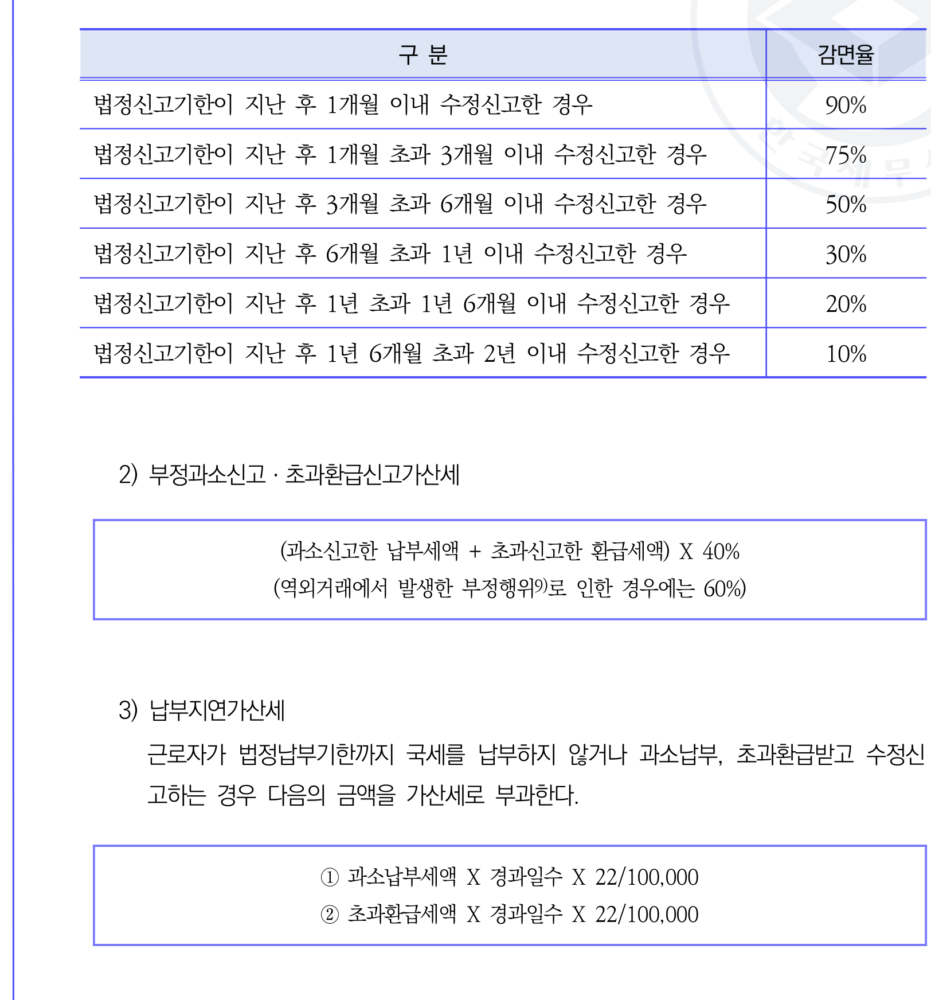

```markdown
| 구분                                               | 감면율 |
|--------------------------------------------------|-------|
| 법정신고기한이 지난 후 1개월 이내 수정신고한 경우         | 90%   |
| 법정신고기한이 지난 후 1개월 초과 3개월 이내 수정신고한 경우 | 75%   |
| 법정신고기한이 지난 후 3개월 초과 6개월 이내 수정신고한 경우 | 50%   |
| 법정신고기한이 지난 후 6개월 초과 1년 이내 수정신고한 경우  | 30%   |
| 법정신고기한이 지난 후 1년 초과 1년 6개월 이내 수정신고한 경우 | 20%   |
| 법정신고기한이 지난 후 1년 6개월 초과 2년 이내 수정신고한 경우 | 10%   |
```

2) 부정과소신고 · 초과환급신고가산세

(과소신고한 납부세액 + 초과신고한 환급세액) X 40%  
(역외거래에서 발생한 부정행위로 인한 경우에는 60%)

3) 납부지연가산세

근로자가 법정납부기한까지 국세를 납부하지 않거나 과소납부, 초과환급받고 수정신고하는 경우 다음의 금액을 가산세로 부과한다.

1. 과소납부세액 X 경과일수 X 22/100,000  
2. 초과환급세액 X 경과일수 X 22/100,000  
```

<<SPLIT>>
elementId: 106
연말정산
세무
<<SPLIT>>
elementId: 107
9) 부정행위란 조세의 부과와 징수를 불가능하게 하거나 현저히 곤란하게 하는 위계 등을 통해 국세를 포
탈하거나 환급, 공제받는 것으로, 예를 들어 거짓 증빙, 거짓 문서의 작성 및 수취를 말함.
<<SPLIT>>
elementId: 108
58
<<SPLIT>>
elementId: 109
196
<<SPLIT>>
elementId: 110
제1장 근로소득 연말정산(이론편)
<<SPLIT>>
elementId: 111
[참고] 가산세 적용차이
<<SPLIT>>
elementId: 112
[원천징수의무자 수정신고 VS 근로자 수정신고]
<<SPLIT>>
elementId: 113
1. 원천징수의무자가 연말정산을 이행한 후 원천징수의무자가 수정신고하는 경우에는 원천징
<<SPLIT>>
elementId: 114
수 등 납부지연가산세를 적용하는 것임
2. 원천징수의무자가 연말정산을 이행한 후 근로자가 소득및세액공제 관련서류를 잘못 제출하
여 근로자가 직접 수정신고하는 경우에는 신고관련 가산세 및 납부지연가산세를 적용한다.
3. 근로자가 허위기부금영수증을 제출하고 부당한 소득공제를 적용하여 연말정산 한 경우 근
로소득자가 수정신고시 부당과소신고가산세 및 납부지연가산세를 적용하고 원천징수의무
자가 부당공제된 신고분을 수정하여 신고하는 경우 원천징수의무자는 원천징수등 납부지
연가산세가 적용되고 관할세무서장은 근로자의 근로소득세를 경정하여 부당과소신고가산
세가 적용하는 것임(원천세과-499. 2009.6.9.).
<<SPLIT>>
elementId: 115
[저자주] 수정신고시 근로자의 잘못이 확인되는 경우 원천징수의무자 및 근로자 모두에게 가
산세가 부과되나 원천징수의무자의 오류 등으로 수정신고하는 경우에는 원천징수등납부지연
가산세만 적용한다. 실무에서는 근로자의 부정행위가 아닌 사실관계를 파악 후 원천징수의무
자가 직접 신고하면 원천징수등납부지연가산세만을 적용하여 근로자에 대한 과소신고가산세
를 줄일 수 있을 것으로 판단된다.
<<SPLIT>>
elementId: 116
09 지급명세서 제출
<<SPLIT>>
elementId: 117
원천징수의무자는 연말정산 이행한 후 근로소득지급명세서(중도퇴사자 포함10))
를 다음연도인 2025.3.10. 11)(휴업, 폐업 또는 해산한 경우에는 휴업일, 폐업일 또
는 해산일이 속하는 달의 다음다음 달 말일)까지 관할 세무서장에게 제출하여야 한
다(소득법 164조 1항).
<<SPLIT>>
elementId: 118
10) 중도퇴사자 지급명세서를 제출하지 아니하여 가산세를 부과 받는 경우가 흔하다. 주의해야 한다.
<<SPLIT>>
elementId: 119
11) 1. 다음연도 3. 10 : 사업소득, 근로소득, 퇴직소득, 기타소득 중 종교인소득 및 봉사료 소득
2. 다음연도 2월 말일 : 그 외 소득
<<SPLIT>>
elementId: 120
제
1장
근로소득
연말정산(이론편)
<<SPLIT>>
elementId: 121
제2장
근로소득
연말정산(실전편)
제3장
연말정산
세액의
계산
제4장
근로소득자의
연말정산
후
4대보험
정산
<<SPLIT>>
elementId: 122
59
<<SPLIT>>
elementId: 123
|  |  |
| --- | --- |
|  | (1) 제출대상 근로소득을 지급하는 자는 반드시 그 소득에 대한 지급명세서를 작성하여 제출하여야 한다. 지급명세서의 제출방식은 다음의 2가지 절차에 따른다. ① 간이지급명세서의 제출 ② 지급명세서의 제출 간이지급명세서의 제출은 지급하는 반기를 기준으로 하는 중간보고의 역할을 하는 것으 로써 근로장려금의 원활한 지급을 위해 제출한다. 지급명세서는 연간 지급총액으로서 최 종 연말정산 이행을 완료 후 확정내역을 보고하는 절차이다. (2) 가산세 지급명세서를 제출하여야 할 자가 기한 내에 제출하지 아니하였거나 제출된 지급명세서 가 불분명하거나 기재된 지급금액이 사실과 다른 경우 지급금액 또는 불분명한 지급금 액에 가산세율을 적용하여 결정세액에 가산한다(소득법 81조의11)12). 1) 근로소득 지급명세서 미제출가산세13) 지급명세서를 제출하지 아니한 경우 아래의 가산세를 부담한다. ① 지급명세서를 기한까지 미제출 미제출한 지급금액의 1%(3개월 내에 제출하는 경우 0.5%14)). 단, 일용근로자의 근로소득 지급명세서를 미제출하는 경우 0.25%(3개월 내에 제출하는 경우 0.12 5%15)) ② 제출된 지급명세서가 불분명16)하거나 사실과 다른 경우 해당 금액의 1%. 단, 12) 지급명세서 관련 가산세는 법인세 또는 소득세 신고시 가산세를 기재하는 것임. 13) 퇴직소득, 종교인소득도 동일하게 적용됨. 14) 지연제출. 연말정산 15) 지연제출. 16) 불분명 사유 ① 제출된 지급명세서에 지급자 또는 소득자의 주소, 성명, 납세번호(주민등록번호 갈음시 주민등록번 세무 호, 사업자등록번호, 소득의 종류, 귀속연도 또는 지급액을 적지 않았거나 잘못적어 지급사실이 확 인할 수 없는 경우 등 ② 제출된 간이지급명세서에 지급자 또는 소득자의 주소, 성명, 납세번호(주민등록번호 갈음시 주민등 |
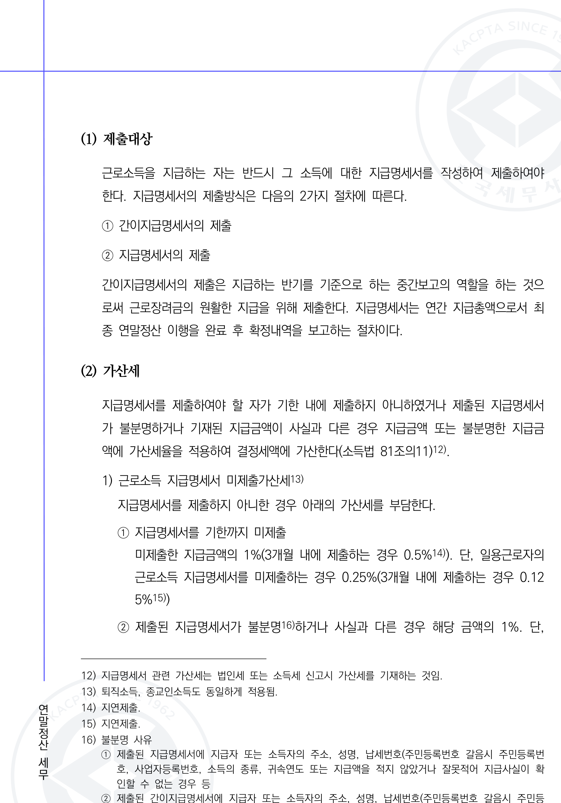

1. **제출대상**

   - 근로소득을 지급하는 자는 반드시 그 소득에 대한 지급명세서를 작성하여 제출해야 한다. 지급명세서의 제출방식은 다음의 2가지 절차에 따른다.
     1. 간이지급명세서의 제출
     2. 지급명세서의 제출

   - 간이지급명세서의 제출은 지급하는 반기를 기준으로 하는 중간보고의 역할을 하는 것으로서 근로장려금의 원활한 지급을 위해 제출한다. 지급명세서는 연간 지급총액으로서 최종 연말정산 이행을 완료 후 확정내역을 보고하는 절차이다.

2. **가산세**

   - 지급명세서를 제출하여야 할 자가 기한 내에 제출하지 아니하였거나 제출된 지급명세서가 불분명하거나 기재된 지급금액이 사실과 다른 경우 지급금액 또는 불분명한 지급금액에 가산세율을 적용하여 결정세액에 가산한다(소득법 81조의11).

   1. **근로소득 지급명세서 미제출가산세**

      - 지급명세서를 제출하지 아니한 경우 아래의 가산세를 부담한다.
        1. 지급명세서를 기한까지 미제출
           - 미제출한 지급금액의 1%(3개월 내에 제출하는 경우 0.5%). 단, 일용근로자의 근로소득 지급명세서를 미제출하는 경우 0.25%(3개월 내에 제출하는 경우 0.125%).
        2. 제출된 지급명세서가 불분명하거나 사실과 다른 경우 해당 금액의 1%. 단, 불분명 사유:
           - 제출된 지급명세서에 지급자 또는 소득자의 주소, 성명, 납세번호(주민등록번호 감수) 주민등록번호, 사업자등록번호, 소득의 종류, 귀속연도 또는 지급액이 적지 않았거나 잘못 적어 지급사실이 확인될 수 없는 경우 등.

<<SPLIT>>
elementId: 124
60
<<SPLIT>>
elementId: 125
제1장 근로소득 연말정산(이론편)
<<SPLIT>>
elementId: 126
일용근로자 지급명세서의 경우 불분명하거나 사실과 다른 경우 해당 금액의
0.25%)
<<SPLIT>>
elementId: 127
2) 가산세 한도
<<SPLIT>>
elementId: 128
지급명세서 제출불성실가산세는 과세기간 단위로 5천만원(사업자가 아닌 자도 동일
적용되며, 중소기업기본법 제2조에 따른 중소기업이 아닌 기업은 1억원)을 한도로
한다. 다만, 고의적으로 위반한 경우 해당 한도를 적용하지 아니한다(국기법 제49조
1항).
<<SPLIT>>
elementId: 129
3) 유의사항
<<SPLIT>>
elementId: 130
① 당초 제출한 일용근로소득 지급명세서상 금액을 착오로 과다하게 기재하여 이를
수정하여 제출하는 경우 과다기재분에 대해서 지급명세서 보고불성실가산세를 적
용함(소득, 서면법규과-393, 2013.4.8.).
② 제출된 지급명세서에 지급자 또는 소득자의 주소 · 성명 · 납세번호, 사업자등록번
호, 소득의 종류, 소득의 귀속연도 또는 지급액을 적지 않았거나 잘못 적어 지급
사실을 확인할 수 없는 경우에는 분분명 사유로 가산세가 적용된다.
③ 소득구분 착오로 근로소득을 기타소득으로 지급명세서를 제출한 경우 근로소득지
급명세서를 제출하지 아니하였으므로 지급명세서 미제출가산세를 적용함(소득원천
세과-259, 2012.5.11.)
④ 단순착오로 원천징수의무자와 소득자 명의를 잘못 기재하여 원천징수하고 신고,
납부하고 지급명세서를 제출하는 경우 지급명세서 보고불성실 가산세가 적용되는
것임(소득, 원천세과-590, 2011.11.2.)
<<SPLIT>>
elementId: 131
(3) 제출시기
<<SPLIT>>
elementId: 132
연말정산분 지급명세서의 제출시기는 다음연도 3월10일까지이다. 3월10일이 휴일인 경
우는 휴일의 다음날로 기한연장되고 원천징수의무자가 휴업 또는 폐업한 경우 휴업일
또는 폐업일이 속하는 달의 다음 다음달 말일까지 제출해야 한다.
<<SPLIT>>
elementId: 133
록번호, 사업자등록번호, 소득의 종류, 귀속연도 또는 지급액을 적지 않았거나 잘못적어 지급사실이
확인할 수 없는 경우 등
<<SPLIT>>
elementId: 134
61
<<SPLIT>>
elementId: 135
제
1장
근로소득
연말정산(이론편)
<<SPLIT>>
elementId: 136
제3장
연말정산
세액의
계산
제4장
근로소득자의
연말정산
후
4대보험
정산
<<SPLIT>>
elementId: 137
제2장
근로소득
연말정산(실전편)
<<SPLIT>>
elementId: 138
(4) 지급명세서 제출의무
<<SPLIT>>
elementId: 139
연말정산분 지급명세서는 면제규정이 없으므로 반드시 제출하여야 한다.
<<SPLIT>>
elementId: 140
(5) 지급명세서 제출방식
<<SPLIT>>
elementId: 141
원천징수의무자는 지급명세서의 기재사항을 「국세기본법」 제2조 18호 규정에 따른 정
보통신망에 의하여 제출하거나 전산처리된 디스켓 등 전자적 정보저장매체로 제출하여
야 한다. 이 경우 현금영수증 발급장치 등의 방법을 통해 제출할 수도 있다(소득법
164조 3항). 또한, 직전 과세기간에 제출한 지급명세서의 매수가 50매 미만인 자 또는
상시근로자의 수(매월말일의 현황에 따른 평균인원수를 말함)가 10명 이하인 자는 문서
로 제출하게 할 수 있다(소득법 제164조 4항). 다만, 금융보험업자, 국가 · 지방자치단체
또는 지방자치단체조합. 법인, 복식부기의무자는 문서로 제출할 수 없다(소득령 제214조
3항).
<<SPLIT>>
elementId: 142
10 간이지급명세서 제출
<<SPLIT>>
elementId: 143
(1) 의의
<<SPLIT>>
elementId: 144
소득세 납세의무가 있는 개인에게 상용근로소득을 지급하는 자(원천징수 대리, 위임, 납
세조합, 사업자 단위과세사업자 포함)는 그 지급일이 속하는 반기의 마지막 달의 다음
달 말일17)(휴업, 폐업 또는 해산한 경우 휴업일 등이 속하는 달의 다음달 말일)까지 원
천징수 관할 세무서장 등에게 제출하여야 한다(소득법 164조의 3).
<<SPLIT>>
elementId: 145
(2) 가산세
<<SPLIT>>
elementId: 146
1) 간이지급명세서 미제출 가산세
근로소득 간이지급명세서를 제출해야 하는 자가 그 기한까지 제출하지 아니한 경우
에는 제출하지 아니한 금액의 0.25%를 가산세로 부담한다.
<<SPLIT>>
elementId: 147
연말정산
세무
<<SPLIT>>
elementId: 148
17) 2026.1.1. 이후 지급분부터는 지급일이 속하는 달의 다음 달 말일로 변경 적용함.
<<SPLIT>>
elementId: 149
62
<<SPLIT>>
elementId: 150
제1장 근로소득 연말정산(이론편)
<<SPLIT>>
elementId: 151
2) 간이지급명세서 불분명 등 가산세
<<SPLIT>>
elementId: 152
근로소득 간이지급명세서를 제출해야 하는 자가 제출한 지급명세서의 내용이 불분명
하거나 사실과 다른 경우 해당 금액의 0.25%를 가산세로 부담한다.
<<SPLIT>>
elementId: 153
3) 간이지급명세서 지연제출 가산세
근로소득 간이지급명세서를 제출해야 하는 자가 제출기한이 지난 후 1개월 이내에
제출하는 경우에는 해당 금액의 0.125%를 가산세로 부담한다.
<<SPLIT>>
elementId: 154
(3) 간이지급명세서 제출방식
<<SPLIT>>
elementId: 155
원천징수의무자는 간이지급명세서의 기재사항을 「국세기본법」 제2조 18호 규정에 따른
정보통신망에 의하여 제출하거나 전산처리된 디스켓 등 전자적 정보저장매체로 제출하
여야 한다. 이 경우 현금영수증 발급장치 등의 방법을 통해 제출할 수 있다(소득법 164조
3항). 또한, 직전 과세기간에 제출한 지급명세서의 매수가 20매 미만인 자 또는 상시
근로자의 수(매월말일의 현황에 따른 평균인원수를 말함)가 5명 이하인 자는 문서로
제출하게 할 수 있다(소득법 제164조 4항). 다만, 금융보험업자, 국가 · 지방자치단체
또는 지방자치단체조합. 법인, 복식부기의무자는 문서로 제출할 수 없다(소득령 제214조
4항).
<<SPLIT>>
elementId: 156
[참고자료] 지급명세서 관련 제출기한 및 가산세
<<SPLIT>>
elementId: 157
| 구분 | 지급명세서 종류 | 소득지급시기 | 제출기한 | 가산세율 | 가산세율 |
| --- | --- | --- | --- | --- | --- |
| 구분 | 지급명세서 종류 | 소득지급시기 | 제출기한 | 원칙 | 가산세 50% 경감 |
| 미제출 | 근로소득 간이지급명세서 | 1월~6월, 7월~12월 | 지급일이 속하는 반기의 다음 달 말일 | 0.25% | 제출기한 경과 후 3개월 이내 지연 제출 |
| 미제출 | 사업소득 간이지급명세서 | 매월 | 지급일이 속하는 달의 다음 달 말일 | 0.25% | 제출기한 경과 후 1개월 이내 지연 제출 |
| 미제출 | 일용근로소득 지급명세서 | 매월 | 지급일이 속하는 달의 다음 달 말일 | 0.25% | 제출기한 경과 후 1개월 이내 지연 제출 |
| 미제출 | 기타소득 | 매월 | 지급일이 속하는 | 0.25% | 제출기한 경과 후 |
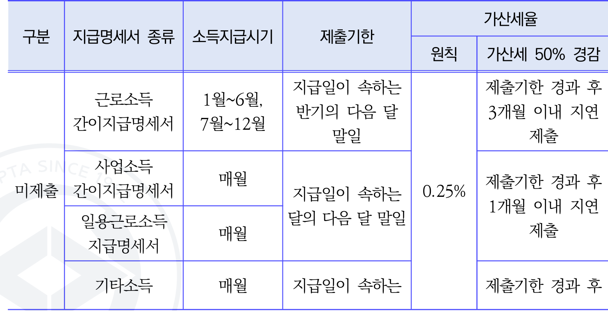

```markdown
| 구분   | 지급명세서 종류     | 소득지급시기          | 제출기한                      | 가산세율          | 가산세 50% 경감                  |
|--------|---------------------|-----------------------|-------------------------------|-------------------|----------------------------------|
| 미제출 | 근로소득            | 1월~6월, 7월~12월     | 지급일이 속하는 반기의 다음 달 말일 | 원칙              | 제출기한 경과 후 3개월 이내 지연 제출 |
| 미제출 | 간이지급명세서      | 1월~6월, 7월~12월     | 지급일이 속하는 반기의 다음 달 말일 | 0.25%             | 제출기한 경과 후 3개월 이내 지연 제출 |
| 미제출 | 사업소득            | 매월                  | 지급일이 속하는 달의 다음 달 말일 | 원칙              | 제출기한 경과 후 1개월 이내 지연 제출 |
| 미제출 | 간이지급명세서      | 매월                  | 지급일이 속하는 달의 다음 달 말일 | 0.25%             | 제출기한 경과 후 1개월 이내 지연 제출 |
| 미제출 | 일용근로소득        | 매월                  | 지급일이 속하는 달의 다음 달 말일 | 원칙              | 제출기한 경과 후 1개월 이내 지연 제출 |
| 미제출 | 지급명세서          | 매월                  | 지급일이 속하는 달의 다음 달 말일 | 0.25%             | 제출기한 경과 후 1개월 이내 지연 제출 |
| 미제출 | 기타소득            | 매월                  | 지급일이 속하는 달의 다음 달 말일 | 원칙              | 제출기한 경과 후 1개월 이내 지연 제출 |
| 미제출 |                     |                       |                               | 0.25%             | 제출기한 경과 후 1개월 이내 지연 제출 |
```

<<SPLIT>>
elementId: 158
제
1장
근로소득
연말정산(이론편)
<<SPLIT>>
elementId: 159
제2장
근로소득
연말정산(실전편)
제3장
연말정산
세액의
계산
제4장
근로소득자의
연말정산
후
4대보험
정산
<<SPLIT>>
elementId: 160
63
<<SPLIT>>
elementId: 161
| 구분 | 지급명세서 종류 | 소득지급시기 | 제출기한 | 가산세율 | 가산세율 |
| --- | --- | --- | --- | --- | --- |
| 구분 | 지급명세서 종류 | 소득지급시기 | 제출기한 | 원칙 | 가산세 50% 경감 |
|  | 간이지급명세서 (인적용역) |  | 달의 다음 달 말일 |  | 1개월 이내 지연 제출 |
|  | 근로, 퇴직, 사업 지급명세서 | 1월~12월 | 다음 연도 3월 10일 | 1% | 제출기한 경과 후 3개월 이내 지연 제출 |
|  | 이자, 배당, 기타 지급명세서 | 1월~12월 | 다음 연도 2월 말 | 1% | 제출기한 경과 후 3개월 이내 지연 제출 |
| 불분명 또는 사실과 다른 경우 | 근로소득 간이지급명세서 | 1월~6월, 7월~12월 | 지급일이 속하는 반기의 다음 달 말일 | 0.25% | 가산세 경감 없음 |
| 불분명 또는 사실과 다른 경우 | 사업소득 간이지급명세서 | 매월 | 지급일이 속하는 달의 다음 달 말일 | 0.25% | 가산세 경감 없음 |
| 불분명 또는 사실과 다른 경우 | 일용근로소득 지급명세서 | 매월 | 지급일이 속하는 달의 다음 달 말일 | 0.25% | 가산세 경감 없음 |
| 불분명 또는 사실과 다른 경우 | 근로, 퇴직, 사업 지급명세서 | 1월~12월 | 다음 연도 3월 10일 | 1% | 가산세 경감 없음 |
| 불분명 또는 사실과 다른 경우 | 이자, 배당, 기타 지급명세서 | 1월~12월 | 다음 연도 2월 말 | 1% | 가산세 경감 없음 |
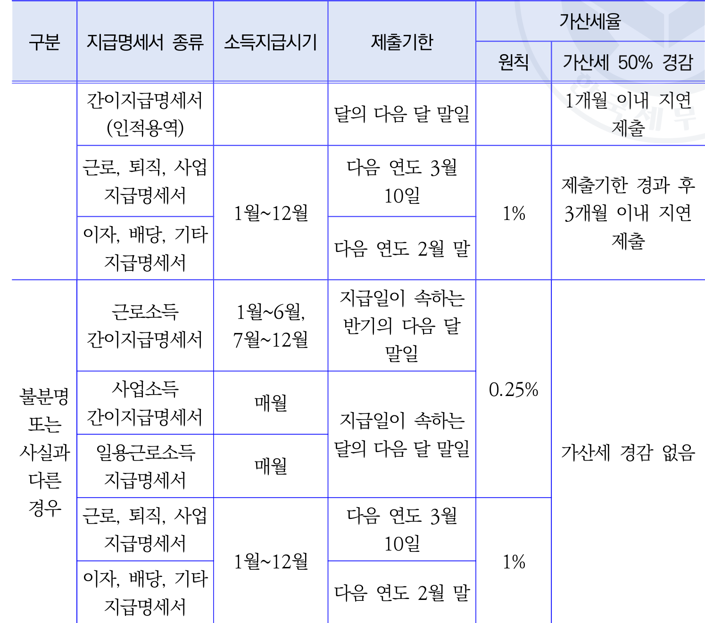

```markdown
| 구분                     | 지급명세서 종류               | 소득지급시기 | 제출기한                | 가산세율                | 원칙          | 가산세 50% 경감            |
|--------------------------|------------------------------|--------------|-------------------------|-------------------------|---------------|----------------------------|
|                          | 간이지급명세서 (인적용역)    |              | 달의 다음 달 말일       |                         | 1개월 이내 지연 제출 |                            |
| 근로, 퇴직, 사업 지급명세서 | 근로, 퇴직, 사업 지급명세서 | 1월~12월     | 다음 연도 3월 10일      | 1%                      | 제출기한 경과 후 3개월 이내 지연 제출 | |
|                          | 이자, 배당, 기타 지급명세서  | 1월~12월     | 다음 연도 2월 말        | 1%                      | 제출기한 경과 후 3개월 이내 지연 제출 | |
| 근로소득 간이지급명세서  | 근로소득 간이지급명세서      | 1월~6월, 7월~12월 | 지급일이 속하는 반기의 다음 달 말일 | 0.25%                   | 가산세 경감 없음           |
| 불분명 또는 사실과 다른 경우 | 사업소득 간이지급명세서     | 매월         | 지급일이 속하는 달의 다음 달 말일 | 0.25%                   | 가산세 경감 없음           |
|                          | 일용근로소득 지급명세서      | 매월         | 지급일이 속하는 달의 다음 달 말일 | 0.25%                   | 가산세 경감 없음           |
| 근로, 퇴직, 사업 지급명세서 | 근로, 퇴직, 사업 지급명세서 | 1월~12월     | 다음 연도 3월 10일      | 1%                      | 제출기한 경과 후 3개월 이내 지연 제출 | |
|                          | 이자, 배당, 기타 지급명세서  | 1월~12월     | 다음 연도 2월 말        | 1%                      | 제출기한 경과 후 3개월 이내 지연 제출 | |
```

<<SPLIT>>
elementId: 162
※ 간이지급명세서 대상이 되는 인적용역 기타소득 (기타소득 중 강의료 등(76), 자문료
등(79) 코드에 해당하는 자료만 매월 제출)
아래 인적용역을 일시적으로 제공하고 대가를 수취하여 발생하는 기타소득을 말한다.
<<SPLIT>>
elementId: 163
연말정산
세무
<<SPLIT>>
elementId: 164
- 고용관계 없이 다수인에게 강연을 하고 강연료 등 대가를 받는 용역
- 라디오, TV방송 등을 통하여 해설 · 계몽 또는 연기의 심사 등을 하고 보수 등의
대가를 받는 용역
변호사, 공인회계사, 세무사, 건축사, 변리사 등이 그 지식 등을 활용하여 보수
등의 대가를 받고 제공하는 용역
- 그 외 고용관계 없이 수당 등의 대가를 받고 제공하는 용역
단, 2024년도 중 인적용역 기타소득에 대한 간이지급명세서를 제출하지 못했지만
<<SPLIT>>
elementId: 165
64
<<SPLIT>>
elementId: 166
제1장 근로소득 연말정산(이론편)
<<SPLIT>>
elementId: 167
2025년 2월 말일까지 '거주자의 기타소득 지급명세서'를 제출한 경우에 한하여
간이지급명세서(거주자의 기타소득)를 미제출하더라도 가산세가 면제된다.
<<SPLIT>>
elementId: 168
※ 지급명세서와 간이지급명세서를 모두 제출하지 않은 경우의 가산세
지급명세서와 간이지급명세서를 모두 제출하지 않은 경우, 둘 중 높은 가산세(1%)
만 적용한다(중복적용 배제). 다만, 연말정산 사업소득은 지급명세서와 간이지급명세
서 제출 불성실가산세는 모두 적용한다(중복적용).
<<SPLIT>>
elementId: 169
※ 식대금액의 지급명세서 제출
<<SPLIT>>
elementId: 170
식대의 경우 2023년부터 비과세소득 지급현황 파악을 위해 식대금액의 경우 지급
명세서를 제출하도록 변경되었으므로 지급명세서 제출시 금액작성에 유의해야 한다
(2023.2.28. 이후 적용).
<<SPLIT>>
elementId: 172
| 법 조 문 | 비과세 항목 | 포함 여부 |
| --- | --- | --- |
| 소득법 12조 3호 가목 | 복무중인 병이 받는 급여 | x |
| 소득법 12조 3호 나목 | 법률에 따라 동원직장에서 받는 급여 | x |
| 소득법 12조 3호 다목 | 산업재해보상보험법에 따라 지급받는 요양급여 등 | x |
| 소득법 12조 3호 라목 | 근로기준법 등에 따라 지급받는 요양보상금 등 | x |
| 소득법 12조 3호 마목 | 고용보험법에 따라 받는 육아휴직급여 등 | x |
| 소득법 12조 3호 마목 | 국가공무원법 등에 따라 받는 육아휴직수당 등 | x |
| 소득법 12조 3호 바목 | 국민연금법에 따라 받는 반환일시금(사망으로 받는 것에 한함) 및 사망일시금 | x |
| 소득법 12조 3호 사목 | 공무원연금법 등에 따라 받는 요양비 등 | x |
| 소득법 12조 3호 아목 | 비과세 학자금(소득령 11조) | ○ |
| 소득법 12조 3호 자목 | 소득령 12 2 3(일직료 · 숙직료 등) | x |
| 소득법 12조 3호 자목 | 소득령 12 3(자가운전보조금) | X |
**[필수] 근로소득원천징수영수증상 비과세 근로소득 지급명세서 포함 여부**
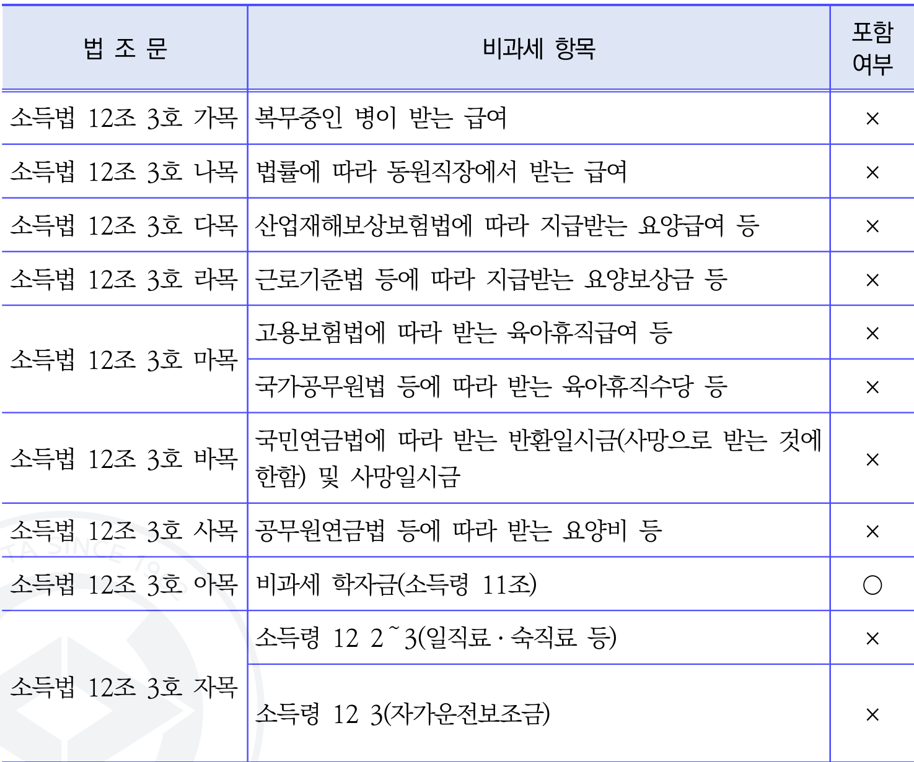

```markdown
| 법 조문         | 비과세 항목                                                                 | 포함 여부 |
|-----------------|----------------------------------------------------------------------------|----------|
| 소득법 12조 3호 가목 | 북무중인 병이 받는 급여                                                      | ×        |
| 소득법 12조 3호 나목 | 법률에 따라 동일직장에서 받는 급여                                            | ×        |
| 소득법 12조 3호 다목 | 산업재해보상보험법에 따라 지급받는 요양급여 등                                | ×        |
| 소득법 12조 3호 라목 | 근로기준법 등에 따라 지급받는 요양보상금 등                                   | ×        |
| 소득법 12조 3호 마목 | 고용보험법에 따라 받는 육아휴직급여 등                                        | ×        |
| 소득법 12조 3호 바목 | 국가공무원법 등에 따라 받는 육아휴직수당 등                                    | ×        |
| 소득법 12조 3호 사목 | 국민연금법에 따라 받는 반환일시금(사망으로 받는 것에 한함) 및 사망일시금         | ×        |
| 소득법 12조 3호 아목 | 공무원연금법 등에 따라 받는 요양비 등                                         | ×        |
| 소득법 12조 3호 자목 | 비과세 학자금(소득령 11조)                                                   | ○        |
| 소득법 12조 3호 자목 | 소득령 12 2~3(일직료·숙직료 등)                                             | ×        |
| 소득법 12조 3호 자목 | 소득령 12 3(자가운전보조금)                                                 | ×        |
```

<<SPLIT>>
elementId: 173
제
1장
근로소득
연말정산(이론편)
<<SPLIT>>
elementId: 174
제2장
근로소득
연말정산(실전편)
제3장
연말정산
세액의
계산
제4장
근로소득자의
연말정산
후
4대보험
정산
<<SPLIT>>
elementId: 175
65
<<SPLIT>>
elementId: 176
| 법 조 문 | 비과세 항목 | 포함 여부 |
| --- | --- | --- |
|  | 소득령 12 4 · 8(법령에 의해 착용하는 제복 등) | X |
|  | 소득령 12 9 11(경호수당, 승선수당 등) | ○ |
|  | 소득령 12 12 가(연구보조비) - 유아교육법, 초중등교육법 | ○ |
|  | 소득령 12 12 가(연구보조비) - 고등교육법 | ○ |
|  | 소득령 12 12 가(연구보조비) - 특별법에 따른 교육기관 | ○ |
|  | 소득령 12 12 나(연구보조비 등) | ○ |
|  | 소득령 12 12 다(연구보조비 등) | ○ |
|  | 소득령 12 13 가(보육교사 근무환경개선비) | ○ |
|  | 소득령 12 13 나(사립유치원 수석교사 · 교사 인건비) | ○ |
|  | 소득령 12 14(취재수당) | ○ |
|  | 소득령 12 15(벽지수당) | ○ |
|  | 소득령 12 16(천재 · 지변 등 재해로 받는 급여) | ○ |
|  | 소득령 12 17(정부 · 공공기관 중 지방이전기관 종사자 이 전지원금) |  |
|  | 소득령 12 18(종교관련종사자가 소속 종교단체의 규약 또 는 소속 종교단체의 의결기구의 의결 · 승인 등을 통하여 결정된 지급 기준에 따라 종교 활동을 위하여 통상적으로 사용할 목적으로 지급받은 금액 및 물품) | ○ |
| 소득법 12조 3호 차목 | 외국정부 또는 국제기관에 근무하는 사람에 대한 비과세 | ○ |
| 소득법 12조 3호 카목 | 보훈급여금 및 학습보조비 | x |
| 소득법 12조 3호 타목 | 전직대통령 예우에 관한 법률에 따라 받는 연금 | x |
| 소득법 12조 3호 파목 | 작전임무 수행을 위해 외국에 주둔하는 군인 등이 받는 급여 | ○ |
| 소득법 12조 3호 하목 | 종군한 군인 등이 전사한 경우 해당 과세기간의 급여 | x |
| 소득법 12조 3호 거목 | 소득령 16 ① 1(국외 근로 보수) 100만원 | ○ |
**연말정산세무**
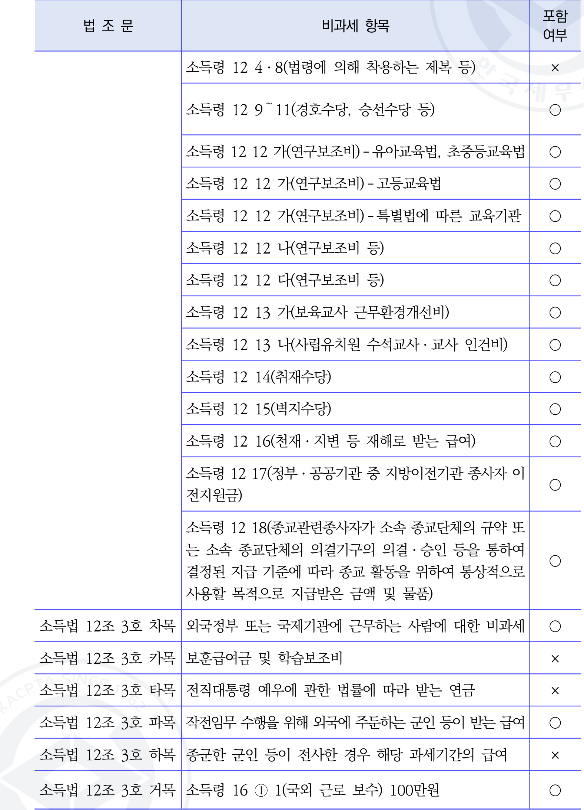

```markdown
| 법 조 문            | 비과세 항목                                                                                                                                   | 포함 여부 |
|---------------------|--------------------------------------------------------------------------------------------------------------------------------------------|--------|
| 소득령 12 4·8       | 소득령 12 4·8(법령에 의해 착용하는 제복 등)                                                                                                      | ×      |
| 소득령 12 9~11      | 소득령 12 9~11(경호수당, 승선수당 등)                                                                                                           | ○      |
| 소득령 12 12 가     | 소득령 12 12 가(연구보조비) - 유아교육법, 초중등교육법                                                                                             | ○      |
| 소득령 12 12 가     | 소득령 12 12 가(연구보조비) - 고등교육법                                                                                                         | ○      |
| 소득령 12 12 가     | 소득령 12 12 가(연구보조비) - 특별법에 따른 교육기관                                                                                               | ○      |
| 소득령 12 12 나     | 소득령 12 12 나(연구보조비 등)                                                                                                                  | ○      |
| 소득령 12 12 다     | 소득령 12 12 다(연구보조비 등)                                                                                                                  | ○      |
| 소득령 12 13 가     | 소득령 12 13 가(보육교사 근무환경개선비)                                                                                                         | ○      |
| 소득령 12 13 나     | 소득령 12 13 나(사립유치원 수석교사·교사 인건비)                                                                                                  | ○      |
| 소득령 12 14        | 소득령 12 14(취재수당)                                                                                                                        | ○      |
| 소득령 12 15        | 소득령 12 15(벽지수당)                                                                                                                        | ○      |
| 소득령 12 16        | 소득령 12 16(천재·지변 등 재해로 받는 급여)                                                                                                       | ○      |
| 소득령 12 17        | 소득령 12 17(정부·공공기관 중 지방이전기관 종사자 이전지원금)                                                                                       | ○      |
| 소득령 12 18        | 소득령 12 18(종교관련종사자가 소속 종교단체의 규약 또는 소속 종교단체의 의결기구의 의결·승인 등을 통하여 결정된 지급 기준에 따라 종교 활동을 위하여 통상적으로 사용함 목적으로 지급받은 금액 및 물품) | ○      |
| 소득법 12조 3호 차목 | 외국정부 또는 국제기구에 근무하는 사람에 대한 비과세                                                                                                 | ○      |
| 소득법 12조 3호 카목 | 보훈급여금 및 학습보조비                                                                                                                      | ×      |
| 소득법 12조 3호 타목 | 전직대통령 예우에 관한 법률에 따라 받는 연금                                                                                                      | ×      |
| 소득법 12조 3호 파목 | 작전임무 수행을 위해 외국에 주둔하는 군인 등이 받는 급여                                                                                             | ○      |
| 소득법 12조 3호 하목 | 종군한 군인 등이 전사한 경우 해당 과세기간의 급여                                                                                                  | ○      |
| 소득법 12조 3호 거목 | 소득령 16 ① (국외 근로 보수) 100만원                                                                                                          | ○      |
```

<<SPLIT>>
elementId: 178
66
<<SPLIT>>
elementId: 179
제1장 근로소득 연말정산(이론편)
<<SPLIT>>
elementId: 180
사회
<<SPLIT>>
elementId: 181
| 법 조 문 | 비과세 항목 | 포함 여부 |
| --- | --- | --- |
|  | 소득령 16 ① 1(국외 근로 보수) 300만원 | ○ |
|  | 소득령 16 ① 2(국외근로) | ○ |
| 소득법 12조 3호 너목 | 국민건강보험법 등에 따라 사용자 등이 부담하는 보험료 | x |
| 소득법 12조 3호 더목 | 생산직 등에 종사하는 근로자의 야간수당 등 | ○ |
| 소득법 12조 3호 러목 | 비과세 식사대(월 20만원 이하) | ○ |
| 소득법 12조 3호 러목 | 현물 급식 | x |
| 소득법 12조 3호 머목 | 출산, 6세 이하의 자녀의 보육 관련 비과세(월 10만원 이내) | ○ |
| 소득법 12조 3호 버목 | 국군포로가 지급받는 보수 등 | x |
| 소득법 12조 3호 서목 | 교육기본법 28 제1항에 따라 받는 장학금 | ○ |
| 소득법 12조 3호 어목 | 소득령 17의3 비과세 직무발명보상금 | ○ |
| 소득법 12조 3호 저목 | 사택제공이익, 주택자금 저리 · 무상 대여이익 등 | x |
| 소득법 12조 3호 자목 | 소득령 12 13 다(전공의 수련보조수당) | ○ |
| 구 조특법 15조 | 주식매수선택권 비과세 | ○ |
| 조특법 16조의2 | 벤처기업 주식매수선택권 행사이익 비과세 | ○ |
| 조특법 88조의4 6항 | 우리사주조합 인출금 비과세(50%, 75%, 100%) | ○ |
| 조특법 18조 | 외국인 기술자 소득세 감면(50%, 70%) | ○ |
| 조특법 19조 | 성과공유 중소기업의 경영성과급에 대한 세액공제 등 | ○ |
| 조특법 29조의6 | 중소기업 · 중견기업 청년근로자 및 핵심인력 성과보상기 금 수령액에 대한 소득세 감면 등(30%, 50%, 90%) | ○ |
| 조특법 18조의3 | 내국인 우수인력의 국내복귀에 대한 소득세 감면 | ○ |
| 조특법 30조 | 중소기업에 취업하는 청년 등에 대한 소득세 감면(50%, 70%, 90%) | ○ |
| 조세조약 | 조세조약상 소득세 면제(교사, 교수) |  |
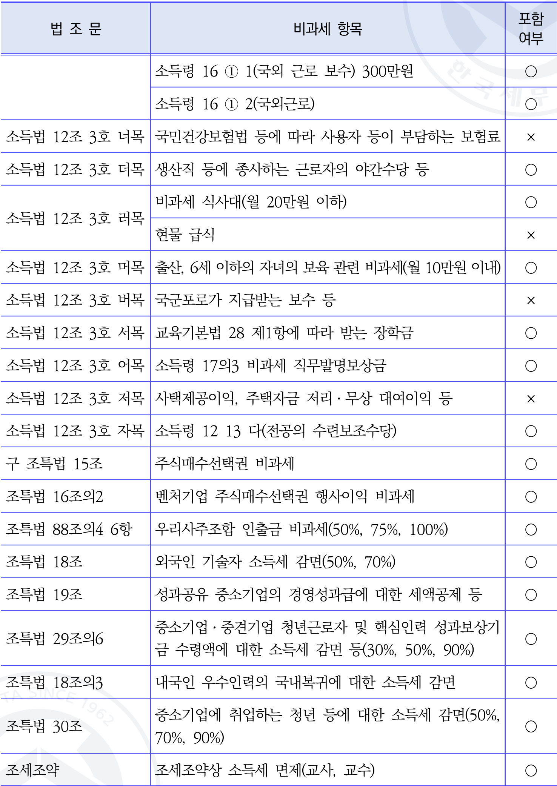

```markdown
| 법 조 문         | 비과세 항목                                                                 | 포함 여부 |
|------------------|---------------------------------------------------------------------------|---------|
| 소득령 16 ① 1   | 소득령 16 ① 1(국외 근로 보수) 300만원                                      | ○       |
| 소득령 16 ① 2   | 소득령 16 ① 2(국외근로)                                                    | ○       |
| 소득법 12조 3호 너목 | 국민건강보험법 등에 따라 사용자 등이 부담하는 보험료                        | ×       |
| 소득법 12조 3호 더목 | 생산직 등에 종사하는 근로자의 야간수당 등                                  | ○       |
| 소득법 12조 3호 러목 | 비과세 식사대(월 20만원 이하)                                              | ○       |
| 소득법 12조 3호 러목 | 현물 급식                                                                | ×       |
| 소득법 12조 3호 머목 | 출산, 6세 이하의 자녀의 보육 관련 비과세(월 10만원 이내)                    | ○       |
| 소득법 12조 3호 버목 | 국군포로가 지급받는 보수 등                                               | ×       |
| 소득법 12조 3호 서목 | 교육기본법 28 제1항에 따라 받는 장학금                                     | ○       |
| 소득법 12조 3호 어목 | 소득령 17의3 비과세 직무발명보상금                                        | ○       |
| 소득법 12조 3호 저목 | 사택제공이익, 주택자금 저리·무상 대여이익 등                                | ×       |
| 소득법 12조 3호 자목 | 소득령 12 13 다(전공의 수련보조수당)                                      | ○       |
| 구 조특법 15조    | 주식매수선택권 비과세                                                      | ○       |
| 조특법 16조의2    | 벤처기업 주식매수선택권 행사이익 비과세                                      | ○       |
| 조특법 88조의4 6항 | 우리사주조합 인출금 비과세(50%, 75%, 100%)                                  | ○       |
| 조특법 18조      | 외국인 기술자 소득세 감면(50%, 70%)                                         | ○       |
| 조특법 19조      | 성과공유 중소기업의 경영성과급에 대한 재액공제 등                              | ○       |
| 조특법 29조의6   | 중소기업·중견기업 청년근로자 및 핵심인력 성과보상기금 수령액에 대한 소득세 감면 등(30%, 50%, 90%) | ○       |
| 조특법 18조의3   | 내국인 우수인력의 국내복귀에 대한 소득세 감면                                  | ○       |
| 조특법 30조      | 중소기업에 취업하는 청년 등에 대한 소득세 감면(50%, 70%, 90%)                  | ○       |
| 조세조약         | 조세조약상 소득세 면제(교사, 교수)                                           | ○       |
```

<<SPLIT>>
elementId: 182
67
<<SPLIT>>
elementId: 183
제
1장
근로소득
연말정산(이론편)
제2장
근로소득
연말정산(실전편)
제3장
연말정산
세액의
계산
제4장
근로소득자의
연말정산
후
4대보험
정산
<<SPLIT>>
elementId: 184
11 기타의 세무서 제출서류
<<SPLIT>>
elementId: 185
(1) 의료비 지급명세서
<<SPLIT>>
elementId: 186
원천징수의무자는 근로소득세액 연말정산 시 특별세액공제 대상이 되는 의료비가 있는
근로자에 대해서는 근로소득지급명세서를 제출할 때에 해당 근로자의 의료비지급명세서
가 전산처리된 테이프 또는 디스켓을 관할 세무서장에게 제출하여야 한다(소득령 118조
의5 3항).
<<SPLIT>>
elementId: 187
(2) 기부금명세서
<<SPLIT>>
elementId: 188
원천징수의무자는 근로소득세액 연말정산 또는 사업소득세액의 연말정산을 할 때 기부금
세액공제를 적용받은 거주자에 대해서는 지급명세서를 제출할 때에 해당 거주자의 기부
금명세서가 전산처리된 테이프 또는 디스켓을 관할세무서장에게 제출하여야 한다(소득령
118조의7, 2항).
<<SPLIT>>
elementId: 189
12 비거주자의 연말정산
<<SPLIT>>
elementId: 190
(1) 거주자와 비거주자의 구분
<<SPLIT>>
elementId: 191
비거주자의 연말정산은 거주자의 방식과 다르므로 거주자 · 비거주자의 구분은 매우 중요
하다. 구분 방법에 대해 알아보자
<<SPLIT>>
elementId: 192
(1) 거주자와 비거주자의 판단기준
<<SPLIT>>
elementId: 193
국내에 주소를 두거나 183일 이상 거소를 둔 개인은 거주자라 하고, 거주자가 아닌
개인을 비거주자라 한다(소득법 1조의2, 소득령 2조).
<<SPLIT>>
elementId: 194
연말정산
세무
68
<<SPLIT>>
elementId: 195
196
<<SPLIT>>
elementId: 196
제1장 근로소득 연말정산(이론편)
<<SPLIT>>
elementId: 197
[필수]
<<SPLIT>>
elementId: 198
1. 주소는 국내에서 생계를 같이 하는 가족 및 국내에 소재하는 자산의 유무 등 생활관계의
객관적 사실에 따라 판정한다.
2. 거소는 주소지 외의 장소 중 상당기간에 걸쳐 거주하는 장소로서 주소와 같이 밀접한 일반
적 생활관계가 형성되지 아니하는 장소를 말한다.
<<SPLIT>>
elementId: 199
(2) 주소와 거소의 판정
<<SPLIT>>
elementId: 200
1) 국내에 거주하는 개인이 국내에 주소를 가진 것으로 보는 경우(소득령 2조 3항)
① 계속하여 183일 이상 국내에 거주할 것을 통상 필요로 하는 직업을 가진 때
② 국내에 생계를 같이하는 가족이 있고, 그 직업 및 자산상태에 비추어 계속하여
183일 이상 국내에 거주할 것으로 인정되는 때
<<SPLIT>>
elementId: 201
2) 국외에 거주 또는 근무하는 자가 국내에 주소가 없는 것으로 보는 경우(소득령 2조 4항)
외국국적을 가졌거나 외국 영주권을 얻은 자로서 국내에 생계를 같이하는 가족이 없
고 그 직업 및 자산상태에 비추어 다시 입국하여 주로 국내에 거주하리라고 인정되
지 아니하는 때
<<SPLIT>>
elementId: 202
3) 외국을 항행하는 선박 또는 항공기의 승무원(소득령 2조 5항)
승무원과 생계를 같이하는 가족이 거주하는 장소 또는 승무원이 근무기간 외의 기간
중 통상 체재하는 장소가 국내에 있는 때에는 해당 승무원의 주소는 국내에 있는 것
으로 본다.
<<SPLIT>>
elementId: 203
(3) 거주기간의 계산(소득령 4조)
<<SPLIT>>
elementId: 204
① 국내에 거소를 둔 기간은 입국하는 날의 다음 날부터 출국하는 날까지로 한다.
<<SPLIT>>
elementId: 205
② 국내에 거소를 두고 있던 개인이 출국 후 다시 입국한 경우에 생계를 같이하는 가족
의 거주지나 자산소재지 등에 비추어 그 출국목적이 관광, 질병의 치료 등으로서 명
백하게 일시적인 것으로 인정되는 때에는 출국한 기간도 국내에 거소를 둔 기간으로
본다.
<<SPLIT>>
elementId: 206
제
1장
근로소득
연말정산(이론편)
<<SPLIT>>
elementId: 207
제2장
근로소득
연말정산(실전편)
<<SPLIT>>
elementId: 208
제3장
연말정산
세액의
계산
제4장
근로소득자의
연말정산
후
4대보험
정산
<<SPLIT>>
elementId: 209
69
<<SPLIT>>
elementId: 210
|  |  |
| --- | --- |
|  | ③ 국내에 거소를 둔 기간이 1과세기간 동안 183일 이상인 경우에는 국내에 183일 이 상 거소를 둔 것으로 본다. ④ 재외동포가 입국한 경우 입국목적이 관광, 질병의 치료 등에 해당하여 입국한 기간 이 명백하게 일시적인 것으로 인정되는 때에는 해당 기간은 국내에 거소를 둔 기간 으로 보지 아니한다. (4) 거주자 또는 비거주자가 되는 시기(소득령 2조의2) 1) 비거주자가 거주자로 되는 시기 ① 국내에 주소를 둔 날 ② 국내에 주소를 가지거나 국내에 주소가 있는 것으로 보는 사유가 발생한 날(소득 령 2조 3항 및 5항에 한함) ③ 국내에 거소를 둔 기간이 183일이 되는 날 2) 거주자에서 비거주자로 되는 시기 ① 거주자가 주소 또는 거소의 국외 이전을 위하여 출국하는 날의 다음 날 ② 국내에 주소가 없거나 국외에 주소가 있는 것으로 보는 사유가 발생한 날의 다 음 날(소득령 2조 제4항 및 5항에 한함) (5) 거주자 판정 특례(소득령 3조) 국외에서 근무하는 공무원, 거주자나 내국법인의 국외사업장 또는 해외 현지법인 등에 파견된 임직원은 거주자로 본다(내국법인이 발행주식총수 또는 출자지분의 100%를 직 접 또는 간접 출자한 경우에 한정). [참고] 1. 외교관 등 신분에 의한 비거주자(소득세법 기본통칙 1-0···3) 연말정산 따라 비거주자로 본다. 아래의 규정하는 자는 국내에 주소가 있는지 여부 및 국내 거주기간에 불구하고 그 신분에 ① 주한외교관과 그 외교관의 세대에 속하는 가족. 단, 대한민국국민은 예외로 한다. 세무 |
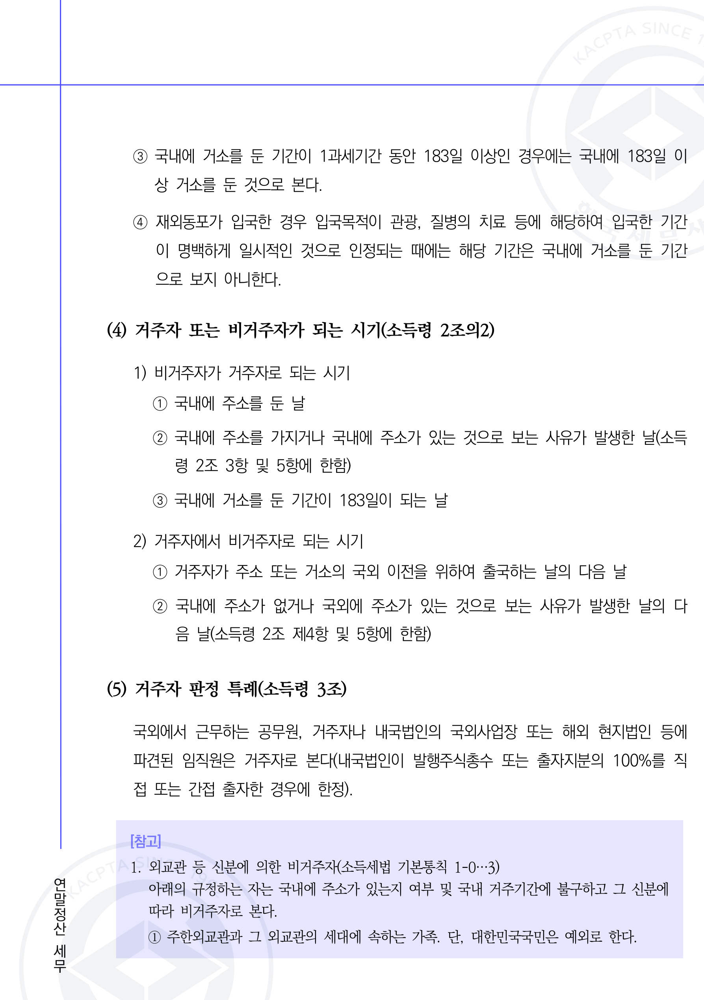

1. 국내에 거소를 둔 기간이 1과세기간 동안 183일 이상인 경우에는 국내에 183일 이상 거소를 둔 것으로 본다.

2. 재외동포가 입국한 경우 입국목적이 관광, 질병의 치료 등에 해당하여 입국한 기간이 명백하게 일시적인 것으로 인정되는 때에는 해당 기간은 국내에 거소를 둔 기간으로 보지 아니한다.

(4) 거주자 또는 비거주자가 되는 시기(소득령 2조의2)

1) 비거주자가 거주자로 되는 시기
   ① 국내에 주소를 둔 날
   ② 국내에 주소를 가지거나 국내에 주소가 있는 것으로 보는 사유가 발생한 날(소득령 2조 3항 및 5항에 한함)
   ③ 국내에 거소를 둔 기간이 183일이 되는 날

2) 거주자에서 비거주자로 되는 시기
   ① 거주자가 주소 또는 거소의 국외 이전을 위하여 출국하는 날의 다음 날
   ② 국내에 주소가 없거나 국외에 주소가 있는 것으로 보는 사유가 발생한 날의 다음 날(소득령 2조 제4항 및 5항에 한함)

(5) 거주자 판정 특례(소득령 3조)

국외에서 근무하는 공무원, 거주자나 내국법인의 국외사업장 또는 해외 현지법인 등에 파견된 임직원은 거주자로 본다(내국법인이 발행주식총수 또는 출자지분의 100%를 직접 또는 간접 출자한 경우에 한정).

[참고]
1. 외교관 등 신분에 의한 비거주자(소득세법 기본통칙 1-0-…3)
   아래에 규정하는 자는 국내에 주소가 있는지 여부 및 국내 거주기간에 불구하고 그 신분에 따라 비거주자로 본다.
   1) 주한외교관과 그 외교관의 세대에 속하는 가족. 단, 대한민국국민은 예외로 한다.

<<SPLIT>>
elementId: 211
70
<<SPLIT>>
elementId: 212
196
<<SPLIT>>
elementId: 213
제1장 근로소득 연말정산(이론편)
<<SPLIT>>
elementId: 214
② 한미행정협정 제1조에 의한 합중국군대의 구성원,군무원 및 그들의 가족. 다만, 합중국
의 소득세를 회피할 목적으로 국내에 주소가 있다고 신고한 경우에는 예외로 한다.
<<SPLIT>>
elementId: 215
2. 국외사업장 등에 파견된 임원 또는 직원의 거주자, 비거주자 판정(소득세법 기본통칙 1-3···1)
<<SPLIT>>
elementId: 216
① 거주자 또는 내국법인의 국외사업장 또는 해외현지법인(100% 출자법인)에 파견된 임원
또는 직원이 생계를 같이하는 가족이나 자산상태로 보아 파견기간의 종료 후 재입국할
것으로 인정되는 때에는 파견기간이나 외국의 국적 또는 영주권의 취득과는 관계없이
거주자로 본다.
② 제1항의 규정에 준하여 국내에 생활의 근거가 있는 자가 국외에서 거주자 또는 내국법
인의 임직원이 되는 경우에는 국내에서 파견된 것으로 본다.
<<SPLIT>>
elementId: 218
| 구분 | 거 주 자 | 비거주자 |
| --- | --- | --- |
| 과세 범위 | 소득세법에서 규정하는 모든 소득 (해당 과세기간 종료일 10년 전부터 국내에 주소나 거소를 둔 기간의 합계가 5년 이하인 외국인 거주자에게는 과세대상 소득 중 국외에서 발생한 소득의 경우 국내에서 지급되거나 국내로 송금된 소득에 대해서만 과세) | 소득세법 제119조에 따른 국내원천소득 |
**(6) 소득세법에 따른 거주자 및 비거주자의 과세범위**
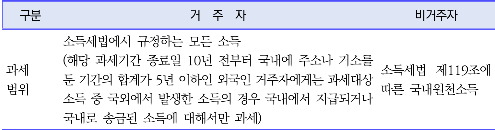

```markdown
| 구분     | 거주자                                                                                                                                               | 비거주자                          |
|----------|------------------------------------------------------------------------------------------------------------------------------------------------------|-----------------------------------|
| 과세 범위 | 소득세법에서 규정하는 모든 소득 (해당 과세기간 종료일 10년 전부터 국내에 주소나 거소를 둔 기간의 합계가 5년 이하인 외국인 거주자에게는 과세대상 소득 중 국외에서 발생한 소득의 경우 국내에서 지급되거나 국내로 송금된 소득에 대해서만 과세) | 소득세법 제119조에 따른 국내원천소득 |
```

<<SPLIT>>
elementId: 219
(7) 비거주자의 연말정산
<<SPLIT>>
elementId: 220
1) 비거주자의 국내원천소득(소득법 119조 7호)
<<SPLIT>>
elementId: 221
① 국내에서 제공하는 근로의 대가로서 받는 급여
<<SPLIT>>
elementId: 222
② 거주자 또는 내국법인이 운용하는 외국항행선박, 원양어업선박 및 항공기의 승무
원이 받는 급여
<<SPLIT>>
elementId: 223
③ 내국법인의 임원 자격으로서 받는 급여
④ 법인세법에 따라 상여로 처분된 금액
<<SPLIT>>
elementId: 224
제2장
근로소득
연말정산(실전편)
<<SPLIT>>
elementId: 225
제3장
<<SPLIT>>
elementId: 226
연말정산
<<SPLIT>>
elementId: 227
세액의
<<SPLIT>>
elementId: 228
계산
<<SPLIT>>
elementId: 229
제
1장
근로소득
연말정산(이론편)
<<SPLIT>>
elementId: 230
제4장
근로소득자의
연말정산
후
4대보험
정산
<<SPLIT>>
elementId: 231
71
<<SPLIT>>
elementId: 232
2) 연말정산 방법(소득법 122조)
<<SPLIT>>
elementId: 233
국내원천 근로소득이 있는 비거주자의 근로소득에 대한 소득세의 과세표준과 세액의
계산에 관하여는 거주자의 신고와 납부에 관한 규정을 준용한다. 다만, 인적공제 중
비거주자 본인 외에 자에 대한 공제와 특별소득공제, 자녀세액공제 및 특별세액공제
를 하지 아니한다.
<<SPLIT>>
elementId: 234
[참고]
<<SPLIT>>
elementId: 235
[예규 : 국일46017-92. 1997.02.06]
국내사업장이 없는 비거주자의 근로소득에 대한 소득세 과세표준 및 세액의 계산은 비거주자
본인외의 인적공제와 특별공제를 제외하고는 거주자의 계산규정을 준용하므로 비거주자의 근
로소득세를 계산할 때 소득법 제47조 근로소득공제와 소득법 제59조 근로소득세액공제를 산
출세액에서 공제하는 것임.
<<SPLIT>>
elementId: 236
3) 외국인근로자18)에 대한 과세특례(조특법 18의2)
<<SPLIT>>
elementId: 237
① 과세연도 종료일 현재 대한민국 국적이 없는 거주자 중 외국인과 비거주자 중
외국인 근로자는 외국인 과세특례 내용을 적용받을 수 있다. 즉, 외국인근로자
는 거주자처럼 원천징수 후 연말정산 방법을 선택하거나 과세특례를 선택할 수
있다.
② 외국인 임원 또는 사용인(일용근로자 제외)이 2026년 12월 31일 이전에 국내에
서 최초로 근로를 제공하기 시작하는 경우 국내에서 근무(외국인 투자기업을 제
외한 특수관계자는 적용 제외)함으로써 받는 근로소득으로서 최초로 근로를 제공
한 날부터 20년 이내에 끝나는 과세기간까지 받는 근로소득에 대한 소득세는 소
득세 기본세율 규정에도 불구하고 해당 근로소득에 19%를 곱한 금액을 세액으
로 할 수 있다.
이 경우 소득세법 및 조세특례제한법에 따른 비과세, 공제, 감면 및 세액공제에
관한 규정은 적용하지 아니하며 해당 근로소득은 종합소득과세표준에 합산하지
아니한다.
③ 외국인근로자에 대한 과세특례를 적용받으려는 외국인근로자는 근로소득세액의
<<SPLIT>>
elementId: 238
연말정산
세무
<<SPLIT>>
elementId: 239
18) 대한민국 국적을 가진 재외국민은 외국인이 아니므로 과세특례 적용대상이 아님.
<<SPLIT>>
elementId: 240
72
<<SPLIT>>
elementId: 241
196
<<SPLIT>>
elementId: 242
제1장 근로소득 연말정산(이론편)
<<SPLIT>>
elementId: 243
연말정산을 하는 때에 외국인근로자 단일세율적용신청서를 첨부하여 원천징수의
무자, 납세조합, 납세지 관할세무서장에게 제출하여야 한다.
<<SPLIT>>
elementId: 244
④ 원천징수의무자는 외국인근로자에게 매월분의 근로소득을 지급할 때 근로소득 간
이세액표에도 불구하고 해당 근로소득에 19%를 원천징수할 수 있다.
<<SPLIT>>
elementId: 245
[참고] 외국인 근로자 유의사항
<<SPLIT>>
elementId: 246
1. 외국인 근로자는 단일세율(19%) 적용방식과 내국인 근로자의 연말정산 방법중 선택이 가
능하다.
2. 외국인 근로자가 신청하는 경우 원천징수의무자가 매월 급여지급시 비과세 등을 포함한 총
금액의 19%를 원천징수 할 수 있다.
3. 원천징수의무자가 단일세율 원천징수를 하지 않았을 경우 종합소득세 신고기간에 관할세무
서장에게 단일세율특례신청서를 제출 후 단일세율(19%)을 적용받을 수 있다.
3의 경우 다른 종합소득에 합산되지 않는다.
<<SPLIT>>
elementId: 247
제2절 근로소득의 원천징수
<<SPLIT>>
elementId: 248
01 근로소득
<<SPLIT>>
elementId: 249
(1) 근로소득의 개념
<<SPLIT>>
elementId: 250
일반적으로 고용관계 또는 이와 유사한 계약에 의하여 비독립적 인적용역(임직원)인 근
로를 해당 과세기간에 제공함으로써 받는 다음의 소득을 말한다(소득법 20조 1항).
<<SPLIT>>
elementId: 251
① 근로를 제공함으로써 받는 봉급 · 급료 · 보수 · 세비 · 임금 · 상여 수당과 이와 유사
한 성질의 급여
<<SPLIT>>
elementId: 252
② 법인의 주주총회 사원총회 또는 이에 준하는 의결기관의 결의에 따라 상여로 받는 소득
③ 「법인세법」 에 따라 상여로 처분된 금액(인정상여)
④ 퇴직함으로써 받는 소득으로서 퇴직소득에 속하지 아니하는 소득
<<SPLIT>>
elementId: 253
제2장
근로소득
연말정산(실전편)
<<SPLIT>>
elementId: 254
제3장
<<SPLIT>>
elementId: 255
연말정산
<<SPLIT>>
elementId: 256
세액의
<<SPLIT>>
elementId: 257
계산
<<SPLIT>>
elementId: 258
제4장
근로소득자의
연말정산
후
4대보험
정산
<<SPLIT>>
elementId: 259
73
<<SPLIT>>
elementId: 260
제
1장
근로소득
연말정산(이론편)
<<SPLIT>>
elementId: 261
⑤ 종업원등 또는 대학의 교직원이 재직 중에 지급받는(퇴직후 지급분은 기타소득에 해
당) 직무발명보상금
<<SPLIT>>
elementId: 262
[참고] 임원과 근로자의 구분(소득세 기본통칙 12-0...3)
<<SPLIT>>
elementId: 263
① 법에서 규정하는 "근로자"에는 법에서 특별히 임원을 제외하고 있는 경우 외에는 임원이
포함되는 것으로 한다.
② 임원이라 함은 「법인세법 시행령」 제40조 제1항19)에 따른 임원을 말한다
<<SPLIT>>
elementId: 264
[참고] 반환조건부 사이닝보너스의 소득구분 등(소득세법 집행기준 20-0...5)
<<SPLIT>>
elementId: 265
① 특별한 능력 또는 우수한 능력이 있는 근로자가 기업과 근로계약을 체결하면서 지급받는
사이닝보너스는 법 제20조에 따른 근로소득으로 한다.
② 제1항에 의한 사이닝보너스를 근로계약체결시(계약기간 내 중도퇴사시 일정금액을 반환하
는 조건) 일시에 선지급하는 경우에는 당해 사이닝보너스를 계약조건에 따른 근로기간동안
안분하여 계산한 금액을 각 과세연도의 근로소득수입금액으로 한다.
<<SPLIT>>
elementId: 266
(2) 근로소득에 포함되는 소득(소득령 38조)
<<SPLIT>>
elementId: 267
① 기밀비(판공비 포함) · 교제비 기타 이와 유사한 명목으로 받는 것으로서 업무를 위하
여 사용된 것이 분명하지 아니한 급여
② 종업원이 받는 공로금 · 위로금 · 개업축하금 · 학자금 · 장학금(종업원의 수학중인 자녀
가 사용자로부터 받는 학자금 · 장학금을 포함) 기타 이와 유사한 성질의 급여
<<SPLIT>>
elementId: 268
19) 법인세법 시행령 제40조 1항
<<SPLIT>>
elementId: 269
연말정산
세무
<<SPLIT>>
elementId: 270
1. 법인의 회장, 사장, 부사장, 이사장, 대표이사, 전무이사 및 상무이사 등 이사회의 구성원 전원과
청산인
2. 합명회사, 합자회사 및 유한회사의 업무집행사원 또는 이사
3. 유한책임회사의 업무집행자
4. 감사
5. 그 밖에 제1호부터 제4호까지의 규정에 준하는 직무에 종사하는 자
<<SPLIT>>
elementId: 271
74
<<SPLIT>>
elementId: 272
196
<<SPLIT>>
elementId: 273
제1장 근로소득 연말정산(이론편)
<<SPLIT>>
elementId: 274
[참고] 장학금 원천징수
<<SPLIT>>
elementId: 275
법인이 우수인력 확보를 위해 대학원 재학생에게 등록금 등 매월 일정금액의 학비보조비를
장학금 명목으로 대여하고 졸업 후 당초 계약조건의 이행여부에 따라 당해 장학금을 반환받
거나 반환을 면제해주는 경우의 조건부 대여장학금은 계약조건에 의해 당해 법인에 근로를
제공한 기간에 안분한 금액 상당액을 근로를 제공한 자의 근로소득으로 보아 원천징수 하는
것임
<<SPLIT>>
elementId: 276
[참고] 근로소득에 포함되는 학자금, 장학금 등의 범위
<<SPLIT>>
elementId: 277
1. 교직원의 자녀가 해당 교직원의 재직사실에 기인하여 받는 장학금,학비 면제액은 교직원의
근로소득에 해당한다.
2. 명예퇴직하는 근로자가 노사합의에 의해 재직근로자에게 적용되는 자녀학자금 지원을 퇴직
후 일정기간 동안 당해 회사로부터 지급받는 경우 그 학자금은 근로소득에 해당한다.
3. 법인이 우수인력 확보를 위해 대학원 재학생에게 등록금 등 매월 일정금액의 학비보조비를
장학금 명목으로 대여하고 졸업 후 당초 계약조건의 이행여부에 따라 당해 장학금을 반환
받거나 반환을 면제해주는 경우의 조건부 대여장학금은 계약조건에 의해 당해 법인에 근로
를 제공한 기간에 안분한 금액 상당액을 근로를 제공한 자의 근로소득으로 보아 원천징수
한다.
<<SPLIT>>
elementId: 278
③ 근로수당 · 가족수당 · 전시수당 · 물가수당 · 출납수당 · 직무수당 기타 이와 유사한 성
질의 급여
④ 보험회사, 「자본시장과 금융투자업에 관한 법률」에 따른 투자매매업자 또는 투자중
개업자 등의 종업원이 받는 집금(��)수당과 보험가입자의 모집, 증권매매의 권유
또는 저축을 권장하여 받는 대가, 그 밖에 이와 유사한 성질의 급여
⑤ 급식수당 · 주택수당 · 피복수당 기타 이와 유사한 성질의 급여, 단, 아래의 급여는 총
급여액에서 제외함
월 20만원 한도 내의 식사(식사 기타 음식물 미제공시에 한함)
법령,조례에 의해 제복을 착용하여야 할 자가 지급받는 제복, 제모, 제화
특수작업 또는 그 직장 내에서만 착용하는 피복(병원, 시험실, 금융기관 등)
⑥ 주택을 제공받음으로써 얻는 이익(사택 제공이익 중 근로소득으로 보지 아니하는 분 제외)
<<SPLIT>>
elementId: 279
제2장
근로소득
연말정산(실전편)
<<SPLIT>>
elementId: 280
제
1장
근로소득
연말정산(이론편)
<<SPLIT>>
elementId: 281
제3장
연말정산
세액의
계산
제4장
근로소득자의
연말정산
후
4대보험
정산
<<SPLIT>>
elementId: 282
75
<<SPLIT>>
elementId: 283
|  |  |
| --- | --- |
|  | ⑦ 종업원이 주택(부수토지 포함)의 구입 · 임차에 소요되는 자금을 저리 또는 무상으로 대여 받음으로써 얻는 이익(조세특례제한법상 중소기업 종업원이 얻는 주택의 구입 임차관련 대여이익은 제외) ⑧ 기술수당 · 보건수당 및 연구수당, 그 밖에 이와 유사한 성질의 급여 ⑨ 시간외근무수당 · 통근수당 · 개근수당 · 특별공로금 기타 이와 유사한 성질의 급여(출 퇴근 교통비 및 체력단련비 등) ⑩ 여비의 명목으로 받는 연액 또는 월액의 급여. 다만, 실비변상적 여비는 비과세소득 이고, 자가운전보조금(월 20만원 한도)도 비과세 소득임. ⑪ 벽지수당 · 해외근무수당 기타 이와 유사한 성질의 급여 ⑫ 종업원이 계약자이거나 종업원 또는 그 배우자 및 그 밖의 가족을 수익자로 하는 보 험 · 신탁 또는 공제와 관련하여 사용자가 부담하는 보험료 · 신탁부금 또는 공제부금 (근로소득으로 보지 않는 연 70만원 이하의 단체순수보장성보험 등의 보험료는 제외) ⑬ 임원의 퇴직급여 중 한도초과로 손금에 산입되지 아니하고 지급받는 퇴직급여 ⑭ 휴가비 기타 이와 유사한 성질의 급여 ⑮ 계약기간 만료 전 또는 만기에 종업원에게 귀속되는 단체환급부보장성보험의 환급금 ⑯ 법인의 임원 또는 종업원이 해당 법인 또는 해당 법인과 특수관계에 있는 법인으로 부터 부여받은 주식매수선택권을 해당 법인 등에서 근무하는 기간 중 행사함으로써 얻은 이익(주식매수선택권 행사 당시의 시가와 실제 매수가액과의 차액을 말하며, 주식에는 신주인수권을 포함) ⑰ 「공무원 수당 등에 관한 규정」, 「지방공무원 수당 등에 관한 규정」, 「검사의 보수에 관한 법률 시행령」, 대법원규칙, 헌법재판소규칙 등에 따라 공무원에게 지급되는 직 급보조비 연말정산 ⑱ 공무원이 국가 또는 지방자치단체로부터 공무 수행과 관련하여 받는 상금과 부상 |
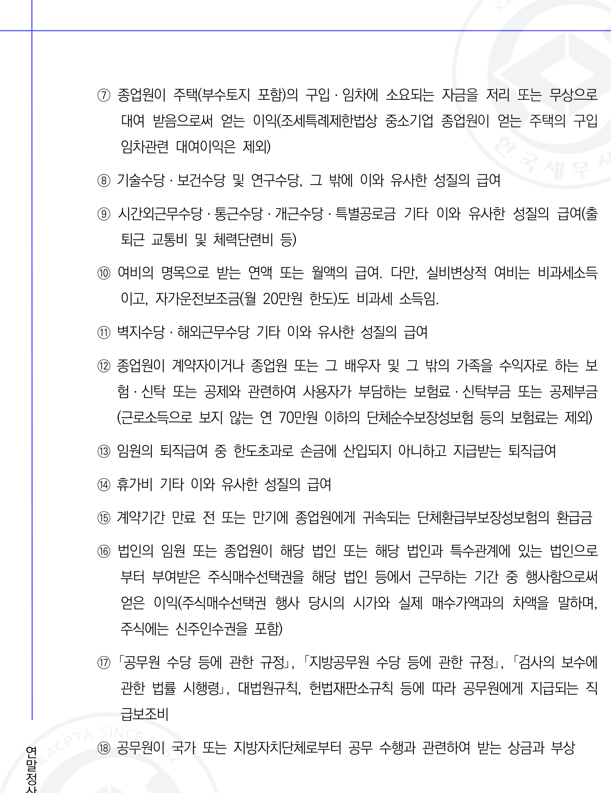

1. 종업원이 주택(부속토지 포함)의 구입·임차에 소요되는 자금을 저리 또는 무상으로 대여 받음으로써 얻는 이익(조세특례제한법상 중소기업 종업원이 얻는 주택의 구입 임차관련 대여이익은 제외)

2. 기술수당·보건수당 및 연구수당, 그 밖에 이와 유사한 성질의 급여

3. 시간외근무수당·통근수당·개근수당·특별공로금 기타 이와 유사한 성질의 급여(출퇴근 교통비 및 체력단련비 등)

4. 여비의 명목으로 받는 연액 또는 월액의 급여. 다만, 실비변상적 여비는 비과세소득이고, 자가운전보조금(월 20만원 한도)도 비과세 소득임.

5. 벽지수당·해외근무수당 기타 이와 유사한 성질의 급여

6. 종업원이 계약자이거나 종업원 또는 그 배우자 및 그 밖의 가족을 수익자로 하는 보험·신탁 또는 공제와 관련하여 사용자가 부담하는 보험료·신탁부금 또는 공제부금(근로소득으로 보지 않는 연 70만원 이하의 단체순수보장성보험 등의 보험료는 제외)

7. 임원의 퇴직금이 중 한도초과로 손금에 산입되지 아니하고 지급받는 퇴직금여

8. 휴가비 기타 이와 유사한 성질의 급여

9. 계약기간 만료 전 또는 만기에 종업원에게 귀속되는 단체환급부보장성보험의 환급금

10. 법인의 임원 또는 종업원이 해당 법인 또는 해당 법인과 특수관계에 있는 법인으로부터 부여받은 주식매수선택권을 해당 법인 등에서 근무하는 기간 중 행사함으로써 얻은 이익(주식매수선택권 행사 당시의 시가와 실제 매수가액과의 차액을 말하며, 주식에는 신주인수권을 포함)

11. 「공무원 수당 등에 관한 규정」, 「지방공무원 수당 등에 관한 규정」, 「검사의 보수에 관한 법률 시행령」, 대법원규칙, 헌법재판소규칙 등에 따라 공무원에게 지급되는 직급보조비

12. 공무원이 국가 또는 지방자치단체로부터 공무 수행과 관련하여 받는 상금과 부상

<<SPLIT>>
elementId: 284
세무
76
<<SPLIT>>
elementId: 285
196
<<SPLIT>>
elementId: 286
제1장 근로소득 연말정산(이론편)
<<SPLIT>>
elementId: 287
(3) 기타 근로소득에 해당하는 것
<<SPLIT>>
elementId: 288
- 임원 퇴직소득 중 근로소득으로 간주되는 금액(소득법 22조 3항)
- 중소기업 핵심인력 성과보상기금으로부터 공제금을 수령하는 경우 해당 금액 중 기업
이 부담한 기여금(조특법 29조의6 1항)
<<SPLIT>>
elementId: 289
[참고] 소득세법상 임원에게 지급하는 퇴직금 중 근로소득으로 보는 금액(소득법 22조 3항)
1. 아래의 계산된 금액을 초과하는 경우 초과금액은 근로소득으로 본다.
<<SPLIT>>
elementId: 290
| 2019년 12월 31일 |  | 퇴직한 날부터 |
| --- | --- | --- |
| 부터 소급하여 | 2012년 1월 1 | 소급하여 3년 |
| 3년 | 일 | (2020년 |
| (2012년 1월 1 | 부터 2019년 | 1월 1일 |
| 일 | 12월 31일 | 부터 2020년 1월 |
| 부터 2019년 12 | 까지의 근무 | 퇴직한 날까지 1일 이후의 |
| 월 31일 | 1 기간 | 의 근무기간이 1 근무기간 |
| 까지의 근무기 | X 1D 12 | x 3 + X X x 2 1D 12 3년 미만인 경 |
| 간이 3년 미만 |  | 우에는 해당 근 |
|  |  |  |
| 인 경우에는 해 |  | 무기간 |
| 당 근무기간 |  | 으로 한다) 동 |
| 으로 한다) 동 |  | 안 지급받은 총 |
| 안 지급받은 총 |  | 급여의 연평균 |
| 급여의 연평균 |  | 환산액 |
| 환산액 |  |  |
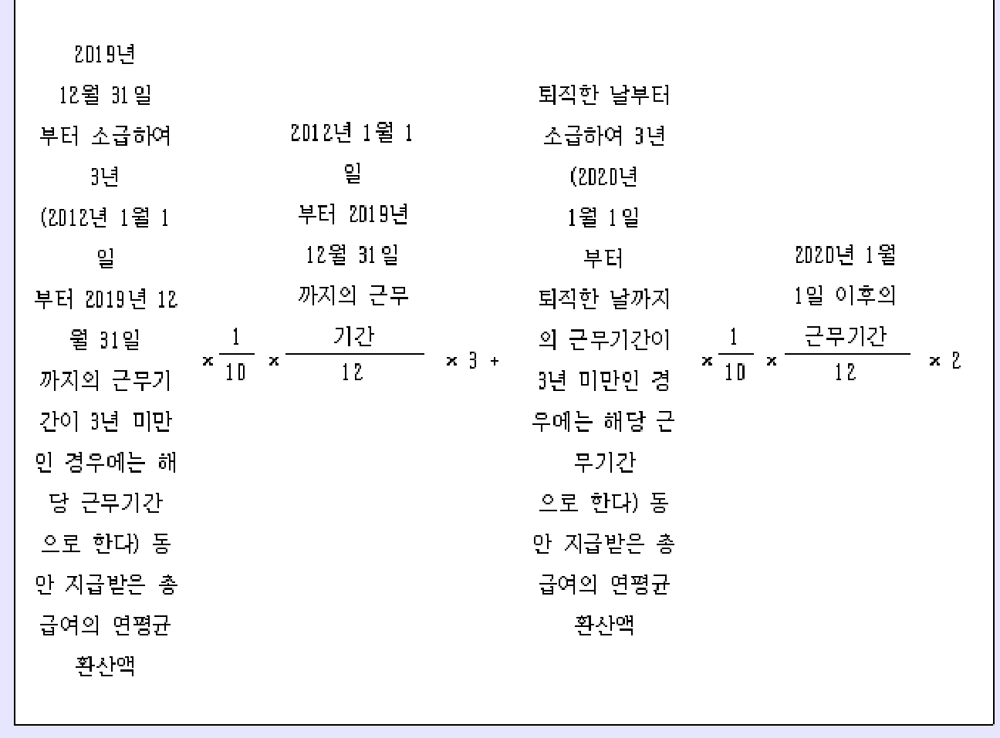

```markdown
| 2019년 12월 31일부터 소급하여 3년 (2012년 1월 1일부터 2019년 12월 31일까지의 근무기간이 3년 미만인 경우에는 해당 근무기간으로 한다) 동안 지급받은 총급여의 연평균 환산액 | 2012년 1월 1일부터 2019년 12월 31일까지의 근무기간 \* \(\frac{1}{10}\) \* \(\frac{\text{기간}}{12}\) \* 3 + 퇴직한 날부터 소급하여 3년 (2020년 1월 1일부터 퇴직한 날까지의 근무기간이 3년 미만인 경우에는 해당 근무기간으로 한다) 동안 지급받은 총급여의 연평균 환산액 | 2020년 1월 1일 이후의 근무기간 \* \(\frac{1}{10}\) \* \(\frac{\text{근무기간}}{12}\) \* 2 |
```

<<SPLIT>>
elementId: 291
제
1장
근로소득
연말정산(이론편)
<<SPLIT>>
elementId: 292
2. 임원 퇴직소득금액 한도초과액은 건강보험료 부과대상에 해당하지 않으므로 반드시 근로소
득원천징수영수증에 임원 퇴직소득금액 한도초과액란에 구분표시해야 한다.
<<SPLIT>>
elementId: 293
(4) 근로소득에서 제외되는 소득
<<SPLIT>>
elementId: 294
1) 퇴직급여 지급을 위한 사용자 적립액
퇴직급 지급 목적으로 적립되는 급여(근로자가 적립금액 등을 선택할 수 없는 것으
<<SPLIT>>
elementId: 295
제2장
근로소득
연말정산(실전편)
제3장
연말정산
세액의
계산
제4장
근로소득자의
연말정산
후
4대보험
정산
<<SPLIT>>
elementId: 296
77
<<SPLIT>>
elementId: 298
| [필수] 기획재정부령이 정하는 퇴직급여 목적 요건 근로소득에서 제외되는 퇴직급여 적립액의 요건(소득칙 15의4) |
| --- |
| "근로자가 적립금액 등을 선택할 수 없는 것으로서 기획재정부령으로 정하는 방법"이란 다음 각 호의 요건을 모두 충족하는 적립 방법을 말한다. 1. 「근로자퇴직급여 보장법」 제4조 제1항에 따른 퇴직급여제도의 가입 대상이 되는 근로자(임 원을 포함한다. 이하 이 조에서 같다) 전원이 적립할 것. 다만, 각 근로자가 다음 각 목의 어느 하나에 해당하는 날에 향후 적립하지 아니할 것을 선택할 수 있는 것이어야 한다. 가. 사업장에 제2호에 따른 적립 방식이 최초로 설정되는 날(해당 사업장에 최초로 근무하 게 된 날에 제2호의 적립 방식이 이미 설정되어 있는 경우에는 「근로자퇴직급여 보장 법」 제4조 제1항에 따라 최초로 퇴직급여제도의 가입 대상이 되는 날을 말한다) 나. 제2호의 적립 방식이 변경되는 날 2. 적립할 때 근로자가 적립 금액을 임의로 변경할 수 없는 적립 방식을 설정하고 그에 따라 적립할 것 3. 제2호의 적립 방식이 「근로자퇴직급여 보장법」 제6조 제2항에 따른 퇴직연금규약, 같은 법 제19조 제1항에 따른 확정기여형퇴직연금규약 또는 「과학기술인공제회법」 제16조의2 에 따른 퇴직연금급여사업을 운영하기 위하여 과학기술인공제회와 사용자가 체결하는 계 약에 명시되어 있을 것 4. 사용자가 DC형 계좌 및 과학기술인공제회법에 따른 퇴직연금급여를 지급받기 위해 설정 하는 퇴직연금계좌에 적립할 것 |
**로서 기재부령이 정하는 아래의 방법에 따라 적립되는 경우에 한정)는 근로소득에포함하지 않는다(소득령 제38조 2항).**
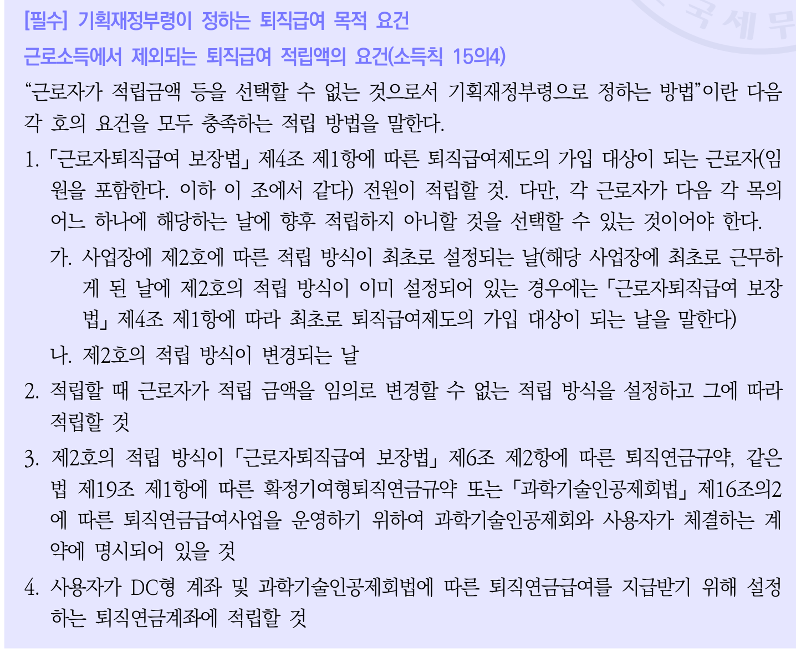

[필수] 기획재정부령이 정하는 퇴직급여 목적 요건  
근로소득에서 제외되는 퇴직급여 적립액의 요건(소득칙 15의4)

“근로자가 적립금액 등을 선택할 수 없는 것으로서 기획재정부령으로 정하는 방법”이란 다음 각 호의 요건을 모두 충족하는 적립 방법을 말한다.

1. 「근로자퇴직급여 보장법」 제4조 제1항에 따른 퇴직급여제도의 가입 대상이 되는 근로자(임원을 포함한다. 이하 이 조에서 같다) 전원이 적립할 것. 다만, 각 근로자가 다음 각 목의 어느 하나에 해당하는 날에 향후 적립하지 아니할 것을 선택할 수 있는 것이어야 한다.
   - 가. 사업장에 제2호에 따른 적립 방식이 최초로 설정되는 날(해당 사업장에 최초로 근무하게 된 날에 제2호의 적립 방식이 이미 설정되어 있는 경우에는 「근로자퇴직급여 보장법」 제4조 제1항에 따라 최초로 퇴직급여제도의 가입 대상이 되는 날을 말한다)
   - 나. 제2호의 적립 방식이 변경되는 날

2. 적립할 때 근로자가 적립 금액을 임의로 변경할 수 없는 적립 방식을 설정하고 그에 따라 적립할 것

3. 제2호의 적립 방식이 「근로자퇴직급여 보장법」 제6조 제2항에 따른 퇴직연금규약, 같은 법 제13조 제1항에 따른 확정기여형퇴직연금규약 또는 「과학기술인공제회법」 제16조의2에 따른 퇴직연금급여사업을 운영하기 위하여 과학기술인공제회와 사용자가 체결하는 계약에 명시되어 있을 것

4. 사용자가 DC형 계좌 및 과학기술인공제회법에 따른 퇴직연금여를 지급받기 위해 설정하는 퇴직연금계좌에 적립할 것

<<SPLIT>>
elementId: 299
2) 선원의 재해보상 보험료
<<SPLIT>>
elementId: 300
선원법에 따른 선원의 재해보상을 위해 선박소유자가 자기를 보험계약자 및 수익자
로 하고 선원을 피보험자로 한 보험의 보험료는 당해 선원의 근로소득으로 보지 아
니한다(소득세 집행기준 20-38···1)
<<SPLIT>>
elementId: 301
3) 사내근로복지기금에서의 장학금 등
<<SPLIT>>
elementId: 302
연말정산
세무
<<SPLIT>>
elementId: 303
사내근로복지기금법에 의한 사내근로복지기금이 사내 근로자인 종업원에게 노동부장
관으로부터 인가된 동 기금의 용도사업 수행으로 인해 지급하는 보조금은 당해 종업
원의 근로소득으로 보지 아니하는 것임(원천세과-363, 2010.04.29.) 따라서 노동부
<<SPLIT>>
elementId: 304
78
<<SPLIT>>
elementId: 305
제1장 근로소득 연말정산(이론편)
<<SPLIT>>
elementId: 306
장관으로부터 인가를 받은 사내근로복지기금에서 장학금 등이 지급되는 경우에는 근
로소득에 해당하지 아니한다.
<<SPLIT>>
elementId: 307
4) 경조금
<<SPLIT>>
elementId: 308
사업자가 그 종업원에게 지급한 경조금 중 사회통념상 타당하다고 인정되는 범위내
의 금액은 이를 지급받은 근로자의 근로소득으로 보지 아니한다(소득칙 10조)
<<SPLIT>>
elementId: 309
(5) 과세소득의 범위(소득법 3조)
<<SPLIT>>
elementId: 310
| 소득자 | 소득발생처 | 과세 여부 | 비 고 |
| --- | --- | --- | --- |
| 거 주 자 | 국 내 | 과 세 | 국내외 모든 과세대상 소득 단기 외국인 거주자의 국외원천소득 과세 완화20) |
| 거 주 자 | 국 외 | 과 세 | 국내외 모든 과세대상 소득 단기 외국인 거주자의 국외원천소득 과세 완화20) |
| 비거주자 | 국 내 | 과 세 | 국내원천소득에 대해서만 과세 |
| 비거주자 | 국 외 | 과세제외 | (예) 비거주자가 내국법인의 해외지점에서 근무하는 경우 |
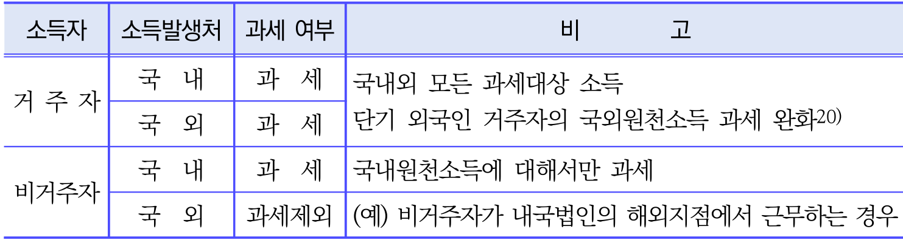

```markdown
| 소득자   | 소득발생처 | 과세 여부 | 비고                                           |
|----------|------------|-----------|----------------------------------------------|
| 거주자   | 국내       | 과세      | 국내외 모든 과세대상 소득                     |
| 거주자   | 국외       | 과세      | 단기 외국인 거주자의 국외원천소득 과세 완화20) |
| 비거주자 | 국내       | 과세      | 국내원천소득에 대해서만 과세                  |
| 비거주자 | 국외       | 과세제외  | (예) 비거주자가 내국법인의 해외지점에서 근무하는 경우 |
```

<<SPLIT>>
elementId: 311
(6) 원천징수 대상에 따른 구분
<<SPLIT>>
elementId: 312
1) 원천징수대상 과세 근로소득 : 매월 또는 반기별로 원천징수를 해야 한다.
2) 원천징수대상이 아닌 과세 근로소득21) : 납세조합에 가입하여 원천징수하거나 근로자
가 직접 다음 해 5월에 소득세 확정신고를 해야 한다.
<<SPLIT>>
elementId: 313
제2장
근로소득
연말정산(실전편)
<<SPLIT>>
elementId: 314
20) 외국인 거주자로서 해당 과세기간 종료일로부터 소급하여 10년 동안 국내에 주소나 거소를 둔 기간의
합계가 5년 이하인 개인의 국외 원천소득의 경우, 국내에서 지급되거나 국내로 송금된 금액에 대해
서만 과세한다(소득법 3조 1항).
<<SPLIT>>
elementId: 315
21) 근로소득 중 원천징수대상이 아닌 근로소득의 범위(소득법 127조 1항 4호)
<<SPLIT>>
elementId: 316
① 외국기관 또는 우리나라에 주둔하는 국제연합군(미군 제외)으로부터 받는 근로소득
② 국외에 있는 비거주자 또는 외국법인(국내지점 또는 국내영업소는 제외한다)으로부터 받는 근로소득
및 퇴직소득. 다만, 비거주자의 국내사업장과 외국법인의 국내사업장의 국내원천소득금액을 계산할
때 필요경비 또는 손금으로 계상되는 소득 및 국외에 있는 외국법인(국내지점 또는 국내영업소는
제외)으로부터 받는 근로소득 중 소득세법 제156조의7에 따라 소득세가 원천징수되는 파견근로자
의 소득은 제외한다.
<<SPLIT>>
elementId: 317
제3장
연말정산
세액의
계산
제4장
근로소득자의
연말정산
후
4대보험
정산
<<SPLIT>>
elementId: 318
제
1장
근로소득
연말정산(이론편)
<<SPLIT>>
elementId: 319
79
<<SPLIT>>
elementId: 320
[참고] <원천징수대상 근로소득에 해당하는 경우>
<<SPLIT>>
elementId: 321
· 외국법인의 연락사무소에서 근무하는 직원의 경우 연락사무소에서 지급하는 급여
· 당해 주식에 대한 매입비용을 국내의 자회사가 전적으로 부담하는 경우
· 내국법인의 국외사업장 등에 파견된 직원이 거주자에 해당하는 경우 내국법인이 당해 직원
에게 지급하는 급여
· 내국법인이 외국인 근로자의 급여를 손금으로 계상하는 경우
<<SPLIT>>
elementId: 322
<원천징수대상이 아닌 근로소득에 해당하는 경우>
<<SPLIT>>
elementId: 323
· 외국본점의 거래은행을 통해 각 직원의 계좌로 직접 송금하는 경우
· 국내의 자회사에 근무한 임직원이 외국의 모법인으로부터 주식매수선택권을 부여받아 이를
행사하는 시점에서 발생하는 이익
· 외국법인의 본사직원을 국내에 파견하고 직원급여를 직접 외국법인 본사에서 직원에게 지
급하는 경우
· 내국법인이 해외파견근무계약에 의해 임직원을 해외관계회사에 파견한 경우 당해 해외관계
회사가 임직원에게 지급하는 급여
<<SPLIT>>
elementId: 324
<근로소득에 대한 과세 방법>
<<SPLIT>>
elementId: 325
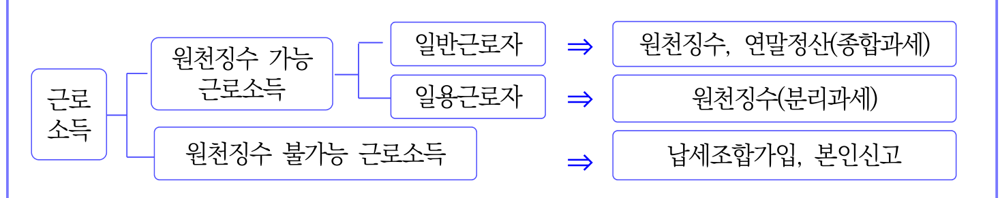
*일반근로자 ⇒ 원천징수, 연말정산(종합과세)
원천징수 가능
근로소득 원천징수(분리과세)
근로 일용근로자 ⇒
소득
원천징수 불가능 근로소득 ⇒ 납세조합가입, 본인신고*
<<SPLIT>>
elementId: 326
[참고] 근로소득으로 보는 주요사례
<<SPLIT>>
elementId: 327
· 일학습병행제 참여기업의 직원이 강사로서 지급받는 강의료
· 근로계약이 아닌 연수협약에 의해 연수생에게 지급하는 연수수당
· 해고되었던 자가 해고무효판결에 의해 일시에 받는 부당해고 기간의 대가는 근로소득으로
귀속시기는 근로를 제공한 날(해고기간)임.
<<SPLIT>>
elementId: 328
연말정산
세무
80
<<SPLIT>>
elementId: 329
196
<<SPLIT>>
elementId: 330
제1장 근로소득 연말정산(이론편)
<<SPLIT>>
elementId: 331
· 퇴직교원이 초빙계약제의 기간제 교원으로 임용되어 초등학교에서 근로를 제공하고 공무원
보수규정에 의해 월정액으로 지급받는 보수
· 일정기간 동안 회사에 근무하기로 근로계약(약정 근로기간 동안 근무하지 않는 경우 반환조
건)을 체결하고 해당 계약에 따라 지급받는 사이닝보너스(Signing Bonus)
· 사립유치원, 어린이집, 장기요양기관 등의 대표자에게 지급하는 급여
· 근로자파견계약에 따라 파견근로자를 사용하는 사업주가 직접 파견 근로자에게 별도로 지
급하는 수당
<<SPLIT>>
elementId: 332
02 일용근로소득
<<SPLIT>>
elementId: 333
(1) 일용근로자
<<SPLIT>>
elementId: 334
근로를 제공한 날 또는 시간에 따라 근로대가를 계산하거나 근로를 제공한 날 또는 시
간의 근로성과에 따라 급여를 계산하여 받는 사람으로서 다음에 해당되는 사람을 말한
다22)(소득법 14조 3항 2호, 소득령 20조 1항).
<<SPLIT>>
elementId: 335
1) 건설공사에 종사하는 자로서 다음의 사람을 제외한 사람
<<SPLIT>>
elementId: 336
① 동일한 고용주에게 계속하여 1년 이상 고용된 자
② 다음의 업무에 종사하기 위하여 통상 같은 고용주에게 계속하여 고용되는 자
- 작업준비를 하고 노무에 종사하는 사람을 직접 지휘 · 감독하는 업무
- 작업현장에서 필요한 기술적인 업무, 사무 · 타자 · 취사 · 경비 등의 업무
- 건설기계의 운전 또는 정비업무
<<SPLIT>>
elementId: 337
2) 하역작업에 종사하는 자(항만근로자 포함)로서 다음의 사람을 제외한 사람
① 통상 근로를 제공한 날에 근로대가를 받지 아니하고 정기적으로 근로대가를 받는 자
<<SPLIT>>
elementId: 338
22) 다음의 '①' 및 '②'의 근로자가 근로계약에 따라 일정한 고용주에게 3개월(1) ①의 경우는 1년) 이상
계속하여 고용되어 있지 아니하고 근로단체를 통하여 여러 고용주의 사용인으로 취업하는 경우에도 일
용근로자에 해당한다(소득칙 제11조).
<<SPLIT>>
elementId: 339
제2장
근로소득
연말정산(실전편)
<<SPLIT>>
elementId: 340
81
<<SPLIT>>
elementId: 341
제3장
연말정산
세액의
계산
제4장
근로소득자의
연말정산
후
4대보험
정산
<<SPLIT>>
elementId: 342
제
1장
근로소득
연말정산(이론편)
<<SPLIT>>
elementId: 343
② 다음의 업무에 종사하기 위하여 통상 같은 고용주에게 계속하여 고용되는 자
<<SPLIT>>
elementId: 344
· 작업준비를 하고 노무에 종사하는 사람을 직접 지휘 · 감독하는 업무
· 주된 기계의 운전 또는 정비업무
<<SPLIT>>
elementId: 345
3) 위 '1)' 또는 '2)' 외의 업무에 종사하는 자로서 근로계약에 따라 같은 고용주에게 3
개월23) 이상 계속하여 고용되어 있지 아니한 자
<<SPLIT>>
elementId: 346
[필수] 일용근로자의 일반근로자 전환시기
<<SPLIT>>
elementId: 347
1년 이상 계속 고용된 건설노무자를 일반급여자로 보는 시기 및 연말정산의 취급(소득세법 기
<<SPLIT>>
elementId: 348
본통칙 20-20···1)
<<SPLIT>>
elementId: 349
건설공사에 종사하는 자가 1년 이상 계속하여 동일한 고용주에게 고용된 경우 일용근로자 또
<<SPLIT>>
elementId: 350
는 일반급여자로 보는시기 등은 다음과 같다.
<<SPLIT>>
elementId: 351
1. 근로소득에 대한 원친징수는 계속 고용으로 1년이 되는 날이 속하는 월부터 일반급여자로
<<SPLIT>>
elementId: 352
본다.
<<SPLIT>>
elementId: 353
2. 연말정산시는 1년이 되는 날이 속하는 과세기간의 초일부터 일반급여자로 본다.
<<SPLIT>>
elementId: 354
(2) 일반근로소득과 일용근로소득의 비교
<<SPLIT>>
elementId: 355
| 구 분 | 일반근로소득 | 일용근로소득 |
| --- | --- | --- |
| 개 념 | 특정 고용주에게 계속하여 고용24)되 어 지급받는 급여 | 특정 고용주에게 계속하여 고용되어 있지 아니하고 일급 또는 시간급 등으 로 받는 급여 |
| 특 징 | 근로계약상 근로제공에 대한 시간 또 는 일수나 그 성과에 의하지 아니하고 월정액에 의해 급여를 지급받는 경우 (고용기간 관계없이 일반근로소득) | 근로를 제공한 날이나 시간에 따라 근 로대가를 계산하거나 근로를 제공한 날 또는 시간의 근로성과에 따라 급여 를 계산하여 지급받음 |
| 원천징수 세액 계산 | 근로소득 간이세액표의 세액 (근로자가 비율 선택 가능) | [일급(비과세소득 제외) - 15만원] x6%x[1 - 55%(근로소득세액공제)] |
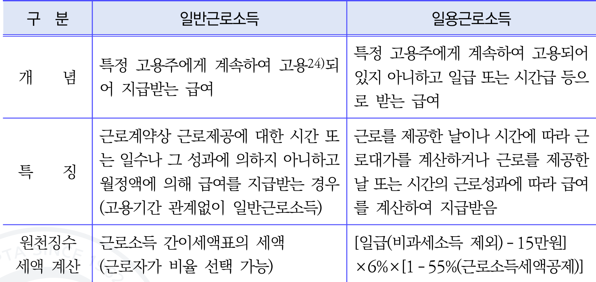

```markdown
| 구분       | 일반근로소득                                                                                     | 일용근로소득                                                                                                           |
|------------|--------------------------------------------------------------------------------------------------|------------------------------------------------------------------------------------------------------------------------|
| 개념       | 특정 고용주에게 계속하여 고용되어 지급받는 급여                                                  | 특정 고용주에게 계속하여 고용되어 있지 아니하고 일급 또는 시간급 등으로 받는 급여                                     |
| 특징       | 근로계약상 근로제공에 대한 시간 또는 일수나 그 성과에 의하지 아니하고 월정액에 의해 급여를 지급받는 경우 (고용기간 관계없이 일반근로소득) | 근로를 제공한 날이나 시간에 따라 근로대가를 계산하거나 근로를 제공한 날 또는 시간의 근로성과에 따라 급여를 계산하여 지급받음 |
| 원천징수 세액 계산 | 근로소득 간이세액표의 세액 (근로자가 비율 선택 가능)                                      | [일급(비과세소득 제외) - 15만원] × 6% × [1 - 55%(근로소득세액공제)]                                                    |
```

<<SPLIT>>
elementId: 356
연말정산
세무
<<SPLIT>>
elementId: 357
23) 「민법」 제160조에 따라 역월에 의하여 계산한다. 예를 들어 10월 20일부터 12월 19일까지 2달 근
무 약정시에도 3개월이다.
24) (고용관계 판단) 근로제공자가 업무 내지 작업에 대한 거부를 할 수 있는지, 시간적 · 장소적인 제약을
<<SPLIT>>
elementId: 358
82
<<SPLIT>>
elementId: 359
196
<<SPLIT>>
elementId: 360
제1장 근로소득 연말정산(이론편)
<<SPLIT>>
elementId: 361
| 구 분 | 일반근로소득 | 일용근로소득 |
| --- | --- | --- |
| 연말정산 | 연말정산 대상 | 연말정산 대상에 해당되지 아니함 (지급시 원천징수로서 납세의무 종료) |
| 지급명세서 제출시기 | 다음 해 3월 10일까지 | 지급일 속하는 달의 다음 달 말일 |
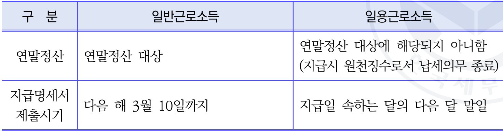

```markdown
| 구분             | 일반근로소득            | 일용근로소득                                      |
|------------------|-------------------------|---------------------------------------------------|
| 연말정산         | 연말정산 대상           | 연말정산 대상에 해당되지 아니함 (지급시 원천징수로서 납세의무 종료) |
| 지급명세서 제출시기 | 다음 해 3월 10일까지    | 지급일 속하는 달의 다음 달 말일                   |
```

<<SPLIT>>
elementId: 362
(3) 근로소득공제
<<SPLIT>>
elementId: 363
근로를 제공한 1일25)마다 15만원을 공제한다(소득법 47조 2항).
<<SPLIT>>
elementId: 364
[참고] 일용근로자 유의사항
<<SPLIT>>
elementId: 365
1. 일용근로자가 동일한 고용주에게 3월 이상 계속하여 고용된 경우 3월이 되는 날이 속하는
월부터 일반급여자로 보아 원천징수하되, 해당 과세기간의 초일(1월 1일)부터 12월 31일
까지 지급받은 급여에 대해 연말정산과 지급명세서의 제출의무를 이행하여야 한다(원천-
599, 2011.9.30.)
2. 일용근로자에게 성과급을 지급하기로 하고 계약기간 종료 후 지급하는 경우 해당 포상금은
근로제공일수에 따라 배분하여 원천징수하고 동 금액을 포함한 근로소득금액에 지급명세
서를 제출해야 한다(서면1팀-491, 2007.4.16.)
3. 국외 등에서 근로를 제공하고 받는 보수 중 월 100만원(건설 등은 월 500만원) 이내의 금
액은 일용근로자 여부에 관계없이 비과세 한다(서면1팀 - 1324, 2007.9.27.).
<<SPLIT>>
elementId: 366
받는지, 업무수행과정에 있어서 구체적인 지시를 받는지, 복무규정의 준수의무 등을 종합적으로 판단하
여야 한다.
25) 1일의 계산은 당일 오전 영(0)시부터 오후 12시까지로 한다(소득통 47- 104···1). 예를 들어 당일 오
후 10시부터 그 다음 날 6시까지 근로를 제공한 경우 근로를 제공한 날은 2일이다.
<<SPLIT>>
elementId: 367
제2장
근로소득
연말정산(실전편)
제3장
연말정산
세액의
계산
제4장
근로소득자의
연말정산
후
4대보험
정산
<<SPLIT>>
elementId: 368
제
1장
근로소득
연말정산(이론편)
<<SPLIT>>
elementId: 369
83
<<SPLIT>>
elementId: 370
(4) 일용근로자 원천징수 세액 계산
<<SPLIT>>
elementId: 371
| 일당 20만원으로 1일 근무하는 경우 | 계산구조 | 금 액 |
| --- | --- | --- |
| 일당 20만원으로 1일 근무하는 경우 | 총지급액(비과세 제외) | 200,000원 |
| 일당 20만원으로 1일 근무하는 경우 | (-) 근로소득공제(일 15만원) | 150,000원 |
| 일당 20만원으로 1일 근무하는 경우 | (=) 일용근로소득금액 | 50,000원 |
| 일당 20만원으로 1일 근무하는 경우 | (x) 세율(6%) |  |
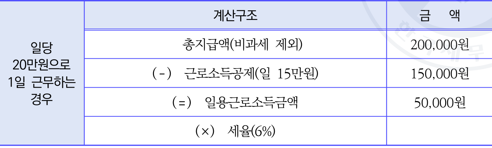

```markdown
| 일당 20만원으로 1일 근무하는 경우 | 계산구조                     | 금액      |
|-----------------------------|----------------------------|---------|
| 일당 20만원으로 1일 근무하는 경우 | 총지급액(비과세 제외)            | 200,000원 |
| 일당 20만원으로 1일 근무하는 경우 | ( - ) 근로소득공제(일 15만원)     | 150,000원 |
| 일당 20만원으로 1일 근무하는 경우 | ( = ) 일용근로소득금액            | 50,000원  |
| 일당 20만원으로 1일 근무하는 경우 | ( × ) 세율(6%)                |          |
```

<<SPLIT>>
elementId: 372
| (=) 산출세액 | 3,000원 |
| --- | --- |
| (-) 근로소득세액공제(산출세액의 55%) | 1,650원 |
| (=) 결정세액 | 1,350원 |
| 원천징수세액 : 1,350원x1일 = 1,350원(지방소득세 | 135원) |
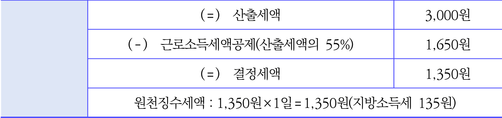

```markdown
| 항목                                      | 금액                |
|-----------------------------------------|-------------------|
| (=) 산출세액                               | 3,000원            |
| (-) 근로소득세액공제(산출세액의 55%)         | 1,650원            |
| (=) 결정세액                               | 1,350원            |
| 원천징수세액 : 1,350원×1일 = 1,350원(지방소득세 135원) |                   |
```

<<SPLIT>>
elementId: 373
(5) 소액부징수 적용 방법
<<SPLIT>>
elementId: 374
1) 원천징수세액이 1,000원 미만인 경우 소득세를 징수하지 아니하며 지급금액을 기준
으로 소액부징수를 판단한다.
2) 5일간 일당을 한번에 지급시 5일 일당에 대한 원천징수세액 합계가 1,000원 이상인
경우 소액부징수를 적용하지 아니한다.
3) 일용근로자의 납세의무는 원천징수로 과세 종료(완납적 원천징수)된다.
<<SPLIT>>
elementId: 375
03 비과세 근로소득
<<SPLIT>>
elementId: 376
ACPTA SINCE
<<SPLIT>>
elementId: 377
(1) 실비변상적 성격의 비과세(소득령 제12조)
<<SPLIT>>
elementId: 378
연말정산
세무
<<SPLIT>>
elementId: 379
회사에서 실제 지출하는 대신에 근로자가 지출하였을 것으로 예측되는 일정금액을 정하
여 근로자에게 지급할 경우 비과세(과세권 포기)를 적용한다.
<<SPLIT>>
elementId: 380
84
<<SPLIT>>
elementId: 381
제1장 근로소득 연말정산(이론편)
<<SPLIT>>
elementId: 382
1) 「선원법」 에 의한 식료
<<SPLIT>>
elementId: 383
「선원법」 에 따라 승선 중인 선원에게 공급하는 식료에 대해서는 비과세되는 것이나,
휴가 기간 동안에 지급 받는 급식비는 이에 포함되지 아니하며, 승선 중인 선원이
식료품비 명목으로 일정액으로 현금 지급 받는 경우에는 과세대상 근로소득에 해당
한다.
<<SPLIT>>
elementId: 384
2) 자기차량운전보조금
<<SPLIT>>
elementId: 385
종업원의 소유차량26)을 종업원이 직접 운전하여 업무수행에 이용하고 시내출장 등에
소요된 실제 여비를 받는 대신에 그 소요경비를 정해진 지급기준에 따라 받는 금액
은 월 20만원까지 비과세를 적용한다. 근로자가 2인 이상의 회사에 근무하면서 각
각의 회사로부터 자기차량운전보조금을 지급받는 경우에는 이를 지급하는 회사를 기
준으로 월 20만원 이내의 금액을 비과세한다(서면1팀-1272. 2006.9.14.).
<<SPLIT>>
elementId: 386
다만 직원의 출 · 퇴근 편의를 위해 지급하는 교통보조금은 자기차량운전보조금에 해
당하지 않으며 출장여비와 자기차량운전보조금을 함께 수령하는 경우에는 출장여비
는 실비변상적 급여로 비과세하고 자기차량운전보조금은 근로소득으로 과세된다(원-
597. 2012.11.7.).
<<SPLIT>>
elementId: 387
부부 공동명의 차량을 각자 회사의 규정에 따라 자기차량운전보조금을 각각 받는 경
우 부부 각자 근무하는 회사의 규정에 따라 각자 별도 직접 운전하여 실제 사용자의
다른 업무수행에 이용하고 받는 금액은 각각 월 20만원 한도 내에서 비과세 적용
가능하다.(원-688. 2011.10.28.)
<<SPLIT>>
elementId: 388
[필수] 자기차량운전 보조금 비과세요건
<<SPLIT>>
elementId: 389
① 종업원(임원)의 소유(본인명의 임차 포함) 차량(이륜자동차 포함)일 것(차량등록증 사본)
② 종업원이 직접 자기 차량을 운전하여 사용자의 업무수행에 이용할 것
③ 시내출장 등에 소요된 실제 여비를 지급받지 않을 것
④ 사업체의 규칙 등에 의하여 지급기준에 따라 소요경비를 받을 것
<<SPLIT>>
elementId: 390
26) 반드시 종업원 본인명의(본인명의 임차 포함)의 차량만 가능(공동명의는 부부만 가능)
<<SPLIT>>
elementId: 391
제3장
연말정산
세액의
계산
제4장
근로소득자의
연말정산
후
4대보험
정산
<<SPLIT>>
elementId: 392
제
1장
근로소득
연말정산(이론편)
<<SPLIT>>
elementId: 393
85
<<SPLIT>>
elementId: 394
제2장
근로소득
연말정산(실전편)
<<SPLIT>>
elementId: 395
1962
<<SPLIT>>
elementId: 396
[참고] 자기차량운전 보조금 관련 유의사항
<<SPLIT>>
elementId: 397
1. 본인과 배우자 공동명의로 등록된 차량에 대하여는 자가운전보조금 규정을 적용할 수 있으
나(원천-688. 2011.10.28.) 부모, 자녀 등 배우자 외의 자와 공동명의인 차량에 대하여는
자가운전보조금 규정을 적용할 수 없음(기획재정부소득-551. 2011.12.23., 원천-503.
2011.9.30.).
2. 자가운전보조금이 연봉계약서에 포함되어 있고, 당해 사업체의 규칙등에 의하여 지급기준
이 정하여져 있는 경우로서 당해 종업원이 자기 소유차량으로 직접 운전하여 사용자의 업
무수행에 이용하고 시내출장 등에 소요된 실제여비를 받지 아니하는 경우에는 당해 규정
에 의한 금액(월 20만원 한도)은 실비변상적인 성질의 급여로 비과세되는 자가운전보조금
에 해당함(서이 46013-12204. 2002.12.9.).
3. 종업원이 지급받는 월 20만원 이내의 자가운전보조금 비과세 규정에서 종업원의 범위에는
임원도 포함되는 것임(법인 46013-1123. 1996.4.12.).
4. 비과세되는 자가운전보조금은 차량운행에 따른 소요경비의 증빙서류 비치여부에 관계없
이 사규에 의하여 실제적으로 지급받는 월 20만원 이내의 금액임(법인 46013-2726.
1996.9.25.).
5. 2022.1.1.이후 종업원 명의로 임차한 차량도 자가운전보조금 비과세 적용이 가능하도록
개정됨.
6. 직원의 출퇴근의 편의를 위해 지급하는 교통보조금은 근로소득에 해당함(원천-597,
2012.11.07.).
7. 시내출장 등 소요경비와 자가운전보조금을 동시에 받는 경우 소요된 실제여비는 실비변상
적 급여로 비과세되나 자가운전보조금은 근로소득에 해당함(서면1팀-567, 2006.5.1.).
8. 자가운전보조금을 지급받는 직원이 시내출장여비가 아닌 시외출장여비 등을 지급받는 경우
자가운전보조금의 비과세에 해당함 (서면1팀-52, 2006.01.16.).
<<SPLIT>>
elementId: 398
3) 일직료 · 숙직료 · 출장비로서 실비변상 정도의 금액
<<SPLIT>>
elementId: 399
실비변상정도의 금액에 대한 판단은 사규 등에 지급기준이 정하여져 있고 사회통념
상 타당하다고 인정되는 금액
<<SPLIT>>
elementId: 400
연말정산
<<SPLIT>>
elementId: 401
세무
<<SPLIT>>
elementId: 402
86
<<SPLIT>>
elementId: 403
196
<<SPLIT>>
elementId: 404
제1장 근로소득 연말정산(이론편)
<<SPLIT>>
elementId: 405
[참고] 출장여비 관련 주의사항
<<SPLIT>>
elementId: 406
1. 법인의 종업원이 업무수행을 위한 해외출장으로 인하여 실제 소요된 항공료, 숙박비를 선
지출하고 해당 법인으로부터 그 지출한 금액을 정산하여 지급받는 경우로서 해당 해외출
장 비용이 지출증명서류로 확인되는 때에는 해당 종업원의 근로소득에 해당되지 아니함.
2. 사규 등에 지급기준이 정하여져 있고 사회통념상 타당하다고 인정되는 금액 범위 내이고
이때 숙직료 등을 월 단위로 모아서 지급하는 경우 그 판단은 1일 숙직료 등을 기준으로
판단하는 것이다(법인 46013-3228, 1996.11.19.).
3. 회사의 여비지급규정 또는 사규에 따라 지급받는 출장경비는 그 목적 · 기간· 출장지 등을
감안해 실소요비용을 충당할 정도 범위내에서 실비변상적인 성질의 급여로 비과세하는 바,
이에 해당하는 출장여비의 경우는 월합계금액의 크기에 불구하고 비과세 함(재소득 46073
- 146, 1999.7.19.).
<<SPLIT>>
elementId: 407
[참고] 해외근무에 따른 귀국휴가여비(소득세 집행기준 12-12...3)
<<SPLIT>>
elementId: 408
국외근무하는 내국인근로자 또는 국내근무 외국인근로자의 본국휴가에 따른 여비는 다음의
조건과 범위 내에서 비과세되는 실비변상적 급여로 본다.
<<SPLIT>>
elementId: 409
1. 비과세조건
<<SPLIT>>
elementId: 410
① 회사의 사규 또는 고용계약서 등에 본국 이외의 지역에서 1년 이상 근무(1년 이상 근무
조건으로 계약한 경우 포함)한 근로자에게 귀국여비를 회사가 부담하도록 되어 있을 것
② 해외근무라고 하는 근무환경의 특수성에 따라 직무 수행상 필수적이라고 인정되는 휴가
일 것
2. 비과세금액
왕복교통비(항공기의 운행관계상 부득이한 사정으로 경유지에서 숙박한 경우 그 숙박료를
포함)로서 가장 합리적 또는 경제적이라고 인정되는 범위 내의 금액에 한하며 관광여행이
라고 인정되는 부분의 금액은 제외
<<SPLIT>>
elementId: 411
4) 법령 · 조례에 의하여 제복을 착용하여야 하는 자가 받는 제복 · 제모 및 제화
5) 병원 · 실험실 · 금융회사 · 공장 · 광산에서 근무하는 사람 등이 받는 작업복이나 그
직장에서만 착용하는 피복27)
6) 특수분야에 종사하는 군인이 받는 낙하산강하위험수당 · 수중파괴작업위험수당 · 잠수
<<SPLIT>>
elementId: 412
27) 직원들에게 지급한 피복이 회사의 마크가 없고 외출복으로도 착용가능하다면 과세대상 근로소득임.
<<SPLIT>>
elementId: 413
제2장
근로소득
연말정산(실전편)
제3장
연말정산
세액의
계산
제4장
근로소득자의
연말정산
후
4대보험
정산
<<SPLIT>>
elementId: 414
87
<<SPLIT>>
elementId: 415
제
1장
근로소득
연말정산(이론편)
<<SPLIT>>
elementId: 416
|  |  |
| --- | --- |
|  | 부위험수당 · 고전압위험수당 · 폭발물위험수당 · 항공수당(기획재정부령으로 정하는 유 지비행훈련수당을 포함) · 비무장지대근무수당 · 전방초소근무수당 · 함정근무수당(기획 재정부령으로 정하는 유지항해훈련수당을 포함한다) 및 수륙양용궤도차량승무수당, 특수분야에 종사하는 경찰공무원이 받는 경찰특수전술업무수당과 경호공무원이 받는 경호수당 7) 「선원법」 에 의한 선원이 받는 월 20만원 이내의 승선수당, 경찰공무원이 받는 함정 근무수당 · 항공수당 및 소방공무원이 받는 함정근무수당 · 항공수당 · 화재진화수당 |
|  | [참고] 승선수당 비과세여부 (서면1팀-826, 2005.7.12.) 선원으로서 선장 및 해원이 받는 월20만원이내의 승선수당은 국외근로소득의 비과세급여 및 생산직근로자가 받는 야간근로수당 등의 비과세 규정을 적용받는 자를 제외하고는 실비변상 적인 급여로 보아 근로소득세 비과세함. |
|  | 8) 광산근로자가 받는 입갱수당 및 발파수당 9) 연구보조비 또는 연구활동비 ① 다음에 해당하는 자가 지급받는 연구보조비 또는 연구활동비 중 월 20만원 이내 의 금액은 비과세함 가. 「유아교육법」, 「초 · 중등교육법」 및 「고등교육법」에 따른 학교 및 이에 준하 는 학교(특별법에 따른 교육기관을 포함한다)의 교원 나. 「특정연구기관육성법」의 적용을 받는 연구기관, 특별법에 따라 설립된 정부출 연연구기관, 「지방자치단체출연 연구원의 설립 및 운영에 관한 법률」에 따라 설립된 지방자치단체출연연구원에서 연구활동에 직접 종사하는 자(대학교원에 준하는 자격을 가진 자에 한한다) 및 직접적으로 연구활동을 지원하는 자로 서 기획재정부령으로 정하는 자 연말정산 세무 88 |
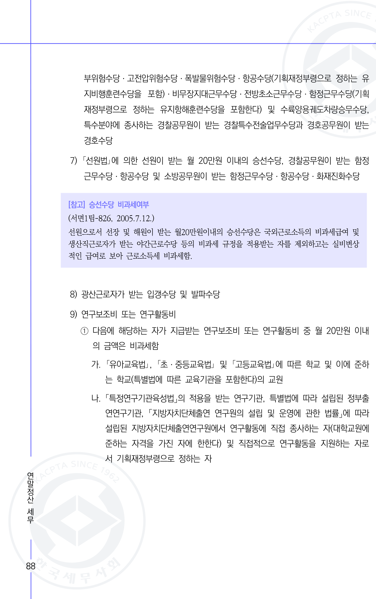

부위험수당, 고전압위험수당, 폭발물위험수당, 항공수당(기획재정부령으로 정하는 유지비행훈련수당을 포함), 비무장지대근무수당, 전방초소근무수당, 항정근무수당(기획재정부령으로 정하는 유지항해훈련수당을 포함) 및 수륙양용궤도차량승무수당, 특수분야에 종사하는 경찰공무원이 받는 경찰특수전술업무수당과 경호공무원이 받는 경호수당

7) 「선원법」에 의한 선원이 받는 월 20만원 이내의 승선수당, 경찰공무원이 받는 함정근무수당, 항공수당 및 소방공무원이 받는 함정근무수당, 항공수당, 화재진압수당

[참고] 승선수당 비과세여부

(서면1팀-826, 2005.7.12.)
선원으로서 선장 및 해원이 받는 월 20만원 이내의 승선수당은 국외근로소득의 비과세급여 및 생산직근로자가 받는 야간근로수당 등의 비과세 규정을 적용받는 자를 제외하고는 실비변상적인 급여로 보아 근로소득세 비과세함.

8) 광산근로자가 받는 입갱수당 및 발파수당

9) 연구보조비 또는 연구활동비

① 다음에 해당하는 자가 지급받는 연구보조비 또는 연구활동비 중 월 20만원 이내의 금액은 비과세함

가. 「유아교육법」, 「초·중등교육법」 및 「고등교육법」에 따른 학교 및 이에 준하는 학교(특별법에 따른 교육기관을 포함한다)의 교원

나. 「특정연구기관육성법」의 적용을 받는 연구기관, 특별법에 따라 설립된 정부출연연구기관, 「지방자치단체출연 연구원의 설립 및 운영에 관한 법률」에 따라 설립된 지방자치단체출연연구원에서 연구활동에 직접 종사하는 자(대학교원에 준하는 자격을 가진 자에 한한다) 및 직·간접적으로 연구활동을 지원하는 자로서 기획재정부령으로 정하는 자

연말정산 세무
88

<<SPLIT>>
elementId: 417
196
<<SPLIT>>
elementId: 418
제1장 근로소득 연말정산(이론편)
<<SPLIT>>
elementId: 419
[필수] 연구활동을 지원하는 자의 범위(소득칙 6조의4)
<<SPLIT>>
elementId: 420
연구활동을 지원하는 자는 「특정연구기관 육성법」의 적용을 받는 연구기관 또는 특별법에 따
라 설립된 정부출연연구기관, 「지방자치단체출연 연구원의 설립 및 운영에 관한 법률」에 따라
설립된 지방자치단체출연연구원의 종사자 중 다음 각 호의 자를 제외한 자를 말한다.
<<SPLIT>>
elementId: 421
1. 연구활동에 직접 종사하는 자(대학교원에 준하는 자격을 가진 자에 한한다)
2. 건물의 방호 · 유지 · 보수 · 청소 등 건물의 일상적 관리에 종사하는 자
3. 식사제공 및 차량의 운전에 종사하는 자
<<SPLIT>>
elementId: 422
다. 중소기업 또는 벤처기업의 기업부설연구소, 연구개발전담부서에서 연구활동에 직
접 종사하는 자
<<SPLIT>>
elementId: 423
[참고] 연구보조비 비과세
<<SPLIT>>
elementId: 424
1. 연구활동에 직접 종사하는 자라 함은 연구부서의 구성원 중 연구업무 외의 다른 업무를 병
행하지 않고 연구활동만을 수행하는 자를 말함(서면1팀 - 207, 2005.2.15.).
2. 매월 20만원의 연구보조비 또는 연구활동비를 매월 지급받아왔으나 연봉협상이 지연됨에
따라 위 금액이 미지급되었고 협상타결 후 20만원에 미지급월수를 곱한 금액을 일시에 지
급받은 경우 위와같이 일시에 지급받은 20만원에 미지급월수를 곱한 금액은 실비변상적
성격의 연구보조비 또는 연구활동비로서 비과세소득에 해당하는 것임(서면법령해석소득
2020-527, 2020.12.14.)
3. 교육공무원법 29조의4에 따라 임용된 수석교사가 교육공무원임용령 9조의8 제2항에 따라
지급받는 연구활동비는 근로소득에 해당하는 것이며, 매월 20만원 이내의 금액에 대해 비
과세 하는 것임(서면법령해석소득2015-808, 2015.07.07.).
4. 교과지도비를 학교운영위원회 예산에 편입하고 연구보조비 지급규정에 의해 교원에 지급한
월 20만원 이내 금액은 비과세대상임(서일 46011 - 10060, 2003.1.17.).
5. 사립대학의 조교는 교원의 범위에 포함되므로 조교가 지급받은 연구보조비는 근로소득으로
보지 아니하나, 산업체 겸임교원은 연구보조비의 지급대상이 되는 교원의 범위에 포함되지
아니함(법인 46013-2122, 1996.7.26.).
6. 초중등교육법에 따른 교육기관이 학생들로부터 받은 방과후학교 수업료를 교원에게 수업시
간당 일정금액으로 지급하는 금액은 연구보조비 비과세 대상에 해당하지 아니하는 것임(재
정경제부 소득세제과-474, 2007.08.31.)
<<SPLIT>>
elementId: 425
제2장
근로소득
연말정산(실전편)
<<SPLIT>>
elementId: 426
제
1장
근로소득
연말정산(이론편)
<<SPLIT>>
elementId: 427
제3장
연말정산
세액의
계산
제4장
근로소득자의
연말정산
후
4대보험
정산
<<SPLIT>>
elementId: 428
89
<<SPLIT>>
elementId: 429
|  | 10) |
| --- | --- |
|  | 국가 · 지방자치단체가 지급하는 보조금으로 다음의 금액 ① 「영유아보육법 시행령」 제24조 제1항 제7호에 따른 비용 중 보육교사의 처우개 선을 위하여 지급하는 근무환경개선비 ② 「유아교육법 시행령」 제32조 제1항 제2호에 따른 사립유치원 수석교사 · 교사의 인건비 ③ 전문과목별 전문의의 수급 균형을 유도하기 위하여 전공의에게 지급하는 수련보 조수당 11) 취재활동과 관련하여 지급받는 월 20만 이내 취재수당 방송, 뉴스통신, 신문 등에 종사하는 기자(논설위원 및 만화가 포함)가 받는 취재수 당. 이 경우 취재수당을 급여에 포함하여 받는 경우에는 월 20만원에 상당하는 금 액을 취재수당으로 본다. 12) 벽지 근무로 인해 받는 월 20만원 이내 벽지수당 ① 의료 취약지역의 의료인(보건복지부장관의 면허를 받은 의사, 치과의사, 한의사, 조산사, 간호사)이 받는 벽지수당 ② 공무원의 특수지 근무수당28) 등 |
|  | [필수] 벽지의 범위(소득칙 7조) 1. 「공무원 특수지근무수당 지급대상지역 및 기관과 그 등급별 구분에 관한 규칙」 별표1의 지역 1의2. 「지방공무원 특수지근무수당 지급대상지역 및 기관과 그 등급별 구분에 관한 규칙」 별 표1의 지역(같은 표 제1호의 벽지지역과 제2호의 도서지역 중 군지역의 경우 지역 및 등 급란에 규정된 면지역 전체를 말한다) 2. 「도서 · 벽지 교육진흥법 시행규칙」 별표의 지역 3. 「광업법」에 의하여 광업권을 지정받아 광구로 등록된 지역 4. 별표1의 의료취약지역(「의료법」 제2조의 규정에 의한 의료인의 경우로 한정한다) |
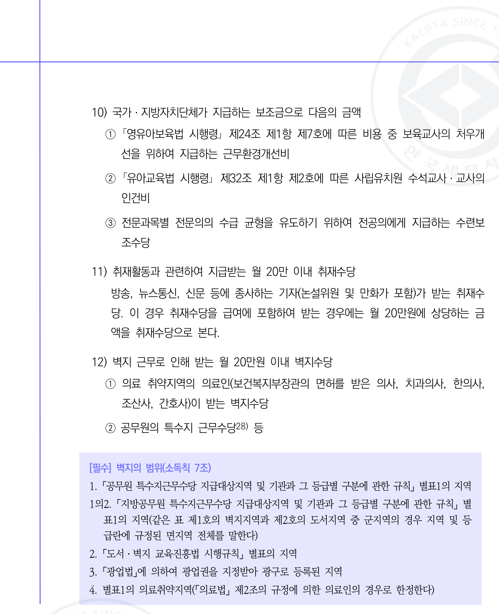

10) 국가·지방자치단체가 지급하는 보조금으로 다음의 금액
   1. 「영유아보육법 시행령」 제24조 제1항 제7호에 따른 비용 중 보육교사의 처우개선을 위하여 지급하는 근무환경개선비
   2. 「유아교육법 시행령」 제32조 제1항 제2호에 따른 사립유치원 수석교사·교사의 인건비
   3. 전문과목별 전문의의 수급 균형을 유도하기 위하여 전공의에게 지급하는 수련보조수당

11) 취재활동과 관련하여 지급받는 월 20만 원 이내 취재수당
   - 방송, 뉴스통신, 신문 등에 종사하는 기자(논설위원 및 만화가 포함)가 받는 취재수당. 이 경우 취재수당을 급여에 포함하여 받는 경우에는 월 20만 원에 상당하는 금액을 취재수당으로 본다.

12) 벽지 근무로 인해 받는 월 20만 원 이내 벽지수당
   1. 의료 취약지역의 의료인(보건복지부장관의 면허를 받은 의사, 치과의사, 한의사, 조산사, 간호사)이 받는 벽지수당
   2. 공무원의 특수지 근무수당 등

[필수] 벽지의 범위(소득칙 7조)
1. 「공무원 특수지근무수당 지급대상지역 및 기관과 그 등급별 구분에 관한 규칙」 별표1의 지역
2. 「지방공무원 특수지근무수당 지급대상지역 및 기관과 그 등급별 구분에 관한 규칙」 별표1의 지역(같은 표 제1호의 벽지지역과 제2호의 도서지역 중 군지역의 경우 지역 및 등급안에 규정된 면지역 전체를 말한다)
3. 「도서·벽지 교육진흥법 시행규칙」 별표의 지역
4. 「광역시의 의회와 광역시를 지정하는 광역군 등록된 지역
5. 별표1의 의료취약지역(「의료법」 제2조의 규정에 의한 의료인이 경우로 한정함)

<<SPLIT>>
elementId: 430
연말정산
세무
<<SPLIT>>
elementId: 431
28) 다만, 종업원이 벽지수당 대신 지급받는 출퇴근보조비는 과세대상 근로소득임
<<SPLIT>>
elementId: 432
90
<<SPLIT>>
elementId: 433
19
<<SPLIT>>
elementId: 434
제1장 근로소득 연말정산(이론편)
<<SPLIT>>
elementId: 435
13) 천재 · 지변 기타 재해로 지급받는 급여
<<SPLIT>>
elementId: 436
근로자 또는 종교관련 종사자가 소속 종교단체로부터 제공받는 천재 * 지변 기타 재
해로 지급받는 급여
<<SPLIT>>
elementId: 437
14) 지방이전기관 종사자가 받는 이주수당(월 20만원 한도)
수도권 외의 지역으로 이전하는 공공기관(국가균형발전특별법 2조 10호)의 소속 공
무원이나 직원에게 한시적으로 지급하는 이전지원금(2013.1.1. 이후)
<<SPLIT>>
elementId: 438
15) 종교관련종사자의 종교활동비
<<SPLIT>>
elementId: 439
종교관련종사자가 소속 종교단체의 규약 또는 소속 종교단체의 의결기구의 의결 ·
승인 등을 통하여 결정된 지급기준에 따라 종교활동을 위하여 통상적으로 사용할
목적으로 지급받은 금액 및 물품(소득령 제12조 18호)
<<SPLIT>>
elementId: 440
(2) 복리후생적 성질의 비과세(소득령 제17조의 4)
<<SPLIT>>
elementId: 441
기업이 근로자를 위해 복리후생성격으로 지급하는 금품은 근로소득으로 과세하지 아니
한다.
<<SPLIT>>
elementId: 442
1) 종업원 등의 사택제공이익
<<SPLIT>>
elementId: 443
주택을 제공받음으로써 얻는 이익은 근로소득에 포함되나, 주주 또는 출자자가 아닌
임원과 임원이 아닌 종업원 등이 다음에서 정하는 사택을 제공받음으로써 얻는 이익
은 근로소득으로 보지 않는다.
<<SPLIT>>
elementId: 444
① 사용자가 소유하고 있는 주택을 종업원 및 임원에게 무상 또는 저가로 제공하거
나, 사용자가 직접 임차하여 종업원등에게 무상으로 제공하는 주택을 말한다.
<<SPLIT>>
elementId: 445
② 사용자가 임차주택을 사택으로 제공하는 경우 임대차기간 중에 종업원 등이 전근
· 퇴직 또는 이사하는 때에는 다른 종업원 등이 해당 주택에 입주하는 경우에
한하여 이를 사택으로 본다. 다만, 다음의 경우에는 그러하지 아니하다.
<<SPLIT>>
elementId: 446
가. 입주한 종업원 등이 전근 · 퇴직 또는 이사한 후 해당 사업장의 종업원 등 중
에서 입주희망자가 없는 경우
<<SPLIT>>
elementId: 447
근로소득
<<SPLIT>>
elementId: 448
연말정산(실전편)
<<SPLIT>>
elementId: 449
제2장
<<SPLIT>>
elementId: 450
나. 해당 임차주택의 계약잔여기간이 1년 이하인 경우로서 주택임대인이 주택임
대차계약의 갱신을 거부하는 경우
<<SPLIT>>
elementId: 451
제3장
연말정산
세액의
계산
제4장
근로소득자의
연말정산
후
4대보험
정산
<<SPLIT>>
elementId: 452
91
<<SPLIT>>
elementId: 453
제
1장
근로소득
연말정산(이론편)
<<SPLIT>>
elementId: 454
1962
<<SPLIT>>
elementId: 455
[필수] 임원 및 직원의 범위
<<SPLIT>>
elementId: 456
1. 주주 또는 출자자가 아닌 임원
2. 소액주주인 임원29)
3. 임원이 아닌 종업원(비영리법인 또는 개인의 종업원 포함)
4. 국가 또는 지방자치단체로부터 근로소득을 지급받는 사람
<<SPLIT>>
elementId: 457
[참고] 사택관련 유의사항
<<SPLIT>>
elementId: 458
1, 과세 제외대상 사택의 범위
(1) 사용자가 소유하고 있는 주택을 무상 또는 저가로 제공하는 경우
(2) 사용자가 직접 임차하여 무상으로 제공하는 경우. 이 경우 임대차기간 중에 종업원 등
이 전근 · 퇴직 또는 이사하는 때에는 다른 종업원 등이 해당 주택에 입주하는 경우에
한함
2. 유의사항
(1) 사용자가 임차한 주택을 무상으로 제공하지 않고 종업원 등의 주택임차료 일부를 부담
하는 경우에는 사택으로 보지 않음(소득 46011 -21446, 2000.12.22.).
(2) 레지던스 호텔의 경우 사택으로 보지 않음(원천-299, 2011.5.24.).
(3) 해외에 소재하는 주택도 사택의 범위에 포함하는 것이지만, 해외근무자가 주택수당을
지급받으면서 임대차계약의 명의만을 회사로 하는 경우에는 사택에 해당되지 아니하는
것임(소득-522, 2014.09.23.)
(4) 지방발령으로 인하여 지방에 근무하는 근로자가 이사하지 않고 근무지에서 하숙을 하
는 경우 고용주로부터 타지역 근무수당으로 지급받는 금전은 명치에 관계없이 과세대
상 근로소득에 해당하는 것임(서면1팀-63, 2005.01.14.)
(5) 내국법인이 사규에 따른 기준금액 내의 임차보증금은 법인이 부담하고, 기준금액을 초
과하는 임차보증금 또는 매월 지급하는 임차료는 종업원이 부담하는 것으로 각각 구분
표시하여 공동임차인으로 임대차계약을 체결하는 경우에는 사택에 해당되지 아니하는
것이며 내국법인이 부담하는 임차보증금은 주택임차자금을 무상으로 대여받음으로써
얻은 이익으로 총급여액에 포함하여 정산하는 것임(법규소득2012-51, 2012.03.16.)
(6) 외국법인의 종업원 등이 사택을 제공함으로써 얻은 이익은 근로소득에 해당하지 아니
하며, 이때 사택은 외국법인의 본점 또는 지점이 직접 임차하여 종업원 등에게 무상으
<<SPLIT>>
elementId: 459
연말정산
세무
<<SPLIT>>
elementId: 460
29) 상장법인과 비상장법인의 소액주주(해당 법인과 「법인세법」 상 지배주주등과 특수관계가 없는 주주로서
주식 총액의 1% 미만 보유주주)인 임원을 말한다.
<<SPLIT>>
elementId: 461
92
<<SPLIT>>
elementId: 462
제1장 근로소득 연말정산(이론편)
<<SPLIT>>
elementId: 463
로 제공하는 사택도 포함하는 것임(서면2팀-2460, 2004.11.26.).
<<SPLIT>>
elementId: 464
(7) 사용자가 직접 임차하여 종업원 등에게 무상으로 제공하는 주택은 사택에 해당하는 것
이나 임차한 주택을 무상으로 제공하지 아니하고 종업원 등이 주택임차료의 일부를
부담하는 경우에는 사택에 해당하지 아니하는 것임(소득46011-21446, 2000.12.22.)
<<SPLIT>>
elementId: 465
2) 중소기업 종업원의 주택구입 · 임차자금
<<SPLIT>>
elementId: 466
중소기업의 종업원이 주택(부수토지 포함)의 구입 · 임차에 소요되는 자금을 저리 또
는 무상으로 대여 받음으로써 얻는 이익은 복리후생적 성질의 급여로 비과세한다.
다만 해당 종업원이 중소기업과 다음의 구분에 따른 관계에 있는 경우 그 종업원이
얻는 이익은 제외한다
<<SPLIT>>
elementId: 467
① 중소기업이 개인사업자인 경우 : 「국기령」 제1조의2 제1항에 따른 친족관계
<<SPLIT>>
elementId: 468
② 중소기업이 법인사업자인 경우 : 「법인령」 제43조 제7항에 따른 지배주주등인
관계
<<SPLIT>>
elementId: 469
3) 직장어린이집설치에 따른 종업원이 얻는 이익
<<SPLIT>>
elementId: 470
「영유아보육법」 제14조에 따라 직장어린이집을 설치 · 운영하거나 위탁보육을 하는
사업주가 같은 법 제37조 및 같은 법 시행령 제25조에 따라 그 비용을 부담함으로
써 해당 사업장의 종업원이 얻는 이익
<<SPLIT>>
elementId: 471
4) 사용자가 부담하는 단체보험 등
<<SPLIT>>
elementId: 472
① 종업원의 사망 · 상해 또는 질병을 보험금의 지급사유로 하고 종업원을 피보험자
와 수익자로 하는 보험으로서 만기에 납입보험료를 환급하지 않는 보험(이하
"단체순수보장성보험" 이라 한다)과 만기에 납입보험료를 초과하지 않는 범위에
서 환급하는 보험(이하 "단체환급부보장성보험" 이라 한다)의 보험료 중 연 70만
원 이하의 금액
<<SPLIT>>
elementId: 473
② 임직원의 고의(중과실을 포함한다) 외의 업무상 행위로 인한 손해의 배상청구를
보험금의 지급사유로 하고 임직원을 피보험자로 하는 보험의 보험료
<<SPLIT>>
elementId: 474
5) 공무원이 국가 또는 지방자치단체로부터 공무 수행과 관련하여 받는 상금과 부상 중
연 240만원 이내의 금액
<<SPLIT>>
elementId: 475
제3장
연말정산
세액의
계산
제4장
근로소득자의
연말정산
후
4대보험
정산
<<SPLIT>>
elementId: 476
93
<<SPLIT>>
elementId: 477
제
1장
근로소득
연말정산(이론편)
<<SPLIT>>
elementId: 478
제2장
근로소득
연말정산(실전편)
<<SPLIT>>
elementId: 479
|  | [참고] 사내근로복지기금으로부터 받는 장학금 등(재소득-67, 2003.12.13.) 종업원이 사내근로복지기금으로부터 「사내근로복지기금법」 같은 금의 |
| --- | --- |
|  | 제14조 및 법 시행령 제19 조의 규정에 의하여 지급받는 자녀학자금은 지급되는 학자금의 원천이 출연금이지 또는 출연 수익금인지 여부에 관계없이 과세대상 근로소득에 해당하지 아니한다 6) 경조금(소득칙 제10조) 사업자가 그 종업원에게 지급한 경조금 중 사회통념상 타당하다고 인정되는 범위 내 의 금액은 이를 지급받은 자의 근로소득으로 보지 아니한다. (3) 기타의 비과세(소득법 12조) 법률상 · 기타 정책적 목적에 의해 비과세 적용하는 항목으로써 실비변상적 성격의 비과 세와 구분된다. 1) 복무중인 병(兵)이 받는 급여 병역의무의 수행을 위하여 징집 · 소집되거나 지원하여 복무 중인 사람으로서 병장 이하의 현역병(지원하지 아니하고 임용된 하사를 포함), 의무경찰, 그 밖에 이에 준 하는 사람을 말한다. 2) 법률에 따라 동원된 사람이 그 동원 직장에서 받는 급여 「향토예비군설치법」, 「민방위기본법」, 「병역법」, 「소방기본법」, 「감염병의 예방 및 관리에 관한 법률」, 「계엄법」 등을 말함 3) 법률에 따른 국방 · 배상 · 보상 · 위자료 · 연금 성격의 급여 ① 「산업재해보상보험법」 에 따라 수급권자가 받는 요양급여, 휴업급여, 유족급여, 유 족특별급여, 장해특별급여, 장의비 도는 근로의 제공으로 인한 부상 · 질병 · 사망 과 관련하여 근로자나 그 유족이 받는 배상 · 보상 또는 위자(��)의 성질이 있 는 급여 연말정산 ② 「근로기준법」 또는 「선원법」에 따라 근로자 · 선원 및 그 유족이 받는 요양보상 금, 휴업보상금, 상병보상금(�����), 일시보상금, 장해보상금, 유족보상금, 세무 행방불명보상금, 소지품 유실보상금, 장의비 및 장제비 94 |
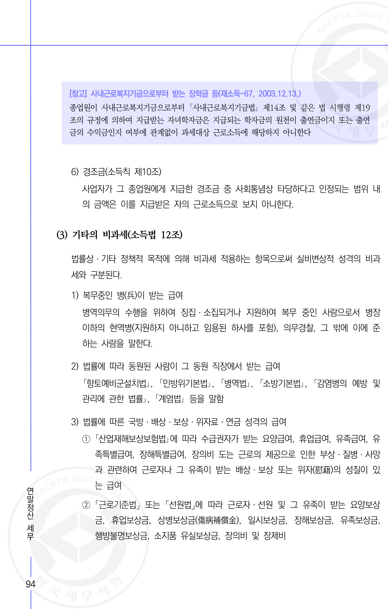

이미지에는 소득세법과 관련된 비과세 항목에 대한 설명이 포함되어 있습니다. 주요 내용은 다음과 같습니다:

1. **사내근로복지기금으로부터 받는 장학금 등**
   - 중앙행정기관의 규정에 따라 지급되는 자비학자금은 과세대상 근로소득에 해당하지 않음.

2. **경조금(소득세법 제10조)**
   - 사업자가 중소기업에 지급한 경조금 중 사회통념상 타당하다고 인정되는 범위 내의 금액은 근로소득으로 보지 않음.

3. **기타의 비과세(소득세법 제12조)**
   - 법률상 비과세로 적용되는 항목으로 실비변상적 성격의 비과세로 구분됨.
   - **복무중인 병(兵)이 받는 급여**
     - 병역의무 수행을 위한 징집, 소집된 사람에게 지급되는 급여.
   - **법률에 따라 동일한 직장에서 받는 급여**
     - 향토예비군설치법, 민방위기본법, 병역법 등 관련 법률에 따른 급여.
   - **법률에 따른 국방, 배상, 보상, 위자료, 연금 성격의 급여**
     - 산업재해보상보험법에 따른 요양급여, 휴업급여 등.
     - 근로기준법 또는 선원법에 따른 요양보상금, 휴업보상금 등.

이 내용은 소득세법에서 비과세로 인정되는 항목들을 설명하고 있습니다.

<<SPLIT>>
elementId: 480
제1장 근로소득 연말정산(이론편)
<<SPLIT>>
elementId: 481
4)
<<SPLIT>>
elementId: 482
③ 「고용보험법」에 따라 받는 실업급여, 육아휴직 급여, 육아기 근로시간 단축 급여,
출산전후휴가 급여 등, 「제대군인 지원에 관한 법률」에 따라 받는 전직지원금,
「국가공무원법」 · 「지방공무원법」에 따른 공무원 또는 「사립학교교직원 연금법」
「별정우체국법」을 적용받는 사람이 관련 법령에 따라 받는 육아휴직수당(「 사립학
교법」따라 임명된 사무직원이 학교의 정관 또는 규칙에 따라 지급받는 육아휴직
수당으로서 월 150만원 이하의 것을 포함한다)
④ 「국민연금법」에 따라 받는 사망을 원인으로 한 따른 반환일시금 및 사망일시금
⑤ 「공무원연금법」, 「공무원 재해보상법」, 「군인연금법」, 「군인 재해보상법」, 「사립
학교교직원 연금법」 또는 「별정우체국법」에 따라 받는 공무상요양비 · 요양급여 ·
장해일시금 · 비공무상 장해일시금 · 비직무상 장해일시금 · 장애보상금 · 사망조위
금 · 사망보상금 · 유족일시금 · 퇴직유족일시금 · 유족연금일시금 · 퇴직유족연금일시
금 · 퇴역유족연금일시금 · 순직유족연금일시금 · 유족연금부가금 · 퇴직유족연금부가
금 · 퇴역유족연금부가금 · 유족연금특별부가금 · 퇴직유족연금특별부가금 · 퇴역유족
연금특별부가금 · 순직유족보상금 · 직무상유족보상금 · 위험직무순직유족보상금 · 재
해부조금 · 재난부조금 또는 신체 · 정신상의 장해 · 질병으로 인한 휴직기간에 받
는 급여
⑥ 「국가유공자 등 예우 및 지원에 관한 법률」 또는 「보훈보상대상자 지원에 관한
법률」에 따라 받는 보훈급여금 · 학습보조비
⑦ 「전직대통령 예유에 관한 법률」에 따라 받는 연금
⑧ 작전임무를 수행하기 위하여 외국에 주둔 중인 군인 · 군무원이 받는 급여
⑨ 종군한 군인 · 군무원이 전사(전상으로 인한 사망을 포함. 이하 같다)한 경우 그
전사한 날이 속하는 과세기간의 급여
⑩ 「국민건강보험법」, 「고용보험법」 또는 「노인장기요양보험법」에 따라 국가, 지방
자치단체 또는 사용자가 부담하는 보험료
⑪ 「국군포로의 송환 및 대우 등에 관한 법률」에 따른 국군포로가 받는 보수 및 퇴
직일시금
학자금
근로자(출자임원 포함) 본인의 학자금으로 「초중등교육법」 및 「고등교육법」에 따른
<<SPLIT>>
elementId: 483
제
1장
근로소득
연말정산(이론편)
<<SPLIT>>
elementId: 484
제2장
근로소득
연말정산(실전편)
<<SPLIT>>
elementId: 485
제3장
연말정산
세액의
계산
제4장
근로소득자의
연말정산
후
4대보험
정산
<<SPLIT>>
elementId: 486
95
<<SPLIT>>
elementId: 487
학교(외국에 있는 유사한 교육기관을 포함)와 「국민평생직업능력개발법」에 따른 직업
능력개발훈련시설의 입학금 · 수업료 · 수강료, 그 밖의 공납금 중 아래 요건을 갖춘
학자금(해당 과세기간에 납입할 금액을 한도로 함)은 비과세한다.
<<SPLIT>>
elementId: 488
① 당해 근로자가 종사하는 사업체의 업무와 관련 있는 교육 · 훈련을 위하여 받는
것일 것
② 당해 근로자가 종사하는 사업체의 규칙 등에 의하여 정하여진 지급기준에 따라
받는 것일 것
③ 교육 · 훈련기간이 6월이상인 경우 교육 · 훈련 후 당해 교육기간을 초과하여 근
무하지 아니하는 때에는 지급받은 금액을 반납할 것을 조건으로 하여 받는 것
일 것
<<SPLIT>>
elementId: 489
[사례] 학자금의 구분(소득법 집행기준 12-11-1)
<<SPLIT>>
elementId: 490
| 비과세 학자금 | 비과세 되지 않는 학자금 |
| --- | --- |
| 대학원에 납입한 학자금 출자임원에 대한 학자금 해외 MBA과정에 납입한 교육훈련비 | 사설어학원 수강을 지원하는 교육훈련비 자치회비 및 교재비 자녀학자금 학비보조금(또는 연수비) |
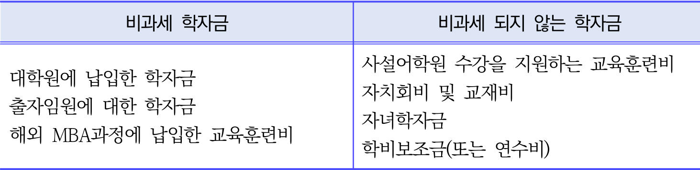

```markdown
| 비과세 학자금                          | 비과세 되지 않는 학자금                  |
|----------------------------------------|------------------------------------------|
| 대학원에 납입한 학자금                 | 사설어학원 수강을 지원하는 교육훈련비    |
| 출자임원에 대한 학자금                 | 자치회비 및 교재비                      |
| 해외 MBA과정에 납입한 교육훈련비      | 자녀학자금                              |
|                                        | 학비보조금(또는 연수비)                 |
```

<<SPLIT>>
elementId: 491
[참고] 학자금 관련 유의사항
<<SPLIT>>
elementId: 492
1. 소득세법 제12조에서 비과세소득으로 보는 학자금이라 함은 교육법에 의한 학교 및 근로
자직업훈련촉진법에 의한 직업능력개발훈련시설의 입학금 · 수업료 · 수강료 기타 공납금
중 같은법시행령 제11조의 각호의 요건을 갖춘 학자금을 말하는 것이며, 사설 어학원 수
강을 지원하는 교육훈련비는 비과세소득으로 보는 학자금에 해당하지 아니하는 것임.
근로자가 업무와 관련하여 지급받는 여비로서 출장목적 · 출장지 · 출장기간 등을 감안하여
업무수행상 통상 필요하다고 인정되는 부분의 금액은 소득세법 제12조및 같은법시행령 제
12조 제3호의 규정에 의하여 실비변상적인 성질의 급여로 비과세되는 것이나, 업무수행상
필요하다고 인정되는 금액을 초과하는 부분의 금액은 당해 근로자의 근로소득에 해당하는
것이므로, 질의의 경우가 이에 해당하는 지는 실질내용에 따라 사실판단 할 사항임(소득,
서면인터넷방문상담1팀-1499, 2004.11.08.).
<<SPLIT>>
elementId: 493
연말정산
<<SPLIT>>
elementId: 494
세무
<<SPLIT>>
elementId: 495
96
<<SPLIT>>
elementId: 496
제1장 근로소득 연말정산(이론편)
<<SPLIT>>
elementId: 497
2. 종업원이 사내근로복지기금으로부터 사내근로복지기금법 제14조 및 동법시행령 제19조의
규정에 의하여 지급받는 자녀학자금은 지급되는 학자금의 원천이 출연금인지 또는 출연
금의 수익금인지 여부에 관계없이 과세대상 근로소득에 해당하지 아니함(재소득-67,
2003.12.13.)
3. 대학원에 수학중인 종업원이 받는 학자금은 소득세법시행령 제11조에서 정한 요건을 갖춘
경우에 비과세 학자금에 해당하는 것이나, 당해 학자금은 근로소득세액 연말정산시 소득세
법 제52조에 규정하는 교육비 공제대상에는 해당되지 아니하는 것임(법인46013-2380,
1999.06.24.).
4. 해외에 근무하는 주재특파원의 자녀학자금은 비과세소득으로 열거하고 있지 아니하므로 과
세대상 근로소득에 해당하는 것임(조심-2010-서1763, 2012.02.28.)
<<SPLIT>>
elementId: 498
5) 외국정부 및 국제기관 근무자의 급여
<<SPLIT>>
elementId: 499
외국정부 또는 국제연합 및 그 소속기관에서 근무하는 사람으로서 대한민국사람이
아닌 사람이 직무수행의 대가로 받는 급여는 비과세 대상이다. 다만 그 외국정부가
그 나라에서 근무하는 우리나라 공무원의 급여에 대하여 소득세를 과세하지 아니하
는 경우만 해당한다(소득법 12조 3호 차목).
<<SPLIT>>
elementId: 500
6) 생산직 등 근로자의 연장근로수당
<<SPLIT>>
elementId: 501
생산 및 그 관련직에 종사하는 월정액급여 210만원 이하30)로서 직전 과세기간의
총급여액이 3천만원 이하인 근로자(일용근로자 포함)가 받는 연 240만원 이내의 연
장근로 · 야간근로 · 휴일근로수당은 비과세한다(소득령 17조).
<<SPLIT>>
elementId: 502
가. 생산 및 그 관련직 종사 근로자의 범위
<<SPLIT>>
elementId: 503
① 공장 또는 광산에서 근로를 제공하는 자로서 통계청장이 고시하는 한국표준직
업분류에 의한 생산 및 관련종사자중 소득칙 별표2에 규정된 직종에 종사하
는 자
<<SPLIT>>
elementId: 504
② 어업을 영위하는 자에게 고용되어 근로를 제공하는 자로서 선장을 제외한 자
<<SPLIT>>
elementId: 505
③ 통계청장이 고시하는 한국표준직업분류에 따른 운전 및 운송 관련직 종사자,
돌봄 · 미용 · 여가 및 관광 · 숙박시설 · 조리 및 음식 관련 서비스직 종사자,
매장 판매 종사자, 상품 대여 종사자, 통신 관련 판매직 종사자, 운송 · 청소
<<SPLIT>>
elementId: 506
30) 직전 과세기간의 급여가 없는 신규근로자의 경우 월정액급여 요건만 갖추면 적용대상이 됨
<<SPLIT>>
elementId: 507
제
1장
근로소득
연말정산(이론편)
<<SPLIT>>
elementId: 508
제3장
연말정산
세액의
계산
제4장
근로소득자의
연말정산
후
4대보험
정산
<<SPLIT>>
elementId: 509
제2장
근로소득
연말정산(실전편)
<<SPLIT>>
elementId: 510
97
<<SPLIT>>
elementId: 511
· 경비 · 가사 · 음식 · 판매 · 농림 · 어업 · 계기 · 자판기 * 주차관리 및 기타 서
비스 관련 단순 노무직 종사자 중 소득칙 별표2에 규정된 자
<<SPLIT>>
elementId: 512
[참고] 공장 또는 광산에서 근로를 제공하는 자의 범위(소득세 집행기준 12-17-1)
<<SPLIT>>
elementId: 513
1. 공장이라 함은 제조시설 및 그 부대시설을 갖추고 한국표준산업분류에 의한 제조업을 경영
하기 위한 사업장을 말하는 것으로 해당 사업장에 고용되거나 파견된 근로자로서 제조,생
산활동에 참여하여 근로를 제공하는 자는 이에 포함되는 것이나, 그 외 건설업체 등의 직
원으로서 공장시설의 신설 및 증,개축업무 또는 유지,보수용역을 제공하는 자는 동 규정에
의한 공장에서 근로를 제공하는자에 포함되지 않는다.
2. 건설업을 경영하는 업체의 건설현장에서 근로를 제공하는 일용근로자는 공장에서 근로를
제공하는 자에 해당하지 않으므로 동 건설일용근로자에게 지급되는 야간근로수 당 등은
비과세하지 않는다.
3. 생산직근로자의 범위에는 제조업을 경영하는 자로부터 제조공정의 일부를 도급받아 용역을
제공하는 소사장제 업체에 고용되어 공장에서 생산직에 종사하는 근로자도 포함된다.
4. 작업반장, 작업조장 또는 직공반장의 직위에 있는 근로자가 자기통제하의 생산관련 다른
종사자와 함께 직접 그 작업에 종사하면서 그 작업의 수행을 통제하는 직무를 함께 수행
하는 경우에는 생산직근로자로 보는 것이며, 단위작업의 수행에 직접적으로 참여하지 않고
통제 및 감독업무만을 수행하는 경우는 생상진근로자의 범위에 해당하지 않는다.
<<SPLIT>>
elementId: 515
| 직종 | 직종 | 직종 | 한국표준직 업분류번호 |
| --- | --- | --- | --- |
| 연번 | 대분류 | 중, 소, 세분류 | 한국표준직 업분류번호 |
| 1 S | 서비스종사자 | 돌봄서비스직 | 4211 |
| 1 S | 서비스종사자 | 미용관련 서비스직 | 422 |
| 1 S | 서비스종사자 | 여가 및 관광 서비스직 | 4321 |
| 1 S | 서비스종사자 | 숙박시설 서비스직 | 4322 |
| 1 S | 서비스종사자 | 조리 및 음식 서비스직 | 44 |
| 2 | 판매종사자 | 매장 판매 및 상품 대여직 | 52 |
| 2 | 판매종사자 | 통신 관련 판매직 | 531 |
| 3 | 기능원 및 | 식품가공 관련 기능직 | 71 |
**[참고] 생산직 및 관련직의 범위(제9조 제1항 관련, 소득칙 별표2)**
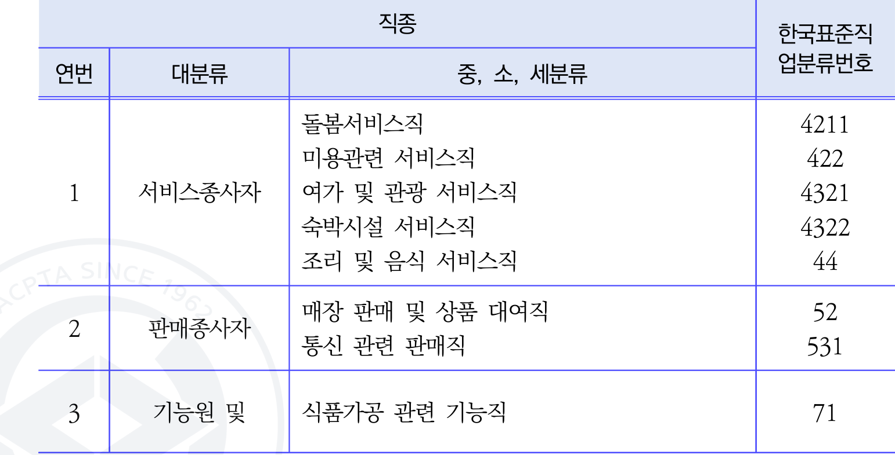

```markdown
| 연번 | 대분류     | 중, 소, 세분류               | 한국표준직업분류번호 |
|------|------------|------------------------------|----------------------|
| 1    | 서비스종사자 | 돌봄서비스직                 | 4211                 |
| 1    | 서비스종사자 | 미용관련 서비스직            | 422                  |
| 1    | 서비스종사자 | 여가 및 관광 서비스직        | 4321                 |
| 1    | 서비스종사자 | 숙박시설 서비스직            | 4322                 |
| 1    | 서비스종사자 | 조리 및 음식 서비스직        | 44                   |
| 2    | 판매종사자   | 매장 판매 및 상품 대여직     | 52                   |
| 2    | 판매종사자   | 통신 관련 판매직             | 531                  |
| 3    | 기능원 및   | 식품가공 관련 기능직         | 71                   |
```

<<SPLIT>>
elementId: 516
연말정산
세무
<<SPLIT>>
elementId: 517
98
<<SPLIT>>
elementId: 518
제1장 근로소득 연말정산(이론편)
<<SPLIT>>
elementId: 519
| 직종 | 직종 | 직종 | 한국표준직 업분류번호 |
| --- | --- | --- | --- |
| 연번 | 대분류 | 중, 소, 세분류 | 한국표준직 업분류번호 |
|  | 관련기능 종사자 | 섬유, 의복 및 가죽 관련 기능직 모재, 가구, 악기 및 간판관련 기능직 금속 성형 관련 기능직 운송 및 기계 관련 기능직 전기 및 전자 관련 기능직 정보통신 및 방송장비 관련 기능직 건설 및 채굴관련 기능직 기타 기능 관련직 | 72 73 74 75 76 77 78 79 |
| 4 | 장치, 기계조작 및 조립종사자 | 식품가공 관련 기계조작직 섬유 및 신발관련 기계조작직 화학 관련 기계 조작직 금속 및 비금속 관련 기계 조작직 기계제조 및 관련기계 조작직 전기 및 전자관련 기계 조작직 운전 및 운송관련직 상하수도 및 재활용 처리관련 기계 조작직 목재, 인쇄 및 기타기계 조작직 | 81 82 83 84 85 86 87 88 89 |
| 5 | 단순노무 종사자 | 건설및광업 관련 단순 노무직 운송 관련 단순 노무직 제조 관련 단순 노무직 청소 및 경비관련 단순 노무직 가사, 음식 및 판매관련 노무직 농림, 어엄 및 기타서비스 단순노무직 | 91 92 93 94 95 99 |
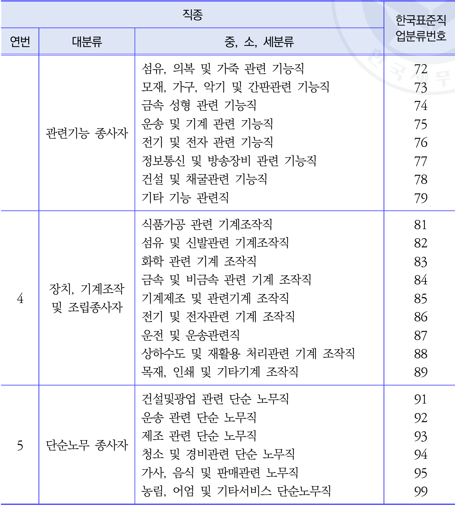

```markdown
| 연번 | 대분류                | 중, 소, 세분류                           | 한국표준직업분류번호 |
|------|-----------------------|------------------------------------------|----------------------|
|      | 관련기능 종사자       | 섬유, 의복 및 가죽 관련 기능직           | 72                   |
|      | 관련기능 종사자       | 모재, 가구, 악기 및 간판관련 기능직      | 73                   |
|      | 관련기능 종사자       | 금속 성형 관련 기능직                    | 74                   |
|      | 관련기능 종사자       | 운송 및 기계 관련 기능직                 | 75                   |
|      | 관련기능 종사자       | 전기 및 전자 관련 기능직                 | 76                   |
|      | 관련기능 종사자       | 정보통신 및 방송장비 관련 기능직         | 77                   |
|      | 관련기능 종사자       | 건설 및 채굴관련 기능직                  | 78                   |
|      | 관련기능 종사자       | 기타 기능 관련직                         | 79                   |
| 4    | 장치, 기계조작 및 조립종사자 | 식품가공 관련 기계조작직                 | 81                   |
| 4    | 장치, 기계조작 및 조립종사자 | 섬유 및 신발관련 기계조작직             | 82                   |
| 4    | 장치, 기계조작 및 조립종사자 | 화학 관련 기계 조작직                   | 83                   |
| 4    | 장치, 기계조작 및 조립종사자 | 금속 및 비금속 관련 기계 조작직         | 84                   |
| 4    | 장치, 기계조작 및 조립종사자 | 기계제조 및 관련기계 조작직             | 85                   |
| 4    | 장치, 기계조작 및 조립종사자 | 전기 및 전자관련 기계 조작직            | 86                   |
| 4    | 장치, 기계조작 및 조립종사자 | 운전 및 운송관련직                      | 87                   |
| 4    | 장치, 기계조작 및 조립종사자 | 상하수도 및 재활용 처리관련 기계 조작직 | 88                   |
| 4    | 장치, 기계조작 및 조립종사자 | 목재, 인쇄 및 기타기계 조작직           | 89                   |
| 5    | 단순노무 종사자       | 건설및광업 관련 단순 노무직             | 91                   |
| 5    | 단순노무 종사자       | 운송 관련 단순 노무직                   | 92                   |
| 5    | 단순노무 종사자       | 제조 관련 단순 노무직                   | 93                   |
| 5    | 단순노무 종사자       | 청소 및 경비관련 단순 노무직            | 94                   |
| 5    | 단순노무 종사자       | 가사, 음식 및 판매관련 노무직           | 95                   |
| 5    | 단순노무 종사자       | 농업, 어업 및 기타서비스 단순노무직     | 99                   |
```

<<SPLIT>>
elementId: 520
제
1장
근로소득
연말정산(이론편)
<<SPLIT>>
elementId: 521
나. 급여조건
<<SPLIT>>
elementId: 522
월정액급여 210만원 이하 + 직전연도 총금액 3,000만원 이하
<<SPLIT>>
elementId: 523
① 월정액급여
<<SPLIT>>
elementId: 524
월정액급여는 매월 직급별로 받는 봉급 · 급료 · 보수 · 임금 · 수당, 그 밖에 이
와 유사한 성질의 급여(해당 과세기간 중에 받는 상여 등 부정기적인 급여와
제12조에 따른 실비변상적 성질의 급여 및 제17조의4에 따른 복리후생적 성
<<SPLIT>>
elementId: 525
제2장
근로소득
연말정산(실전편)
제3장
연말정산
세액의
계산
제4장
근로소득자의
연말정산
후
4대보험
정산
<<SPLIT>>
elementId: 526
99
<<SPLIT>>
elementId: 527
질의 급여는 제외한다)의 총액에서 「근로기준법」에 따른 연장근로 · 야간근로
또는 휴일근로를 하여 통상임금에 더하여 받는 급여 및 「선원법」에 따라 받는
생산수당(비율급으로 받는 경우에는 월 고정급을 초과하는 비율급을 말한다)을
뺀 급여를 말한다(소득령 제17조 1항)
<<SPLIT>>
elementId: 528
[참고] 월정액급여의 계산
<<SPLIT>>
elementId: 529
= 월정액급여
+ 매월 급여총액31)
상여 등 부정기적 급여
실비변상적 성질의 급여
복리후생적 성질의 급여
연장근로수당, 야간근로수당 또는 휴일근로수당
선원법에 따라 받는 생산수당
<<SPLIT>>
elementId: 530
③ 급여 중 월정액급여에 포함 여부 검토
<<SPLIT>>
elementId: 531
| 월정액급여에 포함되는 급여 | 월정액급여에 포함되지 않은 급여 |
| --- | --- |
| ·매월 지급받는 봉급 · 급료 · 보수 · 임금 · 수당 기타 이와 유사한 성질의 급여 합계액 ·매월 정기적으로 받는 식사대 ·연간 상여금 지급총액을 급여 지급 시에 매 월 분할하여 지급받는 상여금 | ·부정기적으로 지급 받는 연월차수당 (통상적으로 매월 지급되는 급여에 해당되 는 때에는 월정액급여에 포함) ·매월 업무성과를 평가하고 실적 우수자를 선정, 지급약정에 의해 지급하는 상여금 ·국민연금법, 국민건강보험법, 공무원연금 법 등에 의한 사용자 부담금 ·다음의 복리후생적 성질의 급여 - 종업원 또는 비출자임원의 사택제공이익 - 중소기업 종업원이 주택(부수토지 포함) 의 구입, 임차에 소요되는 자금을 저리 또 는 무상으로 대여받음으로써 얻는 이익 - 종업원 등의 순수보장성 보험료(연 70만 원 이내)와 임직원 업무배상책임보험료 |
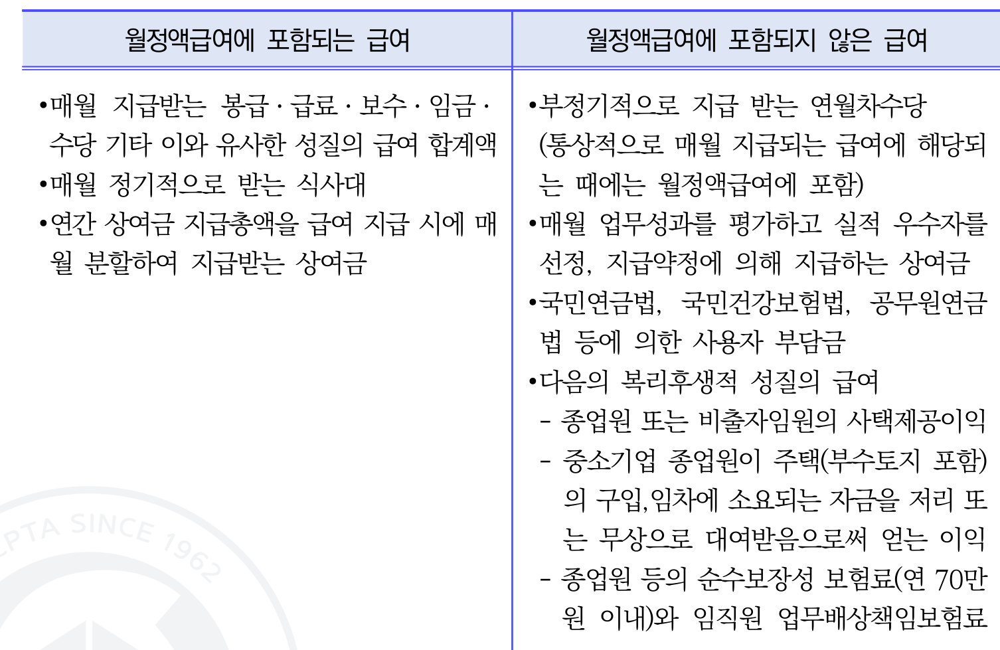

```markdown
| 월정액급여에 포함되는 급여                                                                 | 월정액급여에 포함되지 않은 급여                                                                                                                                                                                                 |
|------------------------------------------------------------------------------------------------|-------------------------------------------------------------------------------------------------------------------------------------------------------------------------------------------------------------------------------|
| • 매월 지급받는 봉급·급료·보수·임금·수당 기타 이와 유사한 성질의 급여 합계액                | • 부정기적으로 지급 받는 연월차수당 (통상적으로 매월 지급되는 급여에 해당되는 때에는 월정액급여에 포함)                                                                                                                       |
| • 매월 정기적으로 받는 식사대                                                                | • 매월 업무성과를 평가하고 실적 우수자를 선정, 지급약정에 의해 지급하는 상여금                                                                                                                                               |
| • 연간 상여금 지급총액을 급여 지급 시에 매월 분할하여 지급받는 상여금                        | • 국민연금법, 국민건강보험법, 공무원연금법 등에 의한 사용자 부담금                                                                                                                                                           |
|                                                                                                | • 다음의 복리후생적 성질의 급여                                                                                                                                                                                               |
|                                                                                                |   - 종업원 또는 비출자임원의 사택제공이익                                                                                                                                                                                     |
|                                                                                                |   - 중소기업 종업원이 주택(부속토지 포함)의 구입, 임차에 소요되는 자금을 저리 또는 무상으로 대여받음으로써 얻는 이익                                                                                                           |
|                                                                                                |   - 종업원 등의 순수보장성 보험료(연 70만원 이내)와 임직원 업무배상책임보험료                                                                                                                                                 |
```

<<SPLIT>>
elementId: 532
연말정산
세무
<<SPLIT>>
elementId: 533
31) 매월 지급받는 봉급,급료,보수,임금,수당 기타 이와 유사한 성질의 급여 합계액
<<SPLIT>>
elementId: 534
100
<<SPLIT>>