elementId: 0
196
<<BLOCKEND>>
elementId: 1
제1장 근로소득 연말정산(이론편)
<<BLOCKEND>>
elementId: 2
| 월정액급여에 포함되는 급여 | 월정액급여에 포함되지 않은 급여 |
| --- | --- |
|  | (고의 또는 중과실 제외) - 공무원의 공무수행관련 연 240만원이내 의 상금과 부상 ·다음의 실비변상적 성질의 급여 - 일직료, 숙직료 또는 여비로서 실비변상 정도의 금액 - 자가운전보조금 중 월 20만원 이내의 금 액 - 연구보조비 또는 연구활동비 중 월 20만 원 이내의 금액 - 근로자가 천재지변 기타 재해로 받는 금 액 - 기타 실비변상적인 금액 |
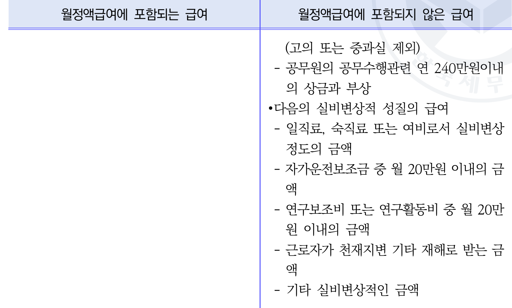
<<BLOCKEND>>
elementId: 3
[참고] 야간근로수당 등의 비과세 대상 급여기준 적용방법32)
<<BLOCKEND>>
elementId: 4
월정액급여 = 급여의 총액 - 야간근로 수당 등
<<BLOCKEND>>
elementId: 5
1. 급여의 총액은 매월 지급받는 봉급,급료,보수, 임금,수당 기타 이와 유사한 성질의 급여의
합계액(다만, 상여 등 부정기적인 급여와 실변상적, 복리후생적 급여는 제외
2. 비과세되는 식사대는 실비변상적인 급여에 해당하지 아니하므로 월정액 계산시 차감하지
않도록 주의한다.
3. 비과세되는 자가운전보조금, 연구보조비 등은 실비변상적인 급여에 해당하므로 월정액 계
산시 차감하여야 한다.
4. 상여금을 매월 급여항목에서 지급받는 경우에는 월정액급여 계산시 차감하지 아니함(상여
금지급규정에 의해 2개월에 한번씩 지급받는 상여금은 부정기적인 급여에 해당)
5. 야간근로수당 등 크기가 매월 변동되더라도 매월 계산되는 급여항목인 경우에는 급여총액
에 포함
6. 임금협상결과 1월분부터 소급인상하기로 함에 따라 이미 지급된 급여와 인상금액과의 차
액을 소급하여 지급하는 경우 월정액급여의 계산은 1월분부터 인상된 금액으로 재계산
<<BLOCKEND>>
elementId: 6
제
1장
근로소득
연말정산(이론편)
<<BLOCKEND>>
elementId: 7
제2장
근로소득
연말정산(실전편)
<<BLOCKEND>>
elementId: 8
제3장
연말정산
세액의
계산
제4장
근로소득자의
연말정산
후
4대보험
정산
<<BLOCKEND>>
elementId: 9
101
<<BLOCKEND>>
elementId: 10
다. 비과세 소득 및 한도33)
<<BLOCKEND>>
elementId: 11
① 근로기준법에 따른 연장근로, 야간근로 또는 휴일근로를 하여 통상임금에 더
하여 받는 급여 중 연 240만원 이하의 금액은 비과세(광산근로자 및 일용근
로자는 전액 비과세)34)
② 어선에 승무하는 선원(선장 제외)의 경우 선원법에 의하여 받는 생산수당(비율
급으로 받는 경우 월 고정급을 초과하는 비율급) 중 연 240만원 이내의 금액
비과세
<<BLOCKEND>>
elementId: 12
[참고] 계산사례
<<BLOCKEND>>
elementId: 13
직전연도 총급여가 3,000만원 이하인 제조업 생산직 근로자의 월정액 급여와 연장근로수당
등의 비과세 여부는?
<<BLOCKEND>>
elementId: 14
6만원
<<BLOCKEND>>
elementId: 15
① 기본급 140만원 ② 가족수당(매월)
③ 식대(현물제공 없음) 13만원 ④ 연장근로수당
⑤ 야간근로수당 10만원 ⑥ 휴일근로수당
⑦ 자기차량운전보조금 20만원 ⑧ 상여(부정기)
<<BLOCKEND>>
elementId: 16
10만원
<<BLOCKEND>>
elementId: 17
5만원
<<BLOCKEND>>
elementId: 18
☞ 월정액 급여 159만원*으로 연장근로수당 등(25만원)에 대해 비과세 적용
<<BLOCKEND>>
elementId: 19
100만원
<<BLOCKEND>>
elementId: 20
*159만원 = 304만원(①~⑧ 합계) - 100만원(⑧부정기적 상여) - 20만원(⑦실비변상적
급여) - 25만원(④~⑥연장 · 야간 · 휴일수당)
<<BLOCKEND>>
elementId: 21
※ 식대는 실비변상적인 급여가 아니므로 월정액급여 계산 시 포함
<<BLOCKEND>>
elementId: 22
7) 근로자가 사내급식이나 이와 유사한 방법으로 제공받는 식사 기타 음식물 또는 근로
자가 받는 월 20만원 이하의 식대
<<BLOCKEND>>
elementId: 23
① 현물식사
근로자가 사내급식 등 사용자가 무상으로 제공하는 음식물로서 통상적으로 급
여에 포함되지 아니하고 음식물 제공여부로 급여에 차등을 두지 아니하며 사
용자가 추가부담하여 제공하는 음식물은 비과세한다.
<<BLOCKEND>>
elementId: 24
연말정산
세무
<<BLOCKEND>>
elementId: 25
32) 2023년 연말정산 신고안내(국세청 발간책자, p62 발췌)
33) 생산직 일용근로자가 근로기준법에 의한 연장 · 야간 · 휴일근로로 인해 받는 급여는 월정액급여에 관계
없이 비과세됨(소득 46011 - 2615, 1997.10.10.)
34) 월정액급여 210만원을 초과하는 달에 받는 연장, 야간 또는 휴일근로수당(주휴수당 포함)은 모두 과세
<<BLOCKEND>>
elementId: 26
102
<<BLOCKEND>>
elementId: 27
196
<<BLOCKEND>>
elementId: 28
제1장 근로소득 연말정산(이론편)
<<BLOCKEND>>
elementId: 29
② 식사대
<<BLOCKEND>>
elementId: 30
식사, 기타 음식물을 제공받지 아니하는 근로자가 받는 월 20만원 이하 식사대
는 비과세 근로소득이다.
<<BLOCKEND>>
elementId: 31
[참고] 비과세 식사대
<<BLOCKEND>>
elementId: 32
1. 식사대가 연봉계약서에 포함되어 있고, 회사의 사규 또는 급여지급기준 등에 지급기준이
정해져 있을 것
2. 근로자가 2 이상의 회사에 근무하면서 식사대를 매월 각 회사로부터 지급받는 경우 각 회
사로부터 받은 식사대를 합한 금액 중 월 20만원 이내 금액만 비과세
3. 식사 · 기타 음식물을 제공받고 있는 근로자가 별도로 식사대를 지급받는 경우에는 식사·
기타 음식물에 한하여 비과세되는 급여로 본다.
4. 회사로부터 음식물을 제공받지 아니하고 식사대로 매월 25만원을 지급받는 경우 20만원은
비과세하고 5만원은 과세한다.
<<BLOCKEND>>
elementId: 33
8) 근로자 또는 그 배우자의 출산이나 6세 이하(해당 과세기간 개시일을 기준으로 판단)
자녀의 보육과 관련하여 사용자(종교관련종사자의 경우 소속단체)로부터 받는 급여
로서 월 20만원 이내의 금액
<<BLOCKEND>>
elementId: 34
[필수] 출산보육 수당 비과세
<<BLOCKEND>>
elementId: 35
1. 6세 이하의 자녀 2인 이상을 둔 경우에도 자녀수에 상관없이 월 20만원 이내의 금액을 비
과세(서면1팀-567, 2006.05.01.)
2. 사용자가 분기마다 보육수당을 지급하거나 소급해서 수개월분을 일괄지급하는 경우 지급월
에 20만원 이내의 금액만 비과세(서면1 팀-276, 2007.2.23.)
3. 맞벌이 부부가 6세 이하의 자녀 1인에 대하여 각 근무처로부터 보육수당을 수령하는 경우
각각 월 20만원 이내의 금액 비과세(서면1팀-1245, 2006.09.12.)
4. 자녀보육수당이 연봉계약서에 포함되어 있고 회사의 사규 또는 연봉지급기준 등에 의하여
자녀보육수당에 대한 지급기준이 정하여져 있는 경우로서 그 지급사실이 확인되는 경우에
는 월 20만원 이내의 금액이 비과세됨(사전법령 해석소득2018-193, 2018.06.28.).
5. 사용자가 근로자의 6세 이하 자녀의 교육비를 실비로 지원하는 금액 중 월 10만원 이내의
금액을 비과세한 경우에도 같은 종합소득공제 중 교육비공제를 받을 수 있는 것임(원천
-451, 2010.06.01.)
6. 근로자 또는 그 배우자의 출산이나 6세 이하 자녀의 보육과 관련하여 사용자로부터 지급
<<BLOCKEND>>
elementId: 36
제2장
근로소득
연말정산(실전편)
<<BLOCKEND>>
elementId: 37
제
1장
근로소득
연말정산(이론편)
<<BLOCKEND>>
elementId: 38
제3장
연말정산
세액의
계산
제4장
근로소득자의
연말정산
후
4대보험
정산
<<BLOCKEND>>
elementId: 39
103
<<BLOCKEND>>
elementId: 40
받는 급여로서 월 20만원 이내의 금액은 비과세대상 근로소득에 해당하는 것이나 매월 지
급받는 금액 중 월 20만원을 초과하는 금액은 과세대상 근로소득에 해당하는 것임(서면1
팀-1058, 2005.09.06.)
<<BLOCKEND>>
elementId: 41
7. 사내근로복지기금에서 과세대상 소득에 해당되지 않는 자녀양육비를 지원받는 근로자가 6
세 이하의 자녀 보육과 관련하여 사용자한테 받는 급여로서 월 20만원 이내의 금액은 비
과세 소득에 해당하는 것임.(원천-450. 2010.06.01.)
<<BLOCKEND>>
elementId: 42
9) 임직원의 직무발명보상금
<<BLOCKEND>>
elementId: 43
발명진흥법 제2조 제2호에 따른 직무발명으로 받는 보상금으로서 연 700만원 이하
의 금액에 대해 비과세한다.
<<BLOCKEND>>
elementId: 44
① 대상
<<BLOCKEND>>
elementId: 45
가. 종업원(임원 포함)이 사용자등으로부터 받는 보상금. 다만 종업원등이 지급한
사용자등과 특수관계에 있는 경우에는 제외한다.
나. 대학의 교직원 또는 대학과 고용관계가 있는 학생이 소속대학에 설치된 산학
협력단으로부터 받는 보상금
<<BLOCKEND>>
elementId: 46
② 보상한도
연간 700만원 한도(근로소득 및 기타소득 포함)
<<BLOCKEND>>
elementId: 47
[참고] 직무발명의 보상내용(발명진흥법 제15조 1항)
<<BLOCKEND>>
elementId: 48
1. 종업원등이 직무발명에 대한 특허 등을 받을수 있는 권리에 대한 보상
2. 종업원등이 직무발명에 대한 특허권 등을 사용자 등에게 승계함에 대한 보상
3. 종업원등이 특허권등을 전용실시권을 설정해준 경우에 대한 보상
<<BLOCKEND>>
elementId: 49
[참고] 직무발명보상금 비과세 관련 주의사항
<<BLOCKEND>>
elementId: 50
연말정산
<<BLOCKEND>>
elementId: 51
1. 종업원 등이 그 직무에 관하여 발명한 것이 특허권, 실용신안권 등으로서 사용자등의 업무
범위에 속하고 그 발명행위가 종업원 등의 현재 또는 과거의 직무에 속하는 발명인 경우 그
발명에 대해 정당하게 지급된 직무발명보상금은 그 발명이 외국에서 특허 등이 등록되는 경
우에도 연 700만원 이내에서 비과세하는 것임(사전법령해석소득2020-363, 2020.08.05.)
<<BLOCKEND>>
elementId: 52
세무
<<BLOCKEND>>
elementId: 53
104
<<BLOCKEND>>
elementId: 54
제1장 근로소득 연말정산(이론편)
<<BLOCKEND>>
elementId: 55
2. 대학교 교직원이 아닌 근로계약을 체결하지 아니한 참여연구원이 지급받는 보상금은 비과
세 직무발명보상금에 해당하지 아니합(서면법령해석소득2016-6175, 2017.06.29.)
3. 소속대학에 설치된 산학협력단이 대학의 교직원에게 지급하는 보상금은 산학협력단이 원천
징수해야 하는 것임(사전법령해석소득2017-125, 2017.04.27.)
4. 소득세법상 비과세되는 직무발명보상금은 임원이 지급받는 보상금도 포함되는 것임(서면소
득 2016-703, 2016.11.21.)
<<BLOCKEND>>
elementId: 56
10) 국외근로자에 대한 비과세
<<BLOCKEND>>
elementId: 57
국외 또는 남북교류협력에 관한법률에 따른 북한지역(이하 "국외 등")에서 근로를 제
공하고 받는 급여(그 근로의 대가를 국내에서 받는 경우 및 일용직 포함) 중 다음의
급여는 비과세한다(소득법 제12조 3호 거).
<<BLOCKEND>>
elementId: 58
① 월 500만원 한도
<<BLOCKEND>>
elementId: 59
가. 원양어업선박 또는 국외 등을 항행하는 선박에서 근로를 제공하는 자
나. 국외 등의 건설현장35)에서 근로를 제공하는 자(설계 및 감리업무 수행자 포함)
② 공무원(「 외무공무원법」 제32조에 따른 재외공관 행정직원과 이와 유사한 업무를
수행하는 사람으로서 기획재정부장관이 정하여 고시하는 사람을 포함한다), 「대
한무역투자진흥공사법」에 따른 대한무역투자진흥공사, 「한국관광공사법」에 따른
한국관광공사, 「한국국제협력단법」에 따른 한국국제협력단, 「한국국제보건의료재
단법」에 따른 한국국제보건의료재단 및 「한국산업인력공단법」에 따른 한국산업인
력공단의 종사자가 국외등에서 근무하고 받는 수당 중 해당 근로자가 국내에서
근무할 경우에 지급받을 금액상당액을 초과하여 받는 금액 중 실비변상적 성격의
급여로서 외교부장관이 기획재정부장관과 협의하여 고시하는 금액
<<BLOCKEND>>
elementId: 60
③ 월 100만원 한도
<<BLOCKEND>>
elementId: 61
가. 남북교류협력에관한법률에 따른 북한지역에서 근무하는 근로자36)
나. 기타 국외근무 근로자(국외 등을 항행하는 항공기의 근로자 포함)37)
<<BLOCKEND>>
elementId: 62
35) 국외 등의 건설현장 등은 국외 등의 건설공사 현장과 그 건설공사를 위하여 필요한 장비 및 기자재의
구매, 통관, 운반, 보관, 유지/보수등이 이루어지는 장소를 포함한다.
36) 근로자가 북한지역에서 근무함으로써 발생하는 근로소득은 남북사이의소득에 대한 이중과세방지합의서
제22조에 의하여 세금이 면제됨.
<<BLOCKEND>>
elementId: 63
제
1장
근로소득
연말정산(이론편)
<<BLOCKEND>>
elementId: 64
제2장
근로소득
연말정산(실전편)
제3장
연말정산
세액의
계산
제4장
근로소득자의
연말정산
후
4대보험
정산
<<BLOCKEND>>
elementId: 65
105
<<BLOCKEND>>
elementId: 66
1962
<<BLOCKEND>>
elementId: 67
[참고] 국외근로소득 해당여부
<<BLOCKEND>>
elementId: 68
1. 국외 또는 남북교류협력에 관한 법률에 의한 북한지역에서 근로를 제공하고 받는 보수는
해외 또는 북한지역에서 주재하면서 근로를 제공하고 받는 급여를 말하며 출장, 연수 등을
목적으로 출국한 기간동안의 급여상당액은 국외근로소득으로 보지 아니한다(소득법 기본통
칙 12-16···1).
2. ① 선원법에 따라 승선중인 선원에게 공급하는 식료에 대해서는 비과세되는 것이나, 휴가
기간 동안에 지급받는 급식비는 이에 포함되지 아니한다.
② 외항선원이 유급휴가기간 동안에 지급받는 급여도 국외에서 근무를 제공하고 받는 보수
로서 500만원까지는 소득세가 과세되지 않는다.
3. ① 국외 등의 건설현장에서 근로를 제공하고 받는 보수 중 월 500만원 이내 금액을 비과세
하는 근로자는 건설관련 기능직, 건설 단순 종사원, 감리, 설계업무 수행자에 한하므로
국외 건설현장의 각종 지원업무를 수행하는 근로자는 월 100만원 이내 금액을 비과세
② 해외지사에서 근무하는 거주자가 국외 등의 건설현장 등을 위한 영업업무, 인사노무업
무, 자재관리업무, 재무회계업무, 기타 공통 사무업무 등에 종사하고 받는 보수 중 월
100만원 이내의 금액을 비과세(서면법규과-1552, 2012.12.28.)
4. 해당 선박에서 근로를 제공하고 받는 보수 중 비과세되는 급여는 당해 승무원이 북한지역을
항행하는 기간의 근로에 대하여 지급받는 급여에 한하여 적용(서면1팀-489, 2007.04.16.)
<<BLOCKEND>>
elementId: 69
11) 근로장학금
<<BLOCKEND>>
elementId: 70
교육기본법 제28조 제1항에 따라 받는 장학금 중 대학생이 근로를 대가로 지급받는
장학금으로서 「고등교육법」 규정에 따른 대학에 재학하는 대학생에 한한다.
<<BLOCKEND>>
elementId: 71
12) 사용자가 적립한 종업원의 퇴직급여
<<BLOCKEND>>
elementId: 72
퇴직급여로 지급되기 위하여 적립되는 급여는 근로소득에 포함하지 아니하며, 이때
퇴직급여 지급을 위해 적립되는 급여란 근로자가 적립금액 등을 선택할 수 없는 것
으로서 아래의 요건을 모두 충족하는 방법으로 적립하는 것을 말한다.
<<BLOCKEND>>
elementId: 73
① 퇴직급여제도의 가입 대상이 되는 근로자(임원을 포함) 전원이 적립할 것. 다만,
각 근로자가 다음 어느 하나에 해당하는 날에 향후 적립하지 아니할 것을 선택
할 수 있는 것이어야 한다.
<<BLOCKEND>>
elementId: 74
가. 사업장에 적립방식(적립할 때 근로자가 적립 금액을 임의로 변경할 수 없는
<<BLOCKEND>>
elementId: 75
연말정산
세무
<<BLOCKEND>>
elementId: 76
37) 출장 연수 등을 목적으로 출국한 기간 동안의 급여 상당액은 국외근로소득으로 보지 아니한다.
<<BLOCKEND>>
elementId: 77
106
<<BLOCKEND>>
elementId: 78
제1장 근로소득 연말정산(이론편)
<<BLOCKEND>>
elementId: 79
적립 방식)이 최초로 설정되는 날(해당 사업장에 최초로 근무하게 된 날에
적립방식이 이미 설정되어 있는 경우에는 최초로 퇴직급여제도의 가입 대상
이 되는 날을 말함)
<<BLOCKEND>>
elementId: 80
나. 적립방식(적립할 때 근로자가 적립 금액을 임의로 변경할 수 없는 적립 방식)
이 변경되는 날
<<BLOCKEND>>
elementId: 81
② 적립할 때 근로자가 적립 금액을 임의로 변경할 수 없는 적립 방식을 설정하고
그에 따라 적립할 것
<<BLOCKEND>>
elementId: 82
③ 적립방식이 「근로자퇴직급여 보장법」 제6조 제2항에 따른 퇴직연금규약, 같은
법 제19조 제1 항에 따른 확정기여형퇴직연금규약 또는 「과학기술인공제회법」 제
16조의2에 따른 퇴직연금급여사업을 운영하기 위하여 과학기술인공제회와 사용
자가 체결하는 계약에 명시되어 있을 것
<<BLOCKEND>>
elementId: 83
④ 사용자가 「소득세법 시행령」 제40조의2 제1항 제2호 가목 및 다목의 퇴직연금
계좌에 적립할 것
<<BLOCKEND>>
elementId: 84
04 조세특례제한법상 근로소득 특례
<<BLOCKEND>>
elementId: 85
(1) 벤처기업 주식매수선택권 행사이익 비과세
<<BLOCKEND>>
elementId: 86
벤처기업(벤처기업이 30% 이상을 인수한 기업 포함) 임원과 종업원(이하 "임원등")이
2024년 12월 31일 이전에 「벤처기업육성에 관한 특별조치법」 및 「상법」 제340조의2
또는 제542조의3(코넥스상장기업으로부터 부여받은 경우로 한정)에 따라 부여받은 주식
매수선택권을 행사함으로써 얻는 이익38) 중 연간 2억원 이내의 금액은 소득세를 과세
하지 아니한다. 다만, 벤처기업별 총누적 금액은 5억원을 초과하지 못한다(조특법 제16
조의2).
<<BLOCKEND>>
elementId: 87
1) 적용금액
<<BLOCKEND>>
elementId: 88
① 2021.12.31.이전 행사분 : 연간 3천만원 비과세
<<BLOCKEND>>
elementId: 89
38) 주식매수선택권 행사당시의 시가와 실제 매수가액과의 차액(주식에는 신주인수권 포함)
<<BLOCKEND>>
elementId: 90
제2장
근로소득
연말정산(실전편)
제3장
연말정산
세액의
계산
제4장
근로소득자의
연말정산
후
4대보험
정산
<<BLOCKEND>>
elementId: 91
제
1장
근로소득
연말정산(이론편)
<<BLOCKEND>>
elementId: 92
107
<<BLOCKEND>>
elementId: 93
② 2022.12.31. 이전 행사분 : 연간 5천만원 비과세
③ 2023.01.01. 이후 행사분 : 연간 2억원 비과세
<<BLOCKEND>>
elementId: 94
(2) 벤처기업 주식매수선택권 행사이익 납부특례
<<BLOCKEND>>
elementId: 95
벤처기업(벤처기업이 30% 이상을 인수한 기업 포함)의 임직원이 2024년 12월 31일
이전에 부여받은 주식매수선택권을 행사함으로써 발생한 벤처기업 주식매수선택권 행사
이익(조특법 16조의2 비과세 금액을 제외)에 대한 소득세는 원천징수하지 않는 방법으
로 납부할 수 있다(조특법 제16조의3).
<<BLOCKEND>>
elementId: 96
1) 납부특례 방법
<<BLOCKEND>>
elementId: 97
① 벤처기업(벤처기업이 30% 이상을 인수한 기업 포함) 임원 등이 원천징수의무자
에게 주식매수선택권 행사이익에 대한 납부특례의 적용을 신청한 경우 소득세39)
를 원천징수하지 아니한다(단, 현금으로 받은 경우 제외).
② 납부특례를 신청한 경우, 임원 등은 주식매수선택권을 행사한 날이 속하는 과세
기간의 종합소득세를 확정신고 · 납부할 때 주식매수선택권 행사이익을 포함하여
종합소득 과세표준을 신고한다.
③ 주식매수선택권 행사이익 관련 소득세액의 5분의 4(2016년 이전 부여분은 3분
의 2) 해당 금액(분할납부세액)을 제외하고 납부할 수 있다.
④ 이후, 벤처기업 임원 등은 주식매수선택권 행사일이 속하는 과세기간의 다음 4개
연도(2016년 이전 부여분은 2개 연도) 종합소득세 확정신고를 할 때 분할납부세
액의 4분의 1(2016년 이전분 2분의 1) 해당액을 각각 납부하여야 한다.
<<BLOCKEND>>
elementId: 98
(3) 벤처기업 주식매수선택권 양도소득세 과세 선택
<<BLOCKEND>>
elementId: 99
벤처기업(벤처기업이 30% 이상을 인수한 기업 포함)의 임직원이 적격스톡옵션을 행사시
근로소득 또는 기타소득으로 과세하지 아니하고 양도 시 양도소득세(2025년부터는 금융
투자소득세)로 과세 선택이 가능하다. (조특법 제16조의14 ②항)
<<BLOCKEND>>
elementId: 100
② 적격스톡옵션요건 : 벤처기업 육성에 관한 특별조치법에 따른 2024년 12월 31일 이
<<BLOCKEND>>
elementId: 101
연말정산
세무
<<BLOCKEND>>
elementId: 102
39) 주식매수선택권을 퇴사 전에 행사하여 얻는 이익은 근로소득세, 퇴사 후에 행사하여 얻는 이익에 대해
서는 기타소득세로 원천징수
<<BLOCKEND>>
elementId: 103
108
<<BLOCKEND>>
elementId: 104
196
<<BLOCKEND>>
elementId: 105
제1장 근로소득 연말정산(이론편)
<<BLOCKEND>>
elementId: 106
전 부여받은 주식매수선택권으로 행사일이 속하는 과세기간 포함 3년간 누적 행사가액
이 5억원 이하인 것
<<BLOCKEND>>
elementId: 107
1) 신청 및 요건
<<BLOCKEND>>
elementId: 108
① 적격스톡옵션요건
<<BLOCKEND>>
elementId: 109
가. 벤처기업육성에 관한 특별조치법 제16조의3에 따른 주식매수선택권으로서 다
음의 요건을 갖출 것
<<BLOCKEND>>
elementId: 110
ⓐ 벤처기업이 주식매수선택권을 부여하기 전에 주식매수선택권의 수량, 매
수가액, 대상자 및 기간 등에 관하여 주주총회의 결의를 거쳐 벤처기업
임직원과 약정할 것
<<BLOCKEND>>
elementId: 111
ⓑ ⓐ에 따른 주식매수선택권을 다른사람에게 양도할 수 없을 것
<<BLOCKEND>>
elementId: 112
ⓒ 사망, 정년 등 기획재정부령이 정하는 불가피한 사유가 있는 경우를 제
외하고는 벤처기업육성에 관한 특별조치법 제16조의3 제1항에 따른 주
주총회의 결의가 있는 날부터 2년 이상 해당 법인에 재임 또는 재직한
후에 주식매수선택권을 행사할 것
<<BLOCKEND>>
elementId: 113
나. 해당 벤처기업으로부터 부여받은 주식매수선택권의 행사일부터 역산하여 2년
이 되는 날이 속하는 과세기간부터 해당 생사일이 속하는 과세기간까지 전체
행사가액의 합께액이 5억원 이하일 것)
<<BLOCKEND>>
elementId: 114
② 벤처기업 임직원이 금융투자업자에게 옵션행사일 전에 주식매수선택권 전용계좌
를 개설하고, '특례적용신청서' 등을 벤처기업에 제출한다.
<<BLOCKEND>>
elementId: 115
③ 제출받은 벤처기업은 주식매수선택권 행사로 지급하는 주식을 주식매수선택권 전
용계좌로 입고하고 주식매수선택권 행사주식지급명세서와 특례적용 대상 명세서
를 주식매수선택권을 행사한 날이 속하는 달의 다음 달 10일까지 원천징수 관할
세무서장에게 제출하여야 한다(조특령 제14조의4, 2항, 3항).
<<BLOCKEND>>
elementId: 116
제3장
연말정산
세액의
계산
제4장
근로소득자의
연말정산
후
4대보험
정산
<<BLOCKEND>>
elementId: 117
제
1장
근로소득
연말정산(이론편)
<<BLOCKEND>>
elementId: 118
제2장
근로소득
연말정산(실전편)
<<BLOCKEND>>
elementId: 119
109
<<BLOCKEND>>
elementId: 120
[참고] 주식매수선택관 해석사례
<<BLOCKEND>>
elementId: 121
1. 주식매수선택권 전용계좌로 일반주식을 거래하는 경우 과세특례적용이 배제되어 소득세과
과세될 경우 귀속시기는 주식매수선택권을 행사한 날이 속하는 과세연도임(사전법규소득
2021-537, 2022.5.17.)
2. 벤처기업이 아닌 기업으로부터 부여받은 주식매수선택권을 행사함으로써 발생한 주식매수
선택권 행사이익에 대해서는 조특법 제16조의3에 따른 벤처기업 주식매수선택권 행사이익
납부특례를 적용받을 수 없는 것임(사전법령해석소득2020-1296, 2021.03.08.).
3. 벤처기업육성에 관한 특별조치법 제2조 1항에 따른 벤처기업으로부터 주식매수선택권을
부여받았으나 이를 행사할 때 그 주식매수선택권의 부여법인이 벤처기업에 해당하지 않게
되었다 하더라도 요건충족시 해당특례를 적용받을 수 있는 것임(서면법령해석소득2021-
3480, 2021.08.31.)
4. 조세특례제한법 제16조의 2에 따른 벤처기업 주식매수선택권 행사이익 비과세 특례적용명
세서를 기한내 미제출시에도 요건을 충족하면 공제 가능합(사전법령해석소득2021-1341,
2021.10.27.)
<<BLOCKEND>>
elementId: 122
(5) 외국인 근로자에 대한 과세특례 (조특법 제18조의 2)
<<BLOCKEND>>
elementId: 123
외국인근로자(외국인인 임원 또는 사용인으로써 일용근로자는 제외)가 2026년 12월 31
일 이전40)까지 국내에서 근무함으로써 받는 근로소득으로 국내에서 최초로 근로를 제공
한 날부터 20년(2023년 1월 1일 이전에 특례를 적용받고 있거나, 적용받은 경우에도
적용) 이내에 끝나는 과세기간까지 받는 근로소득에 대한 소득세를 해당 근로소득에
19%를 곱한 금액을 세액으로 할 수 있다(조특법 18조의2 2항).
<<BLOCKEND>>
elementId: 124
연말정산
세무
<<BLOCKEND>>
elementId: 125
40) 외국인근로자가 외국인투자촉진법에 따라 다국적기업의 지역본부를 국내에 설립한 회사에 근무할 경우
에는 기한에 관계없이 적용가능하다.
<<BLOCKEND>>
elementId: 126
110
<<BLOCKEND>>
elementId: 127
제1장 근로소득 연말정산(이론편)
<<BLOCKEND>>
elementId: 128
05 근로소득의 수입금액 계산
<<BLOCKEND>>
elementId: 129
(1) 급여를 금전으로 지급하는 경우
<<BLOCKEND>>
elementId: 131
| 구 분 | 적용 환율 기준일 | 적용환율 |
| --- | --- | --- |
| 정기급여일 전에 지급받는 경우 | 지급받는 날 | 외국환거래법에 의한 기준환율 또는 재정환율41) |
| 정기급여일 이후에 지급바는 경우 | 정기 급여일 | 외국환거래법에 의한 기준환율 또는 재정환율41) |
**근로자에게 급여를 금전으로 지급하는 경우에는 해당 금전가액이 근로소득이 되며 근로소득을 외화로 지급하는 경우에는 지급시기에 따라 다음과 같이 계산한 금액을 근로소득으로 본다(소득칙 16조).**
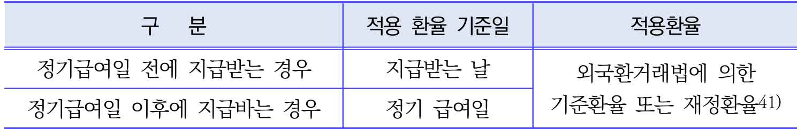
<<BLOCKEND>>
elementId: 132
(2) 급여를 금전 외의 것으로 지급받는 경우
<<BLOCKEND>>
elementId: 133
금전외의 것을 지급받을 때에는 그 수입금액을 그 거래 당시의 가액의 의하여 계산하되
그 거래당시의 가액은 다음의 금액으로 한다(소득령 제51조 5항).
<<BLOCKEND>>
elementId: 134
① 제조업자, 생산업자 또는 판매업자로부터 그 제조, 생산 또는 판매하는 물품을 인도
받은 때에는 그 제조업자, 생산업자 또는 판매업자의 판매가액
② 제조업자, 생산업자 또는 판매업자가 아닌 자로부터 물품을 인도받은 때에는 시가
③ 이익배당으로 받은 주식은 그 액면가액
④ 법인으로부터 이익배당으로 신주인수권을 받은 때(주주로서 받은 경우 제외)에는 신
주인수권에 의하여 납입한 날의 신주가액42)에서 당해 신주의 발행가액을 공제한금액
<<BLOCKEND>>
elementId: 135
(3) 급여가 변동되는 경우
<<BLOCKEND>>
elementId: 136
1) 급여삭감 : 삭감 후의 급여
2) 노사합의에 따른 급여삭감
① 삭감 후 금액 인건비 처리 : 삭감 후의 금액(재소득 46073-13, 1998.4.1.)
② 총액 인건비 계상 후 채무면제익 처리 : 삭감 전 금액으로 원천징수
<<BLOCKEND>>
elementId: 137
41) 서울외국환중개(주) 홈페이지(www.smbs.biz)의 메뉴 중 [환율조회]에서 확인
42) 신주가액이 그 납입한 날의 다음 날 이후 1월내에 하락한 때에는 그 최저가액을 신주가액으로 함.
<<BLOCKEND>>
elementId: 138
제3장
<<BLOCKEND>>
elementId: 139
연말정산
<<BLOCKEND>>
elementId: 140
세액의
<<BLOCKEND>>
elementId: 141
계산
<<BLOCKEND>>
elementId: 142
제2장
근로소득
연말정산(실전편)
<<BLOCKEND>>
elementId: 143
제4장
근로소득자의
연말정산
후
4대보험
정산
<<BLOCKEND>>
elementId: 144
111
<<BLOCKEND>>
elementId: 145
제
1장
근로소득
연말정산(이론편)
<<BLOCKEND>>
elementId: 146
06 근로소득의 수입시기 (귀속시기)
<<BLOCKEND>>
elementId: 147
(1) 의의
<<BLOCKEND>>
elementId: 148
근로소득의 귀속연도는 근로소득의 수입시기에 해당하는 날이 속하는 과세연도를 말하며
수입시기에 따라 해당연도의 연말정산 대상 근로소득이 정해진다. 즉, 수입시기는 근로
소득의 귀속연도를 결정하는 기준이 되는 시기를 말한다(소득령 제49조).
<<BLOCKEND>>
elementId: 149
(2) 근로소득별 수입시기
<<BLOCKEND>>
elementId: 150
| 근로소득 구분 | 수입시기 | 귀속연도 |
| --- | --- | --- |
| 급 여 | 근로를 제공한 날 | 근로제공일이 속한 연도 |
| 잉여금처분에 의한 상여 | 해당 법인의 잉여금처분일 | 처분결의일이 속한 연도 |
| 인정상여43) | 해당 사업연도 중 근로를 제 공한 날 | 법인의 결산 사업연도 * 이 경우 2개 연도에 걸친 때 는 각각 해당 사업연도 |
| 근로소득으로 보는 임원퇴직소득금액 한도초과액 | 지급받거나 지급받기로 한 날 | 지급받거나 지급받기로 한 연 도 |
| 부당해고기간 급여 | 법원의 판결 · 화해 등에 의하 여 부당해고기간의 급여를 일 시에 지급받는 경우에는 해고 기간에 근로를 제공하고 지급 받는 것으로 봄 | 해고기간이 속하는 연도 |
| 급여를 소급인상하여 지급한 경우 | 근로를 제공한 날 | 근로제공일이 속하는 연도 |
| 기업이 우수한 인재를 스카우트하기위해 연봉외에 지급하는 사이닝보너스 | 근로기간동안 안분 | 계약조건에 따른 근로기간동 안 안분하여 속하는 연도 |
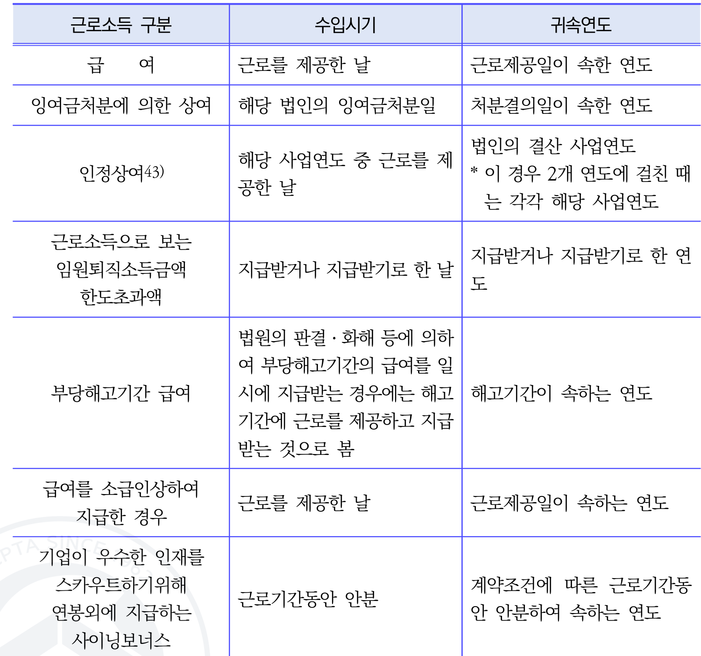
<<BLOCKEND>>
elementId: 151
연말정산
세무
<<BLOCKEND>>
elementId: 152
112
<<BLOCKEND>>
elementId: 153
제1장 근로소득 연말정산(이론편)
<<BLOCKEND>>
elementId: 154
| 근로소득 구분 | 수입시기 | 귀속연도 |
| --- | --- | --- |
| 근로기준법에 따른 연차 유급휴가일에 근로를 제공하고 받는 연차수당 | 소정의 근로일수를 개근한 연 도의 다음연도 |  |
| 노사합의에 따라 퇴직 후 일정기간 동안 회사로부터 지급받는 자녀학자금 | 지급받거나 받기로 한 날 | 지급받거나 받기로 한날이 속 하는 연도 |
| 도급 기타 이와 유사한 계약에 의해 급여를 받는 경우 | 해당 과세기간의 과세표준 확 정신고기간 개시일 전에 해당 급여가 확정된 경우에는 근로 를 제공한 날 | 근로제공일이 속하는 연도 |
| 도급 기타 이와 유사한 계약에 의해 급여를 받는 경우 | 해당 과세기간의 과세표준 확 정신고기간 개시일 전에 해당 급여가 확정되지 않는 경우 그 확정된 날 다만, 그 확정된 날 전에 실제 로 받은 금액은 받은 날 | 해당 급여가 확정된 날이 속하 는 연도 다만, 그 확정된 날 전에 실제 로 지급한 금액은 실제 지급받 는 날이 속하는 연도 |
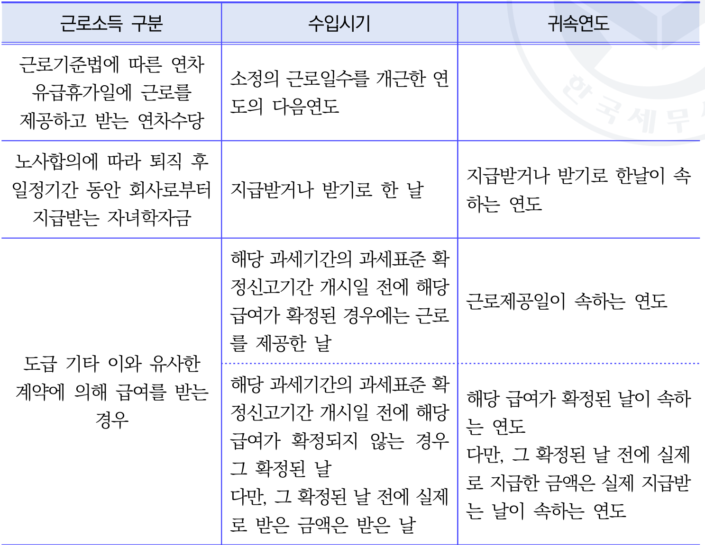
<<BLOCKEND>>
elementId: 155
07 근로소득의 지급시기와 원천징수시기
<<BLOCKEND>>
elementId: 156
(1) 의의
<<BLOCKEND>>
elementId: 157
근로소득을 지급하는 원천징수의무자는 지급하는 때에 근로소득세를 원천징수해야 한다.
다만, 근로소득을 지급해야할 원천징수의무자가 일정기한까지 지급하지 아니한 경우에는
특례규정에 따라 소득법 제135조에서 정한 날에 지급하는 것으로 보아 원천징수의무자
는 근로소득세를 원천징수해야 한다(소득법 134조, 135조)
<<BLOCKEND>>
elementId: 158
43) 해당 사업연도의 소득금액을 법인이 신고하거나 세무서장이 결정 · 경정함에 있어서 발생한 그 법인의
임원, 주주, 사원, 기타 출자자에 대한 상여
<<BLOCKEND>>
elementId: 159
제
1장
근로소득
연말정산(이론편)
<<BLOCKEND>>
elementId: 160
제2장
근로소득
연말정산(실전편)
제3장
연말정산
세액의
계산
제4장
근로소득자의
연말정산
후
4대보험
정산
<<BLOCKEND>>
elementId: 161
113
<<BLOCKEND>>
elementId: 162
|  |  |
| --- | --- |
|  | (2) 구체적 내용 ① 매월분의 근로소득 근로소득을 지급할 때 근로소득 간이세액표에 따라 원천징수 ② 연말정산 해당 과세기간의 다음연도 2월분 근로소득을 지급할 때 (2월분 근로소득을 2월 말일 까지 지급하지 아니하거나 2월분의 근로소득이 없는 경우에는 2월 말일), 이중근로, 재취업의 경우도 동일하다. ③ 1월~11월 귀속인 근로소득을 해당 과세기간 12월 31일까지 미지급한 경우 : 근로 소득을 12월31일에 지급한 것으로 본다. ④ 12월 귀속인 근로소득을 다음연도 2월 말일까지 지급하지 아니한 경우 : 근로소득을 다음연도 2월 말일에 지급한 것으로 본다. ⑤ 법인이 이익 또는 잉여금 처분에 따라 지급하여야 할 상여를 그 처분을 결정한 날로 부터 3개월이 되는 날까지 지급하지 아니한 경우 : 3개월이 되는 날에 지급한 것으 로 본다. 단, 해당 처분이 11월1일부터 12월31일까지 사이에 결정된 경우에 다음연 도 2월 말일까지 그 상여를 지급하지 아니한 경우에는 2월 말일에 지급한 것으로 본다. ⑥ 세무조사 등에 의하여 법인세법에 따라 처분되는 상여의 경우 : 소득금액변동통지서 를 받은날에 지급한 것으로 본다. ⑦ 인정상여(법인세 신고)의 경우 : 해당 법인의 법인세 과세표준 및 세액의 신고일에 지급한 것으로 본다. ⑧ 인정상여(법인세 수정신고)의 경우 : 수정신고일에 지급한 것으로 본다. |
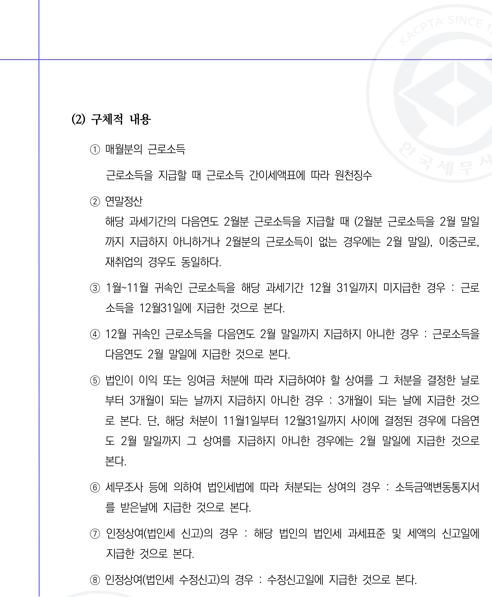
<<BLOCKEND>>
elementId: 163
연말정산
세무
114
<<BLOCKEND>>
elementId: 164
196
<<BLOCKEND>>
elementId: 165
제1장 근로소득 연말정산(이론편)
<<BLOCKEND>>
elementId: 166
08 근로소득 원천징수 세율
<<BLOCKEND>>
elementId: 167
원천징수의무자가 매월분의 근로소득에 대한 세율을 적용함에 있어서는 근로소
득 간이세액표44)를 적용하여야 한다. 다만, 근로자가 간이세액표에 따른 세액의
80% 또는 120%를 선택하여 조정신청서 또는 소득, 세액공제 신고서에 기재하여
원천징수의무자에게 신청하는 경우에는 이후 지급하는 근로소득부터 신청한 비율
을 적용한다. 반기별 납부자도 근로자에게 매월 급여지급시 근로소득 간이세액표를
참조하여 소득세를 원천징수한 후 반기별로 원천세 신고시 6개월분을 납부하여야
한다.
<<BLOCKEND>>
elementId: 168
09 근로소득 원천징수의무자
<<BLOCKEND>>
elementId: 169
(1) 개요
<<BLOCKEND>>
elementId: 170
국내에서 거주자나 비거주자에게 근로소득을 지급하는 자는 그 거주자나 비거주자에 대
한 소득세를 원천징수하여야 하며 이 경우 원천징수 납부를 해야 하는 자를 원천징수의
무자45)라 한다. 구체적 설명은 다음과 같다.
<<BLOCKEND>>
elementId: 171
1) 일반적인 경우
근로자에게 매월분의 근로소득을 지급하는 자
<<BLOCKEND>>
elementId: 172
2) 특수한 경우
<<BLOCKEND>>
elementId: 173
① 근로자의 근무지가 변경되어 월급여액을 같은 고용주가 나누어 지급하는 경우 :
변경된 근무지의 원천징수의무자가 변경 전후 월급여액 전액에 대하여 원천징수
<<BLOCKEND>>
elementId: 174
② 정부지원인턴제에 의하여 기업 · 학교 등이 인턴수당 등을 지급하는 경우 : 인턴에
<<BLOCKEND>>
elementId: 175
44) 소득법 시행령 별표2
45) 원천징수의무자에는 국가, 법인 및 개인사업자, 비사업자(개인)를 포함
<<BLOCKEND>>
elementId: 176
제
1장
근로소득
연말정산(이론편)
<<BLOCKEND>>
elementId: 177
제2장
근로소득
연말정산(실전편)
<<BLOCKEND>>
elementId: 178
제3장
연말정산
세액의
계산
제4장
근로소득자의
연말정산
후
4대보험
정산
<<BLOCKEND>>
elementId: 179
115
<<BLOCKEND>>
elementId: 180
게 인턴수당 등을 지급하는 기업 또는 대학이 각각 소득세를 원천징수. 다만, 원
천징수에 관한 별도의 위임이나 대리계약이 있으면 그에 따라 원천징수(법인
46013- 1062, 1999.3.23.; 법인 46013-1305, 1999.4.9.)
<<BLOCKEND>>
elementId: 181
(2) 원천징수의무자
<<BLOCKEND>>
elementId: 182
1) 원천징수 시기
<<BLOCKEND>>
elementId: 183
매월분 근로소득을 지급하는 때. 다만, 퇴직하는 달의 근로소득에 대해서는 간이세액
표에 의한 원천징수를 하지 아니하고 즉시 연말정산 가능하다.
<<BLOCKEND>>
elementId: 184
2) 매월분 근로소득의 지급시기 의제(소득법 제135조 1항 · 2항)
<<BLOCKEND>>
elementId: 185
① 1월부터 11월까지의 근로소득을 해당 과세기간의 12월 31일까지 지급하지 아니
한 경우 : 12월 31일에 지급한 것으로 의제
<<BLOCKEND>>
elementId: 186
② 12월분 근로소득을 다음 연도 2월 말일까지 지급하지 아니한 경우 : 다음 연도
2월 말일에 지급한 것으로 의제
<<BLOCKEND>>
elementId: 187
3) 잉여금의 처분에 따른 상여의 지급시기 의제(소득법 135조 3항)
<<BLOCKEND>>
elementId: 188
① 잉여금의 처분이 1월 1일부터 10월 31일 사이에 결정된 경우로서 처분을 결정
한 날부터 3개월이 되는 날까지 지급하지 아니한 경우 : 3개월이 되는 날
② 잉여금의 처분이 11월 1일부터 12월 31일까지의 사이에 결정된 경우로서 다음
연도 2월 말일까지 지급하지 아니한 경우 : 다음 연도 2월 말일
<<BLOCKEND>>
elementId: 189
(3) 원천징수 방법
<<BLOCKEND>>
elementId: 190
1) 매월분 급여에 대한 원천징수 방법
<<BLOCKEND>>
elementId: 191
① 일반적인 경우
<<BLOCKEND>>
elementId: 192
해당 월의 급여액을 기준으로 한 「소득세법 시행령」 별표2 근로소득 간이세액표
의 해당란의 세액을 원천징수. 다만, 근로자가 근로소득 간이세액표 해당란 세액
의 120% 또는 80%의 비율에 해당하는 금액의 원천징수세액 조정신청을 하는
경우에는 그에 따른 원천징수 선택이 가능하다(소득령 194조 1항).
<<BLOCKEND>>
elementId: 193
연말정산
세무
<<BLOCKEND>>
elementId: 194
116
<<BLOCKEND>>
elementId: 195
② 소득세 감면대상 외국인기술자에게 지급하는 경우
근로소득 간이세액표의 해당란 세액의 30%~50%를 원천징수한다(조특법 18조 3항).
<<BLOCKEND>>
elementId: 196
19
<<BLOCKEND>>
elementId: 197
제1장 근로소득 연말정산(이론편)
<<BLOCKEND>>
elementId: 198
③ 소득세 감면대상 중소기업 취업자에게 지급하는 경우
근로소득 간이세액표의 해당란 세액에 감면율(90%, 70%)을 적용하여 계산한 세
액을 공제한 금액을 원천징수할 수 있다(조특법 제30조).
<<BLOCKEND>>
elementId: 199
④ 세액공제 대상 근로자에게 지급하는 경우
<<BLOCKEND>>
elementId: 200
㉠ 「소득세법」 제59조부터 제59조의4까지의 규정에 따른 근로소득세액공제, 자
녀세액공제, 연금계좌세액공제 및 특별세액공제의 경우 : 근로소득 간이세액표
상의 세액에 이미 반영되어 있으므로 추가로 공제할 수 없다.
<<BLOCKEND>>
elementId: 201
㉡ 「소득세법」 제57조에 따른 외국납부세액공제의 경우 : 공제 여부에 관한 규정
이 없어 공제를 할 수 없는 것으로 보인다.
<<BLOCKEND>>
elementId: 202
⑤ 단일세율 적용 신청을 한 외국인근로자에게 지급하는 경우
비과세근로소득을 공제하기 전의 해당 월급여액의 19%를 원천징수할 수 있다(조
특법 제18조의2 4항).
<<BLOCKEND>>
elementId: 203
2) 근로소득 간이세액표의 적용(소득령 제194조)
<<BLOCKEND>>
elementId: 204
① 월급여액
비과세 대상 근로소득을 제외한 금액(과세대상 학자금으로 지급하는 금액도 제외
가능)
② 공제 대상 가족의 수
㉠ 공제 대상 가족 수의 적용 : 기본공제대상자인 본인, 배우자 및 부양가족의 총
인원.
<<BLOCKEND>>
elementId: 205
공제대상가족 중 8세 이상 20세 이하 자녀가 있는 경우의 세액은 근로소득 간이세액표의 금액
에서 해당 자녀수별로 다음 각 목의 금액을 공제한 금액으로 함. 다만, 공제한 금액이 음수인
경우의 세액은 0원으로 함.
<<BLOCKEND>>
elementId: 206
/ 계산사례
<<BLOCKEND>>
elementId: 207
· 8세이상 20세 이하 자녀가 1명인 경우 : 12,500원
· 8세이상 20세 이하 자녀가 2명인 경우 : 29,160원
· 8세이상 20세 이하 자녀가 3명이상인 경우 : 29,160원 + 2명 초과 자녀 1명당 25,000원
<<BLOCKEND>>
elementId: 208
제
1장
근로소득
연말정산(이론편)
<<BLOCKEND>>
elementId: 209
제4장
근로소득자의
연말정산
후
4대보험
정산
<<BLOCKEND>>
elementId: 210
제2장
근로소득
연말정산(실전편)
<<BLOCKEND>>
elementId: 211
제3장
연말정산
세액의
계산
<<BLOCKEND>>
elementId: 212
117
<<BLOCKEND>>
elementId: 213
|  | ㉡ 공제 대상 가족 수의 확인 : 직전 과세기간분의 연말정산을 할 때 근로자로부 터 제출받은 『근로소득자 소득 · 세액 공제신고서』를 기준으로 적용. 다만, 해 당 과세기간 중에 공제 대상 가족의 수에 변동이 있는 때에는 『근로소득자 소득 · 세액 공제신고서』를 새로이 제출받아 이를 기준으로 적용 가능 ☞ 해당 과세기간에 신규로 입사한 근로자의 경우는 입사할 때 『근로소득자 소득 · 세액 공제신고서』를 제출받아 이에 의하여 적용하도록 해야 함 ③ 공제 대상 가족의 수가 11명을 초과하는 경우의 세액 : A-B A : 공제 대상 가족의 수가 11명인 경우의 세액 B : (공제 대상 가족의 수가 10명인 경우의 세액-공제 대상 가족의 수가 11명 인 경우의 세액) x 11명을 초과하는 공제 대상 가족의 수 ④ 총급여액에 따른 간이세액표 적용 | ㉡ 공제 대상 가족 수의 확인 : 직전 과세기간분의 연말정산을 할 때 근로자로부 터 제출받은 『근로소득자 소득 · 세액 공제신고서』를 기준으로 적용. 다만, 해 당 과세기간 중에 공제 대상 가족의 수에 변동이 있는 때에는 『근로소득자 소득 · 세액 공제신고서』를 새로이 제출받아 이를 기준으로 적용 가능 ☞ 해당 과세기간에 신규로 입사한 근로자의 경우는 입사할 때 『근로소득자 소득 · 세액 공제신고서』를 제출받아 이에 의하여 적용하도록 해야 함 ③ 공제 대상 가족의 수가 11명을 초과하는 경우의 세액 : A-B A : 공제 대상 가족의 수가 11명인 경우의 세액 B : (공제 대상 가족의 수가 10명인 경우의 세액-공제 대상 가족의 수가 11명 인 경우의 세액) x 11명을 초과하는 공제 대상 가족의 수 ④ 총급여액에 따른 간이세액표 적용 | ㉡ 공제 대상 가족 수의 확인 : 직전 과세기간분의 연말정산을 할 때 근로자로부 터 제출받은 『근로소득자 소득 · 세액 공제신고서』를 기준으로 적용. 다만, 해 당 과세기간 중에 공제 대상 가족의 수에 변동이 있는 때에는 『근로소득자 소득 · 세액 공제신고서』를 새로이 제출받아 이를 기준으로 적용 가능 ☞ 해당 과세기간에 신규로 입사한 근로자의 경우는 입사할 때 『근로소득자 소득 · 세액 공제신고서』를 제출받아 이에 의하여 적용하도록 해야 함 ③ 공제 대상 가족의 수가 11명을 초과하는 경우의 세액 : A-B A : 공제 대상 가족의 수가 11명인 경우의 세액 B : (공제 대상 가족의 수가 10명인 경우의 세액-공제 대상 가족의 수가 11명 인 경우의 세액) x 11명을 초과하는 공제 대상 가족의 수 ④ 총급여액에 따른 간이세액표 적용 | ㉡ 공제 대상 가족 수의 확인 : 직전 과세기간분의 연말정산을 할 때 근로자로부 터 제출받은 『근로소득자 소득 · 세액 공제신고서』를 기준으로 적용. 다만, 해 당 과세기간 중에 공제 대상 가족의 수에 변동이 있는 때에는 『근로소득자 소득 · 세액 공제신고서』를 새로이 제출받아 이를 기준으로 적용 가능 ☞ 해당 과세기간에 신규로 입사한 근로자의 경우는 입사할 때 『근로소득자 소득 · 세액 공제신고서』를 제출받아 이에 의하여 적용하도록 해야 함 ③ 공제 대상 가족의 수가 11명을 초과하는 경우의 세액 : A-B A : 공제 대상 가족의 수가 11명인 경우의 세액 B : (공제 대상 가족의 수가 10명인 경우의 세액-공제 대상 가족의 수가 11명 인 경우의 세액) x 11명을 초과하는 공제 대상 가족의 수 ④ 총급여액에 따른 간이세액표 적용 |
| --- | --- | --- | --- | --- |
|  | 3,000만원 이하 | 3,000만원 초과 4,500만원 이하 | 4,500만원 초과 7,000만원 이하 | 7,000만원 초과 구분 1억2,000만원 이하 |
|  | 310만원 + 공제 연간 대상가족수 총급여액의 1명 4% | 310만원 + 연간 총급여액의 4% - 연간 총급여액 중 3,000만 원을 초과하는 금액의 5% | 310만원 + 연간 총급여액의 1.5% | 310만원 + 연간 총급여액의 0.5% |
|  | 360만원 + 공제 연간 대상가족수 총급여액의 2명 4% | 360만원 + 연간 총급여액의 4% 、 연간 총급여액 중 3,000만 원을 초과하는 금액의 5% | 360만원 + 연간 총급여액의 2% | 360만원 + 연간 총급여액의 1% |
|  | 500만원 + 연간 공제 총급여액의 대상가족수 7% 3명 | 500만원 + 연간 총급여액의 7% - 연간 총급여액 중 3,000만 원을 초과하는 금액의 5% | 500만원 + 연간 총급여액의 5% | 500만원 + 연간 총급여액의 3% |
|  | SIN + 연간 총급여액 중 4,000만원을 초과하는 금액의 4% | SIN + 연간 총급여액 중 4,000만원을 초과하는 금액의 4% | SIN + 연간 총급여액 중 4,000만원을 초과하는 금액의 4% | SIN + 연간 총급여액 중 4,000만원을 초과하는 금액의 4% |
**연말정산세무**
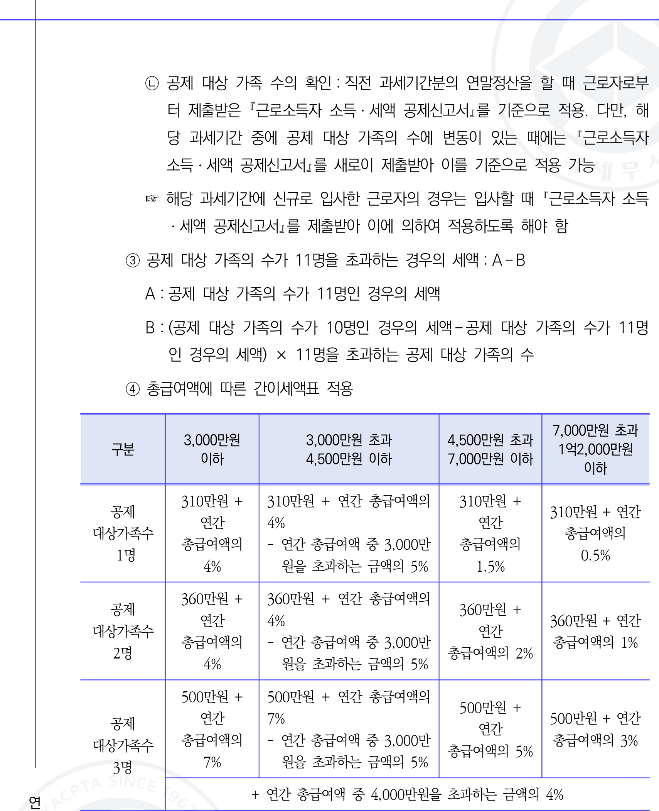
<<BLOCKEND>>
elementId: 215
118
<<BLOCKEND>>
elementId: 216
196
<<BLOCKEND>>
elementId: 217
제1장 근로소득 연말정산(이론편)
<<BLOCKEND>>
elementId: 218
⑤ 기타 참고사항
<<BLOCKEND>>
elementId: 219
㉠ 추가공제 : 연말정산을 할 때 공제
㉡ 연금보험료공제 : 근로소득 간이세액표상의 세액에 이미 반영되어 있으므로 추
가 공제 불가
㉢ 특별소득공제 : 근로소득 간이세액표상의 세액에 일부 반영되어 있으므로 추가
공제 불가
㉣ 「조세특례제한법」 에 따른 소득공제 : 연말정산을 할 때 공제
<<BLOCKEND>>
elementId: 220
[참고] 계산사례
<<BLOCKEND>>
elementId: 221
문 생산직 근로자가 아닌 자가 받는 월급여액이 다음과 같은 경우 근로소득 간이세액표에 따
라 원천징수하여야 할 세액은 얼마인가(원천징수세액 조정신청서 미제출의 경우)?
<<BLOCKEND>>
elementId: 222
1. 급여명세
<<BLOCKEND>>
elementId: 223
。본봉 : 250만원
○연장근로수당 : 20만원
°주휴수당 : 10만원
°식대 : 25만원(식사를 별도로 제공받지 아니한다)
°계 : 295만원
<<BLOCKEND>>
elementId: 224
2. 가족관계
<<BLOCKEND>>
elementId: 225
。 배우자(소득금액은 없다)
。자녀 1명(8세 이상 20세 이하이며 소득금액은 없다)
°부모(부 : 62세, 모 58세 소득금액은 없다)
°자녀에 대한 교육비 지급액 100,000원
<<BLOCKEND>>
elementId: 226
9,080원
<<BLOCKEND>>
elementId: 227
(풀이)
<<BLOCKEND>>
elementId: 228
0 월급여액 : 250만원(본봉) + 20만원(연장근로소득) + 10만원(주휴수당) + 5만원(식대 중 비과세
소득인 월 20만원 제외 금액) = 285만원
°공제 대상 가족의 수 : 본인, 배우자, 부(모는 나이 미달로 제외), 8세 이상 20세 이하의 자
녀 1명, 계 4명
<<BLOCKEND>>
elementId: 229
제2장
근로소득
연말정산(실전편)
제3장
연말정산
세액의
계산
제4장
근로소득자의
연말정산
후
4대보험
정산
<<BLOCKEND>>
elementId: 230
119
<<BLOCKEND>>
elementId: 231
제
1장
근로소득
연말정산(이론편)
<<BLOCKEND>>
elementId: 232
°월급여액 285만원 이상 286만원 미만, 공제 대상 가족의 수 4명인 경우의 원천징수 대상
근로소득세 21,580원임.
°공제대상가족 중 8세이상 20세 이하 자녀가 1명 있는 경우 12,500원을 공제
<<BLOCKEND>>
elementId: 233
3) 상여에 대한 원천징수 방법
<<BLOCKEND>>
elementId: 234
① 지급 대상 기간이 있는 상여의 경우(소득법 제136조 1항)
다음의 계산식에 따라 순차로 계산한 금액을 상여에 대한 근로소득세로 원천징수
<<BLOCKEND>>
elementId: 235
· (상여금+지급 대상 기간의 상여 외 월급여액 합계액) ÷ 지급 대상 기간 월수
=상여의 지급 대상 기간 월급여액 평균액
· 상여의 지급 대상 기간 월급여액 평균액에 대한 근로소득 간이세액표상의 해당
세액 x 지급 대상 기간의 월수=상여의 지급 대상 기간 총급여액에 대한 근로
소득세
· 상여의 지급 대상 기간 총 급여액에 대한 근로소득세-지급 대상 기간의 상여
외 월급여액에 대하여 이미 원천징수한 근로소득세 =상여에 대하여 원천징수하
여야 할 근로소득세
<<BLOCKEND>>
elementId: 236
☞ 지급 대상 기간이 1년을 초과하는 경우 : 1년으로 의제
<<BLOCKEND>>
elementId: 237
☞ 지급 대상 기간에 1개월 미만의 끝수가 있는 경우 : 1개월로 의제
<<BLOCKEND>>
elementId: 238
☞ 지급 대상 기간의 마지막 달이 아닌 달에 지급하는 상여(예 : 1~3월분 상여를
2월에 지급하는 경우)는 아래 『3) 지급 대상 기간이 없는 상여에 대한 원천
징수』에 따라 원천징수
<<BLOCKEND>>
elementId: 239
② 지급하여야 할 금액과 지급 대상 기간이 있는 상여에 대한 특례(소득칙 제91조 3항)
다음 계산식에 따란 계산한 금액을 기준으로 한 근로소득 간이세액표에 의한 근
로소득세 원천징수 가능
<<BLOCKEND>>
elementId: 240
매월분의 급여액 +(상여금÷지급 대상 기간) = 근로소득 간이세액표 적용 월급여액
<<BLOCKEND>>
elementId: 241
연말정산
세무
<<BLOCKEND>>
elementId: 242
120
<<BLOCKEND>>
elementId: 243
196
<<BLOCKEND>>
elementId: 244
제1장 근로소득 연말정산(이론편)
<<BLOCKEND>>
elementId: 245
③ 지급 대상 기간이 없는 상여의 경우(소득법 제136조 1항 2호 * 3호)
<<BLOCKEND>>
elementId: 246
· 상여를 처음으로 지급하는 경우 : 1월 1일부터 상여의 지급일이 속하는 달까지
를 지급 대상 기간으로 하여 위 「1) 지급 대상 기간이 있는 상여의 경우』에
따라 원천징수
<<BLOCKEND>>
elementId: 247
· 상여를 두 번째 이후로 지급하는 경우 : 직전에 상여를 지급한 날이 속하는 달
의 다음 달부터 그 후에 상여를 지급한 날이 속하는 달까지를 지급 대상 기간
으로 하여 위 『1) 지급 대상 기간이 있는 상여의 경우』에 따라 원천징수
<<BLOCKEND>>
elementId: 248
④ 지급 대상 기간이 서로 다른 상여를 같은 달에 지급하는 경우(소득령 제195조 1항 2호)
지급 대상 기간을 다음의 계산식에 따라 계산하여 위 『1) 지급 대상 기간이 있
는 상여의 경우』에 따라 원천징수
<<BLOCKEND>>
elementId: 249
$$\begin{array}{r l}{x\|{\frac{-1}{\ln}}\mathrm{~}\mathbf{~}\mathbf{~}\mathbf{~}\mathbf{~}\mathbf{~}\mathbf{~}\mathbf{~}\mathbf{~}\mathbf{~}\mathbf{~}\mathbf{~}\mathbf{~}\mathbf{~}\mathbf{~}\mathbf{~}\mathbf{~}\mathbf{~}\mathbf{~}\mathbf{~}\mathbf{~}\mathbf{~}\mathbf{~}\mathbf{~}\mathbf{~}\mathbf{~}\mathbf{~}\mathbf{~}\mathbf{~}\mathbf{~}\mathbf{~}\mathbf{~}\mathbf{~}\mathbf{~}\mathbf{~}\mathbf{~}\mathbf{~}\mathbf{~}\mathbf{~}\mathbf{~}\mathbf{~}\mathbf{~}\mathbf{~}\mathbf{~}\mathbf{~}\mathbf{~}\mathbf{~}\mathbf{~}\mathbf{~}\mathbf{~}\mathbf{~}\mathbf{~}\cdot\mathbf{~}\mathbf{~}\mathbf{~}\mathbf{~}\mathbf{~}\mathbf{~}\mathbf{~}\mathbf{~}\mathbf{~}\cdot}\mathbf{~}\mathbf{~}\mathbf{~}\vec{~}\mathbf{~}\mathbf{~}\hat{~}\vec{~}\boldsymbol{~}\mathbf{~}\boldsymbol{~}\boldsymbol{~}\mu}\mathbf{\mu}\boldsymbol{~}\boldsymbol{~}\boldsymbol{\boldsymbol{\mu}\boldsymbol{\hat{\mu}\cdot\boldsymbol{~}\mu}\mathbf{\boldsymbol{\cdot}\boldsymbol{\boldsymbol{r}\mu}\mu}\mathbf{\boldsymbol{\boldsymbol{\boldsymbol{\underline{\mathrm{\boldsymbol{~}\boldsymbol{~}\boldsymbol{~}\mu}\underline{\mu}\underline{\underline{$$
<<BLOCKEND>>
elementId: 250
(예 : 지급 대상 기간이 없는 추석상여금과 3/4분기 상여금을 9월 30일 지급하는 경우의 지급
대상 기간 ⇒ (9개월+3개월)/2=6개월
<<BLOCKEND>>
elementId: 251
⑤ 잉여금의 처분에 따라 지급하는 상여의 경우(소득령 제195조 2항)
다음 계산식에 따라 계산한 금액을 원천징수
<<BLOCKEND>>
elementId: 252
잉여금의 처분에 따른 상여금액 x 종합소득세율=해당 상여에 대하여
원천징수하여야 할 근로소득세
<<BLOCKEND>>
elementId: 253
⑥ 법인세 과세표준을 신고할 때 상여로 소득처분한 금액의 경우
㉠ 전년도 귀속분 : 전년도 근로소득에 가산하여 연말정산 수정
㉡ 당년도 귀속분 : 지급 대상 기간이 없는 상여로 보아 원천징수
<<BLOCKEND>>
elementId: 254
제2장
근로소득
연말정산(실전편)
<<BLOCKEND>>
elementId: 255
제3장
<<BLOCKEND>>
elementId: 256
연말정산
<<BLOCKEND>>
elementId: 257
세액의
<<BLOCKEND>>
elementId: 258
계산
<<BLOCKEND>>
elementId: 259
제4장
근로소득자의
연말정산
후
4대보험
정산
<<BLOCKEND>>
elementId: 260
121
<<BLOCKEND>>
elementId: 261
제
1장
근로소득
연말정산(이론편)
<<BLOCKEND>>
elementId: 262
4) 연봉제로 지급하는 급여에 대한 원천징수 방법(소득칙 89조 3항)
① 정기적으로 분할하여 지급하는 경우
<<BLOCKEND>>
elementId: 263
㉠ 분할지급 대상 기간이 1월을 초과하는 경우 : 위 『(3) 상여에 대한 원천징수
<<BLOCKEND>>
elementId: 264
방법』 중 『1) 지급 대상 기간이 있는 상여의 경우』에 따라 원천징수
<<BLOCKEND>>
elementId: 265
㉡ 분할지급 대상 기간이 1월 이하인 경우 : 매월 지급하는 총액을 기준으로 원
천징수
<<BLOCKEND>>
elementId: 266
② 부정기적으로 지급하는 경우
<<BLOCKEND>>
elementId: 267
위 『(3) 상여에 대한 원천징수 방법』 중 『3) 지급 대상 기간이 없는 상여의 경
<<BLOCKEND>>
elementId: 268
우』에 따라 원천징수
<<BLOCKEND>>
elementId: 269
5) 근무지가 둘 이상인 경우의 원천징수 방법(소득령 196조의2)
<<BLOCKEND>>
elementId: 270
㉠ 주된 근무지의 원천징수의무자의 경우 : 자기가 지급하는 근로소득에 대하여 위
『(1) 매월분 급여에 대한 원천징수 방법』에 따라 원천징수
㉡ 종된 근무지의 원천징수의무자의 경우 : 공제 대상 가족 수가 1명인 것으로 하여
원천징수46)
<<BLOCKEND>>
elementId: 271
6) 기타사항
<<BLOCKEND>>
elementId: 272
① 소득자별 근로소득원천징수부의 비치 · 기록
<<BLOCKEND>>
elementId: 273
· 『소득자별 근로소득원천징수부」(소득칙 별지 제25호 서식) 비치 · 기록
· 전산 처리된 테이프나 디스크 등으로 수록 · 보관하여 항시 출력이 가능한 상태
에 둔 때에는 『소득자별 근로소득원천징수부』를 비치 · 기록한 것으로 갈음(소
득령 196조)
<<BLOCKEND>>
elementId: 274
② 근로소득에 대한 농어촌특별세와 지방소득세의 원천징수
<<BLOCKEND>>
elementId: 275
· 근로소득 간이세액표에 따라 근로소득세를 원천징수하는 때에 농어촌특별세를
원천징수하는 경우는 없음(농특법 7조 3항).
<<BLOCKEND>>
elementId: 276
원천징수하는 근로소득세의 10%를 개인지방소득세로 특별징수하여야 함(지방
법 103조의13 1항)
<<BLOCKEND>>
elementId: 277
연말정산
세무
<<BLOCKEND>>
elementId: 278
46) 주된 근무지와 종된 근무지 : 둘 이상의 근무지로부터 근로소득을 받는 사람은 해당 과세기간 종료일까
지 주된 근무지와 종된 근무지를 정하여 주된 근무지의 원천징수의무자에게 『근무지신고서』(소득칙 별
지 제26호 서식)를 제출하여야 함.
<<BLOCKEND>>
elementId: 279
122
<<BLOCKEND>>
elementId: 280
CPTA SINCE 196
<<BLOCKEND>>
elementId: 281
제1장 근로소득 연말정산(이론편)
<<BLOCKEND>>
elementId: 282
(4) 원천징수이행상황신고서 제출 및 세금 납부
<<BLOCKEND>>
elementId: 283
원천징수의무자는 원천징수한 소득세를 그 징수일이 속하는 달의 다음달 10일까지 국세
징수법에 의한 납부서와 함께 원천징수관할세무서, 한국은행 또는 체신관서에 납부하여
야 하며 원천징수이행상황신고서(소득세법 시행규칙 별제 21호 서식)를 원천징수 관할세
무서장에게 제출하여야 한다.
<<BLOCKEND>>
elementId: 284
직전 과세기간(신규사업자는 신청일이 속하는 반기)의 상시고용인원이 20명 이하인 원천
징수의무자와 종교단체로서 원천징수 관할세무서장으로부터 원천징수 대상 소득에 대한
원천징수세액을 매 반기별로 납부할 수 있도록 승인을 받거나 국세청장이 정하는 바에
따라 지정을 받은 원천징수의무자는 원천징수한 소득세를 그 징수일이 속하는 반기의
마지막 달의 다음달 10일까지 납부할 수 있다.
<<BLOCKEND>>
elementId: 285
[참고] 원천징수 세금신고 유의사항
<<BLOCKEND>>
elementId: 286
1. 동일귀속, 지급연월의 원천세 신고서를 여러 번 전송한 경우 신고기한까지 최종 전송한 자
료만을 인정한다. 정기신고서는 법정신고기한 내, 기한 후 신고서는 월말까지 최종으로 전
송한 1건을 인정한다.
2. 홈택스로 전송한 신고서를 삭제하려면 홈택스에서 전자신고 삭제요청서를 작성하여 제출하
여야 한다(홈택스 ->세금신고->신고서 조회/삭제/부속서류->전자신고 삭제요청)
3. 휴, 폐업한 사업자도 홈택스를 통해 신고할 수 있음.
4. 귀속, 지급연월은 신고서를 구분하는 항목이므로 정확하게 작성해야 한다. 잘못 작성한 신
고서는 수정할 수 없으며 삭제요청한 후 정확한 귀속, 지급연월로 작성하여 다시 신고해야
한다.
<<BLOCKEND>>
elementId: 287
제
1장
근로소득
연말정산(이론편)
<<BLOCKEND>>
elementId: 288
제2장
근로소득
연말정산(실전편)
<<BLOCKEND>>
elementId: 289
제3장
연말정산
세액의
계산
제4장
근로소득자의
연말정산
후
4대보험
정산
<<BLOCKEND>>
elementId: 290
123
<<BLOCKEND>>
elementId: 291
KACPTA SINCE 1962
<<BLOCKEND>>
elementId: 292
한국세무사회
<<BLOCKEND>>
elementId: 293
KACPTA SINCE 1962
<<BLOCKEND>>
elementId: 294
한
<<BLOCKEND>>
elementId: 295
국세무사회
<<BLOCKEND>>
elementId: 296
KACPTA SINCE 1962
<<BLOCKEND>>
elementId: 297
제2장
<<BLOCKEND>>
elementId: 298
근로소득 연말정산
(실전편)
<<BLOCKEND>>
elementId: 299
제1절 연말정산 사전준비
<<BLOCKEND>>
elementId: 300
01 연말정산 사전준비
<<BLOCKEND>>
elementId: 301
(1) 연말정산 안내
<<BLOCKEND>>
elementId: 302
2024년 귀속 연말정산의 원활한 진행과 근로자의 절세를 위해 각 회사에 공문을 보냄
으로서 연말정산 스케쥴을 사전에 조율하고 진행할 수 있다.
<<BLOCKEND>>
elementId: 303
① 연말정산 간소화 서비스 조회 안내
<<BLOCKEND>>
elementId: 304
- 세무사사무실의 경우 여러 업체의 연말정산을 해야 하기 때문에 간소화 서비스를
권장하여 근로자의 소득 · 세액공제 신고서를 받아 프로그램에 업로드 함으로써
업무를 효율적으로 처리할 수 있다.
<<BLOCKEND>>
elementId: 305
② 서류제출 안내
<<BLOCKEND>>
elementId: 306
-
<<BLOCKEND>>
elementId: 307
근로자의 소득 세액공제 신고서(국세청 간소화 서비스 pdf자료 등)와 연말정산간
소화 서비스를 통해 조회되지 않는 영수증, 기타 증빙서류의 제출기한을 정해 업
무가 차질없이 진행되도록 안내해야 한다.
<<BLOCKEND>>
elementId: 308
제3장
연말정산
세액의
계산
제4장
근로소득자의
연말정산
후
4대보험
정산
<<BLOCKEND>>
elementId: 309
제2장
근로
소득
연말정산(실전편)
<<BLOCKEND>>
elementId: 310
125
<<BLOCKEND>>
elementId: 311
제
1장
근로소득
연말정산(이론편)
<<BLOCKEND>>
elementId: 312
- 직접제출, 연말정산 간소화자료 일괄제공 서비스를 통한 제출의 방식을 이용하여
자료를 제공받을 수 있다.
<<BLOCKEND>>
elementId: 313
③ 유의사항
<<BLOCKEND>>
elementId: 314
- 연말정산 간소화 서비스는 서비스 제공기간이 있으니 일자를 확인하여 자료를 조
<<BLOCKEND>>
elementId: 315
회, 발급 받을 수 있다.
<<BLOCKEND>>
elementId: 316
- 근로자가 부양가족이 있는 경우 미리 부양가족 동의 신청을 하고 자료를 제출하
<<BLOCKEND>>
elementId: 317
게 함으로써 공제가 누락되는 일을 방지할 수 있다.
<<BLOCKEND>>
elementId: 318
- 연말정산 간소화 서비스에서 제공되지 않는 별도의 공제대상 서류를 미리 안내문
<<BLOCKEND>>
elementId: 319
으로 안내함으로써 근로자의 절세를 도울 수 있다.
<<BLOCKEND>>
elementId: 320
2025년 연말정산 자료 제출 안내문 샘플
<<BLOCKEND>>
elementId: 321
| 문서번호 : 본점-250101001 |
| --- |
| 일 자 : 2025.1.1. |
| 수 신 : 고객사 대표님 |
| 참 조 : 세무업무 담당자님 |
| 제 목 : 2024년 귀속 연말정산 자료제출 안내 |
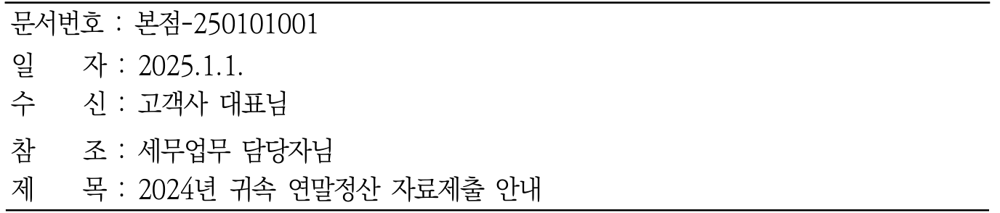
<<BLOCKEND>>
elementId: 322
고객사의 무궁한 발전을 기원하며 새해 복 많이 받으시기 바랍니다.
<<BLOCKEND>>
elementId: 323
2025년도 연말정산과 관련하여 안내문 보내드립니다. 연말정산은 2024년 귀속 근로소득이
있는 근로자의 소중한 세금을 정산하는 과정으로 각종 공제서류에 따라 근로자의 세금이 달라
집니다. 안내하는 내용을 잘 숙지하시어 빠지는 부분이 없는지 꼼꼼히 체크 부탁드립니다. 서
류는 대상자별로 꼭 작성하시어 연말정산 제출서류와 함께 보내 주시기 바랍니다.
<<BLOCKEND>>
elementId: 324
1. 연말정산 간소화 서비스 조회
<<BLOCKEND>>
elementId: 325
1월 15일 이후부터 근로자는 홈텍스의 연말정산간소화 서비스에서 자료 조회 가능
(홈택스 지연 및 오류문제로 1월 21일 이후 저녁시간에 조회하시길 추천합니다.)
<<BLOCKEND>>
elementId: 326
연말정산
세무
126
<<BLOCKEND>>
elementId: 327
196
<<BLOCKEND>>
elementId: 328
제2장 근로소득 연말정산(실전편)
<<BLOCKEND>>
elementId: 329
2. 서류제출
<<BLOCKEND>>
elementId: 330
(1) 제출기한 : 2월 9일 회사의 일정에 맞춰 수정
<<BLOCKEND>>
elementId: 331
(2) 제출서류
<<BLOCKEND>>
elementId: 332
① 연말정산 제출서류 [주민등록등본/가족관계증명서 및 홈텍스 간소화자료 등]
(3) 제출방법
<<BLOCKEND>>
elementId: 333
1) 직접 제출 (우편 또는 파일 취합 제출)
<<BLOCKEND>>
elementId: 334
① (근로자) 홈택스 접속 또는 세무서 방문하여 간소화 자료(PDF) 내려받기 · 출력
후 회사에 제출(25.1.15.부터, 변경가능성이 있으니 가급적 25.1.21.이후 제출
바람)
② (회사) PDF 자료를 취합하여 세무사사무실에 이메일 전달
③ (세무사사무실) 연말정산을 진행 후 연말정산 최종결과 회사 전달
④ (회사) 연말정산 최종결과 확인 및 근로자 전달 및 최종확인
2) 홈텍스 편리한 연말정산 간소화자료 일괄제공서비스(On-Line 제출)
<<BLOCKEND>>
elementId: 335
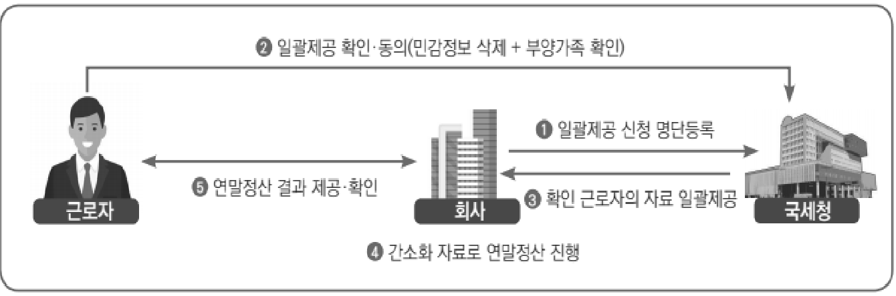
*일괄제공 확인·동의(민감정보 삭제 + 부양가족 확인)
일괄제공 신청 명단등록
연말정산 결과 제공·확인
확인 근로자의 자료 일괄제공
근로자 회사 국세청
④ 간소화 자료로 연말정산 진행*
<<BLOCKEND>>
elementId: 336
SIN
<<BLOCKEND>>
elementId: 337
① (근로자) 일괄제공 서비스를 이용 근로자 회사에 간소화자료 일괄제공 신청서(첨
부서류 참조)를 제출
② (회사) 일괄제공을 신청한 근로자 명단을 홈택스에 등록 후 세무사사무실에 수임
동의, 등록기한
③ (근로자) 홈택스(손택스)에 접속 후 부양가족 포함 간소화자료 확인 후 동의, 민감
정보 등을 사전 삭제
④ (국세청) 일괄제공 신청이 확인(동의)된 근로자의 간소화자료를 세무사사무실/회사
에서 내려받을 수 있도록 홈택스에 구축
⑤ (세무사사무실) 간소화자료 PDF파일을 내려받아 연말정산을 진행
⑥ (세무사사무실) 연말정산 최종 결과를 회사 전달, 회사는 직원에게 최종확인
<<BLOCKEND>>
elementId: 338
제2장
근로소득
연말정산(실전편)
<<BLOCKEND>>
elementId: 339
제
1장
근로소득
연말정산(이론편)
<<BLOCKEND>>
elementId: 340
제3장
연말정산
세액의
계산
제4장
근로소득자의
연말정산
후
4대보험
정산
<<BLOCKEND>>
elementId: 341
127
<<BLOCKEND>>
elementId: 342
| 3. 유의사항 1) 연말정산 간소화 서비스 이용 (2025. 1. 15. 이후 조회가능) - www.hometax.go.kr → 조회/발급 → 연말정산 간소화 - 신용카드, 의료비, 기부금 자료는 요건 충족되는 경우 불러오기를 이용해 출력 | 3. 유의사항 1) 연말정산 간소화 서비스 이용 (2025. 1. 15. 이후 조회가능) - www.hometax.go.kr → 조회/발급 → 연말정산 간소화 - 신용카드, 의료비, 기부금 자료는 요건 충족되는 경우 불러오기를 이용해 출력 | 3. 유의사항 1) 연말정산 간소화 서비스 이용 (2025. 1. 15. 이후 조회가능) - www.hometax.go.kr → 조회/발급 → 연말정산 간소화 - 신용카드, 의료비, 기부금 자료는 요건 충족되는 경우 불러오기를 이용해 출력 |
| --- | --- | --- |
| 구분 | 소득 요건 | 나이 요건 |
| 신용카드 공제 | ○ | X |
| 의료비 공제 | x | x |
| 기부금 공제 | ○ | x |
| 교육비 공제 | ○ | X |
| 보험료 공제 | ○ | ○ |
| 2) 부양가족이 있는 경우(자료제공동의/취소신청에서 부양가족 동의 확인) : 국세청홈텍스→조회/발급→연말정산 간소화→자료제공동의→부양가족 본인인증 (공인인증서, 휴대전화, 신용카드 택1) 3) 홈텍스 미조회 자료의 제출 : 연말정산 간소화 서비스에서 조회되지 않는, 별도의 공제대상 서류가 있는 경우 반드 시 별도로 제출하여 주시기 바랍니다. (이하 예시) | 2) 부양가족이 있는 경우(자료제공동의/취소신청에서 부양가족 동의 확인) : 국세청홈텍스→조회/발급→연말정산 간소화→자료제공동의→부양가족 본인인증 (공인인증서, 휴대전화, 신용카드 택1) 3) 홈텍스 미조회 자료의 제출 : 연말정산 간소화 서비스에서 조회되지 않는, 별도의 공제대상 서류가 있는 경우 반드 시 별도로 제출하여 주시기 바랍니다. (이하 예시) | 2) 부양가족이 있는 경우(자료제공동의/취소신청에서 부양가족 동의 확인) : 국세청홈텍스→조회/발급→연말정산 간소화→자료제공동의→부양가족 본인인증 (공인인증서, 휴대전화, 신용카드 택1) 3) 홈텍스 미조회 자료의 제출 : 연말정산 간소화 서비스에서 조회되지 않는, 별도의 공제대상 서류가 있는 경우 반드 시 별도로 제출하여 주시기 바랍니다. (이하 예시) |
| △ 보청기, 휠체어 등 장애인 보장구 영수증 △ 중 · 고생 교복구매비, 취학 전 아동의 학원 또는 체육시설 교육비납부증명서, 국외 교육비 납부 증명서, 학점인정 교육비납부증명서 △ 월세액 세액공제를 받기 위한 임대차계약서, 월세입금 명세 △ 기부금 영수증 △ 건강보험산정 특례 대상자라는 사실을 입증할 수 있는 증명서류 (의료기관에서 발급하는 장애인 증명서 등) △ 병원의 의사가 발급한 세법상 장애인 증명서 (암 환자나 난치성 질환, 중풍, 치매 등의 상황에 해 당 함. 장애인복지법상의 장애인인 경우는 확인서 불필요) | △ 보청기, 휠체어 등 장애인 보장구 영수증 △ 중 · 고생 교복구매비, 취학 전 아동의 학원 또는 체육시설 교육비납부증명서, 국외 교육비 납부 증명서, 학점인정 교육비납부증명서 △ 월세액 세액공제를 받기 위한 임대차계약서, 월세입금 명세 △ 기부금 영수증 △ 건강보험산정 특례 대상자라는 사실을 입증할 수 있는 증명서류 (의료기관에서 발급하는 장애인 증명서 등) △ 병원의 의사가 발급한 세법상 장애인 증명서 (암 환자나 난치성 질환, 중풍, 치매 등의 상황에 해 당 함. 장애인복지법상의 장애인인 경우는 확인서 불필요) | △ 보청기, 휠체어 등 장애인 보장구 영수증 △ 중 · 고생 교복구매비, 취학 전 아동의 학원 또는 체육시설 교육비납부증명서, 국외 교육비 납부 증명서, 학점인정 교육비납부증명서 △ 월세액 세액공제를 받기 위한 임대차계약서, 월세입금 명세 △ 기부금 영수증 △ 건강보험산정 특례 대상자라는 사실을 입증할 수 있는 증명서류 (의료기관에서 발급하는 장애인 증명서 등) △ 병원의 의사가 발급한 세법상 장애인 증명서 (암 환자나 난치성 질환, 중풍, 치매 등의 상황에 해 당 함. 장애인복지법상의 장애인인 경우는 확인서 불필요) |
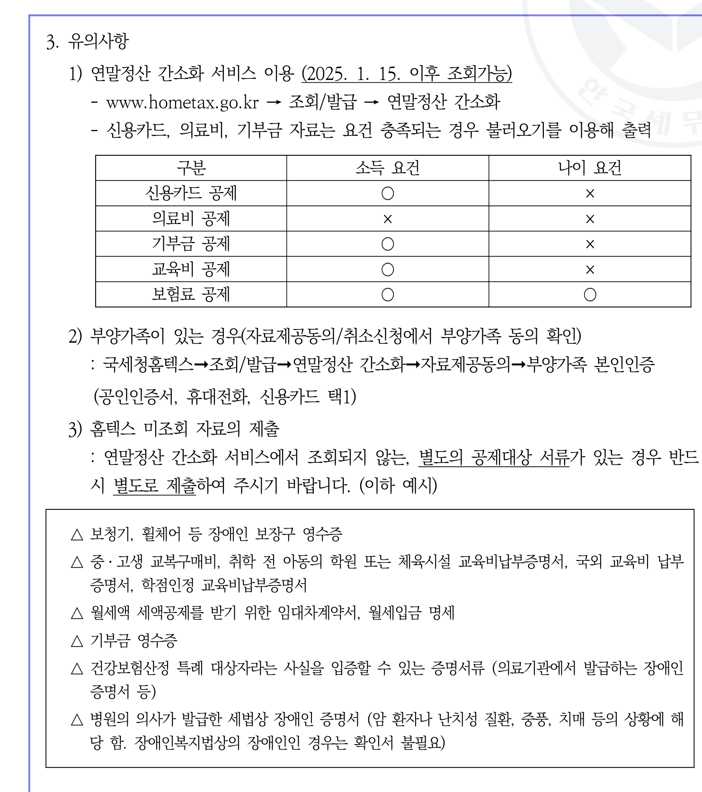
<<BLOCKEND>>
elementId: 343
기타 궁금한 사항이 있으시면 세무사사무실 업무 담당자에게 연락 주시면 안내해 드리도록 하
겠습니다. 감사합니다.
<<BLOCKEND>>
elementId: 344
연말정산
세무
128
<<BLOCKEND>>
elementId: 345
제2장 근로소득 연말정산(실전편)
<<BLOCKEND>>
elementId: 346
02 연말정산 제출서류
<<BLOCKEND>>
elementId: 347
1) 기본서류
<<BLOCKEND>>
elementId: 348
① 소득 세액공제신고서
② 의료비 공제를 받고자 하는 경우 '의료비지급명세서'
③ 기부금 공제를 받고자 하는 경우 '기부금명세서'
④ 신용카드 공제를 받고자 하는 경우 '신용카드 소득공제 신청서'
<<BLOCKEND>>
elementId: 349
2) 인적공제를 파악하기 위한 안내자료
<<BLOCKEND>>
elementId: 350
- 부양가족으로 인한 기본공제(인적공제)는 공제액이 큰 만큼 소득요건, 나이요건을 판
단하여 작성하여야 한다.
<<BLOCKEND>>
elementId: 351
소득공제 신고서 샘플 양식
<<BLOCKEND>>
elementId: 353
| 소득자 | 성명 | (서명) | 주민등록번호 |  |
| --- | --- | --- | --- | --- |
| 근무처 | 명칭 |  | 이중근로/재 취업 여부 | ( O , X ) 이중근로 또는 재취업한 경우에는 전(종)근무지 근로소득원천징수영수증을 첨부하여 제출요망. |
**소득공제신고서/근로소득자공제신고서(2024년 소득에 대한 연말정산용)**
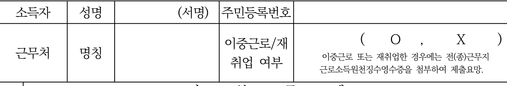
<<BLOCKEND>>
elementId: 354
| 인 적 공 제 | 기 본 공 제 | 기 본 공 제 | 기 본 공 제 | 기 본 공 제 | 기 본 공 제 | 기 본 공 제 |
| --- | --- | --- | --- | --- | --- | --- |
| 인 적 공 제 | 구분 | 관계 | 성명 | 주민등록번호 | 주소 | 공제여부 |
| 인 적 공 제 | 본인 | 본인 |  |  |  |  |
| 인 적 공 제 | 배우자 | 배우자 |  |  |  |  |
| 인 적 공 제 | SINCE 부양 가족 | 부 |  |  |  |  |
| 인 적 공 제 | SINCE 부양 가족 | 모 |  |  |  |  |
| 인 적 공 제 | SINCE 부양 가족 | 자녀 |  |  |  |  |
| 인 적 공 제 | SINCE 부양 가족 | 자녀 |  |  |  |  |
| 인 적 공 제 | SINCE 부양 가족 | 자녀 |  |  |  |  |
| 인 적 공 제 | SINCE 부양 가족 | 형제 |  |  |  |  |
| 인 적 공 제 | SINCE 부양 가족 | 자매 |  |  |  |  |
| 인 적 공 제 | SINCE 부양 가족 | 2024년 귀속 연말정산의 경우 자녀공제는 2004.1.1. 이후에 출생한 자녀를 기본공제자로 함 | 2024년 귀속 연말정산의 경우 자녀공제는 2004.1.1. 이후에 출생한 자녀를 기본공제자로 함 | 2024년 귀속 연말정산의 경우 자녀공제는 2004.1.1. 이후에 출생한 자녀를 기본공제자로 함 | 2024년 귀속 연말정산의 경우 자녀공제는 2004.1.1. 이후에 출생한 자녀를 기본공제자로 함 | 2024년 귀속 연말정산의 경우 자녀공제는 2004.1.1. 이후에 출생한 자녀를 기본공제자로 함 |
**소득공제신고서/근로소득자공제신고서(2024년 소득에 대한 연말정산용)**

<<BLOCKEND>>
elementId: 355
제2장
근로소득
연말정산(실전편)
<<BLOCKEND>>
elementId: 356
제
1장
근로소득
연말정산(이론편)
<<BLOCKEND>>
elementId: 357
제3장
연말정산
세액의
계산
제4장
근로소득자의
연말정산
후
4대보험
정산
<<BLOCKEND>>
elementId: 358
129
<<BLOCKEND>>
elementId: 359
| ※ 주의사항 공제가 가능합니다. 2. 부모의 경우 남,녀 모두 60세 이상(1964.12.31. 이전 출생자)을 공제대상으로 합니다. | ※ 주의사항 공제가 가능합니다. 2. 부모의 경우 남,녀 모두 60세 이상(1964.12.31. 이전 출생자)을 공제대상으로 합니다. |
| --- | --- |
| 1. 배우자 및 부양가족의 경우 연간 소득금액(종합소득 및 양도, 경우 총급여가 500만원 이하 가능) 이하일 경우에만 3. 부모의 경우 주소지가 다를 경우에도 실질적인 부양자인 경우엔 다른 자녀가 공제를 받지 않을 경우에 가족관계등록부를 첨부하여 공제가 가능합니다. 단, 자녀 중 소득금액이 높은 자가 공제받는 것이 유리합 니다. 4. 공제대상자 중 70세 이상(1954.12.31. 이전 출생자)의 경우 인당 100만원씩 추가공제 됩니다. 5. 자녀의 경우 만20세 이하(2004.1.1.)이후 출생자만이 해당됩니다. 6. 장애인과 기초생활수급자는 연령제한이 없습니다. 형제자매의 경우 동일한 거주지에서 거주하고 2004.1.1. 이후 출생자 또는 12.31. 일 이전 부양가족에 해당됩니다. 8. 인적공제 대상자 란은 꼭 근로자 본인이 기재후 서명하여 주시기 바랍니다. (배우자공제 및 부양가족공제 대상여부를 파악하여 해당시 공제여부에 O를 기재하십시오) | 퇴직소득 포함)이 100만원(단, 순수근로자의 7. 1964. 출생자가 |
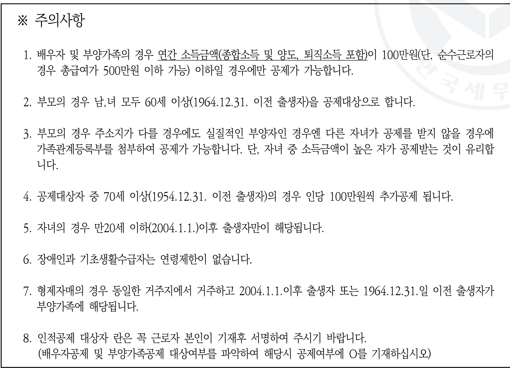
<<BLOCKEND>>
elementId: 360
3) 소득 · 세액공제신고서 첨부서류
<<BLOCKEND>>
elementId: 361
연말정산간소화 서비스에서 제공하는 자료는 영수증 발급기관이 국세청에 제출한 자료를
그대로 보여주는 것이므로 공제대상이 아닌 자료가 포함되어 있을 수 있다.
<<BLOCKEND>>
elementId: 362
따라서, 근로자 스스로가 소득 · 세액공제 요건 충족여부를 판단하여 공제대상이 아닌 경
우 공제대상으로 선택하지 않도록 주의하여야 한다.
<<BLOCKEND>>
elementId: 363
① 소득 · 세액공제신고서 첨부서류
연말정산 시 원천징수의무자(회사)에게 소득 · 세액공제신고서와 함께 첨부서류를 제
출하여야 한다.
"비고"란에 "국세청"으로 표시된 항목은 국세청 홈택스 연말정산간소화에서 제공하는
자료이다.
<<BLOCKEND>>
elementId: 364
연말정산
세무
<<BLOCKEND>>
elementId: 365
130
<<BLOCKEND>>
elementId: 366
196
<<BLOCKEND>>
elementId: 367
제2장 근로소득 연말정산(실전편)
<<BLOCKEND>>
elementId: 368
| 공제항목 | 첨부서류 | 비고 |
| --- | --- | --- |
| 인적공제 | 주민등록등본, 가족관계증명서 |  |
| 인적공제 | 재학, 요양, 재직 증명서 |  |
| 인적공제 | 입양사실확인서 또는 입양증명서 |  |
| 인적공제 | 장애인 증명서, 장애인 등록증 사본 | 국세청 |
| 주택자금공제 | 주택자금상환등증명서 | 국세청 |
| 주택자금공제 | 임대차계약서 사본 |  |
| 주택자금공제 | 원리금 상환 증명서류 |  |
| 주택자금공제 | 장기주택저당차입금 이자상환증명서 | 국세청 |
| 주택자금공제 | 개별주택가격 확인서 |  |
| 주택자금공제 | 주민등록등본 |  |
| 개인연금저축 | 개인연금저축납입증명서 | 국세청 |
| 소기업, 소상공인공제 | 공제부금납입증명서 | 국세청 |
| 주택마련저축 | 주택마련저축납입증명서 | 국세청 |
| 신용카드 사용액 | 신용카드 등 사용금액 확인서 | 국세청 |
| 우리사주조합출연금 | 우리사주조합출연금액확인서 |  |
| 연금보험료 | 연금납입확인서 | 국세청 |
| 보험료 | 보험료 납입증명서 또는 보험료 납입영수증 | 국세청 |
| 의료비 1962 | 계산서, 영수증, 지뇨비 납입확인서 | 국세청 |
| 의료비 1962 | 난임시술비 진료비 납입확인서 |  |
| 의료비 1962 | 시력교정용임을 안경사가 확인한 영수증 | 국세청 |
| 의료비 1962 | 성명이 확인되는 보청기, 장애인 보장구 영수증 |  |
| 의료비 1962 | 처방전과 판매자가 발행한 의료기기명이 기재된 의료비 영수증 |  |
| 의료비 1962 | 노인장기요양 급여비 납부확인서 | 국세청 |
| 의료비 1962 | 이용자의 성명이 확인되는 산후조리원 영수증 | 국세청 |
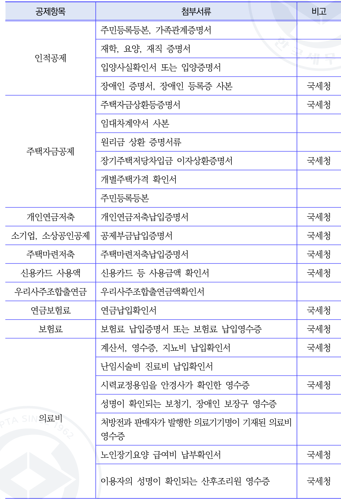
<<BLOCKEND>>
elementId: 369
제
1장
근로소득
연말정산(이론편)
<<BLOCKEND>>
elementId: 370
제2장
근로소득
연말정산(실전편)
<<BLOCKEND>>
elementId: 371
제3장
연말정산
세액의
계산
제4장
근로소득자의
연말정산
후
4대보험
정산
<<BLOCKEND>>
elementId: 372
131
<<BLOCKEND>>
elementId: 373
| 공제항목 | 첨부서류 | 비고 |
| --- | --- | --- |
|  | 실손보험금 수령액 자료 | 국세청 |
| 교육비 | 교육비 납입증명서 | 국세청 |
| 교육비 | 수능응시료, 대학입학 전형료 납입 증명서 | 국세청 |
| 교육비 | 취학전아동의 학원비 납입증명서 |  |
| 교육비 | 교복구입 납입증명서 | 국세청 |
| 교육비 | 학자금 대출상환액 확인을 위한 교육비납입증명서 | 국세청 |
| 교육비 | 국외교육비 납입증명서, 재학증명서 |  |
| 기부금 | 정치자금, 고향사랑 기부금 영수증 | 국세청 |
| 기부금 | 기부금 영수증 | 국세청 |
| 주택자금 차입금 이자세액공제 | 미분양주택확인서, 금융기관이 발행한 차입금이자 상환증명서, 매매계약서 및 등기부등본 |  |
| 월세액 | 월세액 · 거주자 간 주택임차차입금 원리금 상환액 소득 · 세액공제 명세서 | 국세청 |
| 월세액 | 주민등록등본 |  |
| 월세액 | 임대차계약서 사본 |  |
| 월세액 | 월세액 지급 증명서류 | 국세청 |
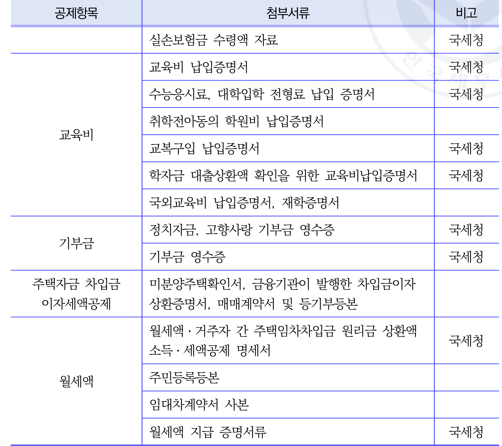
<<BLOCKEND>>
elementId: 374
※ 소득 · 세액공제 항목에 따라 필요한 '주민등록등본'은 1장만 제출할 수 있음
※ 동일한 원천징수의무자에게 제출한 증명서류에 변동이 없는 경우 다음연도부터는
제출하지 않을 수 있음
※ 인터넷을 이용한 첨부서류 발급
주민등록 등본 등 : 정부민원포탈 정부24 (www.gov.kr)
건물등기부등본 : 대한민국 법원 인터넷등기소 (www.iros.go.kr)
개별(공동)주택가격 확인 : 국토교통부 부동산공시가격알리미
(www.realtyprice.kr:447/)
가족관계등록부 : 대한민국 법원 전자가족관계등록시스템 (efamily.scourt.go.kr)
<<BLOCKEND>>
elementId: 375
연말정산
세무
132
<<BLOCKEND>>
elementId: 376
196
<<BLOCKEND>>
elementId: 377
제2장 근로소득 연말정산(실전편)
<<BLOCKEND>>
elementId: 378
03 편리한 연말정산
<<BLOCKEND>>
elementId: 379
1) 편리한 연말정산 개요
<<BLOCKEND>>
elementId: 380
원천징수의무자가 간편제출 서비스를 이요하는 경우 근로자는 편리한 연말정산 서비스에
서 소득 세액공제신고서를 전산작성하여 온라인으로 원천징수의무자에게 간편하게 제출
할 수 있다
<<BLOCKEND>>
elementId: 381
홈택스 접근 경로
<<BLOCKEND>>
elementId: 382
① 원천징수의무자(회사), 세무대리인 : 국세청 홈택스 인증서 로그인 → 장려금 · 연말정산· 전
자기부금 → 편리한 연말정산 → 공제신고서 작성 관리
② 근로자 : 국세청 홈택스 인증서 로그인 → 장려금 · 연말정산 · 전자기부금 → 편리한 연말정산
→ (근로자용) 공제신고서 작성하기
<<BLOCKEND>>
elementId: 383
2) 근로자의 연말정산 기초자료 입력
<<BLOCKEND>>
elementId: 384
- 편리한 연말정산 서비스를 이용하여 근로자에게 연말정산 서류를 간편제출 받기 위해
서는 먼저 회사가 연말정산 기초자료를 등록해야 한다.
- 회사는 성명, 주민등록번호, 총급여, 연금보험료, 보험료, 비과세 항목, 감면기간 및
감면대상, 기납부 소득세 등을 등록하여야 한다.
<<BLOCKEND>>
elementId: 385
홈택스 접근 경로 : 국세청 홈택스 인증서 로그인 → 장려금 · 연말정산 · 전자기부금 → 편리한
연말정산 → 근로자 기초자료 등록
<<BLOCKEND>>
elementId: 386
제3장
연말정산
세액의
계산
제4장
근로소득자의
연말정산
후
4대보험
정산
<<BLOCKEND>>
elementId: 387
제
1장
근로소득
연말정산(이론편)
<<BLOCKEND>>
elementId: 388
133
<<BLOCKEND>>
elementId: 389
제2장
근로소득
연말정산(실전편)
<<BLOCKEND>>
elementId: 390
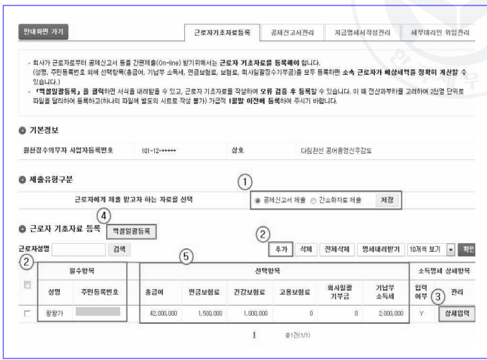
*안내화면 가기 근로자기초자료등록 공제신고서관리 지급명세서작성관리 세무대리인 위임관리
회사가 근로자로부터 공제신고서 등을 간편제출(On-line) 받기위해서는 근로자 기초자료를 등록해야 합니다.
(성명, 주민등록번호 외에 선택항목(총급여, 기납부 소득세, 연금보험료, 보험료, 회사일괄장수기부금)를 모두 등록하면 소속 근로자가 예상세액을 정확히 계산할 수
있습니다.)
+ 「엑셀일괄등록」 을 클릭하면 서식을 내려받을 수 있고, 근로자 기초자료를 작성하여 오류 검증 후 등록할 수 있습니다. 이 때 전산과부하를 고려하여 2천명 단위로
파일을 달리하여 등록하고(하나의 파일에 별도의 시트로 작성 불가) 가급적 1월말 이전에 등록하여 주시기 바랍니다.
� 기본정보
원천징수의무자 사업자등록번호 101-12-**** 상호 다짐완선 공어용영신우감도
제출유형구분 ①
근로자에게 제출 받고자 하는 자료를 선택 o 공제신고서제출 간소화자료제출 저장
4
0 근로자 기초자료 등록 엑셀일괄등록 ②
근로자성명 검색 추가 삭제 전체삭제 명세내려받기 10개씩 보기
5
②
필수항목 선택항목 소득명세 상세항목
□ 회사일괄 기납부 입력
성명 주민등록번호 총급여 연금보험료 건강보험료 고용보험료 ③ 관리
기부금 소득세 여부
□ 왕왕가 42,000,000 1,500,000 1,000,000 0 0 2,000,000 Y 상세입력
1 총1건(1/1)*
<<BLOCKEND>>
elementId: 391
- 근로자에게 간소화자료만 제출받고자 할 경우에는 간소화 자료 제출을 선택하고 간소
화자료와 공제신고서 두 가지 모두 제출 받고자 할 경우에는 공제신고서 제출을 선택
합니다.
<<BLOCKEND>>
elementId: 392
- 상세입력, 엑셀일괄등록에서 근로자 상세항목을 입력할 수 있다. 종전근무처 자료가
있는 경우 주현근무처 자료를 먼저 등록 후 종전근무처 자료를 등록하여야 한다.
<<BLOCKEND>>
elementId: 393
① 상세입력
<<BLOCKEND>>
elementId: 394
- 입력항목으로 주(현)근무지, 종(전)근무지, 근무기간, 총급여, 기납부세액, 4대보험
료, 비과세 및 감면 등을 입력하여야 한다.
<<BLOCKEND>>
elementId: 395
연말정산
세무
134
<<BLOCKEND>>
elementId: 396
196,
<<BLOCKEND>>
elementId: 397
제2장 근로소득 연말정산(실전편)
<<BLOCKEND>>
elementId: 398
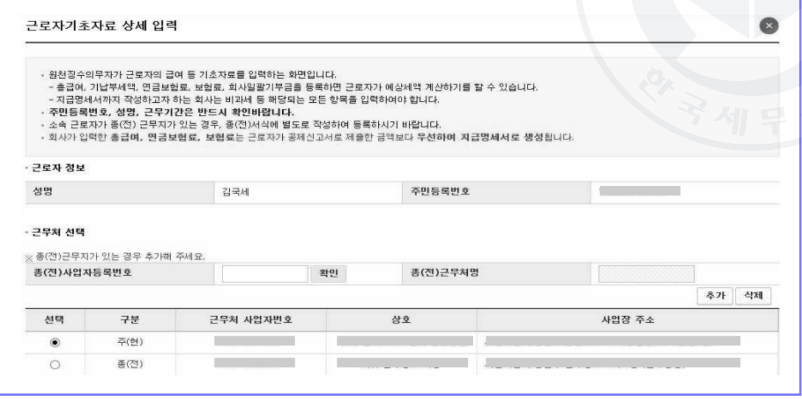
*근로자기초자료 상세 입력
· 원천장수의무자가 근로자의 급여 등 기초자료를 입력하는 화면입니다.
- 출급여, 기납부세액, 연금보험료, 보험료, 회사일괄기부금을 등록하면 근로자가 예상세액 계산하기를 할 수 있습니다.
= 지급명세서까지 작성하고자 하는 회사는 비과세 등 해당되는 모든 항목을 입력하여야 합니다.
주민등록번호, 성명, 근무기간은 반드시 확인바랍니다.
· 소속 근로자가 종(전) 근무지가 있는 경우, 종(전)서식에 별도로 작성하여 등록하시기 바랍니다.
. 회사가 입력한 총급여, 연금보험료, 보험료는 근로자가 공제신고서로 제출한 금액보다 우선하여 지급명세서로 생성됩니다.
근로자 정보
성명 김국세 주민등록번호
근무처 선택
※ 종(전)근무지가있는 경우 추가해 주세요.
종(전)사업자등록번호 확인 종(전)근무처명
추가 삭제
선택 구분 근무처 사업자번호 상호 사업장 주소
◈ 주(현)
○ 종(전)*
<<BLOCKEND>>
elementId: 399
② 엑셀 일괄등록
<<BLOCKEND>>
elementId: 401
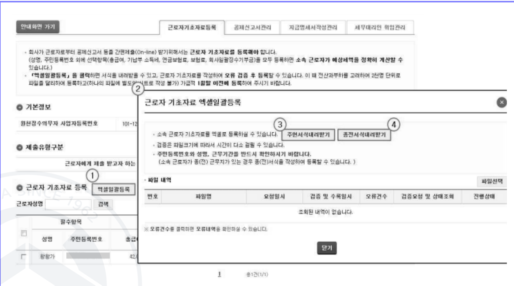
*안내화면 가기 근로자기초자료등록 공제신고서관리 지급명세서작성관리 세무대리인 위임관리
· 회사가 근로자로부터 공제신고서 등을 간편제출(On-ine) 받기위해서는 근로자 기초자료를 등록해야 합니다.
(성명, 주민등록번호 외에 선택항목(총급여, 기납부 소득세, 연급보험료, 보험료, 회사일괄장수기부금)을 모두 등록하면 소속 근로자가 예상세액을 정확히 계산할 수
있습니다.)
· 「역셈일괄등록」 을 클릭하면 서식을 내려받을 수 있고, 근로자 기초자료를 작성하여 오류 검증 후 등록할 수 있습니다. 이 때 전산과부하를 고려하여 2천명 단위로
파일줄 달리하여 등록하고(하나의 파일에 별도92
트로 작성 불가) 가급적 1월말 이전에 등록하여 주시기 바랍니다.
근로자 기초자료 엑셀일괄등록
� 기본정보
원천징수의무자 사업자등록번호 101-12 3
· 소속 근로자기초자료를 엑셀로 등록하실 수 있습니다. 주현서식내려받기 종전서식내려받기
제출유형구분 · 검증은 파일크기에 따라서 시간이 다소 걸릴 수 있습니다.
4 주민등록번호와 성명, 근무기간을 반드시 확인하시기 바랍니다.
근로자에게 제출 받고자 하는 (소속 근로자가 종(전) 근무지가 있는 경우 종(전)서식을 작성하여 등록할 수 있습니다. J
파일 내역 파일선택
근로자 기초자료 등록 엑셀일괄등록
번호 파일명 요청일시 검증 및 수록일시 오류건수 검증요청및 상태조회 진행상태
근로자성명 검색
조회된 내역이 없습니다.
필수항목
※오류건수증 클릭하면 오류내역을 확인하실 수 있습니다.
□
성명 주민등록번호 출급
닫기
□ 왕왕가
! 총1건(1/1)*
#### - 엑셀서식을 내려받아 근로자 기초자료를 작성할 수 있다. 서식이 다르거나 임의로
서식을 바꿀 경우 오류가 발생하여 주의하여야 한다.
- 검증 후 오류가 없으면 저장완료 상태로 변경되며, 오류가 한 건이라도 있을 경우
등록되지 않으니 오류 수정 후 다시 등록해야 한다.
<<BLOCKEND>>
elementId: 402
제2장
근로소득
연말정산(실전편)
<<BLOCKEND>>
elementId: 403
제
1장
근로소득
연말정산(이론편)
<<BLOCKEND>>
elementId: 404
제3장
연말정산
세액의
계산
제4장
근로소득자의
연말정산
후
4대보험
정산
<<BLOCKEND>>
elementId: 405
135
<<BLOCKEND>>
elementId: 406
엑셀 일괄등록 양식(주현근무처)
<<BLOCKEND>>
elementId: 407
★실제 일괄등록할 DATA는 7행부터 입력하여야 합니다. 최대 5,000건까지 입력이 가능하며, 5,000건이후 자료는 다른 엑셀파일로 추가 가능합니다.
★임의로 행을 추가하거나 삭제하는 경우 파일을 제대로 읽지 못하는 경우가 있으므로, 주어진 양식안에 반드시 작성을 하시기 바랍니다.
★주민등록번호와 성명을 반드시 확인하시기 바랍니다.
★종(전)근무처가 있는 근로자인 경우에는 종(전)근무처 등록용 엑셀파일을 이용하시기 바랍니다.
<<BLOCKEND>>
elementId: 408
근무기간 소득명제
<<BLOCKEND>>
elementId: 409
성명 주민등록번호 종사업장 (지금명세서의 주식매수선택권 우리사주조합 임원회직소득금액
<<BLOCKEND>>
elementId: 410
사업자단위과세자 중급여(7)
<<BLOCKEND>>
elementId: 411
종교관련
<<BLOCKEND>>
elementId: 412
종사자 여부 시작일자 종료일자 급여 상여 인정상여 직무발명보상금
<<BLOCKEND>>
elementId: 413
일련번호 21번항목 행사이익 연출금 한도초과액
<<BLOCKEND>>
elementId: 414
근로소득자의 성명을 업
<<BLOCKEND>>
elementId: 415
력합니다. 근로소득자의 주민등
<<BLOCKEND>>
elementId: 416
최대 30bytes(한글10글 록변호를 입력합니다.
<<BLOCKEND>>
elementId: 417
사업자단위과세자가
<<BLOCKEND>>
elementId: 418
종교관련 종사자 여 '어'일경우만 입력함 날짜형태의 데 날짜형태의 데
<<BLOCKEND>>
elementId: 419
자)까지만 처리됩니다. (숫자13자리)
<<BLOCKEND>>
elementId: 420
부를 입력합니다. 니다. 이터를 입력할 이터를 입력합 숫자와 공백만 숫자와 공백만 숫자와 공백만 숫자와 공백만 숫자와 공백만 숫자와 공백만 숫자와 공백만 입력 숫자와 공백만
<<BLOCKEND>>
elementId: 421
예) 여일때 1 숫자와 공백만 입력 니다. 니다. 입력가능합니다. 입력가능합니다. 입력가능합니다. 입력가능합니다. 입력가능합니다. 입력가능합니다. 가능합니다. 입력가능합니다.
<<BLOCKEND>>
elementId: 422
예) 홍길동
<<BLOCKEND>>
elementId: 423
부일때2 가능합니다. 예)2022-01-01 예:2022-12-31
<<BLOCKEND>>
elementId: 424
예) 1-9999
<<BLOCKEND>>
elementId: 425
홍길동 교 2022-01-01 2022-12-31 50,000,000 50,000,000
<<BLOCKEND>>
elementId: 426
③ 세무대리인의 근로자 기초자료 등록
<<BLOCKEND>>
elementId: 427
- 수임업체의 근로자 기초자료를 선택하여 세무대리인이 직접 등록도 가능하다
<<BLOCKEND>>
elementId: 428
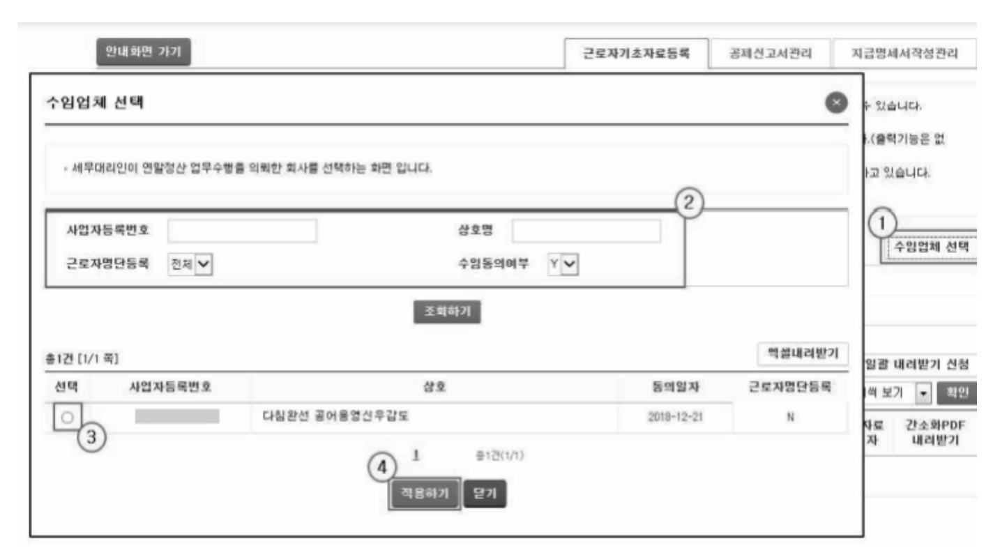
*안내화면 가기 근로자기초자료등록 공제신고서관리 지급명세서작성관리
수임업체 선택 있습니다.
(출력기능은 없
세무대리인이 연말정산 업무수병출 의뢰한 회사를 선택하는 화면 입니다. 고 있습니다.
2
사업자등록번호 상호명 ①
수임업체 선택
근로자명단등록 전체 수임동의여부
조회하기
총1건[1/1 쪽] 엑셀내려받기
일괄 내려받기 신청
선택 사업자등록번호 상호 동의일자 근로자명단등록 썩 보기 확인
다침완선 공어용영신우감도 2018-12-21 N
자료 간소화PDF
자 내려받기
중1건(1/1)
적용하기 닫기*
<<BLOCKEND>>
elementId: 429
3) 공제신고서 관리
<<BLOCKEND>>
elementId: 430
연말정산
세무
<<BLOCKEND>>
elementId: 431
근로자가 간편제출을 통해 제출한 공제신고서 또는 연말정산 간소화에서 선택하여 제출
한 자료 내용을 확인하고 다운로드를 받을 수 있다.
<<BLOCKEND>>
elementId: 432
136
<<BLOCKEND>>
elementId: 434
제2장 근로소득 연말정산(실전편)
<<BLOCKEND>>
elementId: 435
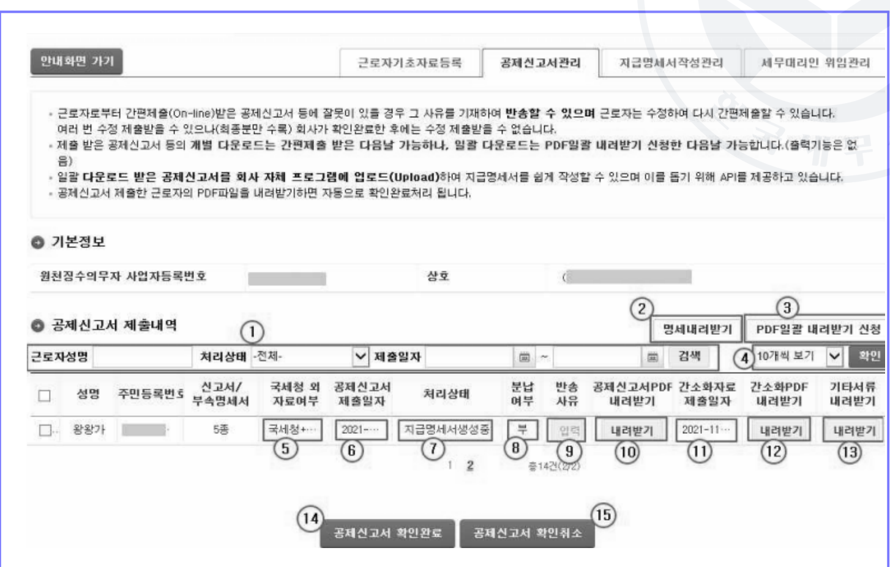
*안내화면 가기 근로자기초자료등록 공제신고서관리 지급명세서작성관리 세무대리인 위임관리
· 근로자로부터 간편제 출(On-line)받은 공제신고서 등에 잘못이 있을 경우 그 사유를 기재하여 반송할 수 있으며 근로자는 수정하여 다시 간편제출할 수 있습니다.
여러 번 수정 제출받을 수 있으나(최종분만 수록) 회사가 확인완료한 후에는 수정 제출받을 수 없습니다.
· 제출 받은 공제신고서 등의 개별 다운로드는 간편제출 받은 다음날 가능하나, 일괄 다운로드는 PDF일괄 내려받기 신청한 다음날 가능합니다.(출력기능은없
음)
· 일괄 다운로드 받은 공제신고서를 회사 자체 프로그램에 업로드(Upload)하여 지급명세서를 쉽게 작성할 수 있으며 이를 돕기 위해 API를 제공하고 있습니다.
· 공제신고서 제출한 근로자의 PDF파일을 내려받기하면 자동으로 확인완료처리 됩니다.
� 기본정보
원천징수의무자 사업자등록번호 상호
3
O 공제신고서 제출내역 명세내려받기 PDF일괄 내려받기 신청
①
근로자성명 처리상태 -전체- V 제출일자 国 = 검색 ④ 10개씩보기 확인
신고서/ 국세청 외 공제신고서 분납 반송 공제신고서PDF 간소화자료 간소화PDF 기타서류
□ 성명 주민등록번호 처리상태
부속명세서 자료여부 제출일자 여부 사유 내려받기 제출일자 내려받기 내려받기
□· 왕왕가 5종 국세청+·· 2021···· 지급명세서생성중 부 입력 내려받기 2021-11- 내려받기 내려받기
⑤ ⑥ 7 ⑧ ⑨ ⑩ ⑪ ⑫ ⑬
2 총14건(2/2)
14 15
공제신고서 확인완료 공제신고서 확인취소*
#### 196
<<BLOCKEND>>
elementId: 436
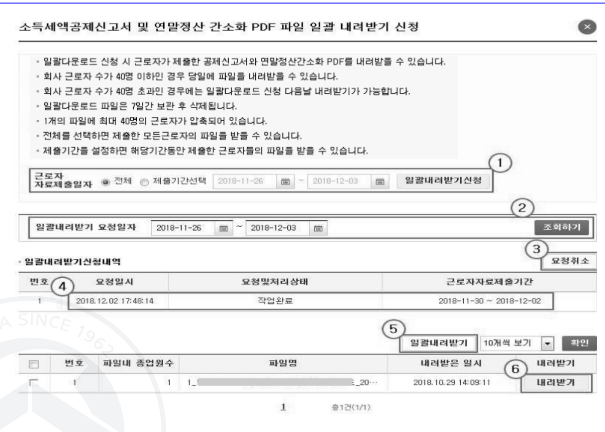
*소득세액공제신고서 및 연말정산 간소화 PDF 파일 일괄 내려받기 신청
· 일괄다운로드 신청 시 근로자가 제출한 공제신고서와 연말정산간소화 PDF를 내려받을 수 있습니다.
· 회사 근로자 수가 40명 이하인 경우 당일에 파일을 내려받을 수 있습니다.
. 회사 근로자 수가 40명 초과인 경우에는 일괄다운로드 신청 다음날 내려받기가 가능합니다.
· 일팔다운로드 파일은 7일간 보관 후 삭제됩니다.
· 1개의 파일에 최대 40명의 근로자가 압축되어 있습니다.
· 전체를 선택하면 제출한 모든근로자의 파일을 받을 수 있습니다.
· 제출기간을 설정하면 해당기간동안 제출한 근로자들의 파일을 받을 수 있습니다.
1
근로자
전체 제출기간선택 2018-11-26 国 ~ 2018-12-03 - 일괄내려받기신청
자료제출일자
2
일괄내려받기 요청일자 2018-11-26 国 ~ 2018-12-03 - 조회하기
③
· 일괄내려받기신청내역 요청취소
번호 ④ 요청일시 요청및처리상태 근로자자료제출기간
2018. 12.02 17:48:14 작업완료 2018-11-30 for 2018-12-02
5
일괄내려받기 10개씩 보기 확인
내려받기
□ 번호 파일내 종업원수 파일명 내려받은 일시 6
□ _20ml 2018. 10.29 14:09: 11 내려받기
1 총1건(1/1)*
<<BLOCKEND>>
elementId: 437
제2장
근로소득
연말정산(실전편)
<<BLOCKEND>>
elementId: 438
제
1장
근로소득
연말정산(이론편)
<<BLOCKEND>>
elementId: 439
제3장
연말정산
세액의
계산
제4장
근로소득자의
연말정산
후
4대보험
정산
<<BLOCKEND>>
elementId: 440
137
<<BLOCKEND>>
elementId: 441
|  |  |
| --- | --- |
|  | 4) 근로자가 이용할 수 있는 서비스 ① 공제신고서 작성하기 연말정산간소화에서 근로자 본인과 부양가족의 공제대상 자료를 선택한 후 편리한 연말정산의 '공제신고서 작성하기'를 통해 공제신고서를 작성할 수 있다. - 1단계 : 근무처와 세대주 여부 등을 입력한다. 원천징수의무자가 미리 근로자의 기초자료를 등록한 경우 근무처의 사업자등록번호 등 기본사항을 제공한다. - 2단계 : 기본공제 대상 부양가족을 입력하고 인적공제 및 추가공제 여부를 선택 한다. 공제요건에 유의하여 입력하여야 한다. - 3단계 : 근로자가 연말정산간소화 서비스에서 공제대상으로 선택한 자료는 소득 · 세액공제 신고서에 자동으로 반영되나 그 외에 추가로 수집한 자료는 직접 입력 해야 한다. - 4단계 : 홈택스에서 작성한 소득 · 세액공제 신고서 내용을 확인 후 출력하여 회 사에 제출한다. 간편제출 서비스를 이용하는 원천징수의무자(회사)의 근로자는 온 라인으로 회사에 전송할 수 있다. ② 예상세액 계산하기 - 1단계 : 연말정산간소화 서비스에서 본인과 부양가족의 공제항목을 선택하거나 공제신고서 작성하기' 에서 공제신고서를 작성한다. - 2단계 : 공제대상 부양가족을 확인하고 총급여와 기납부 소득세액 및 기타 공제 항목 등을 입력하면 예상세액이 자동 계산된다. - 3단계 : 최근 3개년간의 총급여, 결정세액, 공제항목별 추이와 유의사항을 확인할 수 있다. ③ 간편제출 1단계 : 근로자가 소득 · 세액공제 신고서 또는 연말정산 간소화 자료를 간편제출 연말정산 하기 위해서는 회사가 먼저 연말정산 기초자료를 편리한 연말정산 서비스에 등록 해야 한다. 세무 - 2단계 : 근로자가 제출처를 선택하고 자료제공 동의 절차를 진행한다. |
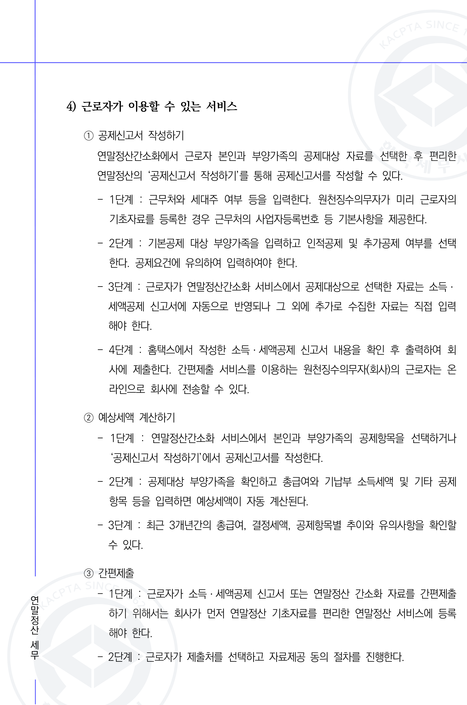
<<BLOCKEND>>
elementId: 442
138
<<BLOCKEND>>
elementId: 443
196
<<BLOCKEND>>
elementId: 444
제2장 근로소득 연말정산(실전편)
<<BLOCKEND>>
elementId: 445
- 3단계 : 근로자가 소득 · 세액공제신고서 전산작성 또는 연말정산 간소화 자료를
선택한 후 회사에 제출한다.
<<BLOCKEND>>
elementId: 446
④ 맞벌이 근로자 절세 안내
<<BLOCKEND>>
elementId: 447
- 1단계 : '공제신고서 작성하기'와 '예상세액 계산하기' 서비스를 모두 이용한 후
'맞벌이 근로자 절세 안내' 서비스 이용이 가능하다
- 2단계 : 절세안내를 받을 근로자는 배우자로부터 자료제공 동의를 받아야 한다.
- 3단계 : 부양가족 공제를 받을 수 있는 모든 경우에 대해 부부의 부담세액 합계
액 변화를 확인할 수 있으며, 근로자는 세부담이 최소화되는 부양가족 선택방법을
안내받을 수 있다.
<<BLOCKEND>>
elementId: 448
04 연말정산 간소화 서비스
<<BLOCKEND>>
elementId: 449
1) 유의사항
<<BLOCKEND>>
elementId: 450
- 연말정산 간소화 서비스에서 제공하는 자료에 대해 근로자 스스로가 소득 · 세액공제
요건 충족여부를 판단해야 한다. 과다하게 소득 · 세액공제를 받은 경우 과소 납부한
세액과 더불어 신고 · 납부지연가산세를 추가 부담하게 된다.
<<BLOCKEND>>
elementId: 451
- 연말정산 간소화 서비스에서 수집되지 않은 자료는 영수증 발급기관에서 직접 증명서
류를 발급받아 회사에 제출해야 한다. (취학전 아동 학원비, 기부금 등)
<<BLOCKEND>>
elementId: 452
2) 연말정산 간소화 이용방법
<<BLOCKEND>>
elementId: 453
① 연말정산 간소화 서비스 개요
<<BLOCKEND>>
elementId: 454
은행, 학교, 병원 등 영수증 발급기관이 전산파일로 제출한 '소득 · 세액공제 증
명자료'를 국세청에서 전산 구축하여 홈택스를 통해 근로자에게 보여주는 서비스
이다.
<<BLOCKEND>>
elementId: 455
근로자는 요건에 맞는 자료만을 선택하여 원천징수의무자(회사)에 제출함으로써
별도의 영수증 제출 없이 증명서류로 인정받을 수 있다.
<<BLOCKEND>>
elementId: 456
제
1장
근로소득
연말정산(이론편)
<<BLOCKEND>>
elementId: 457
제2장
근로소득
연말정산(실전편)
<<BLOCKEND>>
elementId: 458
제3장
연말정산
세액의
계산
제4장
근로소득자의
연말정산
후
4대보험
정산
<<BLOCKEND>>
elementId: 459
139
<<BLOCKEND>>
elementId: 460
② 부양가족의 소득 · 세액공제자료 제공동의 신청
가. 부양가족이 미성년자 자녀인 경우
<<BLOCKEND>>
elementId: 461
- 인증서가 있는 근로자는 별도의 동의 절차가 없더라도 '만 19세 미만인 미성
년자 자녀'의 소득 · 세액 공제 자료를 조회할 수 있다.
<<BLOCKEND>>
elementId: 462
나. 부양가족이 성인인 경우
<<BLOCKEND>>
elementId: 463
- 부양가족이 성인인 경우 해당 가족의 사전 동의가 있어야 소득 · 세액공제 자료
를 조회할 수 있다.
- 홈택스를 통해 본인인증, 온라인, 팩스, 세무서 방문 신청의 방법으로 동의 신
청을 할 수 있다.
<<BLOCKEND>>
elementId: 464
홈택스 접근 경로 : 국세청 홈택스 인증서 로그인 → 장려금 · 연말정산 · 전자기부금 → 연말정
산 간소화 → 부양가족 자료제공 동의 신청
<<BLOCKEND>>
elementId: 465
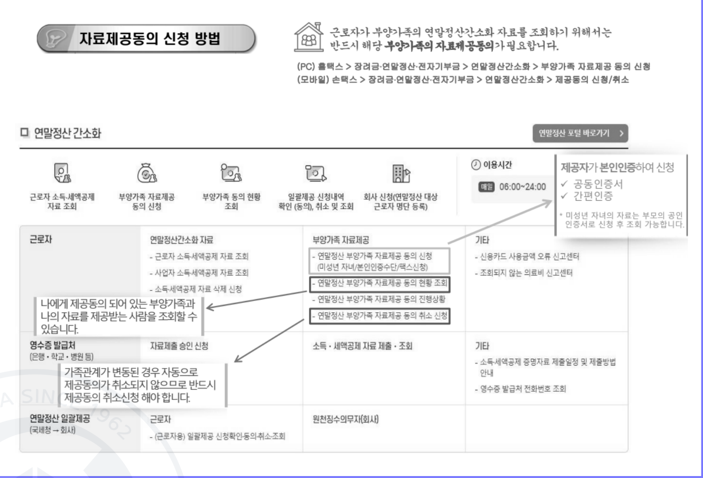
*근로자가 부양가족의 연말정산간소화 자료를 조회하기 위해서는
자료제공동의 신청 방법
반드시 해당 부양가족의 자료제공통의가필요합니다.
(PC) 홈택스> 장려금·연말정산·전자기부금 > 연말정산간소화 > 부양가족 자료제공 동의 신청
(모바일) 손택스> 장려금·연말정산·전자기부금> 연말정산간소화 > 제공동의 신청/취소
□ 연말정산간소화 연말정산 포털 바로가기 >
� 이용시간 제공자가 본인인증하여 신청
�
06:00~24:00 V 공동인증서
근로자 소득·세액공제 부양가족 자료제공 부양가족 동의현황 일괄제공 신청내역 회사신청(연말정산대상 V 간편인증
자료 조회 동의 신청 조회 확인(동의), 취소 및조회 근로자명단 등록)
· 미성년 자녀의 자료는 부모의 공인
인증서로 신청 후 조회 가능합니다.
근로자 연말정산간소화자료 부양가족 자료제공 기타
- 근로자 소득세액공제 자료조회 연말정산 부망가족 자료제공 등의신청 - 신용카드 사용금액오류 신고센터
(미성년 자녀/본인인증수단/맥스신청)
- 사업자 소득세액공제 자료 조회 조회되지 않는 의료비 신고센터
연말정산 부양가족자료제공 등의현황조회
소득·세액공제 자료 삭제 신청
연말정산부양가족자료제공 등의진행상황
나에게제공동의 되어 있는 부양가족과
나의자료를제공받는 사람을 조회할 수 연말정산 부양가족 자료제공 동의 취소 신청
있습니다.
영수증발급처 자료제출 승인신청 소득 · 세액공제자료 제출 ·조회 기타
(은행·학교· 병원등)
- 소득세액공제 증명자료 제출일정및제출방법
가족관계가 변동된 경우자동으로 안내
제공동의가 취소되지 않으므로 반드시 - 영수증발급처 전화번호 조회
제공동의 취소신청해야합니다.
연말정산 일괄제공 근로자 원천징수의무자(회사)
(국세청→회사)
-(근로자용) 일괄제공 신청확인등의취소조회*
<<BLOCKEND>>
elementId: 466
연말정산
세무
<<BLOCKEND>>
elementId: 467
140
<<BLOCKEND>>
elementId: 468
196
<<BLOCKEND>>
elementId: 469
제2장 근로소득 연말정산(실전편)
<<BLOCKEND>>
elementId: 470
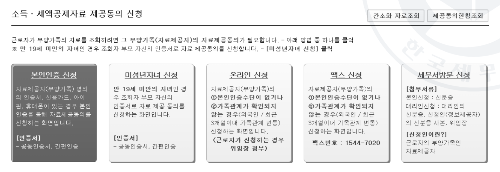
*소득 · 세액공제자료 제공동의 신청 간소화 자료조회 제공동의현황조회
근로자가 부양가족의 자료를 조회하려면 그 부양가족(자료제공자)의 자료제공동의가 필요합니다. - 아래 방법 중 하나를 클릭
※ 만 19세 미만의 자녀인 경우 조회자 부모 자신의 인증서로 자료 제공동의를 신청합니다. - [미성년자녀 신청] 클릭
본인인증 신청 미성년자녀 신청 온라인 신청 팩스신청 세무서방문신청
자료제공자(부양가족) 명의 만 19세 미만의 자녀인 경 자료제공자(부암가족)의 자료제공자(부암가족)의 [첨부서류]
의 인증서, 신용카드, 아이 우 조회자 부모 자신의 ①본인인증수단이 없거나 ①본인인증수단이 없거나 본인신청 : 신분증
핀, 휴대폰이 있는 경우 본인 인증서로 자료 제공 동의를 ②가족관계가 확인되지 ②가족관계가 확인되지 대리인신청 : 대리인의
인증을 통해 자료제공동의를 신청하는 화면입니다. 않는 경우(외국인 / 최근 않는 경우(외국인 / 최근 신분증, 신청인(정보제공자)
신청하는 화면입니다. 3개월이내 가족관계 변동) 3개월이내 가족관계 변동) 의 신분증 사본, 위임장
신청하는 화면입니다. 신청하는 화면입니다.
[신청인이란?]
[인증서] [인증서] (근로자가 신청하는 경우 : 1544-7020 근로자의 부양가족인
팩스번호
- 공동인증서, 간편인증 - 공동인증서, 간편인증 위임장 첨부)
자료제공자*
<<BLOCKEND>>
elementId: 471
③ 연말정산 간소화 서비스 진행 방법
1단계 : 소득 · 세액공제자료 조회하기
<<BLOCKEND>>
elementId: 472
홈택스 접근 경로 : 국세청 홈택스 인증서 로그인 → 장려금 · 연말정산 · 전자기부금 → 연말정
산 간소화 → 근로자 소득 · 세액공제 자료 조회
※ 이용가능한 인증서 : 공동 · 금융인증서, 행정전자서명, 교육기관전자서명, 간편인증(카카오
톡, 통신사 인증서, 페이코, KB모바일 인증서, 삼성패스, 네이버, 신한은행 등)
<<BLOCKEND>>
elementId: 473
- 연말정산 간소화에서 제공하는 전체 소득 세액공제 항목이 나타나며 각 항목을
클릭하면 해당 항목에 대한 지출처별 지출(사용)금액이 조회된다.
- 중도입사자(퇴사자)등 월별 지출내역이 필요한 경우에는 해당 월을 체크하고 조회
해야 한다.
<<BLOCKEND>>
elementId: 474
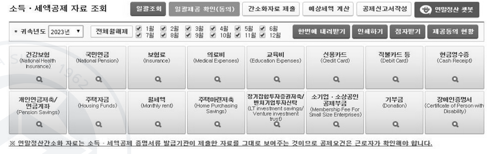
*소득 세액공제 자료 조회 일괄조회 일괄제공 확인(동의) 간소화자료 제출 예상세액 계산 공제신고서작성 � 연말정산 챗봇
한번에 내려받기 인쇄하기 점자받기 제공동의 현황
* 귀속년도 2023년 전체휠해제 V 1월 V 2월 V 3월 V 4월 V 5월 V 6월
7월 V 8월 V 9월 V 10월 V 11월 V 12월
건강보험 국민연금 보험료 의료비 교육비 신용카드 직불카드 등 현금영수증
(NationelHealth (NationalPension) (Insurance) (Medical Expenses) (Education Epenses) (CreditCard) (DebitCard) (CashReceipt)
Insurance)
Q
장기집합투자증권저축/ 소기업 소상공인
개인연금저축/ 주택자금 월세액 주택마련저축
기부금 장애인증명서
벤치기업투자신탁 공제부금 (Certificate ofPersonwith
(Donation)
연금계좌 (Housing Funds) (Monthly rent) (Home Purchasing (LTinvestmentsavings/ (MembershipFee For
(Pension Sevings) Savings) Disability)
Venture investment Small Size Enterprises)
trust)
Q
※연말정산간소화자료는소득·새액공제 증명서류발급기관이 제출한자료를그대로보여주는 것이므로 공제요건은근로자가확인해야 합니다.*
<<BLOCKEND>>
elementId: 475
제2장
근로소득
연말정산(실전편)
<<BLOCKEND>>
elementId: 476
제
1장
근로소득
연말정산(이론편)
<<BLOCKEND>>
elementId: 477
제3장
연말정산
세액의
계산
제4장
근로소득자의
연말정산
후
4대보험
정산
<<BLOCKEND>>
elementId: 478
141
<<BLOCKEND>>
elementId: 479
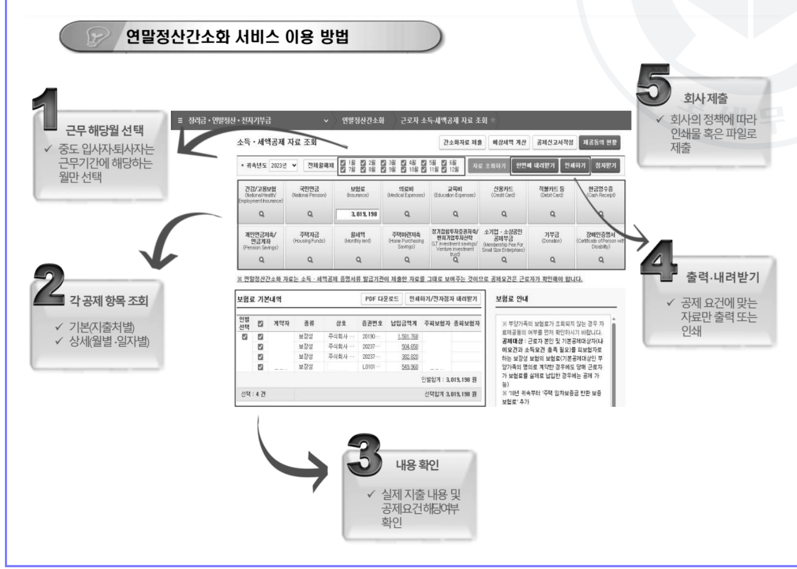
*♡ 연말정산간소화 서비스 이용 방법
회사제출
프 장려금·연말정산·전자기부금 연말정산간소화 근로자소득세액공제자료조회 회사의 정책에 따라
근무 해당월 선택 인쇄물 혹은 파일로
소득 · 세액공제 자료 조회 간소화자로 제출 예상세역 계란 공제신고서적성 제공동의 원
V 중도 입사자·퇴사자는 제출
근무기간에 해당하는 · 귀속년도 2023년 전체콜페페 음성 음내 �� signes 자료조합하기 한번에 내려받기 인쇄하기 점차받
월만 선택
경영/고통보험 OcderaPerson) (hounnoe) SeedcolEgensest To.com/pron 스탠드 정보카드용 현금영수증
국민연금 보험료 의료비 교육비
Q Q 3,019,198 Q 9 Q Q
정계입법투자소환자의 소기업·소상공인 장애인증명
개인연금저축/ 주택차금 물세백 주학파견저축 기부금
현대기업부과산타! 공제부금 (Donation) some iffen
언금계좌 (HouringFunas) Morthyand HomePuthesing
MembershoPopPosPos Pro
moonSent Stappy Deables
Snal Sor Drepter
Q Q Q Q Q Q 0
2 보험로 기본내역 PDF 다운로드 인쇄하기/전자점차 내려받기 보행로 안내 공제 요건에 맞는
연말정산간소화 자료는소득·세약공제 운명서류발급기관이제출한자료를그대로 보여주는것이므로 공제요건은 근로자가 확인력이 합니다. 출력·내려받기
각공제 항목조회
V
자료만 출력 또는
V 기본(지출처벌) 연세 四 계약자 종류 상호 증권번호 납입금액계 주목보험자 종피보험자 x부담가족의 보험료가 조화되지 않는 경우자
V 상세(월별 ·일자별) 5 □ 보유성 주식회사 20150 1581.38 로제공항의 여부를먼저 확인하시기바랍니다. 인쇄
공제대상:근로자본인및기본공제대상자(나
00 보강성 주식회사 20297- 382820 하는 보장성 보험의 보험료(기본공제대상인 부
보장성 주식회사 20237 305-638 피보험자로
이모건과 소득모건 충족필요)를
0 보장성 LITIO! 병원 양가족의 명의로 계약한경우에도 당해 근로자
인발설계: 3,019,190원 가보험료를 실제로 납입한경우에는 공제가
동)
선택:4건 선택합계 3,019,198 # x 기관 복숙부터 주택일차보증금 보증
보험료 추가
내용 확인
V 실제지출 내용 및
공제요건해당여부
확인*
<<BLOCKEND>>
elementId: 480
2단계 : 소득 · 세액공제자료 다운로드 하기
<<BLOCKEND>>
elementId: 481
- 조회 후 '한번에 내려받기' 메뉴를 클릭하여 전자문서를 다운로드하여 원천징수의
무자(회사)에 제출하면 된다.
- 회사는 연말정산 프로그램에 업로드하여 소득 · 세액공제 신고서를 자동작성 할 수
있다.
<<BLOCKEND>>
elementId: 482
3) 연말정산 간소화 자료 조회 시 대표적인 주의사항
<<BLOCKEND>>
elementId: 483
① 연말정산간소화 서비스에서 조회되는 금액이 실제 납부한 건강보험료보다 적게 조회
되는 경우
<<BLOCKEND>>
elementId: 484
회사에 확인하여 별도 영수증 제출 없이 실제 납부한 금액으로 급여에서 공제된
날이 속하는 과세기간에 소득공제가 가능하다.
<<BLOCKEND>>
elementId: 485
연말정산
세무
<<BLOCKEND>>
elementId: 486
② 연말정산간소화 서비스에서 대학교 교육비로 조회되는 금액이 등록금 납입액과 다른
경우
<<BLOCKEND>>
elementId: 487
142
<<BLOCKEND>>
elementId: 488
196
<<BLOCKEND>>
elementId: 489
제2장 근로소득 연말정산(실전편)
<<BLOCKEND>>
elementId: 490
- 대학교 교육비 중 장학금, 한국장학재단 등으로부터 학자금 대출을 받아 납입한
등록금이 포함된 경우 이를 뺀 금액이 공제대상이다.
- 각 대학에서는 학자금 대출과 장학금을 제외한 나머지 금액만을 연말정산 간소화
자료로 제출하고 이 금액으로 공제를 받을 수 있다.
<<BLOCKEND>>
elementId: 491
③ 근로자인 대학생이 학자금 대출을 받아 교육비를 납부한 경우
<<BLOCKEND>>
elementId: 492
- 연말정산간소화 서비스에서는 공제대상 교육비 금액에서 학자금대출을 차감한 금
액이 조회되기 때문에 해당 대학교에서 교육비 납입증명서를 발급받아 공제를 받
아야 한다.
<<BLOCKEND>>
elementId: 493
④ 연말정산간소화 서비스에서 조회되는 주택자금항목에 대한 공제 적용하는 경우
<<BLOCKEND>>
elementId: 494
- 연말정산간소화 서비스에서 조회되는 주택자금 관련 공제항목은 ⓐ 장기주택 저당
차입금이자상환액, ⓑ 주택임차차입금 원리금 상환액, ⓒ 공공주택사업자에게 지
급한 월 납입액이 있다
국민주택 규모, 무주택 세대주, 2주택 소유 여부 등은 소득공제 요건이 검증되는
자료이므로 공제요건을 확인 후 요건을 충족한 경우에만 공제받을 수 있다
- 사전에 안내자료를 통해 요건을 미리 확인하여 요건 여부를 확인하여야 한다.
<<BLOCKEND>>
elementId: 495
⑤ 연말정산간소화 서비스에서 조회되는 주택저당차입금 이자상환액 자료가 조회되어 소
득공제 적용하는 경우
<<BLOCKEND>>
elementId: 496
- 연말정산간소화 서비스에서는 금융기관으로부터 제출받은 자료를 그대로 제공하고
있으므로 반드시 근로자 스스로 공제요건 충족여부를 확인하여야 한다.
<<BLOCKEND>>
elementId: 497
⑥ 배우자의 자동차 보험료가 연말정산간소화 서비스에서 조회되지 않는 경우
<<BLOCKEND>>
elementId: 498
- 부양가족의 보험료가 조회되지 않는 경우 자료제공 동의 여부를 먼저 확인하여야
한다.
<<BLOCKEND>>
elementId: 499
자료제공 동의가 되어 있는데도 조회되지 않는 경우 보험회사를 통해 보험료 납
입증명서 또는 보험료 납입 영수증을 발급받아 원천징수의무자(회사)에 제출하시
면 공제를 받을 수 있다.
<<BLOCKEND>>
elementId: 500
⑦ 연말정산 간소화 서비스에서 신용카드, 현금영수증으로 구매한 중고생 자녀 교복구입
비가 조회되지 않는 경우
<<BLOCKEND>>
elementId: 501
제
1
장
근로소득
연말정산(이론편)
<<BLOCKEND>>
elementId: 502
제3장
연말정산
세액의
계산
제4장
근로소득자의
연말정산
후
4대보험
정산
<<BLOCKEND>>
elementId: 503
제2장
근로소득
연말정산(실전편)
<<BLOCKEND>>
elementId: 504
143
<<BLOCKEND>>
elementId: 505
- 중고등학교 학생의 교복구입비가 조회되지 않는 경우 자료제공 동의 여부를 먼저
확인하셔야 한다.
<<BLOCKEND>>
elementId: 506
- 자료제공 동의가 되어 있는데도 조회되지 않는 경우 교복판매점을 통해 영수증을
발급받아 원천징수의무자(회사)에 제출하시면 공제를 받을 수 있다.
<<BLOCKEND>>
elementId: 507
⑧ 본인의 의료비 내역이 국세청에 제출되는 것을 원하지 않는 경우
<<BLOCKEND>>
elementId: 508
- 환자가 사전에 '의료비 세액공제증명서류 제출 제외 신청서'를 의료기관에 제출한
<<BLOCKEND>>
elementId: 509
경우 국세청에 의료비 자료를 제출하지 않는다.
<<BLOCKEND>>
elementId: 510
⑨ 나의 연말정산 간소화 자료가 누구에게 제공되는지 확인할 수 있는 방법은
<<BLOCKEND>>
elementId: 511
- 국세청 홈택스 → 장려금 · 연말정산 · 전자기부금 → 연말정산 간소화 → 제공동의
현황조회
<<BLOCKEND>>
elementId: 512
⑩ 자료제공 동의를 하였는데 이혼 등으로 가족관계가 변동되어 자료제공을 할 필요가
<<BLOCKEND>>
elementId: 513
없는 경우
<<BLOCKEND>>
elementId: 514
- 자료제공 동의를 한 부양가족이 취소 신청을 하여야 하며, 홈택스 본인인증, 팩
<<BLOCKEND>>
elementId: 515
스, 세무서 방문을 통해 취소신청서를 제출하면 된다.
<<BLOCKEND>>
elementId: 516
⑪ 아버지에게 자료제공 동의를 하긴 했는데 아버지에게 나의 연말정산 간소화 자료중
의료비, 신용카드등 일부항목만 조회하게 하는 경우
<<BLOCKEND>>
elementId: 517
- [ 홈택스 로그인 → 장려금 · 연말정산 · 전자기부금 → 연말정산 간소화 → 소득
· 세액공제 자료삭제 신청 ] 의 방식으로 삭제 신청할 수 있다.
<<BLOCKEND>>
elementId: 518
- 한번 삭제된 자료는 다시 복구할 수 없으며, 이미 삭제한 자료가 필요한 경우에는
영수증 발급기관에서 소득 · 세액공제 증명서류를 직접 발급받아 회사로 제출해야
한다.
<<BLOCKEND>>
elementId: 519
4) 연말정산 간소화 일괄제공 서비스
<<BLOCKEND>>
elementId: 520
① 연말정산 간소화자료 일괄제공 서비스 개요
<<BLOCKEND>>
elementId: 521
연말정산
세무
<<BLOCKEND>>
elementId: 522
간소화자료 일괄제공 서비스 제도는 일괄제공을 신청한 회사와 근로자에 대해 성
실신고를 지원해주고 연말정산 편의성을 높이기 위해 도입된 제도이다.
서비스 이용을 희망하는 회사가 선택적으로 신청이 가능하며 소속 근로자 전체가
<<BLOCKEND>>
elementId: 523
144
<<BLOCKEND>>
elementId: 524
196
<<BLOCKEND>>
elementId: 525
제2장 근로소득 연말정산(실전편)
<<BLOCKEND>>
elementId: 526
아닌 일괄제공 서비스를 이용하여 본인(부양가족 포함)의 간소화자료를 국세청이
회사에 직접 제공하는 것을 희망하는 근로자만 신청하면 된다.
<<BLOCKEND>>
elementId: 527
- 근로자의 연말정산 자료를 국세청으로부터 한 번에 제공받게 되어 자료 제출안내,
수집에 따른 시간과 비용이 줄어든다는 장점이 있다.
<<BLOCKEND>>
elementId: 528
② 연말정산 간소화자료 일괄제공 서비스 진행 방법
<<BLOCKEND>>
elementId: 529
1단계 : 근로자 명단 등록 (24.11.30.까지)
<<BLOCKEND>>
elementId: 530
- 회사는 연말정산 대상 근로자 명단(일용직, 중도퇴사자 제외)을 24.10.31 ~ 11.
30. 중 홈택스에 등록해야 하며 25.1.14.까지 신규 등록, 수정이 가능하다.
<<BLOCKEND>>
elementId: 531
홈택스 접근 경로 : 국세청 홈택스 로그인 → 장려금 · 연말정산 · 전자기부금 → 연말정산 간소화
→ 연말정산 일괄제공 → (회사용)연말정산 대상 근로자 명단등록
<<BLOCKEND>>
elementId: 532
- 연말정산 전년도 명단 불러오기 기능을 통해 재등록, 수정 등이 가능하며 엑셀서
식을 작성하여 업로드 하는 방법도 가능하다.
<<BLOCKEND>>
elementId: 533
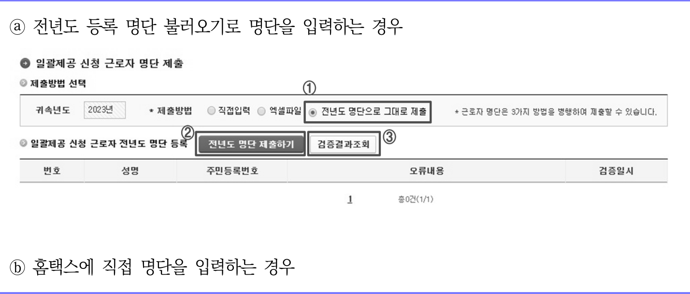
*ⓐ 전년도 등록 명단 불러오기로 명단을 입력하는 경우
일괄제공 신청 근로자 명단 제출
� 제출방법 선택
①
귀속년도 2023년 * 제출방법 직접입력 엑셀파일 ⊙ 전년도 명단으로 그대로 제출 · 근로자 명단은 3가지 방법을 병행하여 제출할 수 있습니다.
③
� 일괄제공 신청 근로자 전년도 명단 등록 전년도 명단 제출하기 검증결과조회
번호 성명 주민등록번호 오류내용 검증일시
1 총0건(1/1)
ⓑ 홈택스에 직접 명단을 입력하는 경우*
<<BLOCKEND>>
elementId: 534
제3장
<<BLOCKEND>>
elementId: 535
연말정산
<<BLOCKEND>>
elementId: 536
세액의
<<BLOCKEND>>
elementId: 537
계산
<<BLOCKEND>>
elementId: 538
제
1장
근로소득
연말정산(이론편)
<<BLOCKEND>>
elementId: 539
제2장
근로소득
연말정산(실전편)
<<BLOCKEND>>
elementId: 540
제4장
근로소득자의
연말정산
후
4대보험
정산
<<BLOCKEND>>
elementId: 541
145
<<BLOCKEND>>
elementId: 542
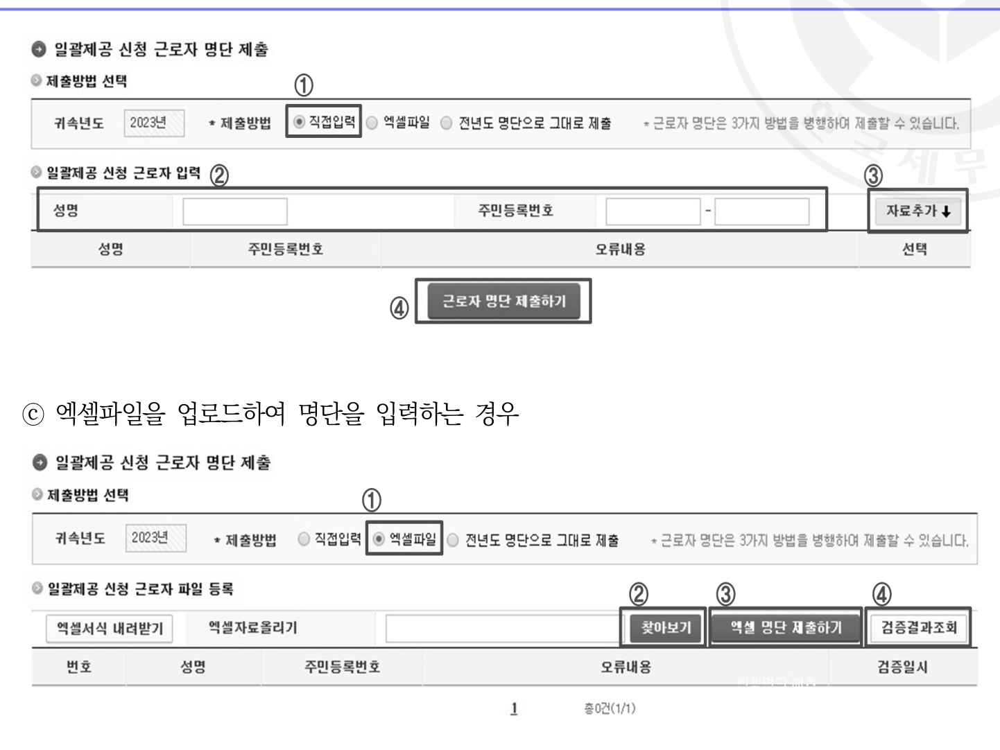
*� 일괄제공 신청 근로자 명단 제출
· 제출방법 선택 ①
귀속년도 2023년 제출방법 ◈ 직접입력 엑셀파일 전년도 명단으로 그대로 제출 · 근로자 명단은 3가지 방법을 병행하여 제출할 수 있습니다.
� 일괄제공 신청 근로자 입력 ② ③
성명 주민등록번호 자료추가↓
성명 주민등록번호 오류내용 선택
근로자 명단 제출하기
ⓒ 엑셀파일을 업로드하여 명단을 입력하는 경우
③ 일괄제공 신청 근로자 명단 제출
③ 제출방법 선택
귀속년도 2023년 * 제출방법 직접입력 ⊙ 엑셀파일 ○ 전년도 명단으로 그대로 제출 7 근로자 명단은 3가지 방법을 병행하여 제출할 수 있습니다.
③ 일괄제공 신청 근로자 파일 등록 ② ③ ④
엑셀서식 내려받기 엑셀자료올리기 찾아보기 엑셀 명단 제출하기 검증결과조회
번호 성명 주민등록번호 오류내용 검증일시
1 총0건(1/1)*
<<BLOCKEND>>
elementId: 543
- 회사 기장업무를 수임한 세무대리인에게 연말정산 업무를 위임한 경우 회사는 연
말정산 대상 명단을 다운로드 받아 세무대리인에게 간소화자료를 제공할 수 있다.
<<BLOCKEND>>
elementId: 544
홈택스 접근 경로 : 국세청 홈택스 로그인 → 장려금 · 연말정산 · 전자기부금 → 연말정산 간소
화 → 연말정산 일괄제공 → (회사용)연말정산 대상 근로자 명단내역 확인 및 관리
<<BLOCKEND>>
elementId: 545
연말정산
세무
146
<<BLOCKEND>>
elementId: 546
196
<<BLOCKEND>>
elementId: 547
제2장 근로소득 연말정산(실전편)
<<BLOCKEND>>
elementId: 548
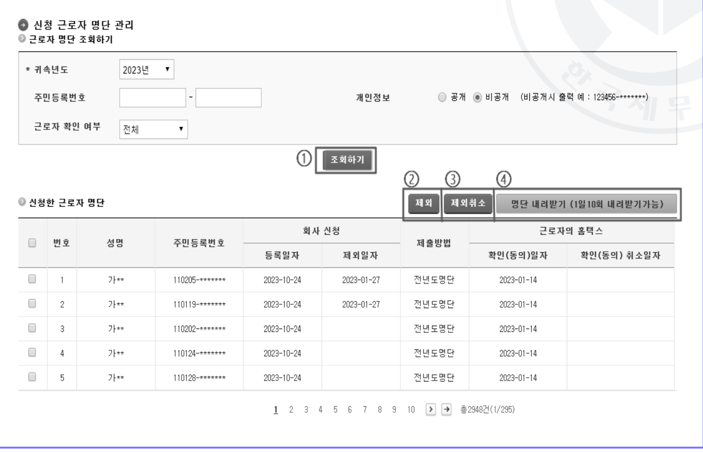
*③ 신청 근로자 명단 관리
③ 근로자 명단 조회하기
* 귀속년도 2023년
주민등록번호 개인정보 공개 비공개 (비공개시출력 예 : 123456-*******)
근로자 확인 여부 전체
조회하기
3 ④
③ 신청한 근로자 명단 제외 제외취소 명단 내려받기 (1일10회 내려받기가능)
회사신청 근로자의 홈텍스
□ 번호 성명 주민등록번호 제출방법
등록일자 제외일자 확인(동의)일자 확인(동의) 취소일자
□ 1 가** 110205- 2023-10-24 2023-01-27 전년도명단 2023-01-14
□ 2 가** 110119-******* 2023-10-24 2023-01-27 전년도명단 2023-01-14
□ 3 가** 110202-****** 2023-10-24 전년도명단 2023-01-14
■ 4 가** 110124-******* 2023-10-24 전년도명단 2023-01-14
□ 5 가** 110128-******* 2023-10-24 전년도명단 2023-01-14
1 2 3 4 5 6 7 8 9 10 총2948건(1/295)*
<<BLOCKEND>>
elementId: 549
2단계 : 자료제공 확인(동의) (25.1.19.까지)
<<BLOCKEND>>
elementId: 550
- 근로자는 24.12.1.부터 25.1.19.까지 홈택스에서 자료가 제공되는 회사와 제공되
는 자료의 범위를 확인(동의)해야 한다.
최초 1회만 확인(동의)하면 퇴직시까지 국세청이 회사에 자료를 제공한다.
- 근로자가 자료 제공에 확인(동의)하는 경우 별도의 절차 없이 부양가족의 간소화
자료도 회사에 간편하게 일괄제공 되나 확인(동의)하지 않는 경우 근로자의 자료
가 제공되지 않는다.
<<BLOCKEND>>
elementId: 551

#### Chart Title: KAPPTA SINCE
Chart Type: pie
|  | KAPPTA SINCE | KAMPTA SINCE |
| --- | --- | --- |
| item_01 | 1982% | 1987% |
<<BLOCKEND>>
elementId: 552
제2장
근로소득
연말정산(실전편)
<<BLOCKEND>>
elementId: 553
제
1장
근로소득
연말정산(이론편)
<<BLOCKEND>>
elementId: 554
제3장
연말정산
세액의
계산
제4장
근로소득자의
연말정산
후
4대보험
정산
<<BLOCKEND>>
elementId: 555
147
<<BLOCKEND>>
elementId: 556
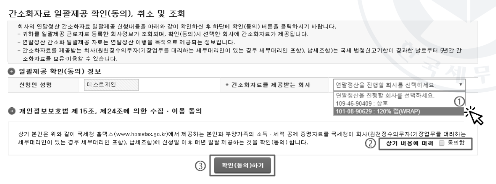
*간소화자료 일괄제공 확인(동의), 취소 및 조회
회사의 연말정산 간소화자료 일괄제공 신청내용을 아래와 같이 확인하신 후 하단에 확인(동의) 버튼을 클릭하시기 바랍니다.
- 귀하를 일괄제공 근로자로 등록한 회사정보가 조회되며, 확인(동의)시 선택한 회사에 간소화자료가제공됩니다.
- 연말정산 간소화 일괄제공 자료는 연말정산 이행을 목적으로 제공되는 정보입니다.
- 간소화자료를 제공받는 회사(원천징수의무자(기장업무를 대리하는 세무대리인이 있는 경우 세무대리인 포함), 납세 조합)는 국세 법정신고기한이 경과한 날로부터 5년간간
소화자료를 보유·이용할 수 있습니다.
일괄제공 확인(동의) 정보
신청인 성명 테스트개인 간소화자료를 제공받는 회사 연말정산을 진행할 회사를 선택하세요.
연말정산을 진행할 회사를 선택하세요.
109-46-90409 : 상호
개인정보보호법 제 15조, 제24조에 의한 수집 · 이용 동의 101-08-90629 120% 랩(WRAP)
상기 본인은 위와 같이 국세청 홈텍스(www.hometax.go.kr)에서 제공하는 본인과 부양가족의 소득 · 세액 공제 증명자료를 국세청이 회사(원천징수의무자(기장업무를 대리하는
세무대리인이 있는 경우 세무대리인 포함), 납세 조합)에 신청일 이후 매년 일괄 제공하는 것을 확인(동의) 합니다. ② 상기 내용에 대해 등 동의할
확인(동의)하기*
<<BLOCKEND>>
elementId: 557
3단계 : 자료 내려받기 (25.1.20.부터)
<<BLOCKEND>>
elementId: 558
- 국세청은 25.1.20.부터 간소화자료 압축파일을 홈택스에서 순차적으로 제공하며,
회사는 이를 내려 받아 업로드 하면 된다.
- 근로자는 일괄제공된 간소화자료 외에 추가할 사항(수동 발급받은 기부금 영수증
등)이 있는 경우 회사에 증빙자료를 제출하면 된다.
<<BLOCKEND>>
elementId: 559
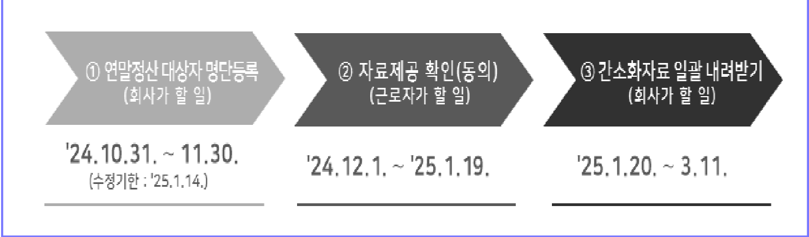
*① 연말정산 대상자 명단등록 ② 자료제공 확인(동의) ③간소화자료 일괄 내려받기
(회사가 할 일) (근로자가 할 일) (회사가 할 일)
'24.10.31. ~ 11.30.
'24.12.1. ~ '25.1.19. '25.1.20. ~ 3.11.
(수정기한 : '25.1.14.)*
<<BLOCKEND>>
elementId: 560
연말정산
세무
148
<<BLOCKEND>>
elementId: 561
KACPTA SINCE 1962
<<BLOCKEND>>
elementId: 562
제3장
<<BLOCKEND>>
elementId: 563
연말정산 세액의 계산
<<BLOCKEND>>
elementId: 564
무 사호
<<BLOCKEND>>
elementId: 565
KACPTA SINCE 1962
<<BLOCKEND>>
elementId: 566
한
<<BLOCKEND>>
elementId: 567
국세무사회
<<BLOCKEND>>
elementId: 568
제3장
<<BLOCKEND>>
elementId: 569
연말정산
<<BLOCKEND>>
elementId: 570
제
1장
근로소득
연말정산(이론편)
제2장
근로소득
연말정산(실전편)
<<BLOCKEND>>
elementId: 571
세액의
<<BLOCKEND>>
elementId: 572
계산
<<BLOCKEND>>
elementId: 573
제4장
근로소득자의
연말정산
후
4대보험
정산
<<BLOCKEND>>
elementId: 574
149
<<BLOCKEND>>
elementId: 575
01 세액계산의 흐름
<<BLOCKEND>>
elementId: 576
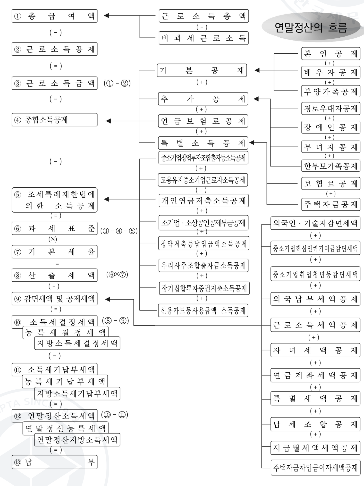
*① 총 급 여 액 근 로 소 득 총 액
(-) 연말정산의 흐름
(-)
비 과 세 근 로 소 득
② 근 로 소 득 공 제
본 인 공 제
(=) (+)
기 본 공 제 배 우 자 공 제
③ 근 로 소 득 금 액 (①-②) (+) (+)
부양가족공제
(-) 추 가 공 제
(+) 경로우대자공제
④ 종합소득공제 연 금 보 험 료 공 제 (+
장 애 인 공 제
(+)
(+)
특 별 소 득 공 제
부 녀 자 공 제
중소기업창업투자조합출자등소득공제 (+)
(-)
(+) 한부모가족공제
고용유지중소기업근로자소득공제
보 험 료 공 제
+ 
⑤ 조세특례제한법에 (+)
개인연금저축소득공제
의 한 소 득 공 제 주 택자금공제
(+)
(=)
소기업·소상공인공제부금공제 외국인 · 기술자감면세액
⑥ 과 세 표 준 (③-④-⑤)
(+)
(x)
청약저축등납입금액소득공제
중소기업핵심인력기여금감면세액
⑦ 기 본 세 율 (+)
(+)
= 우리사주조합출자금소득공제
⑧ 산 출 세 액 (⑥x⑦) (+) 중소기업취업청년등감면세 액
(-) 장기집합투자증권저축소득공제 (+)
⑨ 감면세액 및 공제세액 (+) 외 국 납 부 세 액 공 제
(=) 신용카드등사용금액 소득공제 (+)
⑩ 소득세결정 세 액 (⑧-⑨)
근 로 소 득 세 액 공 제
농 특 세 결 정 세 액
(+)
지방소득세결 정 세 액
자 녀 세 액 공 제
(-)
(+)
⑪ 소득세기납부세액
연 금 계 좌 세 액 공 제
농 특 세 기 납 부 세 액
(+)
지방소득세기납부세액
특 별 세 액 공 제
(=)
(+)
⑫ 연말정산소득세액 (⑩-⑪)
납 세 조 합 공 제
연 말 정 산 농 특 세 액
(+)
연말정산지방소득세 액
(=) 지 급 월 세 액 세 액 공 제
⑬ 납 부
주택자금차입금이자세액공제*
<<BLOCKEND>>
elementId: 577
연말정산
세무
<<BLOCKEND>>
elementId: 578
150
<<BLOCKEND>>