elementId: 0
196
<<SPLIT>>
elementId: 1
제3장 연말정산 세액의 계산
<<SPLIT>>
elementId: 2
제1절 소득공제
<<SPLIT>>
elementId: 3
01 근로소득공제
<<SPLIT>>
elementId: 4
무
<<SPLIT>>
elementId: 5
- 근로소득금액은 총급여에서 근로소득공제금액을 뺀 금액이며, 근로소득공제
금액은 다음과 같이 총급여액 구간에 따라 공제비율을 차등 적용한다. 다만
공제액이 2천만원을 초과하는 경우에는 2천만원을 공제한다.(소득법 제47조)
<<SPLIT>>
elementId: 6
| 총급여(인정상여 포함)액 구간 | 근로소득공제금액 |
| --- | --- |
| 500만원 이하 | 총급여액의 70% |
| 500만원 초과 1,500만원 이하 | 350만원 + (총급여액 - 500만원) x 40% |
| 1,500만원 초과 4,500만원 이하 | 750만원 + (총급여액 - 1,500만원) x 15% |
| 4,500만원 초과 1억원 이하 | 1,200만원 + (총급여액 - 4,500만원) x 5% |
| 1억원 초과 | 1,475만원 + (총급여액 - 1억원) x 2% |
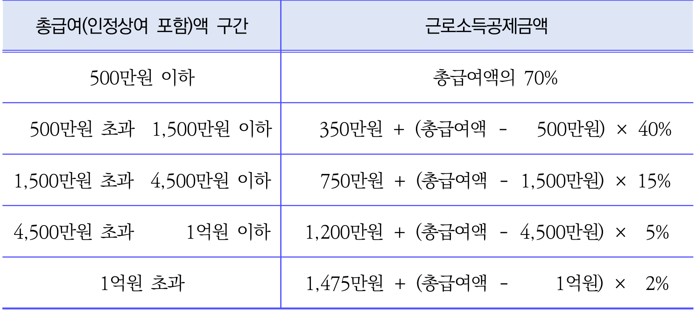

```markdown
| 총급여(인정상여 포함)액 구간          | 근로소득공제금액                                      |
|----------------------------------|------------------------------------------------|
| 500만원 이하                       | 총급여액의 70%                                    |
| 500만원 초과 1,500만원 이하         | 350만원 + (총급여액 - 500만원) × 40%               |
| 1,500만원 초과 4,500만원 이하       | 750만원 + (총급여액 - 1,500만원) × 15%             |
| 4,500만원 초과 1억원 이하           | 1,200만원 + (총급여액 - 4,500만원) × 5%            |
| 1억원 초과                         | 1,475만원 + (총급여액 - 1억원) × 2%                |
```

<<SPLIT>>
elementId: 7
· 과세기간이 1년 미만이거나 과세기간 중 근로기간이 1년 미만인 근로소득이 있는 거주자
의 경우에도 월할계산 적용하지 않음(소득통 47-0···1)
<<SPLIT>>
elementId: 8
· 2인이상으로부터 근로소득을 받는 사람(일용근로자 제외)에 대하여는 그 근로소득의 합계
액을 총급여액으로 하여 공제함
<<SPLIT>>
elementId: 9
비거주자의 근로소득에도 근로소득공제가 적용
일용근로소득공제액은 1일 15만원
<<SPLIT>>
elementId: 10
1962
<<SPLIT>>
elementId: 11
제
1장
근로소득
연말정산(이론편)
제2장
근로소득
연말정산(실전편)
<<SPLIT>>
elementId: 12
제3장
연말정산
세액의
계산
<<SPLIT>>
elementId: 13
제4장
근로소득자의
연말정산
후
4대보험
정산
<<SPLIT>>
elementId: 14
151
<<SPLIT>>
elementId: 15
02 종합소득공제
<<SPLIT>>
elementId: 16
(1) 인적공제
<<SPLIT>>
elementId: 17
- 종합소득이 있는 거주자(자연인) 본인, 배우자 및 생계를 같이하는 부양가족 1인당
연 150만원을 곱하여 계산한 금액을 그 거주자의 해당 과세기간의 종합소득금액에서
공제한다(소득법 50조).
<<SPLIT>>
elementId: 18
| 구분 | 구분 | 대상 | 공제액 |
| --- | --- | --- | --- |
| 인적공제 | 기본공제 | 본인 | 1인당 연 150만원 |
| 인적공제 | 기본공제 | 배우자 | 1인당 연 150만원 |
| 인적공제 | 기본공제 | 부양가족 | 1인당 연 150만원 |
| 인적공제 | 추가공제 | 경로우대자공제 | 1인당 연 100만원 |
| 인적공제 | 추가공제 | 장애인공제 | 1인당 연 200만원 |
| 인적공제 | 추가공제 | 부녀자공제 | 연 50만원 |
| 인적공제 | 추가공제 | 한부모소득공제 | 1인당 연 100만원 |


```markdown
| 구분     | 대상       | 공제액          |
|----------|------------|-----------------|
| 인적공제 | 기본공제   | 본인            | 1인당 연 150만원 |
| 인적공제 | 기본공제   | 배우자          | 1인당 연 150만원 |
| 인적공제 | 기본공제   | 부양가족        | 1인당 연 150만원 |
| 인적공제 | 추가공제   | 경로우대자공제  | 1인당 연 100만원 |
| 인적공제 | 추가공제   | 장애인공제      | 1인당 연 200만원 |
| 인적공제 | 추가공제   | 부녀자공제      | 연 50만원        |
| 인적공제 | 추가공제   | 한부모소득공제  | 1인당 연 100만원 |
```

<<SPLIT>>
elementId: 19
기본공제 대상자 요건
<<SPLIT>>
elementId: 20
| 구 분 | 구 분 | 나이요건 (장애인의 경우 나이 제한 없음) | 소득 요건 | 생계 요건 | 일시 퇴거 |
| --- | --- | --- | --- | --- | --- |
| 근로자 본인 | 근로자 본인 | - | - | - | - |
| 배우자(법정혼인만 인정) | 배우자(법정혼인만 인정) | - | 연간 소득금액 100만원 (근로소득 만 있는 경우 | - | - |
| 부양 가족1) | 직계존속2) | 만 60세 이상 | 연간 소득금액 100만원 (근로소득 만 있는 경우 | 생계를 같이하는 부양가족 (주거형편 별거인정) |  |
| 부양 가족1) | 직계비속 동거입양자3) | 만 20세 이하 | 연간 소득금액 100만원 (근로소득 만 있는 경우 | - |  |
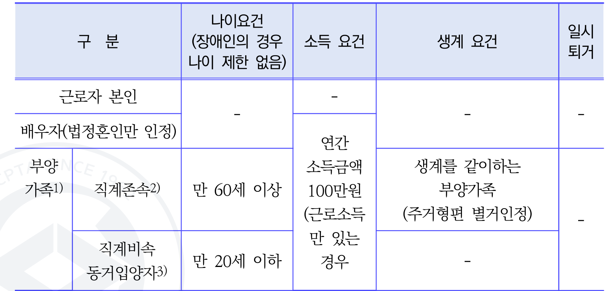

```markdown
| 구분                     | 나이요건 (장애인의 경우 나이 제한 없음) | 소득 요건                          | 생계 요건                               | 일시 퇴거 |
|------------------------|----------------------------------|----------------------------------|--------------------------------------|---------|
| 근로자 본인               | -                                | -                                | -                                    | -       |
| 배우자(법정혼인만 인정)     | -                                | -                                | -                                    | -       |
| 부양가족<sup>1)</sup>      |                                  |                                  |                                      |         |
| 직계존속<sup>2)</sup>      | 만 60세 이상                        | 연간 소득금액 100만원 (근로소득만 있는 경우) | 생계를 같이하는 부양가족 (주거형편 별거인정) | -       |
| 직계비속 동거입양자<sup>3)</sup> | 만 20세 이하                        | 연간 소득금액 100만원 (근로소득만 있는 경우) | 생계를 같이하는 부양가족 (주거형편 별거인정) | -       |

<sup>1)</sup> 부양가족: 직계존속, 직계비속 동거입양자 포함  
<sup>2)</sup> 직계존속: 부모, 조부모 등  
<sup>3)</sup> 직계비속 동거입양자: 자녀, 손자녀 등
```

<<SPLIT>>
elementId: 21
연말정산
세무
<<SPLIT>>
elementId: 22
152
<<SPLIT>>
elementId: 23
제3장 연말정산 세액의 계산
<<SPLIT>>
elementId: 24
| 구 분 | 구 분 | 나이요건 (장애인의 경우 나이 제한 없음) | 소득 요건 | 생계 요건 | 일시 퇴거 |
| --- | --- | --- | --- | --- | --- |
|  | 형제자매④ | 만 20세 이하 만 60세 이상 | 총급여 500만원) 이하 | 주민등록표상 동거가족으로 생계를 같이해야 함 | 인정 |
|  | 기초생활수급자 | 제한 없음 | 총급여 500만원) 이하 | 주민등록표상 동거가족으로 생계를 같이해야 함 | 인정 |
|  | 위탁아동 | 만 18(20)세 미만5) | 총급여 500만원) 이하 | - | - |
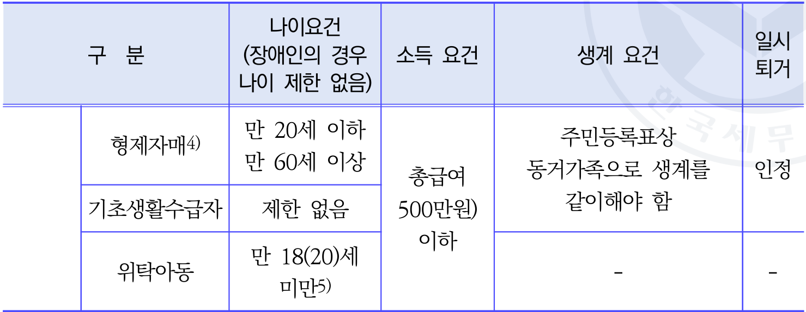

```markdown
| 구분         | 나이요건 (장애인의 경우 나이 제한 없음) | 소득 요건          | 생계 요건                           | 일시 퇴거 |
|--------------|----------------------------------------|--------------------|-------------------------------------|-----------|
| 형제자매④   | 만 20세 이하 만 60세 이상              | 총급여 500만원 이하 | 주민등록표상 동거가족으로 생계를 같이해야 함 | 인정      |
| 기초생활수급자 | 제한 없음                             | 총급여 500만원 이하 | 주민등록표상 동거가족으로 생계를 같이해야 함 | 인정      |
| 위탁아동     | 만 18(20)세 미만⑤                     | 총급여 500만원 이하 | 주민등록표상 동거가족으로 생계를 같이해야 함 | 인정      |
```

<<SPLIT>>
elementId: 25
공제여부는 해당 과세기간 종료일 현재의 상황에 의하며, 과세기간 종료일 전에 사
망 또는 장애가 치유된 경우에는 사망일 전날 또는 치유일 전날의 상황에 따른다.
<<SPLIT>>
elementId: 26
1) 생계요건
<<SPLIT>>
elementId: 27
- 배우자 및 직계비속, 입양자를 제외한 부양가족은 근로자의 주민등록표상 동거가
족으로서 해당 근로자의 주소 또는 거소에서 현실적으로 생계를 같이하여야 함.
다만, 근로자 및 배우자의 직계존속이 주거의 형편에 따라 별거(국내)하고 있는
경우 생계를 같이하는 것으로 본다.
- 외국인 거주자가 본국에 부양가족이 있는 경우 부양사실 입증시 공제 가능(기획재
정부 소득세제과-84, 2010.02.10.)
<<SPLIT>>
elementId: 28
1) 입양된 경우에 있어서 양가 또는 생가의 직계존속과 형제자매, 재혼인 경우 전배우자와의 혼인 중에 출
생한 사람 포함
2) 직계존속(부모, 조부모, 외조부모 등)은 배우자의 직계존속뿐만 아니라 직계존속이 재혼한 경우 그 배우
자(혼인 중임이 입증되는 경우, 사실혼은 제외) 포함되고, 직계존속이 사망한 경우 해당 직계존속의 사
망일 전날을 기준으로 혼인중에 있었음이 증명되는 사람을 포함함
3) 직계비속(자녀, 손자녀, 외손자녀 등)에는 다음의 경우를 포함
<<SPLIT>>
elementId: 29
거주자의 배우자가 재혼한 경우 해당 배우자가 종전의 배우자와의 혼인 중에 출산한 자
<<SPLIT>>
elementId: 30
민법 또는 입양특례법에 따라 입양한 양자 및 사실상 입양상태에 있는 사람으로서 근로자와 생계를
같이하는 자
혼인 외의 자로 입적된 자 포함
- 기본공제대상 직계비속 또는 입양자와 그 배우자가 모두 장애인에 해당하는 경우에는 그 배우자
<<SPLIT>>
elementId: 31
4) 형제자매의 배우자는 제외
5) 6개월(직전 과세기간 포함)이상 직접 양육한 위탁아동(18세 미만)이나 보호기간이 연장된 경우 20세 이
하 위탁아동을 포함
<<SPLIT>>
elementId: 32
제
1
장
근로소득
연말정산(이론편)
제2장
근로소득
연말정산(실전편)
<<SPLIT>>
elementId: 33
제4장
근로소득자의
연말정산
후
4대보험
정산
<<SPLIT>>
elementId: 34
제3장
연말정산
세액의
계산
<<SPLIT>>
elementId: 35
153
<<SPLIT>>
elementId: 36
2) 소득금액 요건
<<SPLIT>>
elementId: 37
- 연간 종합소득금액, 퇴직소득금액, 양도소득금액의 합계액이 연간 100만원(근로소
득만 있는 경우 총급여 500만원) 이하인 경우로서 비과세 소득, 분리과세 소득은
제외한다.
<<SPLIT>>
elementId: 38
적용사례
<<SPLIT>>
elementId: 39
| 소득종류 | 소득종류 | 소득금액 합산 제외사례 |
| --- | --- | --- |
| 종합 소득 | 금융소득(이자, 배당) | 금융소득이 2천만원 이하인 경우(분리과세) |
| 종합 소득 | 사업소득 | - 사업소득 결손 - 주택임대소득이 인당 2천만원 이하로서 분리과세 선택 |
| 종합 소득 | 근로소득 | - 순수 근로소득자로서 총급여액이 500만원 이하 - 일용근로소득 - 육아휴직급여 및 출산전후휴가급여, 실업급여 등 비과세 근로소득 |
| 종합 소득 | 연금소득 | - 공적연금 : 연간 516만원 이하 또는 2001년 이전 불입분을 기초로 수령하는 경우 - 사적연금 : 연간 1,500만원 이하로서 분리과세 선택한 경 우 및 연간 1,500만원 초과로서 15% 세율 분리과세 선택 한 경우 |
| 종합 소득 | 기타소득 | - 복권당첨소득 - 기타소득금액이 300만원 이하로서 분리과세 선택 |
| 퇴직소득 | 퇴직소득 | - 퇴직소득금액이 100만원 이하 |
| 양도소득 | 양도소득 | - 양도소득세 비과세이거나 소득금액 100만원 이하 |
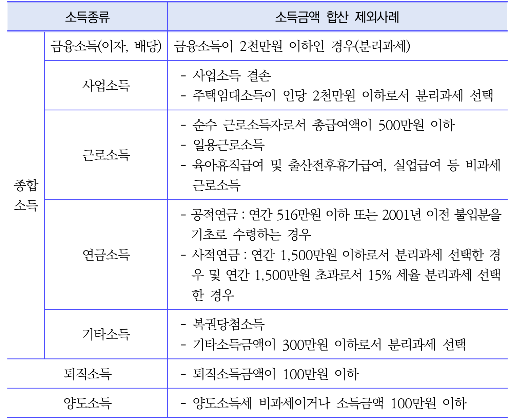

```markdown
| 소득종류         | 소득금액 합산 제외사례                                                                                   |
|------------------|----------------------------------------------------------------------------------------------------------|
| 금융소득(이자, 배당) | 금융소득이 2천만원 이하인 경우(분리과세)                                                                  |
| 종합소득         |                                                                                                          |
| 사업소득         | - 사업소득 결손<br>- 주택임대소득이 인당 2천만원 이하로서 분리과세 선택                                      |
| 근로소득         | - 순수 근로소득자로서 총급여액이 500만원 이하<br>- 일용근로소득<br>- 육아휴직급여 및 출산전후휴가급여, 실업급여 등 비과세 근로소득 |
| 연금소득         | - 공적연금: 연간 516만원 이하 또는 2001년 이전 불입분을 기초로 수령하는 경우<br>- 사적연금: 연간 1,500만원 이하로서 분리과세 선택한 경우 및 연간 1,500만원 초과로서 15% 세율 분리과세 선택한 경우 |
| 기타소득         | - 복권당첨소득<br>- 기타소득금액이 300만원 이하로서 분리과세 선택                                          |
| 퇴직소득         | - 퇴직소득금액이 100만원 이하                                                                             |
| 양도소득         | - 양도소득세 비과세이거나 소득금액 100만원 이하                                                            |
```

<<SPLIT>>
elementId: 40
3) 공제의 적용 방법
<<SPLIT>>
elementId: 41
연말정산
세무
<<SPLIT>>
elementId: 42
- 2인 이상의 공제대상 가족에 해당하는 경우 그 중 선택한 1인의 공제대상 가족으
로 한다.
- 해당 과세기간의 중도에 사망하였거나 외국에서 영주하기 위하여 출국한 거주자의
<<SPLIT>>
elementId: 43
154
<<SPLIT>>
elementId: 44
19
<<SPLIT>>
elementId: 45
제3장 연말정산 세액의 계산
<<SPLIT>>
elementId: 46
공제대상가족으로서 상속인 등 다른 거주자의 공제대상가족에 해당하는 사람에 대
해서는 피상속인 또는 출국한 거주자의 공제대상 가족으로 한다.
<<SPLIT>>
elementId: 48
| 순서 | 내용 |
| --- | --- |
| 1순위 | 거주자의 공제대상 배우자 |
| 2순위 | 공제대상 부양가족의 경우 직전연도에 부양받은 거주자 |
| 3순위 | 해당연도 종합소득이 많은 거주자 |
| 4순위 | 추가 공제대상자가 중복되는 경우에는 기본공제를 하는 거주자 |
**공제대상을 중복신고 하거나 또는 정확히 알 수 없는 경우(소령 제106조 제2항)**
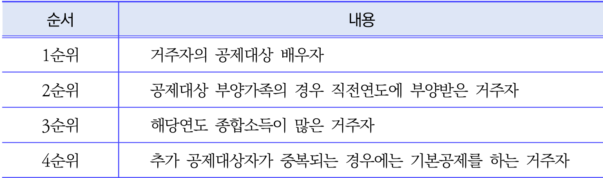

```markdown
| 순서  | 내용                                           |
|-----|----------------------------------------------|
| 1순위 | 거주자의 공제대상 배우자                           |
| 2순위 | 공제대상 부양가족의 경우 직전연도에 부양받은 거주자       |
| 3순위 | 해당연도 종합소득이 많은 거주자                      |
| 4순위 | 추가 공제대상자가 중복되는 경우에는 기본공제를 하는 거주자 |
```

<<SPLIT>>
elementId: 49
4) 기본공제 신청방법
<<SPLIT>>
elementId: 50
- 소득·세액공제신고서에 인적공제 대상자 주민등록번호를 적은 후 기본공제란에
"⌀" 표시하고 부양가족을 입증하는 증빙서류를 첨부하여 제출하여야 한다.
<<SPLIT>>
elementId: 51
기본공제 적용을 위한 제출서류
<<SPLIT>>
elementId: 52
| 구분 | 서류명 |
| --- | --- |
| 입양자 | 입양사실확인서 또는 입양증명서 |
| 수급자 | 수급자증명서 |
| 위탁아동 | 가정위탁보호확인서 |
| 그 밖의 부양가족 | 가족관계증명서 또는 주민등록표등본 |
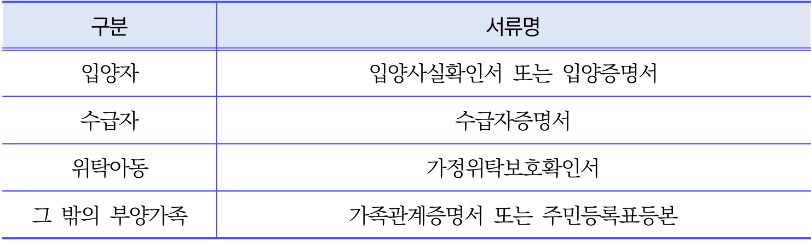

```markdown
| 구분            | 서류명                               |
|-----------------|--------------------------------------|
| 입양자          | 입양사실확인서 또는 입양증명서       |
| 수급자          | 수급자증명서                         |
| 위탁아동        | 가정위탁보호확인서                   |
| 그 밖의 부양가족 | 가족관계증명서 또는 주민등록표등본  |
```

<<SPLIT>>
elementId: 53
제
1장
근로소득
연말정산(이론편)
제2장
근로소득
연말정산(실전편)
<<SPLIT>>
elementId: 54
제3장
연말정산
세액의
계산
<<SPLIT>>
elementId: 55
제4장
근로소득자의
연말정산
후
4대보험
정산
<<SPLIT>>
elementId: 56
155
<<SPLIT>>
elementId: 57
(2) 추가공제(소득법 제51조)
<<SPLIT>>
elementId: 59
| 구 분 | 구 분 | 공제금액 | 비 고 |
| --- | --- | --- | --- |
| 경로우대(70세 이상) | 경로우대(70세 이상) | 1명당 연 100만원 | 근로기간이 1년 미만인 경우에도 월할 계산하지 않고 연액으로 공제 ※ 한부모공제와 부녀자공제가 중복되는 경우 한부모 공제만 적용 |
| 장애인 | 장애인 | 1명당 연 200만원 | 근로기간이 1년 미만인 경우에도 월할 계산하지 않고 연액으로 공제 ※ 한부모공제와 부녀자공제가 중복되는 경우 한부모 공제만 적용 |
| 부녀자 공제 | 배우자가 있는 여성근로자 배우자가 없는 여성으로서 기본공제대상 부양가족이 있는 세대주 | 연 50만원 (종합소득금액 3천만원 이하) | 근로기간이 1년 미만인 경우에도 월할 계산하지 않고 연액으로 공제 ※ 한부모공제와 부녀자공제가 중복되는 경우 한부모 공제만 적용 |
| 한부모 공제 | 배우자가 없는 근로자로서 기본공제대상자인 직계비속 또는 입양자가 있는 경우 | 연 100만원 | 근로기간이 1년 미만인 경우에도 월할 계산하지 않고 연액으로 공제 ※ 한부모공제와 부녀자공제가 중복되는 경우 한부모 공제만 적용 |
**- 거주자의 기본공제대상자가 다음에 해당하는 경우 해당 금액을 추가로 공제한다.**
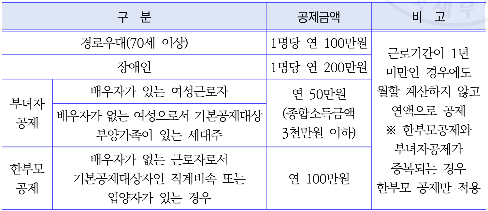

```markdown
| 구분       | 공제금액                | 비고                                                                 |
|------------|-------------------------|---------------------------------------------------------------------|
| 경로우대(70세 이상) | 1명당 연 100만원       | 근로기간이 1년 미만인 경우에도 월할 계산하지 않고 연액으로 공제                |
| 장애인     | 1명당 연 200만원       | ※ 한부모공제와 부녀자공제가 중복되는 경우 한부모 공제만 적용                |
| 부녀자 공제 | 배우자가 있는 여성근로자 | 연 50만원                                                          |
|            | 배우자가 없는 여성으로서 기본공제대상 부양가족이 있는 세대주 | 연 50만원 (종합소득금액 3천만원 이하)                              |
| 한부모 공제 | 배우자가 없는 근로자로서 기본공제대상자인 직계비속 또는 입양자가 있는 경우 | 연 100만원                                                          |
```

<<SPLIT>>
elementId: 60
· 기본공제대상자가 12월 31일(사망시는 사망일 전일) 현재 70세 이상인 경우에 인당
100만원을 추가로 공제(본인 포함)한다.
· 기본공제대상자 중 장애인6)이 있는 경우 1인당 연 200만원을 추가로 공제(본인 포
함)한다.
<<SPLIT>>
elementId: 61
장애인 증명서 제출 방법
<<SPLIT>>
elementId: 62
| 제 출 | 소득 · 세액공제신고서에 첨부하여 원천징수의무자에게 제출 |
| --- | --- |
| 제출제외 | 해당 장애의 상태가 1년 이상 지속될 것으로 예상되는 경우 그 장애기간이 기재된 장애인증명서를 한번만 제출 |
| 사용자 변경 | 장애인증명서를 제출한 근로자가 사용자를 달리하게 된 경우 이미 제출한 종전 원천징수의무자로부터 동 증명서를 반환받아 새로운 근무 지의 원천징수의무자에게 제출 가능 |
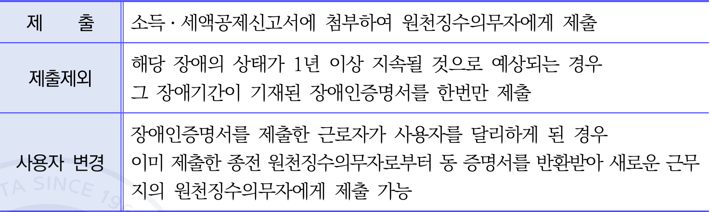

```markdown
| 제출       | 소득·세액공제신고서에 첨부하여 원천징수의무자에게 제출                                                                 |
|------------|--------------------------------------------------------------------------------------------------------------|
| 제출제외   | 해당 장애의 상태가 1년 이상 지속될 것으로 예상되는 경우 그 장애기간이 기재된 장애인증명서를 한번만 제출                          |
| 사용자 변경 | 장애인증명서를 제출한 근로자가 사용자를 달리하게 된 경우 이미 제출한 종전 원천징수의무자로부터 동 증명서를 반환받아 새로운 근무지의 원천징수의무자에게 제출 가능 |
```

<<SPLIT>>
elementId: 63
연말정산
세무
<<SPLIT>>
elementId: 64
6) 장애인복지법에 따른 장애인, 장애아동복지지원법에 따른 장애아동. 국가유공자 등 예우 및 지원에 관한
법률에 의한 상이자 → 장애인등록증 등. 상이자와 유사한 사람으로서 근로능력이 없는사람(「 국가유공자
등 예우 및 지원에 관한 법률 시행령」 별표3에 규정한 상이등급구분표에 게기하는 상이자와 같은 정도
의 신체장애가 있는 자를 말함) → 국가보훈처에서 발급한 상이자증명서. 항시 치료를 요하는 중증환자
→ 의료기관에서 발급한 장애인 증.
<<SPLIT>>
elementId: 65
156
<<SPLIT>>
elementId: 66
19
<<SPLIT>>
elementId: 67
제3장 연말정산 세액의 계산
<<SPLIT>>
elementId: 68
(3) 연금보험료 공제(소득법 제51조의 3)
<<SPLIT>>
elementId: 70
| 구분 | 공제여부 |
| --- | --- |
| 거주자 부담 | 공제대상 |
| 배우자 또는 부양가족 또는 회사 명의 부담 | 공제불가 |
**- 종합소득이 있는 거주자가 공적연금 관련법7)(국민연금, 공무원연금 등)에 따른 근로자부담 기여금 또는 개인부담금을 납입한 경우 근로소득에서 공제 가능하다.**


```markdown
| 구분                           | 공제여부   |
|------------------------------|---------|
| 거주자 부담                     | 공제대상   |
| 배우자 또는 부양가족 또는 회사 명의 부담 | 공제불가   |
```

<<SPLIT>>
elementId: 71
근로자가 퇴직연도에 확정기여형 퇴직연금계좌(DC형)에 납입한 추가부담금으로서 퇴
직 후 개인형 퇴직연금계좌(IRP)로 이체하여 운용중인 경우 해당 추가부담금은 연금
보험료 소득공제 적용한다. (서면법규과-464, 2013.4.22.)
<<SPLIT>>
elementId: 72
해당 연도에 납부한 국민연금보험료만 공제대상이므로 지역가입자분 또는 체납분을
납부한 경우에도 귀속년도와 상관없이 납부한 연도에 공제 한다.
<<SPLIT>>
elementId: 73
(4) 주택담보노후연금 이자비용공제(소득법 제51조의 4)
<<SPLIT>>
elementId: 74
- 연금소득이 있는 거주자가 대통령령으로 정하는 요건에 해당하는 주택담보노후연
금8)9)을 받은 경우에는 그 받은 연금에 대해서 해당 과세기간에 발생한 이자비용 상
당액을 연 200만원 한도로 연금소득에서 공제한다.
<<SPLIT>>
elementId: 75
공제금액 = Min[①, ②, ③]
<<SPLIT>>
elementId: 76
① 지급받은 연금에 대하여 해당연도에 발생한 이자 상당액
② 200만원
③ 연금소득금액
<<SPLIT>>
elementId: 77
7) 국민연금법 · 공무원연금법 군인연금법 · 사립학교교직원연금법 · 별정우체국법
8) 「한국주택금융공사법」 제2조 제8호의2에 따른 주택담보노후연금보증을 받아 지급받거나 같은법 제2조
제11호에 따른 금융기관의 주택담보노후연금일 것
9) 주택담보노후연금 가입 당시 담보권의 설정대상이 되는 법 제99조 제1항에 따른 주택(연금소득이 있는
거주자의 배우자 명의의 주택을 포함)의 기준시가가 12억원 이하일 것
<<SPLIT>>
elementId: 78
제
1장
근로소득
연말정산(이론편)
제2장
근로소득
연말정산(실전편)
<<SPLIT>>
elementId: 79
제3장
연말정산
세액의
계산
<<SPLIT>>
elementId: 80
제4장
근로소득자의
연말정산
후
4대보험
정산
<<SPLIT>>
elementId: 81
157
<<SPLIT>>
elementId: 82
03 특별소득공제 (소득법 제52조)
<<SPLIT>>
elementId: 83
(1) 보험료 공제
<<SPLIT>>
elementId: 85
| 구분 | 공제금액 |
| --- | --- |
| 국민건강보험법에 따라 근로자가 부담하는 보험료 | 전액 |
| 고용보험법에 따라 근로자가 부담하는 보험료 | 전액 |
| 노인장기요양보험법에 따라 근로자가 부담하는 보험료 | 전액 |
**- 근로소득이 있는 거주자(일용근로자 제외)가 해당 과세기간에 「국민건강보험법」, 「고용보험법」 또는 「노인장기요양보험법」에 따라 근로자가 부담하는 보험료를 지급한경우 그 금액을 해당 과세기간의 근로소득금액에서 공제한다.**
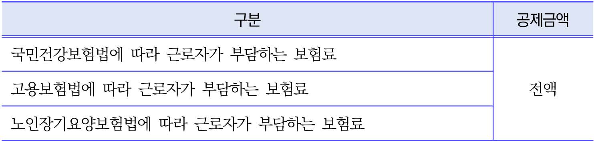

```markdown
| 구분                                               | 공제금액 |
|--------------------------------------------------|------|
| 국민건강보험법에 따라 근로자가 부담하는 보험료                | 전액 |
| 고용보험법에 따라 근로자가 부담하는 보험료                   | 전액 |
| 노인장기요양보험법에 따라 근로자가 부담하는 보험료             | 전액 |
```

<<SPLIT>>
elementId: 86
· 특별소득공제는 해당 근로자가 신청한 경우에 한하여 적용하며 종합소득금액을 한도
로 적용한다.
<<SPLIT>>
elementId: 87
· 근로제공기간이 아닌 취업 전 또는 퇴직 후에 지역가입자로서 납부한 보험료는 공제
대상이 아니다.
<<SPLIT>>
elementId: 88
· 국민건강보험법에 따라 직장가입자인 근로자가 추가로 납부하는 국민건강보험료(보수
외소득 연간 2,000천만원 초과자가 부담하는 소득월액보험료)는 근로소득에서 공제
한다.
<<SPLIT>>
elementId: 89
(2) 주택자금공제(소득법 제52조 4항 · 5항, 조특법 제87조)
<<SPLIT>>
elementId: 90
- 근로소득이 있는 거주자는 주택마련저축에 대한 공제, 주택임차자금차입금의 원리금
상환액에 대한 공제, 장기주택저당차입금의 이자상환액에 대한 공제 등 주택자금공
제를 받을 수 있다.
<<SPLIT>>
elementId: 91
연말정산
세무
<<SPLIT>>
elementId: 92
1) 주택임차차입금 원리금상환액 공제(소득법 52조 4항)
- 과세기간 종료일 현재 주택을 소유하지 아니한 세대의 세대주로서 근로소득이 있
는 거주자가 국민주택규모10)11)의 주택(주거용 오피스텔 포함)을 임차하기 위해
<<SPLIT>>
elementId: 93
158
<<SPLIT>>
elementId: 94
제3장 연말정산 세액의 계산
<<SPLIT>>
elementId: 95
대출기관 또는 거주자 등으로부터 주택임차 자금을 차입하고 차입금의 원리금을
상환한 경우 상환금액의 40%를 공제한다.
<<SPLIT>>
elementId: 96
① 공제대상(모두충족)
<<SPLIT>>
elementId: 97
②
<<SPLIT>>
elementId: 98
- 12월 31일 현재 주택을 소유하지 아니한 무주택(주택을 취득할 수 있는 권리,
주거용 오피스텔 등은 주택의 범위에 포함되지 않음) 세대의 세대주 또는 세대
원(세대주가 받지 않는 경우에 한함)은 근로자(일용근로자 제외)이면서 일정요
건을 충족한 외국인 근로자12)
- 국민주택규모 주택(주거용 오피스텔 포함)의 임차목적
- 대출기관등13)으로부터 차입한 일정요건의 주택임차자금차입금의 원리금 상환액
주택임차차입금의 요건
- 대출기관으로부터 차입한 경우 다음의 요건을 모두 충족하여야 한다
<<SPLIT>>
elementId: 99
10) 주거전용면적이 85m2 이하 주택(다만, 수도권을 제외한 도시지역이 아닌 읍 면 지역은 100m2 이하
주택), 해당 주택이 다가구주택이면 가구당 전용면적 기준으로 판단
11) 주택에 부수되는 토지가 건물 정착 면적에 지역별로 배율을 곱하여 산정한 면적을 초과하는 경우 해당
주택은 제외
<<SPLIT>>
elementId: 100
| 구분 | 배율 |
| --- | --- |
| 「국토의 계획 및 이용에 관한 법률」 제6조에 따른 도시지역의 토지 | 5배 |
| 그 밖의 토지 | 10배 |
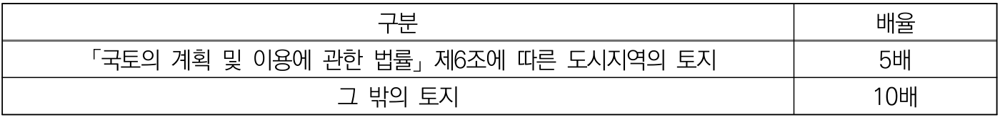

```markdown
| 구분                                                         | 배율 |
|------------------------------------------------------------|-----|
| 「국토의 계획 및 이용에 관한 법률」 제6조에 따른 도시지역의 토지 | 5배  |
| 「국토의 계획 및 이용에 관한 법률」 제6조에 따른 도시지역의 토지 | 5배  |
| 그 밖의 토지                                                | 10배 |
| 그 밖의 토지                                                | 10배 |
```

<<SPLIT>>
elementId: 101
12) 「출입국관리법」 제31조에 따라 등록한 외국인이거나 「재외동포의 출입국과 법적 지위에 관한 법률」
제6조에 따라 국내거소신고를 한 외국국적동포
<<SPLIT>>
elementId: 102
13) 가. 한국은행 · 한국산업은행 · 한국수출입은행 · 중소기업은행 및 「은행법」에 따른 은행
<<SPLIT>>
elementId: 103
나. 「상호저축은행법」에 따른 상호저축은행과 그 중앙회
다. 「농업협동조합법」에 따른 농업협동조합과 그 중앙회
라. 「수산업협동조합법」에 따른 수산업협동조합과 그 중앙회
마. 「신용협동조합법」에 따른 신용협동조합과 그 중앙회
바. 「새마을금고법」에 따른 금고와 그 연합회
사. 「보험업법」에 따른 보험회사
아. 「우체국예금 · 보험에 관한 법률」에 따른 체신관서
자. 「주택도시기금법」에 따른 주택도시기금
차. 「한국주택금융공사법」에 따른 한국주택금융공사
카. 「여신전문금융업법」에 따른 여신전문금융회사
타. 「국가보훈부와 그 소속기관 직제」 제2조 제2항에 따른 지방보훈청 및 보훈지청
<<SPLIT>>
elementId: 104
제
1
장
근로소득
연말정산(이론편)
제2장
근로소득
연말정산(실전편)
<<SPLIT>>
elementId: 105
제3장
연말정산
세액의
계산
<<SPLIT>>
elementId: 106
제4장
근로소득자의
연말정산
후
4대보험
정산
<<SPLIT>>
elementId: 107
159
<<SPLIT>>
elementId: 108
|  | 요건 - 임대차계약증서상 입주일과 주민등록표등본의 전입일 중 빠른날부터 전후 3개월14) 이내 에 차입한 자금일 것 、 차입금이 대출기관에서 임대인의 계좌로 직접 입금될 것 (대출금을 받아 본인의 계좌에 입금 후 다시 임대인의 계좌로 이체하는 경우 소득공제 불가능) |
| --- | --- |
| ③ 대부업을 경영하지 아니하는 거주자로부터 차입한 경우 - 다음의 요건을 모두 충족하는 차입금에 해당하여야 한다. 요건 - 임대차계약증서의 입주일과 주민등록표 등본의 전입일 중 빠른 날부터 전후 1개월 이내에 차입한 자금일 것 - 총급여액이 5천만원 이하인 근로자일 것 - 차입한 자금의 이자율이 소득세법 제57조에서 규정하는 이자율15) 보다 낮을 경우가 아닐 것 |  |
| 2) 주택마련저축 소득공제(조특법 87조) - 총급여 7천만원 이하인 근로소득자(일용근로자 제외)로서 해당 과세기간 중 주택 을 소유하지 않은16) 세대의 세대주17)가 과세연도 중 주택마련저축에 불입한 금 액의 40%에 상당하는 금액을 소득공제18) 한다. 14) ① 임대차계약을 연장, 갱신하면서 차입하는 경우 임대차계약 연장일 또는 갱신일부터 전후 3개월 이 내 차입한 자금 포함 ② 주택임차차입금의 원리금 상환액에 대한 소득공제를 받고 있던 사람이 다른 주택으로 이주하는 경 우에는 이주하기 전 주택의 입주일과 주민등록표 등본의 전입일 중 빠른 날부터 전후 3개월 이내 에 차입한 자금 포함 | 2024. |
| 15) 연말정산 연도 2.23.~ 3.15.~ 3.13.~ 3.16.~ 3.10.~ 3.21.~ 3.20.~ 3.22.~ 귀속 2013. 2014. 2015. 2016. 2017. 2018. 2023. 2010 2011 2012 | 3.20.~ 3.13.~ 3.16.~ 2019. 2020. 2021. |
| 이자율 4.3% 3.7% 4% 3.4% 2.9% 2.5% 1.8% 1.6% 1.8% 2.1% 1.8% 1.2% 2.9% 3.5% 세무 16) 공동상속주택은 지분이 가장 큰 상속인이 소유한 것으로 판단. 세대주가 아파트 분양권 보유시에는 공 제가능. 주택을 공동으로 소유하는 경우 공동소유자 모두 공제 불가. 17) 세대주는 과세연도 종료일 현재 기준으로 판단 160 | 이자율 4.3% 3.7% 4% 3.4% 2.9% 2.5% 1.8% 1.6% 1.8% 2.1% 1.8% 1.2% 2.9% 3.5% 세무 16) 공동상속주택은 지분이 가장 큰 상속인이 소유한 것으로 판단. 세대주가 아파트 분양권 보유시에는 공 제가능. 주택을 공동으로 소유하는 경우 공동소유자 모두 공제 불가. 17) 세대주는 과세연도 종료일 현재 기준으로 판단 160 |
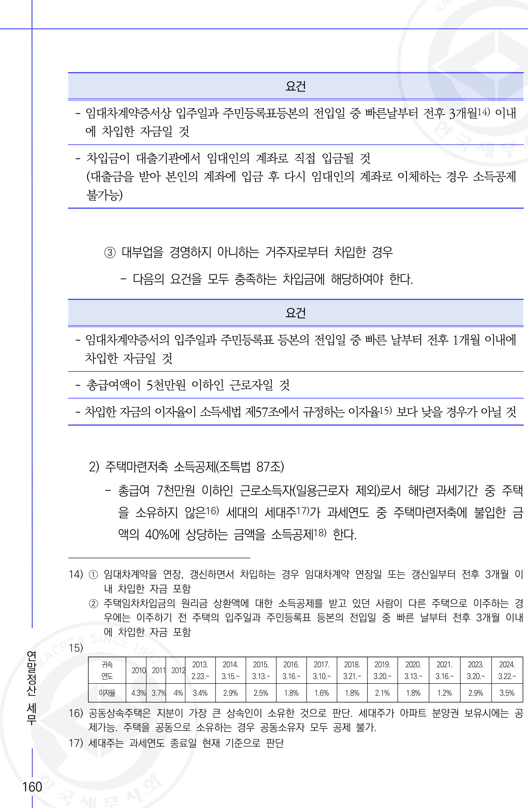

```markdown
| 조건                                                                                     |
|----------------------------------------------------------------------------------------|
| - 임대차계약증서상 임주일과 주민등록표등본의 전입일 중 빠른날부터 전후 3개월(14) 이내에 차입한 자금일 것 |
| - 차입금이 대출기관에서 임대인의 계좌로 직접 입금될 것 (대출금을 받아 본인의 계좌에 입금 후 다시 임대인의 계좌로 이체하는 경우 소득공제 불가능) |

| ③ 대부업을 경영하지 아니하는 거주자로부터 차입한 경우                                      |
|----------------------------------------------------------------------------------------|
| - 다음의 요건을 모두 충족하는 차입금에 해당하여야 한다.                                    |

| 조건                                                                                     |
|----------------------------------------------------------------------------------------|
| - 임대차계약증서의 임주일과 주민등록표 등본의 전입일 중 빠른 날부터 전후 1개월 이내에 차입한 자금일 것 |
| - 총급여액이 5천만원 이하인 근로자일 것                                                   |
| - 차입한 자금의 이자율이 소득세법 제57조에서 규정하는 이자율(15) 보다 낮을 경우가 아닐 것   |

| 2) 주택마련저축 소득공제(조특법 87조)                                                    |
|----------------------------------------------------------------------------------------|
| - 총급여 7천만원 이하인 근로소득자(일용근로자 제외)로서 해당 과세기간 중 주택을 소유하지 않은(16) 세대의 세대주(17)가 과세연도 중 주택마련저축에 불입한 금액의 40%에 상당하는 금액을 소득공제(18) 한다. |

| 14) 임대차계약을 연장, 갱신하면서 차입하는 경우 임대차계약 연장일 또는 갱신일부터 전후 3개월 이내 차입한 자금 포함 |
| 주택임차차입금의 원리금 상환액에 대한 소득공제를 받고 있던 사람이 다른 주택으로 이주하는 경우에는 이주하기 전 주택의 입주일과 주민등록표 등본의 전입일 중 빠른 날부터 전후 3개월 이내에 차입한 자금 포함 |

| 15)                                                                                     |
|----------------------------------------------------------------------------------------|
| 귀속 연도 | 2010 | 2011 | 2012 | 2013. 4.3~ | 2014. 3.9~ | 2015. 3.3~ | 2016. 1.6~ | 2017. 1.3~ | 2018. 1.2~ | 2019. 1.8~ | 2020. 1.2~ | 2021. 1.2~ | 2022. 1.2~ | 2023. 3.22~ |
| 이자율   | 4.3% | 3.7% | 3.4% | 2.9% | 2.5% | 1.8% | 1.6% | 1.3% | 1.2% | 1.9% | 1.2% | 2.9% | 3.2% | 3.2% |

| 16) 공동상속주택은 지분이 가장 큰 상속인이 소유한 것으로 판단. 세대주가 아파트 분양권 보유시는 공제 불가. 주택을 공동으로 소유하는 경우 공동소유자 모두 공제 불가. |
| 17) 세대주는 과세연도 종료일 현재 기준으로 판단 |
```

<<SPLIT>>
elementId: 109
제3장 연말정산 세액의 계산
<<SPLIT>>
elementId: 110
- 단 과세기간 중에 주택 당첨 및 주택청약종합저축 가입자가 청년우대형주택청약종
합저축에 가입하는 것 외의 사유로 중도해지한 경우에는 해당 과세기간에 납입한
금액은 공제하지 아니한다.
<<SPLIT>>
elementId: 111
① 주택법에 따른 청약저축 요건(연 납입액 240만원 이하)
<<SPLIT>>
elementId: 112
- 주택법에 따른 청약저축으로 다음의 주택 수 요건을 충족하여야 한다.
<<SPLIT>>
elementId: 113
| 가입시기 | 주택 수 요건 |
| --- | --- |
| 2005.12.31. 이전 | 무주택자 또는 1주택(국민주택규모) 소유 |
| 2006.1.1.~2007.12.31. | 무주택자 또는 기준시가 3억원 이하의 1주택 (국민주택규모) 소유 |
| 2008.1.1.~2009.12.31. | 무주택자 또는 기준시가 3억원 이하의 1주택(국민주택규모)19) 소유 |
| 2010.1.1. 이후 | 무주택자 |
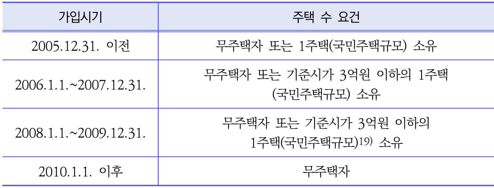

```markdown
| 가입시기                | 주택 수 요건                                      |
|-------------------------|---------------------------------------------------|
| 2005.12.31. 이전        | 무주택자 또는 1주택(국민주택규모) 소유            |
| 2006.1.1.~2007.12.31.   | 무주택자 또는 기준시가 3억원 이하의 1주택         |
| 2006.1.1.~2007.12.31.   | (국민주택규모) 소유                              |
| 2008.1.1.~2009.12.31.   | 무주택자 또는 기준시가 3억원 이하의 1주택         |
| 2008.1.1.~2009.12.31.   | (국민주택규모)19) 소유                           |
| 2010.1.1. 이후          | 무주택자                                          |
```

<<SPLIT>>
elementId: 114
- 해당 연도 중에 무주택인 경우에만 소득공제의 대상이 되며, 연도 중에 주택을
보유한 사실이 있는 경우 소득공제를 적용받을 수 없다.
<<SPLIT>>
elementId: 115
② 주택법에 따른 주택청약종합저축 요건(연 납입액 240만원 이하)
<<SPLIT>>
elementId: 116
- 주택법에 따른 주택청약종합저축으로 2009.5.6. 이후 납입분부터 적용되며 주
택을 소유하지 아니한 세대의 세대주임을 확인하는 서류인 무주택확인서를 소
득공제 적용받으려는 과세기간의 다음연도 2월말까지 해당 저축 취급기관에
제출 하여야 한다.
<<SPLIT>>
elementId: 117
- 주택마련저축을 연도 중에 중도 해지하는 경우 해지 전 불입액은 소득공제가
적용되지 않는다. 다만, 과세연도 중에 주택 당첨 및 주택청약종합저축 가입자
가 청년우대형 주택청약종합저축에 가입하는 사유로 중도해지하는 경우에는 당
해 연도에 납입한 금액을 공제받을 수 있다.
<<SPLIT>>
elementId: 118
18) Min[주택마련저축 불입액의 40% + 주택임차자금 차입금 원리금 상환액, 400만원]
19) 저축 가입 후 취득하는 경우 취득 당시 기준시가 3억원 이하의 주택(국민주택규모)
<<SPLIT>>
elementId: 119
제
1
장
근로소득
연말정산(이론편)
제2장
근로소득
연말정산(실전편)
<<SPLIT>>
elementId: 120
제3장
연말정산
세액의
계산
<<SPLIT>>
elementId: 121
제4장
근로소득자의
연말정산
후
4대보험
정산
<<SPLIT>>
elementId: 122
161
<<SPLIT>>
elementId: 123
|  | ③ |
| --- | --- |
|  | 「근로자의 주거안정과 목돈마련지원에 관한 법률」에 따른 근로자주택마련저축 - 2010년 이후 조문 삭제되었으나, 종전 가입자는 종전의 규정대로 공제적용한 다.(월 납입액 월 15만원 이하) 3) 장기주택저당차입금 이자상환액 공제(소득법 제52조 5항) - 근로소득이 있는 거주자로서 주택을 소유하지 아니하거나 1주택을 보유한 세대의 세대주가 취득 당시 주택의 기준시가가 6억원 이하인 주택을 취득하기 위하여 그 주택에 저당권을 설정하고 금융회사 등 또는 「주택도시기금법」에 따른 주택도시기 금으로부터 차입한 장기주택저당차입금의 이자를 지급하였을 때에는 해당 과세기 간에 지급한 이자 상환액을 그 과세기간의 근로소득금액에서 공제한다. ① 공제대상자 - 주택을 소유하지 아니하거나 1주택을 보유한 세대의 세대주 또는 세대원일 것 |
|  | 공제대상자 |
|  | - 근로소득이 있는 거주자(일용근로자 제외)로서 세대주 - 세대주가 주택자금 공제와 주택마련저축 공제를 받지 않은 경우 세대의 구성원 중 근로 소득이 있는 자(외국인20) 포함하며 세대주가 아닌 경우에는 실제 거주 필요) * 세대주 여부는 과세기간 종료일 현재의 상황에 의함 * 1주택자가 새주택을 구입하여 2주택자가 된 경우 연말까지 구주택을 양도하 는 경우 공제가능 ② 주택의 요건(과세기간 종료일 현재 2주택 이상 보유하지 않은 경우) 20) 다음 각 호의 요건을 모두 갖춘 거주자를 말한다 1. 다음 각 목의 어느 하나에 해당하는 사람일 것 가. 「출입국관리법」 제31조에 따라 등록한 외국인 나. 「재외동포의 출입국과 법적 지위에 관한 법률」 제6조에 따라 국내거소신고를 한 외국국적동포 연말정산 2. 다음 각 목의 어느 하나에 해당하는 사람이 주택임차차입금 원리금상환액 공제, 주택마련저축 소득 공제, 장기주택저당차입금 이자상환액 공제를 받지 않았을 것 가. 거주자의 배우자 나. 거주자와 같은 주소 또는 거소에서 생계를 같이 하는 사람으로서 다음의 어느 하나에 해당하는 세무 사람 1) 거주자의 직계존비속(그 배우자를 포함) 및 형제자매 2) 거주자의 배우자의 직계존비속(그 배우자를 포함) 및 형제자매 162 |
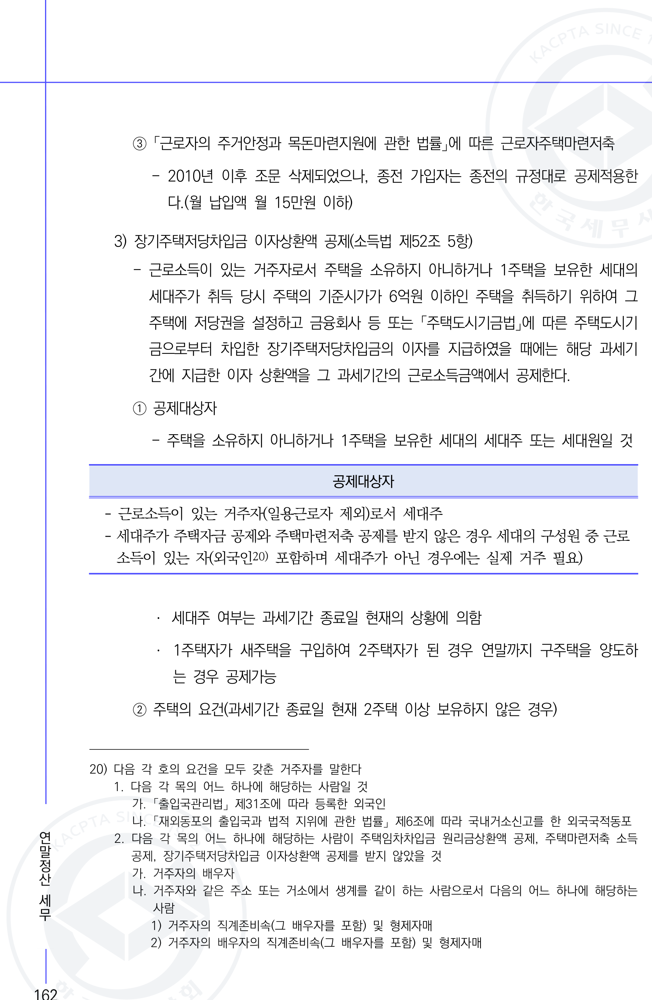

죄송합니다. 이 이미지를 분석할 수 없습니다.

<<SPLIT>>
elementId: 125
제3장 연말정산 세액의 계산
<<SPLIT>>
elementId: 126
| 구분 | 2005.12.31. 이전차입 | 2006.01.01. 이후 차입 | 2014.01.01. 이후 차입 | 2019.01.01. 이후 차입 | 2024.01.01. 이후 차입 |
| --- | --- | --- | --- | --- | --- |
| 기준시가요건 | 없음 | 3억원 이하 | 4억원 이하 | 5억원 이하 | 6억원 이하 |
| 규모요건 | 국민주택규모 이하 | 국민주택규모 이하 | 없음 | 없음 | 없음 |
**19**
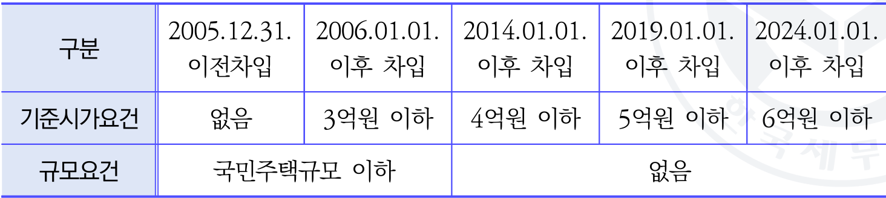

```markdown
| 구분       | 2005.12.31. 이전 차입 | 2006.01.01. 이후 차입 | 2014.01.01. 이후 차입 | 2019.01.01. 이후 차입 | 2024.01.01. 이후 차입 |
|------------|-----------------------|-----------------------|-----------------------|-----------------------|-----------------------|
| 기준시가요건 | 없음                  | 3억원 이하            | 4억원 이하            | 5억원 이하            | 6억원 이하            |
| 규모요건    | 국민주택규모 이하     | 국민주택규모 이하     | 국민주택규모 이하     | 없음                  | 없음                  |
```

<<SPLIT>>
elementId: 127
* 개별주택가격 등이 공시되기 전에 차입한 경우에는 차입일 이후 최초로 공시
된 가격을 해당 주택의 기준시가로 본다
주택의 수 계산(소득법 집행기준 52-112-1)21)
상속주택의 장기주택저당차입금 공제 해당여부(소득법 집행기준 52-112-
2)22)
<<SPLIT>>
elementId: 128
③ 장기주택저당차입금 요건
<<SPLIT>>
elementId: 129
- 다음의 요건을 모두 갖춘 차입금을 말한다.
<<SPLIT>>
elementId: 130
| 요건 |
| --- |
| - 주택소유권이전등기 또는 보존등기일부터 3월 이내에 차입한 장기주택저당차입금일 것 |
| - 장기주택저당차입금의 채무자가 당해 저당권이 설정된 주택의 소유자일 것 |
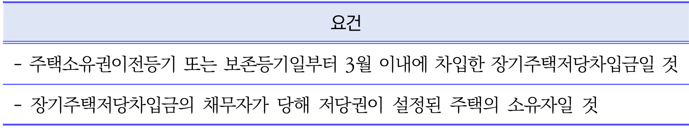

```markdown
| 조건                                                                 |
|---------------------------------------------------------------------|
| - 주택소유권이전등기 또는 보존등기일로부터 3월 이내에 차입한 장기주택저당차입금일 것 |
| - 장기주택저당차입금의 채무자가 당해 저당권이 설정된 주택의 소유자일 것          |
```

<<SPLIT>>
elementId: 131
21) ① 주택수의 범위에는 세대 구성원의 무허가주택을 포함한다.
② 상속으로 여러 사람이 공동으로 소유하는 1주택이 있는 경우 해당 공동상속주택은 상속지분이 가장
큰 상속인이 주택을 소유한 것으로 보아 장기주택저당차입금 등 주택자금공제 여부를 판단한다. 이
경우 상속지분이 가장 큰 상속인이 2인 이상인 때에는 해당 주택에 거주하는 자, 최연장자의 순서
에 따라 해당 거주자가 그 공동상속주택을 소유한 것으로 보아 공제가능 여부를 판단한다.
③ 동일자에 1주택을 취득 · 양도한 경우에는 1주택을 양도한 후 다른 1주택을 취득한 것으로 보아 장
기주택저당차입금 규정을 적용한다.
④ 판매목적의 주택을 소유하는 경우 해당 주택은 주택수에 포함한다.
⑤ 다가구주택은 단독주택으로 보아 국민주택규모를 판단한다. 다만, 다가구주택이 구분 등기된 경우에
는 각각을 1개의 주택으로 보고 가구당 전용면적을 기준으로 소득공제 여부를 판단한다.
⑥ 주거용 오피스텔, 주택분양권(부동산을 취득할 수 있는 권리)는 주택 수에 포함하지 않는다.
22) 아버지가 장기주택저당차입금 이자상환액공제를 받고 있다가 사망하여 아들이 주택 및 장기주택저당차
입금을 상속받는 경우, 상속시점에서 아들이 장기주택저당차입금 이자상환액공제 대상자에 해당되고 동
차입금이 공제요건을 충족하는 경우에는 아들이 상속받은 장기주택저당차입금은 공제대상 차입금에 포
함한다.
<<SPLIT>>
elementId: 132
제
1
장
근로소득
연말정산(이론편)
제2장
근로소득
연말정산(실전편)
<<SPLIT>>
elementId: 133
제3장
연말정산
세액의
계산
<<SPLIT>>
elementId: 134
제4장
근로소득자의
연말정산
후
4대보험
정산
<<SPLIT>>
elementId: 135
163
<<SPLIT>>
elementId: 136
|  | ④ 공제한도 = Min[A, B] | ④ 공제한도 = Min[A, B] |
| --- | --- | --- |
|  | A = Min[(주택마련저축 불입액 + 주택임차자금차입금 원리금상환액) x 40%, 800만원23)] + 장기주택저당차입금 이자상환액 B = 장기주택저당차입금 상환방식에 따른 한도금액 | A = Min[(주택마련저축 불입액 + 주택임차자금차입금 원리금상환액) x 40%, 800만원23)] + 장기주택저당차입금 이자상환액 B = 장기주택저당차입금 상환방식에 따른 한도금액 |
|  | - 장기주택저당차입금 상환방식에 따른 한도금액 · 2003.12.31. 이전 차입분 상환기간 상환방식 | 한도금액 |
|  | 15년이상 - | 1,000만원 |
|  | 10년 이상 15년 미만 - | 600만원 |
| 2004.1.1. 이후 차입분 | 2004.1.1. 이후 차입분 | 2004.1.1. 이후 차입분 |
| 상환기간 | 상환방식 | 한도금액 |
| 30년이상 | - | 1,500만원 |
| 15년 이상 30년 미만 | - | 1,000만원 |
| . 2012.1.1. 이후 차입분 | . 2012.1.1. 이후 차입분 | . 2012.1.1. 이후 차입분 |
| 상환기간 | 상환방식 | 한도금액 |
| 15년 이상 | 차입금의 70%이상 고정금리이거나, 차입금의 70% 이상을 비거치식 분할 상환방식일 것 | 1,500만원 |
| 15년 이상 | - | 1,000만원 |
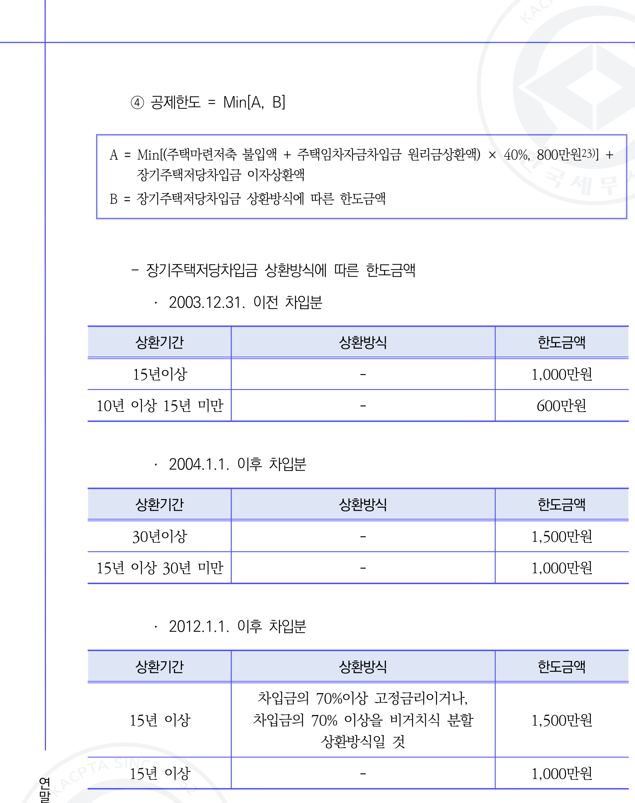

```markdown
- 공제한도 = Min[A, B]

  - A = Min[(주택마련저축 불입액 + 주택임차자금차입금 원리금상환액) × 40%, 800만원] + 장기주택저당차입금 이자상환액
  - B = 장기주택저당차입금 상환방식에 따른 한도금액

- 장기주택저당차입금 상환방식에 따른 한도금액
  - 2003.12.31. 이전 차입분

| 상환기간          | 상환방식 | 한도금액 |
|-------------------|----------|----------|
| 15년이상          | -        | 1,000만원 |
| 10년 이상 15년 미만 | -        | 600만원  |

  - 2004.1.1. 이후 차입분

| 상환기간          | 상환방식 | 한도금액 |
|-------------------|----------|----------|
| 30년이상          | -        | 1,500만원 |
| 15년 이상 30년 미만 | -        | 1,000만원 |

  - 2012.1.1. 이후 차입분

| 상환기간 | 상환방식                                                                 | 한도금액 |
|----------|--------------------------------------------------------------------------|----------|
| 15년 이상 | 차입금의 70%이상 고정금리이거나, 차입금의 70% 이상을 비거치식 분할 상환방식일 것 | 1,500만원 |
| 15년 이상 | -                                                                        | 1,000만원 |
```

<<SPLIT>>
elementId: 137
연말정산
세무
<<SPLIT>>
elementId: 138
23) 차입금 상환기간이 15년 이상인 장기주택저당차입금에 대하여 적용
<<SPLIT>>
elementId: 139
164
<<SPLIT>>
elementId: 140
제3장 연말정산 세액의 계산
<<SPLIT>>
elementId: 142
2015.1.1. 이후 차입분
<<SPLIT>>
elementId: 143
| 상환기간 | 상환방식 | 한도금액 |
| --- | --- | --- |
| 15년이상 | - | 1,000만원 |
| 15년이상 |  |  |
| 15년이상 |  |  |
| 10년 이상 15년 미만 |  | 600만원 |
*****
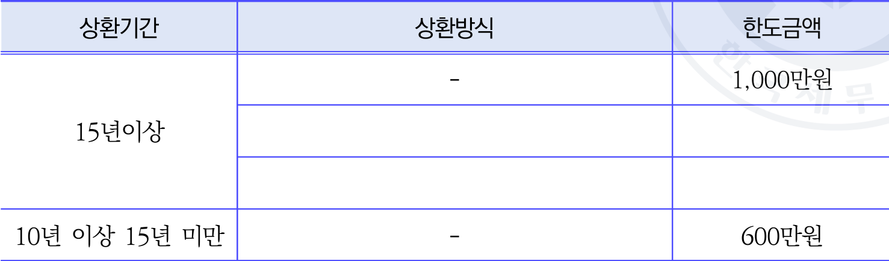

```markdown
| 상환기간            | 상환방식 | 한도금액  |
|---------------------|----------|-----------|
| 15년이상            | -        | 1,000만원 |
| 15년이상            | -        | 1,000만원 |
| 15년이상            | -        | 1,000만원 |
| 10년 이상 15년 미만 | -        | 600만원   |
| 10년 이상 15년 미만 | -        | 600만원   |
| 10년 이상 15년 미만 | -        | 600만원   |
```

<<SPLIT>>
elementId: 144
| 상환기간 | 상환방식 | 한도금액 |
| --- | --- | --- |
| 15년이상 | 고정금리이고 비거치식 분할상환 | 1,800만원 |
| 15년이상 | 고정금리 또는 비거치식 분할상환 | 1,500만원 |
| 15년이상 | 이외 | 500만원 |
| 10년이상 15년 미만 | 고정금리 또는 비거치식 분할상환 | 300만원 |
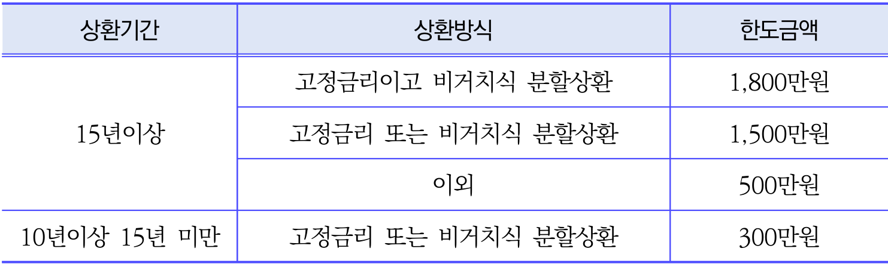

```markdown
| 상환기간            | 상환방식                        | 한도금액  |
|---------------------|--------------------------------|-----------|
| 15년이상            | 고정금리이고 비거치식 분할상환  | 1,800만원 |
| 15년이상            | 고정금리 또는 비거치식 분할상환 | 1,500만원 |
| 15년이상            | 이외                            | 500만원   |
| 10년이상 15년 미만  | 고정금리 또는 비거치식 분할상환 | 300만원   |
```

<<SPLIT>>
elementId: 145
. 2024.1.1. 이후 차입분
<<SPLIT>>
elementId: 146
| 상환기간 | 상환방식 | 한도금액 |
| --- | --- | --- |
| 15년이상 | 고정금리이고 비거치식 분할상환 | 2,000만원 |
| 15년이상 | 고정금리 또는 비거치식 분할상환 | 1,800만원 |
| 15년이상 | 이외 | 600만원 |
| 10년이상 15년 미만 | 고정금리 또는 비거치식 분할상환 | 600만원 |
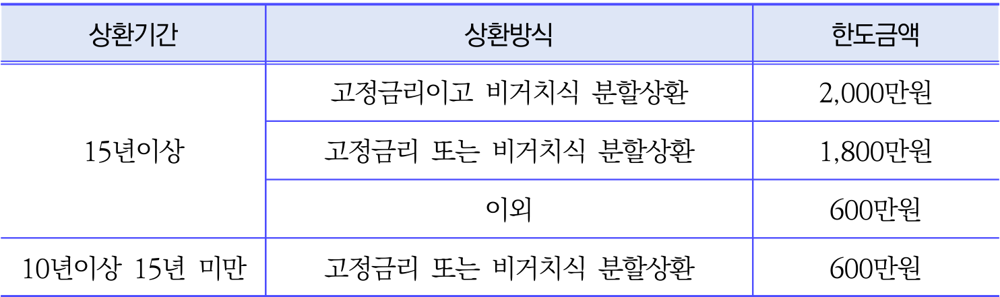

```markdown
| 상환기간            | 상환방식                        | 한도금액  |
|---------------------|--------------------------------|-----------|
| 15년이상            | 고정금리이고 비거치식 분할상환  | 2,000만원 |
| 15년이상            | 고정금리 또는 비거치식 분할상환 | 1,800만원 |
| 15년이상            | 이외                            | 600만원   |
| 10년이상 15년 미만  | 고정금리 또는 비거치식 분할상환 | 600만원   |
```

<<SPLIT>>
elementId: 147
장기주택저당차입금 이자를 미납하여 다음연도에 상환한 경우 실제 이자를 상
환한 연도에 공제받을 수 있으며 선지급한 이자상환액도 지급한 연도에 공제
받을 수 있다.
<<SPLIT>>
elementId: 148
주택 소유자가 본인 또는 본인포함 공동명의인 경우 본인의 채무부담분에 해
당하는 이자상환액만 공제한다. ex) 주택은 공동명의(배우자 또는 제3자)이고
차입자가 본인인 경우 본인 채무 부담분에 대한 이자는 전액 공제 가능
<<SPLIT>>
elementId: 149
제
1장
근로소득
연말정산(이론편)
제2장
근로소득
연말정산(실전편)
<<SPLIT>>
elementId: 150
제4장
근로소득자의
연말정산
후
4대보험
정산
<<SPLIT>>
elementId: 151
제3장
연말정산
세액의
계산
<<SPLIT>>
elementId: 152
165
<<SPLIT>>
elementId: 153
4) 주택분양권 관련 차입금 이자상환액 공제(소득법 제52조 5항 4호)
<<SPLIT>>
elementId: 154
- 주택분양권 등으로 인해 주택을 취득하기 위해 장기주택저당차입금으로 전환할 것
<<SPLIT>>
elementId: 156
| 구분 | 구분 | 내용 |
| --- | --- | --- |
| 공제대상자 | 공제대상자 | 무주택자인 세대주 |
| 주택분양권 등 | 주택분양권 등 | 주택법에 의한 사업계획승인을 얻어 건설되는 주택24)을 취득할 수 있는 권리 |
| 가액요건 | 가액요건 | 6억원 이하의 주택분양권 |
| 가액산정 | 조합원입 주권 | (청산금 납부시) 건물과 부수토지의 평가액 + 납부한 청산금 (청산금 수령시) 건물과 부수토지의 평가액 - 수령한 청산금 |
| 가액산정 | 그외 | 분양가격 |
| 차입금요건 | 차입금요건 | 주택분양권을 취득하고 해당 주택을 취득하기 위해 동 주택의 완 공시 장기주택저당차입금으로 전환할 것을 조건으로 금융회사 또 는 주택도시기금으로부터 차입 |
**을 조건으로 차입하는 경우 그 차입금을 장기주택저당차입금으로 본다.**
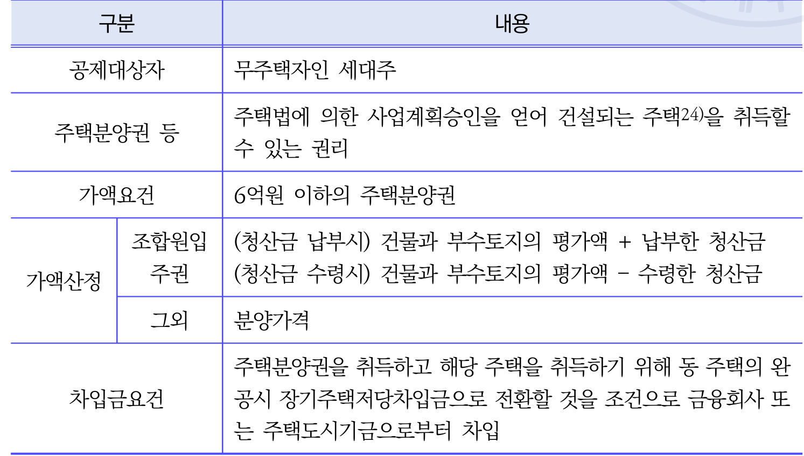

```markdown
| 구분       | 내용                                                                                   |
|------------|----------------------------------------------------------------------------------------|
| 공제대상자 | 무주택자인 세대주                                                                      |
| 주택분양권 등 | 주택법에 의한 사업계획승인을 얻어 건설되는 주택을 취득할 수 있는 권리                     |
| 가액요건   | 6억원 이하의 주택분양권                                                                |
| 가액산정   | 조합원입주권 | (청산금 납부시) 건물과 부수토지의 평가액 + 납부한 청산금                      |
|            | 조합원입주권 | (청산금 수령시) 건물과 부수토지의 평가액 - 수령한 청산금                      |
|            | 그 외       | 분양가격                                                                  |
| 차입금요건 | 주택분양권을 취득하고 해당 주택을 취득하기 위해 동 주택의 완공시 장기주택저당차입금으로 전환할 것을 조건으로 금융회사 또는 주택도시기금으로부터 차입 |
```

<<SPLIT>>
elementId: 157
[참고]
<<SPLIT>>
elementId: 158
| 구분 | 구분 | 제출서류 |
| --- | --- | --- |
| 주택임차차입금 원리금상환액 공제 | 대출기관 차입 | 주택자금상환증명서(홈택스) |
| 주택임차차입금 원리금상환액 공제 | 거주자 차입 | 임대차계약증서, 금전소비대차계약서, 계좌이체 내역 |
| 주택청약종합저축 등 소득공제 | 주택청약종합저축 등 소득공제 | 저축납입증명서 또는 저축통장사본, 간소화서비스 이용 자료 |
| 장기주택저당차입금 이자상환액 공제 | 장기주택저당차입금 이자상환액 공제 | 장기주택저당차입금 이자상환증명서(금융기관 또는 간소 화 서비스), 주택공시가격확인서, 건물등기부등본, 주민등 록표등본, 분양권의 경우 분양계약서 |
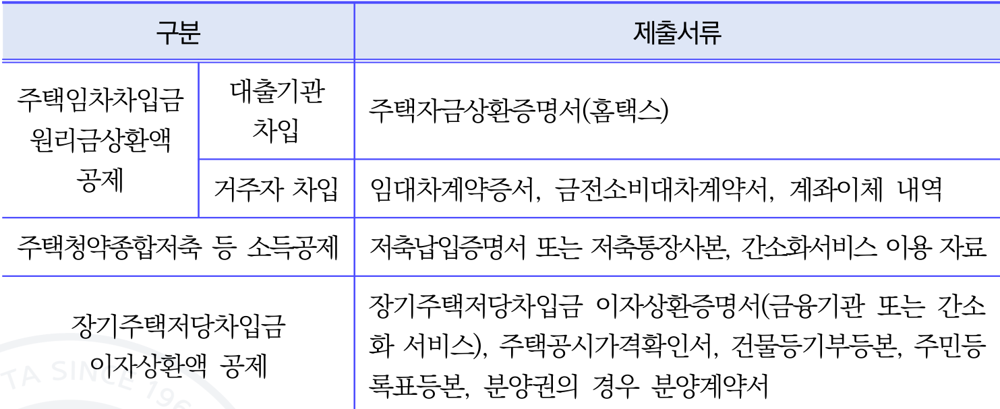

```markdown
| 구분                           | 제출서류                                                                                   |
|------------------------------|----------------------------------------------------------------------------------------|
| 주택임차차입금 원리금상환액 공제 | 주택자금상환증명서(홈택스)                                                                 |
| 대출기관 차입                  | 주택자금상환증명서(홈택스)                                                                 |
| 거주자 차입                    | 임대차계약증서, 금전소비대차계약서, 계좌이체 내역                                               |
| 주택청약종합저축 등 소득공제     | 저축납입증명서 또는 저축통장사본, 간소화서비스 이용 자료                                          |
| 장기주택저당차입금 이자상환액 공제 | 장기주택저당차입금 이자상환증명서(금융기관 또는 간소화 서비스), 주택공시가격확인서, 건물등기부등본, 주민등록표등본, 분양권의 경우 분양계약서 |
```

<<SPLIT>>
elementId: 159
연말정산
세무
<<SPLIT>>
elementId: 160
24) 「주택법」에 따른 주택조합 및 「도시 및 주거환경정비법」에 따른 정비사업조합의 조합원이 취득하는 주
택 또는 그 조합을 통하여 취득하는 주택을 포함한다.
<<SPLIT>>
elementId: 161
166
<<SPLIT>>
elementId: 162
제3장 연말정산 세액의 계산
<<SPLIT>>
elementId: 163
04 그 밖의 소득공제
<<SPLIT>>
elementId: 164
(1) 개인연금저축 소득공제(조특법 제86조, 삭제, 2013.1.1.)
<<SPLIT>>
elementId: 165
- 근로자가 다음에 해당하는 개인연금저축에 가입하여 해당연도에 불입한 금액에
대하여 근로소득금액에서 공제한다.
<<SPLIT>>
elementId: 166
| 구분 | 구분 | 내용 |
| --- | --- | --- |
| 가입기간 | 가입기간 | 2000.12.31.이전 가입 |
| 가입대상 | 가입대상 | 만 20세 이상 |
| 저축불입기간 | 저축불입기간 | 10년 이상 |
| 소득공제 | 불입한도 | 분기당 300만원 |
| 소득공제 | 공제비율 | 연간 납입액25)의 40% |
| 소득공제 | 공제서류 | 개인연금저축납입증명서(간소화서비스) |
| 공제금액한도 | 공제금액한도 | 연 72만원(불입액 기준 180만원) |
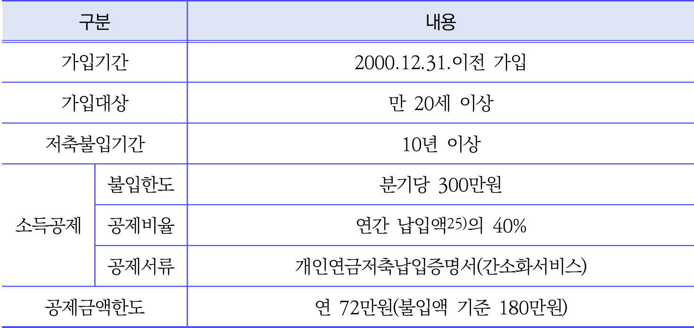

```markdown
| 구분       | 내용                                      |
|------------|-------------------------------------------|
| 가입기간   | 2000.12.31.이전 가입                      |
| 가입대상   | 만 20세 이상                              |
| 저축불입기간 | 10년 이상                                 |
| 불입한도   | 분기당 300만원                            |
| 소득공제   | 공제비율: 연간 납입액(25)의 40%           |
| 소득공제   | 공제서류: 개인연금저축납입증명서(간소화서비스) |
| 공제금액한도 | 연 72만원(불입액 기준 180만원)            |
```

<<SPLIT>>
elementId: 167
· 개인연금저축 가입자가 불입계약기간 만료 전 해지하거나 불입계약기간 만료 후 연
금 외의 형태로 지급받는 경우에는 이자소득으로 보아 소득세 부과
<<SPLIT>>
elementId: 168
가입일로부터 5년이 경과하기 전에 개인연금저축을 중도 해지한 경우에는 그 때까지
의 저축불입액의 4%(연간 7만2천원 또는 해당 해지환급금 중 적은 금액 한도)를 해
지추징세액으로 추징
<<SPLIT>>
elementId: 169
(2) 소기업 · 소상공인 공제부금 소득공제(조특법 제86조의 3)
<<SPLIT>>
elementId: 170
거주자가 소기업 · 소상공인 공제(중소기업중앙회 운영 '노란우산공제')에 가입하여 납
부하는 공제부금은 해당 연도의 공제부금 납부액과 공제한도 중 적은 금액을 사업소
득금액26)에서 공제한다.
<<SPLIT>>
elementId: 171
25) 근로자가 개인연금저축을 중도해지시 해당연도 불입액에 대해서는 소득공제 불가
26) 사업소득금액에서 공제하는 금액은 사업소득금액에서 부동산임대업의 소득금액을 차감한 금액을 한도로
<<SPLIT>>
elementId: 172
제4장
근로소득자의
연말정산
후
4대보험
정산
<<SPLIT>>
elementId: 173
제
1장
근로소득
연말정산(이론편)
제2장
근로소득
연말정산(실전편)
<<SPLIT>>
elementId: 174
제3장
연말정산
세액의
계산
<<SPLIT>>
elementId: 175
167
<<SPLIT>>
elementId: 176
|  | 1) 공제대상 - 거주자가 「중소기업협동조합법」 제115조에 따른 소기업 소상공인으로서 개인사 업자 또는 법인의 대표자 | 1) 공제대상 - 거주자가 「중소기업협동조합법」 제115조에 따른 소기업 소상공인으로서 개인사 업자 또는 법인의 대표자 |
| --- | --- | --- |
|  | 구분 | 내용 |
|  | 소기업(업종별 평균매출액 기준) | 「중소기업기본법」제2조 제2항의 따른 기업 |
|  | 광업, 제조업, 건설업, 운수업 소상공인27) | 상시근로자 50인 미만 |
|  | 도소매, 서비스, 기타 | 상시근로자 10인 미만 |
|  | · 2016년 1월 1일 이후 가입한 법인대표자는 해당 과세기간의 총급여액이 7천만 원 이하인 거주자의 경우 근로소득금액에서 공제 가능 2) 공제대상소득금액 및 한도 - 소기업 · 소상공인 대표자가 분기별로 300만원 이하의 공제부금을 불입하는 경우 해당 연도의 공제부금 납부액과 다음의 금액 중 적은 금액을 해당 과세연도의 사 업소득금액에서 공제한다. · 2018.12.31. 이전 가입자 | · 2016년 1월 1일 이후 가입한 법인대표자는 해당 과세기간의 총급여액이 7천만 원 이하인 거주자의 경우 근로소득금액에서 공제 가능 2) 공제대상소득금액 및 한도 - 소기업 · 소상공인 대표자가 분기별로 300만원 이하의 공제부금을 불입하는 경우 해당 연도의 공제부금 납부액과 다음의 금액 중 적은 금액을 해당 과세연도의 사 업소득금액에서 공제한다. · 2018.12.31. 이전 가입자 |
|  | 구분 | 납부 한도액 |
|  | 해당 과세연도의 사업소득금액이 4천만원 이하 | 500만원 |
|  | 해당 과세연도의 사업소득금액이 4천만원 초과 1억원 이하 | 300만원 |
|  | 해당 과세연도의 사업소득금액이 1억원 초과 | 200만원 |
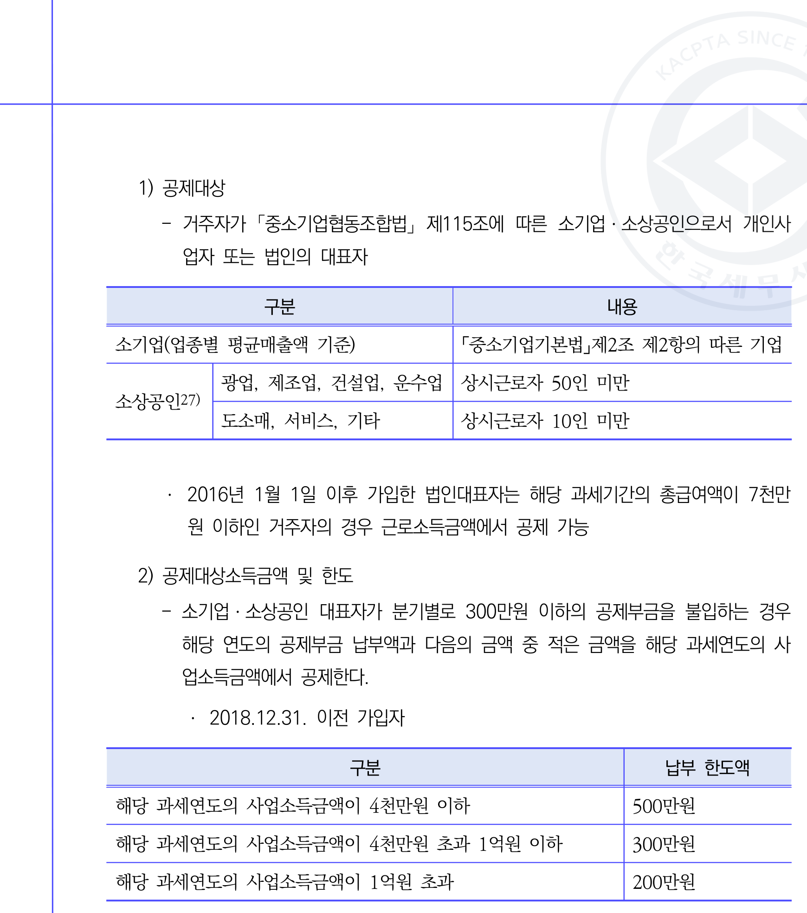

```markdown
1) 공제대상
- 거주자가 「중소기업협동조합법」 제115조에 따른 소기업·소상공인으로서 개인사업자 또는 법인의 대표자

| 구분         | 내용                                                                 |
|--------------|----------------------------------------------------------------------|
| 소기업(업종별 평균매출액 기준) | 「중소기업기본법」제2조 제2항의 따른 기업                          |
| 소상공인27)  | 광업, 제조업, 건설업, 운수업 상시근로자 50인 미만<br>도소매, 서비스, 기타 상시근로자 10인 미만 |

- 2016년 1월 1일 이후 가입한 법인대표자는 해당 과세기간의 총급여액이 7천만원 이하인 거주자의 경우 근로소득금액에서 공제 가능

2) 공제대상소득금액 및 한도
- 소기업·소상공인 대표자가 분기별로 300만원 이하의 공제부금을 불입하는 경우 해당 연도의 공제부금 납부액과 다음의 금액 중 적은 금액을 해당 과세연도의 사업소득금액에서 공제한다.
  - 2018.12.31. 이전 가입자

| 구분                                         | 납부 한도액 |
|----------------------------------------------|-------------|
| 해당 과세연도의 사업소득금액이 4천만원 이하  | 500만원     |
| 해당 과세연도의 사업소득금액이 4천만원 초과 1억원 이하 | 300만원     |
| 해당 과세연도의 사업소득금액이 1억원 초과    | 200만원     |
```

<<SPLIT>>
elementId: 177
연말정산
세무
<<SPLIT>>
elementId: 178
한다
27) 일반유흥주점, 무도유흥주점, 단란주점, 무도장운영업, 도박장운영업, 의료행위 아닌 안마업 제외
<<SPLIT>>
elementId: 179
168
<<SPLIT>>
elementId: 180
제3장 연말정산 세액의 계산
<<SPLIT>>
elementId: 182
| 구분 | 납부 한도액 |
| --- | --- |
| 해당 과세연도의 사업소득금액이 4천만원 이하 | 500만원 |
| 해당 과세연도의 사업소득금액이 4천만원 초과 1억원 이하 | 300만원 |
| 해당 과세연도의 사업소득금액이 1억원 초과 | 200만원 |
| Min[납부액, 납부한도액] x (사업소득금액 - 부동산임대업의 소득금액) / 사업소득금액 | Min[납부액, 납부한도액] x (사업소득금액 - 부동산임대업의 소득금액) / 사업소득금액 |
*** 2019.1.1. 이후 가입자(부동산임대업의 소득은 제외)**
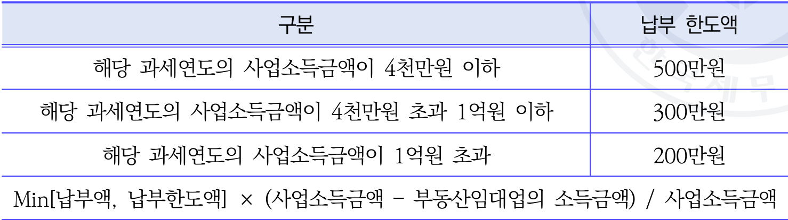

```markdown
| 구분                                         | 납부 한도액                                                                 |
|--------------------------------------------|------------------------------------------------------------------------|
| 해당 과세연도의 사업소득금액이 4천만원 이하         | 500만원                                                               |
| 해당 과세연도의 사업소득금액이 4천만원 초과 1억원 이하 | 300만원                                                               |
| 해당 과세연도의 사업소득금액이 1억원 초과           | 200만원                                                               |
| Min[납부액, 납부한도액] × (사업소득금액 – 부동산임대업의 소득금액) / 사업소득금액 | Min[납부액, 납부한도액] × (사업소득금액 – 부동산임대업의 소득금액) / 사업소득금액 |
```

<<SPLIT>>
elementId: 183
3) 공제금 지급에 따른 과세
<<SPLIT>>
elementId: 184
- 공제급 지급사유가 발생하여 공제금을 지급하는 경우 이자, 퇴직, 기타소득으로
과세한다.
<<SPLIT>>
elementId: 185
| 사유 | 사유 | 과세소득의 종류 |
| --- | --- | --- |
| 폐업28) 등 | 2015.12.31. 이전가입분29) | 이자소득 |
| 폐업28) 등 | 2016.1.1. 이후 가입분 | 퇴직소득 |
| 중도해지 | 중도해지 | 기타소득 |
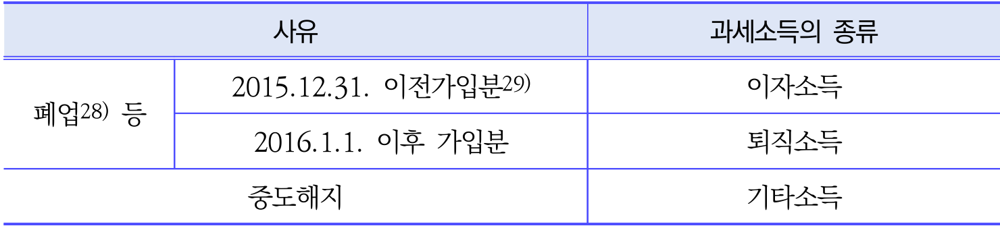

```markdown
| 사유            | 과세소득의 종류 |
|-----------------|----------------|
| 폐업28) 등      | 이자소득       |
| 2015.12.31. 이전가입분29) | 이자소득       |
| 2016.1.1. 이후 가입분     | 퇴직소득       |
| 중도해지        | 기타소득       |
```

<<SPLIT>>
elementId: 186
마지막 납입일이 속하는 달의 말일부터 1년 6개월이 경과하기 전에 그 기간 동
안의 공제부금을 납입하거나, 분기 이전에 해당 연도에 납부하여야 할 공제부금
중 6개월분에 해당하는 공제부금을 먼저 납입한 경우에는 해당 분기의 공제부금
을 납입한 것으로 본다.
<<SPLIT>>
elementId: 187
28) 폐업 등의 지급청구 사유
<<SPLIT>>
elementId: 188
1. 소기업 · 소상공인이 폐업(개인사업자의 지위에서 공제에 가입한 자가 법인설립을 위해 현물출자를
하여 폐업한 경우와 개인사업자의 지위에서 공제에 가입한 자가 그 배우자 또는 자녀에게 사업의
전부를 양도함으로써 폐업한 경우를 포함한다) 또는 해산(법인에 한한다) 한 때
2. 공제 가입자가 사망한 때
3. 법인의 대표자의 지위에서 공제한 가입자가 그 법인의 대표자의 지위를 상실한 때
4. 60세 이상으로 공제부금 납입월수가 120개월 이상인 공제 가입자가 공제금의 지급을 청구한 때
5. 재난, 질병, 회생절차개시 등 「중소기업협동조합법 시행령」 제37조 제1항 제5호부터 제8호까지의
어느 하나에 해당하는 경우
<<SPLIT>>
elementId: 189
29) 2015.12.31.까지 중소기업중앙회에 퇴직소득 적용을 신청한 경우에는 퇴직소득을 적용 함
<<SPLIT>>
elementId: 190
제4장
근로소득자의
연말정산
후
4대보험
정산
<<SPLIT>>
elementId: 191
제3장
연말정산
세액의
계산
<<SPLIT>>
elementId: 192
제
1장
근로소득
연말정산(이론편)
제2장
근로소득
연말정산(실전편)
<<SPLIT>>
elementId: 193
169
<<SPLIT>>
elementId: 194
(3) 벤처투자조합 출자 등에 대한 소득공제(조특법 제16조)
<<SPLIT>>
elementId: 195
- 거주자가 2025년 12월 31일까지 벤처투자조합 등에 출자 또는 투자하는 경우 소득
공제(자금을 대여하였다가 출자전환하는 경우 포함)를 적용한다.
<<SPLIT>>
elementId: 196
| 구분 | 구분 | 내용 | 내용 |
| --- | --- | --- | --- |
| 공제대상 조합 등 | Ⓐ | 벤처투자조합, 민간재간접벤처투자조합, 신기술사업투자조합 또 는 전무투자조합에 출자하는 경우 | 벤처투자조합, 민간재간접벤처투자조합, 신기술사업투자조합 또 는 전무투자조합에 출자하는 경우 |
| 공제대상 조합 등 | Ⓑ | 벤처기업투자신탁에 투자하는 경우 | 벤처기업투자신탁에 투자하는 경우 |
| 공제대상 조합 등 | Ⓒ | 개인투자조합에 출자한 금액을 벤처기업 또는 이에 준하는 창업 후 3년 이내의 중소기업으로서 벤처기업30)등에 투자하는 경우 | 개인투자조합에 출자한 금액을 벤처기업 또는 이에 준하는 창업 후 3년 이내의 중소기업으로서 벤처기업30)등에 투자하는 경우 |
| 공제대상 조합 등 | Ⓓ | 「벤처기업육성에 관한 특별법」에 따라 벤처기업등에 투자하는 경우 | 「벤처기업육성에 관한 특별법」에 따라 벤처기업등에 투자하는 경우 |
| 공제대상 조합 등 | Ⓔ | 창업 · 벤처전문사모집합투자기구에 투자하는 경우 | 창업 · 벤처전문사모집합투자기구에 투자하는 경우 |
| 공제대상 조합 등 | Ⓕ | 「자본시장과 금융투자업에 관한 법률」 제117조의 10에 따라 온 라인소액투자중개의 방법으로 모집하는 창업후 7년 이내의 중소 기업으로서 대통령령으로 정하는 기업31)의 지분증권에 투자하는 경우 | 「자본시장과 금융투자업에 관한 법률」 제117조의 10에 따라 온 라인소액투자중개의 방법으로 모집하는 창업후 7년 이내의 중소 기업으로서 대통령령으로 정하는 기업31)의 지분증권에 투자하는 경우 |
| 공제시기 | 일반적인 경우 | 출자일 또는 투자일이 속하는 과세연도부터 출자 또는 투자 후 2년이 되는 날이 속한 과세연도 중 선택하는 1과세연도 | 출자일 또는 투자일이 속하는 과세연도부터 출자 또는 투자 후 2년이 되는 날이 속한 과세연도 중 선택하는 1과세연도 |
| 공제시기 | 예외적인 경우 | 투자 당시에는 대상기업32)이 아니었으나 투자일부터 2년이 되는 날이 속하는 과세연도까지 대상기업에 해당하게 된 경우 | 투자 당시에는 대상기업32)이 아니었으나 투자일부터 2년이 되는 날이 속하는 과세연도까지 대상기업에 해당하게 된 경우 |
| 소득공제 | Ⓐ,Ⓔ | 출자 · 투자액 x 10% | 해당과세연도 종합소득금액의 50%를 한도로 함 |
| 소득공제 | Ⓑ33) | 출자 · 투자액 x 10% | 해당과세연도 종합소득금액의 50%를 한도로 함 |
| 소득공제 | Ⓑ,Ⓓ,Ⓕ | 3천만원 이하 100% 3천만원 초과 5천만원 이하 70% 5천만원 초과 30% | 해당과세연도 종합소득금액의 50%를 한도로 함 |
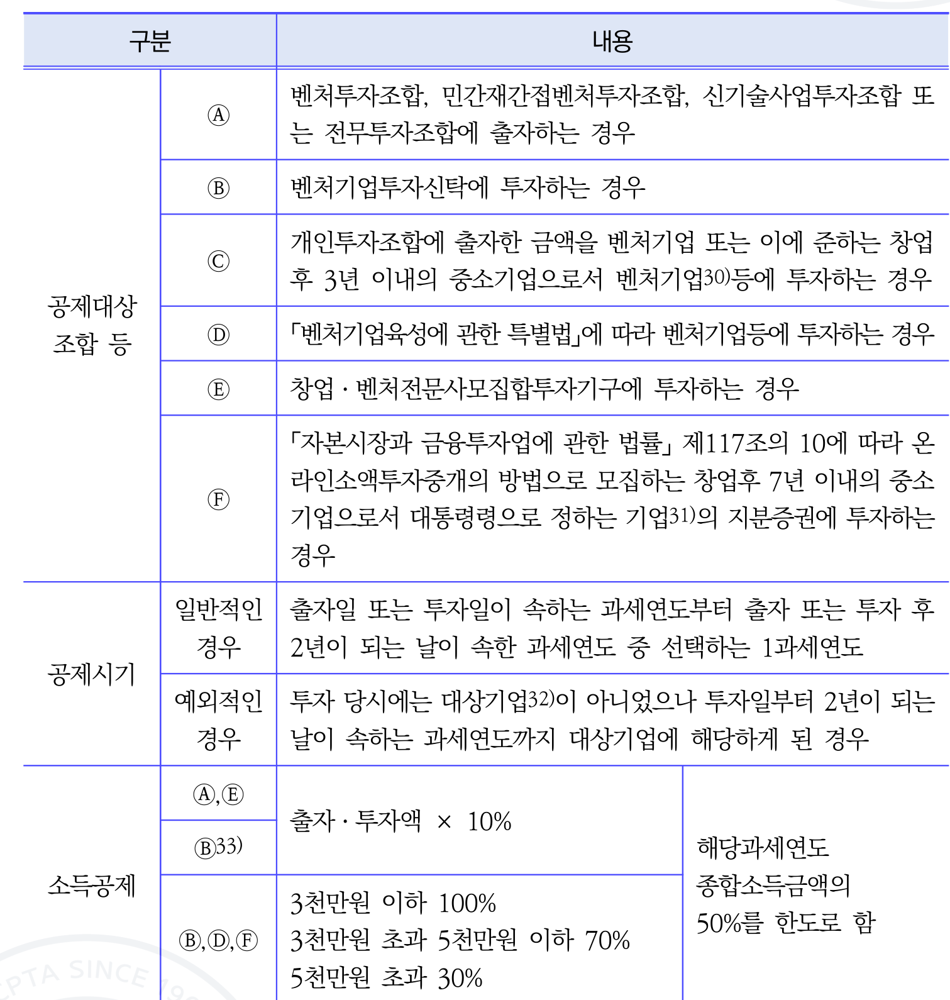

```markdown
| 구분          | 내용                                                                                                                                          |
|-------------|---------------------------------------------------------------------------------------------------------------------------------------------|
| 공제대상 조합 등 |                                                                                                                                             |
| ①           | 벤처투자조합, 민간재간접벤처투자조합, 신기술사업투자조합 또는 전문투자조합에 출자하는 경우                                                                 |
| ②           | 벤처기업투자신탁에 투자하는 경우                                                                                                               |
| ③           | 개인투자조합에 출자한 금액을 벤처기업 또는 이에 준하는 창업 후 3년 이내의 중소기업으로서 벤처기업 등에 투자하는 경우                                      |
| ④           | 「벤처기업육성에 관한 특별법」에 따라 벤처기업에 투자하는 경우                                                                                   |
| ⑤           | 창업·벤처전문사모집합투자기구에 투자하는 경우                                                                                                    |
| ⑥           | 「자본시장과 금융투자업에 관한 법률」 제117조의 10에 따라 온라인소액투자중개의 방법으로 모집하는 창업 후 7년 이내의 중소기업으로서 대통령령으로 정하는 기업의 지분증권에 투자하는 경우 |

| 공제시기       |                                                                                                                                             |
|-------------|---------------------------------------------------------------------------------------------------------------------------------------------|
| 일반적인 경우   | 출자일 또는 투자일이 속하는 과세연도부터 출자 또는 투자 후 2년이 되는 날이 속한 과세연도 중 선택하는 1과세연도                                                                 |
| 예외적인 경우   | 투자 당시에는 대상기업이 아니었으나 투자일부터 2년이 되는 날이 속하는 과세연도가기 대상기업에 해당하게 된 경우                                                                 |

| 소득공제       |                                                                                                                                             |
|-------------|---------------------------------------------------------------------------------------------------------------------------------------------|
| ①, ⑤       | 출자·투자액 × 10%                                                                                                                             |
| ②, ③, ④, ⑥ | 3천만원 이하 100%<br>3천만원 초과 5천만원 이하 70%<br>5천만원 초과 30%<br>해당과세연도 종합소득금액의 50%를 한도로 함                                      |
```

<<SPLIT>>
elementId: 197
연말정산
세무
<<SPLIT>>
elementId: 198
30) 「벤처투자 촉진에 관한 법률」 제2조 제8호에 따른 개인투자조합이 거주자로부터 출자받은 금액을 해당
출자일이 속하는 과세연도의 다음 과세연도 종료일까지 다음 각 호의 어느 하나에 해당하는 기업에 같
은 법에 따라 투자하는 것을 말한다.
1. 벤처기업
2. 창업후 3년 이내의 중소기업으로서 「벤처기업육성에 관한 특별법」 제2조의2 제1항 제2호 다목에
<<SPLIT>>
elementId: 199
170
<<SPLIT>>
elementId: 200
제3장 연말정산 세액의 계산
<<SPLIT>>
elementId: 201
타인의 출자지분이나 투자지분 또는 수익증권을 양수하는 방법으로 출자하거나
투자하는 경우 소득공제대상에서 배제
<<SPLIT>>
elementId: 202
소득공제를 받고자 하는 근로자는 해당 과세연도의 다음 연도 2월분 급여를 받
는 날까지 소득공제신청서에 출자 또는 투자확인서를 첨부하여 제출
<<SPLIT>>
elementId: 203
출자 또는 투자일로부터 3년이 지나기 전에 처분(이전 · 회수 · 양도 · 환매)하는
경우 이미 공제받은 소득금액에 대한 세액을 추징(사망, 해외이주, 천재지변 및
조합이 해산한 경우는 제외)
<<SPLIT>>
elementId: 204
소득공제를 받고자 하는 근로자는 출자 등 소득공제신청서에 출자 또는 투자확인
서(조특칙 별지 제5호 서식)를 첨부하여 해당과세기간의 다음연도 2월분의 급여
를 받는날까지 원천징수의무자에게 신청
<<SPLIT>>
elementId: 205
따라 벤처기업확인기관으로부터 기술의 혁신성과 사업의 성장성이 우수한 것으로 평가받은 기업
3. 창업 후 3년 이내의 중소기업으로서 개인투자조합으로부터 투자받은 날이 속하는 과세연도의 직전
과세연도에 조특법 제10조 제1항에 따른 연구 · 인력개발비를 3천만원 이상 지출한 기업. 다만, 직
전 과세연도의 기간이 6개월 이내인 경우에는 조특법 제10조 제1항에 따른 연구 · 인력개발비를
1천5백만원 이상 지출한 중소기업으로 한다.
4. 창업 후 3년 이내의 중소기업으로서 「신용정보의 이용 및 보호에 관한 법률」 제2조 제8호의3 다
목에 따른 기술신용평가업무를 하는 기업신용조회회사가 평가한 기술등급이 기술등급 체계상 상위
100분의 50에 해당하는 기업
31) 1. 창업후 7년 이내의 중소기업으로서 「벤처기업육성에 관한 특별법」 제2조의2 제1항 제2호 다목에
따라 벤처기업확인기관으로부터 기술의 혁신성과 사업의 성장성이 우수한 것으로 평가받은 기업
2. 창업 후 7년 이내의 중소기업으로서 개인투자조합으로부터 투자받은 날이 속하는 과세연도의 직전
과세연도에 조특법 제10조 제1항에 따른 연구 · 인력개발비를 3천만원 이상 지출한 기업. 다만, 직
전 과세연도의 기간이 6개월 이내인 경우에는 조특법 제10조 제1 항에 따른 연구 · 인력개발비를
1천5백만원 이상 지출한 중소기업으로 한다.
3. 창업 후 7년 이내의 중소기업으로서 「신용정보의 이용 및 보호에 관한 법률」 제2조 제8호의3 다
목에 따른 기술신용평가업무를 하는 기업신용조회회사가 평가한 기술등급이 기술등급 체계상 상위
100분의 50에 해당하는 기업
32) Ⓒ, Ⓓ, Ⓕ에 해당하는 회사
33) 벤처기업투자신탁의 수익증권에 투자한 경우 소득공제를 적용받을 수 있는 투자액은 거주자 1명당 3천
만원
<<SPLIT>>
elementId: 206
제
1
장
근로소득
연말정산(이론편)
제2장
근로소득
연말정산(실전편)
<<SPLIT>>
elementId: 207
제3장
연말정산
세액의
계산
<<SPLIT>>
elementId: 208
제4장
근로소득자의
연말정산
후
4대보험
정산
<<SPLIT>>
elementId: 209
171
<<SPLIT>>
elementId: 210
[참고] 출자 또는 투자확인서 발급신청 방법
<<SPLIT>>
elementId: 211
| 구분 | 내용 | 필요서류 |
| --- | --- | --- |
| 근로자(개인투자조합)가 벤처기업에 직접 출자 또는 투자한 경우 | · 투자한 벤처기업을 통하여 중 소기업청 또는 지방중소기업 청에 일괄 발급 신청 · 엔젤투자지원센터 이용 (https://www.kban.or.kr/) | · 투자실적확인요청서 · 투자(출자)확인서 2부 · 법인 등기부등본 1부 · 투자자명세표 1부 · 주식대금보관증 사본1부 · 주식대금 납입 영수증 (통장사본) |
| 투자조합 및 벤처기업증 권투자신탁 수익증권에 투자한 경우 | 투자조합관리자 및 증권투자위탁회사에게 발급 신청 | 투자조합관리자 및 증권투자위탁회사에게 발급 신청 |
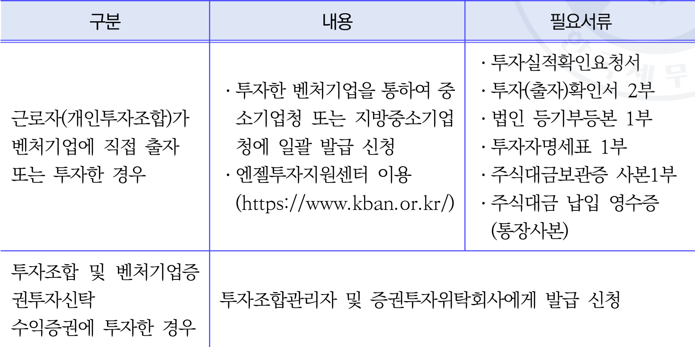

```markdown
| 구분                                         | 내용                                                                                                                                   | 필요서류                                                                                           |
|--------------------------------------------|--------------------------------------------------------------------------------------------------------------------------------------|--------------------------------------------------------------------------------------------------|
| 근로자(개인투자조합)가 벤처기업에 직접 출자 또는 투자한 경우 | - 투자한 벤처기업을 통하여 중소기업청 또는 지방중소기업청에 일괄 발급 신청<br>- 엔젤투자지원센터 이용 (https://www.kban.or.kr/) | - 투자실적확인요청서<br>- 투자(출자)확인서 2부<br>- 법인 등기부등본 1부<br>- 투자자명세표 1부<br>- 주식대금보관증 사본1부<br>- 주식대금 납입 영수증 (통장사본) |
| 투자조합 및 벤처기업증권투자신탁 수익증권에 투자한 경우 | 투자조합관리자 및 증권투자위탁회사에게 발급 신청                                                                                                 |                                                                                                  |
```

<<SPLIT>>
elementId: 212
(6) 신용카드 등 사용금액 소득공제(조특법 제126조의2)
<<SPLIT>>
elementId: 213
- 근로소득이 있는 거주자(일용근로자 제외)가 법인 또는 사업자(외국법인 · 비거주자의
국내사업장 포함)로부터 재화나 용역을 제공받고 신용카드 등으로 지불한 금액의 연
간 합계액(국외 사용액 제외) 중 일정 비율을 공제한다.
<<SPLIT>>
elementId: 214
| 구분 | 구분 | 내용 | 비고 |
| --- | --- | --- | --- |
| 공제대상 신용카드 등의 범위 | 공제대상 신용카드 등의 범위 | · 여신전문금융업법에 따른 신용카드를 사용하여 그 대가로 지급 하는 금액 · 현금영수증에 기재된 금액 · 직불카드 또는 선불카드, 직불전자지급수단, 선불전자지급수단 또는 전자화폐를 사용하여 그 대가로 지급하는 금액 | · 여신전문금융업법에 따른 신용카드를 사용하여 그 대가로 지급 하는 금액 · 현금영수증에 기재된 금액 · 직불카드 또는 선불카드, 직불전자지급수단, 선불전자지급수단 또는 전자화폐를 사용하여 그 대가로 지급하는 금액 |
| 카드 사용자 의 범위 | · 배우자 · 배우자의 · 직계존속 | 연간소득금액이 100만원(근로소 득만 있는 경우 총급여액 500만원) | 다른 거주자의 기본공제 대상 이 아닐 것 |
| 카드 사용자 의 범위 | 직계존속 | 연간소득금액이 100만원(근로소 득만 있는 경우 총급여액 500만원) | 다른 거주자의 기본공제 대상 이 아닐 것 |
| 카드 사용자 의 범위 | 직계비속 동거입양자 | 연간소득금액이 100만원(근로소 득만 있는 경우 총급여액 500만원) | 다른 거주자의 기본공제 대상 이 아닐 것 |
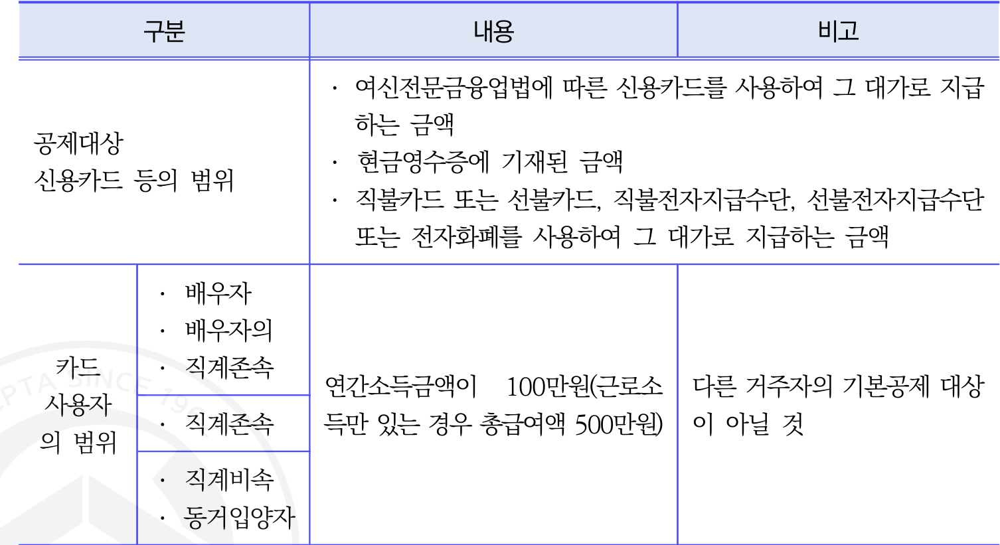

```markdown
| 구분                     | 내용                                                                                           | 비고                                     |
|------------------------|----------------------------------------------------------------------------------------------|----------------------------------------|
| 공제대상 신용카드 등의 범위 | · 여신전문금융업법에 따른 신용카드를 사용하여 그 대가로 지급하는 금액                                  |                                        |
|                        | · 현금영수증에 기재된 금액                                                                       |                                        |
|                        | · 직불카드 또는 선불카드, 직불전자지급수단, 선불전자지급수단 또는 전자화폐를 사용하여 그 대가로 지급하는 금액 |                                        |
| 카드 사용자 의 범위          | · 배우자                                                                                      | 연간소득금액이 100만원(근로소득만 있는 경우 총급여액 500만원) |
|                        | · 배우자의 직계존속                                                                              | 다른 거주자의 기본공제 대상이 아닐 것            |
|                        | · 직계존속                                                                                     |                                        |
|                        | · 직계비속                                                                                     |                                        |
|                        | · 동거입양자                                                                                   |                                        |
```

<<SPLIT>>
elementId: 215
연말정산
세무
<<SPLIT>>
elementId: 216
172
<<SPLIT>>
elementId: 218
제3장 연말정산 세액의 계산
<<SPLIT>>
elementId: 219
| 구분 | 내용 비고 |
| --- | --- |
| 공제금 액 | · 공제금액 = ①+②+③+④+⑤-⑥ |
| 공제금 액 | ① 전통시장사용분(신용카드 현금영수증 · 직불카드 · 선불카드) x 40% |
| 공제금 액 | ② 대중교통이용분(신용카드 현금영수증 · 직불카드 · 선불카드) x 40% |
| 공제금 액 | ③ 총급여 7천만원 이하인 근로자의 도서 · 신문 · 공연 · 박물관 · 미술관 · 영화관람료 사 용분 x 30% |
| 공제금 액 | ④ ((현금영수증, 직불카드 등 사용분) - ① - ② - ③) x 30% |
| 공제금 액 | ⑤ (신용카드 등 사용금액 합계액 - ① - ② - ③ - ④) X 15% |
| 공제금 액 | ⑥ 다음의 어느 하나에 해당하는 금액 1. 최저사용금액(총급여액의 25%) ≤ ⑤ 인 경우 최저사용금액 x 15% 2. 최저사용금액 > ⑤ (총급여 7천만원 이하) 인 경우 7. ⑤<최저사용금액≤③+④+⑤ 인 경우 ⑤x15%+(최저사용금액-⑤)x30% �, 최저사용금액≥③+④+⑤ 인 경우 ⑤x15%+(③+④)x30%+(최저사용금액-③- ④-⑤)x40% 3. 최저사용금액 > ⑤ (총급여 7천만원 초과) 인 경우 7. ⑤<최저사용금액≤④+⑤ 인 경우 ⑤x15%+(최저사용금액-⑤)x30% �. 최저사용금액≥④+⑤인 경우 ⑧x15%+④)x30%-(최저사용금액-④+⑥)x40% |
**196**
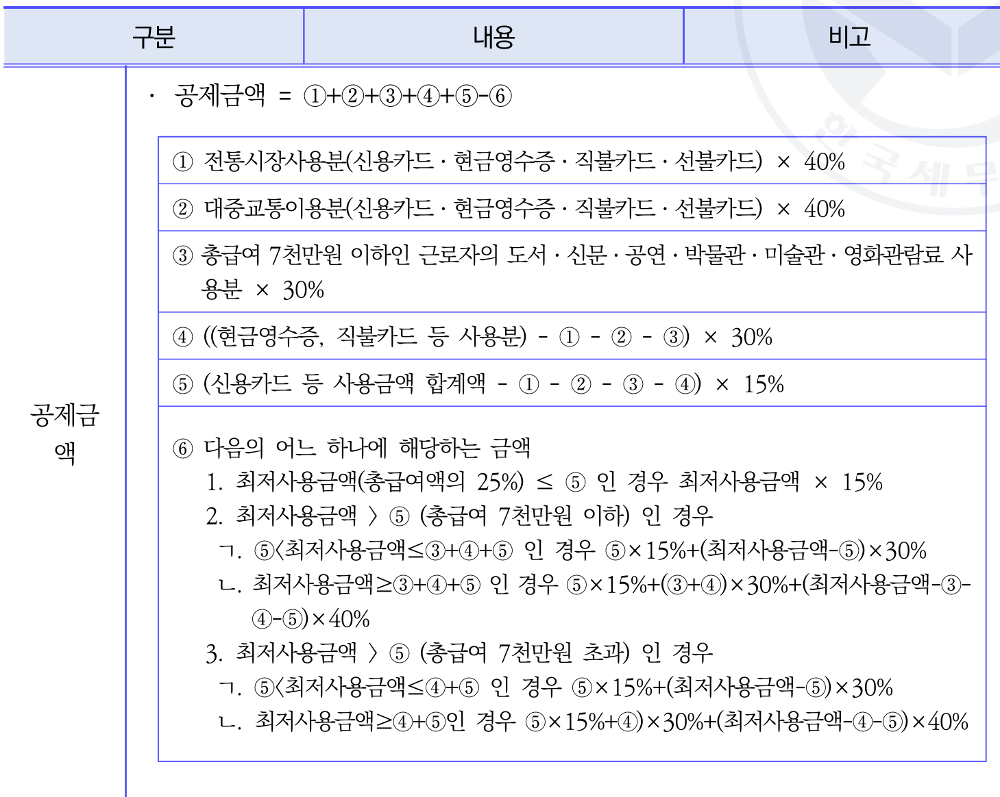

```markdown
| 구분     | 내용                                                                                                                                                                                                                     | 비고 |
|----------|--------------------------------------------------------------------------------------------------------------------------------------------------------------------------------------------------------------------------|------|
| 공제금액 | ①+②+③+④+⑤-⑥                                                                                                                                                                                                           |      |
|          | ① 전통시장사용분(신용카드·현금영수증·직불카드·선불카드) × 40%                                                                                                                                                           |      |
|          | ② 대중교통이용분(신용카드·현금영수증·직불카드·선불카드) × 40%                                                                                                                                                           |      |
|          | ③ 총급여 7천만원 이하인 근로자의 도서·신문·공연·박물관·미술관·영화관람료 사용분 × 30%                                                                                                                                    |      |
|          | ④ (현금영수증, 직불카드 등 사용분) - ① - ② - ③ × 30%                                                                                                                                                                  |      |
|          | ⑤ (신용카드 등 사용금액 합계액 - ① - ② - ③ - ④) × 15%                                                                                                                                                                 |      |
|          | ⑥ 다음의 어느 하나에 해당하는 금액                                                                                                                                                                                     |      |
|          | 1. 최저사용금액(총급여액의 25%) ≤ ⑤ 인 경우 최저사용금액 × 15%                                                                                                                                                          |      |
|          | 2. 최저사용금액 > ⑤ (총급여 7천만원 이하) 인 경우                                                                                                                                                                       |      |
|          |    ㄱ. ⑤/최저사용금액≤③+④+⑤ 인 경우 ⑤×15%+(최저사용금액-⑤)×30%                                                                                                                                                       |      |
|          |    ㄴ. 최저사용금액≥③+④+⑤ 인 경우 ⑤×15%+(③+④)×30%+(최저사용금액-③-④-⑤)×40%                                                                                                                                            |      |
|          | 3. 최저사용금액 > ⑤ (총급여 7천만원 초과) 인 경우                                                                                                                                                                       |      |
|          |    ㄱ. ⑤/최저사용금액≤④+⑤ 인 경우 ⑤×15%+(최저사용금액-⑤)×30%                                                                                                                                                         |      |
|          |    ㄴ. 최저사용금액≥④+⑤ 인 경우 ⑤×15%+④×30%+(최저사용금액-④-⑤)×40%                                                                                                                                                    |      |
```

<<SPLIT>>
elementId: 220
1) 공제한도와 추가한도
<<SPLIT>>
elementId: 221
| 구분 | 총급여액 7천만원 이하자 | 총급여액 7천만원 초과자 |
| --- | --- | --- |
| 공제한도 | Min[연간 300만원, 총급여액의 20%] | Min[연간 250만원, 총급여액의 20%] |
| 추가한도 | Min[한도초과금액, Min(①+②+③, 300만원)] | Min[한도초과금액, Min(①+②, 200만원)] |
**196**
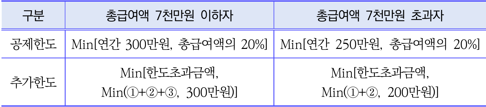

```markdown
| 구분   | 총급여액 7천만원 이하자                          | 총급여액 7천만원 초과자                          |
|--------|---------------------------------------------|---------------------------------------------|
| 공제한도 | Min[연간 300만원, 총급여액의 20%]               | Min[연간 250만원, 총급여액의 20%]               |
| 추가한도 | Min[한도초과금액, Min(①+②+③, 300만원)] | Min[한도초과금액, Min(①+②, 200만원)] |
```

<<SPLIT>>
elementId: 222
제
1장
근로소득
연말정산(이론편)
제2장
근로소득
연말정산(실전편)
<<SPLIT>>
elementId: 223
제3장
연말정산
세액의
계산
<<SPLIT>>
elementId: 224
제4장
근로소득자의
연말정산
후
4대보험
정산
<<SPLIT>>
elementId: 225
173
<<SPLIT>>
elementId: 226
[참고]
<<SPLIT>>
elementId: 228
| 구분 | 내용 | 적용한도 |
| --- | --- | --- |
| 한시적 추가한도 | 2023년 신용카드연간사용합계액의 105%를 초과하는 금액의 10% | 100만원 |
**- 2024년 한시적으로 신용카드사용금액이 2023년 사용금액보다 큰 경우 추가 한도를 적용한다.**
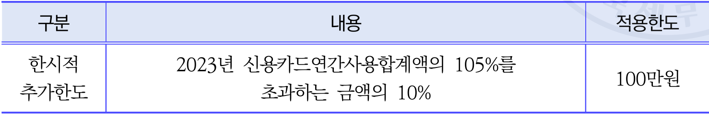

```markdown
| 구분         | 내용                                           | 적용한도 |
| ------------ | ---------------------------------------------- | -------- |
| 한시적 추가한도 | 2023년 신용카드연간사용합계액의 105%를 초과하는 금액의 10% | 100만원  |
```

<<SPLIT>>
elementId: 229
2) 신용카드 사용금액 중 소득공제에서 제외되는 금액
<<SPLIT>>
elementId: 230
| 구분 | 내용 |
| --- | --- |
| 사업관련비용 | 사업소득과 관련된 비용 또는 법인의 비용에 해당하는 경우 |
| 비정상적사용 | 물품의 판매 또는 용역의 제공을 가장하는 비정상적 사용 |
| 자동차구입 | 중고자동차 구매시에는 구입금액의 10%를 신용카드 등 사용금액에 포함 |
| 보험료 등 | 4대보험료 및 각종 보험계약(생명,손해 등) 및 공제료 |
| 교육비 | 유아교육법, 초 · 중등교육법, 고등교육법 또는 특별법에 의한 학교(대학 원포함) 및 영유아보육법에 의한 어린이집에 납부하는 수업료 · 입학금 보육비용 등 |
| 공과금 | 정부 또는 지방자치단체에 납부하는 국세 · 지방세, 전기료 · 수도료 · 가 스료 · 전화료 · 아파트관리비 · TV시청료 · 및 도로통행료 |
| 유가증권구입 | 상품권 등 유가증권 구입비 |
| 자동차 리스료 | 자동차대여사업의 자동차대여로를 포함한 리스료 |
| 자산구입비 | 취득세 또는 등록면허세가 부과되는 재산의 구입비용 |
| 국가 등에 지급 | 국가 · 지방자치단체 등에 지급34)하는 사용료 · 수수료 등 |
| 금융용역 관련 | 차입금 이자상환액, 증권거래수수료 등 금융 · 보험용역과 관련된 지급 액, 수수료, 보증료 및 이와 유사한 대가 |
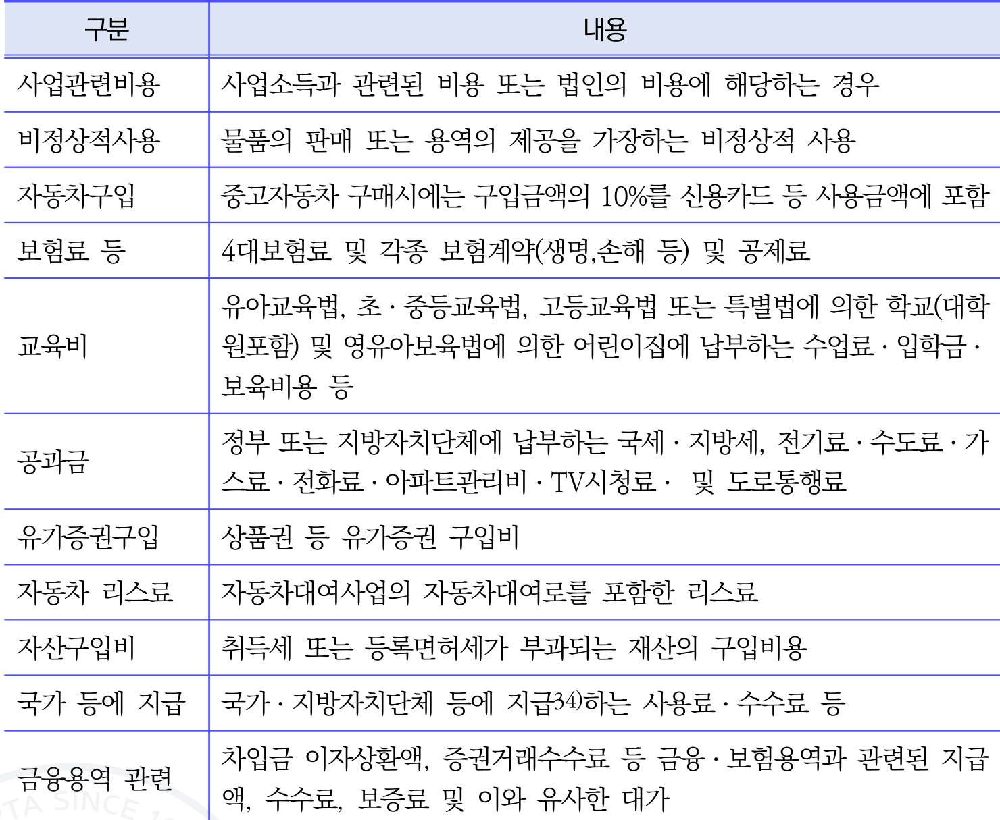

```markdown
| 구분             | 내용                                                                                                                                  |
|------------------|-------------------------------------------------------------------------------------------------------------------------------------|
| 사업관련비용     | 사업소득과 관련된 비용 또는 법인의 비용에 해당하는 경우                                                                                   |
| 비정상적사용     | 물품의 판매 또는 용역의 제공을 가장하는 비정상적 사용                                                                                     |
| 자동차구입       | 중고자동차 구매시에는 구입금액의 10%를 신용카드 등 사용금액에 포함                                                                         |
| 보험료 등        | 4대보험료 및 각종 보험계약(생명,손해 등) 및 공제료                                                                                       |
| 교육비           | 유아교육법, 초·중등교육법, 고등교육법 또는 특별법에 의한 학교(대학원 포함) 및 영유아보육법에 의한 어린이집에 납부하는 수업료·입학금·보육비용 등 |
| 공과금           | 정부 또는 지방자치단체에 납부하는 국세·지방세, 전기료·수도료·가스료·전화료·아파트관리비·TV시청료·및 도로통행료                             |
| 유가증권구입     | 상품권 등 유가증권 구입비                                                                                                               |
| 자동차 리스료    | 자동차대여사업의 자동차대여료를 포함한 리스료                                                                                             |
| 자산구입비       | 취득세 또는 등록면허세가 부과되는 재산의 구입비용                                                                                         |
| 국가 등에 지급    | 국가·지방자치단체 등에 지급하는 사용료·수수료 등                                                                                         |
| 금융용역 관련    | 차입금 이자상환액, 증권거래수수료 등 금융·보험용역과 관련된 지급액, 수수료, 보증료 및 이와 유사한 대가                                        |
```

<<SPLIT>>
elementId: 231
34)
<<SPLIT>>
elementId: 232
연말정산
세무
<<SPLIT>>
elementId: 233
다만, 국가기관 등에 지급하더라도 다음의 금액은 공제 가능
1. 의료기관, 보건소
2. 우정사업운영에 관한 특례법에 의한 우정사업조직이 제공하는 용역 중 소포 우편물을 방문 접수하여
배달하는 용역 및 우편주문판매 대행용역
3. 고속철도 여객운송용역, 부동산임대업, 도 · 소매업, 음식 · 숙박업, 골프장 및 스키장 운영업, 기타운
<<SPLIT>>
elementId: 234
174
<<SPLIT>>
elementId: 235
제3장 연말정산 세액의 계산
<<SPLIT>>
elementId: 236
3) 신용카드 등 사용금액 소득공제와 특별세액공제 중복 적용 여부
<<SPLIT>>
elementId: 237
| 구분 | 구분 | 세액공제항목 | 신용카드소득공제 |
| --- | --- | --- | --- |
| 신용카드로 결제한 의료비 | 신용카드로 결제한 의료비 | 의료비 세액공제 가능 | 공제가능 |
| 신용카드로 결제한 보장성보험료 | 신용카드로 결제한 보장성보험료 | 보험료 세액공제 가능 | 공제불가 |
| 신용카드로 결제한 학원비 | 취학전 아동 | 교육비 세액공제 가능 | 공제가능 |
| 신용카드로 결제한 학원비 | 이외 | 교육비 세액공제 불가 | 공제가능 |
| 신용카드로 결제한 교복구입비 | 신용카드로 결제한 교복구입비 | 교육비 세액공제 가능 | 공제가능 |
| 신용카드로 결제한 기부금 | 신용카드로 결제한 기부금 | 기부금 세액공제 가능 | 공제불가 |
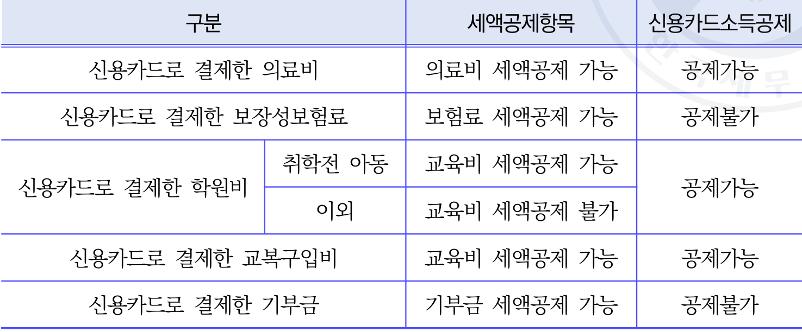

```markdown
| 구분                           | 세액공제항목         | 신용카드소득공제 |
|------------------------------|------------------|--------------|
| 신용카드로 결제한 의료비             | 의료비 세액공제 가능    | 공제가능       |
| 신용카드로 결제한 보장성보험료         | 보험료 세액공제 가능    | 공제불가       |
| 신용카드로 결제한 학원비 (취학전 아동) | 교육비 세액공제 가능    | 공제가능       |
| 신용카드로 결제한 학원비 (이외)       | 교육비 세액공제 불가    |               |
| 신용카드로 결제한 교복구입비          | 교육비 세액공제 가능    | 공제가능       |
| 신용카드로 결제한 기부금             | 기부금 세액공제 가능    | 공제불가       |
```

<<SPLIT>>
elementId: 238
[참고]
<<SPLIT>>
elementId: 239
| 구분 | 제출서류35) |
| --- | --- |
| 신용카드 등 사용금액 소득공제 | 신용카드소득공제신청서, 신용카드 등 사용금액 확인서, 현금영수증, 국세청장이 발급하는 소득공제내역 |


```markdown
| 구분                           | 제출서류(35)                                                                 |
|------------------------------|----------------------------------------------------------------------------|
| 신용카드 등 사용금액 소득공제 | 신용카드소득공제신청서, 신용카드 등 사용금액 확인서, 현금영수증, 국세청장이 발급하는 소득공제내역 |
```

<<SPLIT>>
elementId: 240
(7) 우리사주조합 출연금 소득공제(조특법 제88조의 4)
<<SPLIT>>
elementId: 241
근로복지기본법에 따른 우리사주조합원이 우리사주를 취득하기 위하여 우리사주조합
에 출자하는 경우에는 해당 연도 출자금액과 400만원36) 중 적은 금액을 해당 연도
의 근로소득금액에서 공제한다.
<<SPLIT>>
elementId: 242
소득공제를 적용받은 우리사주를 인출할 때 근로소득으로 과세하되, 보유기간(의무 예
탁기간 종료일 다음 날부터 인출한 날까지)에 따라 소득세를 감면한다.
<<SPLIT>>
elementId: 243
동시설운영업 등
35) 연말정산 간소화 서비스에서 대부분 조회 가능
36) 벤처기업 또는 창업 후 3년내 중소기업은 1,500만원
<<SPLIT>>
elementId: 244
제
1장
근로소득
연말정산(이론편)
제2장
근로소득
연말정산(실전편)
<<SPLIT>>
elementId: 245
제3장
연말정산
세액의
계산
<<SPLIT>>
elementId: 246
제4장
근로소득자의
연말정산
후
4대보험
정산
<<SPLIT>>
elementId: 247
175
<<SPLIT>>
elementId: 248
| 구분 | 구분 | 구분 | 구분 |
| --- | --- | --- | --- |
| 구분 | 구분 | 구분 | 구분 |
| 구분 | 구분 | 구분 | 구분 |
|  | 보유기간 | 감면금액 |  |
| 중소기업의 우리사주조합원 중소기업 외 우리사주조합원 | 중소기업의 우리사주조합원 중소기업 외 우리사주조합원 | 2년 이상 4년 미만 보유 | 인출금의 50% 상당액 |
| 중소기업의 우리사주조합원 중소기업 외 우리사주조합원 | 중소기업의 우리사주조합원 중소기업 외 우리사주조합원 | 4년 이상 6년 미만 보유 | 인출금의 75% 상당액 |
| 중소기업의 우리사주조합원 중소기업 외 우리사주조합원 | 중소기업의 우리사주조합원 중소기업 외 우리사주조합원 | 6년 이상 보유 | 인출금 전액(100%) |
| 중소기업의 우리사주조합원 중소기업 외 우리사주조합원 | 중소기업의 우리사주조합원 중소기업 외 우리사주조합원 | 2년 이상 4년 미만 보유 4년 이상 보유 | 인출금의 50% 상당액 인출금의 75% 상당액 |
| 우리사주조합원이 우리사주조합에서 배정받은 우리사주를 인출하는 경우 해당 법 인은 「우리사주인출 및 과세명세서」를 해당 우리사주 인출일의 다음 연도 2월 말까지 관할 세무서장에게 제출 (8) 고용유지 중소기업 근로자 소득공제 - 고용유지중소기업에 근로를 제공하는 상시근로자37)에 대하여 2026년 12월 31일이 속하는 과세연도까지 임금삭감액의 50%를 해당 과세연도의 근로소득금액에서 공제 한다(조특법 제30조의3 3항) | 우리사주조합원이 우리사주조합에서 배정받은 우리사주를 인출하는 경우 해당 법 인은 「우리사주인출 및 과세명세서」를 해당 우리사주 인출일의 다음 연도 2월 말까지 관할 세무서장에게 제출 (8) 고용유지 중소기업 근로자 소득공제 - 고용유지중소기업에 근로를 제공하는 상시근로자37)에 대하여 2026년 12월 31일이 속하는 과세연도까지 임금삭감액의 50%를 해당 과세연도의 근로소득금액에서 공제 한다(조특법 제30조의3 3항) | 우리사주조합원이 우리사주조합에서 배정받은 우리사주를 인출하는 경우 해당 법 인은 「우리사주인출 및 과세명세서」를 해당 우리사주 인출일의 다음 연도 2월 말까지 관할 세무서장에게 제출 (8) 고용유지 중소기업 근로자 소득공제 - 고용유지중소기업에 근로를 제공하는 상시근로자37)에 대하여 2026년 12월 31일이 속하는 과세연도까지 임금삭감액의 50%를 해당 과세연도의 근로소득금액에서 공제 한다(조특법 제30조의3 3항) | 우리사주조합원이 우리사주조합에서 배정받은 우리사주를 인출하는 경우 해당 법 인은 「우리사주인출 및 과세명세서」를 해당 우리사주 인출일의 다음 연도 2월 말까지 관할 세무서장에게 제출 (8) 고용유지 중소기업 근로자 소득공제 - 고용유지중소기업에 근로를 제공하는 상시근로자37)에 대하여 2026년 12월 31일이 속하는 과세연도까지 임금삭감액의 50%를 해당 과세연도의 근로소득금액에서 공제 한다(조특법 제30조의3 3항) |
|  |  |  |  |
|  |  |  |  |
|  |  |  |  |
| 구 요 건 | 분 | 기 업 | 근 로 자 |
| 구 요 건 | 시간당 임금 유지요건 | 상시근로자(해당 과세연도 중에 근로관계가 성립한 상시근로자는 제외) 의 시간당 임금이 직전연도 대비 감소하지 아니한 경우 | 상시근로자(해당 과세연도 중에 근로관계가 성립한 상시근로자는 제외) 의 시간당 임금이 직전연도 대비 감소하지 아니한 경우 |
| 구 요 건 | 고용유지 | 해당 연도의 상시근로자 인원이 직전연도 대비 감소하지 아니한 경우 | 해당 연도의 상시근로자 인원이 직전연도 대비 감소하지 아니한 경우 |
| 구 요 건 | 상 임금총액 시 감소요건 6. 1개월간의 소정근로시간이 60시간 미만인 근로자 | 상시근로자(해당 과세연도 중에 근로관계가 성립한 상시근로자는 제외) 의 1인당 연간 임금총액이 직전 과세기간에 비하여 감소된 경우 37) 상시근로자에서 적용 제외되는 자 연말정산 2. 법인세법 시행령 제40조 제1항 각 호의 어느 하나에 해당하는 임원 1. 근로계약기간 1년 미만인 자(연속 갱신시는 제외) 3. 해당 기업의 최대주주 또는 최대출자자(개인사업자는 대표자)와 그 배우자 4. 최대 주주 또는 최대출자자 및 그 배우자의 직계존속 · 비속과 그 배우자 세무 5. 근로소득원천징수부에 의하여 근로소득세를 원천징수한 사실이 확인되지 아니하고 건강보험 등 납 부사실이 확인되지 않는 사람 | 상시근로자(해당 과세연도 중에 근로관계가 성립한 상시근로자는 제외) 의 1인당 연간 임금총액이 직전 과세기간에 비하여 감소된 경우 37) 상시근로자에서 적용 제외되는 자 연말정산 2. 법인세법 시행령 제40조 제1항 각 호의 어느 하나에 해당하는 임원 1. 근로계약기간 1년 미만인 자(연속 갱신시는 제외) 3. 해당 기업의 최대주주 또는 최대출자자(개인사업자는 대표자)와 그 배우자 4. 최대 주주 또는 최대출자자 및 그 배우자의 직계존속 · 비속과 그 배우자 세무 5. 근로소득원천징수부에 의하여 근로소득세를 원천징수한 사실이 확인되지 아니하고 건강보험 등 납 부사실이 확인되지 않는 사람 |
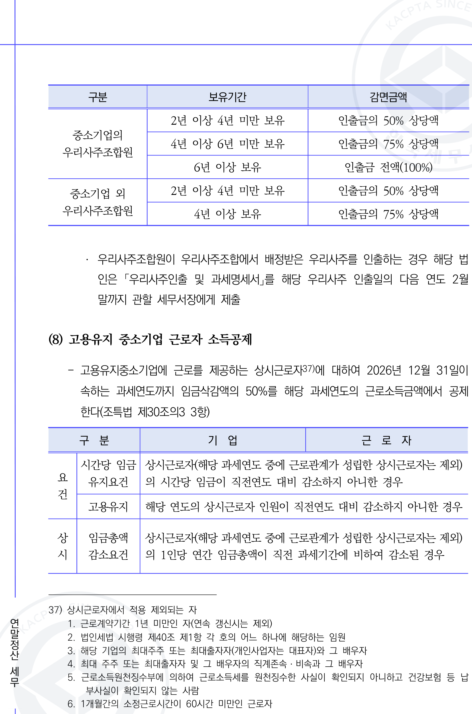

```markdown
| 구분               | 보유기간            | 감면금액            |
|------------------|-----------------|-----------------|
| 중소기업의 우리사주조합원 | 2년 이상 4년 미만 보유 | 인출금의 50% 상당액 |
| 중소기업의 우리사주조합원 | 4년 이상 6년 미만 보유 | 인출금의 75% 상당액 |
| 중소기업의 우리사주조합원 | 6년 이상 보유        | 인출금 전액(100%)   |
| 중소기업 외 우리사주조합원 | 2년 이상 4년 미만 보유 | 인출금의 50% 상당액 |
| 중소기업 외 우리사주조합원 | 4년 이상 보유        | 인출금의 75% 상당액 |

- 우리사주조합원이 우리사주조합에서 배정받은 우리사주를 인출하는 경우 해당 법인은 '우리사주인출 및 과세명세서'를 해당 우리사주 인출일의 다음 연도 2월 말까지 관할 세무서장에게 제출

(8) 고용유지 중소기업 근로자 소득공제

- 고용유지중소기업에 근로를 제공하는 상시근로자에 대하여 2026년 12월 31일이 속하는 과세연도까지 임금삭감액의 50%를 해당 과세연도의 근로소득금액에서 공제한다(조특법 제30조의3 3항)

| 구분   | 기업                                                                 | 근로자                                                                 |
|------|--------------------------------------------------------------------|--------------------------------------------------------------------|
| 요건   | 시간당 임금 유지요건: 상시근로자(해당 과세연도 중에 근로관계가 성립한 상시근로자는 제외)의 시간당 임금이 직전연도 대비 감소하지 아니한 경우 | 고용유지: 해당 연도의 상시근로자 인원이 직전연도 대비 감소하지 아니한 경우                        |
| 상시   | 임금총액 감소요건: 상시근로자(해당 과세연도 중에 근로관계가 성립한 상시근로자는 제외)의 1인당 연간 임금총액이 직전 과세기간에 비하여 감소된 경우 |

37) 상시근로자에서 적용 제외되는 자
1. 근로계약기간 1년 미만인 자(연속 갱신시는 제외)
2. 법인세법 시행령 제40조 제1항 각 호의 어느 하나에 해당하는 임원
3. 해당 기업의 최대주주 또는 최대출자자(개인사업자는 대표자)와 그 배우자
4. 최대 주주 또는 최대출자자 및 그 배우자의 직계존속·비속과 그 배우자
5. 근로소득원천징수부에 의하여 근로소득세를 원천징수한 사실이 확인되지 아니하고 건강보험 등 납부사실이 확인되지 않는 사람
6. 1개월간의 소정근로시간이 60시간 미만인 근로자
```

<<SPLIT>>
elementId: 249
176
<<SPLIT>>
elementId: 251
제3장 연말정산 세액의 계산
<<SPLIT>>
elementId: 252
| 구 분 | 구 분 | 기 업 | 근 로 자 |
| --- | --- | --- | --- |
| 근 로 자 | 인원 산정방법 | 직전 또는 해당 연도의 매월 말일 현재의 상시 근로자 수를 합하여 직전 또는 해당 연도의 월수로 나누어 산정한 인원수 | 직전 또는 해당 연도의 매월 말일 현재의 상시 근로자 수를 합하여 직전 또는 해당 연도의 월수로 나누어 산정한 인원수 |
| 근 로 자 | 1인당 시간당 임금 | 임금총액을 근로시간 합계로 나눈 금액 ① 임금총액 : 통상임금과 정기상여금 등 고정급 성격의 급여 ② 근로시간 합계 : 직전 또는 해당 연도의 상시근로자의 근로계약상 근 로시간(단시간근로자의 1개월 근로시간이 60시간 이상이면 실제 근 로시간)의 합계 | 임금총액을 근로시간 합계로 나눈 금액 ① 임금총액 : 통상임금과 정기상여금 등 고정급 성격의 급여 ② 근로시간 합계 : 직전 또는 해당 연도의 상시근로자의 근로계약상 근 로시간(단시간근로자의 1개월 근로시간이 60시간 이상이면 실제 근 로시간)의 합계 |
| 근 로 자 | 1인당 연간 임금총액 | 임금총액을 상시근로자 수로 나눈 금액 ① 임금총액 : 통상임금과 정기상여금 등 고정급 성격의 급여 ② 상시근로자 수 : 직전 또는 해당 연도의 매월 말 현재 상시근로자 수 의 합/ 직전 또는 해당 연도의 개월 수 | 임금총액을 상시근로자 수로 나눈 금액 ① 임금총액 : 통상임금과 정기상여금 등 고정급 성격의 급여 ② 상시근로자 수 : 직전 또는 해당 연도의 매월 말 현재 상시근로자 수 의 합/ 직전 또는 해당 연도의 개월 수 |
| 공제한도 | 공제한도 | - | 연 1천만원 |
| 일몰기한 | 일몰기한 | 2026.12.31.이 속하는 과세연도 | 2026.12.31.이 속하는 과세연도 |
**19**
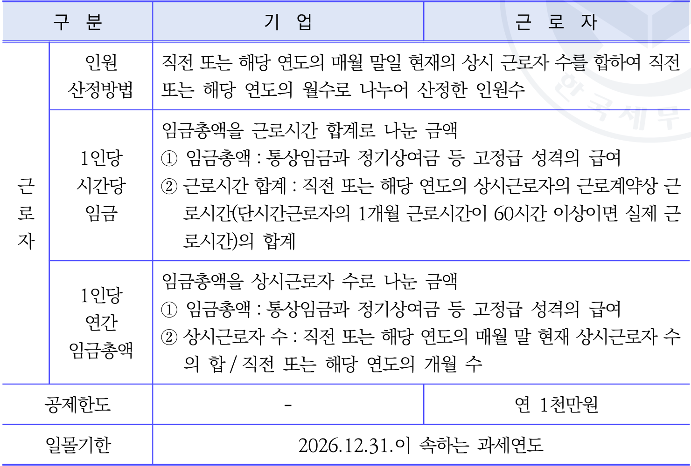

```markdown
| 구분         | 기업                                                                 | 근로자                                                                                                                                                                                                 |
|--------------|--------------------------------------------------------------------|-----------------------------------------------------------------------------------------------------------------------------------------------------------------------------------------------------|
| 인원 산정방법 | 직전 또는 해당 연도의 매월 말일 현재의 상시 근로자 수를 합하여 직전 또는 해당 연도의 월수로 나누어 산정한 인원수 |                                                                                                                                                                                                     |
| 근로자       | 1인당 시간당 임금                                                  | 임금총액을 근로시간 합계로 나눈 금액<br>① 임금총액: 통상임금과 정기상여금 등 고정급 성격의 급여<br>② 근로시간 합계: 직전 또는 해당 연도의 상시근로자의 근로계약상 근로시간(단시간근로자의 1개월 근로시간이 60시간 이상이면 실제 근로시간)의 합계 |
|              | 1인당 연간 임금총액                                                | 임금총액을 상시근로자 수로 나눈 금액<br>① 임금총액: 통상임금과 정기상여금 등 고정급 성격의 급여<br>② 상시근로자 수: 직전 또는 해당 연도의 매월 말 현재 상시근로자 수의 합 / 직전 또는 해당 연도의 개월 수                                 |
| 공제한도     | -                                                                  | 연 1천만원                                                                                                                                                                                           |
| 일몰기한     | 2026.12.31.이 속하는 과세연도                                      |                                                                                                                                                                                                     |
```

<<SPLIT>>
elementId: 253
(9) 장기집합투자증권저축 소득공제(조특법 제91조의 16)
<<SPLIT>>
elementId: 255
| 요건 | 요건 |
| --- | --- |
| ① | 장기집합투자증권저축 가입자가 가입 당시 직전 과세기간의 총급여액이 5천만원 이하인 근로소득이 있는 거주자 일 것38) |
| ② | 자산총액의 100분의 40 이상을 국내에서 발행되어 국내에서 거래되는 주식에 투자 하는 「소득세법」 제17조 제1항 제5호에 따른 집합투자기구의 집합투자증권 취득을 위한 저축일 것 |
| ③ | 장기집합투자증권저축 계약기간이 10년 이상이고 저축가입일부터 10년 미만의 기 간 내에 원금 · 이자 · 배당 · 주식 또는 수익증권 등의 인출이 없을 것 |
| ④ | 적립식 저축으로서 1인당 연 600만원39) 이내에서 납입할 것 |
**- 근로소득이 있는 거주자(일용근로자는 제외)가 다음의 요건을 모두 갖춘 장기집합투자증권저축에 2015년 12월 31일까지 가입하는 경우 가입한 날로부터 10년 동안 각과세기간에 납입한 금액의 100분의 40에 해당하는 금액을 해당 과세기간의 근로소득금액에서 공제한다.**
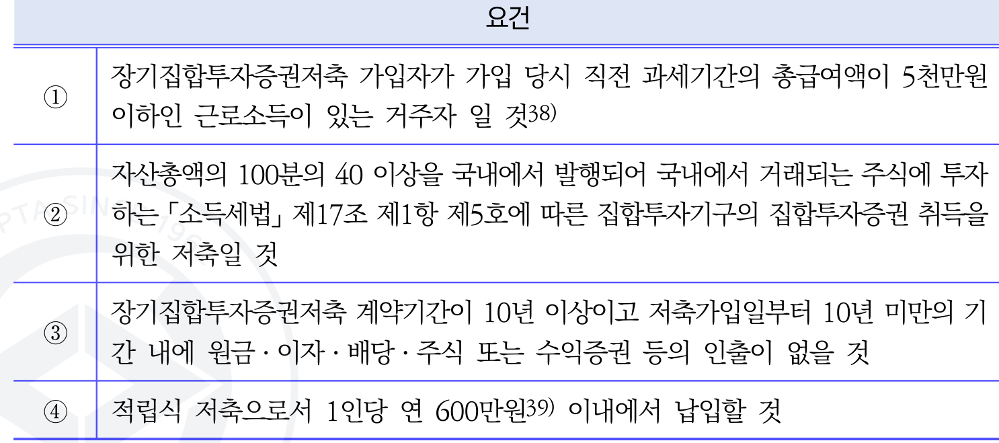

```markdown
|     | 조건                                                                                     |
|-----|----------------------------------------------------------------------------------------|
| ①  | 장기집합투자증권저축 가입자가 가입 당시 직전 과세기간의 총급여액이 5천만원 이하인 근로소득이 있는 거주자 일 것38) |
| ②  | 자산총액의 100분의 40 이상을 국내에서 발행되어 국내에서 거래되는 주식에 투자하는 「소득세법」 제17조 제1항 제5호에 따른 집합투자기구의 집합투자증권 취득을 위한 저축일 것 |
| ③  | 장기집합투자증권저축 계약기간이 10년 이상이고 저축가입일부터 10년 미만의 기간 내에 원금·이자·배당·주식 또는 수익증권 등의 인출이 없을 것 |
| ④  | 적립식 저축으로서 1인당 연 600만원39) 이내에서 납입할 것                                           |
```

<<SPLIT>>
elementId: 256
제
1장
근로소득
연말정산(이론편)
제2장
근로소득
연말정산(실전편)
<<SPLIT>>
elementId: 257
제3장
연말정산
세액의
계산
<<SPLIT>>
elementId: 258
제4장
근로소득자의
연말정산
후
4대보험
정산
<<SPLIT>>
elementId: 259
177
<<SPLIT>>
elementId: 260
1) 소득공제의 배제
<<SPLIT>>
elementId: 261
① 해당과세기간에 근로소득이 없는 경우 해당 과세기간에 소득공제를 배제한다.
② 해당 과세기간에 근로소득만 있거나, 근로소득 및 종합소득과세표준에 합산되지
않는 종합소득이 있는 경우로서 총급여액이 8천만원을 초과하는 경우 해당 과세
기간에 소득공제를 배제한다.
③ 해당 저축의 가입일부터 10년 미만의 기간 내에 인출 · 해지 · 양도 한 경우 해당
과세기간부터 공제하지 아니한다.
<<SPLIT>>
elementId: 262
해석사례
<<SPLIT>>
elementId: 263
오피스텔을 주거용으로 사용하는 경우 재산세 시가표준액
<<SPLIT>>
elementId: 264
오피스텔은 부동산공시법에 따라 공시되는 부동산이 아니므로, 오피스텔을 주택으로 과세하는
경우 해당 건물부분과 그 부속토지부분을 각각 구분하여 산출한 시가표준액의 합을 주택의
시가표준액으로 봄.
[문서번호] 행정안전부 지방세운영과-2241(2010.05.28)
<<SPLIT>>
elementId: 265
미공시 공동주택 시가표준액 변경 적용 여부
<<SPLIT>>
elementId: 266
국토교통부가 추가 공시한 공동주택가격은 산정가액보다 낮다는 이유로 재산세 과세기준일에
소급적용 될 수 없고, 지방세 관계법령에서 정한 바에 따라 과세처분을 원인으로 한 이의신청
등을 통해 산정한 자치단체에서 근거자료의 타당성 등을 재검토하여 소급적용 여부를 결정함
이 타당하다고 판단됨.
<<SPLIT>>
elementId: 267
[문서번호] 행정안전부 부동산세제과-907(2022.04.01)
<<SPLIT>>
elementId: 268
공시가격이 없는 주택의 합산배제 적용
<<SPLIT>>
elementId: 269
임대개시일 또는 최초로 합산배제 신고를 한 연도의 과세기준일 현재 해당 임대주택의 공시
가격이 없는 경우 지방법 §4① 단서 및 같은 조 ②에 따른 가액으로 적용하는 것임.
[문서번호] 서면부동산2020-4604(2020.11.26.), 서면부동산2019-290(2019.07.09)
<<SPLIT>>
elementId: 270
연말정산
세무
<<SPLIT>>
elementId: 271
38) 직전 과세기간에 근로소득만 있거나 근로소득 및 종합소득과세표준에 합산되지 않는 종합소득이 있는
경우로 한정한다.
39) 해당 거주자가 가입한 모든 장기집합투자증권저축의 합계액
<<SPLIT>>
elementId: 272
178
<<SPLIT>>
elementId: 273
제3장 연말정산 세액의 계산
<<SPLIT>>
elementId: 274
[참고]
<<SPLIT>>
elementId: 275
장기집합투자증권저축에 대한 소득공제를 받으려는 자는 연말정산 시 「근로자 소득 · 세액공
제신고서」와 함께 저축취급기관으로 발급받은 「장기집합투자증권저축 납입증명서」40)를 제출
하여야 한다.
<<SPLIT>>
elementId: 276
(10) 청년형 장기집합투자증권저축에 대한 소득공제(조특법 제91조의 20)
<<SPLIT>>
elementId: 277
- 대통령령41)으로 정하는 청년으로서 소득기준42)을 충족하는 거주자가 청년형장기집합
투자증권저축43)에 2024년 12월 31일까지 가입하는 경우 계약기간 동안 각 과세기
간에 납입한 금액의 100분의 40에 해당하는 금액을 해당 과세기간의 종합소득금액
에서 공제한다.
<<SPLIT>>
elementId: 278
1) 소득공제의 배제
<<SPLIT>>
elementId: 279
① 해당 과세기간에 근로소득만 있거나 근로소득과 종합소득과세표준에 합산되지 아
니하는 종합소득만 있는 경우로서 총급여액이 8천만원을 초과하는 경우 해당과세
기간에 소득공제를 배제한다.
<<SPLIT>>
elementId: 280
② 해당 과세기간에 종합소득과세표준에 합산되는 종합소득금액이 6천7백만원을 초
과하는 경우 해당과세기간에 소득공제를 배제한다.
<<SPLIT>>
elementId: 281
③ 해당 과세기간에 근로소득 및 종합소득과세표준에 합산되는 종합소득금액이 없는
<<SPLIT>>
elementId: 282
40) 연말정산간소화 서비스 이용 가능
41) 청년형장기집합투자증권저축의 가입일 현재 19세 이상 34세(병역의무 이행자는 6년을 한도로 하여 가
입일 현재 연령에서 빼고 계산한 연령이 34세 이하인 사람) 이하인 사람을 말한다.
42) 다음 중 어느 하나에 해당하는 소득기준을 충족할 것
1. 직전 과세기간의 총급여액이 5천만원 이하일 것(직전 과세기간에 근로소득만 있거나 근로소득과 종
합소득 과세표준에 합산되지 아니하는 종합소득만 있는 경우로 한정하고, 비과세소득만 있는 경우
는 제외한다)
2. 직전 과세기간의 종합소득과세표준에 합산되는 종합소득금액이 3천8백만원 이하일 것(직전 과세기간
의 총 급여액이 5천만원을 초과하는 근로소득이 있는 경우 및 비과세소득만 있는 경우는 제외한다)
43) 다음 요건을 모두 갖춘 저축
1. 자산총액의 100분의 40 이상을 「자본시장과 금융투자업에 관한 법률」 제9조 제15항 제3호에 따
른 주권상장법인의 주식에 투자하는 집합투자기구의 집합투자증권을 취득하기 위한 저축일 것
2. 계약기간이 3년 이상 5년 이하일 것
3. 적립식 저축으로서 1인당 납입금액이 연 600만원(해당 거주자가 가입한 모든 청년형장기집합투자
증권저축의 합계액을 말한다) 이내일 것
<<SPLIT>>
elementId: 283
제
1
장
근로소득
연말정산(이론편)
제2장
근로소득
연말정산(실전편)
<<SPLIT>>
elementId: 284
제4장
근로소득자의
연말정산
후
4대보험
정산
<<SPLIT>>
elementId: 285
제3장
연말정산
세액의
계산
<<SPLIT>>
elementId: 286
179
<<SPLIT>>
elementId: 287
경우 해당과세기간에 소득공제를 배제한다.
<<SPLIT>>
elementId: 288
④ 청년형장기집합투자증권저축을 해지하고 대통령령44)으로 정하는 요건을 갖추어
다른 청년형장기집합투자증권저축에 가입한 경우. 이 경우 소득공제 대상에서 제
외되는 금액은 그 다른 청년형장기집합투자증권저축에 납입된 금액 중 전환가입
에 따라 종전의 청년형장기집합투자증권저축에서 이체된 금액으로 한정한다.
<<SPLIT>>
elementId: 289
⑤ 비과세 등 조세특례 또는 「소득세법」 제20조의3 제1항 제2호를 적용받는
저축45) 등의 경우에는 소득공제를 적용하지 아니한다.
<<SPLIT>>
elementId: 290
2) 세액추징
<<SPLIT>>
elementId: 291
- 저축취급기관은 가입자가 가입일부터 3년 미만의 기간 내에 청년형장기집합투자증
권저축을 해지하는 경우 해당 저축에 납입한 금액의 누계액에 100분의 6을 곱한
금액을 추징하여 저축계약이 해지된 날이 속하는 달의 다음달 10일까지 원천징수
관할 세무서장에게납부하여야 한다.
<<SPLIT>>
elementId: 292
05 소득공제 종합한도 (조특법 제132조의2)
<<SPLIT>>
elementId: 293
- 과도한 소득공제 적용을 배제하기 위해 2013.1.1. 이후 발생하는 소득분부터
소득공제 종합한도(2,500만원) 초과액에 대해서는 그 초과하는 금액은 없는
것으로 본다.
<<SPLIT>>
elementId: 294
44) 다음의 요건을 모두 충족하는 경우를 말한다
<<SPLIT>>
elementId: 295
연말정산
세무
<<SPLIT>>
elementId: 296
1. 기존 청년형장기집합투자증권저축의 해지일이 속하는 달의 다음달 말일까지 다른 청년형장기집합
투자증권저축에 가입할 것(저축취급기관이 동일한 경우로 한정한다)
2. 기존 청년형장기집합투자증권저축을 해지함으로써 지급받은 금액 전액을 다른 청년형장기집합투자증
권저축에 납입할 것
<<SPLIT>>
elementId: 297
45) 연금저축계좌, 퇴직연금계좌
<<SPLIT>>
elementId: 298
180
<<SPLIT>>
elementId: 299
제3장 연말정산 세액의 계산
<<SPLIT>>
elementId: 300
| 종합한도가 적용되는 특별소득공제 등 항목 | 종합한도가 적용되는 특별소득공제 등 항목 |
| --- | --- |
| ① | 주택자금공제(주택임차차입금 원리금상환액, 장기주택저당차입금 이자상환액) |
| ② | 벤처투자조합 출자 등 소득공제(벤처기업 등에 출자 또는 투자하는 경우는 제외) |
| ③ | 소기업 · 소상공인 공제부금 |
| ④ | 주택마련저축(청약저축, 주택청약종합저축, 근로자우대저축) |
| ⑤ | 우리사주조합 출연금, 장기집합투자증권저축에 대한 소득공제 |
| ⑥ | 신용카드 등 사용금액에 대한 소득공제 |
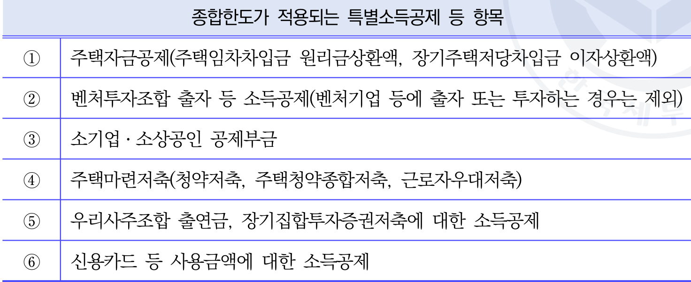

```markdown
| 종합한도가 적용되는 특별소득공제 등 항목                                                                 |
|----------------------------------------------------------------------------------------------------------|
| ① 주택자금공제(주택임차차입금 원리금상환액, 장기주택저당차입금 이자상환액)                               |
| ② 벤처투자조합 출자 등 소득공제(벤처기업 등에 출자 또는 투자하는 경우는 제외)                           |
| ③ 소기업·소상공인 공제부금                                                                               |
| ④ 주택마련저축(청약저축, 주택청약종합저축, 근로자우대저축)                                               |
| ⑤ 우리사주조합 출연금, 장기집합투자증권저축에 대한 소득공제                                               |
| ⑥ 신용카드 등 사용금액에 대한 소득공제                                                                   |
```

<<SPLIT>>
elementId: 301
제2절 세액과 감면
<<SPLIT>>
elementId: 302
01 산출세액
<<SPLIT>>
elementId: 304
| 과세표준 | 기본세율 |
| --- | --- |
| 과세표준 | 간편계산법 |
| 1천4백만원 이하 | 과세표준 x 6% |
| 1천4백만원 이하 | 과세표준 x 6% |
| 1천4백만원 초과 ~ 5천만원 이하 | 84만원 + (1천4백만원 초과금액 x 15%) |
| 1천4백만원 초과 ~ 5천만원 이하 | 과세표준 x 15% - 126만원 |
| 5천만원 초과 ~ 8천8백만원 이하 | 624만원 + (5천만원 초과금액 x 24%) |
| 5천만원 초과 ~ 8천8백만원 이하 | 과세표준 x 24% - 576만원 |
| 8천8백만원 초과 ~ 1억5천만원 이하 | 1천536만원 + (8천8백만원 초과금액 x 35%) |
| 8천8백만원 초과 ~ 1억5천만원 이하 | 과세표준 x 35% - 1천544만원 |
| 1억5천만원 초과 ~ 3억원 이하 | 3천706만원 + (1억5천만원 초과금액 x 38%) |
**- 산출세액은 종합소득 과세표준에 종합소득 기본세율을 적용하여 산출한다.**
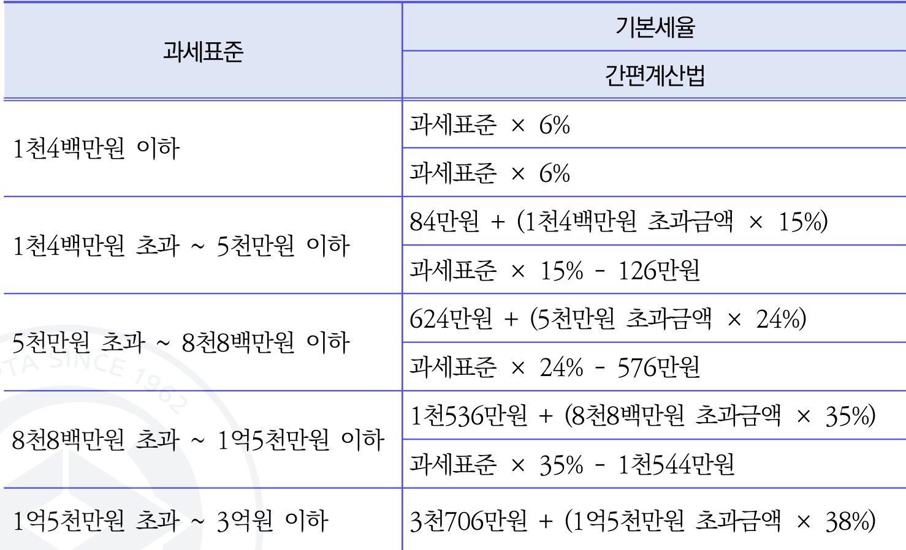

```markdown
| 과세표준                     | 기본세율                              | 간편계산법                                      |
|-----------------------------|---------------------------------------|------------------------------------------------|
| 1천4백만원 이하             | 과세표준 × 6%                         | 과세표준 × 6%                                   |
| 1천4백만원 초과 ~ 5천만원 이하 | 84만원 + (1천4백만원 초과금액 × 15%)  | 과세표준 × 15% - 126만원                        |
| 5천만원 초과 ~ 8천8백만원 이하 | 624만원 + (5천만원 초과금액 × 24%)    | 과세표준 × 24% - 576만원                        |
| 8천8백만원 초과 ~ 1억5천만원 이하 | 1천536만원 + (8천8백만원 초과금액 × 35%) | 과세표준 × 35% - 1천544만원                     |
| 1억5천만원 초과 ~ 3억원 이하   | 3천706만원 + (1억5천만원 초과금액 × 38%) | 과세표준 × 38% - 4천206만원                     |
```

<<SPLIT>>
elementId: 305
제
1장
근로소득
연말정산(이론편)
제2장
근로소득
연말정산(실전편)
<<SPLIT>>
elementId: 306
제3장
연말정산
세액의
계산
<<SPLIT>>
elementId: 307
제4장
근로소득자의
연말정산
후
4대보험
정산
<<SPLIT>>
elementId: 308
181
<<SPLIT>>
elementId: 309
| 과세표준 | 기본세율 |
| --- | --- |
| 과세표준 | 간편계산법 |
|  | 과세표준 x 38% - 1천994만원 |
| 3억원 초과 ~ 5억원 이하 | 9천406만원 + (3억원 초과금액 x 40%) |
| 3억원 초과 ~ 5억원 이하 | 과세표준 x 40% - 2천594만원 |
| 5억원 초과 ~ 10억원 이하 | 1억7천406만원 + (5억원 초과금액 X 42%) |
| 5억원 초과 ~ 10억원 이하 | 과세표준 x 42% - 3천594만원 |
| 10억원 초과 | 3억8천406만원 + (10억원 초과금액 x 45%) |
| 10억원 초과 | 과세표준 x 45% - 6천594만원 |
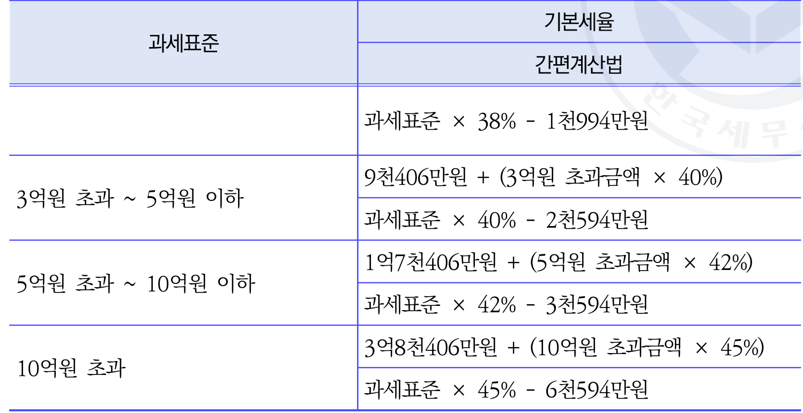

```markdown
| 과세표준               | 기본세율                          | 간편계산법                                      |
|------------------------|----------------------------------|------------------------------------------------|
| 과세표준               | 과세표준 × 38% - 1천994만원      | 과세표준 × 38% - 1천994만원                     |
| 3억원 초과 ~ 5억원 이하 | 9천406만원 + (3억원 초과금액 × 40%) | 9천406만원 + (3억원 초과금액 × 40%)             |
| 과세표준               | 과세표준 × 40% - 2천594만원      | 과세표준 × 40% - 2천594만원                     |
| 5억원 초과 ~ 10억원 이하| 1억7천406만원 + (5억원 초과금액 × 42%) | 1억7천406만원 + (5억원 초과금액 × 42%)         |
| 과세표준               | 과세표준 × 42% - 3천594만원      | 과세표준 × 42% - 3천594만원                     |
| 10억원 초과            | 3억8천406만원 + (10억원 초과금액 × 45%) | 3억8천406만원 + (10억원 초과금액 × 45%)         |
| 과세표준               | 과세표준 × 45% - 6천594만원      | 과세표준 × 45% - 6천594만원                     |
```

<<SPLIT>>
elementId: 310
02 종합소득 결정세액
<<SPLIT>>
elementId: 311
종합소득 결정세액 = 종합소득산출세액 - 소득세법 · 조세특례제한법상 세액공제 · 세액감면46)
<<SPLIT>>
elementId: 312
03
<<SPLIT>>
elementId: 313
세액감면 (소득법 제59조의5)
<<SPLIT>>
elementId: 314
- 법률에 따라 소득세가 감면되는 경우 그 법률에 특별한 규정이 있는 경우 외
에는 종합소득산출세액에서 그 세액에 해당 근로소득금액 또는 사업소득금액
이 종합소득에서 차지하는 비율을 곱하여 계산한 금액 상당액을 감면한다.
<<SPLIT>>
elementId: 315
46) 세액감면과 세액공제 적용순서는 다음과 같다.
<<SPLIT>>
elementId: 316
연말정산
세무
<<SPLIT>>
elementId: 317
1. 해당 과세기간의 소득에 대한 소득세의 감면
2. 이월공제가 인정되지 아니하는 세액공제
3. 이월공제가 인정되는 세액공제. 이 경우 해당 과세기간 중에 발생한 세액공제와 이전 과세기간에서
이월된 미공제액이 함께 있을 때에는 이월된 미공제액을 먼저 공제함.
<<SPLIT>>
elementId: 318
182
<<SPLIT>>
elementId: 319
제3장 연말정산 세액의 계산
<<SPLIT>>
elementId: 320
(1) 중소기업 취업자에 대한 소득세 감면(조특법 제30조)
<<SPLIT>>
elementId: 321
- 근로계약 체결일 현재 연령이 15세이상 34세 이하인 청년, 60세 이상인 사람, 장애
인 및 경력단절 여성이 일정한 중소기업(비영리기업 포함)에 2026년 12월 31일까지
취업하는 경우 그 중소기업체로부터 받는 근로소득으로서 취업일부터 3년(청년의 경
우에는 5년47))이 되는 날이 속하는 달까지 발생한 소득에 대해서는 소득세의 70%
(청년의 경우 90%)에 상당하는 세액을 감면한다.
<<SPLIT>>
elementId: 322
1) 감면대상
<<SPLIT>>
elementId: 323
① 청년48)
② 60세 이상의 사람 : 근로계약 체결일 현재 연령이 60세 이상인 사람
③ 장애인49)
④ 경력단절여성50)
<<SPLIT>>
elementId: 324
2) 감면 제외 대상자
<<SPLIT>>
elementId: 325
① 「법인세법 시행령」 제40조 제1항 각호에 따른 법인의 회장, 사장, 이사장, 전무
<<SPLIT>>
elementId: 326
이사, 이사회 구성원 등 법인세법상 임원
<<SPLIT>>
elementId: 327
② 해당 기업의 최대주주 또는 최대출자자(개인사업자는 대표자)와 그 배우자
<<SPLIT>>
elementId: 328
③ 해당 기업의 최대주주 또는 최대출자자 및 그 배우자의 직계존속 · 직계비속(그
배우자 포함) 및 그 친족
<<SPLIT>>
elementId: 329
47) 청년으로서 병역을 이행한 후 1년 이내에 병역 이행 전에 근로를 제공한 중소기업체에 복직하는 경우
에는 복직한 날부터 2년이 되는 날을 말하며, 그 복직한 날이 최초취업일부터 5년이 지나지 아니한
경우에는 최초 취업일부터 7년이 되는 날을 말한다)
48) 근로계약 체결일 현재 연령이 15세 이상 34세 이하인 청년으로서 병역을 이행한 경우에는 병역이행기
간(최대 6년 한도)을 뺀 연령이 34세 이하인 사람을 포함
49) 「장애인복지법」의 적용을 받는 장애인, 「국가 유공자 등 예우 및 지원에 관한 법률」에 따른 상이자,
「5 · 18민주유공자예우 및 단체설립에 관한 법률」 제4조 제2호에 따른 5 · 18민주화운동부상자, 「고엽
제후유의증 등 환자지원 및 단체설립에 관한 법률」에 따른 고엽제후유의증환자로서 장애등급 판정을
받은 사람
50) 다음의 요건을 모두 충족한 경력단절여성으로서 2017.1.1. 이후 동일 중소기업에 재취업하여 지급하는
분부터 적용
1. 해당 중소기업에서 1년 이상 근무하였을 것
2. 결혼 · 임신 · 출산 · 육아 및 자녀교육의 사유로 해당 중소기업에서 퇴직하였을 것
3. 해당 중소기업에서 퇴직한 날부터 2년 이상 15년 미만의 기간이 지났을 것
<<SPLIT>>
elementId: 330
4. 해당 중소기업의 최대주주 등과 특수관계인이 아닐 것
<<SPLIT>>
elementId: 331
제
1
장
근로소득
연말정산(이론편)
제2장
근로소득
연말정산(실전편)
<<SPLIT>>
elementId: 332
제3장
연말정산
세액의
계산
<<SPLIT>>
elementId: 333
제4장
근로소득자의
연말정산
후
4대보험
정산
<<SPLIT>>
elementId: 334
183
<<SPLIT>>
elementId: 335
④ 소득세법에 따른 일용근로자
⑤ 국민연금 및 직장가입자로서의 건강보험료의 납부사실이 확인되지 아니하는 사
람51)
<<SPLIT>>
elementId: 336
3) 감면대상 중소기업
<<SPLIT>>
elementId: 337
- 중소기업기본법 제2조에 따른 중소기업으로 다음의 해당 업종을 주된 사업으로
영위
<<SPLIT>>
elementId: 338
농업, 임업 및 어업, 광업, 제조업, 전기 · 가스 · 증기 및 공기조절공급업, 수도 · 하수 · 폐기물
처리 · 원료재생업, 건설업, 도매 및 소매업, 운수업 및 창고업, 숙박 및 음식점업(주점 및 비알
콜음료점업은 제외), 정보통신업(비디오물 감상실 운영업 제외), 부동산업, 연구개발업, 광고업,
시장조사 및 여론조사업, 건축기술 · 엔지니어링 및 기타 과학기술서비스업, 기타 전문 · 과학
및 기술서비스업, 사업시설관리, 사업지원 및 임대 서비스업, 기술 및 직업훈련 학원, 사회복지
서비스업, 개인 및 소비용품 수리업, 창작 및 예술관련 서비스업, 도서관, 사적지 및 유사 여가
관련 서비스업, 스포츠 서비스업
<<SPLIT>>
elementId: 340
| 구분 | 구분 | 2018년 개정 전 | 2018년 개정 후 |
| --- | --- | --- | --- |
| 조특법 30조 | 감면대상기간 | 3년 | 5년 |
| 조특법 30조 | 감면율 | 70% | 90% |
| 조특령 27조 | 대상 연령 | 15~29세 | 15~34세 |
**4) 감면내용① 감면내용**
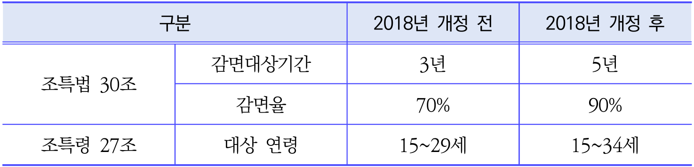

```markdown
| 구분       | 2018년 개정 전 | 2018년 개정 후 |
|------------|----------------|----------------|
| 조특법 30조 | 감면대상기간     | 3년            |
| 조특법 30조 | 감면대상기간     | 5년            |
| 조특법 30조 | 감면율         | 70%            |
| 조특법 30조 | 감면율         | 90%            |
| 조특령 27조 | 대상 연령      | 15~29세        |
| 조특령 27조 | 대상 연령      | 15~34세        |
```

<<SPLIT>>
elementId: 341
연말정산
세무
<<SPLIT>>
elementId: 342
51) 「국민연금법」 제6조 단서에 따라 국민연금 가입 대상이 되지 아니하는 자와 「국민건강보험법」 제5조
제1항 단서에 따라 건강보험 가입자가 되지 아니하는 자는 제외한다
<<SPLIT>>
elementId: 343
184
<<SPLIT>>
elementId: 344
제3장 연말정산 세액의 계산
<<SPLIT>>
elementId: 345
② 중소기업 취업자 소득세 감면 개정 연혁
<<SPLIT>>
elementId: 346
| 개정일 | 감면내용 | 대상자 | 일몰 |
| --- | --- | --- | --- |
| 2011.12.31. 신설 | 3년간 100% | 청년(15세~29세) | 2013.12.31. |
| 2014.1.1. | 3년간 50% 감면 | . 청년(15세~29세) · 60세 이상자 · 장애인 | 2015.12.31. |
| 2015.12.15. | 3년간 70% 감면 (150만원 한도) | · 청년(15세~29세) · 60세 이상자 · 장애인, 경력단절여성 | 2018.12.31. |
| 2016.12.20. | 3년간 70% 감면 (150만원 한도) | · 청년(15세~29세) · 60세 이상자 · 장애인, 경력단절여성 | 2018.12.31 |
| 2018.5.29. | 3년간 70% 감면 (150만원 한도) 청년 : 5년간 90% (150만원 한도) 감면 | · 청년(15세~34세) 60세 이상자 · 장애인, 경력단절여성 | 2018.12.31. 청년 : 23021.12.31. |
| 2018.12.24. | 3년간 70% 감면 (200만원 한도) 청년 : 5년간 90% (150만원 한도) 감면 | · 청년(15세~34세) 60세 이상자 . 장애인, 경력단절여성 | 2021.12.28. |
| 2021.12.28 | 3년간 70% 감면 (200만원 한도) 청년 : 5년간 90% (150만원 한도) 감면 | · 청년(15세~34세) 60세 이상자 . 장애인, 경력단절여성 | 2023.12.31. |
| 2022.12.28. | 3년간 70% 감면 (200만원 한도) 청년 : 5년간 90% (2000만원 한도) 감면 | · 청년(15세~34세) 60세 이상자 . 장애인, 경력단절여성 | 2023.12.31. |
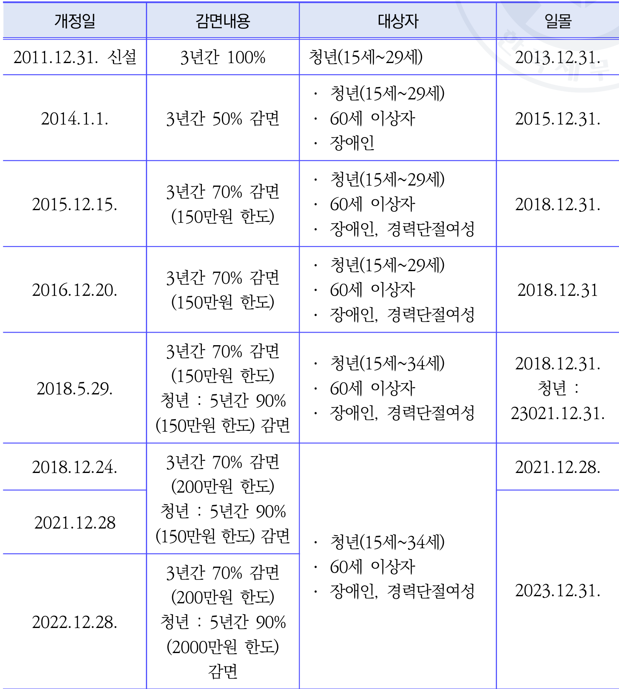

```markdown
| 개정일          | 감면내용                                      | 대상자                                      | 일몰          |
|-----------------|----------------------------------------------|---------------------------------------------|--------------|
| 2011.12.31. 신설 | 3년간 100%                                   | 청년(15세~29세)                             | 2013.12.31.  |
| 2014.1.1.       | 3년간 50% 감면                               | 청년(15세~29세)                             | 2015.12.31.  |
|                 |                                              | 60세 이상자                                 |              |
|                 |                                              | 장애인                                      |              |
| 2015.12.15.     | 3년간 70% 감면 (150만원 한도)                | 청년(15세~29세)                             | 2018.12.31.  |
|                 |                                              | 60세 이상자                                 |              |
|                 |                                              | 장애인, 경력단절여성                        |              |
| 2016.12.20.     | 3년간 70% 감면 (150만원 한도)                | 청년(15세~29세)                             | 2018.12.31.  |
|                 |                                              | 60세 이상자                                 |              |
|                 |                                              | 장애인, 경력단절여성                        |              |
| 2018.5.29.      | 3년간 70% 감면 (150만원 한도)                | 청년(15세~34세)                             | 2018.12.31.  |
|                 | 청년 : 5년간 90% (150만원 한도) 감면         | 60세 이상자                                 | 청년 :       |
|                 |                                              | 장애인, 경력단절여성                        | 23021.12.31. |
| 2018.12.24.     | 3년간 70% 감면 (200만원 한도)                | 청년(15세~34세)                             | 2021.12.28.  |
|                 | 청년 : 5년간 90% (150만원 한도) 감면         | 60세 이상자                                 |              |
|                 |                                              | 장애인, 경력단절여성                        |              |
| 2021.12.28.     | 3년간 70% 감면 (200만원 한도)                | 청년(15세~34세)                             | 2023.12.31.  |
|                 | 청년 : 5년간 90% (2000만원 한도) 감면        | 60세 이상자                                 |              |
|                 |                                              | 장애인, 경력단절여성                        |              |
```

<<SPLIT>>
elementId: 347
5) 감면의 신청을 받은 원천징수의무자가 알아야 할 사항
<<SPLIT>>
elementId: 348
① 감면대상명세서 제출
감면신청을 받은 날이 속하는 달의 다음 달 10일까지 감면신청을 한 근로자의
명단을 중소기업 취업자 소득세 감면 대상 명세서(조특법 시행규칙 별지 제11호
의2 서식)에 기재하여 원천징수 관할 세무서장에게 제출해야 한다.
<<SPLIT>>
elementId: 349
제
1장
근로소득
연말정산(이론편)
제2장
근로소득
연말정산(실전편)
<<SPLIT>>
elementId: 350
제3장
연말정산
세액의
계산
<<SPLIT>>
elementId: 351
제4장
근로소득자의
연말정산
후
4대보험
정산
<<SPLIT>>
elementId: 352
185
<<SPLIT>>
elementId: 353
② 매월 원천징수신고
원천징수의무자는 감면대상 취업자로부터 감면신청서를 제출받은 달의 다음 달부
터 근로소득간이세액표상 소득세에 감면율 적용하여 징수하고, 원천징수이행상황
신고서 상 "인원"과 "총지급액"에는 감면대상을 포함하여 신고한다.
<<SPLIT>>
elementId: 354
③ 연말정산
감면대상 근로자의 경우에 연말정산을 실시할 때 근로소득지급명세서상 감면세액
을 반영한다.
<<SPLIT>>
elementId: 355
(2) 외국인기술자 소득세 감면(조특법 제18조)
<<SPLIT>>
elementId: 356
- 외국인기술자가 국내에서 내국인에게 근로를 제공하고 받는 근로소득으로서, 국내에서
최초로 근로를 제공한 날부터 10년 동안 발생한 근로소득에 대해 소득세의 50%를
감면한다.
<<SPLIT>>
elementId: 357
1) 감면대상 외국인 기술자
<<SPLIT>>
elementId: 358
① 엔지니어링기술의 도입계약(계약금액 30만달러 이상인 도입계약에 한함)에 의하
여 국내에서 기술을 제공하는 자
<<SPLIT>>
elementId: 359
② 대통령령으로 정하는 연구기관52) 등에서 근무하는 자로 다음의 요건을 모두
갖춘 자
<<SPLIT>>
elementId: 360
가. 자연계. 이공계. 의학계 분야의 학사 학위 이상을 소지한 사람일 것
<<SPLIT>>
elementId: 361
나. 기획재정부령으로 정하는 국외의 대학 및 연구기관 등에서 5년(박사학위를
소지한 사람의 경우에는 박사학위 취득 전 경력을 포함하여 2년) 이상 연구
개발 및 기술개발 경험이 있을 것
<<SPLIT>>
elementId: 362
52)
<<SPLIT>>
elementId: 363
연말정산
<<SPLIT>>
elementId: 364
세무
<<SPLIT>>
elementId: 365
1. 「기초연구진흥 및 기술개발지원에 관한 법률」 제14조의2 제1항에 따라 과학기술정보통신부장관의
인정을 받은 기업부설연구소 또는 연구개발전담부서
2. 「정부출연연구기관 등의 설립 · 운영 및 육성에 관한 법률」 제2조에 따른 정부출연연구기관 및
「과학기술분야 정부출연연구기관 등의 설립 · 운영 및 육성에 관한 법률」 제2조에 따른 과학기술
분야 정부출연연구기관과 그 부설 연구기관
3. 「특정연구기관 육성법」 제2조에 따른 특정연구기관 및 그 부설 연구기관
4. 「고등교육법」 제2조에 따른 대학, 산업대학, 전문대학 또는 기술대학 및 그 부설 연구기관
5. 「한국해양과학기술원법」에 따라 설립된 한국해양과학기술원
6. 「국방과학연구소법」에 따라 설립된 국방과학연구소
7. 「산업기술혁신 촉진법」 제42조에 따른 전문생산기술연구소
8. 「산업기술연구조합 육성법」에 따라 설립된 산업기술연구조합
<<SPLIT>>
elementId: 366
186
<<SPLIT>>
elementId: 367
제3장 연말정산 세액의 계산
<<SPLIT>>
elementId: 368
다. 해당 과세연도 종료일 현재 근로를 제공하는 기업과 친족관계 또는 경영지배
관계에 있지 않을 것
<<SPLIT>>
elementId: 369
2) 감면신청
<<SPLIT>>
elementId: 370
- 소득세 감면을 받고자 하는 경우 근로를 제공한 날이 속하는 달의 다음 달 10일
까지 「외국인 기술자의 근로소득세 감면신청서」 를 원천징수의무자를 거쳐 관할
세무서장에게 제출해야 한다.
<<SPLIT>>
elementId: 371
(3) 중소기업 청년근로자 및 핵심인력 성과보상기금에 대한 소득세 감면
(조특법 제29조의6)
<<SPLIT>>
elementId: 372
- 중소기업 인력지원 특별법 제35조의2에 따른 중소기업 청년근로자 및 핵심인력 성과
보상기금의 공제사업에 2024년 12월 31일까지 가입한 중소기업(일정 중견기업 포
함)의 근로자가 공제납입금을 5년53) 이상 납입하고 그 성과보상기금으로부터 공제금
수령하는 경우 해당 기업이 부담한 기여금 부분에 대해서는 근로소득으로 보아 소득
세를 부과하되, 대통령령으로 정하는 청년의 경우 소득세의 90%(중견기업 근로자는
50%), 청년 외 근로자의 경우 소득세의 50%(중견기업 근로자는 30%)에 상당하는
세액을 감면한다.
<<SPLIT>>
elementId: 373
1) 공제대상
<<SPLIT>>
elementId: 374
① 중소기업 : 중소기업기본법 제2조 제1항에 따른 중소기업이다.
② 중견기업 : 다음 각 호의 요건을 모두 갖춘 기업을 말함(조특령 6조의4 1항)
㉠ 중소기업이 아닐 것
㉡ 소비성서비스업, 금융업, 보험 및 연금업, 금융 및 보험관련 서비스업을 영위
하지 않을 것
㉢ 소유와 경영의 실질적인 독립성이 상호출자제한기업집단 등에 해당되지 않을 것
㉣ 3개년도 평균매출액이 3천억원 미만인 기업일 것
<<SPLIT>>
elementId: 375
2) 핵심인력의 범위
<<SPLIT>>
elementId: 376
중소기업의 핵심인력(기간제, 단시간근로제 제외)으로서 중소기업 등이 장기재직이
<<SPLIT>>
elementId: 377
53) 중소기업 또는 중견기업의 청년근로자를 대상으로 하는 공제사업에 가입하여 만기까지 납입한 후에 핵
심인력을 대상으로 하는 공제사업에 연계하여 납입하는 경우에는 해당 기간을 합산하여 5년
<<SPLIT>>
elementId: 378
제4장
근로소득자의
연말정산
후
4대보험
정산
<<SPLIT>>
elementId: 379
제
1
장
근로소득
연말정산(이론편)
제2장
근로소득
연말정산(실전편)
<<SPLIT>>
elementId: 380
제3장
연말정산
세액의
계산
<<SPLIT>>
elementId: 381
187
<<SPLIT>>
elementId: 382
|  |  |
| --- | --- |
|  | 필요하다고 지정하는 근로자로서 다음을 제외한다. ㉠ 해당 기업의 최대주주 또는 최대출자자(개인사업자는 대표자)와 그 배우자 ㉡ 위에 해당하는 자의 직계존비속(배우자를 포함) 또는 친족관계에 있는 사람 3) 성과보상기금의 범위 - 중소기업 등 사업주와 핵심인력이 2 : 1 이상 비율로 5년간 최소 2천만원 이상 납입한 후 수령하는 사업주기여금 (4) 성과공유 중소기업의 경영성과급에 대한 소득세 감면54)(조특법 제19조 2항) - 성과공유 중소기업의 상시근로자가 해당 중소기업으로부터 2024년 12월 31일까지 경영성과급을 지급받는 경우 그 경영성과급에 대한 소득세의 50%에 상당하는 세액 을 감면한다. 1) 성과공유중소기업의 요건 - 중소기업 인력지원 특별법 제27조의2 제1항에 따른 중소기업 2) 경영성과급의 요건 - 중소기업 인력지원 특별법 시행령 제26조의2 제1항 제1호55)에 따른 성과급일 것 3) 대상 근로자 - 성과공유 중소기업의 근로자 중 다음에 해당하는 사람을 제외한 근로자 ① 해당 과세기간에 총급여액이 7천만원을 초과하는 사람 ② 근로계약기간 1년 미만인 근로자 ③ 단시간근로자로서 1개월간 소정근로시간이 60시간 미만인 근로자 ④ 해당 기업의 임원 ⑤ 해당 기업의 최대주주 또는 최대출자자(개인사업자는 대표자)와 그 배우자 ⑥ ⑤의 직계존비속(그 배우자를 포함) 및 친족관계에 있는 사람 |
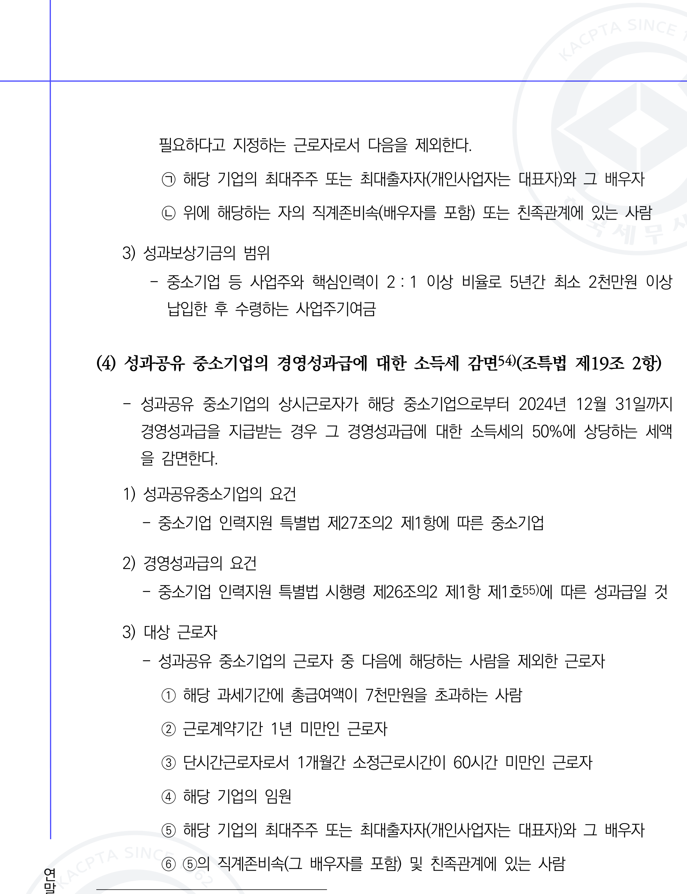

```
성과공유 중소기업의 경영성과급에 대한 소득세 감면(조특법 제19조 2항)

- 성과공유 중소기업의 상시근로자가 해당 중소기업으로부터 2024년 12월 31일까지 경영성과급을 지급받는 경우 그 경영성과급에 대한 소득세의 50%에 상당하는 세액을 감면한다.

1) 성과공유중소기업의 요건
   - 중소기업 인력지원 특별법 제27조의2 제1항에 따른 중소기업

2) 경영성과급의 요건
   - 중소기업 인력지원 특별법 시행령 제26조의2 제1항 제1호55)에 따른 성과급일 것

3) 대상 근로자
   - 성과공유 중소기업의 근로자 중 다음에 해당하는 사람을 제외한 근로자
     ① 해당 과세기간에 총급여액이 7천만원을 초과하는 사람
     ② 근로계약기간 1년 미만인 근로자
     ③ 단시간근로자로서 1개월간 소정근로시간이 60시간 미만인 근로자
     ④ 해당 기업의 임원
     ⑤ 해당 기업의 최대주주 또는 최대출자자(개인사업자는 대표자)와 그 배우자
     ⑥ ⑤의 직계존비속(그 배우자를 포함) 및 친족관계에 있는 사람
```

<<SPLIT>>
elementId: 383
연말정산
세무
<<SPLIT>>
elementId: 384
54) 성과공유를 실시하는 중소기업은 일정요건을 충족한 경우 경영성과급의 10%를 법인세 또는 사업소득
세에서 공제한다. 다만, 상시근로자 수가 직전보다 감소한 경우에는 공제하지 않는다.
55) 중소기업과 근로자가 경영목표 설정 및 그 목표 달성에 따른 성과급 지급에 관한 사항을 사전에 서면
으로 약정하고 이에 따라 근로자에게 지급하는 성과급(우리사주조합을 통하여 성과급으로서 근로자에게
지급하는 우리사주를 포함)제도의 운영
<<SPLIT>>
elementId: 385
188
<<SPLIT>>
elementId: 386
제3장 연말정산 세액의 계산
<<SPLIT>>
elementId: 387
⑦ 근로소득세를 원천징수한 사실이 확인되지 않고 납부사실도 확인되지 않은 자
<<SPLIT>>
elementId: 388
4) 감면세액
<<SPLIT>>
elementId: 389
① 일반적인 경우
<<SPLIT>>
elementId: 390
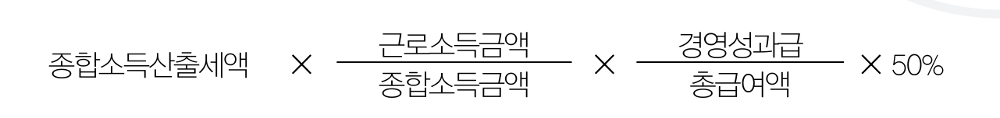
*근로소득금액 경영성과급
종합소득산출세액 x x x 50%
종합소득금액 총급여액*
<<SPLIT>>
elementId: 391
② 중소기업취업자에 대한 감면과 중복으로 받는 경우
<<SPLIT>>
elementId: 392
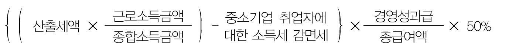
*근로소득금액 중소기업 취업자에 경영성과급
산출세액 x x x 50%
종합소득금액 대한 소득세 감면세 총급여액*
<<SPLIT>>
elementId: 393
5) 세액감면 신청
<<SPLIT>>
elementId: 394
① 근로자
<<SPLIT>>
elementId: 395
- 세액감면을 받으려는 자는 경영성과급을 지급받은 날이 속하는 달의 다음 달
말일까지 세액감면신청서를 원천징수의무자에게 제출해야 한다.
<<SPLIT>>
elementId: 396
② 원천징수의무자
<<SPLIT>>
elementId: 397
근로자에게 세액감면신청서를 받은 날이 속하는 달의 다음 달 말일까지 원천징
수 관할 세무서장에게 제출해야 한다.
<<SPLIT>>
elementId: 398
(5) 내국인 우수인력의 국내복귀에 대한 소득세 감면(조특법 제18의3)
<<SPLIT>>
elementId: 399
- 학위 취득 후 국외에서 5년 이상 거주하면서 연구개발 및 기술개발 경험을 가진 사
람으로서 내국인 우수인력이 국내에 거주하면서 연구기관 등에 2020년 1월 1일 이
후 취업하여 받는 근로소득으로서 취업일(2025년 12월 31일 이전인 경우만 해당)부
터 10년이 되는 날이 속하는 달까지 발생한 근로소득에 대해서는 소득세의 100분의
50에 상당하는 세액을 감면한다. 이 경우 소득세 감면기간은 소득세를 감면받은 사
람이 다른 연구기관 등에 취업하는 경우에 관계없이 소득세를 감면받은 최초 취업일
부터 계산한다.
<<SPLIT>>
elementId: 400
제
1장
근로소득
연말정산(이론편)
제2장
근로소득
연말정산(실전편)
<<SPLIT>>
elementId: 401
제3장
연말정산
세액의
계산
<<SPLIT>>
elementId: 402
제4장
근로소득자의
연말정산
후
4대보험
정산
<<SPLIT>>
elementId: 403
189
<<SPLIT>>
elementId: 404
1) 감면 대상 내국인 우수인력(아래 요건 모두 충족)
<<SPLIT>>
elementId: 405
① 자연계 · 이공계 · 의학계 분야의 박사학위를 소지한 사람일 것
<<SPLIT>>
elementId: 406
② 기업부설연구소 또는 연구개발전담부서 등의 기관 또는 부서에 취업한 날 또는
소득세를 최초로 감면받는 날이 속하는 과세기간의 직전 5개 과세기간 동안 국
외에서 거주했을 것. 이 경우 1개 과세기간에 183일 이상 국외에서 체류한 경
우 해당 과세기간에는 국외에서 거주한 것으로 본다.
<<SPLIT>>
elementId: 407
③ 국외연구기관 등에서 5년 이상 연구개발 및 기술개발 경험이 있을 것
<<SPLIT>>
elementId: 408
④ 해당 과세연도 종료일 현재 근로를 제공하는 기업과 「국세기본법 시행령」 제1조
의2 제1항에 따른 친족관계 또는 같은 조 제3항에 따른 경영지배관계에 있지
않을 것. 다만, 경영지배관계에 있는지를 판단할 때 「국세기본법 시행령」 제1조
의2 제4항 제1호 나목의 요건은 적용하지 않는다.
<<SPLIT>>
elementId: 409
⑤ 해당 과세기간 종료일 현재 대한민국의 국적을 가진 사람일 것
<<SPLIT>>
elementId: 410
⑥ 기업부설연구소 또는 연구개발전담부서 등에서 연구원으로 근무하는 사람일 것
<<SPLIT>>
elementId: 411
2) 감면세액의 계산
<<SPLIT>>
elementId: 412
종합소득 산출세액 x (근로소득금액 / 종합소득금액)
x (감면대상 근로소득금액 / 근로소득금액) x 50%
<<SPLIT>>
elementId: 413
3) 신청
<<SPLIT>>
elementId: 414
- 근로를 제공한 날이 속하는 달의 다음 달 10일까지 원천징수의무자를 거쳐 원천
징수 관할 세무서장에게 다음의 내용이 포함된 증명서와 함께 세액감면신청서를
제출해야 한다.
<<SPLIT>>
elementId: 415
① 감면신청자의 성명
② 국외연구기관 등의 명칭 및 주소
③ 국외연구기관 등에서 근무한 기간, 근무부서, 연구분야 및 해당 부서 책임자의
확인
<<SPLIT>>
elementId: 416
연말정산
세무
<<SPLIT>>
elementId: 417
190
<<SPLIT>>
elementId: 418
196
<<SPLIT>>
elementId: 419
제3장 연말정산 세액의 계산
<<SPLIT>>
elementId: 420
제3절 세액공제
<<SPLIT>>
elementId: 421
01 근로소득 · 자녀 · 연금계좌 세액공제
<<SPLIT>>
elementId: 422
세무
<<SPLIT>>
elementId: 423
(1) 근로소득세액공제(소득법 제59조)
<<SPLIT>>
elementId: 425
| 산출세액 | 공제세액 |
| --- | --- |
| 130만원 이하 | 산출세액의 55% |
| 130만원 초과 | 71만5천원 + 130만원 초과금액 x 50% |
**- 거주자의 근로소득에 대한 종합소득산출세액에서 다음의 세액을 공제한다.**
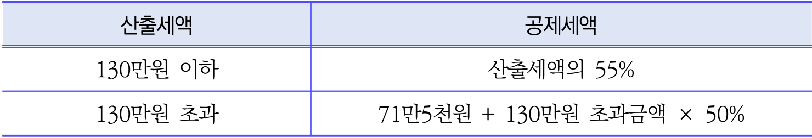

```markdown
| 산출세액       | 공제세액                           |
|---------------|-----------------------------------|
| 130만원 이하  | 산출세액의 55%                     |
| 130만원 초과  | 71만5천원 + 130만원 초과금액 × 50% |
```

<<SPLIT>>
elementId: 426
| 총급여액 | 근로소득세액공제 한도 |
| --- | --- |
| 3천3백만원 이하 | 74만원 |
| 3천3백만원 초과 7천만원 이하 | 74만원- [(총급여액 -3천3백만원) x 0.008] → (최저 66만원) |
| 7천만원 초과 1.2억원 이하 | 66만원 - [(총급여액 - 7천만원) x 1/2] → (최저 50만원) |
| 1.2억원 초과 | 50만원 - [(총급여액 - 1.2억원) x 1/2] → (최저 20만원) |
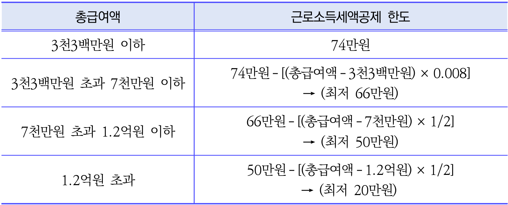

```markdown
| 총급여액                  | 근로소득세액공제 한도                           |
|---------------------------|-----------------------------------------------|
| 3천3백만원 이하           | 74만원                                        |
| 3천3백만원 초과 7천만원 이하 | 74만원 - [(총급여액 - 3천3백만원) × 0.008] → (최저 66만원) |
| 7천만원 초과 1.2억원 이하  | 66만원 - [(총급여액 - 7천만원) × 1/2] → (최저 50만원) |
| 1.2억원 초과              | 50만원 - [(총급여액 - 1.2억원) × 1/2] → (최저 20만원) |
```

<<SPLIT>>
elementId: 427
(2) 자녀세액공제(소득법 제59조의 2)
<<SPLIT>>
elementId: 428
- 종합소득이 있는 거주자의 기본공제대상자에 해당하는 자녀(입양자, 위탁아동 포함) 및
손자녀로서 8세 이상의 사람에 대해 다음의 금액을 종합소득산출세액에서 공제한다.
<<SPLIT>>
elementId: 429
제
1장
근로소득
연말정산(이론편)
제2장
근로소득
연말정산(실전편)
<<SPLIT>>
elementId: 430
제4장
근로소득자의
연말정산
후
4대보험
정산
<<SPLIT>>
elementId: 431
제3장
연말정산
세액의
계산
<<SPLIT>>
elementId: 432
191
<<SPLIT>>
elementId: 433
| 1) 기본공제 | 1) 기본공제 | 1) 기본공제 |
| --- | --- | --- |
| 자녀수 | 세액공제 | 비고 |
| 1명 | 15만원 | 1명당 15만원 |
| 2명 | 35만원 | 1명당 15만원 |
| 3명 | 60만원 | 연 35만원 + 2명 초과하는 1명당 30만원 |
| 4명 | 90만원 | 연 35만원 + 2명 초과하는 1명당 30만원 |
| 5명 | 120만원 | 연 35만원 + 2명 초과하는 1명당 30만원 |
| 2) 추가공제 | 2) 추가공제 | 2) 추가공제 |
| 구분 | 세액공제 | 비고 |
| 첫째자녀 출산 | 30만원 | - 해당 과세기간 출산, 입양 신고한 기본공제대 상 자녀가 있는 경우 공제 적용 - 셋째 이상인 경우 연 70만원 공제 |
| 둘째자녀 출산 | 50만원 | - 해당 과세기간 출산, 입양 신고한 기본공제대 상 자녀가 있는 경우 공제 적용 - 셋째 이상인 경우 연 70만원 공제 |
| 셋째자녀 출산 | 70만원 | - 해당 과세기간 출산, 입양 신고한 기본공제대 상 자녀가 있는 경우 공제 적용 - 셋째 이상인 경우 연 70만원 공제 |
| 넷째자녀 출산 | 70만원 | - 해당 과세기간 출산, 입양 신고한 기본공제대 상 자녀가 있는 경우 공제 적용 - 셋째 이상인 경우 연 70만원 공제 |
| (3) 연금계좌 세액공제(소득법 제59조의3) - 종합소득이 있는 거주자가 연금계좌에 납입한 금액의 12(15)%에 해당하는 금액을 종합소득산출세액에서 공제한다. 1) 연금계좌의 종류 | (3) 연금계좌 세액공제(소득법 제59조의3) - 종합소득이 있는 거주자가 연금계좌에 납입한 금액의 12(15)%에 해당하는 금액을 종합소득산출세액에서 공제한다. 1) 연금계좌의 종류 | (3) 연금계좌 세액공제(소득법 제59조의3) - 종합소득이 있는 거주자가 연금계좌에 납입한 금액의 12(15)%에 해당하는 금액을 종합소득산출세액에서 공제한다. 1) 연금계좌의 종류 |
| 구분 | 세액공제 | 비고 |
| 첫째자녀 출산 | 30만원 | - 해당 과세기간 출산, 입양 신고한 기본공제대 상 자녀가 있는 경우 공제 적용 - 셋째 이상인 경우 연 70만원 공제 |
| 둘째자녀 출산 | 50만원 | - 해당 과세기간 출산, 입양 신고한 기본공제대 상 자녀가 있는 경우 공제 적용 - 셋째 이상인 경우 연 70만원 공제 |
| 연말정산 셋째자녀 출산 | 70만원 | - 해당 과세기간 출산, 입양 신고한 기본공제대 상 자녀가 있는 경우 공제 적용 - 셋째 이상인 경우 연 70만원 공제 |
| 넷째자녀 출산 세무 | 70만원 | - 해당 과세기간 출산, 입양 신고한 기본공제대 상 자녀가 있는 경우 공제 적용 - 셋째 이상인 경우 연 70만원 공제 |
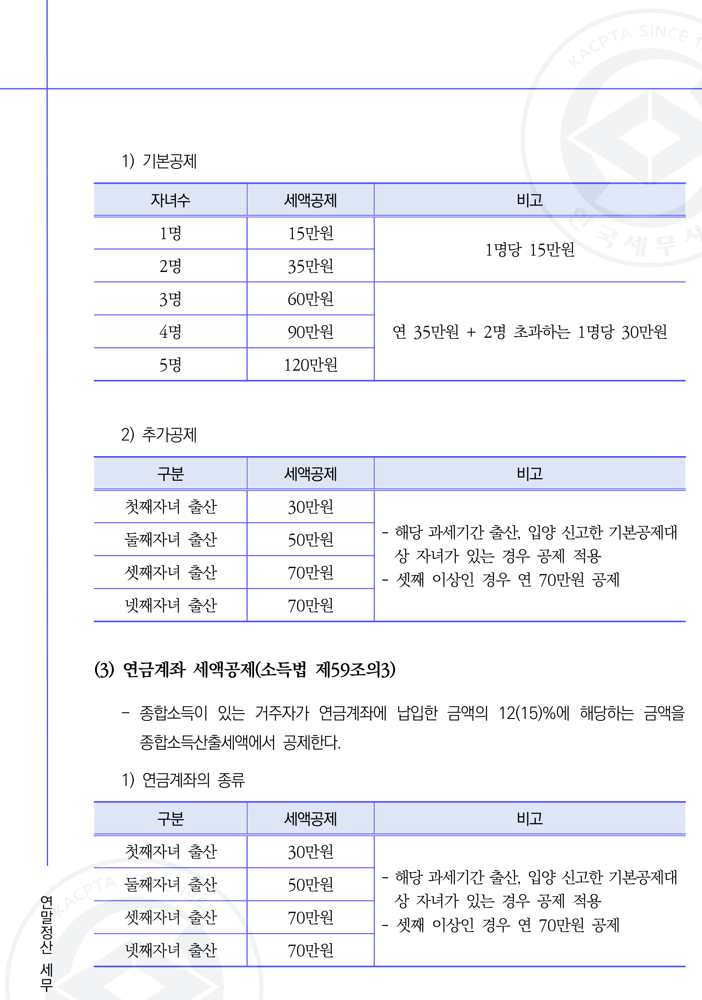

```markdown
1) 기본공제

| 자녀수 | 세액공제 | 비고                                      |
|--------|----------|-----------------------------------------|
| 1명    | 15만원   | 1명당 15만원                            |
| 2명    | 35만원   | 1명당 15만원                            |
| 3명    | 60만원   | 1명당 15만원                            |
| 4명    | 90만원   | 연 35만원 + 2명 초과하는 1명당 30만원  |
| 5명    | 120만원  | 연 35만원 + 2명 초과하는 1명당 30만원  |

2) 추가공제

| 구분         | 세액공제 | 비고                                           |
|--------------|----------|----------------------------------------------|
| 첫째자녀 출산 | 30만원   | 해당 과세기간 출산, 입양 신고한 기본공제대상 자녀가 있는 경우 공제 적용 |
| 둘째자녀 출산 | 50만원   | 해당 과세기간 출산, 입양 신고한 기본공제대상 자녀가 있는 경우 공제 적용 |
| 셋째자녀 출산 | 70만원   | 셋째 이상인 경우 연 70만원 공제               |
| 넷째자녀 출산 | 70만원   | 셋째 이상인 경우 연 70만원 공제               |

3) 연금계좌 세액공제(소득법 제59조의3)

- 종합소득이 있는 거주자가 연금계좌에 납입한 금액의 12(15)%에 해당하는 금액을 종합소득산출세액에서 공제한다.

1) 연금계좌의 종류

| 구분         | 세액공제 | 비고                                           |
|--------------|----------|----------------------------------------------|
| 첫째자녀 출산 | 30만원   | 해당 과세기간 출산, 입양 신고한 기본공제대상 자녀가 있는 경우 공제 적용 |
| 둘째자녀 출산 | 50만원   | 해당 과세기간 출산, 입양 신고한 기본공제대상 자녀가 있는 경우 공제 적용 |
| 셋째자녀 출산 | 70만원   | 셋째 이상인 경우 연 70만원 공제               |
| 넷째자녀 출산 | 70만원   | 셋째 이상인 경우 연 70만원 공제               |
```

<<SPLIT>>
elementId: 434
192
<<SPLIT>>
elementId: 435
19
<<SPLIT>>
elementId: 436
제3장 연말정산 세액의 계산
<<SPLIT>>
elementId: 437
2) 연금계좌 납입액의 범위
- 연금계좌에서 다음의 금액을 제외한 금액을 연금계좌 납입액이라 한다.
<<SPLIT>>
elementId: 438
세 무
<<SPLIT>>
elementId: 439
① 다음의 사유로 원천징수되지 아니한 퇴직소득 등
- 퇴직일 현재 연금계좌에 있거나 연금계좌로 지급되는 경우
- 퇴직하여 지급받은 날부터 60일 이내에 연금계좌에 입금되는 경우
② 연금계좌에서 다른 연금계좌로 계약을 이전함으로써 납입되는 금액
<<SPLIT>>
elementId: 440
3) 요건에 따라 연금계좌 납입액으로 볼 수 있는 경우
<<SPLIT>>
elementId: 441
- 다음 금액을 합한 금액 이내의 금액을 납입할 것. 이 경우 해당 과세기간 이전의
연금보험료는 납입할 수 없으나, 보험계약의 경우에는 최종납입일이 속하는 달의
말일부터 3년 2개월이 경과하기 전에는 그 동안의 연금보험료를 납입할 수 있다.
<<SPLIT>>
elementId: 442
① 연간 1,800만원
② 개인종합자산관리계좌의 계약기간 만료일 기준 잔액을 한도로 개인종합자산관리계좌에서
연금계좌로 납입한 금액56)
③ 국내에 소유한 연금주택을 양도하고 이를 대체하여 다른 축소주택을 취득하거나 취득하지
않은 거주자로서 요건57)을 모두 충족하는 거주자가 주택차액 중 연금계좌로 납입하는 금액
(총 누적금액은 1억원을 한도로 한다)
<<SPLIT>>
elementId: 443
4) 연금계좌 세액공제 한도액 초과납입금 등의 해당연도 납입금으로의 전환 특례
- 연금계좌 가입자가 이전 과세기간에 연금계좌에 납입한 연금보험료 중 연금계좌세
<<SPLIT>>
elementId: 444
56) 직전 과세기간과 해당 과세기간에 걸쳐 납입한 경우에는 개인종합자산관리계좌의 계약기간 만료일 기
준 잔액에서 직전 과세기간에 납입한 금액을 차감한 금액을 한도로 개인종합자산관리계좌에서 연금계
좌로 납입한 금액을 말한다.
57) 1. 연금주택 양도일 현재 거주자 또는 그 배우자가 60세 이상일 것
2. 연금주택 양도일 현재 거주자 및 그 배우자가 국내에 소유한 주택을 합산했을 때 연금주택 1주택
만 소유하고 있을 것. 다만, 연금주택을 양도하기 전에 축소주택을 취득한 경우로서 축소주택을 취
득한 날부터 6개월 이내에 연금주택을 양도한 경우에는 연금주택 양도일 현재 연금주택 1주택만
소유하고 있는 것으로 본다.
3. 연금주택 양도일 현재 연금주택의 기준시가가 12억원 이하일 것
4. 축소주택의 취득가액이 연금주택의 양도가액 미만일 것(축소주택을 취득한 경우)
5. 연금주택 양도일부터 6개월 이내에 주택차액을 연금주택 소유자의 연금계좌로 납입할 것
<<SPLIT>>
elementId: 445
제
1
장
근로소득
연말정산(이론편)
제2장
근로소득
연말정산(실전편)
<<SPLIT>>
elementId: 446
제3장
연말정산
세액의
계산
<<SPLIT>>
elementId: 447
제4장
근로소득자의
연말정산
후
4대보험
정산
<<SPLIT>>
elementId: 448
193
<<SPLIT>>
elementId: 449
액공제를 받지 아니한 금액이 있는 경우, 그 금액의 전부 또는 일부를 해당 과세
기간에 연금계좌에 납입한 연금보험료로 전환하여 줄 것을 연금계좌취급자에게 신
청한 경우에는 그 전환을 신청한 금액을 연금계좌에서 가장 먼저 인출하여 그 신
청을 한날에 다시 해당 연금계좌에 납입한 연금보험료로 본다. 이 경우 전환을 신
청한 금액은 그 신청한 날에 연금계좌에 납입한 연금보험료로 보아 연금보험료의
요건을 충족하여야 한다.
<<SPLIT>>
elementId: 450
5) 납입한도
<<SPLIT>>
elementId: 451
| 종합소득금액 근로소득만 있는 경우 총 급여액 | 납입한도액 | 공제율 |
| --- | --- | --- |
| 4천5백만원(5천5백만원)이하 | Min[900만원, Min(연금저축계좌 납입액, 연 600만원) + 퇴직연금계좌 납입액] | 15% |
| 5천5백만원(5천5백만원)초과 | Min[900만원, Min(연금저축계좌 납입액, 연 600만원) + 퇴직연금계좌 납입액] | 12% |
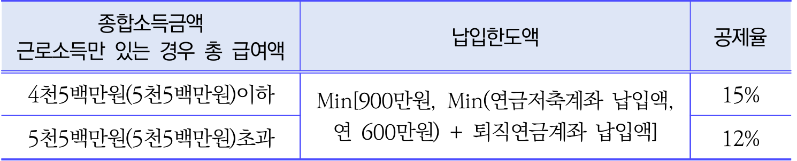

```markdown
| 종합소득금액 근로소득만 있는 경우 총 급여액 | 납입한도액                                      | 공제율 |
|---------------------------------------------|------------------------------------------------|-------|
| 4천5백만원(5천5백만원)이하                   | Min[900만원, Min(연금저축계좌 납입액, 연 600만원) + 퇴직연금계좌 납입액] | 15%   |
| 5천5백만원(5천5백만원)초과                   | Min[900만원, Min(연금저축계좌 납입액, 연 600만원) + 퇴직연금계좌 납입액] | 12%   |
```

<<SPLIT>>
elementId: 452
6) 개인종합자산관리계좌 전환금액에 따른 추가한도
<<SPLIT>>
elementId: 453
Min[① 전환금액의 10%, ② 300만원]
<<SPLIT>>
elementId: 454
[참고]
<<SPLIT>>
elementId: 455
⊙ 연금저축 납입액 중 일부 인출 시 연금보험료 공제 가능(서면법규-1212, 2013.11.5.
<<SPLIT>>
elementId: 456
- 「소득세법 시행령」 제40조의2(연금계좌)에 따라 가입한 연금계좌에서 해당 과세기간에 불
입한 금액 중 일부 인출 시 해당 과세기간 납입잔액에 대하여 「소득세법」 제51조의3에 따
른 연금보험료공제가 가능한 것임.
<<SPLIT>>
elementId: 457
납입면제보험료의 연금계좌 세액공제 적용 여부(서면소득2015-2645, 2016.02.19.)
<<SPLIT>>
elementId: 458
보험료 납입면제 특별약관에 따라 납입된 것으로 간주된 보험료(납입면제 보험료)는 「소득
세법」 제59조의3의 규정을 적용할 수 없는 것이며, 향후 연금 지급 시 연금계좌 세액공제
를 적용받지 아니한 연금에 대하여는 「소득세법」 제20조의3에서 규정하는 연금소득에 해
당하지 않는 것임.
<<SPLIT>>
elementId: 459
연말정산
세무
194
<<SPLIT>>
elementId: 460
제3장 연말정산 세액의 계산
<<SPLIT>>
elementId: 461
02 보험료 · 의료비 · 교육비 · 기부금 세액공제 (소득법 제59조의4)
<<SPLIT>>
elementId: 462
- 근로소득이 있는 거주자(일용근로자 제외)가 해당 연도에 세액 공제 대상 비용을 지
출한 경우58) 이를 해당 과세기간의 종합소득산출세액에서 세액공제한다.
<<SPLIT>>
elementId: 463
(1) 보험료 세액공제(소득법 제59조의4 1항)
<<SPLIT>>
elementId: 464
- 근로소득이 있는 거주자(일용근로자는 제외한다. 이하 이 조에서 같다)가 해당 과세기
간에 만기에 환급되는 금액이 납입보험료를 초과하지 아니하는 보험의 보험계약에 따
라 지급하는 다음 각 호의 보험료를 지급한 경우 그 금액의 100분의 12(소득기준을
충족한 기본공제대상자 중 장애인은 100분의 15)에 해당하는 금액을 해당 과세기간
의 종합소득산출세액에서 공제한다. 다만, 다음 각 호의 보험료별로 그 합계액이 각
각 연 100만원을 초과하는 경우 그 초과하는 금액은 각각 없는 것으로 한다.
<<SPLIT>>
elementId: 465
1) 일반보장성보험의 보험료
<<SPLIT>>
elementId: 466
- 기본공제대상자를 피보험자로 하는 보험료59)
<<SPLIT>>
elementId: 467
| 요건 | 한도 | 세액공제율 |
| --- | --- | --- |
| 소득, 연령 기준을 충족한 기본공제대상자 | 연 100만원 | 12% |
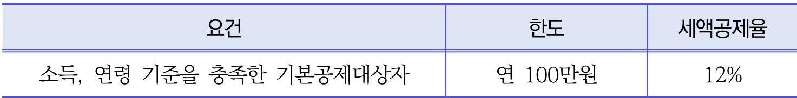

```markdown
| 요건                           | 한도     | 세액공제율 |
|------------------------------|--------|--------|
| 소득, 연령 기준을 충족한 기본공제대상자 | 연 100만원 | 12%    |
```

<<SPLIT>>
elementId: 468
2) 장애인전용보장성보험의 보험료
<<SPLIT>>
elementId: 469
- 기본공제대상자 중 장애인을 피보험자 또는 수익자로 하는 보험료60)
<<SPLIT>>
elementId: 470
58) 과세기간 중 중도취업 또는 중도퇴사한 자의 경우 근로제공기간 동안 지출한 비용에 한하여 특별세액
공제를 받는 것임
<<SPLIT>>
elementId: 471
59)
<<SPLIT>>
elementId: 472
60)
<<SPLIT>>
elementId: 473
1. 생명보험, 상해보험
2. 화재 · 도난이나 그 밖의 손해를 담보하는 가계에 관한 손해보험
3. 「수산업협동조합법」 · 「신용협동조합법」 또는 「새마을금고법」에 따른 공제
4. 「군인공제회법」 「 한국교직원공제회법」 · 「대한지방행정공제회법」 「경찰공제회법」 및 「대한소방공제
회법」에 따른 공제
5. 주택 임차보증금의 반환을 보증하는 것을 목적으로 하는 보험 보증(보증대상 임차보증금이 3억원
을 초과 하는 경우 제외)
1. 생명보험, 상해보험
2. 화재 · 도난이나 그 밖의 손해를 담보하는 가계에 관한 손해보험
3. 「수산업협동조합법」 · 신용협동조합법」 또는 「새마을금고법」에 따른 공제
<<SPLIT>>
elementId: 474
제
1장
근로소득
연말정산(이론편)
제2장
근로소득
연말정산(실전편)
<<SPLIT>>
elementId: 475
제3장
연말정산
세액의
계산
<<SPLIT>>
elementId: 476
제4장
근로소득자의
연말정산
후
4대보험
정산
<<SPLIT>>
elementId: 477
195
<<SPLIT>>
elementId: 478
|  | - 장애인전용보장성보험은 보험 · 공제 계약 또는 보험료 * 공제료 납입영수증에 장애 인전용 보험 · 공제로 표시된 보험 · 공제의 보험료 * 공제료를 말한다. | - 장애인전용보장성보험은 보험 · 공제 계약 또는 보험료 * 공제료 납입영수증에 장애 인전용 보험 · 공제로 표시된 보험 · 공제의 보험료 * 공제료를 말한다. |
| --- | --- | --- |
|  | 요건 소득 기준을 충족한 기본공제대상자 중 장애인 | 한도 세액공제율 연 100만원 15% |
|  | · 공제대상 보장성보험료를 사용자가 지급해 주는 경우 동 보험료 상당액은 그 근 로자의 급여액에 가산한 보험료를 세액공제 한다. · 연도 중 보장성보험을 해약하더라도 해당 연도 중에 납입한 금액은 공제가능하다. · 기본공제대상인 부양가족의 명의로 계약한 경우에도 당해 근로자가 보험료를 실 제로 납입한 경우에는 공제대상이다. (2) 의료비 세액공제(소득법 제59조의4 2항) - 근로소득이 있는 거주자가 기본공제대상자(나이 및 소득의 제한을 받지 않음)를 위해 해당 과세기간에 의료비를 지출(지급받은 실손의료보험금 제외)를 지급한 경우 다음의 금액을 해당 과세기간의 근로소득 산출세액에서 공제한다. 1) 세액공제 | · 공제대상 보장성보험료를 사용자가 지급해 주는 경우 동 보험료 상당액은 그 근 로자의 급여액에 가산한 보험료를 세액공제 한다. · 연도 중 보장성보험을 해약하더라도 해당 연도 중에 납입한 금액은 공제가능하다. · 기본공제대상인 부양가족의 명의로 계약한 경우에도 당해 근로자가 보험료를 실 제로 납입한 경우에는 공제대상이다. (2) 의료비 세액공제(소득법 제59조의4 2항) - 근로소득이 있는 거주자가 기본공제대상자(나이 및 소득의 제한을 받지 않음)를 위해 해당 과세기간에 의료비를 지출(지급받은 실손의료보험금 제외)를 지급한 경우 다음의 금액을 해당 과세기간의 근로소득 산출세액에서 공제한다. 1) 세액공제 |
| 구분 | 세액공제 | 특례 미적용 |
| ① | 난임시술 | (난임시술비 - ②, ③, ④ 의 의료비지출액이 총급여액의 3%에 미달하는 경우 그 미달금액) x 30% |
| ② | 미숙아 및 선청성이상아 의료비 | (미숙아 및 선천성이상아 의료비 - ③, ④ 의 의료비지출 액이 총급여액의 3%에 미달하는 경우 그 미달금액) x 20% |
| ③ 연말정산 세무 | 본인, 6세이하, 65세이상, 장애인, 중증질환자 등을 4 「군인공제회법」 · 「 한국교직원공제회법」 · 「대한지방행정공제회법」 · 「경찰공제회법」 및 「대한소방공제 회법」에 따른 공제 5. 주택 임차보증금의 반환을 보증하는 것을 목적으로 하는 보험 · 보증(보증대상 임차보증금이 3억원을 초과 하는 경우 제외) | (본인, 6세이하, 65세이상, 장애인, 중증질환자 등을 위 한 의료비 - ④ 의 의료비지출액이 총급여액의 3%에 미 |
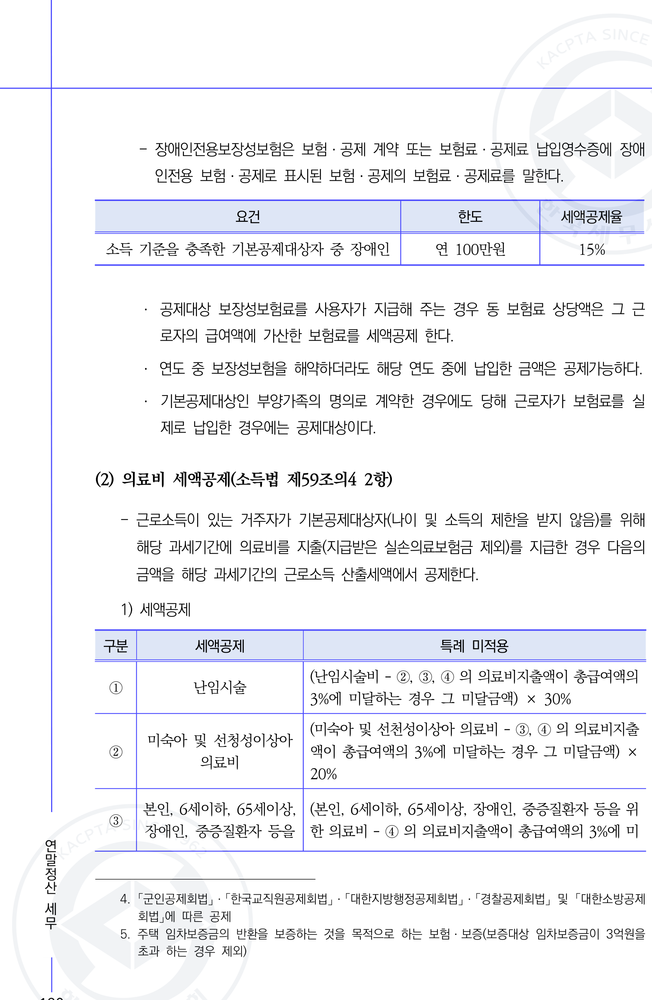

```markdown
| 구분 | 세액공제 | 특례 미적용 |
|---|---|---|
| ① | 난임시술 | (난임시술비 - ②, ③, ④의 의료비지출액이 총급여액의 3%에 미달하는 경우 그 미달금액) × 30% |
| ② | 미숙아 및 선천성이상아 의료비 | (미숙아 및 선천성이상아 의료비 - ③, ④의 의료비지출액이 총급여액의 3%에 미달하는 경우 그 미달금액) × 20% |
| ③ | 본인, 6세이하, 65세이상, 장애인, 중증질환자 등을 위한 의료비 | (본인, 6세이하, 65세이상, 장애인, 중증질환자 등을 위한 의료비 - ④의 의료비지출액이 총급여액의 3%에 미달하는 경우 그 미달금액) × 15% |
```

<<SPLIT>>
elementId: 479
196
<<SPLIT>>
elementId: 480
196
<<SPLIT>>
elementId: 481
제3장 연말정산 세액의 계산
<<SPLIT>>
elementId: 482
| 구분 | 세액공제 | 특례 미적용 |
| --- | --- | --- |
|  | 위한 의료비 | 달하는 경우 그 미달금액) x 15% |
|  | ①, ②, ③ 외의 의료비 | Min[①, ②, ③ 외의 의료비 - 총급여액 x 3%, 700만원] X 15% |
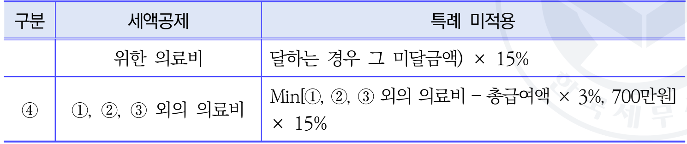

```markdown
| 구분 | 세액공제 | 특례 미적용 |
| --- | --- | --- |
| ④ | ①, ②, ③ 외의 의료비 | Min[①, ②, ③ 외의 의료비 - 총급여액 × 3%, 700만원] × 15% |
| 위한 의료비 | 달하는 경우 그 미달금액) × 15% | 달하는 경우 그 미달금액) × 15% |
```

<<SPLIT>>
elementId: 483
2) 세액공제 대상 의료비
<<SPLIT>>
elementId: 484
- 근로자가 근로제공기간 동안 직접 부담한 다음의 의료비
<<SPLIT>>
elementId: 485
· 진찰 · 치료 · 질병예방을 위하여 「의료법」 제3조에 따른 의료기관에 지급한 비용(미용 · 성형
수술을 위한 비용 제외)
· 치료 · 요양을 위하여 「약사법」 제2조에 따른 의약품(한약 포함)을 구입하고 지급하는 비용
(건강증진을 위한 의약품 구입비용 제외)
· 장애인보장구 및 의사 · 치과의사· 한의사 등의 처방에 따라 의료기기를 직접 구입 또는 임
차하기 위하여 지출한 비용
· 시력보정용 안경 또는 콘택트렌즈 구입을 위하여 지출한 비용(1인당 연 50만원 이내의 금액)
· 보청기 구입을 위하여 지출한 비용
· 「노인장기요양보험법」 제40조에 따라 실제 지출한 본인부담금
· 「장애인활동 지원에 관한 법률」 제33조 제1항 및 같은 조 제2항 제2호에 따른 활동지원급
여에 대한 비용으로서 실제 지출한 본인부담금
· 「모자보건법」에 따른 산후조리원에 산후조리 및 요양의 대가로 지급하는 비용(출산 1회당
200만원 이내의 금액)
<<SPLIT>>
elementId: 486
3) 공제대상에서 제외되는 의료비
<<SPLIT>>
elementId: 487
· 의약품(한약 포함)이 아닌 건강기능식품을 구입하고 지출하는 비용
· 사용자로부터 지급받는 의료보조금 · 건강보험법 등에 의하여 지급받는 요양비
· 실제로 부양하지 않는 직계존속이나 생계를 같이 하지 아니하는 형제자매의 의료비
· 제대혈 보관비용, 진단서발급비용
· 사내근로복지기금으로부터 보조받아 지급한 의료비
<<SPLIT>>
elementId: 488
제3장
연말정산
세액의
계산
<<SPLIT>>
elementId: 489
제
1장
근로소득
연말정산(이론편)
제2장
근로소득
연말정산(실전편)
<<SPLIT>>
elementId: 490
제4장
근로소득자의
연말정산
후
4대보험
정산
<<SPLIT>>
elementId: 491
197
<<SPLIT>>
elementId: 493
4) 지출 항목별 의료비 공제 증명서류
<<SPLIT>>
elementId: 494
| 의료비 지출 항목 | 증명서류 | 비 고 |
| --- | --- | --- |
| 의료기관 및 약국에 지출한 의료비 | 의료기관 및 약국이 발행한 국민건강보험 요양 급여의 기준에 관한 규칙 제7조에 따른 계산서 · 영수증, 진료비(약제비) 납입확인서 | 연말정산 간소화 서비스에서 제공 |
| 노인장기요양보험법에 따라 실제 지출한 본인부담금 | 장기요양급여비용 명세서(개별 지급내역 기재) 장기요양기관의 장이 발행하는 장기요양급여 비 납부확인서(연간 지급내역 기재) | 연말정산 간소화 서비스에서 제공 |
| 안경 또는 콘택트렌즈 구입비용 | 안경사가 확인한 영수증(사용자의 성명 및 시 력 교정용임을 기재) | 연말정산 간소화 서비스에서 제공 |
| 보청기 또는 장애인 보장구 구입비용 | 사용자의 성명을 판매자가 확인한 영수증 | 연말정산 간소화 서비스에 임의제출한 자료 제공 |
| 의료기기 구입 및 임차 비용 | 의사 · 치과의사 · 한의사의 처방전 및 판매자 또는 임대인이 발행한 의료비영수증(의료기기 명 기재) | 연말정산 간소화 서비스에 임의제출한 자료 제공 |
**· 간병인에게 지급하는 의료비· 보험회사 등으로부터 지급받는 실손의료보험금· 외국 소재 의료기관에 지출한 비용 등**
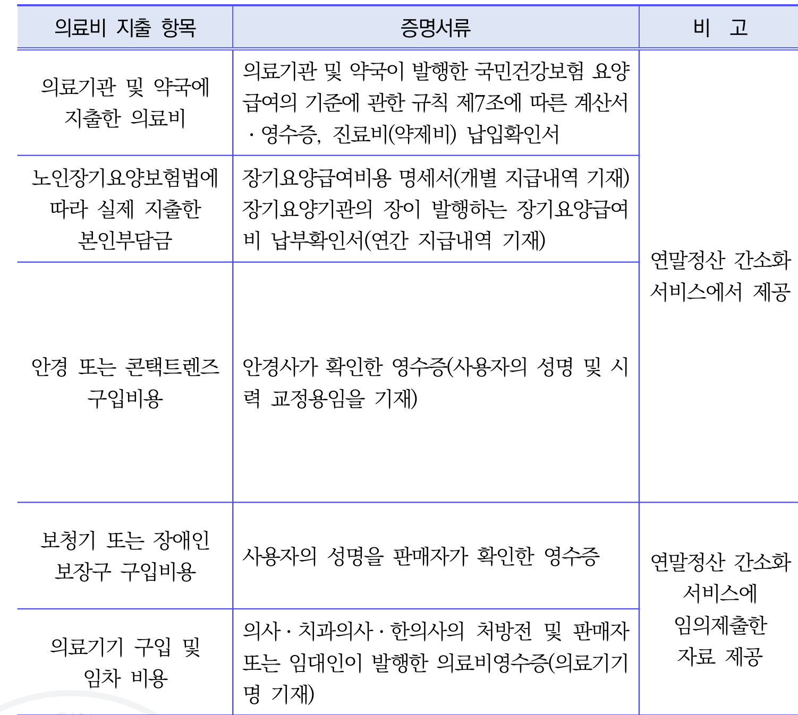

```markdown
| 의료비 지출 항목                          | 증명서류                                                                                   | 비고                           |
|-------------------------------------------|--------------------------------------------------------------------------------------------|------------------------------|
| 의료기관 및 약국에 지출한 의료비           | 의료기관 및 약국이 발행한 국민건강보험 요양급여의 기준에 관한 규칙 제7조에 따른 계산서·영수증, 진료비(약제비) 납입확인서 |                              |
| 노인장기요양보험법에 따라 실제 지출한 본인부담금 | 장기요양급여비용 명세서(개별 지급내역 기재) 장기요양기관의 장이 발행하는 장기요양급여비 납부확인서(연간 지급내역 기재) | 연말정산 간소화 서비스에서 제공 |
| 안경 또는 콘택트렌즈 구입비용              | 안경사가 확인한 영수증(사용자의 성명 및 시력 교정용임을 기재)                                      |                              |
| 보청기 또는 장애인 보장구 구입비용         | 사용자의 성명을 판매자가 확인한 영수증                                                        | 연말정산 간소화 서비스에 임의제출한 자료 제공 |
| 의료기기 구입 및 임차 비용                 | 의사·치과의사·한의사의 처방전 및 판매자 또는 임대인이 발행한 의료비영수증(의료기기명 기재)                        |                              |
```

<<SPLIT>>
elementId: 495
연말정산
세무
198
<<SPLIT>>
elementId: 496
196
<<SPLIT>>
elementId: 497
제3장 연말정산 세액의 계산
<<SPLIT>>
elementId: 498
[참고]
<<SPLIT>>
elementId: 499
응급의료에 관한 법류에 의한 응급처치료의 의료비공제 가능여부(서면1팀-15, 2007.01.07.)
<<SPLIT>>
elementId: 500
- 응급의료에 관한 법류에 의하여 응급환자 이송업을 영위하면서 응급환자 이송 후 관련법
에 의하여 이송처치료 영수증을 발급한 경우 동 건에 대한 의료비공제는 받을 수 없음.
<<SPLIT>>
elementId: 501
근로소득이 있는 맞벌이부부의 경우 배우자를 위해 지출한 의료비는 의료비공제를 적용받을
수 있다.(서면1 팀-1730, 2006.12.20.)
<<SPLIT>>
elementId: 502
외국에서 구입한 보청기의 의료비 공제 여부(서면법규-327, 2013.03.21.)
<<SPLIT>>
elementId: 503
- 근로소득이 있는 거주자가 기본공제 대상 자녀를 위해 외국에서 구입한 보청기 구입비용
에 대하여는 의료비공제를 받을 수 없는 것임.
<<SPLIT>>
elementId: 504
부양가족이 연도말 사망하여 의료비가 익년 수납된 경우(사전법령해석소득2019-46, 2019.02.15.)
- 12월 31일 사망한 기본공제대상자였던 부양가족의 의료비를 익년에 지출한 경우 해당 의
료비는 지출한 과세연도 귀속 근로소득에 대한 연말정산시 공제대상 의료비에 포함하는
것임.
<<SPLIT>>
elementId: 505
(3) 교육비 세액공제(소득령 제59조의4 3항)
<<SPLIT>>
elementId: 506
- 근로자가 본인 및 기본공제대상자(나이의 제한을 받지 않음)를 위해 공제대상 교육비
를 직접 지출하는 경우 그 세액공제대상 교육비지출액의 15%를 종합소득산출세액에
서 공제한다.
<<SPLIT>>
elementId: 507
1) 세액공제 대상 교육비
<<SPLIT>>
elementId: 508
| 교육 대상자 | 교육비 | 공제대상 한도 | 비 고 |
| --- | --- | --- | --- |
| 기본공제 대상자인 배우자 · 직계비속 형제자매 | ·유아교육법, 초 · 중등교육법, 고등교 육법, 특별법에 따른 학교(대학원 제 외)에 지급한 교육비' 및 대학입학전 형료, 수능응시료 ·평생교육법상 전공대학 · 원격대학, 학점인정 등에 관한 법률 등의 교육 과정 중 학위취득과정을 위해 지급한 | 1인당 한도 | * 포함되는 것 |
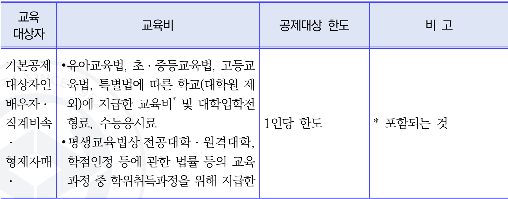

```markdown
| 교육 대상자                      | 교육비                                                                                                                                  | 공제대상 한도 | 비고         |
|----------------------------------|---------------------------------------------------------------------------------------------------------------------------------------|---------------|--------------|
| 기본공제대상자인 배우자 · 직계비속 · 형제자매 · | • 유아교육법, 초·중등교육법, 고등교육법, 특별법에 따른 학교(대학원 제외)에 지급한 교육비* 및 대학입학전형료, 수능응시료<br>• 평생교육법상 전공대학·원격대학, 학점인정 등에 관한 법률 등의 교육과정 중 학위취득과정을 위해 지급한 | 1인당 한도    | * 포함되는 것 |
```

<<SPLIT>>
elementId: 509
제3장
연말정산
세액의
계산
<<SPLIT>>
elementId: 510
제
1장
근로소득
연말정산(이론편)
제2장
근로소득
연말정산(실전편)
<<SPLIT>>
elementId: 511
제4장
근로소득자의
연말정산
후
4대보험
정산
<<SPLIT>>
elementId: 512
199
<<SPLIT>>
elementId: 513
| 교육 대상자 | 교육비 | 공제대상 한도 | 공제대상 한도 | 비 고 | 비 고 |
| --- | --- | --- | --- | --- | --- |
| 입양자 · 위탁아동 | 교육비 ·국외 소재 교육기관으로 우리나라 유 아교육법, 초 · 중등교육법, 고등 교 육법 해당 학교에 지급한 교육비61) ·취학전 아동을 위하여 영유아보육법 에 따른 보육시설, 학원, 체육시설62) 에 1주 1회 이상 실시하는 교습과정 의 교습을 받고 지출한 수강료 | 구분 초등학교 취 학 전 아 동 초 · 중· 고 대 학 생 | 한도 300 만원 900 만원 | 대상 어린이집 유 치 원 초·중 + 고 중 · 고 | 내용 교과서대, 학교급식비, 특별활동비, 방과후학교 수업료(도서구입비 포함), 현장학습비 (30만원 이내) 교복구입비 (50만원 이내) |
| 근로자 본 인 | ·부양가족에게 인정되는 교육비 (보육시설 · 학원 교육비 제외) ·직업능력개발훈련시설 수강료* ·대학(전공대학 · 원격대학 및 학위취 득과정 포함) 또는 대학원의 1학기 이 상에 해당하는 교육과정과 고등교육 법 제36조에 따른 시간제과정의 교육 비 및 대학입학전형료, 수능응시료 ·학자금대출 원리금 상환액(상환 연체 로 인한 추가지급액은 제외) | 한도 없음 | 한도 없음 |  | * 고용보험법시행령 제43 조에 따른 근로자 지원 금을 받은 경우 교육비 공제 대상에서 차감 |
| 기본공제 대상자인 장 애 인 | 장애인의 재활교육을 위해 다음의 시 설 등에 지급하는 비용 ·사회복지법에 따른 사회복지시설 ·민법에 따라 설립된 비영리법인으로 보건복지부장관이 장애인재활교육을 실시하는 기관으로 인정한 법인 ·위의 시설 또는 법인과 유사한 것으 로 외국에 있는 시설 또는 법인 ·지방자치단체가 지정한 발달재활서 비스 제공기관(만 18세 미만) | 한도 없음 | 한도 없음 | ·직계존속 포함 ·연간 소득금액이 100 만원을 초과하는 경우에 도 공제 가능 |  |
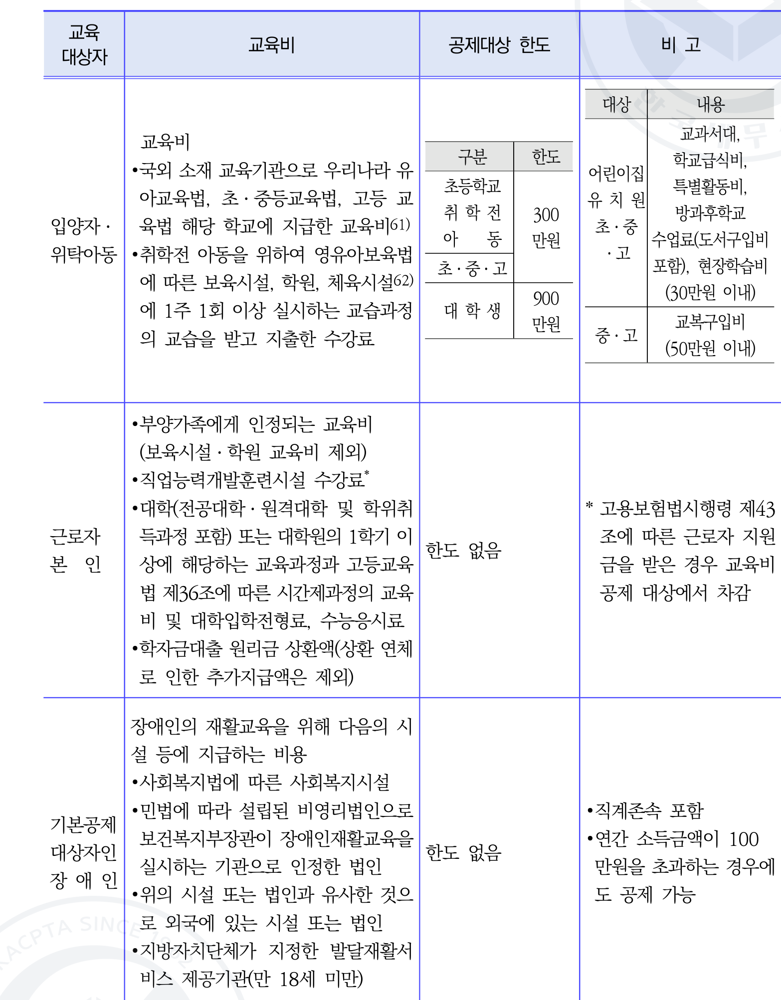

```markdown
| 교육 대상자          | 교육비                                                                                                                                                                                                 | 공제대상 한도 | 비고                                                                                     |
|----------------------|-------------------------------------------------------------------------------------------------------------------------------------------------------------------------------------------------------|--------------|----------------------------------------------------------------------------------------|
| 입양아동·위탁아동    | 교육비 <br> • 국외 소재 교육기관으로 우리나라 유아교육법, 초·중등교육법, 고등 교육법에 해당 학교에 지급한 교육비 <sup>(6)</sup> <br> • 취학전 아동을 위하여 영유아보육법에 따른 보육시설, 학원, 체육시설<sup>(62)</sup>에 1주 1회 이상 실시하는 교습과정의 교습을 받고 지출한 수강료 | 구분          | 대상                                                                                   |
|                      |                                                                                                                                                                                                       | 초등학교 취학 전 아동 | 300만원 | 어린이집 유치원비, 교과서대, 학교급식비, 특별활동비, 방과후학교 수업료(도서구입비 포함), 현장학습비 (30만원 이내) 교복구입비 (50만원 이내) |
|                      |                                                                                                                                                                                                       | 초·중·고     | 300만원 | 어린이집 유치원비, 교과서대, 학교급식비, 특별활동비, 방과후학교 수업료(도서구입비 포함), 현장학습비 (30만원 이내) 교복구입비 (50만원 이내) |
|                      |                                                                                                                                                                                                       | 대학생       | 900만원 | 어린이집 유치원비, 교과서대, 학교급식비, 특별활동비, 방과후학교 수업료(도서구입비 포함), 현장학습비 (30만원 이내) 교복구입비 (50만원 이내) |
| 근로자 본인          | • 부양가족에게 인정되는 교육비 (보육시설·학원 교육비 제외) <br> • 직업능력개발훈련시설 수강료<sup>(7)</sup> <br> • 대학(전공대학·원격대학 및 학위취득과정 포함) 또는 대학원의 1학기 이상에 해당하는 교육과정과 고등교육법 제36조<sup>(1)</sup>에 따른 시간제과정의 교육비 및 대학입학전형료, 수능응시료 <br> • 학자금대출 원리금 상환액(상환 연체로 인한 추가지출액은 제외) | 한도 없음     | * 고용보험법시행령 제43조에 따른 근로자 지원금을 받은 경우 교육비 공제 대상에서 차감 |
| 기본공제 대상자인 장애인 | 장애인의 재활교육을 위해 다음의 시설 등에 지출하는 비용. <br> • 사회복지법에 따른 사회복지시설 <br> • 민법에 따라 설립된 비영리법인으로 보건복지부장관이 장애인재활교육을 실시하는 기관으로 인정한 법인 <br> • 위의 시설 또는 법인과 유사한 것으로 외국에 있는 시설 또는 법인 <br> • 지방자치단체가 지정한 발달재활서비스 제공기관(만 18세 미만) | 한도 없음     | • 직계존속 포함 <br> • 연간 소득금액이 100만원을 초과하는 경우에도 공제 가능 |
```

<<SPLIT>>
elementId: 514
연말정산
세무
<<SPLIT>>
elementId: 515
61) 근로자가 국내에 근무하는 경우 교육대상자는 유학 요건을 갖추어야 함
62) 학원 : 학원의 설립 · 운영 및 과외교습에 관한 법률에 따른 학원
<<SPLIT>>
elementId: 516
200
<<SPLIT>>