제3장 연말정산 세액의 계산
2) 국외 교육비
| 국외 교육비 중 공제 범위 | 국외 교육비 중 공제 범위 | 국외 교육비 중 공제 범위 |
| --- | --- | --- |
| 국외 근무자 | 본인 및 국외에서 함께 동거하는 부양가족의 교육비 | 본인 및 국외에서 함께 동거하는 부양가족의 교육비 |
| 국내 근무자 | · 미취학 · 초등학생 · 중학생 | 다음 중 어느 하나에 해당할 것 - 국외유학에 관한 규정 제5조에 따른 자비유학자격이 있 는 유학생 - 국외유학에 관한 규정 제15조에 따라 유학을 하는 자로서 부양의무자와 국외에서 동거한 기간이 1년 이상인 유학 생63) |
| · 고등학생 · 대학생 | 국외유 학요 건 없음 |  |
**- 국외에 소재하는 교육기관으로서 우리나라의 유아교육법에 의한 유치원, 초 · 중등교육법 또는 고등교육법에 의한 학교(대학 등)에 해당하는 기관에 지출한 교육비의 경우 국내에서 지출한 교육비와 함께 공제한도액 범위 내에서 공제한다.**
![i
<<SPLIT>>
유치원, 초 · 중등교육법 또는 고등교육법에 의한 학교(대학 등)에 해당하는 기관에 지출한 교육비의 경우 국내에서 지출한 교육비와 함께 공제한도액 범위 내에서 공제한다.**
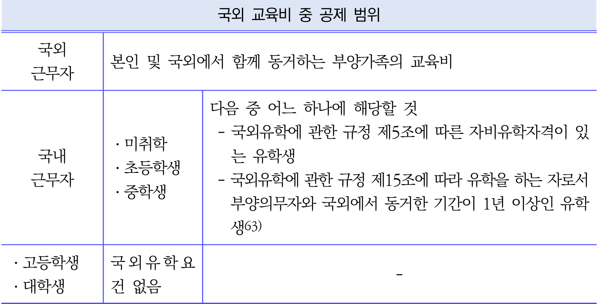

```markdown
| 국외 근무자 | 국외 교육비 중 공제 범위                                                                                   |
|-------------|------------------------------------------------------------------------------------------------------------|
| 국내 근무자 | 본인 및 국외에서 함께 동거하는 부양가족의 교육비                                                             |
|             
<<SPLIT>>
 국외에서 함께 동거하는 부양가족의 교육비                                                             |
|             | 다음 중 어느 하나에 해당할 것                                                                              |
|             | - 국외유학에 관한 규정 제5조에 따른 자비유학자격이 있는 유학생                                              |
|             | - 국외유학에 관한 규정 제15조에 따라 유학을 하는 자로서 부양의무자와 국외에서 동거한 기간이 1년 이상인 유학생 |
|             | · 미취학                                                                                                 
<<SPLIT>>
미취학                                                                                                   |
|             | · 초등학생                                                                                                 |
|             | · 중학생                                                                                                   |
|             | · 고등학생                                                                                                 |
|             | · 대학생           
<<SPLIT>>
                                                                  |
|             | · 대학생                                                                                                   |
|             | 국외 유학 요건 없음                                                                                        |
```

3) 교육비 세액공제 배제
- 해당 연도에 받은 장학금 또는 학자금으로 소득세 또는 증여세가 비과세 되는 다
음에 해당하는 금액은 교육비공제 대상에서 배제한다.
① 근로복지기금법에 따른 사내근로복지기금으로부터 받는 장학금
② 재학 중인 학교로부터 받는 장학금 등
③ 근로자인 학생이 직장으로부터 받는 장학금 등
④ 국외근무공무원에게 지급
<<SPLIT>>
.
① 근로복지기금법에 따른 사내근로복지기금으로부터 받는 장학금
② 재학 중인 학교로부터 받는 장학금 등
③ 근로자인 학생이 직장으로부터 받는 장학금 등
④ 국외근무공무원에게 지급되는 자녀 등에 대한 장학금 등
⑤ 그 밖에 각종 단체로부터 받는 장학금 등
체육시설 : 체육시설의 설치 · 이용에 관한 법률에 따른 체육시설업자가 운영하는 체육시설 또는 국가,
지방자치단체 또는 청소년활동진흥법에 따른 청소년수련 시설로 허가 · 등록된 시설을 운영하는 자가
운영(위탁운영 포함)하는 체육시설
63) 국외에서 1년 이상 거주하다 국내로 귀국한 근로자에 한정하여 적용하는 것인바 배우자와 자녀만 국외
로 이주한 경우에는 적용되지 아니함(법규소득 2011-537, 2011.12.29.)
제
1
장
근로소득
연말정산(이론편)
제2장
근로소득
연말정산(실전편)
제3장
연말정산
세액의
계산
제4장
근로소득자의
연말정산
후
4대보험
정산
201
교육비 세액공제 제외되는 대표적인 항목은 아래와 같다.
| 구
<<SPLIT>>

제2장
근로소득
연말정산(실전편)
제3장
연말정산
세액의
계산
제4장
근로소득자의
연말정산
후
4대보험
정산
201
교육비 세액공제 제외되는 대표적인 항목은 아래와 같다.
| 구 분 | 공제제외 대상 항목 |
| --- | --- |
| 어린이집 | 입소료, 현장학습비, 차량운행비, 앨범비, 특별활동비 중 재료비 |
| 유치원 | 현장학습비, 차량운행비, 앨범비, 방과 후 과정 중 재료비 |
| 초등학교 | 차량운행비, 앨범비, 방과후학교의 재료비 |
| 중 · 고교 | 차량운행비, 앨범비, 실기실습비, 방과후학교의 재료비 |
| 대학교 대학원 | 기숙사비, 대학원의 논문심사료, 국외대학교의 예비교육과정 · 어학연수비용 등 |
| 대학교 대학원 | 부양가족의 대학원 관련 모든 비용 |
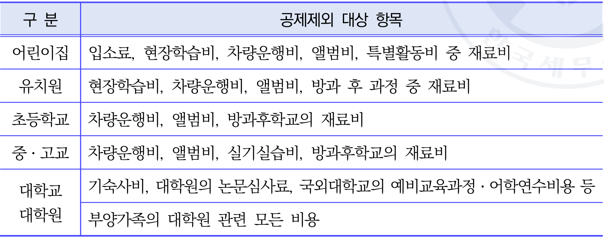

```markdown
| 구분     | 공제제외 대상 항목                                   
<<SPLIT>>
Items/12_page_202_table_1.png)

```markdown
| 구분     | 공제제외 대상 항목                                                                 |
|----------|-----------------------------------------------------------------------------------|
| 어린이집 | 입소료, 현장학습비, 차량운행비, 앨범비, 특별활동비 중 재료비                      |
| 유치원   | 현장학습비, 차량운행비, 앨범비, 방과 후 과정 중 재료비                            |
| 초등학교 | 차량운행비, 앨범비, 방과후학교의 재료비                                           |
| 중·고교  | 차량운행비, 앨범비, 실기실습비, 방과후학교의 재료비                
<<SPLIT>>
                                           |
| 중·고교  | 차량운행비, 앨범비, 실기실습비, 방과후학교의 재료비                               |
| 대학교   | 기숙사비, 대학원의 논문심사료, 국외대학교의 예비교육과정·어학연수비용 등          |
| 대학원   | 부양가족의 대학원 관련 모든 비용                                                  |
```

4) 교육비공제 증명서류
| 구 분 | 구 분 | 증명서류 | 비 고 |
| --- | --- | --- | --- |
| 국내교육기관 학생 | 국내교육기관 학생 | 교육비납입증명서 | 간소화제공 |
| 학자금대출 원리금 상환액 | 학자금대출 원리금 상환액 | 교육비납입증명서 |  |
| 국외근무 근로자가 국외교육기관에 지출 | 국외근무 근로자가 국외교육기관에 지출 | 교육비납입증명서 | 직접 영수증 발급 |
| 국내근
<<SPLIT>>
원리금 상환액 | 교육비납입증명서 |  |
| 국외근무 근로자가 국외교육기관에 지출 | 국외근무 근로자가 국외교육기관에 지출 | 교육비납입증명서 | 직접 영수증 발급 |
| 국내근무 근로자가 국외교육기관에 지출 | 국내근무 근로자가 국외교육기관에 지출 | 교육비납입증명서 유학자격을 입증하는 서류 (근로자가 국내에 근무하는 경우) | 직접 영수증 발급 |
| 보육시설을 이용하는 영유아 | 보육시설을 이용하는 영유아 | 교육비납입증명서 | 직접 영수증 발급 |
| 학원 · 체육시설(초등학교 취학 전 아동) | 학원 · 체육시설(초등학교 취학 전 아동) | 교육비납입증명서 | 직접 영수증 발급 |
| 학점인정 등에 관한법률에 의한 학위취득과정 | 고등교육법에 의한 대학 · 전문대학 및 이에 준하는 학교에서 이수하는 교육과정 | 교육비납입증명서 | 간소화제공 (제출한 경우) |
| 학점인정 등에 관한법률에 의한 학위취득과정 | 교육과정에서 학교 외의 이수하는 교육과정 | 교육비납입증명서 |
<<SPLIT>>
는 교육과정 | 교육비납입증명서 | 간소화제공 (제출한 경우) |
| 학점인정 등에 관한법률에 의한 학위취득과정 | 교육과정에서 학교 외의 이수하는 교육과정 | 교육비납입증명서 | 간소화제공 (제출한 경우) |
| 독학에 의한 학위취득에 관한법률에 의한 | 독학에 의한 학위취득에 관한법률에 의한 | 교육비납입증명서 | 간소화제공 (제출한 경우) |
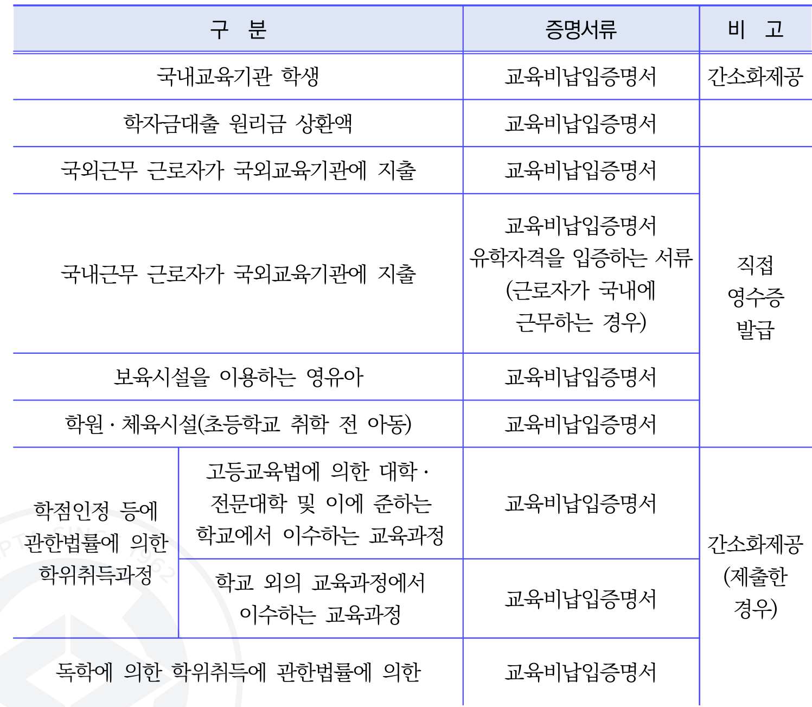

```markdown
| 구분                                       | 증명서류                     | 비고                     |
|------------------------------------------|--------------------------|------------------------|
| 국내교육기관 학생                            | 교육비납입증명서      
<<SPLIT>>
------------------|------------------------|
| 국내교육기관 학생                            | 교육비납입증명서               | 간소화제공                 |
| 학자금대출 원리금 상환액                       | 교육비납입증명서               |                          |
| 국외근무 근로자가 국외교육기관에 지출             | 교육비납입증명서               |                          |
| 국내근무 근로자가 국외교육기관에 지출             | 교육비납입증명서               | 직접 영수증 발급            |
| 국내근무 근로자가 국외교육기관에 지출             | 유학자격을 입증하는 서류 (근로자가 국내에 근무하는 경우) | 직접 영수증 발급            |
| 보육
<<SPLIT>>

| 국내근무 근로자가 국외교육기관에 지출             | 유학자격을 입증하는 서류 (근로자가 국내에 근무하는 경우) | 직접 영수증 발급            |
| 보육시설을 이용하는 영유아                      | 교육비납입증명서               |                          |
| 학원·체육시설(초등학교 취학 전 아동)              | 교육비납입증명서               |                          |
| 학점인정 등에 관한 법률에 의한 학위취득과정         | 교육비납입증명서               | 간소화제공                 |
| 학점인정 등에 관한 법률에 의한 학위취득과정         | 교육비납입증명서               | 간소화제공 (제출한 경우)     |
| 고등교육법에 의한 대학·전문대학 및 이에 준하는 학교에서 이수하는 교육과정 | 교육비납입증
<<SPLIT>>
| 교육비납입증명서               | 간소화제공 (제출한 경우)     |
| 고등교육법에 의한 대학·전문대학 및 이에 준하는 학교에서 이수하는 교육과정 | 교육비납입증명서               | 간소화제공                 |
| 학교 외의 교육과정에서 이수하는 교육과정           | 교육비납입증명서               | 간소화제공 (제출한 경우)     |
| 독학에 의한 학위취득에 관한 법률에 의한            | 교육비납입증명서               |                          |
```

연말정산
세무
202
제3장 연말정산 세액의 계산
| 구 분 | 증명서류 | 비 고 |
| --- | --- | --- |
| 학위취득 과정 |  |  |
| 장애인 재활교육과정 | 교육비납입증명서, 사회복지시설 또는 장애인재활교육인정기관 임을 입증하는 서류 | 직접 영수증 발급 |
**NCE 196**
![id_19]
<<SPLIT>>
|  |  |
| 장애인 재활교육과정 | 교육비납입증명서, 사회복지시설 또는 장애인재활교육인정기관 임을 입증하는 서류 | 직접 영수증 발급 |
**NCE 196**
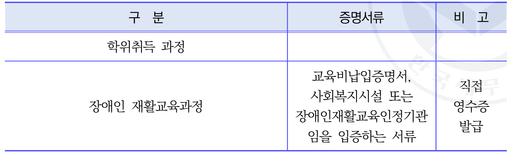

```markdown
| 구분               | 증명서류                                                                 | 비고       |
|--------------------|--------------------------------------------------------------------------|------------|
| 학위취득 과정      |                                                                          |            |
| 장애인 재활교육과정 | 교육비납입증명서, 사회복지시설 또는
<<SPLIT>>
                                                   |            |
| 장애인 재활교육과정 | 교육비납입증명서, 사회복지시설 또는 장애인재활교육인정기관 입을 입증하는 서류 | 직접 영수증 발급 |
```

[참고]
◎ 당해연도에 고등학생에서 대학생이 된 경우의 교육비공제(서면1팀-317, 2004.03.02.)
자녀가 외국유학 중 당해 과세연도에 고등학생에서 대학생이 된 경우 지출한 교육비 중 당해
과세연도중에 지출한 교육비를 소득공제 대상으로 하되 고등학생과 대학생 중 소득공제 한도
액이 많은 대학생을 기준으로 공제한도액을 계산하는 것이며, 이때 공제한도액 계산방법은 각
학생 신분에 해당하는 각각의 한도를 따라야 하는 것으로 ① 고등학생으로서 지출한 금액 중
300만원 한도내의 금액과 ② 대학생으로서 지출한 금액 중 900만원 한도내의 금액을 계산한
후 각각의 한도내의 금액 합계액(①+②)중 전체 공제한도인 900만원을 한도로 교육
<<SPLIT>>
중
300만원 한도내의 금액과 ② 대학생으로서 지출한 금액 중 900만원 한도내의 금액을 계산한
후 각각의 한도내의 금액 합계액(①+②)중 전체 공제한도인 900만원을 한도로 교육비 공제하
는 것임.
학 * 석사 통합과정 치의학전문대학원에 진학한 자녀의 학사과정을 위해 지출한 교육비가 세액
공제 대상인지(서면소득2016-5616, 2016.11.04.)
성실신고확인대상사업자로서 성실신고확인서를 제출한 자가 해당 과세기간에 자녀를 위해 지
출한 치의학전문대학원의 교육비에 대해서는 해당 과세기간의 소득세에서 세액공제를 적용받
을 수가 없는 것임.
국내 휴학 중인 대학생 자녀의 2009년 대학 교육비를 2010년 납입시 공제시기(원천-75,
2010.01.26.)
근로소득이 있는 거주자가 기본공제대상자인 대학생을 위하여 지급한 교육비(휴학 중 타 대학
에 합격하여 납입한 교육비를 포함함)는 교육비를 지급한 연도의 근로소득금액에서 공제하는
것임.
제
1장
근로소득
연말정산(이론편)
제2장

<<SPLIT>>
 위하여 지급한 교육비(휴학 중 타 대학
에 합격하여 납입한 교육비를 포함함)는 교육비를 지급한 연도의 근로소득금액에서 공제하는
것임.
제
1장
근로소득
연말정산(이론편)
제2장
근로소득
연말정산(실전편)
제3장
연말정산
세액의
계산
제4장
근로소득자의
연말정산
후
4대보험
정산
203
|  | (4) 기부금 세액공제(소득법 제59조의4 4항) - 근로자가 해당 과세기간에 지급한 세액공제대상 기부금의 15%(해당 금액이 1천만원 경우 그 초과분에 100분의 30)에 해당하는 금액을 해당 과세 합산과세되는 종합소득산출세액에서 공제한다. 공제대상 기부자 거주자64)와 거주자의 기본공제대상자65)(나이의 제한을 받지 않음) |
| --- | --- |
|  | 을 초과하는 대해서는 기간의 1) - 2) 기부금의 종류 구분 |
| ① 제76조) ② ③ 제88조의4 제13항) | 정치자금기부금(조특법 고향사랑기부금(조특법 제58조 제2항) 우리사주조합원기부금(조특법 |
| ④ 특례기부금(소득
<<SPLIT>>
종류 구분 |
| ① 제76조) ② ③ 제88조의4 제13항) | 정치자금기부금(조특법 고향사랑기부금(조특법 제58조 제2항) 우리사주조합원기부금(조특법 |
| ④ 특례기부금(소득법 제59조의4 제4항 제1호) ⑤ 일반기부금(소득법 제59조의4 제4항 제2호) 3) 기부금의 주요 유형 | ④ 특례기부금(소득법 제59조의4 제4항 제1호) ⑤ 일반기부금(소득법 제59조의4 제4항 제2호) 3) 기부금의 주요 유형 |
| 구 분 | 해당 기부금 |
| 정치자금 기부금 | 정치자금법에 따라 정당(같은 법에 따른 후원회 및 선거관리위원회 포함)에 기부한 정치자금 |
| 고향사랑 기부금 | 고향사랑 기부금에 관한 법률에 따라 기부한 금액 |
| 특례 기부금 연말정산 세무 | · 국가 또는 지방자치단체 · 국방헌금과 위문금품 · 천재지변으로 생긴 이재민을 위한 구호금품 · 특별재난지역 복구 자원봉사 |
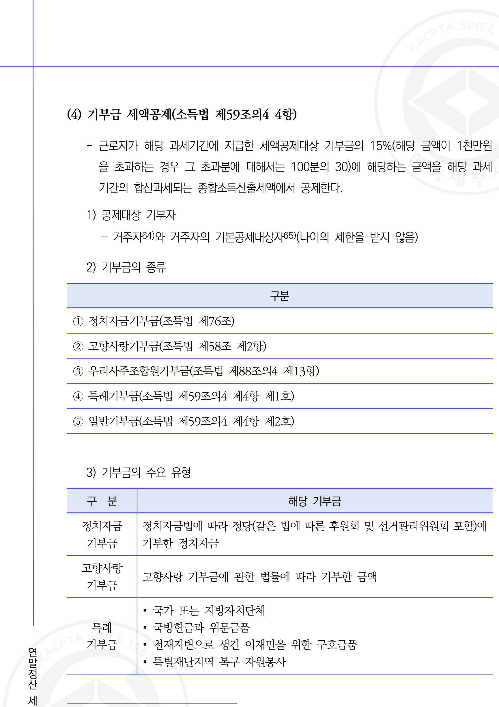

## 기부금 세
<<SPLIT>>
위문금품 · 천재지변으로 생긴 이재민을 위한 구호금품 · 특별재난지역 복구 자원봉사 |


## 기부금 세액공제(소득법 제59조의4 4항)

- 근로자가 해당 과세기간에 지급한 세액공제대상 기부금의 15%(해당 금액이 1천만원을 초과하는 경우 그 초과분에 대해서는 100분의 30)에 해당하는 금액을 해당 과세기간의 합산과세되는 종합소득산출세액에서 공제한다.

### 1) 공제대상 기부자
- 거주자와 거주자의 기본공제대상자(나이의 제한을 받지 않음)

### 2) 기부금의 종류

| 구분 | 내용 |
|---|---|
| ① 정치자금기부금 | (조특법 제76조) |
| ② 고향사랑기부금 | (조특법 제58조 제2항) |
| ③ 우리사주조합원기부금 | (조특법 제88조의4 제13항) |
| ④ 특례기부금 | (소득법 제59조의4 제4항 제1호) |
| ⑤ 일반기부금 | (소득법 제59조의4 제4항 제2호) |

#
<<SPLIT>>
합원기부금 | (조특법 제88조의4 제13항) |
| ④ 특례기부금 | (소득법 제59조의4 제4항 제1호) |
| ⑤ 일반기부금 | (소득법 제59조의4 제4항 제2호) |

### 3) 기부금의 주요 유형

| 구분 | 해당 기부금 |
|---|---|
| 정치자금 기부금 | 정치자금법에 따라 정당(같은 법에 따른 후원회 및 선거관리위원회 포함)에 기부한 정치자금 |
| 고향사랑 기부금 | 고향사랑 기부금에 관한 법률에 따라 기부한 금액 |
| 특례 기부금 | • 국가 또는 지방자치단체<br>• 국방헌금과 위문금품<br>• 천재지변으로 생긴 이재민을 위한 구호금품<br>• 특별재난지역 복구 자원봉사 |

64) 사업소득만 있는 자는 제외하고 연말정산대상 사업소득자는 포함한다.
65) 정치자금기부금과 우리사주조합기부금은 거주자 본인명의로 지출한 경우에만 공제 가능하다.
204
제3장 연말정산 세액의 계산
| 구 분 | 해당 기부금 |
| --- | --- |
|  | · 학교 등에
<<SPLIT>>
사주조합기부금은 거주자 본인명의로 지출한 경우에만 공제 가능하다.
204
제3장 연말정산 세액의 계산
| 구 분 | 해당 기부금 |
| --- | --- |
|  | · 학교 등에 시설비 · 교육비 · 장학금 또는 연구비로 기부한 금액 · 공공 의료기관에 시설비 · 교육비 · 연구비로 지출한 금액 · 법정 요건을 갖춘 전문모금기관에 지출한 기부금(사회복지공동모금회 · 재 단법인 바보의 나눔) |
| 일반 기부금 | · 일반기부금단체"의 고유목적사업비로 지출하는 기부금 * 사회복지법인, 유치원, 초 · 중 · 고, 대학, 기능대학, 전공대학 · 원격대 학, 정부 인가 학술연구단체 · 장학단체 · 기술진흥단체, 정부 인가 문화 · 예술단체 · 환경보호운동단체, 종교의 보급 등을 목적으로 민법 제32 조에 따라 문화체육관광부장관 또는 지방자치단체장의 허가를 받아 설 립한 비영리법인(소속 단체 포함), 의료법인, 기획재정부장관이 지정한 일반기부금단체 · 공공기관(공기업은 제외) 및 개별법에
<<SPLIT>>
문화체육관광부장관 또는 지방자치단체장의 허가를 받아 설 립한 비영리법인(소속 단체 포함), 의료법인, 기획재정부장관이 지정한 일반기부금단체 · 공공기관(공기업은 제외) 및 개별법에 설립근거가 있는 기관으로서 법정 요건을 갖춘 법인 · 단체에 지출하는 기부금 · 학교장이 추천하는 개인에게 지출하는 교육비 · 연구비 · 장학금 · 불우이웃돕기, 지역새마을 사업을 위하여 지출한 비용 등 · 영업자 조직단체의 특별회비, 임의 조직된 조합 등의 회비 · 무료 · 실비 사회복지시설, 해외일반기부금단체 등 · 법률에 따라 설립된 노동조합 · 교원단체 · 공무원 직장협의회 · 공무원 노 동조합에 가입한 사람이 납부한 회비 · 사망 등으로 공익법인 등에 기부될 조건으로 설정한 신탁 금액 · 공익단체에 지출하는 기부금 |
**196**
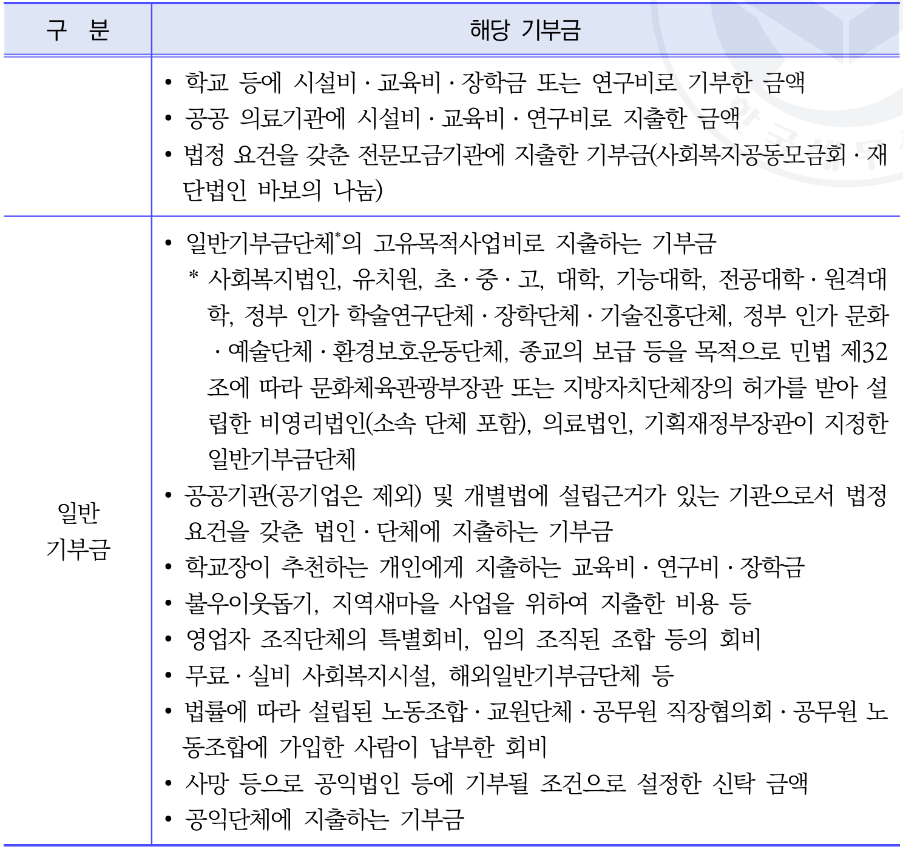

```markdown
| 구분       | 해당 기부금                   
<<SPLIT>>
*196**


```markdown
| 구분       | 해당 기부금                                                                                                                                                                                                                                                                                                                                                   |
|------------|----------------------------------------------------------------
<<SPLIT>>
                    |
|------------|---------------------------------------------------------------------------------------------------------------------------------------------------------------------------------------------------------------------------------------------------------------------------------------------------------------------------------------------------------------|
| 일반 기부금 | • 학교 등에 시설비·교육비·장학금 또는 연구비로 기부한 금액                                                                  
<<SPLIT>>
• 학교 등에 시설비·교육비·장학금 또는 연구비로 기부한 금액                                                                                                                                                                                                                                                                                                                   |
|            | • 공공 의료기관에 시설비·교육비·연구비로 지출한 금액                                                                                                                
<<SPLIT>>
                                                                                                                                                                                                                                                                                                         |
|            | • 법령 요건을 갖춘 전문모금기관에 지출한 기부금(사회복지공동모금회·재단법인 바보의 나눔)                                                                                                                                        
<<SPLIT>>
                                                                                                                                                                                                                                                         |
|            | • 일반기부금단체*의 고유목적사업비로 지출하는 기부금                                                                                                                                                                                                             
<<SPLIT>>
                                                                                                                                                                                                            |
|            |   * 사회복지법인, 유치원, 초·중·고, 대학, 기능대학, 전문대학·원격대학, 정부 인가 학술연구단체·장학단체·기술진흥단체, 정부 인가 문화예술단체·환경보호운동단체, 종교의 보급 등을 목적으로 민법 제32조에 따라 문화체육관광부장관 또는 지방자치단체장의 허가를 받아 설립한 비영리법인(소속 단체 포함), 의료법인, 기획재정부장관이 지정한 일반기부금단체 |
|            | • 공공기관(공기업은 제외) 및 개별법에 설립근거가 있는 기관으로서 법령 요건을 갖춘 법인·단체에 지출하는 기부금 
<<SPLIT>>
재정부장관이 지정한 일반기부금단체 |
|            | • 공공기관(공기업은 제외) 및 개별법에 설립근거가 있는 기관으로서 법령 요건을 갖춘 법인·단체에 지출하는 기부금                                                                                                                                                                                                                                                                                 |
|            | • 학교장이 추천하는 개인에게 지출하는 교육비·연구비·장학금                                                                              
<<SPLIT>>
 개인에게 지출하는 교육비·연구비·장학금                                                                                                                                                                                                                                                                                                           |
|            | • 불우이웃돕기, 지역새마을 사업을 위하여 지출한 비용 등                                                                                                                                  
<<SPLIT>>
                                                                                                                                                                                                                                                                                 |
|            | • 영업자 조직단체의 특별회비, 임의 조직된 조합 등 회비                                                                                                                                                                                  
<<SPLIT>>
                                                                                                                                                                                                                                 |
|            | • 무료·실비 사회복지시설, 해외일반기부금단체 등                                                                                                                                                                                                                                       
<<SPLIT>>
                                                                                                                                                                                  |
|            | • 법률에 따라 설립된 노동조합·교원단체·공무원 직장협의회·공무원 노동조합에 가입한 사람이 납부한 회비                                                                                                                                                                                                                                                        
<<SPLIT>>
                                                                                                                                 |
|            | • 사망 등으로 공익법인 등에 기부될 조건으로 설정한 신탁 금액                                                                                                                                                                                                                                                                                                         |
|            | • 공익단
<<SPLIT>>
                                                                              |
|            | • 공익단체에 지출하는 기부금                                                                                                                                                                                                                                                                                                                                       |
```

4) 세액공제 대상 한도
| 구 분 | 기부금 세액공제 대상 한도 |
| --- | --- |
| 
<<SPLIT>>
                                      |
```

4) 세액공제 대상 한도
| 구 분 | 기부금 세액공제 대상 한도 |
| --- | --- |
| 정치자금 | 근로소득금액 전액 |
| 고향사랑기부금 | (근로소득금액 - 정치자금기부금) x 100% |
| 특례기부금 | (근로소득금액 - 정치자금기부금 · 고향사랑기부금) x 100% |
| 우리사주조합 기부금 | (근로소득금액 - 정치자금 · 고향사랑기부금 · 특례기부금) x 30% |
| 일반기부금 | · 종교단체에 기부한 금액이 있는 경우 |
**196**


```markdown
| 구분               | 기부금 세액공제 대상 한도                                      |
|--------------------|------------------------------------------
<<SPLIT>>
                                  |
|--------------------|---------------------------------------------------------------|
| 정치자금           | 근로소득금액 전액                                             |
| 고향사랑기부금     | (근로소득금액 - 정치자금기부금) × 100%                        |
| 특례기부금         | (근로소득금액 - 정치자금기부금 · 고향사랑기부금) × 100%      |
| 우리사주조합 기부금 | (근로소득금액 - 정치자금 · 고향사랑기부금 · 특례기부금) × 30% |
| 일반기부금         | 종교단체에 기부한 금액이 있는 경우                            |
```

제
1장
근로소득
연말정산(이론편)
제2장
근로소득
연말정산(실전편)
제3장
연말
<<SPLIT>>
 종교단체에 기부한 금액이 있는 경우                            |
```

제
1장
근로소득
연말정산(이론편)
제2장
근로소득
연말정산(실전편)
제3장
연말정산
세액의
계산
제4장
근로소득자의
연말정산
후
4대보험
정산
205
| 구 분 | 기부금 세액공제 대상 한도 |
| --- | --- |
|  | (근로소득금액 - 정치자금 · 고향사랑기부금 · 특례기부금 · 우리사 주조합 기부금x 10%)+Min[(근로소득금액 - 정치자금 · 고향사랑 기부금 · 특례기부금 · 우리사주조합 기부금 x 20%), 종교단체 외 에 지급한 금액] · 종교단체에 기부한 금액이 없는 경우 (근로소득금액 - 정치자금 · 고향사랑기부금 · 특례기부금 · 우리사 주조합 기부금x30%) |
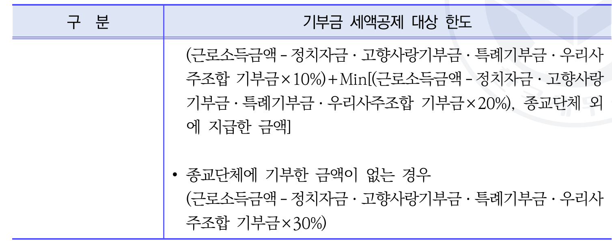

```markdown
| 구분 | 기부금 세액공제 대상 한도 |
|------|------------------------
<<SPLIT>>
Items/43_page_206_table_1.png)

```markdown
| 구분 | 기부금 세액공제 대상 한도 |
|------|---------------------------|
|      | (근로소득금액 - 정치자금 · 고향사랑기부금 · 특례기부금 · 우리사주조합 기부금 × 10%) + Min[(근로소득금액 - 정치자금 · 고향사랑기부금 · 특례기부금 · 우리사주조합 기부금 × 20%), 종교단체 외에 지급한 금액] |
|      | • 종교단체에 기부한 금액이 없는 경우 (근로소득금액 - 정치자금 · 고향사랑기부금 · 특례기부금 · 우리사주조합 기부금 × 30%) |
```

· 2024년 1월 1일부터 2024년 12월 31일까지 지급한 기부금을 종합소득 산출세
액에서 공제할 때 필요경비산입분을 제외한 금액이 3천만원을 초과하는 경우 그
초과분에 대해서는 100분의 10에 해당하는 금액을 추가로 공제한다.
정치자금기부금과 고향사랑기부금의 지출액이 10만원 이내인 
<<SPLIT>>
산입분을 제외한 금액이 3천만원을 초과하는 경우 그
초과분에 대해서는 100분의 10에 해당하는 금액을 추가로 공제한다.
정치자금기부금과 고향사랑기부금의 지출액이 10만원 이내인 경우에는 전액 세
액공제 한다.
5) 기부금 이월공제 적용기간
- 특례기부금과 일반기부금은 10년간 이월공제66)67)를 적용한다.
6) 기부금 공제 적용 순서
정치자금기부금 → 특례기부금 → 우리사주조합기부금 → 종교단체 외 일반기부금
→ 종교단체 일반기부금
연말정산
세무
66) 정치자금기부금과 우리사주조합 기부금은 이월공제되지 않는다.
67) 2013.1.1. 이후 해당연도 기부금부터 먼저 공제하였으나 2020년 이후 과세표준을 신고하는 분부터
이월된 기부금을 해당 기부금보다 먼저 세액공제 한다.
206
19
제3장 연말정산 세액의 계산
[참고]
특별재난지역으로의 이동을 위한 유류비가 소득령 제81조에 따른 직접비용으로서 기부금에
해당되는지(서면법규소득2022-3657, 2023.02.28.)
- 「재난
<<SPLIT>>
액의 계산
[참고]
특별재난지역으로의 이동을 위한 유류비가 소득령 제81조에 따른 직접비용으로서 기부금에
해당되는지(서면법규소득2022-3657, 2023.02.28.)
- 「재난 및 안전관리 기본법」에 따른 특별재난지역을 복구하기 위하여 자원봉사를 하는 경
우로서 특별재난지역 외의 지역에서 특별재난지역으로 자차로 이동함에 따라 소요된 유류
비는 「소득세법 시행령」 제81조 제5항 제2호에 따른 직접비용에 포함되는 것임.
공무원이 특별재난지역으로 선포된 지역의 복구를 위하여 자원봉사한 경우(기획재정부소
득-502, 2008.01.31.)
- 「국가공무원법」 및 「지방공무원법」에 의한 공무원이 복무규정에 따른 근무시간 중에 「재난
및 안전관리기본법」에 따라 특별재난지역으로 선포된 지역의 복구를 위하여 자원봉사한
경우 당해 복구활동은 「소득세법」 제34조 제2항 제3호의 2에 따른 특례기부금에 해당되
지 않음.
03 이외 세액공제
(1) 월세세액공제(조특법 제95조의2)
- 과세기간 종
<<SPLIT>>
한
경우 당해 복구활동은 「소득세법」 제34조 제2항 제3호의 2에 따른 특례기부금에 해당되
지 않음.
03 이외 세액공제
(1) 월세세액공제(조특법 제95조의2)
- 과세기간 종료일 현재 주택을 소유하지 아니하는 세대의 세대주68)로서 해당 과세기
간 총급여액이 8천만원 이하(종합소득금액 7천만원 초과자 제외)인 근로자가 국민주
택규모의 주택 또는 기준시가 4억원 이하 주택을 임차하기 위해 지급하는 월세액(연
750만원 한도)의 15% (총급여액이 5,500만원 이하이면서 종합소득금액 4,500만원
초과하지 않는 경우 17%) 를 공제한다
1) 세액공제 요건
국민주택규모 주택 또는 기준시가 4억원 이하(주거용 오피스텔, 고시원 포함) 를
임차하기 위해 지급하는 월세액(사글세액 포함)으로 임대차계약증서69)의 주소지와
주민등록표 등본의 주소지가 같아야 한다.
68) 세대주가 주택 관련 공제를 받지 않은 경우 세대원을 포함하며, 일정 요건을 충족한 외국인을 포함한다.
69) 2017년
<<SPLIT>>
의 주소지와
주민등록표 등본의 주소지가 같아야 한다.
68) 세대주가 주택 관련 공제를 받지 않은 경우 세대원을 포함하며, 일정 요건을 충족한 외국인을 포함한다.
69) 2017년부터 기본공제대상자(연령 · 소득요건 충족)가 계약한 경우에도 공제 가능
제
1
장
근로소득
연말정산(이론편)
제2장
근로소득
연말정산(실전편)
제4장
근로소득자의
연말정산
후
4대보험
정산
제3장
연말정산
세액의
계산
207
2) 공제금액 및 한도
- 근로소득이 있는 거주자가 지급한 월세액에 대하여 총급여 또는 종합소득금액을
기준으로 공제율을 적용하여 공제액을 계산한다.
3) 공제 증명 서류
- 주민등록표등본, 임대차계약증서 사본, 월세액을 지급하였음을 증명하는 서류(금융
증빙 등)
[참고]
세대구분형 공동주택의 경우 월세액 세액공제 판단의 국민주택규모 기준(기획재정부소득-433,
2033.05.19.)
- 임차인이 세대구분형 공동주택의 세대별로 구분된 공간을 임차한 경우 월세세액공제에 따
른 국민주택규모
<<SPLIT>>
공제 판단의 국민주택규모 기준(기획재정부소득-433,
2033.05.19.)
- 임차인이 세대구분형 공동주택의 세대별로 구분된 공간을 임차한 경우 월세세액공제에 따
른 국민주택규모의 주택여부는 임차한 부분에 해당하는 전용면적을 기준으로 판단.
과세기간 종료일 현재 공동상속주택의 최고지분 소유 시 월세액에 대한 세액공제 적용여부
(사전법령해석소득2018-370, 2018.10.29.)
- 공동상속주택 상속 이후 다른 상속인 지분을 취득하여 과세기간 종료일 현재 최고지분자가
된 경우는 월세액에 대한 세액공제 적용대상에 해당하지 않는 것이며, 월세액에 대한 세액
공제는 근로자가 근로제공 기간 동안 지출한 월세액에 한하여 적용받을 수 있는 것임
(2) 외국납부세액공제(소득법 제57조)
- 거주자의 종합소득금액에 국외원천소득이 합산되어 있는 경우로서 그 국외원천소득에
대하여 외국에서 외국소득세액을 납부하였거나 납부할 것이 있는 때에는 외국소득세
액을 해당 과세기간의 종합소득 산출세액에서 공제
<<SPLIT>>
외원천소득이 합산되어 있는 경우로서 그 국외원천소득에
대하여 외국에서 외국소득세액을 납부하였거나 납부할 것이 있는 때에는 외국소득세
액을 해당 과세기간의 종합소득 산출세액에서 공제할 수 있다.
1) 국외원천소득의 범위
- 국외원천소득은 국외에서 발생한 소득으로서 거주자의 종합소득금액의 계산에 관
한 규정을 준용해 산출한 금액을 말한다.
2) 공제대상 외국소득세액
연말정산
세무
외국소득세액이란 외국정부에 납부했거나 납부할 다음의 세액(가산세는 제외한다)
을 말한다. 다만, 해당 세액이 조세조약에 따른 비과세 · 면제 · 제한세율 · 에 관한
규정에 따라 계산한 세액을 초과하는 경우에는 그 초과하는 세액은 제외한다.
208
제3장 연말정산 세액의 계산
- 국외원천소득이 있는 거주자가 조세조약의 상대국에서 그 국외원천소득에 대하여
소득세를 감면받은 세액 상당액은 그 조세조약에서 정하는 범위에서 세액공제 대
상이 되는 외국소득세액으로 본다.
3) 환율 적용
- 원화환산은 외국세액을 납부한 
<<SPLIT>>
외원천소득에 대하여
소득세를 감면받은 세액 상당액은 그 조세조약에서 정하는 범위에서 세액공제 대
상이 되는 외국소득세액으로 본다.
3) 환율 적용
- 원화환산은 외국세액을 납부한 때의 외국환거래법에 의한 기준환율 또는 재정환율
에 의한다.
4) 세액공제의 한도
종합소득 산출세액 x (국외원천소득금액70) / 종합소득금액)
「조세특례제한법」 또는 기타 법률에 의하여 면제 또는 세액감면을 적용받는 경우
에는 다음의 금액을 국외원천소득금액에서 차감한다.
면제 또는 세액감면 대상 국외원천소득금액 x 면제(감면)비율
5) 이월공제
- 외국소득세액을 종합소득산출세액에서 공제할 때 외국정부에 납부하였거나 납부할
외국소득세액이 해당 과세기간의 공제한도금액을 초과하는 경우 그 초과하는 금액
은 해당 과세 기간의 다음 과세기간 개시일부터 10년 이내에 끝나는 과세기간으
로 이월하여 그 이월된 과세기간의 공제한도금액 내에서 공제받을 수 있다(소득법
제57조 2항).
6) 제출서류
외국납부세액공제를 받고
<<SPLIT>>
간 개시일부터 10년 이내에 끝나는 과세기간으
로 이월하여 그 이월된 과세기간의 공제한도금액 내에서 공제받을 수 있다(소득법
제57조 2항).
6) 제출서류
외국납부세액공제를 받고자 하는 자는 외국납부세액공제신청서와 납부세액 증빙서
류 등을 연말정산시 제출하여야 한다. 단, 외국정부의 국외원천소득에 대한 소득
세 결정통지의 지연, 과세기간의 상이 등의 사유로 연말정산할 때 신청서를 제출
할 수 없는 경우에는 그 소득세의 결정통지를 받은 날로부터 3개월 이내에 제출
할 수 있다(소득령 제117조 4항).
70) 국외원천소득에서 국외원천소득대응비용을 차감한 금액
제
1장
근로소득
연말정산(이론편)
제2장
근로소득
연말정산(실전편)
제3장
연말정산
세액의
계산
제4장
근로소득자의
연말정산
후
4대보험
정산
209
1962
[참고] 외국납부세액공제 관련
| 1. | 외국납부세액은 거주자의 당해연도의 과세표준금액에 포함된 국외원천소득에 대하여 납부 하였거나 납부할 것으로 확정된 금액을 말함(
<<SPLIT>>

1962
[참고] 외국납부세액공제 관련
| 1. | 외국납부세액은 거주자의 당해연도의 과세표준금액에 포함된 국외원천소득에 대하여 납부 하였거나 납부할 것으로 확정된 금액을 말함(소득세 통칙 57-2). |
| --- | --- |
| 2. | 미국 주정부세는 관련법에 의해 외국납부세액공제를 적용받을 수 있음(국조, 서면인터넷방 문상담2팀-1419, 2005.09.06.). |
| 3. | 거주자가 외국에서 근로를 제공함으로 인해 외국법인으로부터 부여받은 스톡옵션을 행사하 여 얻은 소득에 대하여 원천지국에서 적법하게 납부한 세금이 있는 경우 외국납부세액공제 를 적용할 수 있음(서면인터넷방문상담2팀-811, 2007.4.30.). |
| 4. | 거주자(외국인 포함)의 국외근로소득은 외국납부세액공제대상이 되나, 비거주자의 국외근 로소득은 국외원천소득으로서 국내에서 과세 안 됨(서일46011-10576,2002.05.01.). |
| 5. | 외국납부세액공제는 정부간의 조세협약 체결여부
<<SPLIT>>
, 비거주자의 국외근 로소득은 국외원천소득으로서 국내에서 과세 안 됨(서일46011-10576,2002.05.01.). |
| 5. | 외국납부세액공제는 정부간의 조세협약 체결여부와는 관계없이 적용받을 수 있음(통칙 57-4). |
| 6. | 외국의 과세연도와 우리나라의 과세연도가 다른 경우에는 우리나라에서의 과세연도를 기준 으로 함. |
| 7. | 국외근로소득에 대한 외국납부세액 공제한도 초과로 공제받지 못한 세액은 10년간 이월공 제되나, 이월된 과세기간에 국외근로소득이 없어 공제한도액을 계산할 수 없는 경우에는 공제 안됨(제도46017-10523.2001.4.11.). |
| 8. | 해외근무에 따라 외국에서 받은 주택, 차량임차유지비 등에 대해 외국에서 소득세가 과세 된 경우라도 당해 소득이 우리나라에서는 비과세소득인 경우 외국납부세액공제 대상이 아 님(소득46011-536.1999.2.9.). |
| 9. | 해외기술연수 중에 내국법인으로부터 지급받은 급여는 국외원천소득
<<SPLIT>>
나라에서는 비과세소득인 경우 외국납부세액공제 대상이 아 님(소득46011-536.1999.2.9.). |
| 9. | 해외기술연수 중에 내국법인으로부터 지급받은 급여는 국외원천소득이 아니므로 외국납부 세액공제 안 됨(서면2팀-1777, 2004.8.25.). |
|  | 10. 외국법인 국내지점에 근무하고 외국본사로부터 지급받은 급여는 국외원천소득에 해당하 지 않아 외국납부세액공제 안 됨(소득46011-2293, 1998.08.13.). |
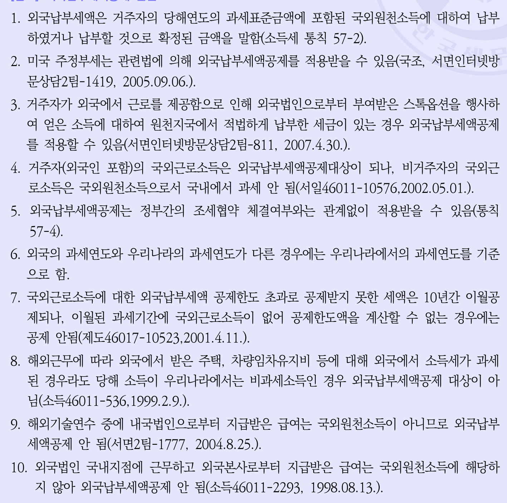

1. 외국납부세액은 거주자의 당해연도의 과세표준금액에 포함된 국외원천소득에 대하여 납부하였거나 납부할 것으로 확정된 금액을 말함(소득세 통칙 57-2).

2. 미국 주정부세는 관련법에 의해 외국납부세액공제를 적용받을 수 있음(국조, 서면인터넷방문상담2팀-1419, 2005.09.06.).

3. 거주자가 외국에서 근로를 제공함으로 인해 외국법인으로부터 보수받은 스톡
<<SPLIT>>
 외국납부세액공제를 적용받을 수 있음(국조, 서면인터넷방문상담2팀-1419, 2005.09.06.).

3. 거주자가 외국에서 근로를 제공함으로 인해 외국법인으로부터 보수받은 스톡옵션을 행사하여 얻은 소득에 대하여 원천지국에서 적법하게 납부한 세금이 있는 경우 외국납부세액공제를 적용할 수 있음(서면인터넷방문상담2팀-811, 2007.4.30.).

4. 거주자(외국인 포함)의 국외근로소득은 외국납부세액공제대상이 되나, 비거주자의 국외근로소득은 국외원천소득으로서 국내에서 과세 안 됨(서일46011-10576,2002.05.01.).

5. 외국납부세액공제는 정부간의 조세협약 체결여부와는 관계없이 적용받을 수 있음(통칙 57-4).

6. 외국의 과세연도와 우리나라의 과세연도가 다른 경우에는 우리나라에서의 과세연도를 기준으로 함.

7. 국외근로소득에 대한 외국납부세액 공제한도 초과로 공제받지 못한 세액은 10년간 이월공제되나, 이월된 과세기간에 국외근로소득이 없어 공제한도액을 계산할 
<<SPLIT>>
연도를 기준으로 함.

7. 국외근로소득에 대한 외국납부세액 공제한도 초과로 공제받지 못한 세액은 10년간 이월공제되나, 이월된 과세기간에 국외근로소득이 없어 공제한도액을 계산할 수 없는 경우에는 공제 안됨(서일46017-10523,2001.4.11.).

8. 해외근무에 따라 외국에서 받는 주택, 차량임차유지비 등에 대해 외국에서 소득세가 과세된 경우라도 당해 소득이 우리나라에서는 비과세소득인 경우 외국납부세액공제 대상이 아님(소득46011-536,1999.2.9.).

9. 해외기술연수 중에 내국법인으로부터 지급받은 급여는 국외원천소득이 아니므로 외국납부세액공제 안 됨(서면2팀-1777, 2004.8.25.).

10. 외국법인 국내지점에 근무하고 외국본사로부터 지급받은 급여는 국외원천소득에 해당하지 않아 외국납부세액공제 안 됨(소득46011-2293, 1998.08.13.).

(3) 납세조합공제(소득법 제150조)
1) 의의
납세조합이 2024년 12월 31일까지 근로자인 조
<<SPLIT>>
아 외국납부세액공제 안 됨(소득46011-2293, 1998.08.13.).

(3) 납세조합공제(소득법 제150조)
1) 의의
납세조합이 2024년 12월 31일까지 근로자인 조합원에 대한 매월분의 소득세를 징
수할 때에는 원천징수된 근로소득에 대한 종합소득산출세액의 5%를 공제하고 징수
한다. 이 경우 공제금액의 한도는 연 100만원(해당 과세기간 또는 근로제공기간이
1년 미만인 경우 월할계산)이다(소득법 제150조).
연말정산
세무
210
19
제3장 연말정산 세액의 계산
2) 세액공제액
| 납세조합공제 | 매월징수시 | 매월 징수하는 세액의 5%71) |
| --- | --- | --- |
| 납세조합공제 | 연말정산시 | 산출세액의 5%(연말정산시 재정산) |
| 근로소득세액공제 | 근로소득세액공제 | 가능 |


```markdown
| 납세조합공제 | 매월징수시                  |
<<SPLIT>>
 | 가능 |


```markdown
| 납세조합공제 | 매월징수시                  | 매월 징수하는 세액의 5%71)            |
|-------------|-----------------------------|--------------------------------------|
| 납세조합공제 | 연말정산시                  | 산출세액의 5%(연말정산시 재정산)     |
| 근로소득세액공제 | 근로소득세액공제 가능 | 근로소득세액공제 가능                |
```

① 납세조합이 징수한 근로소득만 있는 경우 : 산출세액 x 5%
② 일반근로소득과 납세조합이 징수한 근로소득을 합산하여 연말정산하지 않는 경우
: 납세조합은 납세조합이 징수한 근로소득에 대해 납세조합공제를 적용하여 연말
정산하고, 일반근로소득에 대해서는 납세조합공제를 적용하지 않는다.

<<SPLIT>>
을 합산하여 연말정산하지 않는 경우
: 납세조합은 납세조합이 징수한 근로소득에 대해 납세조합공제를 적용하여 연말
정산하고, 일반근로소득에 대해서는 납세조합공제를 적용하지 않는다.
③ 일반근로소득과 납세조합이 징수한 근로소득을 합산하여 연말정산 하는 경우 :
납세조합은 납세조합이 징수한 근로소득에 대해 납세조합공제를 적용하여 연말정
산, 일반근로소득을 지급하는 원천징수의무자가 납세조합이 징수한 근로소득을
합산해서 연말정산하고 다음의 금액을 납세조합세액공제액으로 한다.
[참고] 납세조합이 징수한 근로소득
납세조합이 징수한 근로소득 총급여액
당해연도 근로소득 금액 X
일반근로소득총급여액 + 납세조합이 징수한 근로소득 총급여액
* 총급여액 = 연간급여액 - 비과세소득
* 당해연도 근로소득금액 = (일반근로소득 총급여액 + 납세조합이 징수한 근로소득
총급여액) - 근로소득공제
[참고] 납세조합세액공제액
납세조합이 징수한 근로소득금액
종합소득산출세액 x x 5%
종합소득금액
71) 2018년 
<<SPLIT>>
여액 + 납세조합이 징수한 근로소득
총급여액) - 근로소득공제
[참고] 납세조합세액공제액
납세조합이 징수한 근로소득금액
종합소득산출세액 x x 5%
종합소득금액
71) 2018년 귀속분까지는 10%가 공제됨.
제
1장
근로소득
연말정산(이론편)
제2장
근로소득
연말정산(실전편)
제3장
연말정산
세액의
계산
제4장
근로소득자의
연말정산
후
4대보험
정산
211
3) 제출서류
매월분 납세조합이 징수한 근로소득원천징수영수증
[참고] 납세조합공제 관련
1. 납세조합에 신고하지 아니한 소득 또는 가입 전에 발생한 근로소득을 연말정산시 신고하여
납세조합이 소득세를 원천징수하는 경우에는 납세조합공제를 적용하지 않음
2. 외국인근로자 19%(2013~2016년 17%, 2009~2012년 15%) 단일세율 과세특례를 적용받
은 경우 납세조합공제 적용할 수 없음
3. 납세조합이 징수한 근로소득이 있는 자가 해당 월에 납세조합을 통하여 신고하였으나 간이
세액표에 의해 계산한 당해 월의 소득세가 없는 
<<SPLIT>>
받
은 경우 납세조합공제 적용할 수 없음
3. 납세조합이 징수한 근로소득이 있는 자가 해당 월에 납세조합을 통하여 신고하였으나 간이
세액표에 의해 계산한 당해 월의 소득세가 없는 경우에도 종합소득세확정신고 또는 연말정
산 시에 해당 납세조합이 징수한 근로소득에 대해 납세조합공제를 적용받을 수 있음
04 세액감면 및 세액공제의 한도 (소득법 제61조)
(1) 보험료 등 세액공제 한도
보험료, 의료비, 교육비, 월세 세액공제액이 근로소득에 대한 종합소득산출세액을 초과하
는 경우 그 초과하는 금액은 없는 것으로 한다(소득법 제61조 1항). 즉, 종합소득산출세
액에서 근로소득이 차지하는 비율의 금액을 한도로 한다.
(2) 특별세액공제 및 기부금세액공제액의 한도
연말정산
세무
자녀세액공제, 연금계좌세액공제, 특별세액공제(보험료, 의료비, 교육비, 특례, 일반기부
금 세액공제), 우리사주조합기부금세액공제, 정치자금기부금 세액공제액, 고향사랑기부금
세액공제액의 합계액이 그 거주자의 해당 과세기
<<SPLIT>>
액공제(보험료, 의료비, 교육비, 특례, 일반기부
금 세액공제), 우리사주조합기부금세액공제, 정치자금기부금 세액공제액, 고향사랑기부금
세액공제액의 합계액이 그 거주자의 해당 과세기간의 합산과세되는 종합소득산출세액을
초과하는 경우 그 초과하는 금액은 없는 것으로 한다. 단, 그 초과한 금액에 기부금 세
액공제액이 포함되어 있는 경우 해당 기부금과 한도초과로 공제받지 못한 기부금은 해
당 과세기간의 다음 과세기간의 개시일부터 10년 이내에 끝나는 각 과세기간에 이월하
여 기부금 세액공제율을 적용한 기부금 세액공제액을 계산하여 그 금액을 공제기준산출
세액72)에서 공제한다(소득법 제61조2항).
212
CPTA SINCE 1962
제3장 연말정산 세액의 계산
(3) 세액감면, 공제액과 연금계좌세액공제의 한도
세액감면액 및 세액공제액의 합계액이 종합소득산출세액을 초과하는 경우 그 초과하는
금액은 없는 것으로 보고, 그 초과하는 금액을 한도로 연금계좌세액공제를 받지 아니한
것으로 본다. 다만
<<SPLIT>>
감면액 및 세액공제액의 합계액이 종합소득산출세액을 초과하는 경우 그 초과하는
금액은 없는 것으로 보고, 그 초과하는 금액을 한도로 연금계좌세액공제를 받지 아니한
것으로 본다. 다만, 58조에 따른 재해손실세액공제액이 종합소득산출세액에서 다른 세액
감면액 및 세액공제액을 뺀 후 가산세를 더한 금액을 초과하는 경우 그 초과하는 금액
은 없는 것으로 본다(소득법 제61조 3항).
72) 원천징수세율을 적용받는 이자소득금액 및 배당소득금액의 합계액이 그 과세기간의 종합소득금액에서
차지하는 비율을 곱하여 산출한 금액을 제외한 종합소득산출세액
제
1
장
근로소득
연말정산(이론편)
제2장
근로소득
연말정산(실전편)
제3장
연말정산
세액의
계산
제4장
근로소득자의
연말정산
후
4대보험
정산
213
KACPTA SINCE 1962
한국세무사회
KACPTA SINCE 1962
한
국세무사회
KACPTA NCE 1962
제4장
근로소득자의 연말정산
후 4대보험 정산
제2장
01 개요
근로
근로자의 근로
<<SPLIT>>
1962
한국세무사회
KACPTA SINCE 1962
한
국세무사회
KACPTA NCE 1962
제4장
근로소득자의 연말정산
후 4대보험 정산
제2장
01 개요
근로
근로자의 근로소득 연말정산 이후 보수총액(소득총액)신고를 통해 4대보험이 정
산되어 추가부과 또는 환급하는 절차이다.
소득
(1) 4대보험 보수총액 신고
연말정산(실전편)
근로자가 입사를 하게 되면 근로계약서상 급여액을 기준으로 소득월액을 기입하여 자격
취득 신고를 하게 된다. 이후 다음해 4대보험이 정산되기 전까지는 입사일의 소득월액
기준으로 4대보험료가 부과되기 때문에 실제 근로자가 받은 급여액과 신고된 금액에 차
이가 발생하게 된다.
때문에 근로자의 근로소득이 확정되는 연말정산 이후 보수총액(소득총액)을 신고받아 전
년도의 실제 보수액을 기준으로 정산해 정확한 4대보험료를 부과하게 된다.
1) 국민연금 연말정산
사업장가입자별로 해당연도 7월부터 다음연도 6월까지 적용할 국민연금 기준소득월
액을 결정하기 위하여 전년
<<SPLIT>>
기준으로 정산해 정확한 4대보험료를 부과하게 된다.
1) 국민연금 연말정산
사업장가입자별로 해당연도 7월부터 다음연도 6월까지 적용할 국민연금 기준소득월
액을 결정하기 위하여 전년도 소득총액 및 근무일수를 신고하는 절차이다.
① 신고대상
아래 대상자는 사업장의 소득총액 신고에 의해 기준소득월액을 결정한다.
제3장
연말정산
세액의
계산
제4장
근로소득자의
연말정산
후
4대보험
정산
제
1장
근로소득
연말정산(이론편)
215
| 유형 | 신고대상 | 신고대상 |
| --- | --- | --- |
| 1유형 | 개인사업장사용자 | 개인사업장사용자 |
| 2유형 | 근로소득자료 미보유자 및 상이자 | 근로소득자료 미보유자 및 상이자 |
| 3유형 | 종전소득 대비 30%이상 상향자 | 종전소득 대비 30%이상 상향자 |
| 4유형 | 종전소득 대비 30%이상 하향자 | 종전소득 대비 30%이상 하향자 |
| 5유형 | 휴직일수 상이자 | 휴직일수 상이자 |
| ② 신고기한 다음해 5월 3
<<SPLIT>>
향자 |
| 4유형 | 종전소득 대비 30%이상 하향자 | 종전소득 대비 30%이상 하향자 |
| 5유형 | 휴직일수 상이자 | 휴직일수 상이자 |
| ② 신고기한 다음해 5월 31일까지 신고하여야 한다. 단, 개인사업장 사용자 중 성실신고확인대상사업자는 다음해 6월 30일까지 신고 하여야 한다. ③ 국민연금 연말정산 일정 (업무진행 상황에 따라 일정이 조정될 수 있으니 공단 홈페이지에서 일정을 확인 해야 한다.) | ② 신고기한 다음해 5월 31일까지 신고하여야 한다. 단, 개인사업장 사용자 중 성실신고확인대상사업자는 다음해 6월 30일까지 신고 하여야 한다. ③ 국민연금 연말정산 일정 (업무진행 상황에 따라 일정이 조정될 수 있으니 공단 홈페이지에서 일정을 확인 해야 한다.) | ② 신고기한 다음해 5월 31일까지 신고하여야 한다. 단, 개인사업장 사용자 중 성실신고확인대상사업자는 다음해 6월 30일까지 신고 하여야 한다. ③ 국민연금 연말정산 일정 (업무진행 상황에 따라 일정이
<<SPLIT>>
 31일까지 신고하여야 한다. 단, 개인사업장 사용자 중 성실신고확인대상사업자는 다음해 6월 30일까지 신고 하여야 한다. ③ 국민연금 연말정산 일정 (업무진행 상황에 따라 일정이 조정될 수 있으니 공단 홈페이지에서 일정을 확인 해야 한다.) |
| 2025년 4월 | 2025년 5월 2025년 6월 2025년 8월 | 2025년 7월 |
| 근로소득자 료 입수 | 가입자별 소득총액 신고 기준소득월액 안내 및 신고서 결정통지서 발송, 접수 발송 | 기준소득월액 국세청 과세자료 변경에 따른 대비 소득 적정신고 보험료 고지 여부 재확인 실시 |
| ④ 소득의 범위 근로를 제공하고 받은 봉급, 급료, 보수, 세비, 임금, 상여수당, 그밖에 이와 유 사한 성질의 금품이며 소득세법 제12조 제3호에 따른 비과세 근로소득(식대, 자 가운전보조금, 보육수당 등)은 제외한다. 단, 원양어업선박이나 국외 등을 항행하는 선박에서 근로를 제공하고 받는 국외 근로 비과세소득 및 조세특례제한법에 의거한 비
<<SPLIT>>
소득(식대, 자 가운전보조금, 보육수당 등)은 제외한다. 단, 원양어업선박이나 국외 등을 항행하는 선박에서 근로를 제공하고 받는 국외 근로 비과세소득 및 조세특례제한법에 의거한 비과세소득(주식매수선택권 비과세, 우리사주조합인출금 비과세)은 국민연금법상 소득에 포함한다. | ④ 소득의 범위 근로를 제공하고 받은 봉급, 급료, 보수, 세비, 임금, 상여수당, 그밖에 이와 유 사한 성질의 금품이며 소득세법 제12조 제3호에 따른 비과세 근로소득(식대, 자 가운전보조금, 보육수당 등)은 제외한다. 단, 원양어업선박이나 국외 등을 항행하는 선박에서 근로를 제공하고 받는 국외 근로 비과세소득 및 조세특례제한법에 의거한 비과세소득(주식매수선택권 비과세, 우리사주조합인출금 비과세)은 국민연금법상 소득에 포함한다. | ④ 소득의 범위 근로를 제공하고 받은 봉급, 급료, 보수, 세비, 임금, 상여수당, 그밖에 이와 유 사한 성질의 금품이며 소득세법 제12조 제3호에 따른 비과세 근로소득(식대, 자 가
<<SPLIT>>
소득의 범위 근로를 제공하고 받은 봉급, 급료, 보수, 세비, 임금, 상여수당, 그밖에 이와 유 사한 성질의 금품이며 소득세법 제12조 제3호에 따른 비과세 근로소득(식대, 자 가운전보조금, 보육수당 등)은 제외한다. 단, 원양어업선박이나 국외 등을 항행하는 선박에서 근로를 제공하고 받는 국외 근로 비과세소득 및 조세특례제한법에 의거한 비과세소득(주식매수선택권 비과세, 우리사주조합인출금 비과세)은 국민연금법상 소득에 포함한다. |
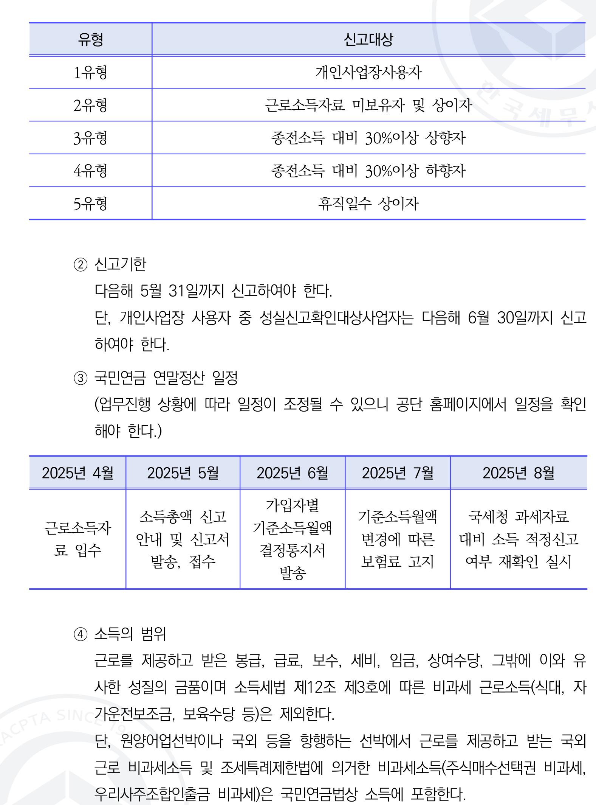

```markdown
| 유형  | 신고대상                     |
|-------|------------------------------|
| 1유형 | 개인사업장사용자            |
| 2유형 | 근로소득자료 미보유자 및 상이자 |
| 3유형 | 중전소득 대비 30%이상 상향자 |
| 4유형 | 중전소득 대비 30%이상 하향자 |
| 5유형 | 휴직
<<SPLIT>>
    |
| 2유형 | 근로소득자료 미보유자 및 상이자 |
| 3유형 | 중전소득 대비 30%이상 상향자 |
| 4유형 | 중전소득 대비 30%이상 하향자 |
| 5유형 | 휴직일수 상이자             |

### 신고기한
- 다음해 5월 31일까지 신고하여야 한다.
- 단, 개인사업장 사용자 중 성실신고확인대상사업자는 다음해 6월 30일까지 신고하여야 한다.

### 국민연금 연말정산 일정
- 업무진행 상황에 따라 일정이 조정될 수 있으니 공단 홈페이지에서 일정을 확인해야 한다.

| 2025년 4월 | 2025년 5월                  | 2025년 6월                      | 2025년 7월                      | 2025년 8월                      |
|------------|-----------------------------|---------------------------------|------
<<SPLIT>>
              |
|------------|-----------------------------|---------------------------------|---------------------------------|---------------------------------|
| 근로소득자료 입수 | 소득총액 신고 안내 및 신고서 발송, 접수 | 가입자별 기준소득월액 결정통지서 발송 | 기준소득월액 변경에 따른 보험료 고지 | 국세청 과세자료 대비 소득 적정신고 여부 재확인 실시 |

### 소득의 범위
- 근로를 제공하고 받은 봉급, 급료, 보수, 세비, 임금, 상여수당, 그밖에 이와 유사한 성질의 금품이며 소득세법 제12조 제3호에 따른 비과세 근로소득(식대, 자가운전보조금, 보육수당 등)은 제외한다.
- 단, 원양어업선박이나 국외 등을 항행하는 선박에서 근로를 제공하고 받는 국외근로 비과세소득 및 조세특례제한법에 의거한 비과세소득(주식매수선택권 비과세, 우리사주조
<<SPLIT>>
은 제외한다.
- 단, 원양어업선박이나 국외 등을 항행하는 선박에서 근로를 제공하고 받는 국외근로 비과세소득 및 조세특례제한법에 의거한 비과세소득(주식매수선택권 비과세, 우리사주조합인출금 비과세)에는 국민연금법상 소득에 포함한다.
```

연말정산
세무
216
제4장 근로소득자의 연말정산 후 4대보험 정산
2) 건강, 장기요양보험료 연말정산
전년도 보수총액을 기준으로 부과한 보험료와 실제로 받은 보수총액으로 산정한 보
험료와의 차액을 정산하는 절차이다.
(2) 직장가입자 건강, 장기요양보험료 연말정산
① 신고 대상
12월 31일 현재 재직 중인 직장가입자 및 사용자이다.
② 신고기한 및 적용시기
다음해 3월 10일까지 신고할 경우 4월분부터 정산금액이 반영된다.
③ 건강보험 연말정산 일정
(업무진행 상황에 따라 일정이 조정될 수 있으니 공단 홈페이지에서 일정을 확인해
야 한다.)
| 2025.1.25. | 2025.12.26.~3.10. | 2025.3.31. | 2025.4.15.
<<SPLIT>>
따라 일정이 조정될 수 있으니 공단 홈페이지에서 일정을 확인해
야 한다.)
| 2025.1.25. | 2025.12.26.~3.10. | 2025.3.31. | 2025.4.15. | 2025년 4월분 |
| --- | --- | --- | --- | --- |
| 보 수 총 액 신고 안내 | 보수총액 신고 | 연말정산 보험료 안내 | - 연말정산 착오 자 변경신고 - 10회 분납 사 전 제외 신청 | - 연말정산 보험료 부과 - 연말정산 추가보험료 10회 분할고지 |
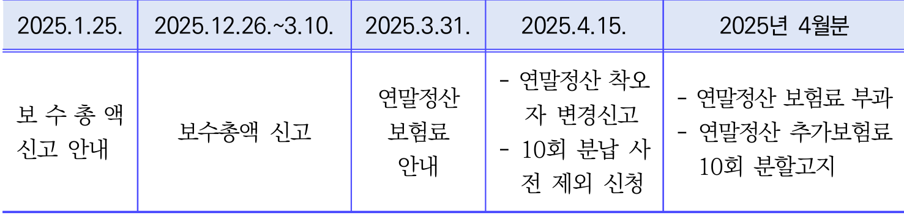

```markdown
| 날짜                  | 내용                                                                 |
|-----------------------|------------------------------------------------------------
<<SPLIT>>
             |
|-----------------------|----------------------------------------------------------------------|
| 2025.1.25.            | 보 수 총 액 신고 안내                                                |
| 2025.12.26.~3.10.     | 보수총액 신고                                                       |
| 2025.3.31.            | 연말정산 보험료 안내                                                |
| 2025.4.15.            | - 연말정산 착오자 변경신고<br>- 10회 분납 사전 제의 신청            |
| 2025년 4월분          | - 연말정산 보험료 부과<br>- 연말정산
<<SPLIT>>
  | - 연말정산 착오자 변경신고<br>- 10회 분납 사전 제의 신청            |
| 2025년 4월분          | - 연말정산 보험료 부과<br>- 연말정산 추가보험료 10회 분할고지       |
```

④ 연말정산 보험료 10회 분할납부 적용
4월 연말정산 추가보험료는 별도의 신청 없이 10회 분할고지 되며, 사전에 '정산보험
료 일시납 신청' 또는 '10회 분할 적용제외 신청'한 사업장은 일시납으로 고지된다.
⑤ 보수의 범위
근로를 제공하고 받은 봉급, 급료, 보수, 세비, 임금, 상여수당, 그밖에 이와 유사한
성질의 금품이며 소득세법 제12조 제3호에 따른 비과세 근로소득(식대, 자가운전보
조금, 보육수당 등)은 제외한다.
단, 소득세법 제12조 제3호 차목, 파목 및 거목에 따라 비과세 되는 소득은 보수에
포함한다.
제
1
장
근로소득
연말정산(이론편)
제2장
근로소득
연말정산(실전편)
제3장
연말정산
세액의
계산
제4장
근로소득자의
연말정산
후
4
<<SPLIT>>
 따라 비과세 되는 소득은 보수에
포함한다.
제
1
장
근로소득
연말정산(이론편)
제2장
근로소득
연말정산(실전편)
제3장
연말정산
세액의
계산
제4장
근로소득자의
연말정산
후
4대보험
정산
217
「소득세법」 제12조 제3호 차목 · 파목 · 거목
차. 외국정부(외국의 지방자치단체와 연방국가인 외국의 지방정부를 포함한다. 이하 같다) 또는
대통령령으로 정하는 국제기관에서 근무하는 사람으로서 대통령령으로 정하는 사람이 받
는 급여. 다만, 그 외국정부가 그 나라에서 근무하는 우리나라 공무원의 급여에 대하여 소
득세를 과세하지 아니하는 경우만 해당한다.
파. 작전임무를 수행하기 위하여 외국에 주둔 중인 군인 · 군무원이 받는 급여
거. 국외 또는 「남북교류협력에 관한 법률」에 따른 북한지역에서 근로를 제공하고 받는 대통령
령으로 정하는 급여
(3) 개인사업장 사용자 건강, 장기요양보험료 연말정산
① 신고대상
개입사업장 사용자
② 신고기한 및 적용시기
- 개인사업장 사용자 : 다음해 5
<<SPLIT>>
 받는 대통령
령으로 정하는 급여
(3) 개인사업장 사용자 건강, 장기요양보험료 연말정산
① 신고대상
개입사업장 사용자
② 신고기한 및 적용시기
- 개인사업장 사용자 : 다음해 5월 31일까지 신고할 경우 6월분부터 정산금액이
반영된다.
- 개인사업장 사용자(성실신고 사용자) : 다음해 6월 30일가지 신고할 경우 7월분
부터 정산금액이 반영된다.
③ 건강보험 연말정산 일정
(업무진행 상황에 따라 일정이 조정될 수 있으니 공단 홈페이지에서 일정을 확인해
야 한다.)
|  | 보수총액 통보서 발송 | 보수총액 신고 | 분할납부 신청 | 연말정산 보험료 부과 |
| --- | --- | --- | --- | --- |
| 일반 | 24.5.8. | 25.5.31. | 25.6.18.~25.7.10. | 2025년 6월분 |
| 성실 | 24.5.8. | 25.6.30. | 25.7.16.~25.8.12. | 2024년 7월분 |
 이전
까지 신청하여야 청구금액 변경 가능하다.
⑤ 보수의 범위
해당 사업장에서 발생한 사업소득(부동산 임대소득 포함)으로 25년 5월 31일까지
국세청(세무서)에 신고한 소득을 대상으로 한다. (성실신고사업장은 2025년 6월 30
일까지 국세청(세무서)에 신고한 소득을 대상으로 한다.)
사업소득이 0원 이하(-)인 경우 증빙서류('소득금액 증명'과 '과세표준 확정신고 및
납부계산서')를 반드시 제출해야 한다. '소득금액증명'은 7월 1일부터 발급 가능하므
로 발급 이후로 신고할 수 있다.
(4) 고용, 산재보험 연말정산
근로자의 월평균보수를 기
<<SPLIT>>
및
납부계산서')를 반드시 제출해야 한다. '소득금액증명'은 7월 1일부터 발급 가능하므
로 발급 이후로 신고할 수 있다.
(4) 고용, 산재보험 연말정산
근로자의 월평균보수를 기준으로 납부한 2024년 보험료를 실제 지급한 보수총액으로
신고하여 보험료를 정산하여 다음해 4월분부터 납부할 보험료에 충당하거나 추가납부
하는 절차이다.
① 신고 대상
모든 근로자(일용근로자 포함). 단, 다음의 대상은 경우에 따라 신고 여부를 달리하
니 주의해야 한다.
| 신고 대상 | 신고 여부 | 비고 |
| --- | --- | --- |
| 대표자(대표자의 배우자) | X | 대표자의 배우자가 근로자로 인정되어 취득된 경우 신고대상 |
| 전근근로자, 해외파견근로자 | O | 전근 근로자는 전근 전 사업장과 후 사업장의 보수를 구분하여 전근 전 · 후 사업장으로 각각 신고 |
| 휴직근로자 | O | 휴업 · 휴직 및 출산전후휴가 또는 유산 · 사산휴가 중의 보수는 고용보험 보수총액에는 포함, 산
<<SPLIT>>
보수를 구분하여 전근 전 · 후 사업장으로 각각 신고 |
| 휴직근로자 | O | 휴업 · 휴직 및 출산전후휴가 또는 유산 · 사산휴가 중의 보수는 고용보험 보수총액에는 포함, 산재보험 보수총액에는 제외 |
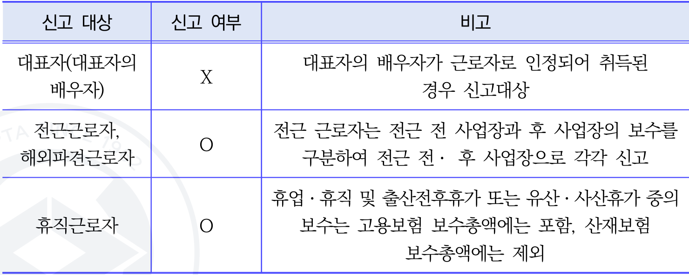

```markdown
| 신고 대상                     | 신고 여부 | 비고                                                                                   |
|------------------------------|----------|--------------------------------------------------------------------------------------|
| 대표자(대표자의 배우자)       | X        | 대표자의 배우자가 근로자로 인정되어 취득된 경우 신고대상     
<<SPLIT>>
---------------------------|
| 대표자(대표자의 배우자)       | X        | 대표자의 배우자가 근로자로 인정되어 취득된 경우 신고대상                              |
| 전근근로자, 해외파견근로자    | O        | 전근 근로자는 전근 전 사업장과 후 사업장의 보수를 구분하여 전근 전·후 사업장으로 각각 신고 |
| 휴직근로자                    | O        | 휴업·휴직 및 출산전후휴가 또는 유산·사산휴가 중의 보수는 고용보험 보수총액에는 포함, 산재보험 보수총액에는 제외 |
```

제
1
장
근로소득
연말정산(이론편)
제2장
근로소득
연말정산(실전편)
제3장
연말정산
세액의
계산
제4장
근로소득자의
연말정산
후
4대보험
정산
219
| 15일까지 자진신고사업장(건설업, 벌목업) : 매년 3월말 정산보험료 일시납 및 과납보험료 반환 신청 | ② 신고기한 및 적용시기 부과고지 사업장 : 매년
<<SPLIT>>
4대보험
정산
219
| 15일까지 자진신고사업장(건설업, 벌목업) : 매년 3월말 정산보험료 일시납 및 과납보험료 반환 신청 | ② 신고기한 및 적용시기 부과고지 사업장 : 매년 3월 |
| --- | --- |
|  | ③ 일시납 신청 : 정산보험료가 4월분 월별보험료보다 큰 경우에는 2등분하여 4월과 5월 월별보험료에 각각 합산하여 분할고지되며, 분납이 아닌 일시납을 원하는 경우 일시납 신청에 체크하여 보수총액신고서를 작성하여야 한다. 과납보험료 반환 신청 : 정산 결과 발생한 과납보험료를 앞으로 낼 보험료에 충당을 원하는 경우 선납충당에 체크하고 반환월 원하는 경우는 반환계좌를 기재하여 보수 총액신고서를 작성하여야 한다. ④ 보수의 범위 근로를 제공하고 받은 봉급, 급료, 보수, 세비, 임금, 상여수당, 그밖에 이와 유사 한 성질의 금품이며 소득세법 제12조 제3호에 따른 비과세 근로소득(식대, 자가운전 보조금, 보육수당 등)은 제외한다. 단, 조세특례제한법에 의거한 비과세소
<<SPLIT>>
당, 그밖에 이와 유사 한 성질의 금품이며 소득세법 제12조 제3호에 따른 비과세 근로소득(식대, 자가운전 보조금, 보육수당 등)은 제외한다. 단, 조세특례제한법에 의거한 비과세소득(주식매수선택권 비과세, 우리사주조합인출금 비과세)은 국민연금법상 소득에 포함한다. ⑤ 고용 · 산재보험 보수총액 미신고 시 불이익 안내 미신고 시 월평균보수를 확정할 수 없어 고용보험 사회보험료 지원이 제한된다. 특 히, 사회보험료 지원은 보수총액 신고기한이 지나서 제출하는 경우 신고한 날이 속 한 달부터 지원되기 때문에 주의하여야 한다. (보수총액 미신고 사업장은 과태료(최 대 300만원)이 부과) |
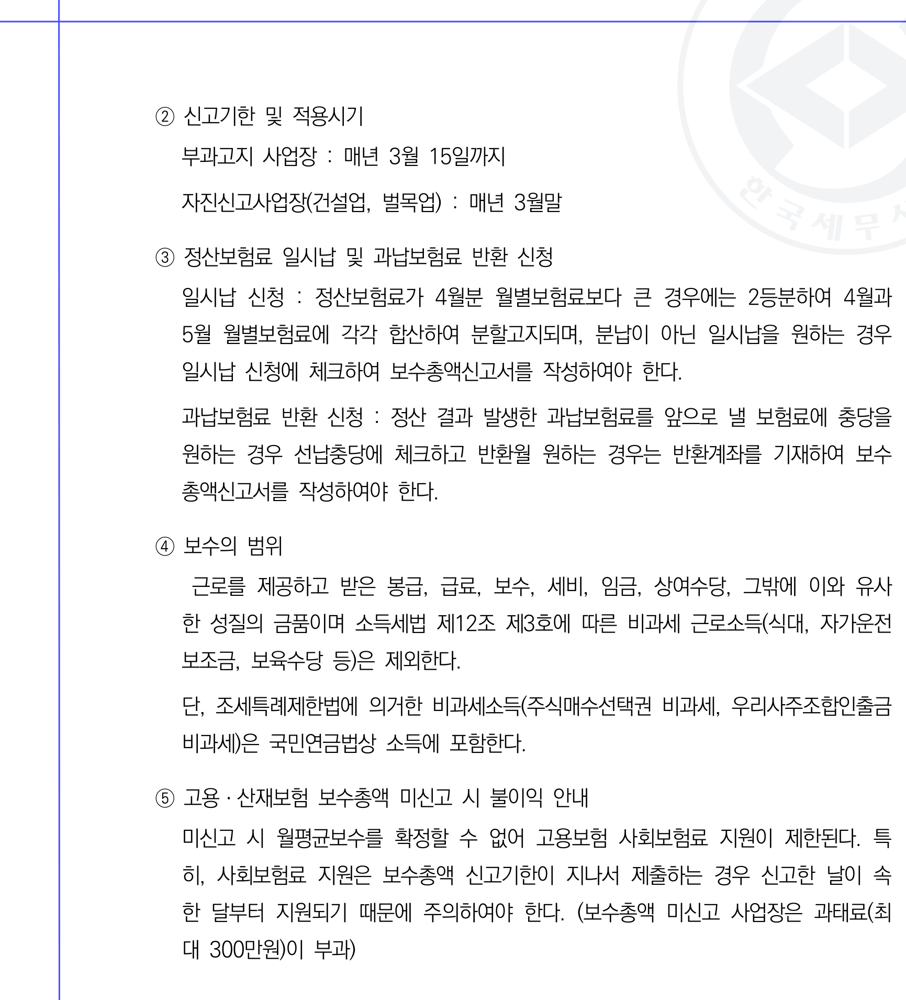

1. **신고기한 및 적용시기**
   - 부과고지 사업장: 매년 3월 15일까지
   - 자진신고사업장(건설업, 벌목업): 매년 3월말

2. **정산보험료 일시납 및 과납보험료 반환 신청**
   - 일시납 신청: 정산보
<<SPLIT>>
과고지 사업장: 매년 3월 15일까지
   - 자진신고사업장(건설업, 벌목업): 매년 3월말

2. **정산보험료 일시납 및 과납보험료 반환 신청**
   - 일시납 신청: 정산보험료가 4월분 월별보험료보다 큰 경우에는 2등분하여 4월과 5월 월별보험료에 각각 합산하여 분할고지되며, 분납이 아닌 일시납을 원하는 경우 일시납 신청에 체크하여 보수총액신고서를 작성하여야 한다.
   - 과납보험료 반환 신청: 정산 결과 발생한 과납보험료를 앞으로 낼 보험료에 충당을 원하는 경우 산납총당에 체크하고 반환월 원하는 경우는 반환계좌를 기재하여 보수총액신고서를 작성하여야 한다.

3. **보수의 범위**
   - 근로를 제공하고 받은 봉급, 급료, 보수, 세비, 임금, 상여수당, 그밖에 이와 유사한 성질의 급품이며 소득세법 제12조 제3호에 따른 비과세 근로소득(식대, 자가운전 보조금, 보육수당 등)은 제외한다.
   - 단, 조세특례제한법에 의거한 비과세소득(주식매수선택권 비과세, 우리사주조합
<<SPLIT>>
세법 제12조 제3호에 따른 비과세 근로소득(식대, 자가운전 보조금, 보육수당 등)은 제외한다.
   - 단, 조세특례제한법에 의거한 비과세소득(주식매수선택권 비과세, 우리사주조합인출금 비과세)은 국민연금법상 소득에 포함한다.

4. **고용·산재보험 보수총액 미신고 시 불이익 안내**
   - 미신고 시 월평균보수를 확정할 수 없어 고용보험 사회보험료 지원이 제한된다. 특히, 사회보험료 지원은 보수총액 신고기한이 지나서 제출하는 경우 신고한 날이 속한 달부터 지원되기 때문에 주의하여야 한다. (보수총액 미신고 사업장은 과태료(최대 300만원)이 부과)

연말정산
세무
220
196
제4장 근로소득자의 연말정산 후 4대보험 정산
| 종류 | 신고대상 | 신고기한 | 정산시기 |
| --- | --- | --- | --- |
| 국민연금 | 근로자, 사용자 | 5.31. |  |
| 건강보험 | 근로자, 사용자 | 근로자 : 3.10. 사용자 : 5.31. 성실신고 사용자 : 6.30
<<SPLIT>>
- | --- |
| 국민연금 | 근로자, 사용자 | 5.31. |  |
| 건강보험 | 근로자, 사용자 | 근로자 : 3.10. 사용자 : 5.31. 성실신고 사용자 : 6.30. | 근로자 : 4월분 사용자 : 6월분 성실신고사용자 : 7월분 |
| 고용 · 산재보험 | 근로자(일용근로자포함) | 3.15. | 4월분 |
**연말정산 후 4대보험 정산 요약**
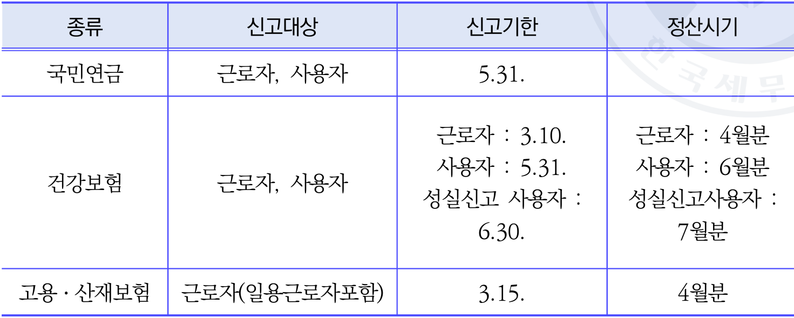

```markdown
| 종류         | 신고대상                  | 신고기한                                      | 정산시기                              |
|------------|-----------------------|-------------------------------------------|-----------------------------------|

<<SPLIT>>
------------------|-------------------------------------------|-----------------------------------|
| 국민연금      | 근로자, 사용자             | 5.31.                                     | 근로자, 사용자: 5.31.                  |
| 건강보험      | 근로자, 사용자             | 근로자: 3.10.<br>사용자: 5.31.<br>성실신고 사용자: 6.30. | 근로자: 4월분<br>사용자: 6월분<br>성실신고 사용자: 7월분 |
| 고용·산재보험 | 근로자(일용근로자 포함)      | 3.15.                                     | 4월분                                |
```

4대보험료율 (2023년 기준)
| 구분 | 구분 | 건강보험 | 건강보험 
<<SPLIT>>
              | 4월분                                |
```

4대보험료율 (2023년 기준)
| 구분 | 구분 | 건강보험 | 건강보험 | 국민연금 | 고용보험 | 산재보험 |
| --- | --- | --- | --- | --- | --- | --- |
| 구분 | 구분 | 건강보험 | 장기요양보험 | 국민연금 | 고용보험 | 산재보험 |
| 보험료율 | 보험료율 | 7.09% | 0.9182% | 9% | 1.8% (업종별 상이) | 업종별 상이 |
| 부담금 | 사용자 | 3.545% | 0.4591% | 4.5% | 0.9% | 사용자 100%부담 |
| 부담금 | 근로자 | 3.545% | 0.4591% | 4.5% | 0.9% + a (업종별상이) | 사용자 100%부담 |
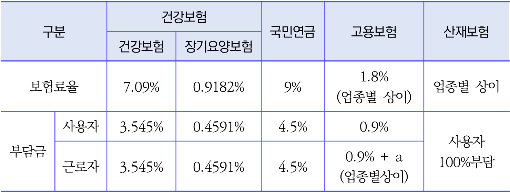

```markdown
| 구분   | 건강보험     | 건강보험     | 
<<SPLIT>>
용자 100%부담 |


```markdown
| 구분   | 건강보험     | 건강보험     | 국민연금 | 고용보험          | 산재보험     |
|--------|--------------|--------------|----------|-------------------|--------------|
|        | 건강보험     | 장기요양보험 |          |                   |              |
| 보험료율 | 7.09%        | 0.9182%      | 9%       | 1.8% (업종별 상이) | 업종별 상이  |
| 부담금  | 사용자      | 사용자      | 사용자   | 사용자           | 사용자      |
|        | 3.545%       | 0.4591%      | 4.5%     | 0.9%    
<<SPLIT>>
   | 사용자   | 사용자           | 사용자      |
|        | 3.545%       | 0.4591%      | 4.5%     | 0.9%             | 사용자      |
| 부담금  | 근로자      | 근로자      | 근로자   | 근로자           | 100%부담    |
|        | 3.545%       | 0.4591%      | 4.5%     | 0.9% + a (업종별상이) | 100%부담    |
```

제2장
근로소득
연말정산(실전편)
제3장
연말정산
세액의
계산
제
1장
근로소득
연말정산(이론편)
제4장
근로소득자의
연말정산
후
4대보험
정산
221
1962
연말정산 세무
와
| 발행일 : 2024년 11월 저 자 : 이석정 (e-mail: Isjcta1@hanmail.net) 감 수 신재현, 이원주, 김하나 | 저 자 협의하에 인지생략 |
| --- | --- |
| : 발행인 : 구 재 이
<<SPLIT>>
 이석정 (e-mail: Isjcta1@hanmail.net) 감 수 신재현, 이원주, 김하나 | 저 자 협의하에 인지생략 |
| --- | --- |
| : 발행인 : 구 재 이 | : 발행인 : 구 재 이 |
| 주 소 : 서울시 서초구 명달로 105(서초동) 등 록 : 1991.11.20. 제21-286호 | 주 소 : 서울시 서초구 명달로 105(서초동) 등 록 : 1991.11.20. 제21-286호 |
|  |  |
| 발행처 : 한국세무사회 | 발행처 : 한국세무사회 |
|  |  |
| TEL. 02-597-2941 FAX. 0508-118-1857 ISBN 979-11-5520-185-5 부가기호 93320 | TEL. 02-597-2941 FAX. 0508-118-1857 ISBN 979-11-5520-185-5 부가기호 93320 |
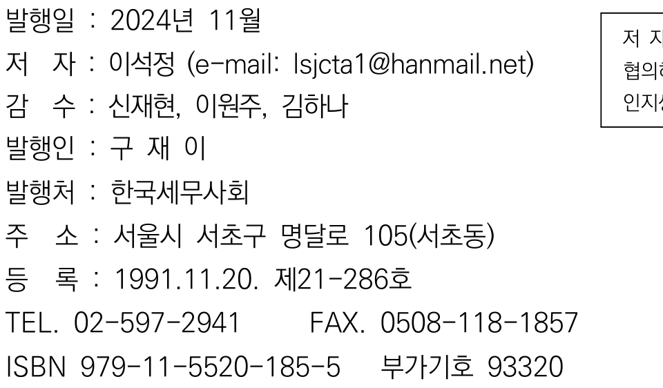

```
| 항목     | 내용           
<<SPLIT>>
11-5520-185-5 부가기호 93320 |


```
| 항목     | 내용                                      |
|--------|-----------------------------------------|
| 발행일   | 2024년 11월                               |
| 저자     | 이석정 (e-mail: lsjcta1@hanmail.net)       |
| 감수     | 신재현, 이원주, 김하나                        |
| 발행인   | 구 재 이                                  |
| 발행처   | 한국세무사회                                |
| 주소     | 서울시 서초구 명달로 105(서초동)               |
| 등록     | 199
<<SPLIT>>
세무사회                                |
| 주소     | 서울시 서초구 명달로 105(서초동)               |
| 등록     | 1991.11.20. 제21-286호                     |
| TEL.    | 02-597-2941                              |
| FAX.    | 0508-118-1857                            |
| ISBN    | 979-11-5520-185-5                        |
| 부가기호  | 93320                                    |
```

<이 책의 내용을 한국세무사회의 허락없이 무단복제 출판하는 것을 금합니다.>
본서는 항상 그 완전성이 보장되는 것은 아니기 때문에 실제 적용할 경우에는
충분히 검토하시고 저자 또는 전문가와 상의하시기 바랍니다.
정가 7,000원
<<SPLIT>>
합니다.>
본서는 항상 그 완전성이 보장되는 것은 아니기 때문에 실제 적용할 경우에는
충분히 검토하시고 저자 또는 전문가와 상의하시기 바랍니다.
정가 7,000원
<<SPLIT>>