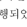

Smart Media Journal / Vol.14, No.2 / ISSN:2287-1322 202514 022 107

같이 모니터 기반 EF 여 다양한 통해 및 30 361. AES 국제 10-20 따

이 에 초 동안 뜨고 동안 감는 것을 두 번 be} Fp2 모든 다. 끝난 후, 모니터 기반 Ase Wes 기준 대한 사후 EMDR EEG 50Hz VR 기반 EMDR& 헤드 마운트 디스 의 주파수 Mbit 디지털 해상도 Sa)°])(HMD)S 사용한 EMDR 동일한 따른 고정밀 EEG 분석 WA og 뜨고 감은 V.S20, Panatos)-& 각각 두 후, AMD 세션

과 에 대한 EMDR 후 참가 AY brainwaves)= 생 숨겨진 뜨고 있는 동안에는 위해 및 키지 않고 안구 하도록 푸리에 MSFFT) 자극 였다. 이러한 ES 감 뜨는 ECGES 감은 상태) 정서적 미치는 뇌파 델타 움직이는 것이 - 4Hz), - 8812), - 12812), 줄이는 데 - 32812), 통 모든 연구 연구

독 하에 IRB 따라 HMD

사용 중 현기증 신체적 불편 cae rh Ae ot 0

을 겪는 위해 휴식 제

00 UMM lH AYNEN

Alpha eo me \N\ [YI Powe Theta ato) rial Tired

Delta (05-1) oo 1 sleep

그림 4. 뇌파 왼쪽 밴드

하기 filtering)

이 와 48Hz 120% 이상의 기간

나. EEG 측정 및 분석 또한,

의 절대

뇌파 Oculus Quest-2 VR (uV) 각 상대

전 했기 때문에 특정 전체 Neuro harmony

두 여 통해

이 다. 측정 가지는 잘 알려진 Grass 이전 따르면 우울증 환자

는 때 좌우 오른쪽 활

스 에서 보 유의미한 보이며, 오른쪽 전두엽

108

~ ol o% Je, a N i 13

만

보이는 것으로 알려 져 이에 따라 의한 정신적 각성 이완 시 더 많이 주로

은 깊은 이완 나타나며, 창

면 적인 깊은 주로 재 요한 FBZ 구는 VRS 사용한 EMDR 방법 전두엽 동 감 측 하였다. 우울증 감 을 위해, 기존 모니터 기 및 헤드 ate = EMDR

활

+y 12 9g

oo = r2 oly

rr

tt

를 =

Ray ru nilo bi

te 5

소

오 ar

、 |" + | 5

re 내

‘for of & Ole oN

o& uz,

2 분

o 2 rir

a 기

\. 1. 측정

신뢰도 검증

온라인 통해 선 우울 한국판 FEA E(K-CES-D)S 총 있으며 우울 점수 woe, / 4

Smart Media Journal / Vol.14, No.2 / ISSN:2287-1322

(대학교 승인 받았다.

2. EMDR 측정 데이터 분석

측 EMDR 실험 2D 비디 오를 보거나 HMDS 사용해 31) 가상 현실 비디 오를 보면서 같이 뇌파 스펙

뇌파 분석

는

운

같

점 점 우울증 수가 것을 한다. 약간 우울, 경미한 우울, Wa] WAS 중등도 우울,

7 6 A BAAS 심각한 본 WA 기록한 HS 보

이는 본 K-CES-De] Cronbach's a = .712 인구 여성 평균 = 본

4 |

그림 5. 실험 대한 모니터 및 VR(HMD) EEG 30 스펙트럼 비교
