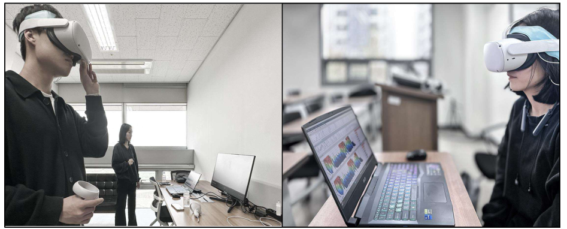

<<BLOCKEND>>
Smart Media Journal / Vol.14, No.2 / ISSN:2287-1322
metadata:{
  "file_name": "250313-10-45_모니터6~7p.html",
  "file_type": ".html",
  "html_path": "upstage_document_parse/temp\\250313-10-45_모니터6~7p\\250313-10-45_모니터6~7p.html",
  "page": "1",
  "elementId": "0"
}
<<BLOCKEND>>

<<BLOCKEND>>
2025년 02월 스마트미디어저널 107
metadata:{
  "file_name": "250313-10-45_모니터6~7p.html",
  "file_type": ".html",
  "html_path": "upstage_document_parse/temp\\250313-10-45_모니터6~7p\\250313-10-45_모니터6~7p.html",
  "page": "1",
  "elementId": "1"
}
<<BLOCKEND>>

<<BLOCKEND>>
같이 참가자들은 모니터 기반 안구운동 둔감화
및 재처리(EMDR) 세션을 시작했으며, 눈을 30
초 동안 뜨고 30초 동안 감는 것을 두 번 반복했
다. 이 과정이 끝난 후, 참가자들은 모니터 기반
세션에 대한 사후 EMDR 설문조사를 완료하고
VR 기반 EMDR을 준비했다. 헤드 마운트 디스
플레이(HMD)를 사용한 EMDR 세션은 동일한
방식으로 진행되었으며, 눈을 뜨고 감은 상태로
각각 30초씩 두 사이클을 수행한 후, HMD 세션
에 대한 EMDR 후 설문조사가 진행되었다. 참가
자들이 눈을 뜨고 있는 동안에는 시선을 고정시
키지 않고 안구 움직임을 최소화하도록 지시하
였다. 이러한 방식은 눈을 감거나 뜨는 방식이
기억의 생생함과 정서적 반응에 미치는 영향을
분석하며, 눈을 움직이는 것이 기억의 생생함과
정서성을 줄이는 데 효과적이기 때문이다[33].
모든 연구 절차는 주연구자와 연구 보조원의 감
독 하에 진행되었으며, IRB 기준에 따라 HMD
사용 중 어지러움이나 현기증 등의 신체적 불편
을 겪는 참가자들을 위해 별도의 휴식 공간이 제
공되었다.
metadata:{
  "file_name": "250313-10-45_모니터6~7p.html",
  "file_type": ".html",
  "html_path": "upstage_document_parse/temp\\250313-10-45_모니터6~7p\\250313-10-45_모니터6~7p.html",
  "page": "1",
  "elementId": "2"
}
<<BLOCKEND>>

<<BLOCKEND>>

metadata:{
  "file_name": "250313-10-45_모니터6~7p.html",
  "file_type": ".html",
  "html_path": "upstage_document_parse/temp\\250313-10-45_모니터6~7p\\250313-10-45_모니터6~7p.html",
  "page": "1",
  "elementId": "3"
}
<<BLOCKEND>>

<<BLOCKEND>>
그림 3. 실험 환경 및 실험 참가자의 VR 체험
metadata:{
  "file_name": "250313-10-45_모니터6~7p.html",
  "file_type": ".html",
  "html_path": "upstage_document_parse/temp\\250313-10-45_모니터6~7p\\250313-10-45_모니터6~7p.html",
  "page": "1",
  "elementId": "4"
}
<<BLOCKEND>>

<<BLOCKEND>>
나. EEG 측정 및 분석
metadata:{
  "file_name": "250313-10-45_모니터6~7p.html",
  "file_type": ".html",
  "html_path": "upstage_document_parse/temp\\250313-10-45_모니터6~7p\\250313-10-45_모니터6~7p.html",
  "page": "1",
  "elementId": "5"
}
<<BLOCKEND>>

<<BLOCKEND>>
뇌파 측정은 Oculus Quest-2 VR 장치로 측두
엽, 두정엽, 후두엽을 포함해야 했기 때문에
Neuro harmony 장치(파나토스, 한국)를 사용하
여 두 채널을 통해 전두엽에 한정하여 이루어졌
다. 이 측정 장치는 잘 알려진 Grass System(미
국)과 비교했을 때 좌우 알파파, 베타파, 세타파
에서 유의미한 상관관계(0.916, p<0.001)를 보
metadata:{
  "file_name": "250313-10-45_모니터6~7p.html",
  "file_type": ".html",
  "html_path": "upstage_document_parse/temp\\250313-10-45_모니터6~7p\\250313-10-45_모니터6~7p.html",
  "page": "1",
  "elementId": "6"
}
<<BLOCKEND>>

<<BLOCKEND>>
www.kci.go.kr
metadata:{
  "file_name": "250313-10-45_모니터6~7p.html",
  "file_type": ".html",
  "html_path": "upstage_document_parse/temp\\250313-10-45_모니터6~7p\\250313-10-45_모니터6~7p.html",
  "page": "1",
  "elementId": "7"
}
<<BLOCKEND>>

<<BLOCKEND>>
여 다양한 연구자들을 통해 신뢰성이 입증되었
다[34-36]. 전두엽 뇌파는 국제 10-20 시스템에
따라 Fp1과 Fp2 전극에서 기록되었으며, 모든
전극은 왼쪽 귓불을 기준 전극으로 사용했다.
EEG 장비는 뉴로하모니 S20을 사용하여 50Hz
의 주파수 영역을 측정하고 24bit 디지털 해상도
에 따른 고정밀 뇌파를 측정하였다. EEG 분석
프로그램(NeuroSpec V.S20, Panatos)을 사용해
분석했다.
metadata:{
  "file_name": "250313-10-45_모니터6~7p.html",
  "file_type": ".html",
  "html_path": "upstage_document_parse/temp\\250313-10-45_모니터6~7p\\250313-10-45_모니터6~7p.html",
  "page": "1",
  "elementId": "8"
}
<<BLOCKEND>>

<<BLOCKEND>>
생 뇌파(raw brainwaves)는 생 뇌파에 숨겨진
주파수의 특성을 식별하기 위해 2차원 및 3차원
푸리에 변환(FFT) 그래프로 변환되었다. 자극
블록은 EO(눈을 뜬 상태)와 EC(눈을 감은 상태)
블록으로 나누어졌다. 사용된 뇌파 범위는 델타
파(0.5 - 4Hz), 세타파(4 -8Hz), 알파파(8 - 12Hz),
베타파(12 -32Hz), 감마파(32Hz 이상)대역을 통
과 하도록 필터링하였다.
metadata:{
  "file_name": "250313-10-45_모니터6~7p.html",
  "file_type": ".html",
  "html_path": "upstage_document_parse/temp\\250313-10-45_모니터6~7p\\250313-10-45_모니터6~7p.html",
  "page": "1",
  "elementId": "9"
}
<<BLOCKEND>>

<<BLOCKEND>>

*Gamma (32Hz~) N Awareness
Beta(12~32Hz) Alertness
Alpha (8~12Hz) Relaxed
Theta (4~8Hz) Tired
Delta (0.5~4Hz) Sleep*
#### 그림 4. 뇌파 타입과 왼쪽 베타파 밴드
metadata:{
  "file_name": "250313-10-45_모니터6~7p.html",
  "file_type": ".html",
  "html_path": "upstage_document_parse/temp\\250313-10-45_모니터6~7p\\250313-10-45_모니터6~7p.html",
  "page": "1",
  "elementId": "10"
}
<<BLOCKEND>>

<<BLOCKEND>>
노이즈를 방지하기 위해(notch filtering)
48Hz 이하의 뇌파와 120초 이상의 기간 동안의
데이터를 분석 대상으로 선택하였다. 또한, 뇌파
의 절대 전력(크기) 값의 제곱근을 마이크로볼트
(uV) 단위로 계산하고, 각 뇌파의 상대 전력은
특정 지점에서의 전기력과 전체 영역에서의 전
기력의 비율로 정의하였다.
metadata:{
  "file_name": "250313-10-45_모니터6~7p.html",
  "file_type": ".html",
  "html_path": "upstage_document_parse/temp\\250313-10-45_모니터6~7p\\250313-10-45_모니터6~7p.html",
  "page": "1",
  "elementId": "12"
}
<<BLOCKEND>>

<<BLOCKEND>>
전두엽의 베타파는 스트레스에 노출되면 즉시
증가한다[36]. 이전 연구에 따르면 우울증 환자
는 오른쪽 전두엽에서 비정상적으로 증가된 활
동을 보이며, 오른쪽 전두엽 베타파의 증가가 스
metadata:{
  "file_name": "250313-10-45_모니터6~7p.html",
  "file_type": ".html",
  "html_path": "upstage_document_parse/temp\\250313-10-45_모니터6~7p\\250313-10-45_모니터6~7p.html",
  "page": "1",
  "elementId": "13"
}
<<BLOCKEND>>

<<BLOCKEND>>
108 2025년 02월 스마트미디어저널
metadata:{
  "file_name": "250313-10-45_모니터6~7p.html",
  "file_type": ".html",
  "html_path": "upstage_document_parse/temp\\250313-10-45_모니터6~7p\\250313-10-45_모니터6~7p.html",
  "page": "2",
  "elementId": "14"
}
<<BLOCKEND>>

<<BLOCKEND>>
Smart Media Journal / Vol.14, No.2 / ISSN:2287-1322
metadata:{
  "file_name": "250313-10-45_모니터6~7p.html",
  "file_type": ".html",
  "html_path": "upstage_document_parse/temp\\250313-10-45_모니터6~7p\\250313-10-45_모니터6~7p.html",
  "page": "2",
  "elementId": "15"
}
<<BLOCKEND>>

<<BLOCKEND>>
트레스와 우울 증상의 심각도뿐만 아니라 불안
과도 긍정적인 상관관계를 보이는 것으로 알려
져 있다[37]. 이에 따라 베타파는 자극에 의한
정신적 각성 상태에서 증가[36]하고, 알파파는
이완 시 더 많이 나타나며[38], 세타파는 주로
얕은 수면이나 깊은 이완 상태에서 나타나며, 창
의적인 사고와 관련이 있다[39]. 델타파는 깊은
수면 상태에서 주로 발생하며, 신체의 회복과 재
생에 중요한 역할을 한다[40].
metadata:{
  "file_name": "250313-10-45_모니터6~7p.html",
  "file_type": ".html",
  "html_path": "upstage_document_parse/temp\\250313-10-45_모니터6~7p\\250313-10-45_모니터6~7p.html",
  "page": "2",
  "elementId": "16"
}
<<BLOCKEND>>

<<BLOCKEND>>
본 연구는 모니터와 VR을 사용한 EMDR 방법
에 따른 오른쪽 전두엽 베타파 활동의 감소를 측
정하는 것을 목적으로 하였다. 우울증 감소에 더
효과적인 방법을 확인하기 위해, 기존 모니터 기
반의 안구운동 둔감화 및 재처리(EMDR)와 헤드
마운트 디스플레이(HMD) 장치를 활용한 EMDR
간의 전두엽 베타파 활동을 측정하였다.
metadata:{
  "file_name": "250313-10-45_모니터6~7p.html",
  "file_type": ".html",
  "html_path": "upstage_document_parse/temp\\250313-10-45_모니터6~7p\\250313-10-45_모니터6~7p.html",
  "page": "2",
  "elementId": "17"
}
<<BLOCKEND>>

<<BLOCKEND>>
V. 연구결과
metadata:{
  "file_name": "250313-10-45_모니터6~7p.html",
  "file_type": ".html",
  "html_path": "upstage_document_parse/temp\\250313-10-45_모니터6~7p\\250313-10-45_모니터6~7p.html",
  "page": "2",
  "elementId": "18"
}
<<BLOCKEND>>

<<BLOCKEND>>
1. 측정 도구의 타당도와 신뢰도 검증
metadata:{
  "file_name": "250313-10-45_모니터6~7p.html",
  "file_type": ".html",
  "html_path": "upstage_document_parse/temp\\250313-10-45_모니터6~7p\\250313-10-45_모니터6~7p.html",
  "page": "2",
  "elementId": "19"
}
<<BLOCKEND>>

<<BLOCKEND>>
참가자들은 온라인 포스터를 통해 무작위로 선
정되었으며, 우울 수준은 한국판 역학연구센터
우울척도(K-CES-D)를 사용하여 평가되었다.
총 20개 문항으로 구성되어 있으며 우울 점수는
0점 '극히 드물게'에서 3점 '거의 대부분'으로, 4
점 리커트척도(Likert)를 이용하였다. 우울증 점
수가 높을수록 우울증이 심각하다는 것을 의미
한다. 0에서 13점은 약간 우울, 14에서 19점은
경미한 우울, 20에서 28점은 중등도 우울, 29에
서 63점까지를 심각한 우울로 분류하였다[41].
본 연구는 20점 이상을 기록한 우울 증상을 보
이는 16명을 중심으로 진행되었다.
metadata:{
  "file_name": "250313-10-45_모니터6~7p.html",
  "file_type": ".html",
  "html_path": "upstage_document_parse/temp\\250313-10-45_모니터6~7p\\250313-10-45_모니터6~7p.html",
  "page": "2",
  "elementId": "20"
}
<<BLOCKEND>>

<<BLOCKEND>>
본 연구에서 K-CES-D의 신뢰도는
Cronbach's a = .71로 측정되었다.
metadata:{
  "file_name": "250313-10-45_모니터6~7p.html",
  "file_type": ".html",
  "html_path": "upstage_document_parse/temp\\250313-10-45_모니터6~7p\\250313-10-45_모니터6~7p.html",
  "page": "2",
  "elementId": "21"
}
<<BLOCKEND>>

<<BLOCKEND>>
참가자들의 인구 통계학적 특성은 여성 비율이
81.3%로 남성(18.8%)보다 우세하였으며, 평균
연령은 24.31세(SD = 2.30)였습니다. 본 연구는
metadata:{
  "file_name": "250313-10-45_모니터6~7p.html",
  "file_type": ".html",
  "html_path": "upstage_document_parse/temp\\250313-10-45_모니터6~7p\\250313-10-45_모니터6~7p.html",
  "page": "2",
  "elementId": "22"
}
<<BLOCKEND>>

<<BLOCKEND>>
C대학교 기관생명윤리심의위원회(IRB)의 승인
(1044396-202303-HR-043-01)을 받았다.
metadata:{
  "file_name": "250313-10-45_모니터6~7p.html",
  "file_type": ".html",
  "html_path": "upstage_document_parse/temp\\250313-10-45_모니터6~7p\\250313-10-45_모니터6~7p.html",
  "page": "2",
  "elementId": "23"
}
<<BLOCKEND>>

<<BLOCKEND>>
2. EMDR 측정 데이터 분석
metadata:{
  "file_name": "250313-10-45_모니터6~7p.html",
  "file_type": ".html",
  "html_path": "upstage_document_parse/temp\\250313-10-45_모니터6~7p\\250313-10-45_모니터6~7p.html",
  "page": "2",
  "elementId": "24"
}
<<BLOCKEND>>

<<BLOCKEND>>
EMDR 실험 참가자들은 모니터에서 2D 비디
오를 보거나 HMD를 사용해 3D 가상 현실 비디
오를 보면서 <그림 5>와 같이 뇌파 활동이 스펙
트럼이 측정되었다. 뇌파 분석 결과는 <표 1>과
같다.
metadata:{
  "file_name": "250313-10-45_모니터6~7p.html",
  "file_type": ".html",
  "html_path": "upstage_document_parse/temp\\250313-10-45_모니터6~7p\\250313-10-45_모니터6~7p.html",
  "page": "2",
  "elementId": "25"
}
<<BLOCKEND>>

<<BLOCKEND>>

*No.
2
3
5
12
13
14
15
16*
#### 그림 5. 16명의 실험 참가자에 대한 모니터 및 VR(HMD)
EEG 측정의 3D 스펙트럼 비교
metadata:{
  "file_name": "250313-10-45_모니터6~7p.html",
  "file_type": ".html",
  "html_path": "upstage_document_parse/temp\\250313-10-45_모니터6~7p\\250313-10-45_모니터6~7p.html",
  "page": "2",
  "elementId": "26"
}
<<BLOCKEND>>

<<BLOCKEND>>
ww.kci.go.kr
metadata:{
  "file_name": "250313-10-45_모니터6~7p.html",
  "file_type": ".html",
  "html_path": "upstage_document_parse/temp\\250313-10-45_모니터6~7p\\250313-10-45_모니터6~7p.html",
  "page": "2",
  "elementId": "28"
}
<<BLOCKEND>>