### Element 1

목 차

### Element 2
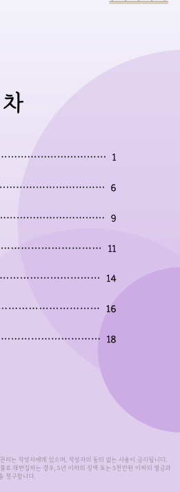

| ——— —— — — 0000 , — . ,

### Element 3
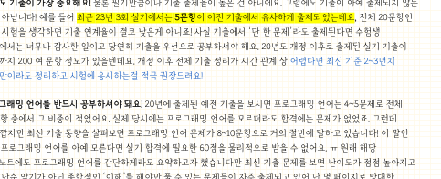

먼저 필기 ents 이제 앞두고 이 lanl 드리려 해

### Element 4
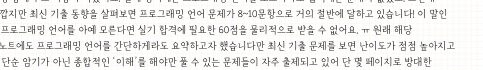

처음 x 봐요!

### Element 5
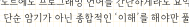

꼭 참

### Element 6
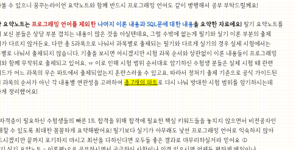

1. A= 가장 SE 기출 SAL] 높은 건 아니에요. 그럼에도 아예 않는 것도 들어 최근 이전 전체 실기 기출 AAS] 결코 아니죠! 사실 한 수험생 너무나 당연히 해요. 개정 실기 200 여 문항 개정 이후 전체 기출 시간 관계 상 최신 기준 적극

### Element 7

pS "8 fu lu 고 of re 2 때 뚜 = oH

### Element 8

돼요! 예전 보시면 프로그 fe 전체 서 그 실제 프로그래밍 없었죠. 그런데 ㅣ

### Element 9

NO co} Ao ot oN 호

### Element 10
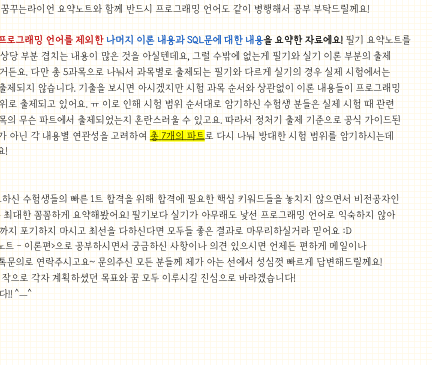

이 안타깝지만 최신 기출 살펴보면 프로그래밍 언어 거의 ae 달하고 있습니다! 말인 프로그래밍 아예 실기 필요한 받을 수 없어요. ㅠ 원래 해당

### Element 11
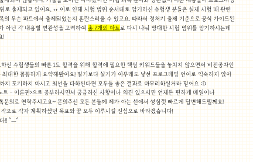

단 프로그래밍 했습니다만 최신 기출 보면 점점 높아지고 있고 단순 아닌 해야만 풀 수 있는 자주 있어 몇 방대한

### Element 12

aes cL ELIANA ERA] 2122S 2471 위해 현업 개발자 Aa, 별도 무료 샘플 제공

### Element 13

프로그래밍 언어 관련 키워드 이론 한: ;

### Element 14

A 있으니 QL ES]

### Element 15
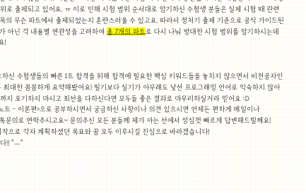

도 한 터 실제 기출 상세 쉽게 x}

### Element 16

같이 공부

### Element 17

3. 해당 프로그래밍 제외한 나머지 이론 대한 필기

### Element 18
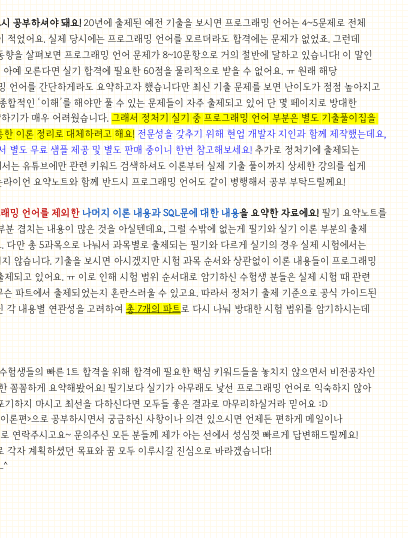

요 뜨는 저 보신 상당 4 치는 많은 것을 그럴 수밖에 없는게 실기 이론 출제 개

### Element 19

UA 다르게 경우 실제

### Element 20
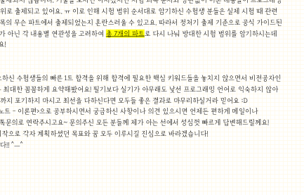

각 와 습니다. 보시면 아시겠지만 시험 과목 이론 프로그래밍 함께 있어요. ㅠ 이로 인해 시험 범위 수험생 실제 시험 때 관련 어느 무슨 수 있고요. 따라서 출제 공식 아닌 AWS 총 다시 나뉘 방대한 시험 편하게

### Element 21

ee 다르지 다만 총

### Element 22

먼

### Element 23

범위

### Element 24

않 언어

### Element 25

꿈 - 의견 있으시면 언제든 편하게 스토어 모든 분들께 제가 아는 성심껏 빠르게 그럼 YAS 각자 모두 합격 미리 ^…^

### Element 26

@ 소프트웨어 생명 주기 (Software Development Life Cycle, SDLC)

### Element 27
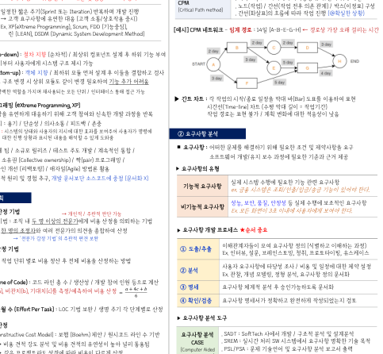

계획 BOLT 분석 DH OFA PH O78 * OHIAE DH OFA) 보수 폭포수 | AB 순차적 개발 / 고전적, 전통적 개발 모형 / Step-by-Step need 파악 위해 / 통해 최종 결과 예측 ㅣ 중심 / 변경 go 나선형 폭포수 + + 위험 분석 기능 추가 [위험 at 점진적 개발 과정 반복 과정 we x 별 * 계획 수립 > 위험 분석 ㅡ 개발 및 검증 ㅡ 고객 평가 일정한 짧은 471 (Sprint 또는 Iteration) 개발 진행 애자일 ㅡ 고객 유연한 대응 (고객 중시) (Agile) Ex. XP(eXtreme Programming), Scrum, FDD 린 (LEAN), DSDM (Dynamic Systern Development Method) 설계 (Top-down): 상위 컴포넌트 설계 후 하위 기능 부여

### Element 28
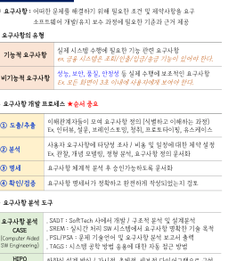

최 지향 순차적) |

### Element 29

개발 일정 산정

### Element 30

/ - WBS (Work Breakdown Structure): Z2AJE 목표 위한 세분화 + 전체 분할 수행 업무 식별, 일정 및 비용

### Element 31

> 네트워크 차트 PERT 프로젝트 작업 표현 000997.64049807 | 구성 상황) and Review Technique) ㅣ — 각 기재

### Element 32
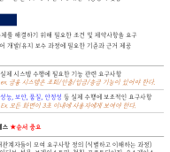

/ / . . 미국 2400 위해 개발 대비 sth met 전후 의존 관계] 구성 (Coical Pathmethed) | ' 파라 작업 진행 상황]

### Element 33

(@ 고 시 이 보수 호 / / / / . / / 한 ㅡ 테스트 시스템 구조 제시 가능 상향식 설계 (Bottom-up) : 객체 지향 / 최하위 BS 먼저 설계 후 이들을 검사 ㅡ 인터페이스 구조 변경 상위 같이 변경 기능 추가 어려움 * Component : 명백한 가지며 모든 단위 / 인터페이스 통해 접근 가능 D> 간트 차트 : 각 / YAS 막대 표현 ※ 익스트림 프로그래밍 (eXtreme Programming, XP) A|2PA(Time-line) 차트 (수평 막대 길이 = - 위해 고객 신속한 개발 반복 작업 ASL 표현 불가 / 계획 대한 낮음 - 핵심 가치 : 용기 / 단순성 / / 피드백 / 존중 ※ 피드백 : 대한 명 대한 진행 표시된 내 수 있게 매너 - 기본 원리 : 전체 팀 / 소규모 릴리즈 / 테스트 주도 개발 / 통합 / 어떠한 위해 필요한 조건 및 요구 }, a a] 공동 소유권 (Collective ownership) | 프로그래밍 / 소프트웨어 / 필요한 근거 제공 디자인 개선 (리팩토링) / 방법론 활용 > 유형 상식적 원리 및 경험 추구, 개발 중점 (문서화 >) 실제 시스템 수 필요한 기능 관련 기능적 ㅣ, 28 AWS 25//218/ 23/22 7150) 한마 계획 > 비용 산정 기법 > 개인적 / 주관적 판단 가능 Ex BE SPH] BR 94409 of oF 한다 인적 / 주관적 판단 가능 - 전문가 감정 기법 : 조직 두 이상의 전 비용 기법 - 기법 : 명의 여러 산정 > 개발 프로세스 * 중요 ㅡ 감정 주관적 편견 보완 모여 정의 과정) > 상향식 비용 산정 기법 @ Ex. 인터뷰, 설문, 청취, - 프로젝트 세부 작업 단위 별로 비용 정산 후 전체 방법 보셔 사용자 타당성 조사 비용 및 대한 제약 설정 [종류] (분석 Ex, 관찰, 개념 모델링, 정형 분석, 정의 문서화 . (Source Line of Code): 코드 라인 총 수 생산성 개발 참여 인원 계산 그사이 we BAS Dus > Stale), 비용 。 0. 체계적 분석 후 serie sts 문서화 ㅣ 검토 . 개발 단계별 수 (Effort Per Task) : LOC 기법 보완 생명 주기 각 산정 > 분석 도구 > 수학적 비용 산정 @ COCOMO (Constructive Cost Model) : 22) (Boehm) 제안 라인 기반 | SADT: SoftTech Aol] 개발 구조적 분석 및 분석 ㅡ 비용 견적 강도 분석 및 비용 높아 널리 ERs} CASE . 9060: 실시간 처리 SW 명확한 기술 목적 ye meaeele Aa aaa (Computer Aided | PSL/PSA: 문제 및 분석 보고서 출력 ㅡ 같은 따라 다르게 산정 88 009068009) | TAGS: 시스템 공학 방법 대한 자동 접근 방법 지현 i ZAD 만 라이 3] ES ah und , 규모 SWE | 2}21(SOKDSI) 이하 HIPO 설계 방식 가시적, 총체적, 세부적 램 구성 _ - : , 세부: 유형 re 라인 (300KDSI) 트랜잭션 처리 시스템 pecs | 의존 관계 동시 표현 이해 쉽고 간단 내장형 [67660060 | 라인 (300KDSI) 이상의 Sw 관리 > 구조적 모델 @ PUTNAM: SW 사용될 이용한 비용 산정

### Element 34

Rayleigh Norden 노력 PETE 7 > SLIM: Rayleigh-Norden 곡선 | Putnam 모형 7

### Element 35
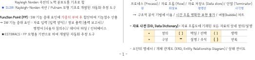

하여 / / / / @ Function Point (FP) : SW 기능 증대 가중치 부여 후 산출 SW 기능 증대 요인 : 자료 입력 (입력 양식] 정보 출력 (출력 보고서) 명령어 (사용자 데이터 파일 인터페이스 HW ESTIMACS : FP 자동화 추정 도구

### Element 36
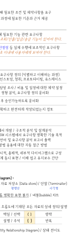

원 / / - 흐름도 (DPD, Data flow diagram) : 프로세스 [0700655) | 자료 3S (Flow) 자료 저장소 [2213 store) 단말 (Terminator) 화살표 평행선 사각형

### Element 37

/ / 분석 이용 시간 흐름 명확한 표현 불가 버

### Element 38

> 구조적 (bubble) 차트

### Element 39

자료 AVA (DD, Data Dictionary) : 자료 기재된 모든 상세

### Element 40

= | aa [ti] | () | ： 생략 + | 78 | | seas ty) 반복

### Element 41

/ / - 명세서 개체 (ERD, Entity Relationship Diagram) 상태

### Element 42
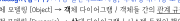

※ 분석 모델

### Element 43

미시적, 거시적 개발 모두 사용

### Element 44

J

### Element 45
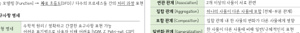

: . Jacobson (4]°] 84) Use caseS 사용 (사용자, 외부

### Element 46
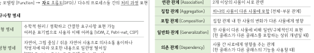

/ : . Coad-Yourdon E-R 다이어그램 사용 행위 모델링

### Element 47

. Wirfs-Brock: 설계 구분 없으며 고객 명세서 평가 후 설계 연

### Element 48
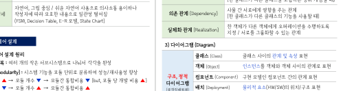

/ 가장 사용, SIS 구분 객체 모델링 (Object) + 객체 다이어그램 간의 관계

### Element 49
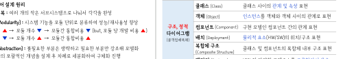

/ 동적 모델링 (Dynamic) > 상태 다이어그램 시스템 행위 기술

### Element 50
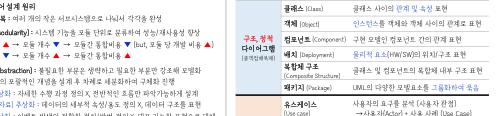

/ 기능 Z2Be] (Function) 자료 간의 처리 과정 표현

### Element 51
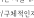

시스

### Element 52
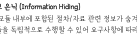

> 명세

### Element 53
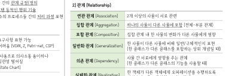

: ™ UML (Unified Modeling Language) 요소 : 사물, 관계, 다이어그램 - 간 원활한 위해 대표적 모델링 언어 - Rumbaugh, Booch, Jacobson 등 장점 통합 ※ 인터페이스 오퍼레이션 HES 모델

### Element 54

we

### Element 55

성명

### Element 56

=O,

### Element 57

: APS (Things) 2) 관계 (Relationship)

### Element 58
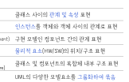

/ / / 요소] 행동 그룹 설명,

### Element 59

eu

### Element 60

연관 관계 (Association) | 27H 이상의 서로 관련

### Element 61
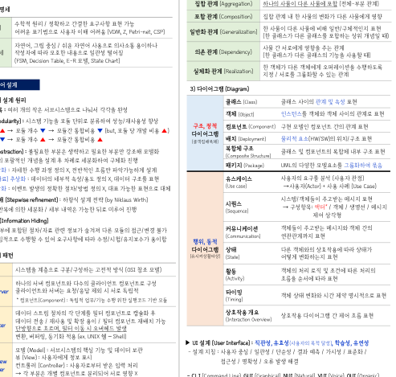

/ / 수학적 원리 간결한 표현 가능 정형 명세 | ae 사용자 이해 one (VDM, Z, Petri-net, CSP) 자연어, 그림 중심 쉬운 자연어 비정형 명세 | 따라 모호한 일관성 떨어짐 (Fsm, Decision Table, E-R 모델, State Chart)

### Element 62

ic

### Element 63
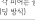

설계

### Element 64
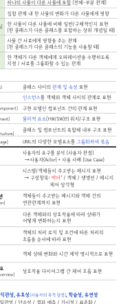

한 내 집합 BA (Aggregation) | 다른 포함 관계) 포함 관계 (Composition) | 집합 관계 다른 영향

### Element 65

한 일반화 관계 (Generalization) reel 다른 비해 인지 표현

### Element 66

, 한 (한 다른 상위 때} ABU BBS 주는 관계 의존 관계 Dependency) | (한 다른 BAAS 사용할 a 다른

### Element 67

실체화 관계 (Realization)

### Element 68
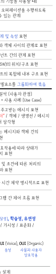

수 / 지정 있는 관계

### Element 69

3) 다이어그램 (Diagram)

### Element 70
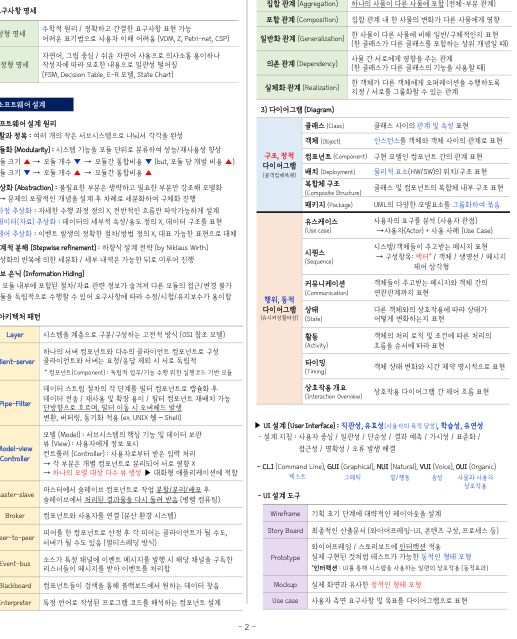

소 표 현 : / / / / / - / , 한 수 / 그 소프트웨어 설계 원리 클래스 (class) 클래스 관계 및 속성 표현 브 t eB | 너 1. 정복 : 여러 개의 작은 시 각 각 완성 객체 (06001 객체 표현 000042060: 시 모듈 / 향상 구현 A : 현 - 모듈 크기 A> SEV > SEEMS * (644 모듈 a) | doy eee Common) FB ECE 간의 관계 - 모듈 크기 V+ 모듈 개수 소 > BS | HAL Deployment) 물리적 / 표현 (Abstraction): 불필요한 필요한 강조해 모델화 RUA TS 글래스 및 Bea) 내부 구조 표현 mposite Structure ㅡ mee 설계 후 차례로 구체화 진행 으으으 한 묶음 © 과정 추상화: 자세한 수행 과정 정의 《 전반적인 설계 Hees eee @ 터 추상화 : 세부적 / 정의 × 데이터 표현 분석 (사용자 관점) @ 제어 추상화 : 이벤트 정확한 / 정의 × 대표 가능한 대체 (Use case) - + 사용 사례 (Use Case) 4, 단계적 분해 (Stepwise refinement) : 설계 전략 (by Niklaus Wirth) 시 / gf 시지 표현 - 의한 세분화 / 세부 가능한 뒤로 미루어 진행 (Sequence) > Hae 히다 객체 메시지 2 5. 정보 &4 (Information Hiding) —— - 한 모듈 된 관련 숨겨져 다른 불가 커뮤니케이션 객체 간의 - 있어 따라 용이함 행위, 동적 (Communication) 표현 다이어그램 Abe 다른 따라 아키텍처 패턴 (RAAB | (State) 어떻게 표현 layer AAS 는 고전적 방식 (051 참조 모델) 활동 처리 로직 및 따른 서버 클라이언트 구성 (ees) See eel 따라 표현 Roane: 는 Ghentrserver | 체외 서로 독립적 ： 타이밍 객체 상태 시간 제약 표현 : 독립적 수행 위한 기반 모듈 (Timing) 데이터 스트림 7} 필터 Ysa} 후 개요 다이어그램 간 제어 흐름 표현 데이터 전송 재사용 및 확장 용이 필터 컴포넌트 재배치 가능 (Interaction Overview) we ue Pipe-Filter | 흐르며, 필터 이동 변환, 버퍼링, 동기화 적용 (ex. UNIX #2 - Shell) > UI (User Interface) 목적 유연성 무인 06861: 및 데이터 보관 설계 지침: 사용자 중심 일관성 단순성 결과 예측 가시성 표준화 vi on Wiew) = 8 3] 명확성 해경 Model View | (Controller): 받은 입력 처리 접근성 명확성 오류 발생 해결 ㅡ 개별 서로 영향 × CLI (Command Line), GUI (Graphi i i = oe phical), NUI (Natural), VUI (Voice), OUI (Organic) — 모델 대상 다수 MS 적합 텍스트 a eis 38. 사용자 슬레이브 작업 후 Master-slave 처리 다시 돌려 받음 (병렬 컴퓨팅) 도구 Broker | 연결 [분산 환경 시스템) Wireframe | 기획 초기 설계 산정 후 될 수도 Story Board | 콘텐츠 구성, 프로세스 등) Peer-to-peer 5} Xe 이호 (aielaeie) aly = ’ 될 수도 있음 방식) 인터랙션 적용 특정 이벤트 발행 해당 Prototype | 실제 것처럼 가능한 형태 모형 Event bus | 받아 AGS Blackboard | 통해 원하는 데이터 찾음 Mockup | 실제 유사한 형태 모형 Interpreter | 특정 작성된 프로그램 컴포넌트 설계 Usecase 측면 및 SHS 표현

### Element 71
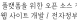

웨어 구현

### Element 72
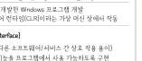

어기 re zalgaa

### Element 73
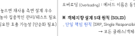

최소화 / 확대 / 생 / /

### Element 74

래스 구현

### Element 75

향상

### Element 76

어플리케이션 흐름 제어

### Element 77
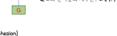

스프링 (Spring Framework)

### Element 78
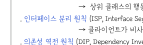

. 동적 웹 a) 사이트 기

### Element 79

픈 소스

### Element 80

성부 표준

### Element 81

. 우리나라 ce 정보화 사업 시 효율적인 정보 시스템

### Element 82
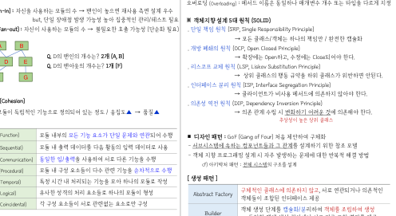

} ark SRE 한 제공 닷넷 Windows 프로그램 개발 14621 02064000 | 공통 언어 가상 머신 상에서 작동

### Element 83
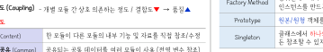

※ API (Application Programming Interface) - 소프트웨어 간 인터페이스

### Element 84

/ - 운영체제 및 프로그래밍 Is ㅡ 개발 비용 저감 중복 작업

### Element 85
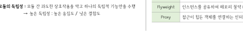

> 팬인 (Fan-in): 수 > but, 단일 발생 7

### Element 86

로 £4)© (Cohesion)

### Element 87

개별 SAAe

### Element 88
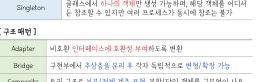

(서로 다른: 간 상호 작용 용이) 사용 7 oie 57

### Element 89
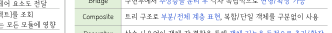

/ Fe] 용이 비

### Element 90

인

### Element 91

bs ee 뿌

### Element 92

Q D2] Melo] (A,B)

### Element 93

Q D2] (F)

### Element 94
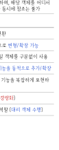

/ 도 >

### Element 95
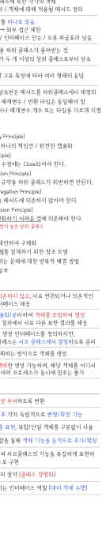

/ 개 수 수 / = 4A) 지향 (Object-oriented) : 속성, 멤버, 나뉘 분석 고유 식별자 독립된 존재 / 일정한 보유 aes = 가질 있는 조건, 속성 의해 정의 Hee) | Method) = 있는 메시지 집합 equ | 호동 갖는 / 데이터 추상화 단위 클래스 | x 인스턴스 (Instance) 속한 객체 99! ㅣ 6602000 : 동작 / 대해 적용될 메서드 정의 데이터 처리 함 하나로 묶음 Wes | 시보 내용 은닉) -* 외부 접근 제한 Encapsulation | 낮음 / 재사용 용이 / 인터페이스 단순 / 오류 낮음 상속 | 상위 하위 것 (inhertance) ㅣ ※ 다중 상속 : 단일 두 이상의 상위 상속 (rove ion) 7 객체 별 고유 Sol 따라 여러 Beh] (04000061 : ㅡ 단 메서드 이름 반환 (Overloading) : 메서드 개수 또는 다르게 지정

### Element 96

※ 설계 원칙 (SOLID) . 단일 책임 원칙 (SRP, Single Responsibility Principle

### Element 97

> 모든

### Element 98

책

### Element 99

. 개방 원칙 (OCP, Open Closed Principle)

### Element 100

= . 교체 원칙 (LSP, 니어

### Element 101

=

### Element 102

행동 히

### Element 103

/ 임만 완전한 Yast

### Element 104

한다.

### Element 105

위 v Substitution Principle) 안된다.

### Element 106

인터페이스 분리 원칙 (ISP, Interface Segregation Principle)

### Element 107

ㅡ

### Element 108

않아야 한다.

### Element 109

. 의존성 역전 원칙 (DIP, Dependency Inversion Principle)

### Element 110

의존 관계

### Element 111

시 수립 어려운 것에 한다.

### Element 112
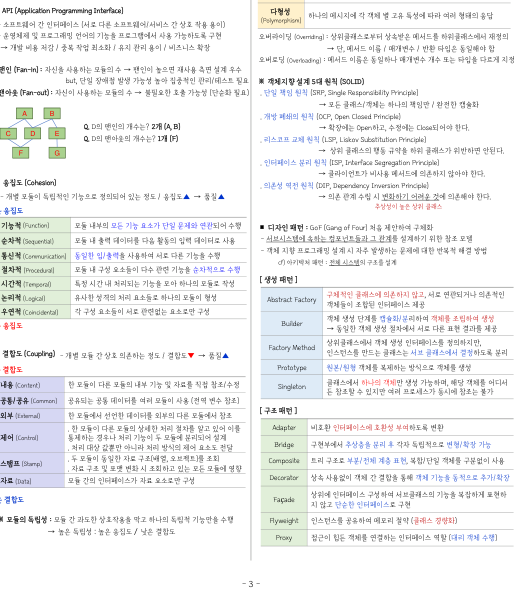

성 에 가 } 2 도 수 들의 변수 / 일 지향 5 시 높은 높은 상위 클래스 높은 기능적 (Function) 부의 모든 기능 단일 수행 m 디자인 패턴 : GoF (Gang of Four) 처음 구체화 순차적 (Sequential) 력 다음 입력 사용 ㅣ ㆍ 시 속하는 그 위한 참조 모델 - 객체 프로그래밍 설계 시 자주 대한 반복적 해결 방법 ein a2 al 수행 (Communication) 4S 서로 다른 oie ape ny sy meten 228 (Procedural) 구성 다수 관련 수행 시간적 (Temporal 모아 작성 | ㅣ = = Se Aol 않고 서로 : 형성 구체적인 않고, 서로 EPA (Logical) 격의 처리 BHO] Abstract Factory 인터페이스 제공 우 해여 소들 구성 patel Cope) 서로 BEBE : 객체 생성 GAS 생성 낮은 Builder ㅡ 동일한 객체 생성 서로 다른 표현 제공 Yea 객체 생성 = ARE (Coupling) -7 > FactoryMethod | 만드는 서브 분리 높은 Prototype | AIS 생성 한 나른 내부 기능 및 직접 Balen . 생성 , 해당 어디서 내용 (Content) 한 다른 내부 기능 및 직접 Singleton 든 이만 else 동시에 볼가 (Common) 공통 여러 사용 (전역 참조 외부 (Exeral 다른 참조 상세한 처리 알고 있어 이를 Adapter | 호환성 변환 제어 10001 우나 저리 20h -- - - " al goal a 제어 전달 00006 | 분리 후 각자 가능 ae 스탬프 (Stamp) oa 오브 ae eal 영향 Composite | 트리 계층 표현, 사용 자료 (Data) 모듈 간의 자료 구성 Decorator | 상속 객체 간 통해 객체 인터페이스 낮은 ate Fagade | 않고 단순한 구현 “_

### Element 113

ay

### Element 114
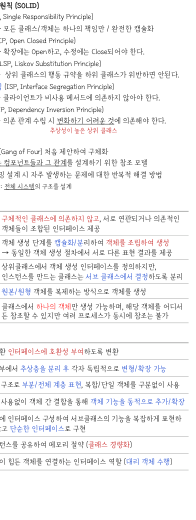

의 독립적 수행

### Element 115

Flyweight 메모리 절약 (클래스 경량화)

### Element 116
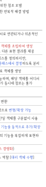

기 Proxy 힘든
