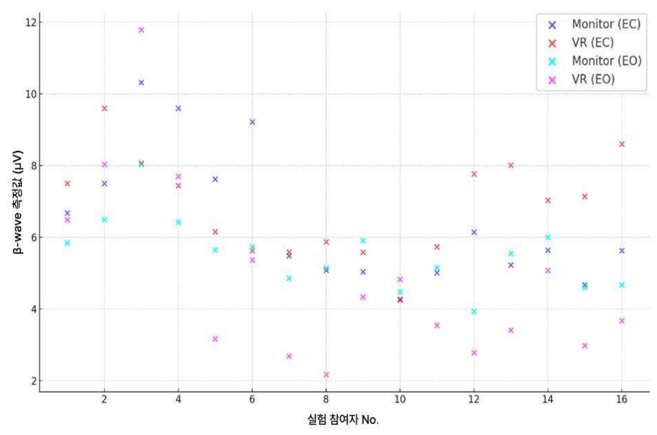

Smart Media Journal / Vol.14, No.2 / ISSN:2287-1322

<<BLOCKEND>>

2025년 02월 스마트미디어저널 109

<<BLOCKEND>>

| 베타파(Beta wave) | 베타파(Beta wave) | 베타파(Beta wave) | 베타파(Beta wave) | 베타파(Beta wave) | 베타파(Beta wave) | 베타파(Beta wave) | 베타파(Beta wave) |
| --- | --- | --- | --- | --- | --- | --- | --- |
| 참여자 눈 1회 2회 디바이스 No. (좌/우) EC EO A-B EC EO C-D | 참여자 눈 1회 2회 디바이스 No. (좌/우) EC EO A-B EC EO C-D | 참여자 눈 1회 2회 디바이스 No. (좌/우) EC EO A-B EC EO C-D | 참여자 눈 1회 2회 디바이스 No. (좌/우) EC EO A-B EC EO C-D | 참여자 눈 1회 2회 디바이스 No. (좌/우) EC EO A-B EC EO C-D | 참여자 눈 1회 2회 디바이스 No. (좌/우) EC EO A-B EC EO C-D | 참여자 눈 1회 2회 디바이스 No. (좌/우) EC EO A-B EC EO C-D | 참여자 눈 1회 2회 디바이스 No. (좌/우) EC EO A-B EC EO C-D |
| 참여자 눈 1회 2회 디바이스 No. (좌/우) EC EO A-B EC EO C-D | 참여자 눈 1회 2회 디바이스 No. (좌/우) EC EO A-B EC EO C-D | 참여자 눈 1회 2회 디바이스 No. (좌/우) EC EO A-B EC EO C-D | 참여자 눈 1회 2회 디바이스 No. (좌/우) EC EO A-B EC EO C-D | 참여자 눈 1회 2회 디바이스 No. (좌/우) EC EO A-B EC EO C-D | 참여자 눈 1회 2회 디바이스 No. (좌/우) EC EO A-B EC EO C-D | 참여자 눈 1회 2회 디바이스 No. (좌/우) EC EO A-B EC EO C-D | 참여자 눈 1회 2회 디바이스 No. (좌/우) EC EO A-B EC EO C-D |
| 참여자 눈 1회 2회 디바이스 No. (좌/우) EC EO A-B EC EO C-D | 참여자 눈 1회 2회 디바이스 No. (좌/우) EC EO A-B EC EO C-D | 참여자 눈 1회 2회 디바이스 No. (좌/우) EC EO A-B EC EO C-D | 참여자 눈 1회 2회 디바이스 No. (좌/우) EC EO A-B EC EO C-D | 참여자 눈 1회 2회 디바이스 No. (좌/우) EC EO A-B EC EO C-D | 참여자 눈 1회 2회 디바이스 No. (좌/우) EC EO A-B EC EO C-D | 참여자 눈 1회 2회 디바이스 No. (좌/우) EC EO A-B EC EO C-D | 참여자 눈 1회 2회 디바이스 No. (좌/우) EC EO A-B EC EO C-D |
| 0-30s | 0-30s | 0-30s | 0-30s | 0-30s | 0-30s | 0-30s | 0-30s |
| 모니터 1 | 좌 | 6.68 | 30-60s 5.84 | 0.84 | 8.64 | 90-120s 4.12 | 4.52 |
| 모니터 1 | 우 | 7.5 | 6.49 | 1.01 | 8.53 | 4.9 | 3.63 |
| 모니터 1 | 좌 VR | 10.31 | 8.03 | 2.28 | 8.41 | 6.14 | 2.27 |
| 모니터 1 | 우 | 9.59 | 6.42 | 3.17 | 8.74 | 5.18 | 3.56 |
| 모니터 2 VR | 좌 | 7.62 | 5.65 | 1.97 | 4.03 | 3.83 | 0.20 |
| 모니터 2 VR |  | 우 9.22 | 5.73 | 3.49 | 6.33 | 6.69 | -0.36 |
| 모니터 2 VR |  | 좌 5.48 | 4.86 | 0.62 | 5.72 | 7.11 | -1.39 |
| 모니터 2 VR |  | 우 | 5.14 | -0.06 | 7.55 | 4.95 | 2.60 |
| 모니터 3 | 좌 | 5.08 5.04 | 5.9 | -0.86 | 4.93 | 6.86 | -1.93 |
| 모니터 3 | 좌 | 우 4.27 | 4.48 | -0.21 | 2.97 | 4.95 | -1.98 |
| 모니터 3 | 좌 VR | 5.01 | 5.15 | -0.14 | 5.58 | 4.81 | 0.77 |
| 모니터 3 | 우 | 6.14 | 3.93 | 2.21 | 5.31 | 3.69 | 1.62 |
| 모니터 4 | 좌 | 5.23 | 5.54 | -0.31 | 5.44 | 5.77 | -0.33 |
| 모니터 4 | 좌 | 우 5.64 | 6 | -0.36 | 5.12 | 6.43 | -1.31 |
| 모니터 4 | VR | 좌 4.68 | 4.61 | 0.07 | 4.64 | 5.56 | -0.92 |
| 모니터 4 | VR | 우 5.63 | 4.68 | 0.95 | 5.22 | 5.08 | 0.14 4.39 |
| 모니터 5 | 좌 | 4.23 | 6.58 4.50 | -2.35 | 6.18 | 5.53 | 0.65 |
| 모니터 5 | VR | 우 5.59 | 5.36 | 0.23 | 6.45 | 4.79 | 1.66 |
| 모니터 5 | VR | 좌 8.07 | 11.78 | -3.71 | 9.36 | 9.95 | -0.59 |
| 모니터 5 | VR | 우 4.21 | 7.7 우 | -3.49 | 4.78 | 5.83 | -1.05 |
| 6 | 모니터 | 좌 4.34 | 3.17 | 1.17 | 5.4 | 3.39 | 2.01 |
| 6 | 우 | 4.78 | 3.02 | 1.76 | 5.13 좌 | 2.67 | 2.46 |
| 6 | 좌 -0.62 7.17 -0.61 VR 0.30 | 9 -0.11 | 2.69 | 6.31 | 6.08 | 3.51 | 2.57 |
| 6 | VR | 우 9.81 4.08 2.95 | 2.17 | 7.64 | 5.88 | 1.73 | 4.15 |
| 7 | 좌 | 5.48 5.85 | 4.33 | 1.15 | 5.99 | 5.01 | 0.98 |
| 7 | 모니터 우 | 5.59 | 4.82 | 0.77 3.36 | 6.18 8.96 7.71 | 5.68 | 0.50 |
| 7 | 좌 VR | 5.6 | 3.54 | 2.06 8.21 | 5.06 7.82 7.06 0.76 | 3.91 | 1.15 |
| 7 | 우 좌 8.47 9.09 6.56 5.29 4.99 | 5.4 | 2.78 | 2.62 5.77 8.29 | 4.56 5.34 | 2.53 | 2.03 |
| 8 | 좌 모니터 | 5.87 9.85 | 3.41 | 2.46 4.06 | 5.4 7.69 3.23 4.46 | 3.29 | 2.11 |
| 8 | 좌 모니터 | 우 8.35 | 5.07 | 3.28 7.15 | 6.04 좌 6.65 -0.50 8.75 6.88 1.87 모니터 | 3.46 | 2.58 |
| 8 | 좌 VR | 7.44 | 2.98 | 4.46 | 3.41 우 1.30 8.57 7.36 1.21 | 4.34 8.95 7.65 | -0.93 |
| 8 |  | 우 8.26 | 3.67 | 4.59 | 5.6 | 5.26 | 0.34 |
| 9 | 좌 모니터 | 7.32 | 6.86 | 0.46 | 7.72 | 6.14 | 1.58 |
| 9 | 우 | 5.58 | 6.88 | -1.30 | 7.96 | 6.31 | 1.65 |
| 9 | 좌 VR | 5.73 | 5.8 | -0.07 | 7.71 | 8.25 | -0.54 |
| 9 | 우 | 7.77 | 5.35 좌 | 2.42 | 7.09 | 6.13 | 0.96 |
| 10 4.38 0.01 | 좌 모니터 0.47 | 8.01 | 6.93 5.96 5.14 | 1.08 | 9.22 | 5.58 5.05 모니터 우 5.45 5.03 0.42 6.39 5.71 0.68 | 3.64 |
| 10 4.38 0.01 |  | 우 7.03 | 4.8 | 2.23 | 7.69 | 3.03 좌 9.38 4.88 5.01 2.76 | 4.66 |
| 10 4.38 0.01 | 좌 VR | 7.14 | 6.1 | 1.04 | 5.51 | 3.98 8.92 | 1.53 |
| 10 4.38 0.01 | 우 | 8.6 | 2.3 | 6.30 | 4.94 | 2.23 | 2.71 |
| 11 | 좌 모니터 | 10.63 | 4.08 | 6.55 | 9.4 | 5.35 | 4.05 |
| 11 | 우 | 5.63 | 4.41 | 1.22 | 6.14 | 5.51 | 0.63 |
| 11 | 좌 VR | 4.25 | 7.1 | -2.85 | 6.27 | 6.18 | 0.09 |
| 11 | 우 | 6.15 | 5,72 | 0.43 | 6.68 | 5.12 | 1.56 |
| 모니터 12 | 60-90s 좌 | 9.39 | 6.13 0.82 5.52 | 3.26 | 8.18 | 6.16 | 2.02 |
| 모니터 12 | 우 | 9.04 | 8.54 | 0.50 | 8.33 | 5.34 | 2.99 |
| 모니터 12 | 좌 VR | 12.69 | 11.78 | 0.91 | 12.21 | 10.27 | 1.94 |
| 모니터 12 |  | 우 11.8 4.78 | 9.24 5.89 | 2.56 | 11.52 | 7.61 | 3.91 |
| 모니터 12 | 모니터 13 16 7.77 VR 4.77 4.15 7.63 4.27 | 좌 우 | 6.24 | -1.11 1.08 우 9.91 | 6.77 | 3.67 | 3.10 |
| 모니터 12 | 좌 | 7.32 | 5.44 | -0.33 | 7.02 | 5.11 | 1.91 -1.97 |
| 모니터 12 | VR 우 | 5.11 5.22 | 6.18 6.98 | -0.96 3.08 우 | 3.4 5.03 | 5.37 2.98 | 2.05 1.25 |

**표 1. 모니터와 VR(HMD)을 이용한 EMDR 처치 결과 비교**

<<BLOCKEND>>

테스트된 조건(모니터 또는 VR(HMD)), 그리
고 각각 30초 간의 간격 및 조건(눈 감았을 때

<<BLOCKEND>>

(EC), 눈을 떳을 때(EO))에 따른 베타파 측정값
이 제시되었다.

<<BLOCKEND>>

<그림 6>은 각 참여자의 EMDR 베타파 측정
을 나타내는 분포도(chart)로, 모니터와 VR을
사용한 조건에서 눈을 감은 상태(EC)와 눈을 뜬
상태(EO)를 보여준다.

<<BLOCKEND>>

#### X-Axis: 실 참여자 No.
Y-Axis: β-wave 측정값 (μV)
Chart Type: line

|  | Monitor (EC) | VR (EC) | Monitor (EO) | VR (EO) |
| --- | --- | --- | --- | --- |
| item_01 | 4.5 | 5.5 | 6.5 | 7.5 |

<<BLOCKEND>>

그림 6. 모니터와 VR(HMD)에 따른 베타파 분포도
* 회색은 모니터(EC), 하늘색은 모니터(EO), 빨간색은 VR(EC), 보라색은 VR(EO)

<<BLOCKEND>>

그래프의 각 점은 한 조건에서의 한 참여자의
베타파 측정을 나타낸다. 차트에서는 조건과 장
치에 따라 서로 다른 색상을 사용하여 구분했다.
이 분포도는 다른 조건에서 EMDR 치료를 받는
참여자들의 베타파 측정(�V)을 제시하며, 각 데
이터 포인트는 참여자의 눈 상태와 사용된 장치
에 따른 개별 베타파 반응을 나타낸다. 이 설명
은 각 참여자의 베타파 데이터가 어떻게 측정되
었고, 그래프상에서 어떤 방식으로 조건과 장치
에 따라 차별화되었는지를 설명하고 있다.

<<BLOCKEND>>

2. EC(Eye Colse) 데이터 분석

<<BLOCKEND>>

대응 표본 T-검정을 사용하여 그룹 간 차이를
비교한 결과, <표 2>와 같이 눈을 감았을 때
(EC) 모니터와 VR 모두 오른쪽 반구 베타파 활
동에 유의미한 차이를 보이지 않았다(p=.715).

<<BLOCKEND>>

이는 디스플레이 매체의 유형이 EMDR 처치
과정에서 눈을 감았을 때(EC)의 베타파 활동에
유의미한 영향을 미치지 않았음을 시사한다.

<<BLOCKEND>>

W kci  g ○ kr

<<BLOCKEND>>