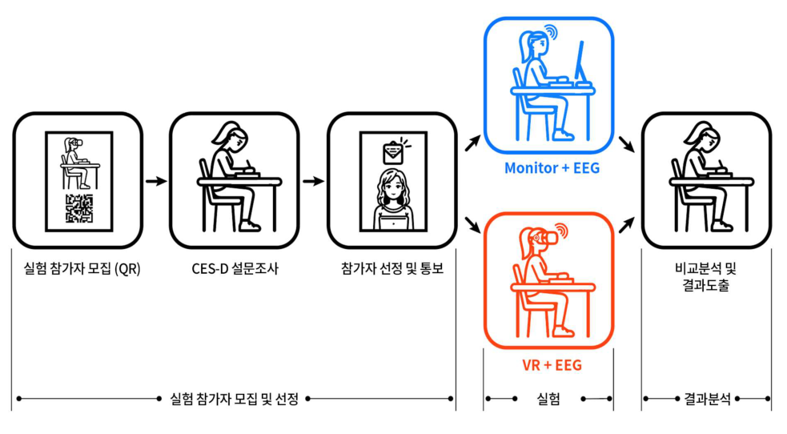
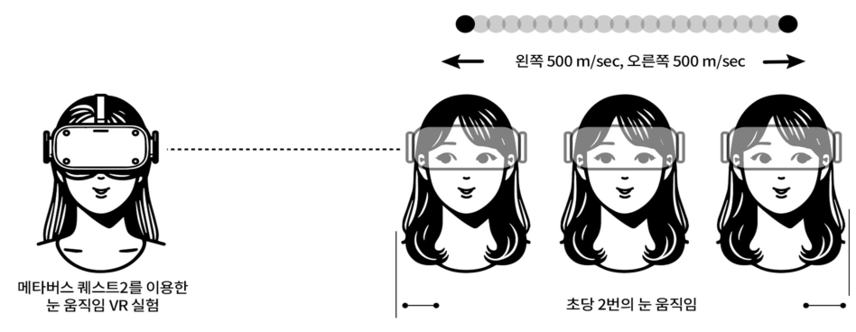
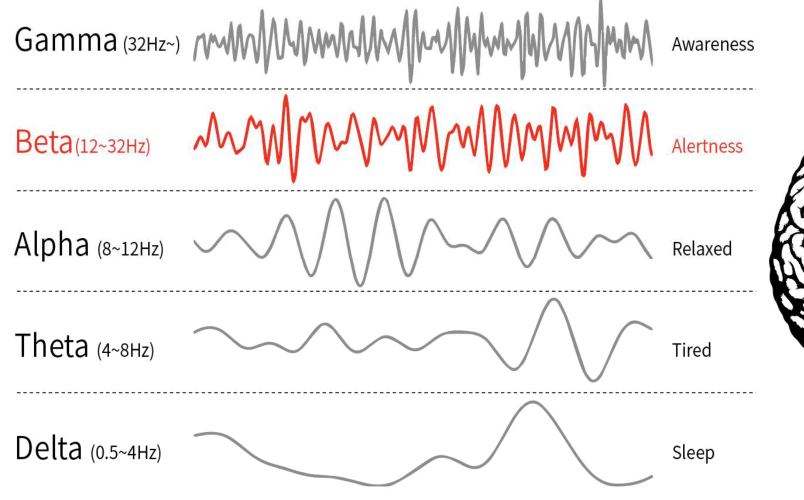
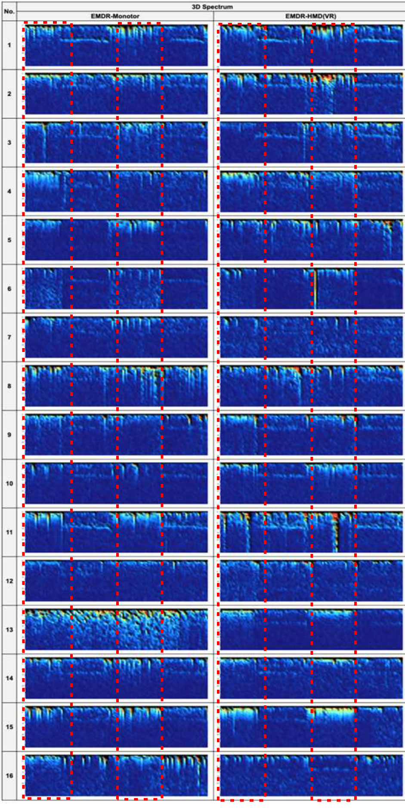
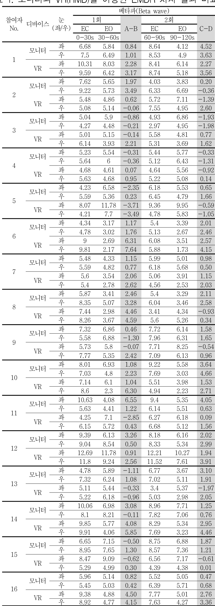
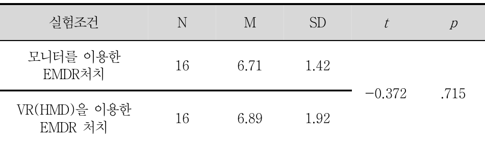
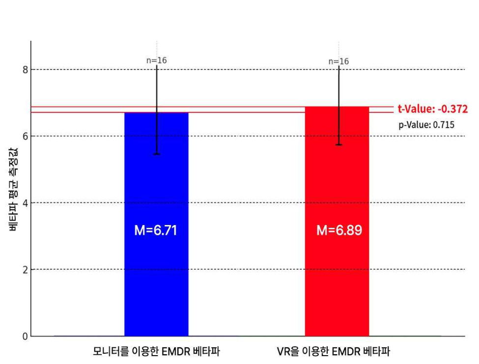
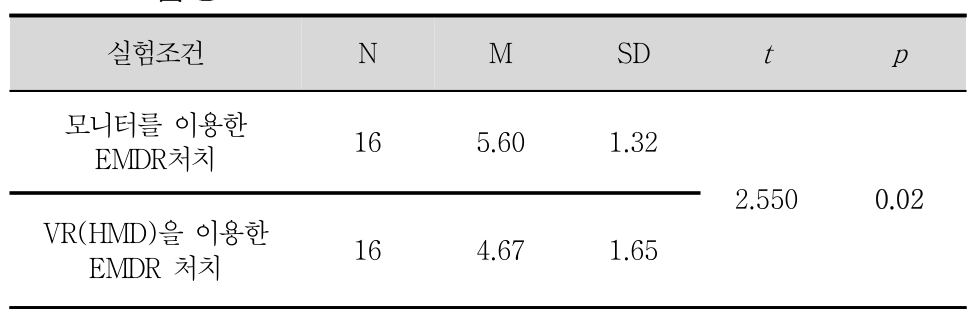
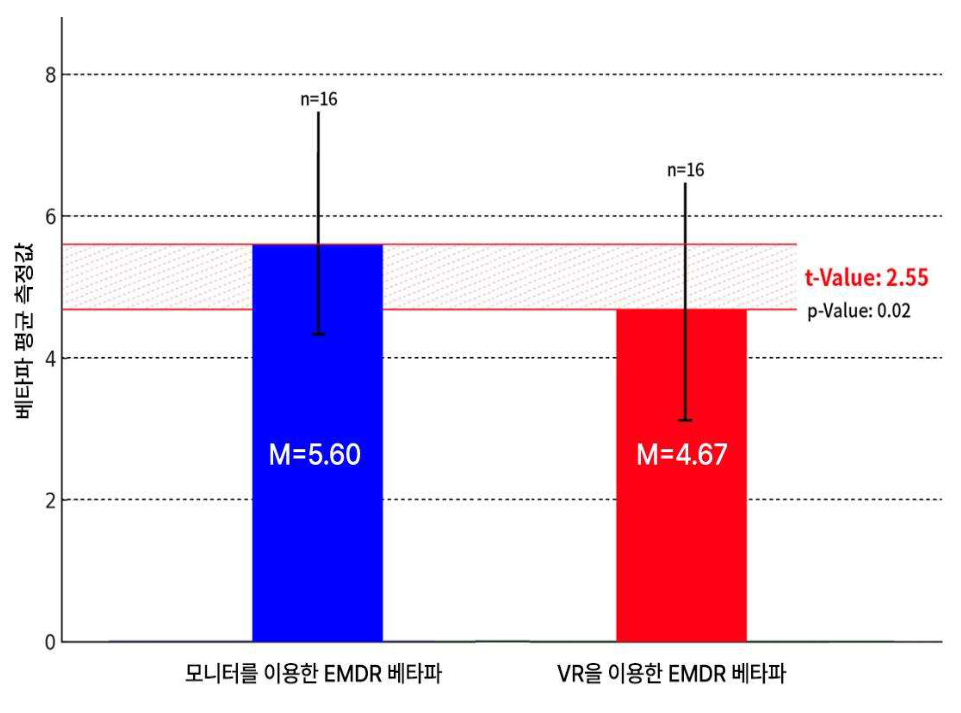

102 2025년 02월 스마트미디어저널

<<BLOCKEND>>

Smart Media Journal / Vol.14, No.2 / ISSN:2287-1322
https://ck.dolorg/1030693/SMU2025.142.102

<<BLOCKEND>>

| VR을 이용한 EMDR의 양측성 미치는 영향에 관한 연구: 비교 연구 | 안구운동이 우울증 감소에 모니터와 HMD를 이용한 베타파 |
| --- | --- |
| (A Study on the Effects of Bilateral Eye Movement in Depression Reduction: A Comparative Analysis of Beta | VR-Based EMDR on Waves Using Monitor and HMD) |
| 장성복*, 서정호** (Sung-Bok Chang, Jung-Ho Suh) |  |

<<BLOCKEND>>

본 연구는 주로 모니터를 통해 시행되는 EMDR(안구운동 민감소실 및 재처리 요법) 치료 방식에서, 가상
현실(VR)을 이용한 새로운 접근법의 잠재력을 탐구하기 위해 수행되었다. 이를 검정하기 위해, 경기도에 위치
한 G대학교 학생들을 대상으로 우울 척도(CES-D)를 사용하여 우울증 수준을 측정했다. CES-D 점수가 25
점 이상으로 심각한 우울 상태를 나타낸 16명이 실험에 포함되었으며(내적 일관성 = .71), 이들은 모니터와
VR을 사용한 EMDR 치료 실험에 참여했다. 실험 중에는 EEG 장비를 사용해 오른쪽 반구의 베타파 변화를
관찰했다. 데이터는 SPSS 27을 사용해 짝지어진 표본 T-검정으로 분석되었다. 검증 결과, VR HMD를 이용
한 EMDR 치료(M=4.67)가 전통적인 모니터 기반 EMDR 치료(M=5.60)보다 베타파 점수가 낮게 나타나,
VR을 활용한 EMDR 치료의 새로운 가능성을 확인하였다.

<<BLOCKEND>>

■ 중심어 : VR ; EMDR ; EEG ; 우울증 ; 베타파

<<BLOCKEND>>

Abstract

<<BLOCKEND>>

This study was conducted to explore the potential of a novel approach to EMDR (Eye
Movement Desensitization and Reprocessing) therapy using virtual reality (VR), which is
traditionally administered via monitors. To test this, the depression level of students at G
University, located in Gyeonggi Province, was measured using the Center for Epidemiologic
Studies Depression Scale (CES-D). Sixteen participants with CES-D scores of 25 or higher,
indicating severe depression (internal consistency = .71), were included in the experiment.
They participated in EMDR therapy sessions conducted using both monitors and VR. During
the experiment, EEG equipment was used to observe beta wave changes in the right
hemisphere. The data were analyzed using paired sample t-tests with SPSS 27. The results
showed that EMDR therapy using a VR HMD (M=4.67) had lower beta wave scores compared
to traditional monitor-based EMDR therapy (M=5.60), confirming the new potential of
VR-based EMDR therapy.

<<BLOCKEND>>

keywords : VR ; EMDR ; EEG ; Depression ; Beta waves

<<BLOCKEND>>

I. 서 론

<<BLOCKEND>>

우울증은 현재 전 세계적으로 가장 널리 퍼져
있는 정신 건강 문제 중 하나로, 수많은 사람들
에게 심각한 영향을 미치고 있다. 우울증은 일상
생활의 기능을 저하시킬 뿐만 아니라 삶의 질을

<<BLOCKEND>>

크게 떨어뜨리며, 만성화될 경우 사회적, 경제적
비용을 유발할 수 있다[1]. 이러한 이유로 우울
증 치료에서 약물치료와 심리치료 외에 다미술
치료, 음악치료, 원예치료, 인지행동치료 등과
같은 다양한 치료 방법이 우울증과 스트레스 감
소에 효과적임이 보고되고 있다[2].

<<BLOCKEND>>

*정회원, 청주대학교 디지털미디어디자인학과
** 정회원, 가천대학교 미디어커뮤니케이션학과 kc
접수일자 : 2024년 11월 17일 게재확정일 : 2025년 01월 27일
수정일자 : 2024년 01월 05일 교신저자 : 서정호 e-mail : hoseo@gachon.ac.kr

<<BLOCKEND>>

Smart Media Journal / Vol.14, No.2 / ISSN:2287-1322

<<BLOCKEND>>

2025년 02월 스마트미디어저널 103

<<BLOCKEND>>

이러한 치료법 중 하나는 EMDR(Eye
Movement Desensitization and
Reprocessing)이다. EMDR은 원래 외상 후 스
트레스 장애(PTSD) 치료에 효과적이라고 알려
져 있으나, 최근 연구들은 우울증 환자에게도 긍
정적인 효과를 보일 수 있음을 시사하고 있다
[3,4]. 일반적으로 EMDR 치료는 모니터 화면을
통해 환자의 눈동자 움직임을 유도하여 기억을
재처리하는 방식으로 이루어졌다.

<<BLOCKEND>>

최근 연구에서 VR 기술을 이용하여 만성 뇌 질
환 재활치료의 가능성을 제기[5]하고 있다. 옥
스퍼드 대학의 연구에서는 VR이 불안 장애 등
정신 질환 치료에 효과적으로 활용될 수 있음을
확인하였다[6]. VR(가상현실) 기술을 활용함으
로써 보다 몰입감 있는 치료 환경을 제공할 수
있어, VR이 기존의 모니터 기반 EMDR보다 더
높은 치료 효과를 낼 수 있다는 가능성이 제기되
고 있다[7]. 특히, 뇌파 분석을 통해 우울증 환
자의 뇌 상태를 더욱 깊이 이해할 수 있으며, 베
타파는 우울증과 관련된 주요 뇌파로 연구되고
있다[8,9]. 베타파는 높은 각성과 불안과 밀접하
게 연관된 것으로 알려져 있으며, 우울증 환자들
에게서 이러한 높은 베타파가 관찰된다는 연구
가 있다[10]. 이는 우울증 환자들이 과도한 불안
과 스트레스를 경험하고 있다는 점은, 이러한 신
경학적 각성 상태가 우울증 증상을 악화시키는
주요 요인 중 하나로 작용할 수 있음을 시사한
다. 이러한 맥락에서, 우울증 치료에 있어 베타파
변화를 관찰하는 것은 중요한 접근법으로 주목
받고 있다.

<<BLOCKEND>>

본 연구는 그동안 베타파가와 우울증과의 관계
를 증명하는 연구가 제한적으로 진행되고 있는
상황에서 베타파 감소가 우울증 증상 개선에 직
간접적인 관계를 확인하는 것이며 VR을 활용한
EMDR 치료가 기존의 모니터 기반 EMDR 치료
에 비해 우울증 환자의 베타파에 미치는 영향을
검증하는 데 목적을 둔다. 특히, 기존 EMDR 치
료에 VR 기술을 도입함으로써 우울증 치료 효과

<<BLOCKEND>>

www.kci.go.kr

<<BLOCKEND>>

를 강화할 가능성을 탐구하며, 이를 통해 실증적
데이터를 확보하는 것을 주요 연구 과제로 삼았
다. VR 기반 EMDR 치료가 우울증 환자의 뇌파,
특히 베타파에 미치는 영향을 측정함으로써, 가
상현실의 활용 가능성과 치료적 유용성을 평가
하는 데 연구의 의의를 두고 있다.

<<BLOCKEND>>

따라서 본 연구는 모니터 기반 치료와 VR 기반
치료 간의 유의미한 차이를 규명하고, 우울증 치
료 방법으로서 VR의 잠재력을 탐색하고자 한다.
이는 우울증 치료에 대한 보다 다양한 접근법을
제시함과 동시에, 새로운 디지털 기술을 활용한
정신 건강 치료의 가능성을 확장하는 데 중요한
의미를 갖는다.

<<BLOCKEND>>

II. 본 론

<<BLOCKEND>>

1. EMDR과 우울증

<<BLOCKEND>>

EMDR(Eye Movement Desensitization and
Reprocessing, 이하 EMDR)은 안구운동 민감소
실 재처리 기법을 이용한 치료로써 1987년
Francine Shapiro 박사에 의해 개발된 심리 치
료 기법으로, 양측성 안구운동이 외상 기억과 연
관된 부정적인 감정의 강도를 감소시키는데 도
움이 된다고 주장하였고 주로 외상 후 스트레스
장애(PTSD) 치료에서 효과가 검증된 방법으로
알려져 있다[11].

<<BLOCKEND>>

EMDR의 기본 원리는 외상 기억이 부적절하게
처리되어 부정적인 감정과 신념을 유발하며, 치
료 과정을 통해 이러한 기억을 재처리하여 적응
적인 방식으로 통합하도록 돕는다.

<<BLOCKEND>>

치료는 8단계로 구성되어 있다[3]. 1단계는
'병력 조사 및 치료 계획 수립단계'로써 환자의
과거 역사와 현재 상태를 평가하여 맞춤형 치료
계획을 수립한다. 2단계는 '준비 단계'로써 환자
에게 EMDR의 개념과 절차를 설명하고, 안정화
기법을 소개하여 치료 과정에서 안정감을 느끼
도록 한다. 3단계는 '평가 단계' 단계로써 해결해
야 할 특정 기억을 선택하고, 그와 관련된 감정

<<BLOCKEND>>

104 2025년 02월 스마트미디어저널

<<BLOCKEND>>

Smart Media Journal / Vol.14, No.2 / ISSN:2287-1322

<<BLOCKEND>>

과 신체적 반응을 평가한다. 4단계는 '탈감작 단
계'로써 치료사의 지시에 따라 안구 운동 등 양
측성 자극을 하며 외상 기억을 떠올리고, 이를
통해 부정적인 감정을 줄인다. 5단계는 '설치 단
계'로서 긍정적인 신념과 감정을 외상 기억과 연
결하여 새로운 관점을 형성한다. 6단계는 '신체
적 검사 단계'로써 신체적 반응을 평가하여 남아
있는 부정적인 감정을 해결한다.

<<BLOCKEND>>

7단계는 '종료 단계'로써 세션을 마무리하고,
환자의 안정성을 확인한다. 마지막 8단계는 '재
평가 단계'로써 이전 세션의 결과를 평가하고,
추가 작업이 필요한지를 결정하는 과정으로 구
성되어 있다.

<<BLOCKEND>>

EMDR은 고통스러운 기억을 회상하는 동안 눈
을 빠르게 움직이도록 하여 기억을 재처리함으
로써, 기억과 관련된 감정적 반응을 완화시키는
방식으로 이루어진다. 이 기법은 초기에는
PTSD와 같은 외상성 스트레스 장애 치료에 주
로 사용되었으나, 시간이 지나면서 그 효과가 다
양한 정신 건강 문제에까지 확장되고 있다[12].

<<BLOCKEND>>

EMDR이 작동하는 구체적인 메커니즘은 완전
히 규명되지 않았으나, 기억을 재처리하는 과정
에서 부정적인 감정을 완화하고 신체적 반응을
줄이는 효과가 보고되었다[3]. 이를 통해
EMDR은 불안과 우울을 포함한 다양한 정신 건
강 문제에 효과가 있다는 연구들이 발표되었고,
심리 치료에서 중요한 역할을 차지하게 되었다.
특히 EMDR은 기존의 인지행동치료(Cognitive
Behavioral Therapy, CBT)와 비교하여 PTSD
환자들의 치료 반응 속도가 빠르고, 지속 효과가
높다는 연구 결과도 보고되고 있다[13].

<<BLOCKEND>>

Shapiro(2001)의 연구 이후, EMDR은 PTSD
외에도 불안 장애, 공황 장애, 우울증 등에 적용
가능하다는 연구들이 이어지고 있다. 특히 우울
증 치료에서도 EMDR의 긍정적인 효과를 입증
하려는 연구가 증가하고 있으며, 이는 우울증이
단순한 증상 억제 이상의 근본적인 감정적 요소
를 다루어야 한다는 인식에서 비롯된다[14]. 우

<<BLOCKEND>>

www.kci.go.kr

<<BLOCKEND>>

울증 환자들에게 EMDR은 과거의 부정적인 기
억을 재처리하고, 이를 통해 현재의 감정적 불편
을 줄일 수 있는 접근법을 제공한다.

<<BLOCKEND>>

특히, EMDR을 이용한 우울증 치료에 관한 연
구는 그 효용성을 입증해가고 있다. 이해원 등
(2008)은 EMDR이 PTSD뿐만 아니라 주요 우
울 장애에도 효과적일 수 있음을 보였다. 이 연
구에서는 우울증 환자들에게 EMDR을 적용했을
때, 불안 수준과 우울감이 유의미하게 감소하는
결과가 나타났으며, 특히 부정적인 자기 인식을
개선하는 데 도움이 되었다고 보고하였다[15].
또 다른 연구에서 장은영 등(2016)은 EMDR 치
료가 우울증 증상을 완화시키는 데 효과적이며,
특히 우울증 환자들이 자주 겪는 감정적 재처리
의 어려움을 돕는 데 유용하다고 밝혔다[16].

<<BLOCKEND>>

EMDR을 이용한 우울증 치료는 우울증의 근본
적인 감정적 및 기억적 요소를 다루어, 환자들이
반복적으로 겪는 부정적인 감정과 사고 패턴을
변화시키는 데 초점을 맞춘다[17]. 이를 통해 우
울증 치료에서 EMDR은 단순한 증상 경감뿐 아
니라, 환자가 근본적으로 새로운 자기 인식을 갖
도록 돕는 데 다양하게 활용되고 있다.

<<BLOCKEND>>

2. EMDR과 EEG

<<BLOCKEND>>

EMDR은 PTSD와 같은 외상 후 스트레스 장
애를 치료하는 데 효과적인 치료법으로 잘 알려
져 있지만, 최근에는 이와 관련된 뇌파 변화를
측정하고자 하는 연구들도 활발히 진행되고 있
다. EEG(뇌파 검사)를 통해 EMDR 치료가 뇌에
미치는 영향을 연구하는 것은 치료 효과를 객관
적으로 검증할 수 있는 수단을 제공하며, EMDR
의 신경학적 메커니즘을 이해하는 데 중요한 단
서를 제공한다[18]. Bergmann(2010)은 EMDR
치료 중 발생하는 뇌파 변화를 조사하였으며, 특
히 안구 운동이 뇌의 정보 처리 네트워크에 미치
는 영향을 연구하였다. 그는 EMDR이 시상
(thalamus)과 신경 통합(neural integration)에

<<BLOCKEND>>

Smart Media Journal / Vol.14, No.2 / ISSN:2287-1322

<<BLOCKEND>>

2025년 02월 스마트미디어저널 105

<<BLOCKEND>>

영향을 미쳐 외상 기억의 재처리를 촉진한다고
제안하였다[19].

<<BLOCKEND>>

EMDR과 EEG를 결합한 연구들은 주로 EMDR
이 특정 뇌파에 어떤 영향을 미치는지를 측정하
는 방식으로 진행되어 왔다. Pagani et al.
(2012)은 PTSD 환자들을 대상으로 EMDR 세
션 중 EEG를 측정하여, EMDR이 두정엽과 전두
엽의 신경 활동에 변화를 유도하며, 감정적 회상
시 뇌파 반응을 줄일 수 있음을 발견했다[20].
이는 EMDR이 뇌의 특정 영역을 안정화하는 데
기여할 수 있다는 가능성을 시사하며, 감정적 자
극에 대한 반응을 조절하는 데 도움이 될 수 있
다. 또한, EMDR이 뇌파에 미치는 영향을 연구
한 Pagani et al(2013)은 EMDR은 과거의 기억
을 재처리하는 과정에서 알파파의 증가는 의식
적 감정 처리와 관련된 대뇌의 상위 인지 기능을
지원하여, 정서적으로 안전한 상태를 유지할 수
있도록 도움을 준다고 밝혔다[21]. 이 연구는
EMDR이 치료 과정 중에 알파파의 변화를 유도
하여 환자가 고통스러운 기억에 덜 반응하도록
돕는 역할을 할 수 있다는 점을 보여주었다.

<<BLOCKEND>>

우울증에 대한 뇌파 연구는 주로 알파파와의
관계를 중심으로 이루어졌다. 알파파는 주로 이
완된 상태와 관련이 있으며, 우울증 환자에게서
알파파의 비정상적인 수준이 자주 관찰된다는
연구들이 다수 보고되고 있다[22-24].

<<BLOCKEND>>

Henriques와 Davidson(1991)의 연구에 따르
면, 우울증 환자들은 좌측 전두엽 알파파가 상대
적으로 낮아진 상태를 보이며, 이는 감정적 처리
와 연관이 있을 수 있다고 밝혔다[22]. 이러한
연구들은 알파파가 우울증 환자의 정서적 상태
를 파악하고 치료 과정에서의 변화를 모니터링
하는 중요한 지표로 사용될 수 있음을 시사한다.
그러나 최근에는 베타파(13-30 Hz)가 우울증
과 어떤 연관이 있는지에 대한 연구도 증가하고
있다. 베타파는 주로 각성과 집중 상태에서 관찰

<<BLOCKEND>>

되며, 높은 수준의 베타파는 불안과 스트레스를
반영하는 지표로 간주된다[25]. 우울증 환자의

<<BLOCKEND>>

www.kci.go.kr

<<BLOCKEND>>

경우, 과도한 각성이나 스트레스 상태를 반영하
는 높은 베타파가 관찰되는 경향이 있으며, 이는
환자들이 과도한 불안을 경험하고 있음을 시사
한다. Davidson(1998)은 우울증 환자들에게서
높은 베타파 활동이 증가하는 현상을 관찰하였
고, 이는 정서적 각성 상태와 관련이 있을 수 있
음을 밝혔다[8]. Krupnik(2018)은 우울증과
EMDR 치료 간의 관련성을 탐구하면서, 치료 전
후의 뇌파 변화를 분석하였다. 이 연구는 EMDR
치료 후 우울증 환자의 베타파가 감소하는 경향
을 보이며, 이를 통해 불안과 각성 상태가 완화
될 수 있다는 가능성을 제기하였다[26]. 이러한
연구들은 베타파가 우울증 환자의 신경학적 스
트레스 상태를 나타내는 중요한 지표가 될 수 있
으며, EMDR이 이러한 상태에 긍정적인 영향을
미칠 수 있음을 시사한다.

<<BLOCKEND>>

따라서, EMDR과 EEG 연구의 통합적 접근은
우울증과 같은 정신 건강 문제를 해결하는 데 있
어 신경학적 관점에서의 이해를 더욱 넓혀주고
있다. 특히, EMDR이 우울증 환자의 베타파를
줄임으로써 불안과 각성을 완화하는 효과가 있
을 수 있으며, 이를 통해 치료의 효능을 객관적
으로 평가할 수 있는 가능성을 확인하고자 본 연
구는 VR 기반 EMDR 치료가 우울증 환자의 베
타파에 미치는 영향을 검증하고 모니터를 이용
한 EMDR 치료와 어떠한 차이를 보이는지 확인
하고자 한다.

<<BLOCKEND>>

III. 연구방법

<<BLOCKEND>>

1. 조사대상 및 실험절차

<<BLOCKEND>>

본 연구는 경기도에 위치한 C대학에 재학 중인
20대 대학생을 대상으로 본 연구에 참여를 희망
한 학생 56명을 대상으로 진행되었으며 우울증
정도를 확인하기 위하여 한국판 역학연구센터
우울척도(K-CES-D)를 사용하였다. 20점 이상
의 우울 증상을 보이는 16명을 대상으로 실험을

<<BLOCKEND>>

106 2025년 02월 스마트미디어저널

<<BLOCKEND>>

Smart Media Journal / Vol.14, No.2 / ISSN:2287-1322

<<BLOCKEND>>

진행하였다. 소규모 표본에서 모집단이 동질적
이거나 연구설계가 정밀한 경우 작은 표본 크기
로도 충분한 대표성을 확보[27,28]할 수 있다고
판단하여 실험을 지속하였다. 실험은 <그림. 1>
과 같은 프로세스로 수행되었으며 실험은 2023
년 10월 24일부터 11월 10일까지 진행되었다. 모
든 참가자들은 연구의 목적과 목표에 대해 충분
한 설명을 들었으며, 참여 전에 동의서를 작성하
였다. 모든 실험 참가자들은 정상 또는 교정된
시력을 가지고 있었으며 오른손잡이였다. 정신
과 치료 이력이 없었고 이동에 문제가 있거나 시
각적인 문제가 없었다[29]. 먼저 실험지침을 제
공한 후, 참가자들은 EEG 장비를 착용한 상태에
서 모니터와 HMD를 이용한 EMDR 치료를 진
행하였다. 각 세션은 참가자당 약 30분에서 40분
간 진행되었다. 참가자들은 실험 참여에 대해 소
정의 참여비를 보상으로 지급하였다.

<<BLOCKEND>>

<<BLOCKEND>>

그림 1. 실험 프로세스

<<BLOCKEND>>

2. 연구절차

<<BLOCKEND>>

가. 실험환경 설정

<<BLOCKEND>>

본 실험에서는 두 가지 유형의 디스플레이 매
체를 사용하여 자극을 표시했다. 하나는 LCD 모
니터이고, 다른 하나는 VR 헤드 마운트 디스플
레이(HMD)를 사용하였다. 설정은 두 대의 노트
북으로 구성되었다. 하나는 LCD 모니터를 작동
시키기 위한 것이고, 다른 하나는 실험 전후의
설문 조사를 실시하기 위한 것이었다. LCD 모니

<<BLOCKEND>>

www. kci. go. kr

<<BLOCKEND>>

터는 LG에서 제작한 24인치 모델로, 8비트 표준
다이내믹 레인지(SDR) RGB 색 공간을 제공하
며, 해상도는 2560 x 1440이고, 노트북의
GeForce RTX 4070 그래픽 카드에 연결되었습
니다. EMDR에 사용된 노트북은 MSI의 Pulse
15B13V 모델로, Intel Core i7-1370H 프로세
서를 탑재했으며, 설문 조사에 사용된 노트북은
Apple에서 제조한 16인치 MacBook Pro로, M1
Max 프로세서와 32GB 메모리를 갖추고 있습니
다. 사용된 HMD 기기는 Meta Oculus Quest 2
로, Qualcomm Snapdragon XR2 프로세서와
Fast-switch LCD 디스플레이를 탑재한 VR 장
치로 구성하였다. 참가자들은 선행 연구의 지침
에 따라 모니터에서 약 60cm 떨어진 곳에 앉아
서 진행되었다[30,31]. 모니터에 표시된 검은 점
은 27°의 시각 각도를 기준으로 500ms 또는 0.5
초 동안 왼쪽에서 오른쪽 끝으로 이동한 후, 다
시 500ms 동안 오른쪽에서 왼쪽 끝으로 이동시
켰다. 이 움직임은 두 사이클 동안 반복되었으며,
각 사이클은 눈을 뜨고 30초 동안 관찰한 후 눈
을 감고 30초 동안 유지하여 총 120초 동안 진행
되었다[32]. 움직이는 자극은 Adobe After
Effects 2023 버전을 사용해 제작되었으며, 그래
프 편집기(Graph Editor)의 'Ease in & out' 기
능을 각 키프레임에 적용하여 자연스러운 자극
을 표현했다. 참가자들은 약 10평(33제곱미터)
크기의 조용한 방에 들어가 약5분 동안 실험 보
조자로부터 연구에 대한 주의사항과 지침을 들
었다.

<<BLOCKEND>>

그림 2. VR HMD를 이용한 EMDR 처치 프로세스

<<BLOCKEND>>

이후 지정된 노트북을 사용하여 실험 전 설문
조사를 완료했다. 설문이 끝난 후, <그림 2>와

<<BLOCKEND>>

Smart Media Journal / Vol.14, No.2 / ISSN:2287-1322

<<BLOCKEND>>

2025년 02월 스마트미디어저널 107

<<BLOCKEND>>

같이 참가자들은 모니터 기반 안구운동 둔감화
및 재처리(EMDR) 세션을 시작했으며, 눈을 30
초 동안 뜨고 30초 동안 감는 것을 두 번 반복했
다. 이 과정이 끝난 후, 참가자들은 모니터 기반
세션에 대한 사후 EMDR 설문조사를 완료하고
VR 기반 EMDR을 준비했다. 헤드 마운트 디스
플레이(HMD)를 사용한 EMDR 세션은 동일한
방식으로 진행되었으며, 눈을 뜨고 감은 상태로
각각 30초씩 두 사이클을 수행한 후, HMD 세션
에 대한 EMDR 후 설문조사가 진행되었다. 참가
자들이 눈을 뜨고 있는 동안에는 시선을 고정시
키지 않고 안구 움직임을 최소화하도록 지시하
였다. 이러한 방식은 눈을 감거나 뜨는 방식이
기억의 생생함과 정서적 반응에 미치는 영향을
분석하며, 눈을 움직이는 것이 기억의 생생함과
정서성을 줄이는 데 효과적이기 때문이다[33].
모든 연구 절차는 주연구자와 연구 보조원의 감
독 하에 진행되었으며, IRB 기준에 따라 HMD
사용 중 어지러움이나 현기증 등의 신체적 불편
을 겪는 참가자들을 위해 별도의 휴식 공간이 제
공되었다.

<<BLOCKEND>>

<<BLOCKEND>>

그림 3. 실험 환경 및 실험 참가자의 VR 체험

<<BLOCKEND>>

나. EEG 측정 및 분석

<<BLOCKEND>>

뇌파 측정은 Oculus Quest-2 VR 장치로 측두
엽, 두정엽, 후두엽을 포함해야 했기 때문에
Neuro harmony 장치(파나토스, 한국)를 사용하
여 두 채널을 통해 전두엽에 한정하여 이루어졌
다. 이 측정 장치는 잘 알려진 Grass System(미
국)과 비교했을 때 좌우 알파파, 베타파, 세타파
에서 유의미한 상관관계(0.916, p<0.001)를 보

<<BLOCKEND>>

www.kci.go.kr

<<BLOCKEND>>

여 다양한 연구자들을 통해 신뢰성이 입증되었
다[34-36]. 전두엽 뇌파는 국제 10-20 시스템에
따라 Fp1과 Fp2 전극에서 기록되었으며, 모든
전극은 왼쪽 귓불을 기준 전극으로 사용했다.
EEG 장비는 뉴로하모니 S20을 사용하여 50Hz
의 주파수 영역을 측정하고 24bit 디지털 해상도
에 따른 고정밀 뇌파를 측정하였다. EEG 분석
프로그램(NeuroSpec V.S20, Panatos)을 사용해
분석했다.

<<BLOCKEND>>

생 뇌파(raw brainwaves)는 생 뇌파에 숨겨진
주파수의 특성을 식별하기 위해 2차원 및 3차원
푸리에 변환(FFT) 그래프로 변환되었다. 자극
블록은 EO(눈을 뜬 상태)와 EC(눈을 감은 상태)
블록으로 나누어졌다. 사용된 뇌파 범위는 델타
파(0.5 - 4Hz), 세타파(4 -8Hz), 알파파(8 - 12Hz),
베타파(12 -32Hz), 감마파(32Hz 이상)대역을 통
과 하도록 필터링하였다.

<<BLOCKEND>>

그림 4. 뇌파 타입과 왼쪽 베타파 밴드

<<BLOCKEND>>

노이즈를 방지하기 위해(notch filtering)
48Hz 이하의 뇌파와 120초 이상의 기간 동안의
데이터를 분석 대상으로 선택하였다. 또한, 뇌파
의 절대 전력(크기) 값의 제곱근을 마이크로볼트
(uV) 단위로 계산하고, 각 뇌파의 상대 전력은
특정 지점에서의 전기력과 전체 영역에서의 전
기력의 비율로 정의하였다.

<<BLOCKEND>>

전두엽의 베타파는 스트레스에 노출되면 즉시
증가한다[36]. 이전 연구에 따르면 우울증 환자
는 오른쪽 전두엽에서 비정상적으로 증가된 활
동을 보이며, 오른쪽 전두엽 베타파의 증가가 스

<<BLOCKEND>>

108 2025년 02월 스마트미디어저널

<<BLOCKEND>>

Smart Media Journal / Vol.14, No.2 / ISSN:2287-1322

<<BLOCKEND>>

트레스와 우울 증상의 심각도뿐만 아니라 불안
과도 긍정적인 상관관계를 보이는 것으로 알려
져 있다[37]. 이에 따라 베타파는 자극에 의한
정신적 각성 상태에서 증가[36]하고, 알파파는
이완 시 더 많이 나타나며[38], 세타파는 주로
얕은 수면이나 깊은 이완 상태에서 나타나며, 창
의적인 사고와 관련이 있다[39]. 델타파는 깊은
수면 상태에서 주로 발생하며, 신체의 회복과 재
생에 중요한 역할을 한다[40].

<<BLOCKEND>>

본 연구는 모니터와 VR을 사용한 EMDR 방법
에 따른 오른쪽 전두엽 베타파 활동의 감소를 측
정하는 것을 목적으로 하였다. 우울증 감소에 더
효과적인 방법을 확인하기 위해, 기존 모니터 기
반의 안구운동 둔감화 및 재처리(EMDR)와 헤드
마운트 디스플레이(HMD) 장치를 활용한 EMDR
간의 전두엽 베타파 활동을 측정하였다.

<<BLOCKEND>>

V. 연구결과

<<BLOCKEND>>

1. 측정 도구의 타당도와 신뢰도 검증

<<BLOCKEND>>

참가자들은 온라인 포스터를 통해 무작위로 선
정되었으며, 우울 수준은 한국판 역학연구센터
우울척도(K-CES-D)를 사용하여 평가되었다.
총 20개 문항으로 구성되어 있으며 우울 점수는
0점 '극히 드물게'에서 3점 '거의 대부분'으로, 4
점 리커트척도(Likert)를 이용하였다. 우울증 점
수가 높을수록 우울증이 심각하다는 것을 의미
한다. 0에서 13점은 약간 우울, 14에서 19점은
경미한 우울, 20에서 28점은 중등도 우울, 29에
서 63점까지를 심각한 우울로 분류하였다[41].
본 연구는 20점 이상을 기록한 우울 증상을 보
이는 16명을 중심으로 진행되었다.

<<BLOCKEND>>

본 연구에서 K-CES-D의 신뢰도는
Cronbach's a = .71로 측정되었다.

<<BLOCKEND>>

참가자들의 인구 통계학적 특성은 여성 비율이
81.3%로 남성(18.8%)보다 우세하였으며, 평균
연령은 24.31세(SD = 2.30)였습니다. 본 연구는

<<BLOCKEND>>

C대학교 기관생명윤리심의위원회(IRB)의 승인
(1044396-202303-HR-043-01)을 받았다.

<<BLOCKEND>>

2. EMDR 측정 데이터 분석

<<BLOCKEND>>

EMDR 실험 참가자들은 모니터에서 2D 비디
오를 보거나 HMD를 사용해 3D 가상 현실 비디
오를 보면서 <그림 5>와 같이 뇌파 활동이 스펙
트럼이 측정되었다. 뇌파 분석 결과는 <표 1>과
같다.

<<BLOCKEND>>

그림 5. 16명의 실험 참가자에 대한 모니터 및 VR(HMD)
EEG 측정의 3D 스펙트럼 비교

<<BLOCKEND>>

ww.kci.go.kr

<<BLOCKEND>>

Smart Media Journal / Vol.14, No.2 / ISSN:2287-1322

<<BLOCKEND>>

2025년 02월 스마트미디어저널 109

<<BLOCKEND>>

| 베타파(Beta wave) | 베타파(Beta wave) | 베타파(Beta wave) | 베타파(Beta wave) | 베타파(Beta wave) | 베타파(Beta wave) | 베타파(Beta wave) | 베타파(Beta wave) |
| --- | --- | --- | --- | --- | --- | --- | --- |
| 참여자 눈 1회 2회 디바이스 No. (좌/우) EC EO A-B EC EO C-D | 참여자 눈 1회 2회 디바이스 No. (좌/우) EC EO A-B EC EO C-D | 참여자 눈 1회 2회 디바이스 No. (좌/우) EC EO A-B EC EO C-D | 참여자 눈 1회 2회 디바이스 No. (좌/우) EC EO A-B EC EO C-D | 참여자 눈 1회 2회 디바이스 No. (좌/우) EC EO A-B EC EO C-D | 참여자 눈 1회 2회 디바이스 No. (좌/우) EC EO A-B EC EO C-D | 참여자 눈 1회 2회 디바이스 No. (좌/우) EC EO A-B EC EO C-D | 참여자 눈 1회 2회 디바이스 No. (좌/우) EC EO A-B EC EO C-D |
| 참여자 눈 1회 2회 디바이스 No. (좌/우) EC EO A-B EC EO C-D | 참여자 눈 1회 2회 디바이스 No. (좌/우) EC EO A-B EC EO C-D | 참여자 눈 1회 2회 디바이스 No. (좌/우) EC EO A-B EC EO C-D | 참여자 눈 1회 2회 디바이스 No. (좌/우) EC EO A-B EC EO C-D | 참여자 눈 1회 2회 디바이스 No. (좌/우) EC EO A-B EC EO C-D | 참여자 눈 1회 2회 디바이스 No. (좌/우) EC EO A-B EC EO C-D | 참여자 눈 1회 2회 디바이스 No. (좌/우) EC EO A-B EC EO C-D | 참여자 눈 1회 2회 디바이스 No. (좌/우) EC EO A-B EC EO C-D |
| 참여자 눈 1회 2회 디바이스 No. (좌/우) EC EO A-B EC EO C-D | 참여자 눈 1회 2회 디바이스 No. (좌/우) EC EO A-B EC EO C-D | 참여자 눈 1회 2회 디바이스 No. (좌/우) EC EO A-B EC EO C-D | 참여자 눈 1회 2회 디바이스 No. (좌/우) EC EO A-B EC EO C-D | 참여자 눈 1회 2회 디바이스 No. (좌/우) EC EO A-B EC EO C-D | 참여자 눈 1회 2회 디바이스 No. (좌/우) EC EO A-B EC EO C-D | 참여자 눈 1회 2회 디바이스 No. (좌/우) EC EO A-B EC EO C-D | 참여자 눈 1회 2회 디바이스 No. (좌/우) EC EO A-B EC EO C-D |
| 0-30s | 0-30s | 0-30s | 0-30s | 0-30s | 0-30s | 0-30s | 0-30s |
| 모니터 1 | 좌 | 6.68 | 30-60s 5.84 | 0.84 | 8.64 | 90-120s 4.12 | 4.52 |
| 모니터 1 | 우 | 7.5 | 6.49 | 1.01 | 8.53 | 4.9 | 3.63 |
| 모니터 1 | 좌 VR | 10.31 | 8.03 | 2.28 | 8.41 | 6.14 | 2.27 |
| 모니터 1 | 우 | 9.59 | 6.42 | 3.17 | 8.74 | 5.18 | 3.56 |
| 모니터 2 VR | 좌 | 7.62 | 5.65 | 1.97 | 4.03 | 3.83 | 0.20 |
| 모니터 2 VR |  | 우 9.22 | 5.73 | 3.49 | 6.33 | 6.69 | -0.36 |
| 모니터 2 VR |  | 좌 5.48 | 4.86 | 0.62 | 5.72 | 7.11 | -1.39 |
| 모니터 2 VR |  | 우 | 5.14 | -0.06 | 7.55 | 4.95 | 2.60 |
| 모니터 3 | 좌 | 5.08 5.04 | 5.9 | -0.86 | 4.93 | 6.86 | -1.93 |
| 모니터 3 | 좌 | 우 4.27 | 4.48 | -0.21 | 2.97 | 4.95 | -1.98 |
| 모니터 3 | 좌 VR | 5.01 | 5.15 | -0.14 | 5.58 | 4.81 | 0.77 |
| 모니터 3 | 우 | 6.14 | 3.93 | 2.21 | 5.31 | 3.69 | 1.62 |
| 모니터 4 | 좌 | 5.23 | 5.54 | -0.31 | 5.44 | 5.77 | -0.33 |
| 모니터 4 | 좌 | 우 5.64 | 6 | -0.36 | 5.12 | 6.43 | -1.31 |
| 모니터 4 | VR | 좌 4.68 | 4.61 | 0.07 | 4.64 | 5.56 | -0.92 |
| 모니터 4 | VR | 우 5.63 | 4.68 | 0.95 | 5.22 | 5.08 | 0.14 4.39 |
| 모니터 5 | 좌 | 4.23 | 6.58 4.50 | -2.35 | 6.18 | 5.53 | 0.65 |
| 모니터 5 | VR | 우 5.59 | 5.36 | 0.23 | 6.45 | 4.79 | 1.66 |
| 모니터 5 | VR | 좌 8.07 | 11.78 | -3.71 | 9.36 | 9.95 | -0.59 |
| 모니터 5 | VR | 우 4.21 | 7.7 우 | -3.49 | 4.78 | 5.83 | -1.05 |
| 6 | 모니터 | 좌 4.34 | 3.17 | 1.17 | 5.4 | 3.39 | 2.01 |
| 6 | 우 | 4.78 | 3.02 | 1.76 | 5.13 좌 | 2.67 | 2.46 |
| 6 | 좌 -0.62 7.17 -0.61 VR 0.30 | 9 -0.11 | 2.69 | 6.31 | 6.08 | 3.51 | 2.57 |
| 6 | VR | 우 9.81 4.08 2.95 | 2.17 | 7.64 | 5.88 | 1.73 | 4.15 |
| 7 | 좌 | 5.48 5.85 | 4.33 | 1.15 | 5.99 | 5.01 | 0.98 |
| 7 | 모니터 우 | 5.59 | 4.82 | 0.77 3.36 | 6.18 8.96 7.71 | 5.68 | 0.50 |
| 7 | 좌 VR | 5.6 | 3.54 | 2.06 8.21 | 5.06 7.82 7.06 0.76 | 3.91 | 1.15 |
| 7 | 우 좌 8.47 9.09 6.56 5.29 4.99 | 5.4 | 2.78 | 2.62 5.77 8.29 | 4.56 5.34 | 2.53 | 2.03 |
| 8 | 좌 모니터 | 5.87 9.85 | 3.41 | 2.46 4.06 | 5.4 7.69 3.23 4.46 | 3.29 | 2.11 |
| 8 | 좌 모니터 | 우 8.35 | 5.07 | 3.28 7.15 | 6.04 좌 6.65 -0.50 8.75 6.88 1.87 모니터 | 3.46 | 2.58 |
| 8 | 좌 VR | 7.44 | 2.98 | 4.46 | 3.41 우 1.30 8.57 7.36 1.21 | 4.34 8.95 7.65 | -0.93 |
| 8 |  | 우 8.26 | 3.67 | 4.59 | 5.6 | 5.26 | 0.34 |
| 9 | 좌 모니터 | 7.32 | 6.86 | 0.46 | 7.72 | 6.14 | 1.58 |
| 9 | 우 | 5.58 | 6.88 | -1.30 | 7.96 | 6.31 | 1.65 |
| 9 | 좌 VR | 5.73 | 5.8 | -0.07 | 7.71 | 8.25 | -0.54 |
| 9 | 우 | 7.77 | 5.35 좌 | 2.42 | 7.09 | 6.13 | 0.96 |
| 10 4.38 0.01 | 좌 모니터 0.47 | 8.01 | 6.93 5.96 5.14 | 1.08 | 9.22 | 5.58 5.05 모니터 우 5.45 5.03 0.42 6.39 5.71 0.68 | 3.64 |
| 10 4.38 0.01 |  | 우 7.03 | 4.8 | 2.23 | 7.69 | 3.03 좌 9.38 4.88 5.01 2.76 | 4.66 |
| 10 4.38 0.01 | 좌 VR | 7.14 | 6.1 | 1.04 | 5.51 | 3.98 8.92 | 1.53 |
| 10 4.38 0.01 | 우 | 8.6 | 2.3 | 6.30 | 4.94 | 2.23 | 2.71 |
| 11 | 좌 모니터 | 10.63 | 4.08 | 6.55 | 9.4 | 5.35 | 4.05 |
| 11 | 우 | 5.63 | 4.41 | 1.22 | 6.14 | 5.51 | 0.63 |
| 11 | 좌 VR | 4.25 | 7.1 | -2.85 | 6.27 | 6.18 | 0.09 |
| 11 | 우 | 6.15 | 5,72 | 0.43 | 6.68 | 5.12 | 1.56 |
| 모니터 12 | 60-90s 좌 | 9.39 | 6.13 0.82 5.52 | 3.26 | 8.18 | 6.16 | 2.02 |
| 모니터 12 | 우 | 9.04 | 8.54 | 0.50 | 8.33 | 5.34 | 2.99 |
| 모니터 12 | 좌 VR | 12.69 | 11.78 | 0.91 | 12.21 | 10.27 | 1.94 |
| 모니터 12 |  | 우 11.8 4.78 | 9.24 5.89 | 2.56 | 11.52 | 7.61 | 3.91 |
| 모니터 12 | 모니터 13 16 7.77 VR 4.77 4.15 7.63 4.27 | 좌 우 | 6.24 | -1.11 1.08 우 9.91 | 6.77 | 3.67 | 3.10 |
| 모니터 12 | 좌 | 7.32 | 5.44 | -0.33 | 7.02 | 5.11 | 1.91 -1.97 |
| 모니터 12 | VR 우 | 5.11 5.22 | 6.18 6.98 | -0.96 3.08 우 | 3.4 5.03 | 5.37 2.98 | 2.05 1.25 |

<<BLOCKEND>>

테스트된 조건(모니터 또는 VR(HMD)), 그리
고 각각 30초 간의 간격 및 조건(눈 감았을 때

<<BLOCKEND>>

(EC), 눈을 떳을 때(EO))에 따른 베타파 측정값
이 제시되었다.

<<BLOCKEND>>

<그림 6>은 각 참여자의 EMDR 베타파 측정
을 나타내는 분포도(chart)로, 모니터와 VR을
사용한 조건에서 눈을 감은 상태(EC)와 눈을 뜬
상태(EO)를 보여준다.

<<BLOCKEND>>

X-Axis: 실 참여자 No.
Y-Axis: β-wave 측정값 (μV)
Chart Type: line
Monitor (EC)
VR (EC)
Monitor (EO)
VR (EO)
item_01
4.5
5.5
6.5
7.5

<<BLOCKEND>>

그림 6. 모니터와 VR(HMD)에 따른 베타파 분포도
* 회색은 모니터(EC), 하늘색은 모니터(EO), 빨간색은 VR(EC), 보라색은 VR(EO)

<<BLOCKEND>>

그래프의 각 점은 한 조건에서의 한 참여자의
베타파 측정을 나타낸다. 차트에서는 조건과 장
치에 따라 서로 다른 색상을 사용하여 구분했다.
이 분포도는 다른 조건에서 EMDR 치료를 받는
참여자들의 베타파 측정(�V)을 제시하며, 각 데
이터 포인트는 참여자의 눈 상태와 사용된 장치
에 따른 개별 베타파 반응을 나타낸다. 이 설명
은 각 참여자의 베타파 데이터가 어떻게 측정되
었고, 그래프상에서 어떤 방식으로 조건과 장치
에 따라 차별화되었는지를 설명하고 있다.

<<BLOCKEND>>

2. EC(Eye Colse) 데이터 분석

<<BLOCKEND>>

대응 표본 T-검정을 사용하여 그룹 간 차이를
비교한 결과, <표 2>와 같이 눈을 감았을 때
(EC) 모니터와 VR 모두 오른쪽 반구 베타파 활
동에 유의미한 차이를 보이지 않았다(p=.715).

<<BLOCKEND>>

이는 디스플레이 매체의 유형이 EMDR 처치
과정에서 눈을 감았을 때(EC)의 베타파 활동에
유의미한 영향을 미치지 않았음을 시사한다.

<<BLOCKEND>>

W kci  g ○ kr

<<BLOCKEND>>

110 2025년 02월 스마트미디어저널

<<BLOCKEND>>

Smart Media Journal / Vol.14, No.2 / ISSN:2287-1322

<<BLOCKEND>>

| 실험조건 | N | M | SD | t | p |
| --- | --- | --- | --- | --- | --- |
| 모니터를 이용한 EMDR처치 | 16 | 6.71 | 1.42 | -0.372 | .715 |
| VR(HMD)을 이용한 EMDR 처치 | 16 | 6.89 | 1.92 | -0.372 | .715 |

<<BLOCKEND>>

Chart Type: bar
PL터름 이용한 EMDR 베타파
VR을 이용한 EMDR 베타파
item_01
6.71
6.89

<<BLOCKEND>>

그림 7. 모니터와 VR의 베타파(EC)의 평균 비교

<<BLOCKEND>>

3. EO(Eye Open) 데이터 분석

<<BLOCKEND>>

모니터와 VR을 사용하여 눈을 뜬 상태에서 수
행된 EMDR 처치 결과, <표 3>과 같이 나타났
다. 모니터를 사용한 EMDR 치료에서 유도된 베
타파(오른쪽 반구)와 VR 기반 EMDR 처치에서
유도된 베타파 간에는 유의미한 차이가 관찰되
었다(p<.05).

<<BLOCKEND>>

| 실험조건 | N | M | SD | t | p |
| --- | --- | --- | --- | --- | --- |
| 모니터를 이용한 EMDR처치 | 16 | 5.60 | 1.32 | 2,550 | 0.02 |
| VR(HMD)을 이용한 EMDR 처치 | 16 | 4.67 | 1.65 | 2,550 | 0.02 |

<<BLOCKEND>>

모니터 기반 EMDR 처치의 평균 측정값
(M=5.60)이 VR 기반 EMDR 처치의 평균 측정
값(M=4.67)보다 높은 것으로 나타났다.

<<BLOCKEND>>

이는 디스플레이 매체 중, VR이 EMDR 처치
과정에서 눈을 떳을 때(EO)의 베타파 활동이 상

<<BLOCKEND>>

W kci g O kr

<<BLOCKEND>>

대적으로 높게 측정되어 유의미한 영향을 미치
고 있음을 시사한다. 즉, VR 매체를 이용한
EMDR 처치 방식이 뇌 활동(베타파)에 영향을
줄 수 있음을 설명하고 있다.

<<BLOCKEND>>

Chart Type: bar
모니터를 이용한 EMDR 베타파
VR물 이용한 EMDR 베타파
item_01
5.8
4.67

<<BLOCKEND>>

그림 8. 모니터와 VR의 베타파(EO)의 평균 비교

<<BLOCKEND>>

VI. 결론 및 제언

<<BLOCKEND>>

본 연구는 EMDR(눈동자 움직임을 통한 둔감
화 및 재처리) 치료에서 가상현실(VR) 기반 접
근법이 뇌파, 특히 베타파(13-30 Hz)에 미치는
영향을 모니터 기반 EMDR 치료와 비교 분석하
여 VR 기술의 심리치료적 가능성을 평가하였다.
연구는 EEG(뇌파) 측정을 통해 EMDR 치료가
뇌의 신경학적 활동에 미치는 영향을 실증적으
로 조사하였으며, 눈을 감은 상태(EC)와 눈을 뜬
상태(EO)에서의 차이에 초점을 맞추었다.

<<BLOCKEND>>

분석 결과, 눈을 감은 상태에서는 두 치료 조건
간 베타파 활동에서 유의미한 차이가 나타나지
않았다. 이는 감각적 몰입이 제한된 환경에서는
VR의 특성이 신경 활동에 특별한 영향을 미치지
않을 수 있음을 시사한다. 그러나 눈을 뜬 상태
에서는 VR 기반 EMDR 치료가 모니터 기반 치
료보다 유의미하게 낮은 베타파 활동(M=4.67
VS. M=5.60)을 보였으며, 통계적으로도 유의미
한 차이(t=2.55, p=0.02)를 나타냈다. 이는 VR
의 몰입적 환경이 주의 집중과 감정적 몰입을 강
화함으로써, 뇌의 각성과 정서적 안정성을 조절

<<BLOCKEND>>

Smart Media Journal / Vol.14, No.2 / ISSN:2287-1322

<<BLOCKEND>>

2025년 02월 스마트미디어저널 111

<<BLOCKEND>>

하는 데 기여할 가능성을 보여준다.

<<BLOCKEND>>

특히, 베타파는 뇌의 각성과 관련된 신경 활동
의 주요 지표로, 높은 베타파는 과도한 각성과
스트레스 상태를 나타낼 수 있다. 본 연구에서
VR 기반 EMDR 치료가 베타파 활동을 낮춘 결
과는, VR 환경이 외상 기억 처리 과정에서 환자
의 정서적 안정성을 강화하고 과도한 각성을 완
화하여 치료 효과를 높일 수 있음을 뒷받침한다.
이러한 결과는 EMDR 치료의 핵심 메커니즘인
양측 감각 자극의 효과가 VR의 몰입적 특성과
결합될 때 더욱 증대될 가능성을 시사한다.

<<BLOCKEND>>

더 나아가, 본 연구는 EMDR 치료가 VR과 같
은 몰입적 미디어 기술과 결합될 때 심리적 및
신경학적 효과가 달라질 수 있다는 점을 강조한
다. VR의 몰입적 특성은 환자가 치료 콘텐츠에
더 깊이 몰입하도록 도와 치료의 정서적 연계를
강화하고, 외상적 기억과 관련된 신경학적 반응
을 보다 효과적으로 재구성할 수 있는 가능성을
제공한다. 이는 기존의 모니터 기반 EMDR 치료
가 외상 기억 처리에서 충분히 효과적이지 못했
던 환자들에게 특히 유용할 수 있다.

<<BLOCKEND>>

본 연구는 임상 현장에서 EMDR 치료 콘텐츠
를 선택할 때 환자의 몰입 수준과 정서적 안정성
을 고려해야 함을 제안한다. VR 기반 EMDR 치
료는 단순히 치료를 지원하는 기술적 도구를 넘
어, 치료 환경을 구성하는 중요한 요소로 자리
잡을 수 있음을 보여준다. 이는 우울증, PTSD
(외상 후 스트레스 장애)와 같은 정신 건강 문제
에서 치료 효과를 증대시킬 수 있는 새로운 접근
법을 제시한다.

<<BLOCKEND>>

결론적으로, VR 기반 EMDR 치료는 전통적인
방법에 비해 베타파 조절과 정서적 안정성을 향
상시키는 데 유의미한 효과를 보였다. 이러한 결
과는 EMDR 치료가 새로운 미디어 기술과 결합
될 때 신경학적 치료 효과를 증대시킬 수 있는
가능성을 열어주며, 향후 연구와 임상 적용에서
VR이 중요한 치료 도구로 사용될 수 있음을 시
사한다. 연구는 향후 VR 기반 치료가 정신 건강

<<BLOCKEND>>

www.kci.go.kr

<<BLOCKEND>>

분야에서의 혁신적 대안으로 자리 잡을 가능성
을 열어주었으며, 특히 기존 치료법에 반응하지
않는 환자들에게 새로운 희망을 제공할 수 있음
을 강조하였다.

<<BLOCKEND>>

그러나 이러한 유의미한 결과에도 불구하고 다
음과 같은 연구의 한계성이 존재한다.

<<BLOCKEND>>

첫째, 표본 크기 및 인구 집단의 한정성이다.
본 연구의 표본 크기는 초기 결론을 도출하는 데
적합하였으나, 결과를 일반화하기에는 한계가
있다. 특히, 20~30대 성인을 중심으로 이루어진
연구 결과를 고령층이나 청소년 등 다른 연령대
로 확장할 수 있는지는 추가 검증이 필요하다.
예를 들어, 고령층은 VR에 대한 적응도가 낮을
수 있으며, 이는 EMDR의 효과에도 영향을 미칠
수 있다. 향후 연구에서는 연령, 성별, 우울증의
유형(주요우울장애, 기분 부전 장애 등)을 포함
한 다양한 집단을 조사하여 일반화 가능성을 높
여야 한다.

<<BLOCKEND>>

둘째, 개인 차이에 대한 제한적 논의로 인해 심
층적 분석이 부족했다. VR 기술에 대한 반응의
개인 차이는 EMDR 치료의 효과에 중요한 영향
을 미칠 수 있다. 본 연구에서는 이러한 개인 차
이를 설명하는 요인에 대한 심층적인 분석이 부
족했다. 예를 들어, VR에 대한 몰입감, 기술적
숙련도, 우울증의 심각도 등이 개인 차이에 영향
을 미칠 수 있다. 이러한 요인들을 탐구하여 개
인 맞춤형 치료 프로토콜을 개발하는 것이 필요
하다.

<<BLOCKEND>>

셋째, 뇌파 분석의 한계가 존재한다. 본 연구는
우울증과 관련된 베타파에 대한 연구를 확장한
점에서 의의가 있으나, 뇌파는 복잡한 신경 네트
워크와 관련된 다양한 요소를 포함한다. 본 연구
에서 다룬 베타파 이외에도 알파파, 감마파 등
다른 주파수 대역과의 상호작용을 분석할 필요
가 있다. 이는 뇌파의 복합적 메커니즘을 더 깊
이 이해하고 치료 효과를 명확히 하는 데 기여할
것이다. 향후 연구에서는 연구의 일반화 가능성
을 높이기 위해 연령대, 성별, 문화적 배경, 우울

<<BLOCKEND>>

112 2025년 02월 스마트미디어저널

<<BLOCKEND>>

Smart Media Journal / Vol.14, No.2 / ISSN:2287-1322

<<BLOCKEND>>

증의 유형 등 다양한 특성을 가진 참가자를 포함
한 대규모 연구를 진행해야 한다. 예를 들어, 청
소년기 우울증이나 산후 우울증과 같은 특수한
인구 집단에서 VR 기반 EMDR 치료의 효과를
검증하는 것이 필요하다. 또한, VR 기술이
EMDR의 효과를 증대시키는 구체적인 메커니즘
을 밝히는 연구가 필요하다. 특히, VR의 몰입감,
시각적 자극, 상호작용성, 감각 통합적 자극(예:
촉각 피드백) 등이 치료 효과에 어떻게 기여하는
지 분석해야 하고 몰입감이 높은 환경이 환자의
감정 처리를 더 효과적으로 촉진하는지 검증하
는 연구로 확장되길 기대한다.

<<BLOCKEND>>

REFERENCES

<<BLOCKEND>>

[1] Depression, W, "Other common mental disorders:
global health estimates. " Geneva: World Health
Organization, pp. 1-24, 2017.
[2] 조남희, 나은영, "우울과 스트레스에 관한 국내 연
구 분석: 치료와 대상자를 중심으로." 융합정보논
문지, 제7권, 제6호, 53-59쪽, 2017년 1월
[3] Shapiro, F, "Eye movement desensitization
and reprocessing (EMDR): Basic principles,
protocols, and procedures. " Guilford Press, 2001.
[4] Van der Kolk, B. A, "The body keeps the
score: Brain, mind, and body in the healing of
" UK: Penguin Books, 2015
trauma,
[5] 이종현, 권영성, "눈과 귀로 복용하는 디지털 치료
제: VR/AR 공감 반응을 활용한 만성 뇌 질환 재
활치료방법 개발," 트랜스-, 제12권, 21-49쪽. 2022
년 1월
[6] "불안장애 등 정신 질환 치료에 VR을 활용하라"
옥스퍼드 대학의 이유 있는 실험
https://www.itworld.co.kr/artide/3371129/anessed
Oct., 14, 2023).
[7] Liou, H., Lane, C., Huang, C., Mookadam, M.,
Joseph, M., & Hecker DuVal, J, "Eye
movement desensitization and reprocessing in
a primary care setting: assessing utility and
comparing efficacy of virtual versus in-person
methods," Telemedicine and e-Health, Vol. 28,
No. 9, pp. 1359-1366, Apr. 2022.
[8] Davidson, R. J, "Affective style and affective
disorders: Perspectives from affective
neuroscience," Cognition & emotion, Vol. 12, No
3, pp. 307-330, Aug. 1998.
[9] Rosenfeld, J. P, "An EEG biofeedback protocol

<<BLOCKEND>>

www.kci go kr

<<BLOCKEND>>

for affective disorders, Clinical
Electroencephalography, Vol. 31, No. 1, pp. 7-12,
Jan. 2000.

<<BLOCKEND>>

[10] Tsai, Y. C., Li, C. T., & Juan, C. H, "A
review of critical brain oscillations in
depression and the efficacy of transcranial
magnetic stimulation treatment," Frontiers in
Psychiatry, Vol. 14, 1073984, May 2023.
[11] Shapiro, F, "Eye Movement Desensitization:
A New Treatment for Post-Traumatic Stress
Disorder." Journal of Behavior Therapy and
Experimental Psychiatry, Vol. 20, No. 3, pp.
211-217, Sep. 1989.
[12] van der Kolk, B.A, "The body keeps the
score: Brain, mind and body in the healing of
trauma, " New York: Viking. 2014.
[13] Solomon, R. M., & Shapiro, F, "EMDR and
the adaptive information processing
modelpotential mechanisms of change," Journal
of EMDR practice and Research, Vol. 2, No. 4,
pp. 315-325, Nov. 2008.
[14] Hase, M., Balmaceda, U. M., Hase, A.,
Lehnung, M., Tumani, V., Huchzermeier, C., &
Hofmann, A, "Eye movement desensitization
and reprocessing (EMDR) therapy in the
treatment of depression: a matched pairs study
in an inpatient setting, Brain and Behavior,
Vol. 5, No. 6, Jun. 2015.
[15] 이해원, 김대호, 배활립, 최준호, 오동훈, 박용천,
"외상후 스트레스 장애 이외의 정신 장애에 대한
EMDR 전후의 치료 반응 및 증상 변화," 대한불안
의학회지, 제4권, 제1호, 55-61쪽, 2008년 4월
[16] 장은영, 이현지, 김대호. "외상후 스트레스 장애
에 대한 심리치료 효과 개관: 재난 생존자를 중심
으로," 대한불안의학회지, 제12권, 제2호, 69-78쪽,
2016년 10월
[17] Korn, D. L., & Leeds, A. M, "Preliminary
evidence of efficacy for EMDR resource
development and installation in the
stabilization phase of treatment of complex
posttraumatic stress disorder," Journal of clinical
psychology, Vol. 58, No. 12, pp. 1465-1487, Nov.
2002.
[18] Pagani, M., Di Lorenzo, G., Monaco, L.,
Daverio, A., Giannoudas, I., La Porta, P., ··· &
Siracusano, A, "Neurobiological response to
EMDR therapy in clients with different
psychological traumas," Frontiers in Psychology,
Vol. 6, Oct. 2015.
[19] Bergmann, U, "The neurobiology of EMDR:
exploring the thalamus and neural integration, "
Journal of EMDR Practice & Research, Vol. 2,
No. 4, pp. 300-314, Nov. 2008.

<<BLOCKEND>>

Smart Media Journal / Vol.14, No.2 / ISSN:2287-1322

<<BLOCKEND>>

2025년 02월 스마트미디어저널 113

<<BLOCKEND>>

[20] Pagani, M., Di Lorenzo, G., Verardo, A. R.,
Nicolais, G., Monaco, L., Lauretti, G., &
Siracusano, A, "Neurobiological correlates of
EMDR monitoring - an EEG study," Vol. 9, Issue
9, e45753, Sep. 2012.
[21] Pagani, M., Hogberg, G., Fernandez, I., &
Siracusano, A, "Correlates of EMDR therapy
in functional and structural neuroimaging: A
critical summary of recent findings, Journal of
EMDR Practice and Research, Vol. 7, No. 1,
pp. 29-38, Jan. 2013.
[22] Henriques, J. B., & Davidson, R. J, "Left frontal
hypoactivation in depression," Journal of
abnormal psychology, Vol. 100, No. 4, pp.
535-545, Nov. 1991.
[23] Mohammadi, Y., & Moradi, M. H, "Prediction
of depression severity scores based on
functional connectivity and complexity of the
EEG signal," Clinical EEG and Neuroscience,
Vol. 52, No. 1, pp. 52-60, Oct. 2021.
[24] Fernandez-Palleiro, P., Rivera-Baltanas, T.,
Rodrigues-Amorim, D., Fernandez-Gil, S., del
Carmen Vallejo-Curto, M., Alvarez-Ariza, M.,
& Spuch, C, "Brainwaves oscillations as a
potential biomarker for major depression disorder
risk, " Clinical EEG and neuroscience, Vol. 51,
No. 1, pp. 3-9, Sep. 2020.
[25] Huang, J., Ulke, C., & Strauss, M, "Brain
arousal regulation and depressive
symptomatology in adults with
attention-deficit/hyperactivity disorder (ADHD),"
BMC neuroscience, Vol. 20, pp. 1-10. Aug.
2019.
[26] Krupnik, V, "Differential effects of an
evolutionary-based EMDR therapy on
depression and anxiety symptoms: a case series
study," Journal of EMDR Practice and
Research, Vol. 12, No. 2, pp. 46-57, May 2018.
[27] Wood, E., Ricketts, T., & Parry, G, "EMDR
as a treatment for long term depression: A
feasibility study, " Psychology and
Psychotherapy: Theory, Research and Practice,
Vol. 91, No. 1, pp. 63-78. Au. 2018.
[28] 김민지, 최선우, 문선영, 박해인, 황희경, 김민경,
석정호, "가상현실기법을 활용한 정신건강교육 및
기술훈련 프로그램의 우울증상 회복 및 자살위험
성 감소 효과," Journal of Korean
Neuropsychiatric Association, 제59권, 제1호,
51-60쪽, 2020년 2월
[29] Han, C. H., Choi, G. Y., & Hwang, H. J,
"Deep convolutional neural network based eye
states classification using ear-EEG," Expert
Systems with Applications, Vol. 192, Apr. 2022.

<<BLOCKEND>>

associated with decreased false memories in
a verbal converging semantic associates
paradigm," Brain and cognition, Vol. 56, No. 3,
pp. 313-319, Dec. 2004.
[31] Christman, S. D., Propper, R. E., & Brown,
T. J, "Increased interhemispheric interaction
is associated with earlier offset of childhood
amnesia, " Neuropsychology, Vol. 20, No. 3, pp.
336-345, May 2006.
[32] Propper, R. E., Pierce, J., Geisler, M. W.,
Christman, S. D., & Bellorado, N, "Effect of
bilateral eye movements on frontal
interhemispheric gamma EEG coherence:
Implications for EMDR therapy, The Journal of
Nervous and Mental Disease, Vol. 195, No. 9,
pp. 785-788, Sep. 2007.
[33] Matthijssen, S. J., Brouwers, T., van
Roozendaal, C., Vuister, T., & de Jongh, A,
"The effect of EMDR versus EMDR 2.0 on
emotionality and vividness of aversive memories
in a non-clinical sample," European journal of
psychotraumatology, Vol. 12, No. 1, 1956793.
2021.
[34] 박병운, "뉴로피드백 기기를 이용한 초능력 개발,"
한국정신과학회 학술대회논문집, 제17권, 134-140
쪽, 추계학술대회, 2002년
[35] 변윤언, "청소년기 세타파 감소를 위한 전전두엽
뉴로피드백 훈련 효과," 한국산학기술학회 논문지,
제18권, 제12호, 459-465쪽. 2017년 12월
[36] 손병문, 최은영, "뇌파평가 활용 국내 미술치료 연
구 동향," 재활심리연구, 제30권, 제2호, 1-16쪽,
2023년 6월
[36] Ehrhardt, N. M., Fietz, J., Kopf Beck, J.,
Kappelmann, N., & Brem, A. K, "Separating
EEG correlates of stress: Cognitive effort, time
pressure, and social evaluative threat,
European journal of neuroscience, Vol. 55, No.
9-10, pp. 2464-2473, Mar. 2022.
[37] Pizzagalli, D., Pascual-Marqui, R. D.,
Nitschke, J. B., Oakes, T. R., Larson, C. L.,
Abercrombie, H. C., · & Davidson, R. J,
"Anterior cingulate activity as a predictor of
degree of treatment response in major
depression: evidence from brain electrical
tomography analysis, American Journal of
Psychiatry, Vol. 158, No. 3, pp. 405-415, Mar.
2001.
[38] Chandharakool, S., Koomhin, P., Sinlapasorn,
J., Suanjan, S., Phungsai, J., Suttipromma, N.,
··· & Sattayakhom, A, "Effects of tangerine
essential oil brain moods, and sleep

<<BLOCKEND>>

www.kci. go kr

<<BLOCKEND>>

114 2025년 02월 스마트미디어저널

<<BLOCKEND>>

Smart Media Journal / Vol.14, No.2 / ISSN:2287-1322

<<BLOCKEND>>

onset latency," Molecules, Vol. 25, No. 20, 4865.
Oct. 2020.
[39] Leung, L. S., & Chu, L, "Aberrant slow
waves in the hippocampus during activation in
mice with low cholinergic tone, " Hippocampus,
Vol. 31, No. 11, pp. 1233-1253. Sep. 2021.
[40] Ferreira, L. O., Mattos, B. G., Joia de Mello,
V., Martins-Filho, A. J., Costa, E. T. D.,
Yamada, E. S., & Lopes, D. C. F,
"Increased relative delta bandpower and delta
indices revealed by continuous qEEG
monitoring in a rat model of
ischemia-reperfusion, " Frontiers in neurology,
Vol. 12, 645138, Apr. 2021.
[41] 권오현, 이재혁, "한의대생의 A형 행동유형과 생
활 양식 및 심리 특성과의 관계 연구," 대한예방한
의학회지, 제23권, 제3호, 71-82쪽, 2019년 12월

<<BLOCKEND>>

저자 소 개

<<BLOCKEND>>

장성복(정회원)

<<BLOCKEND>>

<주관심분야 : 실감콘텐츠, UI/UX, 디지털광고>

<<BLOCKEND>>

1999년 국민대학교 시각디자인 학사
졸업.
2007년 홍익대학교 멀티미디어커뮤
니케이션 석사
2004년 홍익대학교 광고홍보 박사
2018~현재 청주대학교 디지털미디어
디자인학과 조교수

<<BLOCKEND>>

서정호(정회원)

<<BLOCKEND>>

<<BLOCKEND>>

<주관심분야 : 차세대(VR/XR) 영상, 뉴미디어>

<<BLOCKEND>>

2005년 단국대학교 시각디자인 학사
졸업.
2010년 연세대학교 영상디자인 석사
졸업.
2020년 연세대학교 영상예술 박사
2023~현재 가천대학교 미디어커뮤니
케이션학과 조교수

<<BLOCKEND>>

www. kci g O . kr

<<BLOCKEND>>