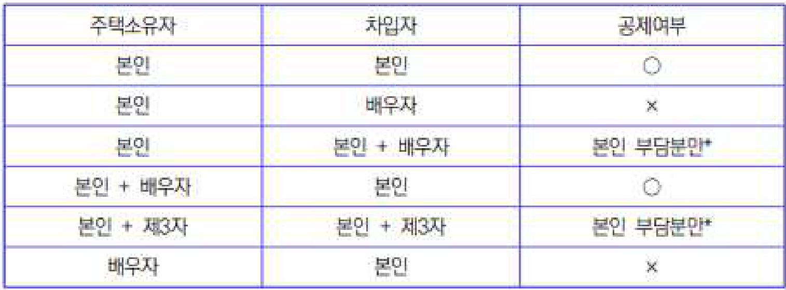
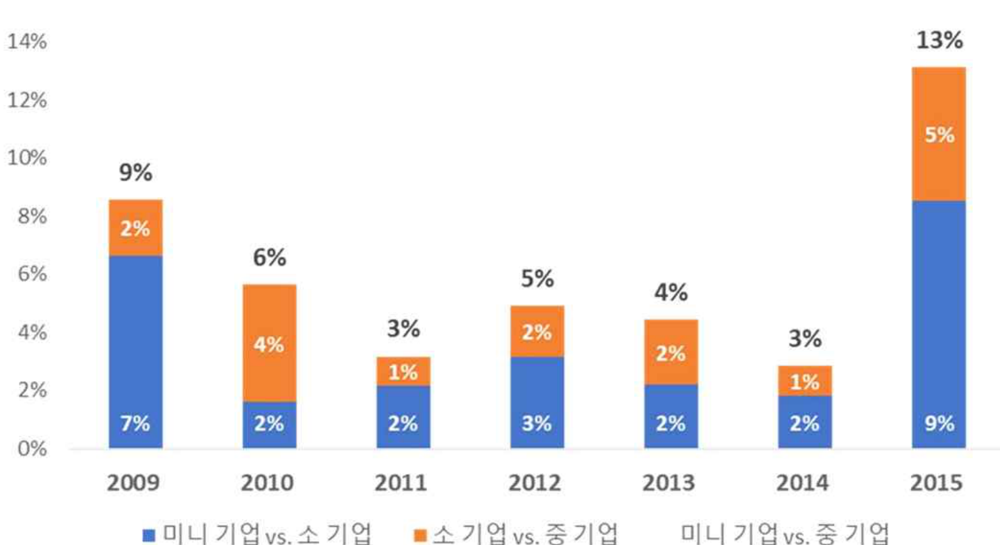

ESG 기반 4대 핵심 영역 포트폴리오

<<BLOCKEND>>

· 2022년까지 누적 투자 금액(성장 영역Inc. 직접 투자 자산)으로 합병 비용 포함 및 Divest 금액 제외

<<BLOCKEND>>

5. 주택을 소유한 사람과 차입금을 차입한 사람이 다를 경우에도 장기주택저당차입금
이자상환액 공제를 적용받을 수 있는지?

<<BLOCKEND>>

| 주택소유자 | 차입자 | 공제여부 |
| --- | --- | --- |
| 본인 | 본인 | ○ |
| 본인 | 배우자 | x |
| 본인 | 본인 + 배우자 | 본인 부담분만* |
| 본인 + 배우자 | 본인 |  |
| 본인 + 제3자 | 본인 + 제3자 | 본인 부담분만* |
| 배우자 | 본인 | x |

<<BLOCKEND>>

· 차입금을 타인과 공동으로 차입한 경우 본인의 채무부담분에 해당하는 이자상환액만 공제함, 별
도의 약정이 없는 경우에는 채무분담비율이 균등한 것으로 봄

<<BLOCKEND>>

규모별 월 급여 분석 (생산직)

<<BLOCKEND>>

Chart Type: bar
2009
2010
2011
2012
2013
2014
2015
item_01
9%
6%
3%
5%
4%
3%
13%

<<BLOCKEND>>