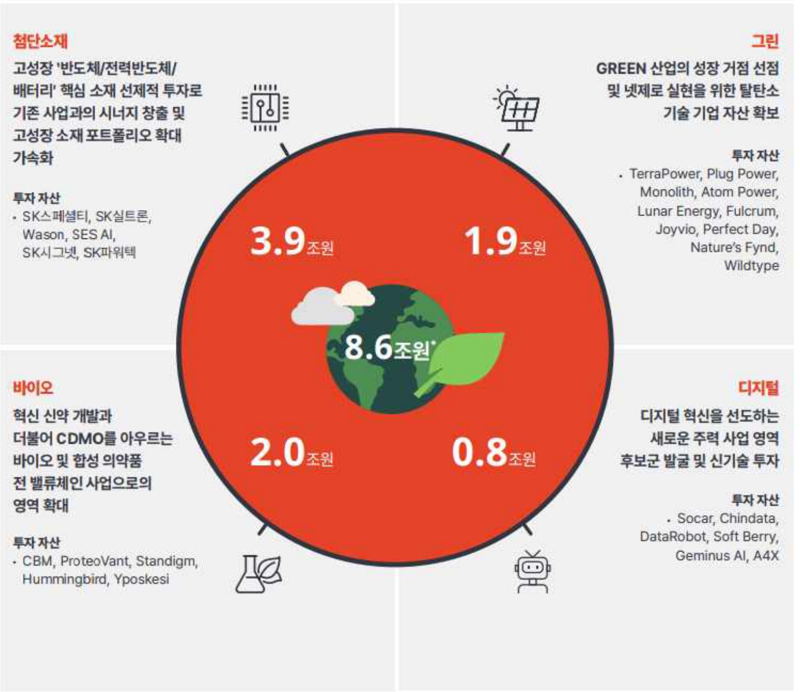
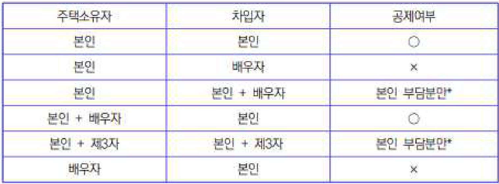
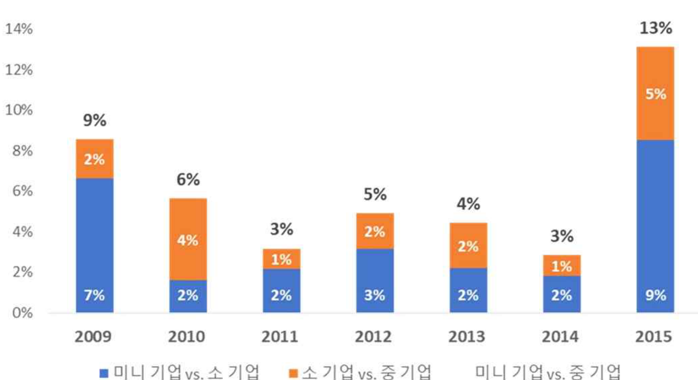

*첨단소재 그린
고성장 '반도체/전력반도체/ GREEN 산업의 성장 거점 선점
배터리' 핵심 소재 선제적 투자로 및 넷제로 실현을 위한 탈탄소
기존 사업과의 시너지 창출 및 기술 기업 자산 확보
고성장 소재 포트폴리오 확대
가속화 투자 자산
TerraPower, Plug Power,
Monolith, Atom Power,
투자자산
Lunar Energy, Fulcrum,
* SK스페셜티, SK실트론,
Joyvio, PerfectDay,
Wason, SES AI, 3.9 조원 1.9 조원 Nature's Fynd,
SK시그넷, SK파워텍
Wildtype
8.6조원
바이오 디지털
혁신 신약 개발과 디지털 혁신을 선도하는
더불어 CDMO를 아우르는 새로운 주력 사업 영역
바이오 및 합성 의약품 2.0 조원 0.8 조원 후보군 발굴 및 신기술 투자
전 밸류체인 사업으로의
영역 확대 투자 자산
Socar, Chindata,
DataRobot, Soft Berry,
투자자산
Geminus AI, A4X
· CBM, ProteoVant, Standigm, 0
Hummingbird, Yposkesi*

#### ESG 기반 4대 핵심 영역 포트폴리오

<<BLOCKEND>>

· 2022년까지 누적 투자 금액(성장 영역Inc. 직접 투자 자산)으로 합병 비용 포함 및 Divest 금액 제외

<<BLOCKEND>>

5. 주택을 소유한 사람과 차입금을 차입한 사람이 다를 경우에도 장기주택저당차입금
이자상환액 공제를 적용받을 수 있는지?

<<BLOCKEND>>

| 주택소유자 | 차입자 | 공제여부 |
| --- | --- | --- |
| 본인 | 본인 | ○ |
| 본인 | 배우자 | x |
| 본인 | 본인 + 배우자 | 본인 부담분만* |
| 본인 + 배우자 | 본인 |  |
| 본인 + 제3자 | 본인 + 제3자 | 본인 부담분만* |
| 배우자 | 본인 | x |

**주택 소유자와 차입자에 따른 공제여부는 아래와 같습니다.**

<<BLOCKEND>>

· 차입금을 타인과 공동으로 차입한 경우 본인의 채무부담분에 해당하는 이자상환액만 공제함, 별
도의 약정이 없는 경우에는 채무분담비율이 균등한 것으로 봄

<<BLOCKEND>>

규모별 월 급여 분석 (생산직)

<<BLOCKEND>>

#### Chart Type: bar

|  | 2009 | 2010 | 2011 | 2012 | 2013 | 2014 | 2015 |
| --- | --- | --- | --- | --- | --- | --- | --- |
| item_01 | 9% | 6% | 3% | 5% | 4% | 3% | 13% |

<<BLOCKEND>>